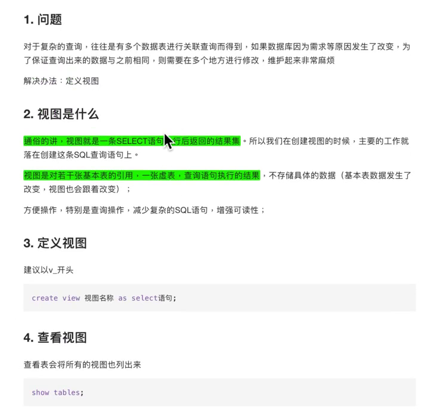
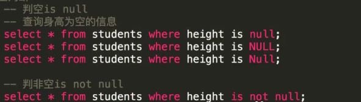

## 数据类型


## SQL语句

### 用户管理

##### 创建用户

`create user USERNAME@HOSTS identified by PASSWORD;`

```mysql
CREATE USER [IF NOT EXISTS]
    user [auth_option] [, user [auth_option]] ...
    DEFAULT ROLE role [, role ] ...
    [REQUIRE {NONE | tls_option [[AND] tls_option] ...}]
    [WITH resource_option [resource_option] ...]
    [password_option | lock_option] ...

user:
    (see Section 6.2.4, “Specifying Account Names”)

auth_option: {
    IDENTIFIED BY 'auth_string'
  | IDENTIFIED WITH auth_plugin
  | IDENTIFIED WITH auth_plugin BY 'auth_string'
  | IDENTIFIED WITH auth_plugin AS 'hash_string'
}

tls_option: {
   SSL
 | X509
 | CIPHER 'cipher'
 | ISSUER 'issuer'
 | SUBJECT 'subject'
}

resource_option: {
    MAX_QUERIES_PER_HOUR count
  | MAX_UPDATES_PER_HOUR count
  | MAX_CONNECTIONS_PER_HOUR count
  | MAX_USER_CONNECTIONS count
}

password_option: {
    PASSWORD EXPIRE [DEFAULT | NEVER | INTERVAL N DAY]
  | PASSWORD HISTORY {DEFAULT | N}
  | PASSWORD REUSE INTERVAL {DEFAULT | N DAY}
  | PASSWORD REQUIRE CURRENT [DEFAULT | OPTIONAL]
}

lock_option: {
    ACCOUNT LOCK
  | ACCOUNT UNLOCK
}
```

##### 修改用户

```mysql
ALTER USER [IF EXISTS]
    user [auth_option] [, user [auth_option]] ...
    [REQUIRE {NONE | tls_option [[AND] tls_option] ...}]
    [WITH resource_option [resource_option] ...]
    [password_option | lock_option] ...

ALTER USER [IF EXISTS] USER() user_func_auth_option

ALTER USER [IF EXISTS]
    user DEFAULT ROLE
    {NONE | ALL | role [, role ] ...}

user:
    (see Section 6.2.4, “Specifying Account Names”)

auth_option: {
    IDENTIFIED BY 'auth_string'
        [REPLACE 'current_auth_string']
        [RETAIN CURRENT PASSWORD]
  | IDENTIFIED WITH auth_plugin
  | IDENTIFIED WITH auth_plugin BY 'auth_string'
        [REPLACE 'current_auth_string']
        [RETAIN CURRENT PASSWORD]
  | IDENTIFIED WITH auth_plugin AS 'hash_string'
  | DISCARD OLD PASSWORD
}

user_func_auth_option: {
    IDENTIFIED BY 'auth_string'
        [REPLACE 'current_auth_string']
        [RETAIN CURRENT PASSWORD]
  | DISCARD OLD PASSWORD
}

tls_option: {
   SSL
 | X509
 | CIPHER 'cipher'
 | ISSUER 'issuer'
 | SUBJECT 'subject'
}

resource_option: {
    MAX_QUERIES_PER_HOUR count
  | MAX_UPDATES_PER_HOUR count
  | MAX_CONNECTIONS_PER_HOUR count
  | MAX_USER_CONNECTIONS count
}

password_option: {
    PASSWORD EXPIRE [DEFAULT | NEVER | INTERVAL N DAY]
  | PASSWORD HISTORY {DEFAULT | N}
  | PASSWORD REUSE INTERVAL {DEFAULT | N DAY}
  | PASSWORD REQUIRE CURRENT [DEFAULT | OPTIONAL]
}

lock_option: {
    ACCOUNT LOCK
  | ACCOUNT UNLOCK
}
```

##### 重命名

```mysql
RENAME USER old_user TO new_user
    [, old_user TO new_user] ...
```

##### 修改密码

```mysql
SET PASSWORD [FOR user] = 'auth_string'
    [REPLACE 'current_auth_string']
    [RETAIN CURRENT PASSWORD]
```

The [`SET PASSWORD`](https://dev.mysql.com/doc/refman/8.0/en/set-password.html) statement assigns a password to a MySQL user account. It may also include a password-verification clause that specifies the account current password to be replaced, and a clause that manages whether an account has a secondary password. **`'auth_string'`** and **`'current_auth_string'`** each represent a cleartext (unencrypted) password.

##### 删除用户

```mysql
DROP USER [IF EXISTS] user [, user] ...
```

##### 授权

```mysql
GRANT
    priv_type [(column_list)]
      [, priv_type [(column_list)]] ...
    ON [object_type] priv_level
    TO user_or_role [, user_or_role] ...
    [WITH GRANT OPTION]
    [AS user
        [WITH ROLE
            DEFAULT
          | NONE
          | ALL
          | ALL EXCEPT role [, role ] ...
          | role [, role ] ...
        ]
    ]
}

GRANT PROXY ON user_or_role
    TO user_or_role [, user_or_role] ...
    [WITH GRANT OPTION]

GRANT role [, role] ...
    TO user_or_role [, user_or_role] ...
    [WITH ADMIN OPTION]

object_type: {
    TABLE
  | FUNCTION
  | PROCEDURE
}

priv_level: {
    *
  | *.*
  | db_name.*
  | db_name.tbl_name
  | tbl_name
  | db_name.routine_name
}

user_or_role: {
    user
  | role
}

```

**Table 13.11 Permissible Static Privileges for GRANT and REVOKE**

| Privilege                                                    | Meaning and Grantable Levels                                 |
| ------------------------------------------------------------ | ------------------------------------------------------------ |
| [`ALL [PRIVILEGES]`](https://dev.mysql.com/doc/refman/8.0/en/privileges-provided.html#priv_all) | Grant all privileges at specified access level except [`GRANT OPTION`](https://dev.mysql.com/doc/refman/8.0/en/privileges-provided.html#priv_grant-option) and [`PROXY`](https://dev.mysql.com/doc/refman/8.0/en/privileges-provided.html#priv_proxy). |
| [`ALTER`](https://dev.mysql.com/doc/refman/8.0/en/privileges-provided.html#priv_alter) | Enable use of [`ALTER TABLE`](https://dev.mysql.com/doc/refman/8.0/en/alter-table.html). Levels: Global, database, table. |
| [`ALTER ROUTINE`](https://dev.mysql.com/doc/refman/8.0/en/privileges-provided.html#priv_alter-routine) | Enable stored routines to be altered or dropped. Levels: Global, database, routine. |
| [`CREATE`](https://dev.mysql.com/doc/refman/8.0/en/privileges-provided.html#priv_create) | Enable database and table creation. Levels: Global, database, table. |
| [`CREATE ROLE`](https://dev.mysql.com/doc/refman/8.0/en/privileges-provided.html#priv_create-role) | Enable role creation. Level: Global.                         |
| [`CREATE ROUTINE`](https://dev.mysql.com/doc/refman/8.0/en/privileges-provided.html#priv_create-routine) | Enable stored routine creation. Levels: Global, database.    |
| [`CREATE TABLESPACE`](https://dev.mysql.com/doc/refman/8.0/en/privileges-provided.html#priv_create-tablespace) | Enable tablespaces and log file groups to be created, altered, or dropped. Level: Global. |
| [`CREATE TEMPORARY TABLES`](https://dev.mysql.com/doc/refman/8.0/en/privileges-provided.html#priv_create-temporary-tables) | Enable use of [`CREATE TEMPORARY TABLE`](https://dev.mysql.com/doc/refman/8.0/en/create-table.html). Levels: Global, database. |
| [`CREATE USER`](https://dev.mysql.com/doc/refman/8.0/en/privileges-provided.html#priv_create-user) | Enable use of [`CREATE USER`](https://dev.mysql.com/doc/refman/8.0/en/create-user.html), [`DROP USER`](https://dev.mysql.com/doc/refman/8.0/en/drop-user.html), [`RENAME USER`](https://dev.mysql.com/doc/refman/8.0/en/rename-user.html), and [`REVOKE ALL PRIVILEGES`](https://dev.mysql.com/doc/refman/8.0/en/revoke.html). Level: Global. |
| [`CREATE VIEW`](https://dev.mysql.com/doc/refman/8.0/en/privileges-provided.html#priv_create-view) | Enable views to be created or altered. Levels: Global, database, table. |
| [`DELETE`](https://dev.mysql.com/doc/refman/8.0/en/privileges-provided.html#priv_delete) | Enable use of [`DELETE`](https://dev.mysql.com/doc/refman/8.0/en/delete.html). Level: Global, database, table. |
| [`DROP`](https://dev.mysql.com/doc/refman/8.0/en/privileges-provided.html#priv_drop) | Enable databases, tables, and views to be dropped. Levels: Global, database, table. |
| [`DROP ROLE`](https://dev.mysql.com/doc/refman/8.0/en/privileges-provided.html#priv_drop-role) | Enable roles to be dropped. Level: Global.                   |
| [`EVENT`](https://dev.mysql.com/doc/refman/8.0/en/privileges-provided.html#priv_event) | Enable use of events for the Event Scheduler. Levels: Global, database. |
| [`EXECUTE`](https://dev.mysql.com/doc/refman/8.0/en/privileges-provided.html#priv_execute) | Enable the user to execute stored routines. Levels: Global, database, routine. |
| [`FILE`](https://dev.mysql.com/doc/refman/8.0/en/privileges-provided.html#priv_file) | Enable the user to cause the server to read or write files. Level: Global. |
| [`GRANT OPTION`](https://dev.mysql.com/doc/refman/8.0/en/privileges-provided.html#priv_grant-option) | Enable privileges to be granted to or removed from other accounts. Levels: Global, database, table, routine, proxy. |
| [`INDEX`](https://dev.mysql.com/doc/refman/8.0/en/privileges-provided.html#priv_index) | Enable indexes to be created or dropped. Levels: Global, database, table. |
| [`INSERT`](https://dev.mysql.com/doc/refman/8.0/en/privileges-provided.html#priv_insert) | Enable use of [`INSERT`](https://dev.mysql.com/doc/refman/8.0/en/insert.html). Levels: Global, database, table, column. |
| [`LOCK TABLES`](https://dev.mysql.com/doc/refman/8.0/en/privileges-provided.html#priv_lock-tables) | Enable use of [`LOCK TABLES`](https://dev.mysql.com/doc/refman/8.0/en/lock-tables.html) on tables for which you have the [`SELECT`](https://dev.mysql.com/doc/refman/8.0/en/select.html) privilege. Levels: Global, database. |
| [`PROCESS`](https://dev.mysql.com/doc/refman/8.0/en/privileges-provided.html#priv_process) | Enable the user to see all processes with [`SHOW PROCESSLIST`](https://dev.mysql.com/doc/refman/8.0/en/show-processlist.html). Level: Global. |
| [`PROXY`](https://dev.mysql.com/doc/refman/8.0/en/privileges-provided.html#priv_proxy) | Enable user proxying. Level: From user to user.              |
| [`REFERENCES`](https://dev.mysql.com/doc/refman/8.0/en/privileges-provided.html#priv_references) | Enable foreign key creation. Levels: Global, database, table, column. |
| [`RELOAD`](https://dev.mysql.com/doc/refman/8.0/en/privileges-provided.html#priv_reload) | Enable use of [`FLUSH`](https://dev.mysql.com/doc/refman/8.0/en/flush.html) operations. Level: Global. |
| [`REPLICATION CLIENT`](https://dev.mysql.com/doc/refman/8.0/en/privileges-provided.html#priv_replication-client) | Enable the user to ask where master or slave servers are. Level: Global. |
| [`REPLICATION SLAVE`](https://dev.mysql.com/doc/refman/8.0/en/privileges-provided.html#priv_replication-slave) | Enable replication slaves to read binary log events from the master. Level: Global. |
| [`SELECT`](https://dev.mysql.com/doc/refman/8.0/en/privileges-provided.html#priv_select) | Enable use of [`SELECT`](https://dev.mysql.com/doc/refman/8.0/en/select.html). Levels: Global, database, table, column. |
| [`SHOW DATABASES`](https://dev.mysql.com/doc/refman/8.0/en/privileges-provided.html#priv_show-databases) | Enable [`SHOW DATABASES`](https://dev.mysql.com/doc/refman/8.0/en/show-databases.html) to show all databases. Level: Global. |
| [`SHOW VIEW`](https://dev.mysql.com/doc/refman/8.0/en/privileges-provided.html#priv_show-view) | Enable use of [`SHOW CREATE VIEW`](https://dev.mysql.com/doc/refman/8.0/en/show-create-view.html). Levels: Global, database, table. |
| [`SHUTDOWN`](https://dev.mysql.com/doc/refman/8.0/en/privileges-provided.html#priv_shutdown) | Enable use of [**mysqladmin shutdown**](https://dev.mysql.com/doc/refman/8.0/en/mysqladmin.html). Level: Global. |
| [`SUPER`](https://dev.mysql.com/doc/refman/8.0/en/privileges-provided.html#priv_super) | Enable use of other administrative operations such as [`CHANGE MASTER TO`](https://dev.mysql.com/doc/refman/8.0/en/change-master-to.html),[`KILL`](https://dev.mysql.com/doc/refman/8.0/en/kill.html), [`PURGE BINARY LOGS`](https://dev.mysql.com/doc/refman/8.0/en/purge-binary-logs.html), [`SET GLOBAL`](https://dev.mysql.com/doc/refman/8.0/en/set-variable.html), and [**mysqladmin debug**](https://dev.mysql.com/doc/refman/8.0/en/mysqladmin.html) command. Level: Global. |
| [`TRIGGER`](https://dev.mysql.com/doc/refman/8.0/en/privileges-provided.html#priv_trigger) | Enable trigger operations. Levels: Global, database, table.  |
| [`UPDATE`](https://dev.mysql.com/doc/refman/8.0/en/privileges-provided.html#priv_update) | Enable use of [`UPDATE`](https://dev.mysql.com/doc/refman/8.0/en/update.html). Levels: Global, database, table, column. |
| [`USAGE`](https://dev.mysql.com/doc/refman/8.0/en/privileges-provided.html#priv_usage) | Synonym for “no privileges”                                  |


**Table 13.12 Permissible Dynamic Privileges for GRANT and REVOKE**

| Privilege                                                    | Meaning and Grantable Levels                                 |
| ------------------------------------------------------------ | ------------------------------------------------------------ |
| [`APPLICATION_PASSWORD_ADMIN`](https://dev.mysql.com/doc/refman/8.0/en/privileges-provided.html#priv_application-password-admin) | Enable dual password administration. Level: Global.          |
| [`AUDIT_ADMIN`](https://dev.mysql.com/doc/refman/8.0/en/privileges-provided.html#priv_audit-admin) | Enable audit log configuration. Level: Global.               |
| [`BACKUP_ADMIN`](https://dev.mysql.com/doc/refman/8.0/en/privileges-provided.html#priv_backup-admin) | Enable backup administration. Level: Global.                 |
| [`BINLOG_ADMIN`](https://dev.mysql.com/doc/refman/8.0/en/privileges-provided.html#priv_binlog-admin) | Enable binary log control. Level: Global.                    |
| [`BINLOG_ENCRYPTION_ADMIN`](https://dev.mysql.com/doc/refman/8.0/en/privileges-provided.html#priv_binlog-encryption-admin) | Enable activation and deactivation of binary log encryption. Level: Global. |
| [`CONNECTION_ADMIN`](https://dev.mysql.com/doc/refman/8.0/en/privileges-provided.html#priv_connection-admin) | Enable connection limit/restriction control. Level: Global.  |
| [`ENCRYPTION_KEY_ADMIN`](https://dev.mysql.com/doc/refman/8.0/en/privileges-provided.html#priv_encryption-key-admin) | Enable `InnoDB` key rotation. Level: Global.                 |
| [`FIREWALL_ADMIN`](https://dev.mysql.com/doc/refman/8.0/en/privileges-provided.html#priv_firewall-admin) | Enable firewall rule administration, any user. Level: Global. |
| [`FIREWALL_USER`](https://dev.mysql.com/doc/refman/8.0/en/privileges-provided.html#priv_firewall-user) | Enable firewall rule administration, self. Level: Global.    |
| [`GROUP_REPLICATION_ADMIN`](https://dev.mysql.com/doc/refman/8.0/en/privileges-provided.html#priv_group-replication-admin) | Enable Group Replication control. Level: Global.             |
| [`PERSIST_RO_VARIABLES_ADMIN`](https://dev.mysql.com/doc/refman/8.0/en/privileges-provided.html#priv_persist-ro-variables-admin) | Enable persisting read-only system variables. Level: Global. |
| [`REPLICATION_SLAVE_ADMIN`](https://dev.mysql.com/doc/refman/8.0/en/privileges-provided.html#priv_replication-slave-admin) | Enable regular replication control. Level: Global.           |
| [`RESOURCE_GROUP_ADMIN`](https://dev.mysql.com/doc/refman/8.0/en/privileges-provided.html#priv_resource-group-admin) | Enable resource group administration. Level: Global.         |
| [`RESOURCE_GROUP_USER`](https://dev.mysql.com/doc/refman/8.0/en/privileges-provided.html#priv_resource-group-user) | Enable resource group administration. Level: Global.         |
| [`ROLE_ADMIN`](https://dev.mysql.com/doc/refman/8.0/en/privileges-provided.html#priv_role-admin) | Enable roles to be granted or revoked, use of `WITH ADMIN OPTION`. Level: Global. |
| [`SESSION_VARIABLES_ADMIN`](https://dev.mysql.com/doc/refman/8.0/en/privileges-provided.html#priv_session-variables-admin) | Enable setting restricted session system variables. Level: Global. |
| [`SET_USER_ID`](https://dev.mysql.com/doc/refman/8.0/en/privileges-provided.html#priv_set-user-id) | Enable setting non-self `DEFINER` values. Level: Global.     |
| [`SYSTEM_USER`](https://dev.mysql.com/doc/refman/8.0/en/privileges-provided.html#priv_system-user) | Designate account as system account. Level: Global.          |
| [`SYSTEM_VARIABLES_ADMIN`](https://dev.mysql.com/doc/refman/8.0/en/privileges-provided.html#priv_system-variables-admin) | Enable modifying or persisting global system variables. Level: Global. |
| [`TABLE_ENCRYPTION_ADMIN`](https://dev.mysql.com/doc/refman/8.0/en/privileges-provided.html#priv_table-encryption-admin) | Enable overriding default encryption settings. Level: Global. |
| [`VERSION_TOKEN_ADMIN`](https://dev.mysql.com/doc/refman/8.0/en/privileges-provided.html#priv_version-token-admin) | Enable use of Version Tokens UDFs. Level: Global.            |
| [`XA_RECOVER_ADMIN`](https://dev.mysql.com/doc/refman/8.0/en/privileges-provided.html#priv_xa-recover-admin) | Enable [`XA RECOVER`](https://dev.mysql.com/doc/refman/8.0/en/xa-statements.html) execution. Level: Global. |

##### 撤销权限

```mysql
REVOKE
    priv_type [(column_list)]
      [, priv_type [(column_list)]] ...
    ON [object_type] priv_level
    FROM user_or_role [, user_or_role] ...

REVOKE ALL [PRIVILEGES], GRANT OPTION
    FROM user_or_role [, user_or_role] ...

REVOKE PROXY ON user_or_role
    FROM user_or_role [, user_or_role] ...

REVOKE role [, role ] ...
    FROM user_or_role [, user_or_role ] ...

user_or_role: {
    user
  | role
}

```

##### 查询用户或角色权限

```mysql
SHOW GRANTS
    [FOR user_or_role
        [USING role [, role] ...]]

user_or_role: {
    user
  | role
}
```


##### 创建角色

```mysql
CREATE ROLE [IF NOT EXISTS] role [, role ] ...
```

##### 删除角色

```mysql
DROP USER [IF EXISTS] user [, user] ...
```

##### 设置用户默认的角色属性

```mysql
SET DEFAULT ROLE
    {NONE | ALL | role [, role ] ...}
    TO user [, user ] ...
```


##### 设置当前用户的角色

```mysql
SET ROLE {
    DEFAULT
  | NONE
  | ALL
  | ALL EXCEPT role [, role ] ...
  | role [, role ] ...
}
```

The statement permits these role specifiers:

- `DEFAULT`: Activate the account default roles. Default roles are those specified with [`SET DEFAULT ROLE`](https://dev.mysql.com/doc/refman/8.0/en/set-default-role.html).

  When a user connects to the server and authenticates successfully, the server determines which roles to activate as the default roles. If the [`activate_all_roles_on_login`](https://dev.mysql.com/doc/refman/8.0/en/server-system-variables.html#sysvar_activate_all_roles_on_login) system variable is enabled, the server activates all granted roles. Otherwise, the server executes [`SET ROLE DEFAULT`](https://dev.mysql.com/doc/refman/8.0/en/set-role.html) implicitly. The server activates only default roles that can be activated. The server writes warnings to its error log for default roles that cannot be activated, but the client receives no warnings.

  If a user executes [`SET ROLE DEFAULT`](https://dev.mysql.com/doc/refman/8.0/en/set-role.html) during a session, an error occurs if any default role cannot be activated (for example, if it does not exist or is not granted to the user). In this case, the current active roles are not changed.

- `NONE`: Set the active roles to `NONE` (no active roles).

- `ALL`: Activate all roles granted to the account.

- `ALL EXCEPT role [, role ] ...`: Activate all roles granted to the account except those named. The named roles need not exist or be granted to the account.

- `role [, role ] ...`: Activate the named roles, which must be granted to the account.

> **Note**
>
> [`SET DEFAULT ROLE`](https://dev.mysql.com/doc/refman/8.0/en/set-default-role.html) and [`SET ROLE DEFAULT`](https://dev.mysql.com/doc/refman/8.0/en/set-role.html) are different statements:
>
> - [`SET DEFAULT ROLE`](https://dev.mysql.com/doc/refman/8.0/en/set-default-role.html) defines which account roles to activate by default within account sessions.
> - [`SET ROLE DEFAULT`](https://dev.mysql.com/doc/refman/8.0/en/set-role.html) sets the active roles within the current session to the current account default roles.


### 数据库

#### 创建数据库

参看[MySQL DOC](https://dev.mysql.com/doc/refman/8.0/en/create-database.html)

```
CREATE {DATABASE | SCHEMA} [IF NOT EXISTS] db_name
    [create_option] ...

create_option: {
    [DEFAULT] CHARACTER SET [=] charset_name
  | [DEFAULT] COLLATE [=] collation_name
  | [DEFAULT] ENCRYPTION [=] {'Y' | 'N'}
}
```

> 注意：MySQL的utf8编码不是真正的utf8编码（原因是MySQL在utf8编码标准发布之前就支持`utf8`，而当时的utf8与标准不一样），所以如果要使用真正的utf8可以使用utf8mb4

> create schema 是 create database的别名。


#### 删除数据库


### 数据表


#### 外键

- 添加外键


- 删除外键


#### 视图




### 数据操作


#### 增加

##### 使用自动增长值的方式


##### 枚举的插入方式

- 使用数值


- 使用枚举值


##### `create....select`创建表同时插入数据


> 注意: 查询表的结果字段名必须和创建表中的字段名一样


#### 查询


##### 消除重复行


##### 模糊查询

######  `like`


`rlike`


##### 范围查询

- 非连续范围


- 不 非连续范围


- 连续范围


- 不在一个连续范围


- 空判断




##### 排序


##### 聚合函数


##### 分组


##### 分页


#####  连接查询


#### 删除

- 物理删除


- 逻辑删除


### mysql 内置函数

`select version()` 查看MySQL版本

`select now()` 显示当前时间

`select database()` 显示当前的数据库是哪个

`select user();` 查看当前登入的用户

`select @@tx_isolation;`查看当前事务的隔离级别

`show variables like 'autocommit';` 查看是否开启自动提交


### MySQL 储存引擎

#### 什么是存储引擎？

MySQL中的数据用各种不同的技术存储在文件(或者内存)中。这些技术中的每一种技术都使用不同的存储机制、索引技巧、锁定水平并且最终提供广泛的不同的功能和能力。通过选择不同的技术，你能够获得额外的速度或者功能，从而改善你的应用的整体功能。
例如，如果你在研究大量的临时数据，你也许需要使用内存MySQL存储引擎。内存存储引擎能够在内存中存储所有的表格数据。又或者，你也许需要一个支持事务处理的数据库(以确保事务处理不成功时数据的回退能力)。
**这些不同的技术以及配套的相关功能在 MySQL中被称作存储引擎(也称作表类型)。** MySQL默认配置了许多不同的存储引擎，可以预先设置或者在MySQL服务器中启用。你可以选择适用于服务器、数据库和表格的存储引擎，以便在选择如何存储你的信息、如何检索这些信息以及你需要你的数据结合什么性能和功能的时候为你提供最大的灵活性。

#### 查看MySQL支持的储存引擎

`show engines;`

#### 储存引擎

##### MyISAM

　　它不支持事务，也不支持外键，尤其是访问速度快，对事务完整性没有要求或者以SELECT、INSERT为主的应用基本都可以使用这个引擎来创建表。
每个MyISAM在磁盘上存储成3个文件，其中文件名和表名都相同，但是扩展名分别为：

- .frm(存储表定义)
- MYD(MYData，存储数据)
- MYI(MYIndex，存储索引)

　　数据文件和索引文件可以放置在不同的目录，平均分配IO，获取更快的速度。要指定数据文件和索引文件的路径，需要在创建表的时候通过DATA DIRECTORY和INDEX DIRECTORY语句指定，文件路径需要使用绝对路径。
　　每个MyISAM表都有一个标志，服务器或myisamchk程序在检查MyISAM数据表时会对这个标志进行设置。MyISAM表还有一个标志用来表明该数据表在上次使用后是不是被正常的关闭了。如果服务器以为当机或崩溃，这个标志可以用来判断数据表是否需要检查和修复。如果想让这种检查自动进行，可以在启动服务器时使用--myisam-recover现象。这会让服务器在每次打开一个MyISAM数据表是自动检查数据表的标志并进行必要的修复处理。MyISAM类型的表可能会损坏，可以使用CHECK TABLE语句来检查MyISAM表的健康，并用REPAIR TABLE语句修复一个损坏到MyISAM表。
　　MyISAM的表还支持3种不同的存储格式：

- 静态(固定长度)表
- 动态表
- 压缩表

　　其中静态表是默认的存储格式。静态表中的字段都是非变长字段，这样每个记录都是固定长度的，这种存储方式的优点是存储非常迅速，容易缓存，出现故障容易恢复；缺点是占用的空间通常比动态表多。静态表在数据存储时会根据列定义的宽度定义补足空格，但是在访问的时候并不会得到这些空格，这些空格在返回给应用之前已经去掉。同时需要注意：在某些情况下可能需要返回字段后的空格，而使用这种格式时后面到空格会被自动处理掉。
　　动态表包含变长字段，记录不是固定长度的，这样存储的优点是占用空间较少，但是频繁到更新删除记录会产生碎片，需要定期执行OPTIMIZE TABLE语句或myisamchk -r命令来改善性能，并且出现故障的时候恢复相对比较困难。
　　压缩表由myisamchk工具创建，占据非常小的空间，因为每条记录都是被单独压缩的，所以只有非常小的访问开支。

##### InnoDB

InnoDB是一个健壮的事务型存储引擎，这种存储引擎已经被很多互联网公司使用，为用户操作非常大的数据存储提供了一个强大的解决方案。我的电脑上安装的MySQL 5.6.13版，InnoDB就是作为默认的存储引擎。InnoDB还引入了行级锁定和外键约束，在以下场合下，使用InnoDB是最理想的选择：

1.更新密集的表。InnoDB存储引擎特别适合处理多重并发的更新请求。
2.事务。InnoDB存储引擎是支持事务的标准MySQL存储引擎。
3.自动灾难恢复。与其它存储引擎不同，InnoDB表能够自动从灾难中恢复。
4.外键约束。MySQL支持外键的存储引擎只有InnoDB。
5.支持自动增加列AUTO_INCREMENT属性。

一般来说，如果需要事务支持，并且有较高的并发读取频率，InnoDB是不错的选择。


##### MEMORY

使用MySQL Memory存储引擎的出发点是速度。为得到最快的响应时间，采用的逻辑存储介质是系统内存。虽然在内存中存储表数据确实会提供很高的性能，但当mysqld守护进程崩溃时，所有的Memory数据都会丢失。获得速度的同时也带来了一些缺陷。它要求存储在Memory数据表里的数据使用的是长度不变的格式，这意味着不能使用BLOB和TEXT这样的长度可变的数据类型，VARCHAR是一种长度可变的类型，但因为它在MySQL内部当做长度固定不变的CHAR类型，所以可以使用。

一般在以下几种情况下使用Memory存储引擎：

1.目标数据较小，而且被非常频繁地访问。在内存中存放数据，所以会造成内存的使用，可以通过参数max_heap_table_size控制Memory表的大小，设置此参数，就可以限制Memory表的最大大小。

2.如果数据是临时的，而且要求必须立即可用，那么就可以存放在内存表中。

3.存储在Memory表中的数据如果突然丢失，不会对应用服务产生实质的负面影响。

Memory同时支持散列索引和B树索引。B树索引的优于散列索引的是，可以使用部分查询和通配查询，也可以使用<、>和>=等操作符方便数据挖掘。散列索引进行“相等比较”非常快，但是对“范围比较”的速度就慢多了，因此散列索引值适合使用在=和<>的操作符中，不适合在<或>操作符中，也同样不适合用在order by子句中。

可以在表创建时利用USING子句指定要使用的版本。例如：

复制代码代码如下:
```mysql
create table users
(
    id smallint unsigned not null auto_increment,
    username varchar(15) not null,
    pwd varchar(15) not null,
    index using hash (username),
    primary key (id)
)engine=memory;
```

上述代码创建了一个表，在username字段上使用了HASH散列索引。下面的代码就创建一个表，使用BTREE索引。

 

复制代码代码如下:
```mysql
create table users
(
    id smallint unsigned not null auto_increment,
    username varchar(15) not null,
    pwd varchar(15) not null,
    index using btree (username),
    primary key (id)
)engine=memory;
```


##### MERGE

MERGE存储引擎是一组MyISAM表的组合，这些MyISAM表结构必须完全相同，尽管其使用不如其它引擎突出，但是在某些情况下非常有用。说白了，Merge表就是几个相同MyISAM表的聚合器；Merge表中并没有数据，对Merge类型的表可以进行查询、更新、删除操作，这些操作实际上是对内部的MyISAM表进行操作。Merge存储引擎的使用场景。

对于服务器日志这种信息，一般常用的存储策略是将数据分成很多表，每个名称与特定的时间端相关。例如：可以用12个相同的表来存储服务器日志数据，每个表用对应各个月份的名字来命名。当有必要基于所有12个日志表的数据来生成报表，这意味着需要编写并更新多表查询，以反映这些表中的信息。与其编写这些可能出现错误的查询，不如将这些表合并起来使用一条查询，之后再删除Merge表，而不影响原来的数据，删除Merge表只是删除Merge表的定义，对内部的表没有任何影响。

##### ARCHIVE

Archive是归档的意思，在归档之后很多的高级功能就不再支持了，仅仅支持最基本的插入和查询两种功能。在MySQL 5.5版以前，Archive是不支持索引，但是在MySQL 5.5以后的版本中就开始支持索引了。Archive拥有很好的压缩机制，它使用zlib压缩库，在记录被请求时会实时压缩，所以它经常被用来当做仓库使用。

存储引擎的一些问题

1.如何查看服务器有哪些存储引擎可以使用？
为确定你的MySQL服务器可以用哪些存储引擎，执行如下命令：

复制代码代码如下:

`show engines;`

这个命令就能搞定了。

 

2.如何选择合适的存储引擎？
（1）选择标准可以分为：
（2）是否需要支持事务；
（3）是否需要使用热备；
（4）崩溃恢复：能否接受崩溃；
（5）是否需要外键支持；
然后按照标准，选择对应的存储引擎即可。


## 事务

### 事务的四大特性(简称ACID)

- 原子性(Atomicity)
- 一致性(Consistency)
- 隔离性(Isolation)
- 持久性(Durability)


### 事务的隔离级别


| 事务隔离级别                 | 脏读 | 不可重复读 | 幻读 |
| ---------------------------- | ---- | ---------- | ---- |
| 读未提交（read-uncommitted） | 是   | 是         | 是   |
| 读已提交（read-committed）   | 否   | 是         | 是   |
| 可重复读（repeatable-read）  | 否   | 否         | 是   |
| 串行化（serializable）       | 否   | 否         | 否   |

1、 脏读：A，B两事务，A事务会读取到B事务未提交的数据，然后B因为某些原因回滚数据，所以A就读取了B没有提交的数据，也称脏数据。

2、 不可重复读：在A事务中对同一数据两次查询不一致，可能原因是在A事务提交之前B事务对该数据进行了更新操作

3、 幻读：类似于不可重复读，都是在一个事务周期内读的数据不一致，区别在于幻读是侧重于插入或者删除操作带来的影响，而不可重复读是编辑带来的影响


#### `Read Uncommited`(读取未提交内容)

在该隔离级别，所有事务都可以看到其他未提交事务的执行结果。本隔离级别很少用于实际应用，因为它的性能也不比其他级别好多少。读取未提交的数据，也被称之为脏读（Dirty Read）。

#### `Read Committed`(读取提交内容)

这是大多数数据库系统的默认隔离级别（但不是MySQL默认的）。它满足了隔离的简单定义：一个事务只能看见已经提交事务所做的改变。这种隔离级别 也支持所谓的不可重复读（Nonrepeatable Read），因为同一事务的其他实例在该实例处理期间可能会有新的commit，所以同一select可能返回不同结果。

#### Repeatable Read（可重读）

这是MySQL的默认事务隔离级别，它确保同一事务的多个实例在并发读取数据时，会看到同样的数据行。不过理论上，这会导致另一个棘手的问题：幻读 （Phantom Read）。简单的说，幻读指当用户读取某一范围的数据行时，另一个事务又在该范围内插入了新行，当用户再读取该范围的数据行时，会发现有新的“幻影” 行。InnoDB和Falcon存储引擎通过多版本并发控制（MVCC，Multiversion Concurrency Control）机制解决了该问题。

#### Serializable（可串行化）

这是最高的隔离级别，它通过强制事务排序，使之不可能相互冲突，从而解决幻读问题。简言之，它是在每个读的数据行上加上共享锁。在这个级别，可能导致大量的超时现象和锁竞争。


## 索引

### 索引是什么


### 索引目的


### 索引的使用


### 索引demo


## mysql 备份和恢复

- 备份

```
mysqldump -u 用户名 -p 数据库名 > 备份文件名
```

- 恢复

```
mysql -u 用户名 -p 新数据库名 < 备份文件名
```


## mysql 主从模式

### 1. 配置主从同步的基本步骤


### 2.  配置主从同步的方法

#### 1. 备份主服务器原有数据到从服务器

如果设置主从同步钱,主服务器已有大量数据,可以使用mysqldump进行数据备份并还原到从服务器以实现数据的复制.

#### 2. 配置主服务器

##### 1. 编辑`mysqld`的配置文件,设置`log_bin`和`server_id`


##### 2. 重启`mysql`服务

```
sudo service mysql restart
```


##### 3. 登入主服务器中的`mysql`, 创建用于从服务器同步数据使用的账号

- 创建slave账户用于同步数据库账户

```mysql
GRANT REPLICATION SLAVE ON *.* TO 'slave'@'%' identified by 'slave';
```

- 刷新

```mysql
flush privileges;
```


##### 4. 获取主服务器的二进制信息

```mysql
show master status;
```


File 为使用的日志文件名字, Position为使用的文件位置.这两个参数配置从服务器时需要用到


#### 3. 配置从服务器

##### 1. 编辑`mysql`配置文件`my.cnf` 或者`my.ini`

配置`server-id` 参数, **这个参数值与其他mysql服务器不能重复**


##### 2. 重启`mysql`服务

```
service mysql restart
```


##### 3. 设置连接master主服务器

```mysql
change master to master_host='s01', master_user='slave', master_password='slave', master_log_file='mysql-bin.000001', master_log_pos=120;
```

- master_host : 主服务器的IP地址
- master_log_file: 主服务器日志文件名
- master_log_pos : 主服务器日志文件的位置


##### 4. 开启同步, 查看同步状态

```
start slave; # 开启同步
show slave status \G; # 查看同步状态, \G参数表示切换显示方式
```

```
mysql> start slave;
Query OK, 0 rows affected (0.46 sec)

mysql> show slave status \G;
*************************** 1. row ***************************
               Slave_IO_State: Waiting for master to send event
                  Master_Host: s01
                  Master_User: slave
                  Master_Port: 3306
                Connect_Retry: 60
              Master_Log_File: mysql-bin.000002
          Read_Master_Log_Pos: 120
               Relay_Log_File: s02-relay-bin.000003
                Relay_Log_Pos: 283
        Relay_Master_Log_File: mysql-bin.000002
             Slave_IO_Running: Yes
            Slave_SQL_Running: Yes
              Replicate_Do_DB: 
          Replicate_Ignore_DB: 
           Replicate_Do_Table: 
       Replicate_Ignore_Table: 
      Replicate_Wild_Do_Table: 
  Replicate_Wild_Ignore_Table: 
                   Last_Errno: 0
                   Last_Error: 
                 Skip_Counter: 0
          Exec_Master_Log_Pos: 120
              Relay_Log_Space: 1466
              Until_Condition: None
               Until_Log_File: 
                Until_Log_Pos: 0
           Master_SSL_Allowed: No
           Master_SSL_CA_File: 
           Master_SSL_CA_Path: 
              Master_SSL_Cert: 
            Master_SSL_Cipher: 
               Master_SSL_Key: 
        Seconds_Behind_Master: 0
Master_SSL_Verify_Server_Cert: No
                Last_IO_Errno: 0
                Last_IO_Error: 
               Last_SQL_Errno: 0
               Last_SQL_Error: 
  Replicate_Ignore_Server_Ids: 
             Master_Server_Id: 1
                  Master_UUID: 654542dd-d2e1-11e9-81f9-080027b15ad1
             Master_Info_File: /data56/master.info
                    SQL_Delay: 0
          SQL_Remaining_Delay: NULL
      Slave_SQL_Running_State: Slave has read all relay log; waiting for the slave I/O thread to update it
           Master_Retry_Count: 86400
                  Master_Bind: 
      Last_IO_Error_Timestamp: 
     Last_SQL_Error_Timestamp: 
               Master_SSL_Crl: 
           Master_SSL_Crlpath: 
           Retrieved_Gtid_Set: 
            Executed_Gtid_Set: 
                Auto_Position: 0
1 row in set (0.00 sec)
```

下面这个显示为yes, 则表示开启成功


## Mysql 查询已连接的用户信息

终端输入:

```shell
mysqladmin -u root -p processlist
# 然后输入密码
```

## MySQL关闭指定的连接

先查询要关闭的连接的id,上述方法,然后终端输入:

```shell
mysqladmin -u rot -p kill 连接id
```


## mysql 查看建表语句

```shell
SHOW CREATE TABLE table_name
```


## MySQL查看储存过程

```shell
SHOW {PROCEDURE | FUNCTION} STATUS [LIKE ‘pattern’]
```

PROCEDURE和FUNCTION，分别表示查看存储过程和函数 
LIKE语句，表示匹配的名称


## MySQL查看储存过程创建语句

```shell
SHOW CREATE {PROCEDURE | FUNCTION} sp_name 
```


## MySQL 日志

### 查看MySQL配置文件的位置

```shell
mysqld --verbose --help | grep -A 1 'Default options'
```

### 开启日志

mysql有四种日志：

所有日志：general log

慢查询日志：slow log

二进制日志：binary log

错误日志：error log

windows下在my.ini里配置，linux下在my.cnf里配置。

general log记录用户所有的操作。

```
general_log_file    = /var/log/mysql/mysql.log
general_log         = 1
```

slow log记录查询时间超过规定时间的语句。

```
slow-query-log=1
slow_query_log_file="D:/mysql/logs/slow.log"
long_query_time=10 //规定的查询时间
```

通过 `show variables like "%slow%";`查看是否开启

binary log也叫作变更日志，主要用于记录修改数据或有可能引起数据改变的mysql语句，并且记录了语句发生时间、执行时长、操作的数据等等。所以说通过二进制日志可以查询mysql数据库中进行了哪些变化。一般大小体积上限为1G，**通过binary log可以恢复被删除的数据**。

```
log-bin="D:/mysql/logs/bin-log.log"
```

通过 `show variables like "%log_bin%";` 查看是否开启

error log记录错误日志

```
log-error="D:/mysql/logs/error.log"
```


## MySQL数据备份和恢复

下面将通过一些案例介绍如何使用MySQL提供的工具命令进行逻辑备份。使用 mysqldump 备份数据库，默认该工具会将SQL语句信息导出至标准输出，可以通过重定向将输出保存至文件：

（1）备份所有的数据库

` mysqldump -u root -p --all-databases > bak.sql`

（2）备份指定的数据库db1、db2以及db3

`mysqldump -u root -p --databases db1 db2 db3 > bak.sql`

（3）备份db数据库，当仅备份一个数据库时，--databases可以省略

`mysqldump -u root -p db4 > bak.sql`

`mysqldump -u root -p --databases db4 > bak.sql`

两者之间的差别在于不使用 --databases 选项，则备份输出信息中不会包含CREATE DATABASE或USE语句。不使用 --databases 选项备份的数据文件，在后期进行数据还原操作时，如果该数据库不存在，必须先创建该数据库。

使用mysql命令读取备份文件，实现数据还原功能：

`mysql -u root -p < bak.sql`

`mysql -u root -p db4 < bak.sq1`


### MySQL python driver

## 7.1 Connector/Python Connection Arguments

A connection with the MySQL server can be established using either the `mysql.connector.connect()` function or the `mysql.connector.MySQLConnection()` class:

```python
cnx = mysql.connector.connect(user='joe', database='test')
cnx = MySQLConnection(user='joe', database='test')
```

The following table describes the arguments that can be used to initiate a connection. An asterisk (*) following an argument indicates a synonymous argument name, available only for compatibility with other Python MySQL drivers. Oracle recommends not to use these alternative names.


**Table 7.1 Connection Arguments for Connector/Python**

| Argument Name                            | Default                                                      | Description                                                  |
| ---------------------------------------- | ------------------------------------------------------------ | ------------------------------------------------------------ |
| `user` (`username`*)                     |                                                              | The user name used to authenticate with the MySQL server.    |
| `password` (`passwd`*)                   |                                                              | The password to authenticate the user with the MySQL server. |
| `database` (`db`*)                       |                                                              | The database name to use when connecting with the MySQL server. |
| `host`                                   | 127.0.0.1                                                    | The host name or IP address of the MySQL server.             |
| `port`                                   | 3306                                                         | The TCP/IP port of the MySQL server. Must be an integer.     |
| `unix_socket`                            |                                                              | The location of the Unix socket file.                        |
| `auth_plugin`                            |                                                              | Authentication plugin to use. Added in 1.2.1.                |
| `use_unicode`                            | `True`                                                       | Whether to use Unicode.                                      |
| `charset`                                | `utf8`                                                       | Which MySQL character set to use.                            |
| `collation`                              | `utf8_general_ci`                                            | Which MySQL collation to use.                                |
| `autocommit`                             | `False`                                                      | Whether to [autocommit](https://dev.mysql.com/doc/refman/8.0/en/glossary.html#glos_autocommit) transactions. |
| `time_zone`                              |                                                              | Set the `time_zone` session variable at connection time.     |
| `sql_mode`                               |                                                              | Set the `sql_mode` session variable at connection time.      |
| `get_warnings`                           | `False`                                                      | Whether to fetch warnings.                                   |
| `raise_on_warnings`                      | `False`                                                      | Whether to raise an exception on warnings.                   |
| `connection_timeout`(`connect_timeout`*) |                                                              | Timeout for the TCP and Unix socket connections.             |
| `client_flags`                           |                                                              | MySQL client flags.                                          |
| `buffered`                               | `False`                                                      | Whether cursor objects fetch the results immediately after executing queries. |
| `raw`                                    | `False`                                                      | Whether MySQL results are returned as is, rather than converted to Python types. |
| `consume_results`                        | False                                                        | Whether to automatically read result sets.                   |
| `ssl_ca`                                 |                                                              | File containing the SSL certificate authority.               |
| `ssl_cert`                               |                                                              | File containing the SSL certificate file.                    |
| `ssl_disabled`                           | `False`                                                      | `True` disables SSL/TLS usage. Option added in Connector/Python 2.1.7. |
| `ssl_key`                                |                                                              | File containing the SSL key.                                 |
| `ssl_verify_cert`                        | `False`                                                      | When set to `True`, checks the server certificate against the certificate file specified by the `ssl_ca` option. Any mismatch causes a `ValueError` exception. |
| `ssl_verify_identity`                    | `False`                                                      | When set to `True`, additionally perform host name identity verification by checking the host name that the client uses for connecting to the server against the identity in the certificate that the server sends to the client. Option added in Connector/Python 8.0.14. |
| `force_ipv6`                             | `False`                                                      | When set to `True`, uses IPv6 when an address resolves to both IPv4 and IPv6. By default, IPv4 is used in such cases. |
| `dsn`                                    |                                                              | Not supported (raises `NotSupportedError` when used).        |
| `pool_name`                              |                                                              | Connection pool name. The pool name is restricted to alphanumeric characters and the special characters `.`, `_`, `*`, `$`, and `#`. The pool name must be no more than`pooling.CNX_POOL_MAXNAMESIZE` characters long (default 64). |
| `pool_size`                              | 5                                                            | Connection pool size. The pool size must be greater than 0 and less than or equal to `pooling.CNX_POOL_MAXSIZE` (default 32). |
| `pool_reset_session`                     | `True`                                                       | Whether to reset session variables when connection is returned to pool. |
| `compress`                               | `False`                                                      | Whether to use compressed client/server protocol.            |
| `converter_class`                        |                                                              | Converter class to use.                                      |
| `failover`                               |                                                              | Server failover sequence.                                    |
| `option_files`                           |                                                              | Which option files to read. Added in 2.0.0.                  |
| `option_groups`                          | `['client', 'connector_python']`                             | Which groups to read from option files. Added in 2.0.0.      |
| `allow_local_infile`                     | `True`                                                       | Whether to enable [`LOAD DATA LOCAL INFILE`](https://dev.mysql.com/doc/refman/8.0/en/load-data.html). Added in 2.0.0. |
| `use_pure`                               | `False` as of 8.0.11, and `True` in earlier versions. If only one implementation (C or Python) is available, then then the default value is set to enable the available implementation. | Whether to use pure Python or C Extension. If`use_pure=False` and the C Extension is not available, then Connector/Python will automatically fall back to the pure Python implementation. Can be set with*mysql.connector.connect()* but not*MySQLConnection.connect()*. Added in 2.1.1. |


### FAQS

#### mysql-connector-python出现Unread result found解决办法

开启游标缓存，会占用服务器的性能

方法一：

```python
config={
  'host':'127.0.0.1',#default localhost 
  'user':'root', 
  'password':'buaascse', 
  'port':3306 ,	# 默认即为3306 
  'database':'mobilephone',
  'charset':'utf8',	# 默认即为utf8
  'buffered': True, # 开启游标缓存
}  
try:  
	cnn = mysql.connector.connect(**config)  
except mysql.connector.Error as e:  
	print('connect fails!{}'.format(e))  
```


方法二：
```python
import mysql.connector

cnx = mysql.connector.connect()
# 只有这个特定的游标可以将结果放入缓冲区
cursor = cnx.cursor(**buffered=True**)

# 所有通过cnx2连接创建的游标都没默认为buffered游标
cnx2 = mysql.connector.connect(buffered=True)
```
这么做是把结果集缓存在服务器端，不知道数据量太大请求太多的时候会不会造成服务器端负荷过大卡死的情况。不过对于本地小项目来说肯定是没啥影响。

#### MySQL 浮点数插入表中后查询的值有误差

float类型可以存浮点数（即小数类型），但是float有个缺点的，当不指定小数位数的时候，那么它就会出现小数位数与想要的不一致，导致“报错”（此错误可能是位数不对，也可能是数值不对）。
备注：所以在创建浮点类型的时候必须指定小数位数，float(m,d)，m表示的是最大长度，d表示的显示的小数位数，所以在初始化的过程中指点一下即可。


MySQL 设置连接响应超时时间wait_timeout参数

```shell
set global interactive_timeout = 超时时间(单位：s)
set global wait_timeout = 超时时间(单位：s)
```

如果只设置当前连接可以去掉gobal