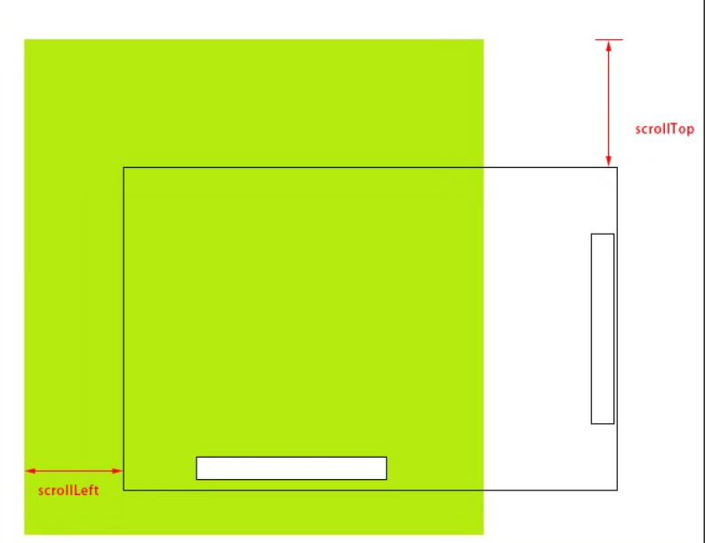
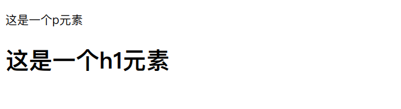

## JQuery 主要版本的区别

| 版本 | 描述                                                         |
| ---- | ------------------------------------------------------------ |
| 1.x  | 兼容ie678，使用最为广泛的，官方只做bug维护，功能不再新增。因此一般项目来说，使用1.x版本就可以了，最终版本：1.12.4 |
| 2.x  | 不兼容ie678，很少人使用，官方只做bug维护，功能不再新增。如果不考虑兼容版本低的浏览器可以使用2.x，最终版本：2.2.4 |
| 3.x  | 不兼容ie678，只支持最新的浏览器。除非特殊要求，一般不会使用3.x版本的，很多老的jQuery插件不支持这个版本。目前该版本是官方主要更新维护的版本。截至2018年6月13日，最新版本：3.3.1 |


## JQuery 引入

```html
<script type="text/javascript" src="js/jquery-1-12.4.min.js"></script>
```


## JQuery 加载

### 原生js `window.onload`和JQuery `ready`比较

`onload`是等待页面标签加载完，渲染完后再执行

`ready`是等待页面加载完后再执行

```html
<!DOCTYPE html>
<html lang="en">

<head>
    <meta charset="UTF-8">
    <meta name="viewport" content="width=device-width, initial-scale=1.0">
    <meta http-equiv="X-UA-Compatible" content="ie=edge">
    <title>jquery 加载</title>
    <script type="text/javascript" src="js/jquery-1.12.4.min.js"></script>
    <script>
        // 原生js 等待页面加载完全后执行
        window.onload = function() {
            var oDiv = document.getElementById("div1");
            alert('原生弹出的' + oDiv);
        }

        // 使用jQuery 等待页面加载完全后执行
        // ready 的完整写法
        /* $(document).ready(function() {
            var $div = $('#div1');
            alert('jquery弹出的' + $div);
        }); */
        // 结果表明jQuery的比js原生的先弹出

        // ready 的简写写法
        $(function() {
            var $div = $('#div1');
            alert('jQuery弹出的' + $div);
        })
    </script>
</head>

<body>
    <div id="div1"></div>
</body>

</html>
```


## jQuery选择器

**jquery用法思想一**
选择某个网页元素，然后对它进行某种操作

**jquery选择器**
jquery选择器可以快速地选择元素，选择规则和css样式相同，使用length属性判断是否选择成功。

```
$('#myId') //选择id为myId的网页元素
$('.myClass') // 选择class为myClass的元素
$('li') //选择所有的li元素
$('#ul1 li span') //选择id为为ul1元素下的所有li下的span元素
$('input[name=first]') // 选择name属性等于first的input元素
```

**对选择集进行过滤**

```
$('div').has('p'); // 选择包含p元素的div元素
$('div').not('.myClass'); //选择class不等于myClass的div元素
$('div').filter('.myClass'); //选择class等于myClass的div元素
$('div').eq(5); //选择第6个div元素
```

**选择集转移**

```
$('div').prev(); //选择div元素前面紧挨的同辈元素
$('div').prevAll(); //选择div元素之前所有的同辈元素
$('div').next(); //选择div元素后面紧挨的同辈元素
$('div').nextAll(); //选择div元素后面所有的同辈元素
$('div').parent(); //选择div的父元素
$('div').children(); //选择div的所有子元素
$('div').siblings(); //选择div的同级元素
$('div').find('.myClass'); //选择div内的class等于myClass的元素
```

**判断是否选择到了元素**
jquery有容错机制，即使没有找到元素，也不会出错，可以用length属性来判断是否找到了元素,length等于0，就是没选择到元素，length大于0，就是选择到了元素。

```
var $div1 = $('#div1');
var $div2 = $('#div2');
alert($div1.length); // 弹出1
alert($div2.length); // 弹出0
......
<div id="div1">这是一个div</div>
```


## jQuery样式操作

**jquery用法思想二**
同一个函数完成取值和赋值

**操作行间样式**

设置css样式既可以使用css原生样式名，也可以使用它对用驼峰命名

原生js无法获取行间未定义的css属性值，但jQuery可以获取

```
// 获取div的样式
$("div").css("width");
$("div").css("color");

//设置div的样式
$("div").css("width","30px");
$("div").css("height","30px");
$("div").css({fontSize:"30px",color:"red"});
```

**特别注意**
选择器获取的多个元素，获取信息获取的是第一个，比如：$("div").css("width")，获取的是第一个div的width。

**操作样式类名**

```
$("#div1").addClass("divClass2") //为id为div1的对象追加样式divClass2
$("#div1").removeClass("divClass")  //移除id为div1的对象的class名为divClass的样式
$("#div1").removeClass("divClass divClass2") //移除多个样式
$("#div1").toggleClass("anotherClass") //重复切换anotherClass样式
```


## 原生JS对象转JQuery对象

```
$(原生js对象)
```


## 绑定click事件

给元素绑定click事件，可以用如下方法：

```
$('#btn1').click(function(){

    // 内部的this指的是原生对象

    // 使用jquery对象用 $(this)

})
```

**获取元素的索引值**
有时候需要获得匹配元素相对于其同胞元素的索引位置，此时可以用index()方法获取

```
var $li = $('.list li').eq(1);
alert($li.index()); // 弹出1
......
<ul class="list">
    <li>1</li>
    <li>2</li>
    <li>4</li>
    <li>5</li>
    <li>6</li>
</ul>
```


## jQuery特殊效果

```
fadeIn() 淡入

    $btn.click(function(){

        $('#div1').fadeIn(1000,'swing',function(){
            alert('done!');
        });

    });

fadeOut() 淡出
fadeToggle() 切换淡入淡出
hide() 隐藏元素
show() 显示元素
toggle() 切换元素的可见状态
slideDown() 向下展开
slideUp() 向上卷起
slideToggle() 依次展开或卷起某个元素
```

解决多次点击某个toogle特效bug，在之前点击的特未完成的情况下，再次点击元素，不能立即响应，而是等待之前的特效完成之后再响应的情况

**调用toggle之前，先调用`stop()`方法停止当前的动画**

```js
$('div').stop().toggle();
```


## jQuery链式调用

jquery对象的方法会在执行完后返回这个jquery对象，所有jquery对象的方法可以连起来写：

```
$('#div1') // id为div1的元素
.children('ul') //该元素下面的ul子元素
.slideDown('fast') //高度从零变到实际高度来显示ul元素
.parent()  //跳到ul的父元素，也就是id为div1的元素
.siblings()  //跳到div1元素平级的所有兄弟元素
.children('ul') //这些兄弟元素中的ul子元素
.slideUp('fast');  //高度实际高度变换到零来隐藏ul元素
```


## jQuery动画

通过animate方法可以设置元素某属性值上的动画，可以设置一个或多个属性值，动画执行完成后会执行一个函数。

```
$('#div1').animate({
    width:300,   // 也可以使用带单位的值，但要引号包裹
    height:300
},1000,'swing',function(){
    alert('done!');
});
```

参数可以写成数字表达式：

```
$('#div1').animate({
    width:'+=100',
    height:300
},1000,'swing',function(){
    alert('done!');
});
```


## jQuery尺寸相关、滚动事件

1、获取和设置元素的尺寸

```
width()、height()    获取元素width和height  
innerWidth()、innerHeight()  包括padding的width和height  
outerWidth()、outerHeight()  包括padding和border的width和height  
outerWidth(true)、outerHeight(true)   包括padding和border以及margin的width和height
```

2、获取元素相对页面的绝对位置

```
offset()
```


3、获取浏览器可视区宽度高度

```
$(window).width();
$(window).height();
```

4、获取页面文档的宽度高度

```
$(document).width();
$(document).height();
```

5、获取页面滚动距离

```
$(document).scrollTop();  
$(document).scrollLeft();
```




6、页面滚动事件

```
$(window).scroll(function(){  
    ......  
})
```


设置页面滚动到顶部

```javascript
$('html,body').animate({'scrollTop': 0});
```


## jQuery属性操作

1、html() 取出或设置html内容

```
// 取出html内容

var $htm = $('#div1').html();

// 设置html内容

$('#div1').html('<span>添加文字</span>');
```

2、prop() 取出或设置某个属性的值

```
// 取出图片的地址

var $src = $('#img1').prop('src');

// 设置图片的地址和alt属性

$('#img1').prop({src: "test.jpg", alt: "Test Image" });
```


## jQuery循环

对jquery选择的对象集合分别进行操作，需要用到jquery循环操作，此时可以用对象上的each方法：

```js
$(function(){
    $('.list li').each(function(i){   // 参数为值的索引
        $(this).html(i);
    })
})
......
<ul class="list">
    <li></li>
    <li></li>
    <li></li>
    <li></li>
    <li></li>
    <li></li>
</ul>
```


## jQuery事件

**事件函数列表：**

```
blur() 元素失去焦点
focus() 元素获得焦点
click() 鼠标单击
mouseover() 鼠标进入（进入子元素也触发）
mouseout() 鼠标离开（离开子元素也触发）
mouseenter() 鼠标进入（进入子元素不触发）
mouseleave() 鼠标离开（离开子元素不触发）
hover() 同时为mouseenter和mouseleave事件指定处理函数
ready() DOM加载完成
resize() 浏览器窗口的大小发生改变
scroll() 滚动条的位置发生变化
submit() 用户递交表单
```

```html
// hover 事件
$('div').hover(function(){
	// 移入事件
}, function(){
	// 移出事件
})
```


**绑定事件的其他方式**

```
$(function(){
    $('#div1').bind('mouseover click', function(event) {
        alert($(this).html());
    });
});
```

**取消绑定事件**

```
$(function(){
    $('#div1').bind('mouseover click', function(event) {
        alert($(this).html());

        // $(this).unbind();
        $(this).unbind('mouseover');

    });
});
```


## 事件冒泡

**什么是事件冒泡**
在一个对象上触发某类事件（比如单击onclick事件），如果此对象定义了此事件的处理程序，那么此事件就会调用这个处理程序，如果没有定义此事件处理程序或者事件返回true，那么这个事件会向这个对象的父级对象传播，从里到外，直至它被处理（父级对象所有同类事件都将被激活），或者它到达了对象层次的最顶层，即document对象（有些浏览器是window）。

**事件冒泡的作用**
事件冒泡允许多个操作被集中处理（把事件处理器添加到一个父级元素上，避免把事件处理器添加到多个子级元素上），它还可以让你在对象层的不同级别捕获事件。

**阻止事件冒泡**
事件冒泡机制有时候是不需要的，需要阻止掉，通过 event.stopPropagation() 来阻止

```
$(function(){
    var $box1 = $('.father');
    var $box2 = $('.son');
    var $box3 = $('.grandson');
    $box1.click(function() {
        alert('father');
    });
    $box2.click(function() {
        alert('son');
    });
    $box3.click(function(event) {
        alert('grandson');
        event.stopPropagation();

    });
    $(document).click(function(event) {
        alert('grandfather');
    });
})

......

<div class="father">
    <div class="son">
        <div class="grandson"></div>
    </div>
</div>
```

**阻止默认行为**
阻止表单提交

```
$('#form1').submit(function(event){
    event.preventDefault();
})
```

**合并阻止操作**
实际开发中，一般把阻止冒泡和阻止默认行为合并起来写，合并写法可以用

```
// event.stopPropagation();
// event.preventDefault();

// 合并写法：
return false;
```


## 事件委托

事件委托就是利用冒泡的原理，把事件加到父级上，通过判断事件来源的子集，执行相应的操作，事件委托首先可以极大减少事件绑定次数，提高性能；其次可以让新加入的子元素也可以拥有相同的操作。

**一般绑定事件的写法**

```
$(function(){
    $ali = $('#list li');
    $ali.click(function() {
        $(this).css({background:'red'});
    });
})
...
<ul id="list">
    <li>1</li>
    <li>2</li>
    <li>3</li>
    <li>4</li>
    <li>5</li>
</ul>
```

**事件委托的写法**

```
$(function(){
    $list = $('#list');
    $list.delegate('li', 'click', function() {
        $(this).css({background:'red'});
    });
})
...
<ul id="list">
    <li>1</li>
    <li>2</li>
    <li>3</li>
    <li>4</li>
    <li>5</li>
</ul>
```


## JQuery元素节点操作

**创建节点**

```
var $div = $('<div>');
var $div2 = $('<div>这是一个div元素</div>');
```

**插入节点**
1、append()和appendTo()：在现存元素的内部，从后面插入元素

```
var $span = $('<span>这是一个span元素</span>');
$('#div1').append($span);
......
<div id="div1"></div>
```

`append()` 和 `appendTo()`的区别

````javascript
$a = $('<div>待插入的元素<div>')
$b = $('#div1') // 被插入的元素

// 将a插入b内部的最后面
// 使用append
$b.append($a)

// 使用appendTo
$a.appendTo($b)

````


2、prepend()和prependTo()：在现存元素的内部，从前面插入元素

3、after()和insertAfter()：在现存元素的外部，从后面插入元素

4、before()和insertBefore()：在现存元素的外部，从前面插入元素


**除了对新建节点进行上述操作外，他们还能对已有节点进行操作**

```html
<!DOCTYPE html>
<html lang="en">
<head>
	<meta charset="UTF-8">
	<title>JQuery对已有节点进行操作</title>
	<script type="text/javascript" src="js/jquery-1.12.4.min.js"></script>
	<script type="text/javascript">
		$(function(){
            // 将p1插入到title01前
			$('#p1').insertBefore($('title01'));
		})
	</script>
</head>
<body>
	<h1 id="title01">这是一个h1元素</h1>
	<p id="p1">这是一个p元素</p>
</body>
</html>
```



**删除节点**

```
$('#div1').remove();
```


## 滚轮事件与函数节流

**jquery.mousewheel插件使用**
jquery中没有鼠标滚轮事件，原生js中的鼠标滚轮事件不兼容，可以使用jquery的滚轮事件插件jquery.mousewheel.js。

```html
<!DOCTYPE html>
<html lang="en">

<head>
    <meta charset="UTF-8">
    <title>鼠标滚轮事件</title>
    <script src="js/jquery-1.12.4.min.js"></script>
    <script src="js/jquery.mousewheel.js"></script>
    <script type="text/javascript">
        // 鼠标滚轮事件
        $(window).mousewheel(function(event, dat) {
            alert(dat); // dat是区分上滑、下滑的值，为1或-1，不同的浏览器可以得到的值不同
        })
    </script>
</head>

<body>

</body>

</html>
```


**函数节流**
javascript中有些事件的触发频率非常高，比如onresize事件(jq中是resize)，onmousemove事件(jq中是mousemove)以及上面说的鼠标滚轮事件，在短事件内多处触发执行绑定的函数，可以巧妙地使用定时器来减少触发的次数，实现函数节流。

案例：整屏滑动

```html
<!DOCTYPE html>
<html lang="en">

<head>
    <meta charset="UTF-8">
    <title>整页滚动</title>
    <link rel="stylesheet" type="text/css" href="css/test.css">
    <script type="text/javascript" src="js/jquery-1.12.4.min.js"></script>
    <script type="text/javascript" src="js/jquery.mousewheel.js"></script>
    <script type="text/javascript">
        $(function () {
            var $screen = $('.pages_con');
            var $pages = $('.pages');
            var $screens = $pages.length;
            var $browserHeight = $(window).height();
            // 储存定时器
            var timer = null;
            // 当前屏幕位置
            var $nowscreen = 0;
            // 小圆点
            var $points = $('.points li');

            // 设置每一屏的高度
            $('.pages').css('height', $browserHeight);
            // 当窗口变化时，重新设置
            $(window).resize(function () {
                $browserHeight = $(window).height();
                $('.pages').css('height', $browserHeight);
                $screen.css({
                    'top': -$browserHeight * $nowscreen
                });
            });

            // 设置小圆点点击事件
            $points.click(function () {
                $nowscreen = $(this).index();
                $screen.animate({
                    'top': -$browserHeight * $nowscreen
                }, 300);
                $pages.eq($nowscreen).addClass('moving').siblings().removeClass('moving');
                $points.eq($nowscreen).addClass('active').siblings().removeClass('active');

            });

            // 设置第一次进入网页的首页动画
            $pages.eq(0).addClass('moving');
            $(window).mousewheel(function (event, dat) {
                // ------------------运用函数节流------------------
                // 清除之前未完成的整屏滑动
                clearTimeout(timer);
                timer = setTimeout(function () {
                    if (dat == -1) {
                        $nowscreen++;
                    } else {
                        $nowscreen--;
                    }

                    if ($nowscreen < 0) {
                        $nowscreen = 0;
                    }
                    else if ($nowscreen > $screens - 1) {
                        $nowscreen = $screens - 1;
                    }
                    $screen.animate({
                        'top': -$browserHeight * $nowscreen
                    }, 300);
                    $pages.eq($nowscreen).addClass('moving').siblings().removeClass('moving');
                    $points.eq($nowscreen).addClass('active').siblings().removeClass('active');
                }, 200);
            });

        });
    </script>
</head>

<body>
    <div class="pages_con">

        <div class="pages page1">
            <div class="main_con">
                <div class="left_img"></div>
                <div class="right_info">
                    Web前端开发是从网页制作演变而来的，名称上有很明显的时代特征。在互联网的演化进程中，网页制作是Web1.0时代的产物，那时网站的主要内容都是静态的，用户使用网站的行为也以浏览为主。

                </div>
            </div>
        </div>

        <div class="pages page2">
            <div class="main_con">
                <div class="right_img"></div>
                <div class="left_info">
                    2005年以后，互联网进入Web2.0时代，各种类似桌面软件的Web应用大量涌现，网站的前端由此发生了翻天覆地的变化。网页不再只是承载单一的文字和图片，各种富媒体让网页的内容更加生动，网页上软件化的交互形式为用户提供了更好的使用体验，这些都是基于前端技术实现的。
                </div>
            </div>

        </div>

        <div class="pages page3">
            <div class="main_con">
                <div class="left_img"></div>
                <div class="right_info">
                    以前会Photoshop和Dreamweaver就可以制作网页，现在只掌握这些已经远远不够了。无论是开发难度上，还是开发方式上，现在的网页制作都更接近传统的网站后台开发，所以现在不再叫网页制作，而是叫Web前端开发。


                </div>
            </div>
        </div>

        <div class="pages page4">
            <div class="main_con">
                <div class="left_img"></div>
                <div class="right_info">
                    Web前端开发在产品开发环节中的作用变得越来越重要，而且需要专业的前端工程师才能做好，这方面的专业人才近几年来备受青睐。Web前端开发是一项很特殊的工作，涵盖的知识面非常广，既有具体的技术，又有抽象的理念。简单地说，它的主要职能就是把网站的界面更好地呈现给用户。
                </div>
            </div>
        </div>

        <div class="pages page5">
            <div class="main_con">
                <div class="center_img"></div>
            </div>

        </div>
    </div>
    <ul class="points">
        <li class="active"></li>
        <li></li>
        <li></li>
        <li></li>
        <li></li>
    </ul>
</body>

</html>
```


## json

json是 JavaScript Object Notation 的首字母缩写，单词的意思是javascript对象表示法，这里说的json指的是类似于javascript对象的一种数据格式，目前这种数据格式比较流行，逐渐替换掉了传统的xml数据格式。

javascript自定义对象：

```
var oMan = {
    name:'tom',
    age:16,
    talk:function(s){
        alert('我会说'+s);
    }
}
```

json格式的数据：

```
{
    "name":"tom",
    "age":18
}
```

与json对象不同的是，json数据格式的属性名称和字符串值需要用双引号引起来，用单引号或者不用引号会导致读取数据错误。

json的另外一个数据格式是数组，和javascript中的数组字面量相同。

```
["tom",18,"programmer"]
```


## ajax与jsonp

ajax技术的目的是让javascript发送http请求，与后台通信，获取数据和信息。ajax技术的原理是实例化xmlhttp对象，使用此对象与后台通信。ajax通信的过程不会影响后续javascript的执行，从而实现异步。

**同步和异步**
现实生活中，同步指的是同时做几件事情，异步指的是做完一件事后再做另外一件事，程序中的同步和异步是把现实生活中的概念对调，也就是程序中的异步指的是现实生活中的同步，程序中的同步指的是现实生活中的异步。

**局部刷新和无刷新**
ajax可以实现局部刷新，也叫做无刷新，无刷新指的是整个页面不刷新，只是局部刷新，ajax可以自己发送http请求，不用通过浏览器的地址栏，所以页面整体不会刷新，ajax获取到后台数据，更新页面显示数据的部分，就做到了页面局部刷新。

**同源策略**
ajax请求的页面或资源只能是同一个域下面的资源，不能是其他域的资源，这是在设计ajax时基于安全的考虑。特征报错提示：

```
XMLHttpRequest cannot load https://www.baidu.com/. No  
'Access-Control-Allow-Origin' header is present on the requested resource.  
Origin 'null' is therefore not allowed access.
```

**$.ajax使用方法**
常用参数：
1、url 请求地址
2、type 请求方式，默认是'GET'，常用的还有'POST'
3、dataType 设置返回的数据格式，常用的是'json'格式，也可以设置为'html'
4、data 设置发送给服务器的数据
5、success 设置请求成功后的回调函数
6、error 设置请求失败后的回调函数
7、async 设置是否异步，默认值是'true'，表示异步

以前的写法：

```
$.ajax({
    url: 'js/data.json',
    type: 'GET',
    dataType: 'json',
    data:{'aa':1}
    success:function(data){
        alert(data.name);
    },
    error:function(){
        alert('服务器超时，请重试！');
    }
});
```

新的写法(推荐)：

```
$.ajax({
    url: 'js/data.json',
    type: 'GET',
    dataType: 'json',
    data:{'aa':1}
})
.done(function(data) {
    alert(data.name);
})
.fail(function() {
    alert('服务器超时，请重试！');
});

// data.json里面的数据： {"name":"tom","age":18}
```

**ajax get请求简写**

```js
$.get('/js/data.json', function(data){
	// 回调函数
})
```


**ajax post请求简写**

```js
$.post('/js/data.json', {'data': 'post上传的数据'}, function(data){
    // 回调函数
})
```


**课堂练习**
制作首页用户信息读取

**jsonp**
ajax只能请求同一个域下的数据或资源，有时候需要跨域请求数据，就需要用到jsonp技术，jsonp可以跨域请求数据，它的原理主要是利用了<script>标签可以跨域链接资源的特性。jsonp和ajax原理完全不一样，不过jquery将它们封装成同一个函数。

```
$.ajax({
    url:'js/data.js',
    type:'get',
    dataType:'jsonp',
    jsonpCallback:'fnBack'
})
.done(function(data){
    alert(data.name);
})
.fail(function() {
    alert('服务器超时，请重试！');
});

// data.js里面的数据： fnBack({"name":"tom","age":18});
```

**课堂实例**
获取360搜索关键词联想数据

```
$(function(){
    $('#txt01').keyup(function(){
        var sVal = $(this).val();
        $.ajax({
            url:'https://sug.so.360.cn/suggest?',
            type:'get',
            dataType:'jsonp',
            data: {word: sVal}
        })
        .done(function(data){
            var aData = data.s;
            $('.list').empty();
            for(var i=0;i<aData.length;i++)
            {
                var $li = $('<li>'+ aData[i] +'</li>');
                $li.appendTo($('.list'));
            }
        })        
    })
})

//......

<input type="text" name="" id="txt01">
<ul class="list"></ul>
```


## 本地存储

本地存储分为cookie，以及新增的localStorage和sessionStorage

### 1、cookie 存储在本地，容量最大4k，在同源的http请求时携带传递，损耗带宽，可设置访问路径，只有此路径及此路径的子路径才能访问此cookie，在设置的过期时间之前有效。

```
jquery 设置cookie, 默认单位为(天)
$.cookie('mycookie','123',{expires:7,path:'/'});
jquery 获取cookie
$.cookie('mycookie');
```

**3.创建一个cookie并设置 cookie的有效路径**

```
$.cookie(``'the_cookie'``, ``'the_value'``, { expires: 7, path: ``'/'` `});
```

在默认情况下，只有设置 cookie的网页才能读取该 cookie。如果想让一个页面读取另一个页面设置的cookie，必须设置cookie的路径。cookie的路径用于设置能够读取 cookie的顶级目录。将这个路径设置为网站的根目录，可以让所有网页都能互相读取 cookie （一般不要这样设置，防止出现冲突）。

**4.读取cookie**

```
$.cookie(``'the_cookie'``);
```

5.删除cookie

```
$.cookie(``'the_cookie'``, ``null``); ``//通过传递null作为cookie的值即可
```

**6.可选参数**

```
$.cookie(``'the_cookie'``,``'the_value'``,{` ` ``expires:7, ` ` ``path:``'/'``,` ` ``domain:``'jquery.com'``,` ` ``secure:``true` `})　 
```

**7.参数**

expires：（Number|Date）有效期；设置一个整数时，单位是天；也可以设置一个日期对象作为Cookie的过期日期；

path：（String）创建该Cookie的页面路径；

domain：（String）创建该Cookie的页面域名；

secure：（Booblean）如果设为true，那么此Cookie的传输会要求一个安全协议，例如：HTTPS；

**课堂实例**
只提示一次的弹框

### 2、localStorage 存储在本地，容量为5M或者更大，不会在请求时候携带传递，在所有同源窗口中共享，数据一直有效，除非人为删除，可作为长期数据。

```
//设置：
localStorage.setItem("dat", "456");
localStorage.dat = '456';

//获取：
localStorage.getItem("dat");
localStorage.dat

//删除
localStorage.removeItem("dat");
```

### 3、sessionStorage 存储在本地，容量为5M或者更大，不会在请求时候携带传递，在同源的当前窗口关闭前有效。

localStorage 和 sessionStorage 合称为Web Storage , Web Storage支持事件通知机制，可以将数据更新的通知监听者，Web Storage的api接口使用更方便。

iPhone的无痕浏览不支持Web Storage，只能用cookie。


## jqueryUI

jQuery UI是以 jQuery 为基础的代码库。包含底层用户交互、动画、特效和可更换主题的可视控件。我们可以直接用它来构建具有很好交互性的web应用程序。

**jqueryUI 网址**
http://jqueryui.com/

使部件可以随意拖动

```js
$('.box').draggable();  // 使含有类 box 的元素可以随意拖动
```

可以指定参数限制拖动范围，并设置拖动响应事件

案例： 滑动条

```html

<!DOCTYPE html>
<html lang="en">
<head>
	<meta charset="UTF-8">
	<title>drag</title>
	<script type="text/javascript" src="js/jquery-1.12.4.min.js"></script>
	<script type="text/javascript" src="js/jquery-ui.min.js"></script>
	<script type="text/javascript">
		$(function(){
			$('.dragbar').draggable({
				axis:'x',

				containment:'parent',
				//containment:[0,0,600,0]
				
				//设置拖动时候的透明度
				opacity:0.6,
				
                // 拖动响应事件
				drag:function(ev,ui){
					//console.log(ui.position.left);

					//获取拖动的距离					
					var nowleft = ui.position.left;
					$('.progress').css({width:nowleft});
					$('.slide_count').val(parseInt(nowleft*100/570));
				}

			});
		})
	</script>
	<style type="text/css">
		.slidebar_con{
			width:650px;
			height:32px;
			margin:50px auto 0;
		}

		.slidebar{
			width:600px;
			height:30px;
			border:1px solid #ccc;			
			float:left;
			position:relative;
		}

		.slidebar .dragbar{
			width:30px;
			height:30px;
			background-color:gold;
			cursor:pointer;
			position:absolute;
			left:0;
			top:0;
		}

		.slidebar .progress{
			width:0px;
			height:30px;
			background-color:#f0f0f0;
			position:absolute;
			left:0;
			top:0;
		}

		.slide_count{
			padding:0;
			float:right;
			width:40px;
			height:30px;
			border:1px solid #ccc;
			text-align:center;
			font-size:16px;
		}

	</style>
</head>
<body>
	<div class="slidebar_con">
		<div class="slidebar">
			<div class="progress"></div>
			<div class="dragbar"></div>
		</div>
		<input type="text" name="" value="0" class="slide_count">
	</div>
</body>
</html>
```


案例： 自定义滚动条

```html

<!DOCTYPE html>
<html lang="en">
<head>
	<meta charset="UTF-8">
	<title>自定义滚动条</title>
	<script type="text/javascript" src="js/jquery-1.12.4.min.js"></script>
	<script type="text/javascript" src="js/jquery-ui.min.js"></script>
	<script type="text/javascript">
		$(function(){

			var h = $('.paragraph').outerHeight();

			//整体文本的高度减去外面容器的高度
			var hide = h-500;

			$('.scroll_bar').draggable({
				axis:'y',
				containment:'parent',
				opacity:0.6,
				drag:function(ev,ui){
					var nowtop = ui.position.top;
					var nowscroll = parseInt(nowtop/290*hide);
					$('.paragraph').css({top:-nowscroll});
				}

			});


		})

	</script>
	<style type="text/css">
		.scroll_con{
			width:400px;
			height:500px;
			border:1px solid #ccc;
			margin:50px auto 0;
			position:relative;
			overflow:hidden;
		}

		.paragraph{
			width:360px;
			position:absolute;
			left:0;
			top:0;
			padding:10px 20px;
			font-size:14px;
			font-family:'Microsoft Yahei';
			line-height:32px;
			text-indent:2em;
		}

		.scroll_bar_con{
			width:10px;
			height:490px;
			position:absolute;
			right:5px;
			top:5px;
		}

		.scroll_bar{
			width:10px;
			height:200px;
			background-color:#ccc;
			position:absolute;
			left:0;
			top:0;
			cursor:pointer;
			border-radius:5px;

		}


	

	</style>
</head>
<body>
	<div class="scroll_con">
		<div class="paragraph">
			2005年以后，互联网进入Web2.0时代，各种类似桌面软件的Web应用大量涌现，网站的前端由此发生了翻天覆地的变化。网页不再只是承载单一的文字和图片，各种富媒体让网页的内容更加生动，网页上软件化的交互形式为用户提供了更好的使用体验，这些都是基于前端技术实现的。以前会Photoshop和Dreamweaver就可以制作网页，现在只掌握这些已经远远不够了。无论是开发难度上，还是开发方式上，现在的网页制作都更接近传统的网站后台开发，所以现在不再叫网页制作，而是叫Web前端开发。Web前端开发在产品开发环节中的作用变得越来越重要，而且需要专业的前端工程师才能做好，这方面的专业人才近几年来备受青睐。Web前端开发是一项很特殊的工作，涵盖的知识面非常广，既有具体的技术，又有抽象的理念。简单地说，它的主要职能就是把网站的界面更好地呈现给用户。
			掌握HTML是网页的核心，是一种制作万维网页面的标准语言，是万维网浏览器使用的一种语言，它消除了不同计算机之间信息交流的障碍。因此，它是目前网络上应用最为广泛的语言，也是构成网页文档的主要语言，学好HTML是成为Web开发人员的基本条件。
学好CSS是网页外观的重要一点，CSS可以帮助把网页外观做得更加美观。
学习JavaScript的基本语法，以及如何使用JavaScript编程将会提高开发人员的个人技能。
了解Unix和Linux的基本知识虽然这两点很基础，但是开发人员了解Unix和Linux的基本知识是有益无害的。
了解Web服务器当你对Apache的基本配置，htaccess配置技巧有一些掌握的话，将来必定受益，而且这方面的知识学起来也相对容易。

		</div>
		<div class="scroll_bar_con">
			<div class="scroll_bar">
		</div>

		
	</div>
	
	</div>

	

	
</body>
</html>
```


## zeptojs

Zepto是一个轻量级的针对现代高级浏览器的JavaScript库， 它与jquery有着类似的api。 如果你会用jquery，那么你也会用zepto。Zepto的一些可选功能是专门针对移动端浏览器的；它的最初目标是在移动端提供一个精简的类似jquery的js库。

zepto官网：http://zeptojs.com/
zepto中文api：http://www.css88.com/doc/zeptojs_api/
zepto包含很多模块，默认下载版本包含的模块有Core, Ajax, Event, Form, IE模块，如果还需要其他的模块，可以自定义构建。
zepto自定义构建地址：http://github.e-sites.nl/zeptobuilder/


## swiper

swiper.js是一款成熟稳定的应用于PC端和移动端的滑动效果插件，一般用来触屏焦点图、触屏整屏滚动等效果。 swiper分为2.x版本和3.x版本，2.x版本支持低版本浏览器(IE7)，3.x放弃支持低版本浏览器，适合应用在移动端。

2.x版本中文网址：http://2.swiper.com.cn/
3.x版本中文网地址：http://www.swiper.com.cn/

### swiper使用方法：

```
<script type="text/javascript" src="js/swiper.min.js"></script>

<!--
  如果页面引用了jquery或者zepto，就引用 swiper.jquery.min.js,它的容量比swiper.min.js

  <script src="path/to/swiper.jquery.min.js"></script>
-->

......

<link rel="stylesheet" type="text/css" href="css/swiper.min.css">
......

<div class="swiper-container">
  <div class="swiper-wrapper">
    <div class="swiper-slide">slider1</div>
    <div class="swiper-slide">slider2</div>
    <div class="swiper-slide">slider3</div>
  </div>
    <div class="swiper-pagination"></div>
    <div class="swiper-button-prev"></div>
    <div class="swiper-button-next"></div>
</div>

<script> 
var swiper = new Swiper('.swiper-container', {
    pagination: '.swiper-pagination',
  prevButton: '.swiper-button-prev',
  nextButton: '.swiper-button-next',
    initialSlide :1,
  paginationClickable: true,
  loop: true,
  autoplay:3000,
  autoplayDisableOnInteraction:false
});
</script>
```

### swiper使用参数：

1、initialSlide：初始索引值，从0开始
2、direction：滑动方向 horizontal | vertical
3、speed：滑动速度，单位ms
4、autoplay：设置自动播放及播放时间
5、autoplayDisableOnInteraction：用户操作swipe后是否还自动播放，默认是true，不再自动播放
6、pagination：分页圆点
7、paginationClickable：分页圆点是否点击
8、prevButton：上一页箭头
9、nextButton：下一页箭头
10、loop：是否首尾衔接