Java 数据类型

Java数据类型分为基本数据类型和引用数据类型

## 基本数据类型

基本数据类型只有8中，可分为：

①整数类型：`long`，`int`，`short`，`byte`

②浮点类型：`float`，`double`

③字符类型：`char`

④布尔类型：`boolean`

| No.  |      数据类型      | 大小/位 |              可表示数据范围              |  默认值  |
| :--: | :----------------: | :-----: | :--------------------------------------: | :------: |
|  1   |  `byte`（字节型）  |    8    |                 -128~127                 |    0     |
|  2   | `short`（短整型）  |   16    |               -32768~32767               |    0     |
|  3   |   `int`（整型）    |   32    |          -2147483648~2147483647          |    0     |
|  4   |  `long`（长整型）  |   64    | -9223372036854775808~9223372036854775807 |    0     |
|  5   | `float`（单精度）  |   32    |              -3.4E38~3.4E38              |   0.0    |
|  6   | `double`（双精度） |   64    |             -1.7E308~1.7E308             |   0.0    |
|  7   |   `char`（字符）   |   16    |                  0~255                   | '\u0000' |
|  8   | `boolean`（布尔）  |    -    |               true或false                |  false   |


## 引用数据类型

引用数据类型非常多，大致包括：

类、接口类型、数组类型、枚举类型、注解类型、字符串类型

简单来说，所有非基本数据了类型就是引用类型。


## 基本数据类型和引用数据类型的区别

### 1. 储存位置

#### 基本数据类型

- 在方法中定义非全局基本数据类型变量的具体内容是储存在栈中的

#### 引用变量类型

- 只要是引用数据类型变量，其具体内容都是存放在堆中，而栈中的存放的是其具体内容的引用地址


### 2. 传递方式

基本变量类型

- 在方法中定义的非全局基本数据类型变量，调用方法时作为参数是按值传递的。

引用变量类型

- 引用数据类型变量，调用方法时作为参数时引用传递的。


# Java 修饰符

## 访问修饰符

| 修饰符      | 当前类 | 同一包内 | 子孙类(同一包) | 子孙类(不同包)                                               | 其他包 |
| :---------- | :----- | :------- | :------------- | :----------------------------------------------------------- | :----- |
| `public`    | Y      | Y        | Y              | Y                                                            | Y      |
| `protected` | Y      | Y        | Y              | Y/N（[说明](https://blog.csdn.net/justloveyou_/article/details/61672133)） | N      |
| `default`   | Y      | Y        | Y              | N                                                            | N      |
| `private`   | Y      | N        | N              | N                                                            | N      |

> *java的访问控制是停留在编译层的，也就是它不会在.class文件中留下任何的痕迹，只在编译的时候进行访问控制的检查。其实，通过反射的手段，是可以访问任何包下任何类中的成员，例如，访问类的私有成员也是可能的。*


## `protected`

很多介绍Java语言的书籍(包括《Java编程思想》)都对protected介绍的比较的简单，基本都是一句话，就是:被protected修饰的成员对于本包和其子类可见。这种说法有点太过含糊，常常会对大家造成误解。实际上，protected的可见性在于两点：

- 基类的protected成员是包内可见的，并且对子类可见；

- 若子类与基类不在同一包中，那么在子类中，子类实例可以访问其从基类继承而来的protected方法，而不能访问基类实例的protected方法。

protected 需要从以下两个点来分析说明：

- **子类与基类在同一包中**：被声明为 protected 的变量、方法和构造器能被同一个包中的任何其他类访问；
- **子类与基类不在同一包中**：那么在子类中，子类实例可以访问其从基类继承而来的 protected 方法，而不能访问基类实例的protected方法。

protected 可以修饰数据成员，构造方法，方法成员，**不能修饰类（内部类除外）**。

详细：

- https://blog.csdn.net/justloveyou_/article/details/61672133

- https://blog.csdn.net/asahinokawa/article/details/80777302

> 理解：protected方法调用合法性取决于调用者所在类与方法从根源上看所在的类共包或者是其直接子类。


## 非访问修饰符


## 修饰符顺序

1：访问权限标识：public private protected (default)

2：static 静态 ；abstract 抽象方法/类

3：final 常量；【可选，不能和abstract共存】

4：返回值类型【方法】

5：方法名/变量名

建议顺序：

```
public protected private abstract static final transient volatile synchronized native strictfp interface
```

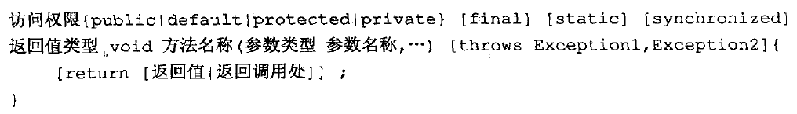


# Java 泛型

## 一. 引子

- 一般的类和方法，只能使用具体类型：要么是基本类型，要么是自定义类型。如果要编写可以应用于多种类型的代码，这种刻板的限制对代码的束缚就会很大。
- 多态 算是一种泛化机制，但对代码的约束还是太强（要么继承父类，要么实现接口）。
- 有许多原因促成了泛型的出现，而最重要的一个原因，就是为了 更安全友好的使用容器类 : 用来指定容器要持有什么类型的对象，而且由编译器来保证类型的正确性。

---

　例如，在 Java 加入泛型特性前，ArrayList 只维护一个 Object 类型的数组：

```java
public class ArrayList{
   private Object[] elementData;
   ...
   public Object get(int i){ ... }
   public void add(Object o){ ... }
   ...
}
```


​    

　显然，这样的实现存在两个问题： 

　(1). 当获取一个值时，必须进行强制类型转换：

```java
ArrayList list = new ArrayList();
...
String str = (String)list.get(0);
```


​    

　(2). 该 ArrayList 没有错误检查，即可以向数组中添加任何类型的对象：

```java
list.add(new Integer(1));
```


​    

　　向上述的动态数组中添加一个整型对象，程序在编译时和运行时都不会出错。但当我们强制将 get 结果转型时，就会抛出 ClassCastException 异常，程序出错。对于容器类，它是可以存储任何对象的，但我们在使用时，一次只想也只应该向其中放入一种对象。基于这种需求，提出了 类型参数化 的概念，即泛型。　

---

## 二. 泛型基础

1.概念

- 
**术语**：适用于许多许多的类型;

- 
**本质**：实现类型参数化的概念，使代码可以应用于多种类型;

- 
**核心**：告诉编译器想使用什么类型（指定具体类型参数或对其进行限制），然后编译器帮你处理一切细节(类型安全检查等);

---

- 
**泛型初衷**

(1). 希望类或方法具备最广泛的表达能力，即通过解耦类或方法与所使用的类型之间的约束；

(2). 对容器类而言，泛型在保证容器类可以存储任何类型对象的同时，又保证了容器类一旦声明自己将要保存的元素类型时，就不可再保存其他类型了，例如：

```java
ArrayList<Fruit> list = new ArrayList<Fruit>();

fruits.add(new Fruit());     // OK
fruits.add(new Apple());     // OK
fruits.add(new Orange());     // OK

fruits.add(new Object());     // Error
```


​    

　  上述代码表明了该容器只能保存 Fruit类型 的对象，由于 Apple 也是一种 Fruit，所以其也可以保存 Apple类型 对象，但对于不属于 Fruit类型 的对象，编译器杜绝将其放入列表中。

---

　　简单地说：泛型 = 编译时的类型检查 + 编译时的类型擦除(编译器插入 checkcast 等) + 运行时的自动类型转换。所以，我们在理解和应用泛型时，一定要从 编译期 和 运行时 两个视角去分析。

---

- **类型参数推断：**当使用泛型类时，必须在创建对象的时候指定类型参数的值；而使用泛型方法时，通常不必指明参数类型（编译器类型参数推断的能力是有限的，有时我们必须显式的指明类型参数；但大多数情况下，编译器可以胜任这项任务），因为编译器会为我们找出具体类型(如 例1 所示)。但是编译器的类型推导能力是有限的，这种情况下，我们必须进行显式的类型实例化(如 例2 所示)。

---

例1：

　　在 Java 1.7 以后，我们可以这样创建一个ArrayList:

```java
ArrayList<String> list = new ArrayList<>;
```


​    

　　list 变量的类型就决定了它引用的动态数组所能存储的元素类型，即后者的类型参数可以从变量中推断出。

---

　例2：

```java
public class TypeInference {

    public static <E> Set<E> union(Set<? extends E> s1, Set<? extends E> s2) {
        Set<E> result = new HashSet<E>(s1);
        result.addAll(s2);
        return result;
    }

    public static void main(String[] args) {
        Set<Integer> integers = new HashSet<Integer>();
        Set<Double> doubles = new HashSet<Double>();
        Set<Number> numbers = null;

        //编译器的类型推断能力有限
        numbers = TypeInference.union(integers, doubles);    // Error
        numbers = TypeInference.<Number>union(integers, doubles);   // OK
    }
}
```


​    

　　如例2所示，为 numbers 赋值时需要显式对类型参数实例化。

---

2、定义与语法

- 泛型类（参数化类）

    ```java
    public class Holder<T>{}
    ```

    

- 泛型接口（参数化接口）

    ```java
    public interface Generator<T>{}
    ```

    

    

- 泛型方法（参数化方法；所在类可以是泛型类，也可以不是；能够独立于类而产生变化；细粒度）

    ```java
    public <T> void f(T x){}
    ```

    

    

---

3.注意事项

　(1). 只有当你希望使用的参数类型比某个具体类型（以及它的所有子类型）更加泛化时————也就是说，**当你的代码能够跨多个类工作时，使用泛型才有所帮助；否则，使用多态就可以满足要求。**

```java
public class HasF {
  public void f(){...}
}

//以下两种实现方式所取得的效果是一样的

//泛型实现
class Manipulator1<T extends HasF>{
  private T obj;
  public Manipulator1(T x){
    this.obj = x;
  }
  public void manipulate(){
    obj.f();
  }
}

//多态实现
class Manipulator2{
  private HasF obj;
  public Manipulator2(HasF x){
    this.obj = x;
  }
  public void manipulate(){
    obj.f();
  }
}
```


​    

---

　(2). 泛型类的识别(误区)

　先看下面两段代码：

```java
// 第一段代码
public class Pair<T> {
    private T first;
    private T second;

    public Pair(T first, T second){
        this.first = first;
        this.second = second;
    }
    public void setFirst(T first){
        this.first = first;
    }
    public T getFirst(){
        return first;
    }
    public void setSecond(T second){
        this.second = second;
    }
    public T getSecond(){
        return second;
    }
}
```


​    

```java
// 第二段代码
public class DateInterval extends Pair<Date> {     // 时间间隔类
    public DateInterval(Date first, Date second){
        super(first, second);
    }

    @Override
    public void setSecond(Date second) {
        super.setSecond(second);
    }
    @Override
    public Date getSecond(){
        return super.getSecond();
    }
}
```


​    

　 　由泛型类的定义可知，Pair<T> 是一个泛型类，因为在类名后面有类型参数；类DateInterval 后面没有跟类型参数列表，因此该类就是一个 T 被替换为 Date 的实体类，其从Pair<Date>继承得到的方法列表，与泛型彻底无关。

---

　(3). 对泛型类LinkedList<T>的类型参数T实例化所得到的不同泛型类型的理解

　　下图中，LinkedList<String>、LinkedList<Point> 和 LinkedList<PolyLine>是三种不同的类型，就像 Integer 和 String 一样，是两种互不相同的类型。但是，三者共享同一个 Class 对象。换句话说，三者在运行期的类型是一样的，但在编译期根据类型参数的不同成为截然不同的类型。下面代码可为例证。 


```java
public class TestClassTypes {
  public static void main(String[] args) {

  LinkedList<String> proverbs = new LinkedList<>();
  LinkedList<Object> numbers = new LinkedList<>();

   System.out.println("numbers class name: " + numbers.getClass().getName());  // Output: java.util.LinkedList
   System.out.println("proverbs class name: " + proverbs.getClass().getName()); // Output: java.util.LinkedList
   System.out.println("Compare Class objects: " + numbers.getClass().equals(proverbs.getClass()));     // Output:true


   // 由于 LinkedList<String> 与 LinkedList<Object> 在编译期根本就是不同类型，所以下面代码编译不能通过：
   proverbs = (LinkedList<String>)numbers;  // 类似于：把 Integer 类型实例强制转型为 String实例 赋给 String引用 


   // 每个类都是 Object 的子类
   Object obj = (Object)numbers;
   System.out.println("obj class name " + obj.getClass().getName());  // Output: java.util.LinkedList

   //  会有转型安全的异常
   proverbs = (LinkedList<String>)obj;
   System.out.println("obj in proverbs class name " + obj.getClass().getName()); // Output:java.util.LinkedList
  }
}
```


​    

---

　(4). 在泛型类中， static 域或方法无法访问泛型类的类型参数(类型实例化所得的所有泛型类型共享同一个Class对象)；若静态方法需要使用泛型能力，就必须使其成为泛型方法（不与泛型类共享类型参数）。

　　在一个类中，static域或方法都是该类的Class对象的成员，而我们知道泛型所创造出来的所有类型都共享一个 Calss对象， 因此实质上不受泛型参数限制，所以如下代码根本不能通过编译:

```java
public class Test2<T> {    
    public static T one;   //编译错误   
    public static  T show(T one){   //编译错误    
        return null;    
    }    
}    
```


​    

　　但是要注意区分下面的一种情况：

```java
public class Test2<T> {    
    public static <T> T show(T one){//这是正确的    
        return null;    
    }    
}  
```


​    

　　因为这是一个泛型方法，在泛型方法中使用的 类型参数T 是自己在方法中定义的T，而不是泛型类中的 T。

---

　(5). 限制泛型可用的类型

　　在定义泛型类时，预设可以使用任何的类型来实例化泛型类中的类型。但是，如果想要限制使用泛型的类型时，即要求只能使用某个特定类型或其子类型才能实例化该类型时，使用 extends 关键字指定这个类型必须是继承或者实现某个接口。一般地，当没有指定泛型继承的类型或实现的接口时，默认等价于使用 T extends Object，因此，默认情形下任何类型都可以作为参数插入。特别地，为类型参数设定的**第一个边界可以是类类型或接口类型,类型参数的第一个边界之后的任意额外边界都只能是接口类型，同时，一般将标记性接口放到靠后位置,这些类型参数之间有 & 相连接**。

```java
publc class MyClass<T extends Number & Serilizable>{
    ...
}
```


​    

---

- 
在调用泛型方法的时候，可以指定泛型，也可以不指定泛型

　在不指定泛型的情况下，泛型变量的类型为该方法中的几种类型的同一个父类的最小级，直到Object; 在指定泛型的时候，该方法中的几种类型必须是该泛型实例类型或者其子类。

```java
//代码示例
public class Test2{  
    public static void main(String[] args) {  

        /**不指定泛型的时候*/  
        Integer i = Test2.add(1, 2);   //这两个参数都是Integer，所以T为Integer类型  
        Number f = Test2.add(1, 1.2);  //这两个参数一个是Integer，一个是Double，所以取同一父类的最小级，为Number  
        Object o = Test2.add(1, "asd");  //这两个参数一个是Integer，一个是String，所以取同一父类的最小级，为Object  

        System.out.println(i.getClass().getName());   //输出： java.lang.Integer
        System.out.println(f.getClass().getName());   //输出： java.lang.Double
        System.out.println(o.getClass().getName());   //输出： java.lang.String

        /**指定泛型的时候*/  
        int a = Test2.<Integer>add(1, 2);  //指定了Integer，所以只能为Integer类型或者其子类  
        int b = Test2.<Integer>add(1, 2.2);  //编译错误，指定了Integer，不能为Double
        Number c = Test2.<Number>add(1, 2.2);  //指定为Number，所以可以为Integer和Double  
    }  

    //这是一个简单的泛型方法  
    public static <T> T add(T x,T y){  
        return y;  
    }  
} 
```


​    

　　注意，这个例子中的两个输出是java.lang.Double和java.lang.String，而不是java.lang.Number 和 java.lang.Object：

```java
System.out.println(f.getClass().getName());   //输出： java.lang.Double
System.out.println(o.getClass().getName());   //输出： java.lang.String
```


​    

　　实际上，这个问题涉及泛型机制和多态两点。在例子中，类型参数T被编译器用Number替换，这是没问题的，因为无论整形还是浮点型都属于数型，这是由多态机制保证的。但是，无论x还是y，它们本质上还是各自的类型不会发生任何改变。要注意的是，这里的getClass()方法返回的变量的实际类型，即运行时类型而非编译时类型，因此返回y的类型是double而非number。

---

(6). 泛型的兼容性

- **从泛型类型生成的任何类型的引用都能存储到对应的原生类型的变量中**

    ```java
    LinkedList list = new LinkedList<String>();
    ```

    

　　这样编写代码是合法兼容的，但是，不应该将这作为日常编程习惯的一部分,因为这种实践存在固有的风险：由于 类型安全性检查是针对引用的，所以上述写法和如下写法实质上是一样的：

```java
LinkedList list = new LinkedList();
```


​    

---

- 从原生类型生成的引用能存储到任何类型的泛型类型的变量中

    ```java
    LinkedList<String> list1 = new LinkedList();
    LinkedList<Integer> list2 = new LinkedList();
    ```

    

    

　　这样编写代码是合法兼容的，但是，由于我们可以将一个已经原生的 LinkedList对象 直接赋值此类引用，虽然在之后在添加元素是会进行类型安全检查，但之前的 LinkedList对象 所存储的元素可能五花八门，给程序带来隐患。具体请参照下图：

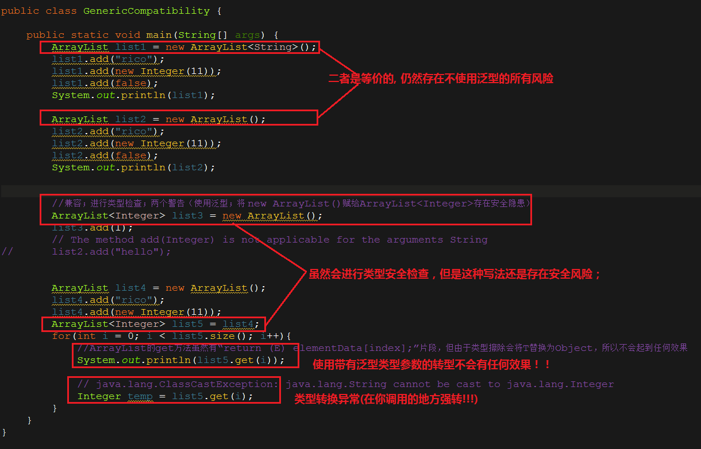

---

(7). primitive（基本数据）类型不可以作为类型参数（八大类型）

---

(8). 若使用泛型方法可以取代将整个类泛型化，那么就应该使用泛型方法

---

(9). 泛型方法与可变参数列表可以很好的共存

```java
public static <T> void f(T... args){}
```


​    

---

## 三. 通配符及泛型的逆变和协变

1、 通配符

(1).无界通配符

　　我们知道，通过为泛型类的每个类型形参提供类型实参,可以表达由这个泛型类定义的集合中的特定类型。例如，为了指定存储 String 的 ArrayList，就需要将类型参数设定为 String，所以动态数组类型就是ArrayList<String>。若不想为泛型类的类型参数提供具体类型,可以将参数设定为 “?”，这就是通配符的作用, 通配符类型可以表示任何类或接口类型。

```java
        ArrayList<?> list  = new ArrayList<String>();
        list  = new ArrayList<Double>();

        list.add(e);     // e cannot be resolved to a variable  
        System.out.println(list.size());   // OK
```


​    

　　list 变量是ArrayList<?>类型，所以能将指向任意类型的ArrayList<>对象的引用存储在其中。但由于 list 是通配符类型参数的结果，所以存储引用的实际类型并不知道，因而无法使用这个变量调用任何与类型参数有关的方法。特别地，**在 Java 集合框架中，对于参数值是未知类型的容器类，只能读取其中元素，不能向其中添加元素。因为其类型未知，所以编译器无法识别添加元素的类型和容器的类型是否兼容，唯一的例外是 NULL(对 Null 而言，无所谓类型)。**

---

(2). 深入理解无界通配符

　　我们有必要对以下三种类型进行区分：

- 
List ：持有任何Object类型 的 **原生List**，编译器不会对原生类型进行安全检查；

- 
List<?> ：具有某种特定类型 的 **非原生List**，编译器会进行安全检查；

- 
List<Object> ： 编译器认为 List<Object> 是 List<?> 的子类型；

    ```java
  public class Wildcards {
      // Raw argument:
      static void rawArgs(Holder holder, Object arg) {
           holder.set(arg);  // Warning:
           holder.set(new Wildcards()); // Same warning
  
          // OK, but type information has been lost:
          Object obj = holder.get();
      }
  
      // Similar to rawArgs(), but errors instead of warnings:
      static void unboundedArg(Holder<?> holder, Object arg) {
          // holder.set(arg); // Error:
          // holder.set(new Wildcards()); // Same error
  
          // OK, but type information has been lost:
          Object obj = holder.get();
      }
  }
    ```
  
  

---

2、 向上转型 / 通配符的上界 / 协变

　　在引入通配符的上界这一概念时，我们先看一下数组的一种特殊行为：基类型的数组引用可以被赋予导出类型的数组,如下面的代码所示：

```java
class Fruit {} 
class Apple extends Fruit {} 
class Jonathan extends Apple {} 
class Orange extends Fruit {} 

public class CovariantArrays {
    public static void main(String[] args) {

        Fruit[] fruit = new Apple[10];

        fruit[0] = new Apple(); // 编译期、运行期都 OK
        fruit[1] = new Jonathan(); // 编译期、运行期都 OK
        fruit[3] = new Fruit();  //  编译期 OK、运行期抛出 java.lang.ArrayStoreException(因为 fruit 的运行时类型是 Apple[], 而不是 Fruit[] 或 Orange[]) 

        // 说明 Fruit[] 是 Apple[] 的父类型
        System.out.println(Fruit[].class.isAssignableFrom(Apple[].class));   // true 
    }
}
```


​    

　由此可以说明：

- 
由 12 行可知，该行代码编译期正常，则进一步说明：编译器的类型检查是针对引用的(Fruit型数组可以放入Fruit及其子类型对象)；但在运行时，由于fruit引用实际上指的是一个Apple数组，而作为Apple数组则只可以向其中放入Apple及其子类型对象，因此当放入Fruit对象时，抛出异常。

- 
由 15 行可知，Fruit[] 是 Apple[] 的父类型，因此根据Java多态特性，前者可以指向后者对象。

　我们知道，泛型的主要目标之一就是将这种错误检查移到编译期，那么，如果我们用泛型容器代替数组，那将会发生什么呢？

```java
  public class NonCovariantGenerics { 

     List<Fruit> flist = new ArrayList<Apple>();  // Compile Error: Type Mismatch 
}
```


​    

　　由以上代码可以知道，编译期根本不允许我们这么做。试想，如果编译期允许我们这样做，该容器就允许存入任何类型的对象，只要它是一种Fruit，而不像数组那样会抛出运行时异常，违背了泛型的初衷（泛型保证容器的类型安全检查）。所以，在编译期看来，List<Fruit> 和 List<Apple> 根本就是两种不同的类型，并无任何继承关系。 

　　但是，有时你想要在以上两个类型之间建立某种向上转型关系，这就引出了通配符的上界。例如：

```java
public class GenericsAndCovariance {
    public static void main(String[] args) {

        // 允许我们向上转型，向数组那样
        List<? extends Fruit> flist = Arrays.asList(new Apple());

        // Compile Error: can’t add any type of object:
        flist.add(new Apple());     // Compile Error
        flist.add(new Fruit());     // Compile Error
        flist.add(new Object());     // Compile Error

        flist.add(null); // Legal but uninteresting

        // We know that it returns at least Fruit:
        Fruit f = flist.get(0);
        Object o = flist.get(0);
        Apple a = flist.get(0);   // Compile Error:Type mismatch

        flist.contains(new Apple());   // OK
        flist.indexOf(new Apple());    // OK
    }
}
```


​    

　　　对于上述例子，flist 的类型就是List<? extends Fruit>了，但这并不意味着可以向这个 List 可以添加任何类型的 Fruit，甚至于不能添加 Apple。虽然编译器知道这个 List 持有的是 Fruit，但并不知道其具体持有哪种特定类型(可能是List<Fruit>，List<Apple>，List<Orange>，List<Jonathan>)，所以编译器不知道该添加那种类型的对象才能保证类型安全（add 方法的参数为 “? extends Fruit” ），因而编译器杜绝任何添加任何类型的 Fruit。但是，对于诸如 get(int index)【我们进行读取操作时，编译器是允许的，而且编译器还知道 List 中的任何一个对象至少具有 Fruit类型】、contains(Object o) 和 indexof(Object o) 等操作，由于其参数类型不涉及通配符，因此编译器允许调用这些操作。 

因此，一旦执行这种向上转型，我们就丢掉向其中添加任何对象的能力。更一般地，**编译器会直接拒绝对参数列表中涉及通配符的方法的调用**。因此，这意味着将由泛型类的设计者来决定哪些调用地安全的，并使用 Object类型 作为其参数类型，例如 contains 方法和 indexof 方法。例如,

```java
public class Holder<T> {
    private T value;

    public Holder() {
    }

    public Holder(T val) {
        value = val;
    }

    public void set(T val) {
        value = val;
    }

    public T get() {
        return value;
    }

    public boolean equals(Object obj) {
        return value.equals(obj);
    }

    public static void main(String[] args) {
        Holder<Apple> Apple = new Holder<Apple>(new Apple());
        Apple d = Apple.get();
        Apple.set(d);


        Holder<? extends Fruit> fruit = Apple; // OK
        Fruit p = fruit.get();
        d = (Apple) fruit.get(); // Returns ‘Fruit’，类型擦除，返回上界

        // No warning,运行时异常 java.lang.ClassCastException
        Orange c = (Orange) fruit.get(); 


        // fruit.set(new Apple()); // Cannot call set()，参数列表含通配符
        // fruit.set(new Fruit()); // Cannot call set()，参数列表含通配符

        fruit.equals(d); // OK，参数列表不含通配符
    }
}
```


---

3、超类型通配符 / 通配符的下界 / 逆变

　　我们可以使用超类型通配符指定通配符的下界, 例如<? super MyClass>，这使得我们可以安全的传递一个对象到泛型类型中。有了超类型通配符，就可以向 Collection 写入了,如下图所示：


　　由图片可知，参数 apples 是 Apple 或 Apple的某种基类型 (例如：Fruit，Object，…) 的 List，也就是说，该 List 可以是 List<Apple>, List<Fruit> 或  List<Object>等。但无论具体指的是哪一种，我们向其中添加 Apple 或 Apple的子类型 总是安全的。但编译器不允许向该 List 放入一个 Fruit 对象， 因为该List的类型可能是List<Apple> , 这样将会违背泛型的本意。对于List<? super Apple>,在读取容器元素时，由于该容器所包含的元素可能是 Object类型、 Fruit类型 和 Apple类型，因此，从容器所读取到的元素只能确定是Object类型的，如下面图片所示： 


---

4、协变与逆变

　　逆变与协变用来描述类型转换（type transformation）后的继承关系，其定义：如果 A,B 表示类型，f(⋅)表示类型转换，≤ 表示继承关系（比如，A ≤ B 表示A是B的子类）；

- f(⋅) 是逆变（contravariant）的，当 A≤B 时有 f(B)≤f(A) 成立；
- f(⋅) 是协变（covariant）的，当 A≤B 时有 f(A)≤f(B) 成立；
- f(⋅) 是不变（invariant）的，当 A≤B 时上述两个式子均不成立，即f(A)与f(B)相互之间没有继承关系。 

接下来，我们看看Java中的常见类型转换的协变性、逆变性或不变性:

---

(1).泛型

　　令f(A) = ArrayList<A>，那么f(⋅) 是逆变、协变还是不变的呢？如果是逆变，则ArrayList<Integer>是ArrayList<Number>的父类型；如果是协变，则ArrayList<Integer>是ArrayList<Number>的子类型；如果是不变，二者没有相互继承关系。由于实际上ArrayList<Number>和ArrayList<Integer>无关，所以泛型是不变的。

---

(2).数组

　　令f(A) = A[]，容易证明数组是协变的：

```java
Number[] numbers = new Integer[3];
```


​    

---

5、实现泛型的协变与逆变

　　我们知道Java 中的泛型是不变的，可我们有时需要实现泛型的逆变与协变，怎么办呢？这时通配符 ? 派上了用场：

- <? extends >实现了泛型的协变，比如：

  ```java
    ArrayList<? extends Apple> l3 = new ArrayList<>();
    ArrayList<? extends Fruit> l4 = new ArrayList<>();
    l4 = l3;
  ```

　　对于ArrayList<? extends Apple>类型，我们知道其表示某种具体类型(只是没有确定下来)，但是无论其具体指的是ArrayList<Apple>类型还是ArrayList<Jonathan>类型都是可以赋给ArrayList<? extends Fruit>类型的引用的，反之则不可以。因此，我们可以认为ArrayList<? extends Fruit>类型是ArrayList<? extends Apple> 类型的父类型，故<? extends>实现了泛型的协变。

---

- <? super>实现了泛型的逆变，比如：

  ```java
    ArrayList<? super Apple> l1 = new ArrayList<>();
    ArrayList<? super Fruit> l2 = new ArrayList<>();
    l1 = l2;
  ```
  

　　对于 ArrayList<? super Fruit>类型，我们知道其表示某种具体类型(只是没有确定下来)，但是无论其具体指的是ArrayList<Fruit>类型还是ArrayList<Object>类型都是可以赋给ArrayList<? super Apple>类型的引用的，反之则不可以。因此，我们可以认为ArrayList<? super Apple>类型是ArrayList<? super Fruit>类型的父类型，故 <? super>实现了泛型的逆变。

---

6、PECS 准则 (producer-extends, consumer-super)

　　我们知道<?>表示：我想使用Java泛型来编写代码，而不是用原生类型；但是在当前这种情况下，我并不能确定下泛型参数的具体类型，因此用?表示任何某种类型。因此，根据我们对通配符的了解，使用无界通配符的泛型类不能够写数据，而在读取数据时，所赋值的引用也只能是 Object 类型。那么，我们究竟如何向泛型类写入、读取数据呢？

　《Effective Java2》给出了答案。 PECS: producer(读取)-extends, consumer(写入)-super。换句话说，如果输入参数表示一个 T 的生产者，就使用<? extends T>；如果输入参数表示一个 T 的消费者，就使用<? super T>。总之，通配符类型可以保证方法能够接受它们应该接受的参数，并拒绝那些应该拒绝的参数。 比如，一个简单的 Stack API ：

```java
public class  Stack<E>{
    public Stack();
    public void push(E e);
    public E pop();
    public boolean isEmpty();
}
```


​    

---

　　现在要实现pushAll(Iterable<E> src)方法，将实现 Iterable 接口的 src 的元素逐一入栈：

```java
public void pushAll(Iterable<E> src){
    for(E e : src)
        push(e)
}
```


​    

　　那么问题就来了：假设有一个实例化Stack<Number>的对象stack(类型参数被实例化为Number)，显然， 我们向这个 stack 中加入Integer型或Float型元素都是可以的，因为这些元素本来就是Number型的。因此，src 就包括但不限于 Iterable<Integer>与Iterable<Float>两种可能。这时，在调用上述pushAll方法时，编译器就会产生type mismatch错误。原因是显而易见的，因为Java中泛型是不变的，Iterable<Integer> 与 Iterable<Float> 都不是 Iterable<Number>及其子类型中的一种。所以，我们对pushAll方法的设计就存在逻辑上的问题。因此，应改为

```java
// Wildcard type for parameter that serves as an E producer
public void pushAll(Iterable<? extends E> src) {
    for (E e : src)
        push(e);
}
```


​    

　　这样，我们就可以实现将实现Iterable接口的E类型的容器中的元素读取到我们的 Stack<E> 中。

---

　　那么，如果现在要实现popAll(Collection<E> dst)方法，将 Stack 中的元素依次取出并添加到 dst 中，如果不用通配符实现：

```java
// popAll method without wildcard type - deficient!
public void popAll(Collection<E> dst) {
    while (!isEmpty())
        dst.add(pop());   
}
```


​    

　　同样地，假设有一个实例化Stack<Number> 的对象 stack ， dst 为 Collection<Object>，显然，这是合理的。但如果我们调用上述的 popAll(Collection<E> dst)方法，编译器会报出type mismatch错误，编译器不允许我们进行这样的操作。原因是显而易见的，因为Collection<Object>不是Collection<Number>及其子类型的一种。所以，我们对popAll方法的设计就存在逻辑上的问题。因此，应改为

```java
// Wildcard type for parameter that serves as an E consumer
public void popAll(Collection<? super E> dst) {
    while (!isEmpty())
        dst.add(pop());
}
```


​    

　　这样，我们就可以实现将Stack<E>中的元素读取到我们的 Collection 中。在上述例子中，在调用 pushAll方法时，src生产了E实例（produces E instances）；在调用popAll方法时 dst 消费了E实例（consumes E instances）。Naftalin与Wadler将PECS称为Get and Put Principle。

---

　　此外，我们再来学习一个例子：java.util.Collections的copy方法(JDK1.7)，它的目的是将所有元素从一个列表(src)复制到另一个列表(dest)中。显然，在这里，src是生产者，它负责产生T类型的实例；dest是消费者，它负责消费T类型的实例。这完美地诠释了PECS：

```java
// List<? extends T> 类型的 src 囊括了所有 T类型及其子类型 的列表  
// List<? super T> 类型的 dest 囊括了所有可以将 src中的元素添加进去的 List种类 
public static <T> void copy(List<? super T> dest, List<? extends T> src) {
    // 将 src 复制到 dest 中
    int srcSize = src.size();
    if (srcSize > dest.size())
        throw new IndexOutOfBoundsException("Source does not fit in dest");

    if (srcSize < COPY_THRESHOLD ||
        (src instanceof RandomAccess && dest instanceof RandomAccess)) {
        for (int i=0; i<srcSize; i++)
            dest.set(i, src.get(i));
    } else {
        ListIterator<? super T> di=dest.listIterator();
        ListIterator<? extends T> si=src.listIterator();
        for (int i=0; i<srcSize; i++) {
            di.next();
            di.set(si.next());
        }
    }
}
```


​    

　　因此，输入参数是生产者时，用 ? extends T；输入参数是消费者时，用 ? super T；输入参数既是生产者又是消费者时，那么通配符类型没什么用了：因为你需要的是严格类型匹配，这是不用任何通配符而得到的。无界通配符<?> 既不能做生产者(读出来的是Object),又不能做消费者(写不进去)。

---

## 四. 编译器如何处理泛型？

　　通常情况下，一个编译器处理泛型有两种方式：

1、**Code Specialization**

　　在实例化一个泛型类或泛型方法时都产生一份新的目标代码（字节码or二进制代码）。例如，针对一个泛型list，可能需要针对string，integer，float产生三份目标代码。

---

2、**Code Sharing**

对每个泛型类只生成唯一的一份目标代码；该泛型类的所有实例都映射到这份目标代码上，在需要的时候执行类型检查和类型转换。

---

- 
C++中的模板（template）是典型的Code specialization实现

　　C++编译器会为每一个泛型类实例生成一份执行代码。执行代码中integer list和string list是两种不同的类型。这样会导致代码膨胀（code bloat），不过有经验的C＋＋程序员可以有技巧的避免代码膨胀。另外，在引用类型系统中，这种方式会造成空间的浪费。因为引用类型集合中元素本质上都是一个指针，没必要为每个类型都产生一份执行代码，而这也是Java编译器中采用Code sharing方式处理泛型的主要原因。

---

- 
Java 是典型的Code sharing实现

　　Java编译器通过Code Sharing方式为每个泛型类型创建唯一的字节码表示，并且将该泛型类型的实例都映射到这个唯一的字节码表示上。将多种泛型类形实例映射到唯一的字节码表示是通过类型擦除（type erasue）实现的。

---

## 五. 类型擦除

1、要点

**类型擦除**，通过移除泛型类定义的类型参数并将定义中每个类型变量替换成对应类型参数的非泛型上界(第一个边界)，得到原生类型(raw type)。类型擦除是 Java 泛型实现的一种折中，以便在不破坏现有类库的情况下，将泛型融入Java并且保证兼容性（泛型出现前后的Java类库互相兼容）。类型擦除指的是通过类型参数合并，将泛型类型实例关联到同一份字节码(Class 对象)上。编译器只为泛型类型生成一份字节码，并将其实例关联到这份字节码上。类型擦除的关键在于从泛型类型中清除类型参数的相关信息，并且在必要的时候添加类型检查和类型转换的方法。

擦除是在编译期完成的。类型擦除可以简单的理解为将泛型java代码转换为普通java代码，只不过编译器更直接点，将泛型java代码直接转换成普通java字节码。泛型类型只有在静态类型检查期间才会出现，在此之后，程序中的所有泛型类型都将被擦除，并替换为它们的非泛型上界。因此，在泛型代码内部，无法获得任何有关泛型参数类型的信息。

---

2、编译器是如何配合类型擦除的？


---

3、类型擦除的主要过程

**对于Pair<>：**

```java
//代码示例 A
class Pair<T> {  
    private T value;  
    public T getValue() {  
        return value;  
    }  
    public void setValue(T  value) {  
        this.value = value;  
    }  
}  
```


​    

**Pair<>的原始类型为：**

```java
//代码示例 B
class Pair {  
    private Object value;  
    public Object getValue() {  
        return value;  
    }  
    public void setValue(Object  value) {  
        this.value = value;  
    }  
}
```


​    

---

以下类型擦除示例：

```java
//代码示例 1
interface Comparable <A> { 
  public int compareTo( A that); 
} 
```


​    

```java
//代码示例 2
final class NumericValue implements Comparable <NumericValue> { 
  priva byte value;  
  public NumericValue (byte value) { this.value = value; }  
  public byte getValue() { return value; }  
  public int compareTo( NumericValue that) { return this.value - that.value; } 
} 
```


​    

```java
//代码示例 3
class Collections {  
  public static <A extends Comparable<A>> A max(Collection <A> xs) { 
    Iterator<A> xi = xs.iterator(); 
    A w = xi.next(); 
    while(xi.hasNext()) { 
      A x = xi.next(); 
      if(w.compareTo(x) < 0) 
         w = x; 
    } 
    return w; 
  } 
} 
```


​    

```java
//代码示例 4
final class Test { 
  public static void main (String[] args) { 
    LinkedList<NumericValue> numberList = new LinkedList<NumericValue> (); 
    numberList.add(new NumericValue((byte)0));  
    numberList.add(new NumericValue((byte)1));  
    NumericValue y = Collections.max( numberList );  
  } 
}
```


​    

**类型擦除后：**

```java
//代码示例 1
 interface Comparable { 
  public int compareTo( Object that); 
} 
```


​    

```java
//代码示例 2
final class NumericValue implements java.lang.Comparable{
    //域
    private byte value;
    //构造器
    public NumericValue(byte);
    //方法
    public int compareTo(NumericValue);
    public volatile int compareTo(java.lang.Object); //桥方法
    public byte getValue( );
}
```


​    

```java
//代码示例 3
class Collections {  
  public static Comparable max(Collection xs) { 
    Iterator xi = xs.iterator(); 
    Comparable w = (Comparable) xi.next(); 
    while (xi.hasNext()) { 
      Comparable x = (Comparable) xi.next(); 
      if (w.compareTo(x) < 0) w = x; 
    } 
    return w; 
  } 
}  
```


​    

```java
//代码示例 4
final class Test { 
  public static void main (String[ ] args) { 
    LinkedList numberList = new LinkedList(); 
    numberList.add(new NumericValue((byte)0));  ，
    numberList.add(new NumericValue((byte)1));  
    NumericValue y = (NumericValue) Collections.max( numberList );  
  } 
}
```


​    

　　第一个泛型类被擦除后, A被替换为最左边界 Object。由于Comparable是一个泛型接口，所以Comparable<NumericValue>的类型参数NumericValue被擦除掉并将相关参数置换为Object，但是这直接导致NumericValue没有实现接口（重写）Comparable的compareTo(Object that)方法，于是编译器自动添加了一个桥方法（由编译器在编译时自动添加）。第二个示例中限定了类型参数的边界，A必须为Comparable的子类，按照类型擦除的过程，先将所有的类型参数替换为最左边界Comparable，得到最终的擦除后结果。

---

## 六. 泛型带来的问题及解决方法

1、**类型检查所针对的对象**

```java
public class Test10 {  
    public static void main(String[] args) {  

        ArrayList<String> arrayList1=new ArrayList();  
        arrayList1.add("1");  //编译通过  
        arrayList1.add(1);  //编译错误  
        String str1=arrayList1.get(0);  //返回类型就是 String  

        ArrayList arrayList2=new ArrayList<String>();  
        arrayList2.add("1");  //编译通过  
        arrayList2.add(1);  //编译通过  
        Object object=arrayList2.get(0);  //返回类型就是 Object  

        new ArrayList<String>().add("11");  //编译通过  
        new ArrayList<String>().add(22);  //编译错误  
        String string=new ArrayList<String>().get(0);  //返回类型就是 String  
    }  
}
```


​    

　　因此我们可以得出结论：类型检查就是针对引用的，谁是一个引用，用这个引用调用泛型方法，就会对这个引用调用的方法进行类型检测，而无关它真正引用的对象。

---

2、**所有动作都发生在边界处（对传递进来的值，编译器进行额外的检查；对真正传递出去的值，编译器自动插入的转型）**

　　因为类型擦除的问题，所以所有的泛型类型最后都会被替换为原始类型。这样就引起了一个问题，既然都被替换为原始类型，那么为什么我们在获取的时候，不需要进行强制类型转换呢？先看下面非泛型示例：

```java
// 代码片段1
public class SimpleHolder {
    private Object obj;
    public void setObj(Object obj) {
        this.obj = obj;
    }
    public Object getObj() {
        return obj;
    }
    public static void main(String[] args) {
        SimpleHolder holder = new SimpleHolder();
        holder.setObj("Item");
        String s = (String)holder.getObj();
    }
} 
```


​    

　　反编译这个类，得到下面代码片段：

```java
public void setObj(java.lang.Object);
  Code:
   0:   aload_0
   1:   aload_1
   2:   putfield        #2; //Field obj:Ljava/lang/Object;
   5:   return

public java.lang.Object getObj();
  Code:
   0:   aload_0
   1:   getfield        #2; //Field obj:Ljava/lang/Object;
   4:   areturn

public static void main(java.lang.String[]);
  Code:
   0:   new     #3; //class SimpleHolder
   3:   dup
   4:   invokespecial   #4; //Method "<init>":()V
   7:   astore_1
   8:   aload_1
   9:   ldc     #5; //String Item
   11:  invokevirtual   #6; //Method setObj:(Ljava/lang/Object;)V
   14:  aload_1
   15:  invokevirtual   #7; //Method getObj:()Ljava/lang/Object;
   18:  checkcast       #8; //class java/lang/String
   21:  astore_2
   22:  return
```


​    

---

　　现将泛型应用到上述代码，如下：

```java
// 代码片段 2
public class GenericHolder<T> {
    private T obj;
    public void setObj(T obj) {
        this.obj = obj;
    }
    public T getObj() {
        return obj;
    }
    public static void main(String[] args) {
        GenericHolder<String> holder = new GenericHolder<String>();
        holder.setObj("Item");
        String s = holder.getObj();
    }
}
```


​    

　　反编译这个类，得到下面代码片段：

```java
public void setObj(java.lang.Object);
  Code:
   0:   aload_0
   1:   aload_1
   2:   putfield        #2; //Field obj:Ljava/lang/Object;
   5:   return

public java.lang.Object getObj();
  Code:
   0:   aload_0
   1:   getfield        #2; //Field obj:Ljava/lang/Object;
   4:   areturn

public static void main(java.lang.String[]);
  Code:
   0:   new     #3; //class GenericHolder
   3:   dup
   4:   invokespecial   #4; //Method "<init>":()V
   7:   astore_1
   8:   aload_1
   9:   ldc     #5; //String Item
   11:  invokevirtual   #6; //Method setObj:(Ljava/lang/Object;)V
   14:  aload_1
   15:  invokevirtual   #7; //Method getObj:()Ljava/lang/Object;
   18:  checkcast       #8; //class java/lang/String
   21:  astore_2
   22:  return
```


​    

　　在上述应用泛型的代码中，将 

```java
String s = holder.getObj();
```


​    

　　替换为

```java
holder.getObj();
```


​    

　　反编译后，有代码片段：

```java
public void setObj(java.lang.Object);
  Code:
   0:   aload_0
   1:   aload_1
   2:   putfield        #2; //Field obj:Ljava/lang/Object;
   5:   return

public java.lang.Object getObj();
  Code:
   0:   aload_0
   1:   getfield        #2; //Field obj:Ljava/lang/Object;
   4:   areturn

public static void main(java.lang.String[]);
  Code:
   0:   new     #3; //class GenericHolder
   3:   dup
   4:   invokespecial   #4; //Method "<init>":()V
   7:   astore_1
   8:   aload_1
   9:   ldc     #5; //String Item
   11:  invokevirtual   #6; //Method setObj:(Ljava/lang/Object;)V
   14:  aload_1
   15:  invokevirtual   #7; //Method getObj:()Ljava/lang/Object;
   18:  pop
   19:  return
}
```


​    

　　首先，代码片段 1 和代码片段 2 二者所产生的字节码是相同的。看第15，它调用的是getObj()方法，返回值是Object，说明类型擦除了。然后第18，它做了一个checkcast操作，即检查类型#8， 在上面找#8引用的类型，它是一个String类型，即作String类型的强转。所以不是在get方法里强转的，**是在你调用的地方强转的**。对进入setObj()的类型进行检查是不需要的，因为这将由编译器执行。而对从getObj()返回的值进行转型仍旧是需要的，但这与你自己必须执行的操作是一样的–此处它将由编译器自动插入。也就是说，在泛型中，所有动作都发生在边界处，对传递进来的值进行额外的编译器检查，并由编译器自动插入对传递出去的值的转型。

　　其次，在未将 getObj() 的值赋给String时，由代码片段可知，编译器并未自动插入转型代码，可见所谓编译器自动插入对传递出去的值的转型的前提条件是：其必须是真正传递出去，即必须赋值给引用。(当然，虽然 getObj() 的返回值的类型是 Object， 但是其实质上是一个 String， 因此直接进行操作 “ getObj() instanceof String ”时，返回值也是 true。)再看一段代码：

```java
public class GenericArray<T> {
    private T[] array;

    public GenericArray(int sz) {
        array = (T[]) new Object[sz];
    }

    public void put(int index, T item) {
        array[index] = item;
    }

    public T get(int index) {
        return array[index];
    }
    public T[] rep() { return array; }

    public static void main(String[] args) {
        GenericArray<Integer> gai = new GenericArray<Integer>(10);
        gai.put(0, new Integer(4));

        gai.get(0);
        Integer i = gai.get(0);

        // This causes a ClassCastException:
          Integer[] ia = gai.rep();

        // This is OK:
        Object[] oa = (Object[])gai.rep();
    }
}
```


​    

　　反编译得代码段：

```java
public class GenericArray extends java.lang.Object{
public GenericArray(int);
  Code:
   0:   aload_0
   1:   invokespecial   #1; //Method java/lang/Object."<init>":()V
   4:   aload_0
   5:   iload_1
   6:   anewarray       #2; //class java/lang/Object
   9:   checkcast       #3; //class "[Ljava/lang/Object;"
   12:  putfield        #4; //Field array:[Ljava/lang/Object;
   15:  return

public void put(int, java.lang.Object);
  Code:
   0:   aload_0
   1:   getfield        #4; //Field array:[Ljava/lang/Object;
   4:   iload_1
   5:   aload_2
   6:   aastore
   7:   return

public java.lang.Object get(int);
  Code:
   0:   aload_0
   1:   getfield        #4; //Field array:[Ljava/lang/Object;
   4:   iload_1
   5:   aaload
   6:   areturn

public java.lang.Object[] rep();
  Code:
   0:   aload_0
   1:   getfield        #4; //Field array:[Ljava/lang/Object;
   4:   areturn

public static void main(java.lang.String[]);
  Code:
   0:   new     #5; //class GenericArray
   3:   dup
   4:   bipush  10
   6:   invokespecial   #6; //Method "<init>":(I)V
   9:   astore_1
   10:  aload_1
   11:  iconst_0
   12:  new     #7; //class java/lang/Integer
   15:  dup
   16:  iconst_4
   17:  invokespecial   #8; //Method java/lang/Integer."<init>":(I)V
   20:  invokevirtual   #9; //Method put:(ILjava/lang/Object;)V
   23:  aload_1
   24:  iconst_0
   25:  invokevirtual   #10; //Method get:(I)Ljava/lang/Object;
   28:  pop
   29:  aload_1
   30:  iconst_0
   31:  invokevirtual   #10; //Method get:(I)Ljava/lang/Object;
   34:  checkcast       #7; //class java/lang/Integer
   37:  astore_2
   38:  aload_1
   39:  invokevirtual   #11; //Method rep:()[Ljava/lang/Object;
   42:  checkcast       #12; //class "[Ljava/lang/Integer;"
   45:  astore_3
   46:  aload_1
   47:  invokevirtual   #11; //Method rep:()[Ljava/lang/Object;
   50:  checkcast       #3; //class "[Ljava/lang/Object;"
   53:  astore  4
   55:  return
}
```


​    

　　结合上面的结论，仔细观察反编译后代码中checkcast都用在什么地方，加深对边界就是发生动作的地方和自动转型发生在调用处(需要检验两种类型时)的理解。

- 
25显式调用后，直接pop，而31显示在调用处，还要进行 checkcast 操作；

- 
由于类型擦除，操作39之后，进行 checkcast 操作，强转为 Ljava.lang.Integer ，但是由代码【 array = (T[]) new Object[sz]; 】可知，其 new 的是 Object 数组，是不可能成功强转到 Integer 数组的，就像 Object 对象不能成功强转到 Integer 对象一样，会在运行时抛出 ClassCastException 异常；

- 
由于类型擦除，操作47之后，进行 checkcast 操作，由于 rep() 返回的即为 Object 数组，而其要赋给的引用也是 Object[] ,因此不会抛出任何异常。

---

**3、类型擦除与多态的冲突及其解决办法**

　　先看两段代码：

```java
// 第一段代码
public class Pair<T> {
    private T first;
    private T second;

    public Pair(T first, T second){
        this.first = first;
        this.second = second;
    }
    public void setFirst(T first){
        this.first = first;
    }
    public T getFirst(){
        return first;
    }
    public void setSecond(T second){
        this.second = second;
    }
    public T getSecond(){
        return second;
    }
}
```


​    

```java
// 第二段代码
public class DateInterval extends Pair<Date> {     // 时间间隔类
    public DateInterval(Date first, Date second){
        super(first, second);
    }

    @Override
    public void setSecond(Date second) {
        super.setSecond(second);
    }
    @Override
    public Date getSecond(){
        return super.getSecond();
    }

    public static void main(String[] args) {
        DateInterval interval = new DateInterval(new Date(), new Date());
        Pair<Date> pair = interval; //超类，多态
        Date date = new Date(2000, 1, 1);
        System.out.println("原来的日期："+pair.getSecond());
        System.out.println("set进新日期："+date);
        pair.setSecond(date);
        System.out.println("执行pair.setSecond(date)后的日期："+pair.getSecond());
    }
}
```


​    

　　原本子类重写父类的方法，无可非议。但是泛型类的类型擦除造成了一个问题，Pair的原始类型中存在方法:

```java
public void setSecond(Object second);
```


​    

　　DateInterval中的方法:

```java
public void setSecond(Date second);
```


​    

　　我们的本意是想重写父类Pair中的setSecond方法，但是从方法签名上看，这完全是两个不同的方法，类型擦除与多态产生了冲突。而实际情况呢？运行DateInterval的main方法，我们看到public void setSecond(Date second)的确重写了public void setSecond(Object second)方法。这是如何做到的呢？

　　使用[Java类分析器](Java类分析器)对其进行分析，结果：

```java
public class DateInterval extends Pair{
    //构造器
    public DateInterval(java.util.Date, java.util.Date);
    //方法
    public void setSecond(java.util.Date);
    public volatile void setSecond(java.lang.Object); //方法 1
    public java.util.Date getSecond( ); //方法 2
    public volatile java.lang.Object getSecond( ); //方法 3，它难道不会和方法 2 冲突？
    public static void main(java.lang.String[]);
}
```


​    

　　方法1和方法3是我们在源码中不曾定义的，它肯定是由编译器生成的。这个方法称为 桥方法(bridge method)，真正覆写超类方法的是它。语句pair.setSecond(date)实际上调用的是方法1[public volatile void setSecond(Object)]，通过这个方法再去调用public void setSecond(Date)。这个桥方法的实际内容是：

```java
public void setSecond(Object second){
    this.setSecond((java.util.Date) second);
}
```


​    

　　这样的结果就符合面向对象中多态的特性了，实现了方法的动态绑定。但是，这样的做法给我们带来了一种错觉，就认为public void setSecond(Date)覆写了泛型类的public void setSecond(Object)【其实也不是重写，二者方法参数都不同】，如果我们在DateInterval中增加一个方法：

```java
    public void setSecond(Object obj){
        System.out.println("覆写超类方法！");
    }
```


​    

　　编译器会报如下错误：Name clash: The method setSecond(Object) of type DateInter has the same erasure as setSecond(T) of type Pair but doesn’t override it.即，同一个方法不能被重写两次。

　　为了实现多态，我们知道方法3也是由编译器生成的桥方法。方法擦除带来的第二个问题就是：由编译器生成的桥方法 public volatile java.lang.Object getSecond() 方法和 public java.util.Date getSecond() 方法，从方法签名的角度看是两个完全相同的方法，它们怎么可以共存呢？ 如果是我们自己编写Java代码，这样的代码是无法通过编译器的检查的，但是虚拟机却是允许这样做的，因为虚拟机通过参数类型和返回类型来确定一个方法，所以编译器为了实现泛型的多态允许自己做这个看起来“不合法”的事情。

---

**4、泛型类型变量不能是基本数据类型**

**类型参数不能是基本类型。**也就是说，没有ArrayList<double>，只有ArrayList<Double>。因为当类型擦除后，ArrayList的原始类型变为Object，但是Object类型不能存储double值，只能引用Double的值。

---

**5、转型和警告**

使用带有泛型类型参数的转型或 instanceof 不会有任何效果，例如：

```java
class FixedSizeStack<T> {
    private int index = 0;
    private Object[] storage;

    public FixedSizeStack(int size) {
        storage = new Object[size];
    }

    public void push(T item) {
        storage[index++] = item;
    }

    public T pop() {
        //Warnning: Unchecked cast from Object to T
        return (T) storage[--index];
    }
}

public class GenericCast {
    public static final int SIZE = 10;

    public static void main(String[] args) {
        FixedSizeStack<String> strings = new FixedSizeStack<String>(SIZE);
        for (String s : "A B C D E F G H I J".split(" "))
            strings.push(s);
        for (int i = 0; i < SIZE; i++) {
            String s = strings.pop();
            System.out.print(s + " ");
        }
    }
}
```


​    

**由于擦除的原因，T 被擦除到它的第一个边界 Object，因此pop()实际上只是将Object转型为Object。换句话说，pop()方法实际上并没有执行任何转型。**

---

**6、任何在运行时需要知道确切类型信息的操作都将无法工作**

- 
instanceof操作的右操作数不能带有泛型类型参数；

- 
new 操作 : 可以 new 泛型类型(eg: ArrayList,…)，但不能 new 泛型参数(T,…)；

- 
泛型数组 : 除非使用通配符，不可以创建带有泛型类型参数的数组（若需要收集参数化类型对象，可以直接使用 ArrayList：ArrayList<Pair<String>>最安全且有效。）；

- 
转型 : 带有泛型类型参数的转型不会有任何效果；

例如： 


　　关于由类型擦除引起的 instance of T，new T 和创建数组T 等问题，可以引入类型标签Class<T>来解决，例如：

```java
class Building {}

class House extends Building {}

public class ClassTypeCapture<T> {
    Class<T> kind;

    public ClassTypeCapture(Class<T> kind) {
        this.kind = kind;
    }

    public boolean f(Object arg) {
        return kind.isInstance(arg);
    }

    public static void main(String[] args) {

        ClassTypeCapture<Building> ctt1 = new ClassTypeCapture<Building>(Building.class);
        System.out.println(ctt1.f(new Building()));       // true
        System.out.println(ctt1.f(new House()));       // true

        ClassTypeCapture<House> ctt2 = new ClassTypeCapture<House>(House.class);
        System.out.println(ctt2.f(new Building()));       // true
        System.out.println(ctt2.f(new House()));       // true
    }
}
```


​    

---

**7、实现参数化接口**

**一个类不能实现同一个泛型接口的两种变体，由于擦除的原因，这两个变体会成为相同的接口**，例如：

```java
  public Person implements Comparable<Person>{  ...   }   // OK
  class HonorPerson extends Person implements Comparable<HonorPerson>{  ...   }       // Error
```


​    

　　HonorPerson 类不能编译，因为擦除会将Comparable<Person>和Comparable<HonorPerson>简化为相同的接口Comparable， 上面的代码意味着重复实现相同的接口。但是，下面的代码可以通过编译：

```java
  public Person implements Comparable{  ...   }  // OK
  class HonorPerson extends Person implements Comparable{  ...   }   // OK
```


​    

这种差别在于：编译器对泛型的特别处理方式。

---

**8、异常中使用泛型的问题**

**由于类型擦除的原因，将泛型应用于异常是非常受限的。catch 语句不能捕获泛型类型的异常，因为在编译期和运行时都必须知道异常的确切类型。**

---

　(1). 不能抛出也不能捕获泛型类的对象

　事实上，泛型类扩展Throwable都不合法(Exception是Throwable的子类)。例如：下面的定义将不会通过编译:

```java
public class Problem<T> extends Exception{......}  
```


​    

　　为什么不能扩展Throwable，因为异常都是在运行时捕获和抛出的，而在编译的时候，泛型信息全都会被擦除掉，那么，假设上面的编译可行，那么，再看下面的定义：

```java
try{  
}catch(Problem<Integer> e1){  
...  
}catch(Problem<Number> e2){  
...  
}     
```


​    

　　在运行时，类型信息被擦除后，那么两个地方的catch都变为原始类型Object，那么也就是说，这两个地方的catch变的一模一样,就“相当于”下面的这样：

```java
try{  
}catch(Problem<Object> e1){  
...  
}catch(Problem<Object> e2){  
...  
}     
```


​    

　　这当然就是不行的, 就好像catch了两个一模一样的普通异常,编译器就不能通过编译一样。

---

　(2). 不能再catch子句中使用泛型变量

　　例如：

```java
public static <T extends Throwable> void doWork(Class<T> t){  
        try{  
            ...  
        }catch(T e){ //编译错误  
            ...  
        }  
   }   
```


​    

　　因为泛型信息在编译的时候已经变为原始类型，也就是说上面的 T 会变为原始类型Throwable，那么如果可以再catch子句中使用泛型变量，那么，下面的定义呢：

```java
public static <T extends Throwable> void doWork(Class<T> t){  
        try{  
            ...  
        }catch(T e){ //编译错误  
            ...  
        }catch(IndexOutOfBounds e){  
        }                           
 }   
```


​    

　　根据异常捕获的原则，一定是子类在前面，父类在后面，那么上面就违背了这个原则。所以java为了避免这样的情况，禁止在catch子句中使用泛型变量。

---

　(3). 类型变量可以使用在异常声明中

```java
public static<T extends Throwable> void doWork(T t) throws T{  
    try{  
        ...  
    }catch(Throwable realCause){  
        t.initCause(realCause);  
        throw t;   
    }  
```


​    

　　此时，虽然T也会被擦除为Throwable，但由于用在声明中，因此是合法的。

---

**9、类型擦除后的冲突**

　　当泛型类型被擦除后，创建条件不能产生冲突，例如：

```java
class Pair<T>   {  
    public boolean equals(T value) {  
        return null;  
    }  
}  
```


​    

　　考虑Pair<>:

```java
public boolean equals(T value){}
```


​    

　　擦除后变为

```java
boolean equals(Object value)
```


​    

　　这与 Object.equals 方法是冲突的！当然，补救的办法是重新命名引发错误的方法。

---

**10、动态类型安全**

　　先看以下代码：

```java
public class CheckedList { 
@SuppressWarnings("unchecked") 
static void oldStyleMethod(List probablyDogs) {   //原生List
  probablyDogs.add(new Cat()); 
} 
public static void main(String[] args) { 
  List<Dog> dogs1 = new ArrayList<Dog>(); 
  oldStyleMethod(dogs1);   // Quietly accepts a Cat 
  List<Dog> dogs2 = Collections.checkedList( 
    new ArrayList<Dog>(), Dog.class); 
  try { 
  oldStyleMethod(dogs2);   // Throws an exception 
  } catch(Exception e) { 
  System.out.println(e); 
  } 
// Derived types work fine: 
List<Pet> pets = Collections.checkedList( 
new ArrayList<Pet>(), Pet.class); 
  pets.add(new Dog()); 
  pets.add(new Cat()); 
  } 
} /** Output: 
java.lang.ClassCastException: Attempt to insert class typeinfo.pets.Cat 
element into collection with element type class typeinfo.pets.Dog
*/
```


​    

　使用 Collections 的静态方法：checkedCollection(), checkedList(), checkedMap(), checkedSet(),checkedSortedMap() 和 checkedSortedSet() 可以在运行时便知道罪魁祸首在哪里，而不必等到将对象从容器中取出时。

---

## 七. 小结

　　泛型本意即为类型参数化，提供了更为广泛的表达能力，需要注意两点：

- 
泛型只存在于编译期阶段，该阶段完成了针对引用的类型检查，将泛型参数替换为非泛型上界并由编译器在边界处自动插入转型；

- 
每个泛型类只生成唯一的一份目标代码，该泛型类的所有实例都映射到这份目标代码上，在需要的时候执行类型检查和类型转换。

---

**引用:**

> 《Java编程思想(第四版)》 
>
> 《Effective Java2》 泛型章节 
> [java泛型（二）、泛型的内部原理：类型擦除以及类型擦除带来的问题](http://blog.csdn.net/lonelyroamer/article/details/7868820#)
> [Java泛型－类型擦除](http://blog.csdn.net/caihaijiang/article/details/6403349)
> [Java泛型2—泛型的本质](http://blog.sina.com.cn/s/blog_44c1e6da0100coxb.html)
> [Java中的逆变与协变](http://www.cnblogs.com/en-heng/p/5041124.html)
> [Java类分析器](http://blog.sina.com.cn/s/blog_44c1e6da0100cnu5.html)


# Java 内部类

**摘要：**

　　多重继承指的是一个类可以同时从多于一个的父类那里继承行为和特征，然而我们知道Java为了保证数据安全，它只允许单继承。但有时候，我们确实是需要实现多重继承，而且现实生活中也真正地存在这样的情况，比如遗传：我们即继承了父亲的行为和特征也继承了母亲的行为和特征。可幸的是，Java 提供了两种方式让我们曲折地来实现多重继承：接口和内部类。事实上，实现多重继承是内部类的一个极其重要的应用。除此之外，内部类还可以很好的实现隐藏(例如，私有成员内部类)。内部类共有四种类型，即成员内部类、静态内部类、局部内部类和匿名内部类。特别地，

- 
**成员内部类：**成员内部类是外围类的一个成员，是 依附于外围类的，所以，只有先创建了外围类对象才能够创建内部类对象。也正是由于这个原因，成员内部类也不能含有 static 的变量和方法；

- 
**静态内部类：**静态内部类，就是修饰为 static 的内部类，该内部类对象 不依赖于外部类对象，就是说我们可以直接创建内部类对象，但其只可以直接访问外部类的所有静态成员和静态方法；

- 
**局部内部类：**局部内部类和成员内部类一样被编译，只是它的 作用域发生了改变，它只能在该方法和属性中被使用，出了该方法和属性就会失效；

- 
**匿名内部类：**定义匿名内部类的前提是，内部类必须要继承一个类或者实现接口，格式为 new 父类或者接口(){定义子类的内容(如函数等)}。也就是说，匿名内部类最终提供给我们的是一个匿名子类的对象。

## 一. 内部类概述

### 1、 内部类基础

​		内部类指的是在一个类的内部所定义的类，类名不需要和源文件名相同。内部类是一个编译时的概念，一旦编译成功，内部类和外部类就会成为两个完全不同的类。例如，对于一个名为 Outer 的外部类和在其内部定义的名为 Inner 的内部类，在编译完成后，会出现 Outer.class 和 Outer$inner.class 两个类。因此，内部类的成员变量/方法名可以和外部类的相同。内部类可以是静态static的，也可用 public，default，protected 和 private 修饰。 特别地，关于 Java源文件名与类名的关系( java源文件名的命名与内部类无关,以下3条规则中所涉及的类和接口均指的是外部类/接口)，需要符合下面三条规则：

- 
  如果java源文件包含public类(public接口)，则源文件名必须与public类名(public接口名)相同。

  　　一个java源文件中，如果有public类或public接口，那么就只能有一个public类或一个public接口，不能有多个public的类或接口。当然，一个java源文件中可以有多个包可见的类或接口，即默认访问权限修饰符(类名前没有访问权限修饰符)。public类(接口) 与 包可见的类(接口)在文件中的顺序可以随意，即public类(接口)可以不在第一个的位置。

- 
  如果java源文件不包含public类(public接口)，则java源文件名没有限制。

  　　只要符合文件名的命名规范就可以，可以不与文件中任一个类或接口同名，当然，也可以与其中之一同名。

- 
  类和接口的命名不能冲突。

  　　同一个包中的任何一个类或接口的命名都不能相同。不同包中的类或接口的命名可以相同，因为通过包可以把它们区分开来。

---

### 2、 内部类的作用

使用内部类可以给我们带来以下优点：

- 
内部类可以很好的实现隐藏（一般的非内部类，是不允许有 private 与 protected 权限的，但内部类可以）；

- 
内部类拥有外围类的所有元素的访问权限；

- 
可以实现多重继承；

- 
可以避免修改接口而实现同一个类中两种同名方法的调用。

---

#### 1）内部类可以很好的实现隐藏

　　平时我们对类的访问权限，都是通过类前面的访问修饰符来限制的，一般的非内部类，是不允许有 private 与 protected 权限的，但内部类可以，所以我们能通过内部类来隐藏我们的信息。可以看下面的例子：

```java
//测试接口
public interface InterfaceTest {
    public void test();
}

//外部类
public class Example {

    //内部类
    private class InnerClass implements InterfaceTest{
        @Override
        public void test() {
            System.out.println("I am Rico.");
        }
    }

    //外部类方法
    public InterfaceTest getInnerInstance(){
        return new InnerClass();
    }
}

//客户端
public class Client {
    public static void main(String[] args) {
        Example ex = new Example();
        InterfaceTest test = ex.getInnerInstance();
        test.test();
    }
}/* Output:
        I am Rico.
 *///:~ 
```


​    

对客户端而言，我们可以通过 Example 的getInnerInstance()方法得到一个InterfaceTest 实例，但我们并不知道这个实例是如何实现的，也感受不到对应的具体实现类的存在。由于 InnerClass 是 private 的，所以，我们如果不看源代码的话，连实现这个接口的具体类的名字都看不到，所以说内部类可以很好的实现隐藏。

---

#### 2）内部类拥有外围类的所有元素的访问权限

```java
//外部类
public class Example {
    private String name = "example";

    //内部类
    private class Inner{
        public Inner(){
            System.out.println(name);   // 访问外部类的私有属性
        }
    }

    //外部类方法
    public Inner getInnerInstance() {
        return new Inner();
    }
}

//客户端
public class Client {
    public static void main(String[] args) {
        Example ex = new Example();
        ex.getInnerInstance();
    }
}/* Output:
        example
 *///:~ 
```


​    

　　name 这个成员变量是在Example里面定义的私有变量，这个变量在内部类中可以被无条件地访问。

#### 3）可以实现多重继承

对多重继承而言，可以这样说，接口只是解决了部分问题，而内部类使得多重继承的解决方案变得更加完整。内部类使得Java的继承机制更加完善，是内部类存在的最大理由。Java中的类只能继承一个类，它的多重继承在我们没有学习内部类之前是用接口来实现的。但使用接口有时候有很多不方便的地方，比如，我们实现一个接口就必须实现它里面的所有方法；而内部类可以使我们的类继承多个具体类或抽象类，规避接口的限制性。看下面的例子：

```java
//父类Example1
public class Example1 {
    public String name() {
        return "rico";
    }
}

//父类Example2
public class Example2 {
    public int age() {
        return 25;
    }
}

//实现多重继承的效果
public class MainExample {

    //内部类Test1继承类Example1
    private class Test1 extends Example1 {
        public String name() {
            return super.name();
        }
    }

    //内部类Test2继承类Example2
    private class Test2 extends Example2 {
        public int age() {
            return super.age();
        }
    }

    public String name() {
        return new Test1().name();
    }

    public int age() {
        return new Test2().age();
    }

    public static void main(String args[]) {
        MainExample mexam = new MainExample();
        System.out.println("姓名:" + mexam.name());
        System.out.println("年龄:" + mexam.age());
    }
}/* Output:
        姓名:rico
        年龄:25
 *///:~ 
```


​    

　　注意到类 MainExample，在这个类中，包含两个内部类 Test1 和 Test2。其中，类Test1继承了类Example1，类Test2继承了类Example2。这样，类MainExample 就拥有了 类Example1 和 类Example2 的方法，也就间接地实现了多继承。

---

#### 4） 避免修改接口而实现同一个类中两种同名方法的调用

　　考虑这样一种情形，一个类要继承一个类，还要实现一个接口，可是它所继承的类和接口里面有两个相同的方法（方法签名一致），那么我们该怎么区分它们呢？这就需要使用内部类了。例如，

```java
//Test 所实现的接口
public interface InterfaceTest {
    public void test();
}

//Test 所实现的类
public class MyTest {
    public void test(){
        System.out.println("MyTest");
    }
}

//不使用内部类的情形
public class Test extends MyTest implements InterfaceTest{
    public void test(){
        System.out.println("Test");
    }
}
```


​    

　　此时，Test中的 test() 方法是属于覆盖 MyTest 的 test() 方法呢，还是实现 InterfaceTest 中的 test() 方法呢？我们怎么能调到 MyTest 这里的方法？显然这是不好区分的。而我们如果用内部类就很好解决这一问题了。看下面代码：

```java
//Test 所实现的接口
public interface InterfaceTest {
    public void test();
}

//Test 所实现的类
public class MyTest {
    public void test(){
        System.out.println("MyTest");
    }
}

//使用内部类的情形
public class AnotherTest extends MyTest {

    private class InnerTest implements InterfaceTest {
        @Override
        public void test() {
            System.out.println("InterfaceTest");
        }
    }

    public InterfaceTest getCallbackReference() {
        return new InnerTest();
    }

    public static void main(String[] args) {
        AnotherTest aTest = new AnotherTest();
        aTest.test(); // 调用类MyTest 的 test() 方法
        aTest.getCallbackReference().test(); // 调用InterfaceTest接口中的 test() 方法
    }
}
```


​    

　　通过使用内部类来实现接口，就不会与外围类所继承的同名方法冲突了。

---

3、 内部类的种类

　　在Java中，内部类的使用共有两种情况：

　　(1) 在类中定义一个类(成员内部类，静态内部类)； 

　　(2) 在方法中定义一个类(局部内部类，匿名内部类)。

---

## 二. 成员内部类

### 1、定义与原理

成员内部类是最普通的内部类，它是外围类的一个成员，在实际使用中，一般将其可见性设为 private。成员内部类是依附于外围类的，所以，只有先创建了外围类对象才能够创建内部类对象。也正是由于这个原因，成员内部类也不能含有 static 的变量和方法，看下面例子：

```java
public class Outter {
    private class Inner {

        private final static int x=1;   // OK

        /* compile errors for below declaration
        * "The field x cannot be declared static in a non-static inner type, 
        * unless initialized with a constant expression" */
        final static Inner a = new Inner();     // Error  

        static Inner a1=new Inner();     // Error  

        static int y;     // Error  
    }
}
```


​    

如果上面的代码编译无误, 那么我们就可以直接通过 Outter.Inner.a 拿到内部类Inner的实例。 由于内部类的实例一定要绑定到一个外部类的实例的，所以矛盾。因此，成员内部类不能含有 static 变量/方法。此外，成员内部类与 static 的关系还包括：

- 包含 static final 域，但该域的初始化必须是一个常量表达式；
- 内部类可以继承含有static成员的类。

---

### 2、交互

　成员内部类与外部类的交互关系为：

- 成员内部类可以直接访问外部类的所有成员和方法，即使是 private 的；
- 外部类需要通过内部类的对象访问内部类的所有成员变量/方法。

    ```java
    //外部类
    class Out {
        private int age = 12;
        private String name = "rico"; 
    
        //内部类
        class In {
            private String name = "livia"; 
            public void print() {
                String name = "tom"; 
                System.out.println(age);
                System.out.println(Out.this.name);
                System.out.println(this.name);
                System.out.println(name);
            }
        }
    
        // 推荐使用getxxx()来获取成员内部类的对象 
        public In getInnerClass(){
            return new In();
        }
    }
    
    public class Demo {
        public static void main(String[] args) {
    
            Out.In in = new Out().new In();   // 片段 1
            in.print();
    
            //或者采用注释内两种方式访问
            /* 
             * 片段 2
            Out out = new Out();
    
            out.getInnerClass().print();  // 推荐使用外部类getxxx()获取成员内部类对象 
    
            Out.In in = out.new In();
            in.print();
    
            */
        }
    }/* Output:
            12
            rico
            livia
            tom
     *///:~ 
    ```

　对于代码片段 1和2，可以用来生成内部类的对象，这种方法存在两个小知识点需要注意：

1) 开头的 Out 是为了标明需要生成的内部类对象在哪个外部类当中；

 2) 必须先有外部类的对象才能生成内部类的对象。

---

因此，成员内部类，外部类和客户端之间的交互关系为：

- 在成员内部类使用外部类对象时，使用 outer.this (`outer`代指外部类名)来表示外部类对象；
- 在外部类中使用内部类对象时，需要先进行创建内部类对象；
- 在客户端创建内部类对象时，需要先创建外部类对象。

特别地，对于成员内部类对象的获取，外部类一般应提供相应的 getxxx() 方法。

---

### 3、私有成员内部类

如果一个成员内部类只希望被外部类操作，那么可以使用 private 将其声明私有内部类。例如，

```java
class Out {
    private int age = 12;

    private class In {
        public void print() {
            System.out.println(age);
        }
    }
    public void outPrint() {
        new In().print();
    }
}

public class Demo {
    public static void main(String[] args) {

        /*
        * 此方法无效
        Out.In in = new Out().new In();
        in.print();
        */

        Out out = new Out();
        out.outPrint();
    }
}/* Output:
        12
 *///:~ 
```


​    

　　在上面的代码中，我们必须在Out类里面生成In类的对象进行操作，而无法再使用Out.In in = new Out().new In() 生成内部类的对象。也就是说，此时的内部类只对外部类是可见的，其他类根本不知道该内部类的存在。

---

## 三. 静态内部类

### 1、定义与原理

静态内部类，就是修饰为 static 的内部类，该内部类对象不依赖于外部类对象，就是说我们可以直接创建内部类对象。看下面例子： 

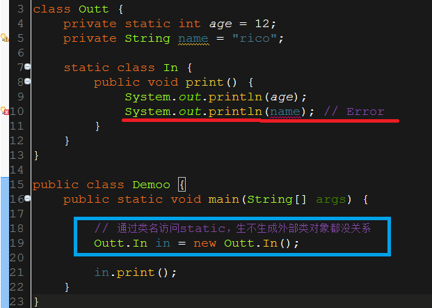

---

### 2、交互

　静态内部类与外部类的交互关系为：

- 静态内部类可以直接访问外部类的所有静态成员和静态方法，即使是 private 的；
- 外部类可以通过内部类对象访问内部类的实例成员变量/方法；对于内部类的静态域/方法，外部类可以通过内部类类名访问。

---

### 3、成员内部类和静态内部类的区别

　成员内部类和静态内部类之间的不同点包括：

- 
静态内部类对象的创建不依赖外部类的实例，但成员内部类对象的创建需要依赖外部类的实例；所以静态内部类能够包含静态变量和静态方法

- 
成员内部类能够访问外部类的静态和非静态成员，静态内部类不能访问外部类的非静态成员；

---

## 四. 局部内部类

### 1、定义与原理

有这样一种内部类，它是嵌套在方法和作用域内的，对于这个类的使用主要是应用与解决比较复杂的问题，想创建一个类来辅助我们的解决方案，但又不希望这个类是公共可用的，所以就产生了局部内部类。局部内部类和成员内部类一样被编译，只是它的作用域发生了改变，它只能在该方法和属性中被使用，出了该方法和属性就会失效。

```java
// 例 1：定义于方法内部
public class Parcel4 { 
    public Destination destination(String s) { 
        class PDestination implements Destination { 
            private String label; 

            private PDestination(String whereTo) { 
                label = whereTo; 
            } 

            public String readLabel() { 
                return label; 
            } 
        } 
        return new PDestination(s); 
    } 

    public static void main(String[] args) { 
        Parcel4 p = new Parcel4(); 
        Destination d = p.destination("Tasmania"); 
    } 
} 
```


​    

```java
// 例 2：定义于作用域内部
public class Parcel5 { 
    private void internalTracking(boolean b) { 
        if (b) { 
            class TrackingSlip { 
                private String id; 
                TrackingSlip(String s) { 
                    id = s; 
                } 
                String getSlip() { 
                    return id; 
                } 
            } 
            TrackingSlip ts = new TrackingSlip("slip"); 
            String s = ts.getSlip(); 
        } 
    } 

    public void track() { 
        internalTracking(true); 
    } 

    public static void main(String[] args) { 
        Parcel5 p = new Parcel5(); 
        p.track(); 
    } 
} 
```


​    

---

### 2、final 参数

　　　对于final参数，若是将引用类型参数声明为final，我们无法在方法中更改参数引用所指向的对象；若是将基本类型参数声明为final，我们可以读参数，但却无法修改参数（这一特性主要用来向局部内部类和匿名内部类传递数据）。

如果定义一个局部内部类，并且希望它的方法可以直接使用外部定义的数据，那么我们必须将这些数据设为是 final 的；特别地，如果只是局部内部类的构造器需要使用外部参数，那么这些外部参数就没必要设置为 final，例如： 

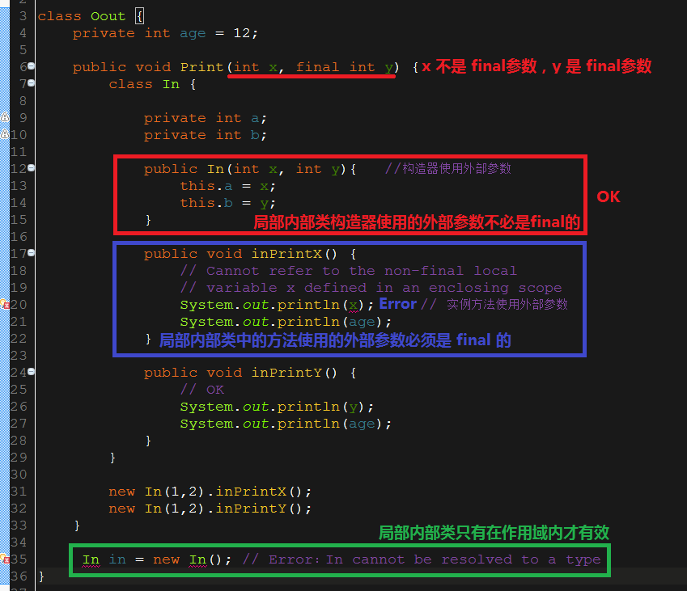


> 注意：JDK1.8 及以后局部内部类和匿名内部类使用方法参数或变量不需要添加`final`修饰符，编译阶段会自动添加。JDK1.7及以前需要手动添加`final`修饰符。不管是否添加`final`，局部内部类中和匿名内部类引用方法参数或变量的值都不能修改。

---

## 五. 匿名内部类

　　 有时候我为了免去给内部类命名，便倾向于使用匿名内部类，因为它没有名字。匿名内部类的使用需要注意以下几个地方：

- 
匿名内部类是没有访问修饰符的；

- 
匿名内部类是没有构造方法的(因为匿名内部类连名字都没有)；

- 
定义匿名内部类的前提是，内部类必须是继承一个类或者实现接口，格式为 new 父类或者接口(){子类的内容(如函数等)}。也就是说，匿名内部类最终提供给我们的是一个匿名子类的对象，例如：

  ```java
  // 例 1
  abstract class AbsDemo
  {
      abstract void show();
  }
  
  public class Outer
  {
      int x=3;
      public void function()//可调用函数
      {
          new AbsDemo()//匿名内部类
          {
              void show()
              {
                  System.out.println("x==="+x);
              }
              void abc()
              {
                  System.out.println("haha");
              }
          }.abc();  //匿名内部类调用函数,匿名内部类方法只能调用一次
      }   
  }
  ```
  
  
  
  ```java
  // 例 2
  interface Inner {    //注释后，编译时提示类Inner找不到 
      String getName(); 
  }
  
  public class Outer { 
  
      public Inner getInner(final String name, String city) { 
          return new Inner() { 
              private String nameStr = name; 
  
              public String getName() { 
                  return nameStr; 
              } 
          }; 
      } 
  
      public static void main(String[] args) { 
        Outer outer = new Outer(); 
          Inner inner = outer.getInner("Inner", "gz"); 
          System.out.println(inner.getName()); 
  
          System.out.println(inner instanceof Inner);  //匿名内部类实质上是一个匿名子类的对象
      } /* Output:
          Inner
          true
        *///:~ 
  } 
  ```
  
  

---

- 若匿名内部类 (匿名内部类没有构造方法) 需要直接使用其所在的外部类方法的参数时，该形参必须为 final 的；如果匿名内部类没有直接使用其所在的外部类方法的参数时，那么该参数就不必为final 的，例如：

    ```java
    // 情形 1：匿名内部类直接使用其所在的外部类方法的参数 name
    public class Outer { 
        public static void main(String[] args) { 
            Outer outer = new Outer(); 
            Inner inner = outer.getInner("Inner", "gz"); 
            System.out.println(inner.getName()); 
        } 
    
        public Inner getInner(final String name, String city) {  // 形参 name 被设为 final
            return new Inner() { 
                private String nameStr = name;       // OK
                private String cityStr = city;       // Error: 形参 city 未被设为 final
    
                public String getName() { 
                    return nameStr; 
                } 
            }; 
        } 
    } 
    
    
    
    // 情形 2：匿名内部类没有直接使用其所在的外部类方法的参数
    public class Outer { 
        public static void main(String[] args) { 
            Outer outer = new Outer(); 
            Inner inner = outer.getInner("Inner", "gz"); 
            System.out.println(inner.getName()); 
        } 
    
        //注意这里的形参city，由于它没有被匿名内部类直接使用，而是被抽象类Inner的构造函数所使用，所以不必定义为final
        public Inner getInner(String name, String city) { 
            return new Inner(name, city) {     // OK，形参 name 和 city 没有被匿名内部类直接使用
                private String nameStr = name; 
    
                public String getName() { 
                    return nameStr; 
                } 
            }; 
        } 
    } 
    
    abstract class Inner { 
        Inner(String name, String city) { 
            System.out.println(city); 
        } 
    
        abstract String getName(); 
    }
    ```

    

    

　　从上述代码中可以看到，当匿名内部类直接使用其所在的外部类方法的参数时，那么这些参数必须被设为 final的。为什么呢？本文所引用到的一篇文章是这样解释的：

　　“这是一个编译器设计的问题，如果你了解java的编译原理的话很容易理解。首先，内部类被编译的时候会生成一个单独的内部类的.class文件，这个文件并不与外部类在同一class文件中。当外部类传的参数被内部类调用时，从java程序的角度来看是直接的调用，例如：

```java
public void dosome(final String a,final int b){  
  class Dosome{
       public void dosome(){
            System.out.println(a+b)
       }
  }; 

  Dosome some=new Dosome();  
  some.dosome();  
} 
```


​    

　　从代码来看，好像是内部类直接调用的a参数和b参数，但是实际上不是，在java编译器编译以后实际的操作代码是:

```java
class Outer$Dosome{  
  public Dosome(final String a,final int b){  
      this.Dosome$a=a;  
      this.Dosome$b=b;  
  }  
  public void dosome(){  
      System.out.println(this.Dosome$a+this.Dosome$b);  
  }  
}
```


​    

　　从以上代码来看，内部类并不是直接调用方法传进来的参数，而是内部类将传进来的参数通过自己的构造器备份到了自己的内部，自己内部的方法调用的实际是自己的属性而不是外部类方法的参数。这样就很容易理解为什么要用final了，因为两者从外表看起来是同一个东西，实际上却不是这样，如果内部类改掉了这些参数的值也不可能影响到原参数，然而这样却失去了参数的一致性，因为从编程人员的角度来看他们是同一个东西，如果编程人员在程序设计的时候在内部类中改掉参数的值，但是外部调用的时候又发现值其实没有被改掉，这就让人非常的难以理解和接受，为了避免这种尴尬的问题存在，所以编译器设计人员把内部类能够使用的参数设定为必须是final来规避这种莫名其妙错误的存在。”

---

　　以上关于匿名内部类的每个例子使用的都是默认无参构造函数，下面我们介绍 带参数构造函数的匿名内部类：

```java
public class Outer { 
    public static void main(String[] args) { 
        Outer outer = new Outer(); 
        Inner inner = outer.getInner("Inner", "gz"); 
        System.out.println(inner.getName()); 
    } 

    public Inner getInner(final String name, String city) { 
        return new Inner(name, city) {   //匿名内部类
            private String nameStr = name; 
            public String getName() { 
                return nameStr; 
            } 
        }; 
    } 
} 

abstract class Inner { 
    Inner(String name, String city) {   // 带有参数的构造函数
        System.out.println(city); 
    } 

    abstract String getName(); 
} 
```


​    

---

　　特别地，匿名内部类通过实例初始化 (实例语句块主要用于匿名内部类中)，可以达到类似构造器的效果，如下：

```java
public class Outer { 
    public static void main(String[] args) { 
        Outer outer = new Outer(); 
        Inner inner = outer.getInner("Inner", "gz"); 
        System.out.println(inner.getName()); 
        System.out.println(inner.getProvince()); 
    } 

    public Inner getInner(final String name, final String city) { 
        return new Inner() { 
            private String nameStr = name; 
            private String province; 

            // 实例初始化 
            { 
                if (city.equals("gz")) { 
                    province = "gd"; 
                }else { 
                    province = ""; 
                } 
            } 

            public String getName() { 
                return nameStr; 
            } 

            public String getProvince() { 
                return province; 
            } 
        }; 
    } 
}
```


​    

---

## 六. 内部类的继承

　　内部类的继承，是指内部类被继承，普通类 extents 内部类。而这时候代码上要有点特别处理，具体看以下例子(内部类为成员变量)： 
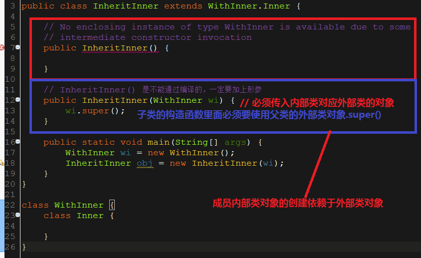

　　可以看到，子类的构造函数里面要使用父类的外部类对象.super() [成员内部类对象的创建依赖于外部类对象]；而这个外部类对象需要从外面创建并传给形参。

> 如果内部类为静态变量，可以像普通类直接继承而不需要以上操作。

---

> ## 引用
>
> [谈谈Java的匿名内部类](http://zhangbo-peipei-163-com.iteye.com/blog/2023001)
> [java源文件名与类名的关系](http://blog.itpub.net/29263789/viewspace-774703/)
> [Java内部类的作用](http://andy136566.iteye.com/blog/1061951/)
> [Java内部类的使用小结](http://android.blog.51cto.com/268543/384844/)
> [Java中普通内部类为何不能有static数据和static字段，也不能包含嵌套类。](http://www.dewen.net.cn/q/13793)
> [java提高篇(八)—-详解内部类](http://www.cnblogs.com/chenssy/p/3388487.html)
> [【解惑】领略Java内部类的“内部”](http://android.blog.51cto.com/268543/384809)
> [java提高篇(九)—–实现多重继承](http://www.cnblogs.com/chenssy/p/3389027.html)


# Java 继承、多态与类的复用

**摘要：**

　　本文结合Java的类的复用对面向对象两大特征继承和多态进行了全面的介绍。首先，我们介绍了继承的实质和意义，并探讨了继承，组合和代理在类的复用方面的异同。紧接着，我们根据继承引入了多态，介绍了它的实现机制和具体应用。此外，为了更好地理解继承和多态，我们对final关键字进行了全面的介绍。在此基础上，我们介绍了Java中类的加载及初始化顺序。最后，我们对面向对象设计中三个十分重要的概念–重载、覆盖与隐藏进行了详细的说明。

---

**要点：**

- 继承
- 组合，继承，代理
- 多态
- final 关键字
- 类加载及初始化顺序
- 重载、覆盖与隐藏

## 一. 继承

　　继承是所有OOP语言不可缺少的部分，在java中，使用extends关键字来表示继承关系。当创建一个类时，总是在继承，如果没有明确指出要继承的类，就总是隐式地从根类 Object 进行继承。如果两个类存在继承关系，则子类会自动继承父类的方法和变量，在子类中可以直接调用父类的方法和变量。需要指出的是，在java中，只允许单继承，也就是说，一个类最多只能显式地继承于一个父类。但是，一个类却可以被多个类继承，也就是说，一个类可以拥有多个子类。**此外，我们需要特别注意以下几点：**

1、 成员变量的继承

　　当子类继承了某个类之后，便可以使用父类中的成员变量，但是并不是完全继承父类的所有成员变量。具体的原则如下：

- 
子类能够继承父类的public 和 protected 成员变量  ，不能够继承父类的private 成员变量，但可以通过父类相应的getter/setter方法进行访问；

- 
对于父类的包访问权限成员变量，如果子类和父类在同一个包下，则子类能够继承，否则，子类不能够继承；

- 
对于子类可以继承的父类成员变量，如果在子类中出现了同名称的成员变量，则会发生 隐藏 现象，即子类的成员变量会屏蔽掉父类的同名成员变量。如果要在子类中访问父类中同名成员变量，需要使用super关键字来进行引用。

---

2、 成员方法的继承

　　同样地，当子类继承了某个类之后，便可以使用父类中的成员方法，但是子类并不是完全继承父类的所有方法。具体的原则如下：

- 
子类能够继承父类的  public和protected成员方法 ，不能够继承父类的 private成员方法；

- 
对于父类的包访问权限成员方法，如果子类和父类在同一个包下，则子类能够继承，否则，子类不能够继承；

- 
对于子类可以继承的父类成员方法，如果在子类中出现了同名称的成员方法，则称为 覆盖 ，即子类的成员方法会覆盖掉父类的同名成员方法。如果要在子类中访问父类中同名成员方法，需要使用super关键字来进行引用。

**程序示例：**

```java
class Person {
    public String gentle = "Father";
}

public class Student extends Person {

    public String gentle = "Son";

    public String print(){
        return super.gentle;       // 在子类中访问父类中同名成员变
    }

    public static void main(String[] args) throws ClassNotFoundException {
        Student student = new Student();
        System.out.println("##### " + student.gentle);
        Person p = student;
        System.out.println("***** " + p.gentle);    //隐藏：编译时决定，不会发生多态

        System.out.println("----- " + student.print());
        System.out.println("----- " + p.print());    //Error：Person 中未定义该方法
    }
}/* Output:
        ##### Son
        ***** Father
        ----- Father
 *///:~
```


​    

隐藏和覆盖是不同的。 隐藏 是 针对成员变量和静态方法 的，而 覆盖 是 针对普通方法 的。

---

3、 基类的初始化与构造器

　　我们知道，导出类就像是一个与基类具有相同接口的新类，或许还会有一些额外的方法和域。但是，继承并不只是复制基类的接口。当创建一个导出类对象时，该对象会包含一个基类的子对象。这个子对象与我们用基类直接创建的对象是一样的。二者的区别在于，后者来自于外部，而基类的子对象被包装在导出类对象的内部。

　　因此，对基类子对象的正确初始化是至关重要的，并且Java也提供了相应的方法来保证这一点：导出类必须在构造器中调用基类构造器来执行初始化，而基类构造器具有执行基类初始化所需的所有知识和能力。当基类含有默认构造器时，Java会自动在导出类的构造器插入对该基类默认构造器的调用，因为编译器不必考虑要传递什么样的参数的问题。但是，若父类不含有默认构造器，或者导出类想调用一个带参数的父类构造器，那么在导出类的构造器中就必须使用 super 关键字显式的进行调用相应的基类的构造器，并且该调用语句必是导出类构造器的第一条语句。

---

## 二. 组合，继承，代理

　　在Java中，组合、继承和代理三种技术都可以实现代码的复用。

(1) **组合（has-a）**

通过在新的类中加入现有类的对象即可实现组合。即，新的类是由现有类的对象所组成。该技术通常用于想在新类中使用现有类的功能而非它的接口这种情形。也就是说，在新类中嵌入某个对象，让其实现所需要的功能，但新类的用户看到的只是为新类所定义的接口，而非所嵌入对象的接口。

---

(2) **继承（is-a）**

继承可以使我们按照现有类的类型来创建新类。即，我们采用现有类的形式并在其中添加新代码。通常，这意味着我们在使用一个通用类，并为了某种特殊需要而将其特殊化。本质上，组合和继承都允许在新的类中放置子对象，组合是显式地这样做，而继承则是隐式地做。

---

(3) **代理（继承与组合之间的一种中庸之道：像组合一样使用已有类的功能，同时像继承一样使用已有类的接口）**

代理是继承与组合之间的一种中庸之道，Java并没有提供对它的直接支持。在代理中，我们将一个成员对象置于所要构造的类中（就像组合），但与此同时我们在新类中暴露了该成员对象的接口/方法（就像继承）。

**程序示例：**

```java
// 控制模块
public class SpaceShipControls {
    void up(int velocity) {
    }

    void down(int velocity) {
    }

    void left(int velocity) {
    }

    void right(int velocity) {
    }

    void forward(int velocity) {
    }

    void back(int velocity) {
    }

    void turboBoost() {
    }
}
```


​    

太空船需要一个控制模块，那么，构造太空船的一种方式是使用继承：

```java
public class SpaceShip extends SpaceShipControls { 
    private String name; 
    public SpaceShip(String name) { this.name = name; } 
    public String toString() { return name; } 
    public static void main(String[] args) { 
        SpaceShip protector = new SpaceShip("NSEA Protector"); 
        protector.forward(100); 
    } 
}
```


​    

然而，SpaceShip 并不是真正的 SpaceShipControls 类型，即便你可以“告诉” SpaceShip 向前运动（forward()）。更准确的说，SpaceShip 包含 SpaceShipControls ，与此同时， SpaceShipControls 的所有方法在 SpaceShip 中都暴露出来。代理（SpaceShip 的运动行为由 SpaceShipControls 代理完成） 正好可以解决这种问题：

```java
// SpaceShip 的行为由 SpaceShipControls 代理完成
public class SpaceShipDelegation { 
    private String name; 
    private SpaceShipControls controls = new SpaceShipControls(); 

    public SpaceShipDelegation(String name) { 
        this.name = name; 
    } 

    // 代理方法: 
    public void back(int velocity) { 
        controls.back(velocity); 
    } 
    public void down(int velocity) { 
        controls.down(velocity); 
    } 
    public void forward(int velocity) { 
        controls.forward(velocity); 
    } 
    public void left(int velocity) { 
        controls.left(velocity); 
    } 
    public void right(int velocity) { 
        controls.right(velocity); 
    } 
    public void turboBoost() { 
        controls.turboBoost(); 
    } 
    public void up(int velocity) { 
        controls.up(velocity); 
    } 

    public static void main(String[] args) { 
        SpaceShipDelegation protector = new SpaceShipDelegation("NSEA Protector"); 
        protector.forward(100); 
    } 
}
```


​    

　　实际上，我们使用代理时可以拥有更多的控制力，因为我们可以选择只提供在成员对象中方法的某个子集。

---

## 三. final关键字

许多编程语言都需要某种方法来向编译器告知一块数据是恒定不变的。有时，数据的恒定不变是很有用的，比如：

- 一个永不改变的编译时常量；
- 
一个在运行时被初始化的值，而你不希望它被改变。

对于编译期常量这种情况，编译器可以将该常量值带入任何可能用到它的计算式中，也即是说，可以在编译时执行计算式，这减轻了一些运行时负担。在Java中，这类常量必须满足两个条件：

- 
是基本类型，并且用final修饰；

- 
在对这个常量进行定义的时候，必须对其进行赋值。

　　此外，当用final修饰对象引用时，final使其引用恒定不变。一旦引用被初始化指向一个对象，就无法再把它指向另一个对象。然而，对象本身是可以被修改的，这同样适用于数组，因为它也是对象。

特别需要注意的是，我们不能因为某数据是final的，就认为在编译时就可以知道它的值。例如：

    public class Test { 
        final int i4 = rand.nextInt(20);
    }


​    

---

1、空白final

　　Java允许生成 空白final , 即：声明final但又未给定初值的域。但无论什么情况，编译器都会确保空白final在使用前被初始化。但是，空白final在关键字final的使用上提供了更大的灵活性: 一个类中的 final域 就可以做到根据对象而有所不同，却又保持其恒定不变的特性。例如，
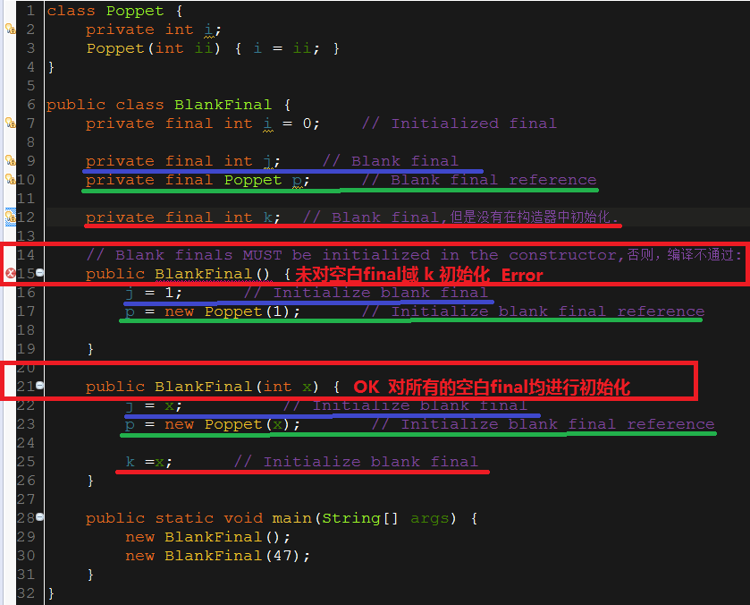

必须在域的定义处或者每个构造器中使用表达式对final进行赋值，这正是 final域 在使用前总是被初始化的原因所在。

---

2、final参数

final参数 主要应用于局部内部类和匿名内部类中，更多详细介绍请移步我的另一篇文章：[Java 内部类综述](http://blog.csdn.net/justloveyou_/article/details/53245561)。

---

3、final方法

final关键字作用域方法时，用于锁定方法，以防任何继承类修改它的含义。这是出于设计的考虑：想要确保在继承中使方法行为保持不变，并且不会被覆盖。

对于成员方法，只有在明确禁止覆盖时，才将方法设为final的。

---

4、final类

当将某个类定义为final时，就表明你不打算继承该类，而且也不允许别人这样做。换句话说，出于某种考虑，你对该类的设计永不需要做任何变动，或者出于安全考虑，你不希望它有子类。

　　需要注意的是，final类的域可以根据实际情况选择是否为final的。不论是否被定义为final，相同的规则都适用于定义final的域。然而，由于final类禁止继承，所以final类中的所有方法都隐式指定为final的，因为无法覆盖它们。在final类中可以给方法添加final修饰，但这不会增添任何意义。

---

5、 final与private

类中所有的private方法都隐式地指定为final的。由于无法取用private方法，所以也就无法覆盖它。可以对private方法添加final修饰，但这并不会给该方法添加任何额外的意义。 

　　特别需要注意的是，覆盖只有在某方法是基类接口的一部分时才会出现。如果一个方法是private的，它就不是基类接口中的一部分，而仅仅是一些隐藏于类中的程序代码。但若在导出类中以相同的名称生成一个非private方法，此时我们并没有覆盖该方法，仅仅是生成了一个新的方法。由于private方法无法触及并且能有效隐藏，所以除了把它看成是由于它所归属的类的组织结构的原因而存在外，其他任何情况都不需要考虑它。

---

6、 final 与 static

- 
static 修饰变量时，其 具有默认值， 且 可改变， 且其 只能修饰成员变量和成员方法。

- 
一个 static final域 只占据一段不能改变的存储空间，且只能在声明时进行初始化。因为其是 final 的，因而没有默认值；且又是static的，因此在类没有实例化时，其已被赋值，所以只能在声明时初始化。

---

## 四. 多态

　 我们知道 继承允许将对象视为它自己本身的类型或其基类型加以处理，从而使同一份代码可以毫无差别地运行在这些不同的类型之上。其中，多态方法调用允许一种类型表现出与其他相似类型之间的区别，只要这些类型由同一个基类所导出。所以，多态的作用主要体现在两个方面：

- 多态通过分离做什么和怎么做，从另一个角度将接口和实现分离开来，从而实现将改变的事物与未变的事物分离开来；
- 消除类型之间的耦合关系（类似的，在Java中，泛型也被用来消除类或方法与所使用的类型之间的耦合关系）。

---

1、实现机制

　 我们知道方法的覆盖很好的体现了多态，但是当使用一个基类引用去调用一个覆盖方法时，到底该调用哪个方法才正确呢？ 

将一个方法调用同一个方法主体关联起来被称作绑定。若在程序执行前进行绑定，叫做 前期绑定 。但是，显然，这种机制并不能解决上面的问题，因为在编译时编译器并不知道上述基类引用到底指向哪个对象。解决的办法就是后期绑定(动态绑定/运行时绑定)：在运行时根据对象的具体类型进行绑定。 

事实上，在Java中，除了static方法和final方法（private方法属于final方法）外，其他所有的方法都是后期绑定。这样，一个方法声明为final后，可以防止其他人覆盖该方法，但更重要一点是：这样做可以有效地关闭动态绑定，或者说，告诉编译器不需要对其进行动态绑定，以便为final方法调用生成更有效的代码。 

基于动态绑定机制，我们就可以编写只与基类打交道的代码了，并且这些代码对所有的导出类都可以正确运行。或者说，发送消息给某个对象，让该对象去断定该做什么事情。

---

2、向下转型与运行时类型识别

由于向上转型会丢失具体的类型信息，所以我们可能会想，通过向下转型也应该能够获取类型信息。然而，我们知道向上转型是安全的，因为基类不会具有大于导出类的接口。因此，我们通过基类接口发送的消息都能被接受，但是对于向下转型，我们就无法保证了。

 　 要解决这个问题，必须有某种方法来确保向下转型的正确性，使我们不至于贸然转型到一种错误的类型，进而发出该对象无法接受的消息。在Java中，运行时类型识别（RTTI）机制可以处理这个问题，它保证Java中所有的转型都会得到检查。所以，即使我们只是进行一次普通的加括弧形式的类型转换，再进入运行期时仍会对其进行检查，以便保证它的确是我们希望的哪种类型。如果不是，我们就会得到一个类型转换异常：ClassCastException。

---

3、多态的应用举例

- 策略模式；
- 适配器模式；

---

## 五. 类加载及初始化顺序

**首先，必须指出类加载及初始化顺序为：**父类静态代码块->子类静态代码块->父类非静态代码块->父类构造函数->子类非静态代码块->子类构造函数

　 即，首先，初始化父类中的静态成员变量和静态代码块，按照在程序中出现的顺序初始化；然后，初始化子类中的静态成员变量和静态代码块，按照在程序中出现的顺序初始化；其次，初始化父类的普通成员变量和代码块，再执行父类的构造方法；最后，初始化子类的普通成员变量和代码块，再执行子类的构造方法。 

 　 我们通过下面一段程序说明：

```java
class SuperClass {
    private static String STR = "Super Class Static Variable";
    static {
        System.out.println("Super Class Static Block:" + STR);
    }

    public SuperClass() {
        System.out.println("Super Class Constructor Method");
    }

    {
        System.out.println("Super Class Block");
    }

}

public class ObjectInit extends SuperClass {
    private static String STR = "Class Static Variable";
    static {
        System.out.println("Class Static Block:" + STR);
    }

    public ObjectInit() {
        System.out.println("Constructor Method");
    }

    {
        System.out.println("Class Block");
    }

    public static void main(String[] args) {
        @SuppressWarnings("unused")
        ObjectInit a = new ObjectInit();
    }
}/* Output:
        Super Class Static Block:Super Class Static Variable
        Class Static Block:Class Static Variable
        Super Class Block
        Super Class Constructor Method
        Class Block
        Constructor Method
 *///:~ 

```


​    

在运行该程序时，所发生的第一件事就是试图访问 ObjectInit.main() 方法（一个static方法），于是加载器开始启动并加载 ObjectInit类 。在对其加载时，编译器注意到它有一个基类（这由关键字extends得知），于是先进行加载其基类。如果该基类还有其自身的基类，那么先加载这个父父基类，如此类推（本例中是先加载 Object类 ，再加载 SuperClass类 ，最后加载 ObjectInit类 ）。接下来，根基类中的 static域 和 static代码块 会被执行，然后是下一个导出类，以此类推这种方式很重要，因为导出类的static初始化可能会依赖于基类成员能否被正确初始化。到此为止，所有的类都已加载完毕，对象就可以创建了。首先，初始化根基类所有的普通成员变量和代码块，然后执行根基类构造器以便创建一个基对象，然后是下一个导出类，依次类推，直到初始化完成。

---

## 六. 重载、覆盖与隐藏

1、重载与覆盖

(1) **定义与区别**

重载：如果在一个类中定义了多个同名的方法，但它们有不同的参数（包含三方面：参数个数、参数类型和参数顺序），则称为方法的重载。其中，不能通过访问权限、返回类型和抛出异常进行重载。

覆盖：子类中定义的某个方法与其父类中某个方法具有相同的方法签名（包含相同的名称和参数列表），则称为方法的覆盖。子类对象使用这个方法时，将调用该方法在子类中的定义，对它而言，父类中该方法的定义被屏蔽了。

总的来说，重载和覆盖是Java多态性的不同表现。前者是一个类中多态性的一种表现，后者是父类与子类之间多态性的一种表现。

---

(2) **实现机制**

重载是一种参数多态机制，即通过方法参数的差异实现多态机制。并且，其属于一种 静态绑定机制，在编译时已经知道具体执行哪个方法。 

覆盖是一种动态绑定的多态机制。即，在父类与子类中具有相同签名的方法具有不同的具体实现，至于最终执行哪个方法 根据运行时的实际情况而定。

---

(3) **总结**

　 我们应该注意以下几点：

- 
final 方法不能被覆盖；

- 
子类不能覆盖父类的private方法，否则，只是在子类中定义了一个与父类重名的全新的方法，而不会有任何覆盖效果。

**其他需要注意的地方如下图所示：**

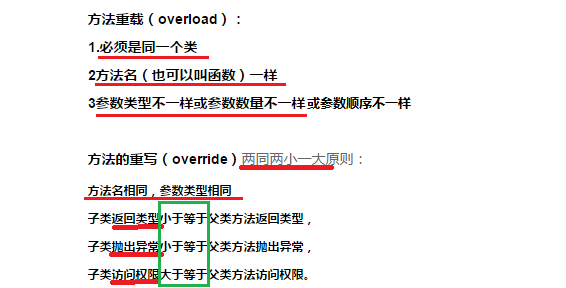

---

2、覆盖与隐藏

(1) **定义**

覆盖：指 运行时系统调用当前对象引用 运行时类型 中定义的方法 ，属于 运行期绑定。

隐藏：指运行时系统调用当前对象引用编译时类型  中定义的方法，即 被声明或者转换为什么类型就调用对应类型中的方法或变量，属于编译期绑定。

---

(2) **范围**

覆盖：只针对实例方法；
隐藏：只针对静态方法和成员变量.

---

(3) **小结**

- 
子类的实例方法不能隐藏父类的静态方法，同样地，子类的静态方法也不能覆盖父类的实例方法，否则编译出错；

- 
无论静态成员还是实例成员，都能被子类同名的成员变量所隐藏。

**下面的程序示例很好地诠释了重载，覆盖和隐藏三个概念：**
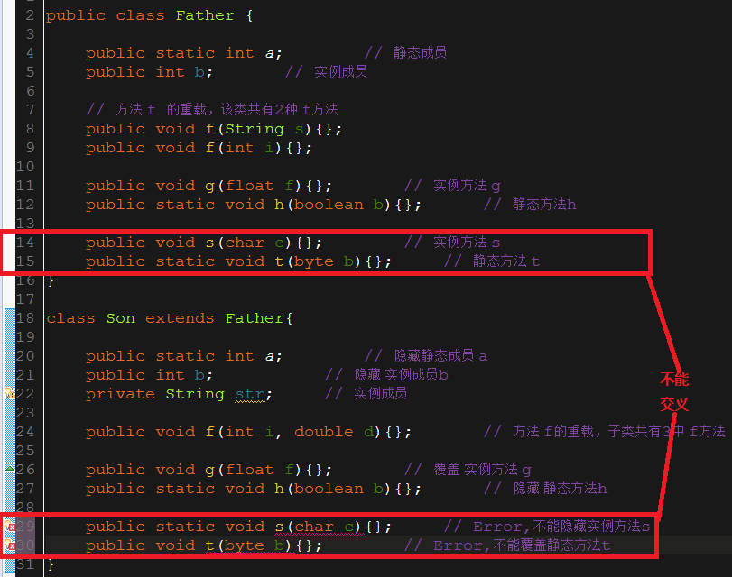

---

> ## 引用
>
> 《Java 编程思想》 
> [Java：类与继承](http://www.cnblogs.com/dolphin0520/p/3803432.html)


# Java 堆和栈

栈内存:栈内存首先是一片内存区域，存储的都是局部变量，凡是定义在方法中的都是局部变量（方法外的是全局变量），for循环内部定义的也是局部变量，是先加载函数才能进行局部变量的定义，所以方法先进栈，然后再定义变量，变量有自己的作用域，一旦离开作用域，变量就会被释放。栈内存的更新速度很快，因为局部变量的生命周期都很短。

 堆内存:存储的是数组和对象（其实数组就是对象），凡是new建立的都是在堆中，堆中存放的都是实体（对象），实体用于封装数据，而且是封装多个（实体的多个属性），如果一个数据消失，这个实体也没有消失，还可以用，所以堆是不会随时释放的，但是栈不一样，栈里存放的都是单个变量，变量被释放了，那就没有了。堆里的实体虽然不会被释放，但是会被当成垃圾，Java有垃圾回收机制不定时的收取。

区别：

1.栈内存存储的是局部变量而堆内存存储的是实体；

2.栈内存的更新速度要快于堆内存，因为局部变量的生命周期很短；

3.栈内存存放的变量生命周期一旦结束就会被释放，而堆内存存放的实体会被垃圾回收机制不定时的回收。


# Java 并发：内置锁 Synchronized

**摘要：**

　　在多线程编程中，线程安全问题是一个最为关键的问题，其核心概念就在于正确性，即当多个线程访问某一共享、可变数据时，始终都不会导致数据破坏以及其他不该出现的结果。而所有的并发模式在解决这个问题时，采用的方案都是序列化访问临界资源 。在 Java 中，提供了两种方式来实现同步互斥访问：synchronized 和 Lock。本文针对 synchronized 内置锁 详细讨论了其在 Java 并发 中的应用，包括它的具体使用场景（同步方法、同步代码块、实例对象锁 和 Class 对象锁）、可重入性 和 注意事项。

---

## 一. 线程安全问题

　　在单线程中不会出现线程安全问题，而在多线程编程中，有可能会出现同时访问同一个 共享、可变资源 的情况，这种资源可以是：一个变量、一个对象、一个文件等。特别注意两点，

- 共享： 意味着该资源可以由多个线程同时访问；
- 
可变： 意味着该资源可以在其生命周期内被修改。

　所以，当多个线程同时访问这种资源的时候，就会存在一个问题：

由于每个线程执行的过程是不可控的，所以需要采用同步机制来协同对对象可变状态的访问。

举个 数据脏读 的例子：

```java
//资源类
class PublicVar {

    public String username = "A";
    public String password = "AA";

    //同步实例方法
    public synchronized void setValue(String username, String password) {
        try {
            this.username = username;
            Thread.sleep(5000);
            this.password = password;

            System.out.println("method=setValue " +"\t" + "threadName="
                    + Thread.currentThread().getName() + "\t" + "username="
                    + username + ", password=" + password);
        } catch (InterruptedException e) {
            e.printStackTrace();
        }
    }

    //非同步实例方法
    public void getValue() {
        System.out.println("method=getValue " + "\t" +  "threadName="
                + Thread.currentThread().getName()+ "\t" + " username=" + username
                + ", password=" + password);
    }
}


//线程类
class ThreadA extends Thread {

    private PublicVar publicVar;

    public ThreadA(PublicVar publicVar) {
        super();
        this.publicVar = publicVar;
    }

    @Override
    public void run() {
        super.run();
        publicVar.setValue("B", "BB");
    }
}


//测试类
public class Test {

    public static void main(String[] args) {
        try {
            //临界资源
            PublicVar publicVarRef = new PublicVar();

            //创建并启动线程
            ThreadA thread = new ThreadA(publicVarRef);
            thread.start();

            Thread.sleep(200);// 打印结果受此值大小影响

            //在主线程中调用
            publicVarRef.getValue();

        } catch (InterruptedException e) {
            e.printStackTrace();
        }
    }
}/* Output ( 数据交叉 ): 
        method=getValue     threadName=main         username=B, password=AA
        method=setValue     threadName=Thread-0     username=B, password=BB
 *///:~
```


　　由程序输出可知，虽然在写操作进行了同步，但在读操作上仍然有可能出现一些意想不到的情况，例如上面所示的 脏读。发生 脏读 的情况是在执行读操作时，相应的数据已被其他线程 部分修改 过，导致 数据交叉 的现象产生。

　　这其实就是一个线程安全问题，即多个线程同时访问一个资源时，会导致程序运行结果并不是想看到的结果。这里面，这个资源被称为：临界资源。也就是说，当多个线程同时访问临界资源（一个对象，对象中的属性，一个文件，一个数据库等）时，就可能会产生线程安全问题。

　　不过，当多个线程执行一个方法时，该方法内部的局部变量并不是临界资源，因为这些局部变量是在每个线程的私有栈中，因此不具有共享性，不会导致线程安全问题。

---

## 二. 如何解决线程安全问题

　　实际上，所有的并发模式在解决线程安全问题时，采用的方案都是 序列化访问临界资源 。即在同一时刻，只能有一个线程访问临界资源，也称作 同步互斥访问。换句话说，就是在访问临界资源的代码前面加上一个锁，当访问完临界资源后释放锁，让其他线程继续访问。

在 Java 中，提供了两种方式来实现同步互斥访问：synchronized 和 Lock。本文主要讲述 synchronized 的使用方法，Lock 的使用方法我的另一篇博文《[Java 并发：Lock 框架详解](http://blog.csdn.net/justloveyou_/article/details/54972105)》中阐述。

---

## 三. synchronized 同步方法或者同步块

　　在了解 synchronized 关键字的使用方法之前，我们先来看一个概念：互斥锁，即 能到达到互斥访问目的的锁。举个简单的例子，如果对临界资源加上互斥锁，当一个线程在访问该临界资源时，其他线程便只能等待。

　　在 Java 中，可以使用 synchronized 关键字来标记一个方法或者代码块，当某个线程调用该对象的synchronized方法或者访问synchronized代码块时，这个线程便获得了该对象的锁，其他线程暂时无法访问这个方法，只有等待这个方法执行完毕或者代码块执行完毕，这个线程才会释放该对象的锁，其他线程才能执行这个方法或者代码块。

---

　　下面这段代码中两个线程分别调用insertData对象插入数据：

1) synchronized方法

```java
public class Test {

    public static void main(String[] args)  {
        final InsertData insertData = new InsertData();
        // 启动线程 1  
        new Thread() {
            public void run() {
                insertData.insert(Thread.currentThread());
            };
        }.start();

        // 启动线程 2
        new Thread() {
            public void run() {
                insertData.insert(Thread.currentThread());
            };
        }.start();
    }  
}

class InsertData {

    // 共享、可变资源
    private ArrayList<Integer> arrayList = new ArrayList<Integer>();

    //对共享可变资源的访问
    public void insert(Thread thread){
        for(int i=0;i<5;i++){
            System.out.println(thread.getName()+"在插入数据"+i);
            arrayList.add(i);
        }
    }
}/* Output: 
        Thread-0在插入数据0
        Thread-1在插入数据0
        Thread-0在插入数据1
        Thread-0在插入数据2
        Thread-1在插入数据1
        Thread-1在插入数据2
 *///:~
```


​    

　　根据运行结果就可以看出，这两个线程在同时执行insert()方法。而如果在insert()方法前面加上关键字synchronized 的话，运行结果为：

```java
class InsertData {
    private ArrayList<Integer> arrayList = new ArrayList<Integer>();

    public synchronized void insert(Thread thread){
        for(int i=0;i<5;i++){
            System.out.println(thread.getName()+"在插入数据"+i);
            arrayList.add(i);
        }
    }
}/* Output: 
        Thread-0在插入数据0
        Thread-0在插入数据1
        Thread-0在插入数据2
        Thread-1在插入数据0
        Thread-1在插入数据1
        Thread-1在插入数据2
 *///:~
```


​    

　　从以上输出结果可以看出，Thread-1 插入数据是等 Thread-0 插入完数据之后才进行的。说明 Thread-0 和 Thread-1 是顺序执行 insert() 方法的。这就是 synchronized 关键字对方法的作用。

　　不过需要注意以下三点：

　　1）当一个线程正在访问一个对象的 synchronized 方法，那么其他线程不能访问该对象的其他 synchronized 方法。这个原因很简单，因为一个对象只有一把锁，当一个线程获取了该对象的锁之后，其他线程无法获取该对象的锁，所以无法访问该对象的其他synchronized方法。

　　2）当一个线程正在访问一个对象的 synchronized 方法，那么其他线程能访问该对象的非 synchronized 方法。这个原因很简单，访问非 synchronized 方法不需要获得该对象的锁，假如一个方法没用 synchronized 关键字修饰，说明它不会使用到临界资源，那么其他线程是可以访问这个方法的，

　　3）如果一个线程 A 需要访问对象 object1 的 synchronized 方法 fun1，另外一个线程 B 需要访问对象 object2 的 synchronized 方法 fun1，即使 object1 和 object2 是同一类型），也不会产生线程安全问题，因为他们访问的是不同的对象，所以不存在互斥问题。

---

2) synchronized 同步块

　　synchronized 代码块类似于以下这种形式：

```java
synchronized (lock){
    //访问共享可变资源
    ...
}
```


​    

　　当在某个线程中执行这段代码块，该线程会获取对象lock的锁，从而使得其他线程无法同时访问该代码块。其中，lock 可以是 this，代表获取当前对象的锁，也可以是类中的一个属性，代表获取该属性的锁。特别地，实例同步方法 与 synchronized(this)同步块 是互斥的，因为它们锁的是同一个对象。但与 synchronized(非this)同步块 是异步的，因为它们锁的是不同对象。

　　比如上面的insert()方法可以改成以下两种形式：

```java
// this 监视器
class InsertData {
    private ArrayList<Integer> arrayList = new ArrayList<Integer>();

    public void insert(Thread thread){
        synchronized (this) {
            for(int i=0;i<100;i++){
                System.out.println(thread.getName()+"在插入数据"+i);
                arrayList.add(i);
            }
        }
    }
}

// 对象监视器
class InsertData {
    private ArrayList<Integer> arrayList = new ArrayList<Integer>();
    private Object object = new Object();

    public void insert(Thread thread){
        synchronized (object) {
            for(int i=0;i<100;i++){
                System.out.println(thread.getName()+"在插入数据"+i);
                arrayList.add(i);
            }
        }
    }
}
```


​    

　　从上面代码可以看出，synchronized代码块 比 synchronized方法 的粒度更细一些，使用起来也灵活得多。因为也许一个方法中只有一部分代码只需要同步，如果此时对整个方法用synchronized进行同步，会影响程序执行效率。而使用synchronized代码块就可以避免这个问题，synchronized代码块可以实现只对需要同步的地方进行同步。

---

3) class 对象锁

特别地，每个类也会有一个锁，静态的 synchronized方法 就是以Class对象作为锁。另外，它可以用来控制对 static 数据成员 （static 数据成员不专属于任何一个对象，是类成员） 的并发访问。并且，如果一个线程执行一个对象的非static synchronized 方法，另外一个线程需要执行这个对象所属类的 static synchronized 方法，也不会发生互斥现象。因为访问 static synchronized 方法占用的是类锁，而访问非 static synchronized 方法占用的是对象锁，所以不存在互斥现象。例如，

```java
public class Test {

    public static void main(String[] args)  {
        final InsertData insertData = new InsertData();
        new Thread(){
            @Override
            public void run() {
                insertData.insert();
            }
        }.start(); 
        new Thread(){
            @Override
            public void run() {
                insertData.insert1();
            }
        }.start();
    }  
}

class InsertData { 

    // 非 static synchronized 方法
    public synchronized void insert(){
        System.out.println("执行insert");
        try {
            Thread.sleep(5000);
        } catch (InterruptedException e) {
            e.printStackTrace();
        }
        System.out.println("执行insert完毕");
    }

    // static synchronized 方法
    public synchronized static void insert1() {
        System.out.println("执行insert1");
        System.out.println("执行insert1完毕");
    }
}/* Output: 
        执行insert
        执行insert1
        执行insert1完毕
        执行insert完毕
 *///:~
```


​    

　　根据执行结果，我们可以看到第一个线程里面执行的是insert方法，不会导致第二个线程执行insert1方法发生阻塞现象。下面，我们看一下 synchronized 关键字到底做了什么事情，我们来反编译它的字节码看一下，下面这段代码反编译后的字节码为：

```java
public class InsertData {
    private Object object = new Object();

    public void insert(Thread thread){
        synchronized (object) {}
    }

    public synchronized void insert1(Thread thread){}

    public void insert2(Thread thread){}
}
```


​    

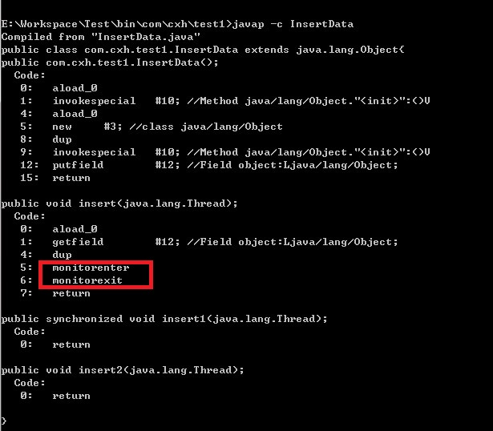

　　从反编译获得的字节码可以看出，synchronized 代码块实际上多了 monitorenter 和 monitorexit 两条指令。 monitorenter指令执行时会让对象的锁计数加1，而monitorexit指令执行时会让对象的锁计数减1，其实这个与操作系统里面的PV操作很像，操作系统里面的PV操作就是用来控制多个进程对临界资源的访问。对于synchronized方法，执行中的线程识别该方法的 method_info 结构是否有 ACC_SYNCHRONIZED 标记设置，然后它自动获取对象的锁，调用方法，最后释放锁。如果有异常发生，线程自动释放锁。

　　有一点要注意：对于 synchronized方法 或者 synchronized代码块，当出现异常时，JVM会自动释放当前线程占用的锁，因此不会由于异常导致出现死锁现象。　　

---

## 四. 可重入性

　　一般地，当某个线程请求一个由其他线程持有的锁时，发出请求的线程就会阻塞。然而，由于 Java 的内置锁是可重入的，因此如果某个线程试图获得一个已经由它自己持有的锁时，那么这个请求就会成功。可重入锁最大的作用是避免死锁。例如：

```java
public class Test implements Runnable {

    // 可重入锁测试
    public synchronized void get() {
        System.out.println(Thread.currentThread().getName());
        set();
    }

    public synchronized void set() {
        System.out.println(Thread.currentThread().getName());
    }

    @Override
    public void run() {
        get();
    }

    public static void main(String[] args) {
        Test test = new Test();
        new Thread(test,"Thread-0").start();
        new Thread(test,"Thread-1").start();
        new Thread(test,"Thread-2").start();
    }
}/* Output: 
        Thread-1
        Thread-1
        Thread-2
        Thread-2
        Thread-0
        Thread-0
 *///:~
```


​    

---

## 五. 注意事项

**1). 内置锁与字符串常量**

由于字符串常量池的原因，在大多数情况下，同步synchronized代码块 都不使用 String 作为锁对象，而改用其他，比如 new Object() 实例化一个 Object 对象，因为它并不会被放入缓存中。看下面的例子：

```java
//资源类
class Service {
    public void print(String stringParam) {
        try {
            synchronized (stringParam) {
                while (true) {
                    System.out.println(Thread.currentThread().getName());
                    Thread.sleep(1000);
                }
            }
        } catch (InterruptedException e) {
            e.printStackTrace();
        }
    }
}

//线程A
class ThreadA extends Thread {
    private Service service;

    public ThreadA(Service service) {
        super();
        this.service = service;
    }

    @Override
    public void run() {
        service.print("AA");
    }
}

//线程B
class ThreadB extends Thread {
    private Service service;

    public ThreadB(Service service) {
        super();
        this.service = service;
    }

    @Override
    public void run() {
        service.print("AA");
    }
}

//测试
public class Run {
    public static void main(String[] args) {

        //临界资源
        Service service = new Service();

        //创建并启动线程A
        ThreadA a = new ThreadA(service);
        a.setName("A");
        a.start();

        //创建并启动线程B
        ThreadB b = new ThreadB(service);
        b.setName("B");
        b.start();

    }
}/* Output (死锁): 
        A
        A
        A
        A
        ...
 *///:~
```


​    

　　出现上述结果就是因为 String 类型的参数都是 “AA”，两个线程持有相同的锁，所以 线程B 始终得不到执行，造成死锁。进一步地，所谓死锁是指： 
不同的线程都在等待根本不可能被释放的锁，从而导致所有的任务都无法继续完成。

---

**b). 锁的是对象而非引用**

　　在将任何数据类型作为同步锁时，需要注意的是，是否有多个线程将同时去竞争该锁对象： 

　　1).若它们将同时竞争同一把锁，则这些线程之间就是同步的； 

　　2).否则，这些线程之间就是异步的。

看下面的例子：

```java
//资源类
class MyService {
    private String lock = "123";

    public void testMethod() {
        try {
            synchronized (lock) {
                System.out.println(Thread.currentThread().getName() + " begin "
                        + System.currentTimeMillis());
                lock = "456";
                Thread.sleep(2000);
                System.out.println(Thread.currentThread().getName() + "   end "
                        + System.currentTimeMillis());
            }
        } catch (InterruptedException e) {
            e.printStackTrace();
        }
    }
}

//线程B
class ThreadB extends Thread {

    private MyService service;

    public ThreadB(MyService service) {
        super();
        this.service = service;
    }

    @Override
    public void run() {
        service.testMethod();
    }
}

//线程A
class ThreadA extends Thread {

    private MyService service;

    public ThreadA(MyService service) {
        super();
        this.service = service;
    }

    @Override
    public void run() {
        service.testMethod();
    }
}

//测试
public class Run1 {
    public static void main(String[] args) throws InterruptedException {

        //临界资源
        MyService service = new MyService();

        //线程A
        ThreadA a = new ThreadA(service);
        a.setName("A");

        //线程B
        ThreadB b = new ThreadB(service);
        b.setName("B");

        a.start();
        Thread.sleep(50);// 存在50毫秒
        b.start();
    }
}/* Output(循环): 
       A begin 1484319778766
       B begin 1484319778815
       A   end 1484319780766
       B   end 1484319780815
 *///:~
```


​    

　　由上述结果可知，线程 A、B 是异步的。因为50毫秒过后， 线程B 取得的锁对象是 “456”，而 线程A 依然持有的锁对象是 “123”。所以，这两个线程是异步的。若将上述语句 “Thread.sleep(50);” 注释，则有：

```java
//测试
public class Run1 {
    public static void main(String[] args) throws InterruptedException {

        //临界资源
        MyService service = new MyService();

        //线程A
        ThreadA a = new ThreadA(service);
        a.setName("A");

        //线程B
        ThreadB b = new ThreadB(service);
        b.setName("B");

        a.start();
        // Thread.sleep(50);// 存在50毫秒
        b.start();
    }
}/* Output(循环): 
       B begin 1484319952017
       B   end 1484319954018
       A begin 1484319954018
       A   end 1484319956019
 *///:~
```


​    

　　由上述结果可知，线程 A、B 是同步的。因为线程 A、B 竞争的是同一个锁“123”，虽然先获得运行的线程将 lock 指向了 对象“456”，但结果还是同步的。因为线程 A 和 B 共同争抢的锁对象是“123”，也就是说，锁的是对象而非引用。

---

## 六. 总结

　　用一句话来说，synchronized 内置锁  是一种 对象锁 (锁的是对象而非引用)，  作用粒度是对象 ，可以用来实现对  临界资源的同步互斥访问 ，是 可重入 的。特别地，对于 临界资源 有：

- 
若该资源是静态的，即被 static 关键字修饰，那么访问它的方法必须是同步且是静态的，synchronized 块必须是 class锁；

- 
若该资源是非静态的，即没有被 static 关键字修饰，那么访问它的方法必须是同步的，synchronized 块是实例对象锁；

实质上，关键字synchronized 主要包含两个特征：

- 
互斥性：保证在同一时刻，只有一个线程可以执行某一个方法或某一个代码块；

- 
可见性：保证线程工作内存中的变量与公共内存中的变量同步，使多线程读取共享变量时可以获得最新值的使用。

---

> ## 引用
>
> 《Java 并发编程实战》 
>
> 《Java 多线程编程核心技术》 
> [Java并发编程：synchronized](http://www.cnblogs.com/dolphin0520/p/3923737.html)


# Java 并发：Lock 框架详解

**摘要：**

　　我们已经知道，synchronized 是java的关键字，是Java的内置特性，在JVM层面实现了对临界资源的同步互斥访问，但 synchronized 粒度有些大，在处理实际问题时存在诸多局限性，比如响应中断等。Lock 提供了比 synchronized更广泛的锁操作，它能以更优雅的方式处理线程同步问题。本文以synchronized与Lock的对比为切入点，对Java中的Lock框架的枝干部分进行了详细介绍，最后给出了锁的一些相关概念。 

---

## 一. synchronized 的局限性 与 Lock 的优点

　　回顾文章[《Java 并发：内置锁 Synchronized》](http://blog.csdn.net/justloveyou_/article/details/54381099)，如果一个代码块被synchronized关键字修饰，当一个线程获取了对应的锁，并执行该代码块时，其他线程便只能一直等待直至占有锁的线程释放锁。事实上，占有锁的线程释放锁一般会是以下三种情况之一：

- 占有锁的线程执行完了该代码块，然后释放对锁的占有；
- 占有锁线程执行发生异常，此时JVM会让线程自动释放锁；
- 占有锁线程进入 WAITING 状态从而释放锁，例如在该线程中调用wait()方法等。

synchronized 是Java语言的内置特性，可以轻松实现对临界资源的同步互斥访问。那么，为什么还会出现Lock呢？试考虑以下三种情况：

---
Case 1 ： 

在使用synchronized关键字的情形下，假如占有锁的线程由于要等待IO或者其他原因（比如调用sleep方法）被阻塞了，但是又没有释放锁，那么其他线程就只能一直等待，别无他法。这会极大影响程序执行效率。因此，就需要有一种机制可以不让等待的线程一直无期限地等待下去（比如只等待一定的时间 (解决方案：tryLock(long time, TimeUnit unit)) 或者 能够响应中断 (解决方案：lockInterruptibly())），这种情况可以通过 Lock 解决。

Case 2 ： 

我们知道，当多个线程读写文件时，读操作和写操作会发生冲突现象，写操作和写操作也会发生冲突现象，但是读操作和读操作不会发生冲突现象。但是如果采用synchronized关键字实现同步的话，就会导致一个问题，即当多个线程都只是进行读操作时，也只有一个线程在可以进行读操作，其他线程只能等待锁的释放而无法进行读操作。因此，需要一种机制来使得当多个线程都只是进行读操作时，线程之间不会发生冲突。同样地，Lock也可以解决这种情况 (解决方案：ReentrantReadWriteLock) 。

Case 3 ： 

我们可以通过Lock得知线程有没有成功获取到锁 (解决方案：ReentrantLock) ，但这个是synchronized无法办到的。

　　上面提到的三种情形，我们都可以通过Lock来解决，但 synchronized 关键字却无能为力。事实上，Lock 是 java.util.concurrent.locks包 下的接口，Lock 实现提供了比 synchronized 关键字 更灵活、更广泛、粒度更细 的锁操作，它能以更优雅的方式处理线程同步问题。也就是说，Lock提供了比synchronized更多的功能。但是要注意以下几点：

　　1) synchronized是Java的关键字，因此是Java的内置特性，是基于JVM层面实现的，其经过编译之后，会在同步块的前后分别形成 monitorenter 和 monitorexit 两个字节码指令；而Lock是一个Java接口，是基于JDK层面实现的，通过这个接口可以实现同步访问；

　　2) 采用synchronized方式不需要用户去手动释放锁，当synchronized方法或者synchronized代码块执行完之后，系统会自动让线程释放对锁的占用；而 Lock则必须要用户去手动释放锁 (发生异常时，不会自动释放锁)，如果没有主动释放锁，就有可能导致死锁现象。

　　这是很好理解的。Synchronized方式是Java原生支持的，开发人员在使用它来解决并发问题时，一定会方便很多，在这里，开发人员就不需要手动获取锁和释放锁，这些操作均有Java自身自动完成；而Lock方式是JDK层面的提供给开发人员的接口，因此开发人员在使用它来解决并发问题时，需要手动获取锁和释放锁。

---

## 二. java.util.concurrent.locks包下常用的类与接口

　　以下是 java.util.concurrent.locks包下主要常用的类与接口的关系：

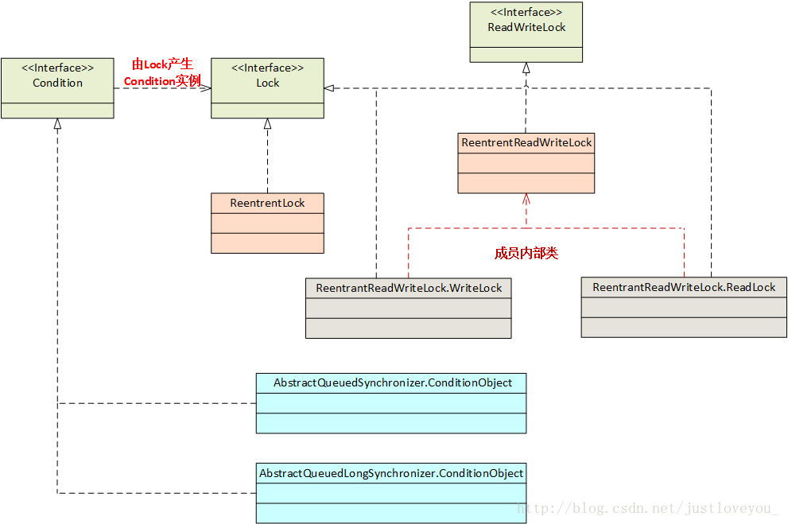

---

**1、Lock**

　　通过查看Lock的源码可知，Lock 是一个接口：

```java
public interface Lock {
    void lock();
    void lockInterruptibly() throws InterruptedException;  // 可以响应中断
    boolean tryLock();
    boolean tryLock(long time, TimeUnit unit) throws InterruptedException;  // 可以响应中断
    void unlock();
    Condition newCondition();
}
```


​    

　　下面来逐个分析Lock接口中每个方法。lock()、tryLock()、tryLock(long time, TimeUnit unit) 和 lockInterruptibly()都是用来获取锁的。unLock()方法是用来释放锁的。newCondition() 返回  绑定到此 Lock 的新的 Condition 实例 ，用于线程间的协作，详细内容见文章[《Java 并发：线程间通信与协作》](http://static.zybuluo.com/Rico123/3winjnuf2rwl8z5k2mxh8h46/Lock%E6%A1%86%E6%9E%B6.png)。

---

1). lock()

　　在Lock中声明了四个方法来获取锁，那么这四个方法有何区别呢？首先，lock()方法是平常使用得最多的一个方法，就是用来获取锁。如果锁已被其他线程获取，则进行等待。在前面已经讲到，如果采用Lock，必须主动去释放锁，并且在发生异常时，不会自动释放锁。因此，一般来说，使用Lock必须在try…catch…块中进行，并且将释放锁的操作放在finally块中进行，以保证锁一定被被释放，防止死锁的发生。通常使用Lock来进行同步的话，是以下面这种形式去使用的：

```java
Lock lock = ...;
lock.lock();
try{
    //处理任务
}catch(Exception ex){

}finally{
    lock.unlock();   //释放锁
}
```


​    

---

2). tryLock() & tryLock(long time, TimeUnit unit)

　　tryLock()方法是有返回值的，它表示用来尝试获取锁，如果获取成功，则返回true；如果获取失败（即锁已被其他线程获取），则返回false，也就是说，这个方法无论如何都会立即返回（在拿不到锁时不会一直在那等待）。

　　tryLock(long time, TimeUnit unit)方法和tryLock()方法是类似的，只不过区别在于这个方法在拿不到锁时会等待一定的时间，在时间期限之内如果还拿不到锁，就返回false，同时可以响应中断。如果一开始拿到锁或者在等待期间内拿到了锁，则返回true。

　　一般情况下，通过tryLock来获取锁时是这样使用的：

```java
Lock lock = ...;
if(lock.tryLock()) {
     try{
         //处理任务
     }catch(Exception ex){

     }finally{
         lock.unlock();   //释放锁
     } 
}else {
    //如果不能获取锁，则直接做其他事情
}
```


​    

---

3). lockInterruptibly()

　　lockInterruptibly()方法比较特殊，当通过这个方法去获取锁时，如果线程 正在等待获取锁，则这个线程能够响应中断，即中断线程的等待状态。例如，当两个线程同时通过lock.lockInterruptibly()想获取某个锁时，假若此时线程A获取到了锁，而线程B只有在等待，那么对线程B调用threadB.interrupt()方法能够中断线程B的等待过程。

　　由于lockInterruptibly()的声明中抛出了异常，所以lock.lockInterruptibly()必须放在try块中或者在调用lockInterruptibly()的方法外声明抛出 InterruptedException，但推荐使用后者，原因稍后阐述。因此，lockInterruptibly()一般的使用形式如下：

```java
public void method() throws InterruptedException {
    lock.lockInterruptibly();
    try {  
     //.....
    }
    finally {
        lock.unlock();
    }  
}
```


​    

　　注意，当一个线程获取了锁之后，是不会被interrupt()方法中断的。因为interrupt()方法只能中断阻塞过程中的线程而不能中断正在运行过程中的线程。因此，当通过lockInterruptibly()方法获取某个锁时，如果不能获取到，那么只有进行等待的情况下，才可以响应中断的。与 synchronized 相比，当一个线程处于等待某个锁的状态，是无法被中断的，只有一直等待下去。

---

最佳实践 (Best Practice)：在使用Lock时，无论以哪种方式获取锁，习惯上最好一律将获取锁的代码放到 try…catch…，因为我们一般将锁的unlock操作放到finally子句中，如果线程没有获取到锁，在执行finally子句时，就会执行unlock操作，从而抛出 IllegalMonitorStateException，因为该线程并未获得到锁却执行了解锁操作。

---

**2、ReentrantLock**

　　ReentrantLock，即可重入锁。ReentrantLock是唯一实现了Lock接口的类，并且ReentrantLock提供了更多的方法。下面通过一些实例学习如何使用 ReentrantLock。

---

例 1 ： Lock 的正确使用

```java
public class Test {
    private ArrayList<Integer> arrayList = new ArrayList<Integer>();

    public static void main(String[] args) {
        final Test test = new Test();

        new Thread("A") {
            public void run() {
                test.insert(Thread.currentThread());
            };
        }.start();

        new Thread("B") {
            public void run() {
                test.insert(Thread.currentThread());
            };
        }.start();
    }

    public void insert(Thread thread) {
        Lock lock = new ReentrantLock();  // 注意这个地方:lock被声明为局部变量
        lock.lock();
        try {
            System.out.println("线程" + thread.getName() + "得到了锁...");
            for (int i = 0; i < 5; i++) {
                arrayList.add(i);
            }
        } catch (Exception e) {

        } finally {
            System.out.println("线程" + thread.getName() + "释放了锁...");
            lock.unlock();
        }
    }
}/* Output: 
        线程A得到了锁...
        线程B得到了锁...
        线程A释放了锁...
        线程B释放了锁...
 *///:~
```


​    

　　结果或许让人觉得诧异。第二个线程怎么会在第一个线程释放锁之前得到了锁？原因在于，在insert方法中的lock变量是局部变量，每个线程执行该方法时都会保存一个副本，那么每个线程执行到lock.lock()处获取的是不同的锁，所以就不会对临界资源形成同步互斥访问。因此，我们只需要将lock声明为成员变量即可，如下所示。

```java
public class Test {
    private ArrayList<Integer> arrayList = new ArrayList<Integer>();
    private Lock lock = new ReentrantLock();  // 注意这个地方:lock被声明为成员变量
    ...
}/* Output: 
        线程A得到了锁...
        线程A释放了锁...
        线程B得到了锁...
        线程B释放了锁...
 *///:~
```


​    

---

例 2 ： tryLock() & tryLock(long time, TimeUnit unit) 

```java
public class Test {
    private ArrayList<Integer> arrayList = new ArrayList<Integer>();
    private Lock lock = new ReentrantLock(); // 注意这个地方：lock 被声明为成员变量

    public static void main(String[] args) {
        final Test test = new Test();

        new Thread("A") {
            public void run() {
                test.insert(Thread.currentThread());
            };
        }.start();

        new Thread("B") {
            public void run() {
                test.insert(Thread.currentThread());
            };
        }.start();
    }

    public void insert(Thread thread) {
        if (lock.tryLock()) {     // 使用 tryLock()
            try {
                System.out.println("线程" + thread.getName() + "得到了锁...");
                for (int i = 0; i < 5; i++) {
                    arrayList.add(i);
                }
            } catch (Exception e) {

            } finally {
                System.out.println("线程" + thread.getName() + "释放了锁...");
                lock.unlock();
            }
        } else {
            System.out.println("线程" + thread.getName() + "获取锁失败...");
        }
    }
}/* Output: 
        线程A得到了锁...
        线程B获取锁失败...
        线程A释放了锁...
 *///:~
```


​    

​        与 tryLock() 不同的是，tryLock(long time, TimeUnit unit) 能够响应中断，即支持对获取锁的中断，但尝试获取一个内部锁的操作（进入一个 synchronized 块）是不能被中断的。如下所示：

```java
public class Test {
    private Lock lock = new ReentrantLock();   
    public static void main(String[] args)  {
        Test test = new Test();
        MyThread thread1 = new MyThread(test,"A");
        MyThread thread2 = new MyThread(test,"B");
        thread1.start();
        thread2.start();

        try {
            Thread.sleep(2000);
        } catch (InterruptedException e) {
            e.printStackTrace();
        }
        thread2.interrupt();
    }  

    public void insert(Thread thread) throws InterruptedException{
        if(lock.tryLock(4, TimeUnit.SECONDS)){
            try {
                System.out.println("time=" + System.currentTimeMillis() + " ,线程 " + thread.getName()+"得到了锁...");
                long now = System.currentTimeMillis();
                while (System.currentTimeMillis() - now < 5000) {
                    // 为了避免Thread.sleep()而需要捕获InterruptedException而带来的理解上的困惑,
                    // 此处用这种方法空转5秒
                }
            }finally{
                lock.unlock();
            }
        }else {
            System.out.println("线程 " + thread.getName()+"放弃了对锁的获取...");
        }
    }
}

class MyThread extends Thread {
    private Test test = null;

    public MyThread(Test test,String name) {
        super(name);
        this.test = test;
    }

    @Override
    public void run() {
        try {
            test.insert(Thread.currentThread());
        } catch (InterruptedException e) {
            System.out.println("time=" + System.currentTimeMillis() + " ,线程 " + Thread.currentThread().getName() + "被中断...");
        }
    }
}/* Output: 
        time=1486693682559, 线程A 得到了锁...
        time=1486693684560, 线程B 被中断...(响应中断，时间恰好间隔2s)
 *///:~
```


​    

---

例 3 ： 使用 lockInterruptibly() 响应中断

```java
public class Test {
    private Lock lock = new ReentrantLock();   
    public static void main(String[] args)  {
        Test test = new Test();
        MyThread thread1 = new MyThread(test,"A");
        MyThread thread2 = new MyThread(test,"B");
        thread1.start();
        thread2.start();

        try {
            Thread.sleep(2000);
        } catch (InterruptedException e) {
            e.printStackTrace();
        }
        thread2.interrupt();
    }  

    public void insert(Thread thread) throws InterruptedException{
        //注意，如果需要正确中断等待锁的线程，必须将获取锁放在外面，然后将 InterruptedException 抛出
        lock.lockInterruptibly(); 
        try {  
            System.out.println("线程 " + thread.getName()+"得到了锁...");
            long startTime = System.currentTimeMillis();
            for(    ;     ;) {              // 耗时操作
                if(System.currentTimeMillis() - startTime >= Integer.MAX_VALUE)
                    break;
                //插入数据
            }
        }finally {
            System.out.println(Thread.currentThread().getName()+"执行finally...");
            lock.unlock();
            System.out.println("线程 " + thread.getName()+"释放了锁");
        } 
        System.out.println("over");
    }
}

class MyThread extends Thread {
    private Test test = null;

    public MyThread(Test test,String name) {
        super(name);
        this.test = test;
    }

    @Override
    public void run() {
        try {
            test.insert(Thread.currentThread());
        } catch (InterruptedException e) {
            System.out.println("线程 " + Thread.currentThread().getName() + "被中断...");
        }
    }
}/* Output: 
        线程 A得到了锁...
        线程 B被中断...
 *///:~
```


​    

　　运行上述代码之后，发现 thread2 能够被正确中断，放弃对任务的执行。特别需要注意的是，如果需要正确中断等待锁的线程，必须将获取锁放在外面（try 语句块外），然后将 InterruptedException 抛出。如果不这样做，像如下代码所示：

```java
import java.util.concurrent.locks.Lock;
import java.util.concurrent.locks.ReentrantLock;

public class Test {
    private Lock lock = new ReentrantLock();

    public static void main(String[] args) {
        Test test = new Test();
        MyThread thread1 = new MyThread(test, "A");
        MyThread thread2 = new MyThread(test, "B");
        thread1.start();
        thread2.start();

        try {
            Thread.sleep(5000);
            System.out.println("线程" + Thread.currentThread().getName()
                    + " 睡醒了...");
        } catch (InterruptedException e) {
            e.printStackTrace();
        }
        thread2.interrupt();
    }

    public void insert(Thread thread) {

        try {
            // 注意，如果将获取锁放在try语句块里，则必定会执行finally语句块中的解锁操作。
            // 若线程在获取锁时被中断，则再执行解锁操作就会导致异常，因为该线程并未获得到锁。
            lock.lockInterruptibly();
            System.out.println("线程 " + thread.getName() + "得到了锁...");
            long startTime = System.currentTimeMillis();
            for (;;) {
                if (System.currentTimeMillis() - startTime >= Integer.MAX_VALUE) // 耗时操作
                    break;
                // 插入数据
            }
        } catch (Exception e) {

        } finally {
            System.out.println(Thread.currentThread().getName()
                    + "执行finally...");
            lock.unlock();
            System.out.println("线程 " + thread.getName() + "释放了锁...");
        }
    }
}

class MyThread extends Thread {
    private Test test = null;

    public MyThread(Test test, String name) {
        super(name);
        this.test = test;
    }

    @Override
    public void run() {

        test.insert(Thread.currentThread());
        System.out.println("线程 " + Thread.currentThread().getName() + "被中断...");
    }
}/* Output: 
        线程A 得到了锁...
        线程main 睡醒了...
        B执行finally...
        Exception in thread "B" 
            java.lang.IllegalMonitorStateException
            at java.util.concurrent.locks.ReentrantLock$Sync.tryRelease(Unknown Source)
            at java.util.concurrent.locks.AbstractQueuedSynchronizer.release(Unknown Source)
            at java.util.concurrent.locks.ReentrantLock.unlock(Unknown Source)
            at Test.insert(Test.java:39)
            at MyThread.run(Test.java:56)
 *///:~
```


​    

注意，上述代码就将锁的获取操作放在try语句块里，则必定会执行finally语句块中的解锁操作。在 准备获取锁的 线程B 被中断后，再执行解锁操作就会抛出 IllegalMonitorStateException，因为该线程并未获得到锁却执行了解锁操作。

---

**3、ReadWriteLock**

　　ReadWriteLock也是一个接口，在它里面只定义了两个方法：

```java
public interface ReadWriteLock {
    /**
     * Returns the lock used for reading.
     *
     * @return the lock used for reading.
     */
    Lock readLock();

    /**
     * Returns the lock used for writing.
     *
     * @return the lock used for writing.
     */
    Lock writeLock();
}
```


​    

　　一个用来获取读锁，一个用来获取写锁。也就是说，将对临界资源的读写操作分成两个锁来分配给线程，从而使得多个线程可以同时进行读操作。下面的 ReentrantReadWriteLock 实现了 ReadWriteLock 接口。

---

**4、ReentrantReadWriteLock**

ReentrantReadWriteLock  实现了 ReadWriteLock 接口( 注意，ReentrantReadWriteLock 并没有实现 Lock 接口 )，其包含两个很重要的方法：readLock() 和 writeLock() 分别用来获取读锁和写锁，并且这两个锁实现了Lock接口。下面通过几个例子来看一下ReentrantReadWriteLock具体用法。假如有多个线程要同时进行读操作的话，先看一下synchronized达到的效果：

```java
public class Test {
    public static void main(String[] args)  {
        final Test test = new Test();

        new Thread("A"){
            public void run() {
                test.get(Thread.currentThread());
            };
        }.start();

        new Thread("B"){
            public void run() {
                test.get(Thread.currentThread());
            };
        }.start();

    }  

    public synchronized void get(Thread thread) {
        long start = System.currentTimeMillis();
        System.out.println("线程"+ thread.getName()+"开始读操作...");
        while(System.currentTimeMillis() - start <= 1) {
            System.out.println("线程"+ thread.getName()+"正在进行读操作...");
        }
        System.out.println("线程"+ thread.getName()+"读操作完毕...");
    }
}/* Output: 
        线程A开始读操作...
        线程A正在进行读操作...
        ...
        线程A正在进行读操作...
        线程A读操作完毕...
        线程B开始读操作...
        线程B正在进行读操作...
        ...
        线程B正在进行读操作...
        线程B读操作完毕...
 *///:~
```


​    

　　这段程序的输出结果会是，直到线程A执行完读操作之后，才会打印线程B执行读操作的信息。而改成使用读写锁的话：

```java
public class Test {
    private ReentrantReadWriteLock rwl = new ReentrantReadWriteLock();

    public static void main(String[] args) {
        final Test test = new Test();

        new Thread("A") {
            public void run() {
                test.get(Thread.currentThread());
            };
        }.start();

        new Thread("B") {
            public void run() {
                test.get(Thread.currentThread());
            };
        }.start();
    }

    public void get(Thread thread) {
        rwl.readLock().lock(); // 在外面获取锁
        try {
            long start = System.currentTimeMillis();
            System.out.println("线程" + thread.getName() + "开始读操作...");
            while (System.currentTimeMillis() - start <= 1) {
                System.out.println("线程" + thread.getName() + "正在进行读操作...");
            }
            System.out.println("线程" + thread.getName() + "读操作完毕...");
        } finally {
            rwl.readLock().unlock();
        }
    }
}/* Output: 
        线程A开始读操作...
        线程B开始读操作...
        线程A正在进行读操作...
        线程A正在进行读操作...
        线程B正在进行读操作...
        ...
        线程A读操作完毕...
        线程B读操作完毕...
 *///:~
```


​    

我们可以看到，线程A和线程B在同时进行读操作，这样就大大提升了读操作的效率。不过要注意的是，如果有一个线程已经占用了读锁，则此时其他线程如果要申请写锁，则申请写锁的线程会一直等待释放读锁。如果有一个线程已经占用了写锁，则此时其他线程如果申请写锁或者读锁，则申请的线程也会一直等待释放写锁。

---

**5、Lock 和 Synchronized 的选择**

总的来说，Lock 和 Synchronized  有以下几点不同：

　　(1). Lock是一个接口，是JDK层面的实现；而synchronized是Java中的关键字，是Java的内置特性，是JVM层面的实现；

　　(2). synchronized 在发生异常时，会自动释放线程占有的锁，因此不会导致死锁现象发生；而Lock在发生异常时，如果没有主动通过unLock()去释放锁，则很可能造成死锁现象，因此使用Lock时需要在finally块中释放锁；

　　(3). Lock 可以让等待锁的线程响应中断，而使用synchronized时，等待的线程会一直等待下去，不能够响应中断；

　　(4). 通过Lock可以知道有没有成功获取锁，而synchronized却无法办到；

　　(5). Lock可以提高多个线程进行读操作的效率。

　　在性能上来说，如果竞争资源不激烈，两者的性能是差不多的。而当竞争资源非常激烈时（即有大量线程同时竞争），此时Lock的性能要远远优于synchronized。所以说，在具体使用时要根据适当情况选择。

---

## 三. 锁的相关概念介绍

**1、可重入锁**

　　如果锁具备可重入性，则称作为 可重入锁 。像 synchronized 和 ReentrantLock 都是可重入锁，可重入性实际上表明了 锁的分配粒度：基于线程的分配，而不是基于方法调用的分配。举个简单的例子，当一个线程执行到某个synchronized方法时，比如说method1，而在method1中会调用另外一个synchronized方法method2，此时线程不必重新去申请锁，而是可以直接执行方法method2。

```java
class MyClass {
    public synchronized void method1() {
        method2();
    }

    public synchronized void method2() {

    }
}
```


​    

　　上述代码中的两个方法method1和method2都用synchronized修饰了。假如某一时刻，线程A执行到了method1，此时线程A获取了这个对象的锁，而由于method2也是synchronized方法，假如synchronized不具备可重入性，此时线程A需要重新申请锁。但是，这就会造成死锁，因为线程A已经持有了该对象的锁，而又在申请获取该对象的锁，这样就会线程A一直等待永远不会获取到的锁。而由于synchronized和Lock都具备可重入性，所以不会发生上述现象。

---

**2、可中断锁**

　　顾名思义，可中断锁就是可以响应中断的锁。在Java中，synchronized就不是可中断锁，而Lock是可中断锁。

　　如果某一线程A正在执行锁中的代码，另一线程B正在等待获取该锁，可能由于等待时间过长，线程B不想等待了，想先处理其他事情，我们可以让它中断自己或者在别的线程中中断它，这种就是可中断锁。在前面演示tryLock(long time, TimeUnit unit)和lockInterruptibly()的用法时已经体现了Lock的可中断性。

---

**3、公平锁**

　　公平锁即 尽量 以请求锁的顺序来获取锁。比如，同是有多个线程在等待一个锁，当这个锁被释放时，等待时间最久的线程（最先请求的线程）会获得该所，这种就是公平锁。而非公平锁则无法保证锁的获取是按照请求锁的顺序进行的，这样就可能导致某个或者一些线程永远获取不到锁。

　　在Java中，synchronized就是非公平锁（抢占锁），它无法保证等待的线程获取锁的顺序。而对于ReentrantLock 和 ReentrantReadWriteLock，它默认情况下是非公平锁，但是可以设置为 公平锁（协同式线程调度）。

看下面两个例子：

---

Case : 公平锁

```java
public class RunFair {
    public static void main(String[] args) throws InterruptedException {
        final Service service = new Service(true);     // 公平锁，设为 true
        Runnable runnable = new Runnable() {
            @Override
            public void run() {
                System.out.println("★线程" + Thread.currentThread().getName()
                        + "运行了");
                service.serviceMethod();
            }
        };

        Thread[] threadArray = new Thread[10];
        for (int i = 0; i < 10; i++) 
            threadArray[i] = new Thread(runnable);

        for (int i = 0; i < 10; i++) 
            threadArray[i].start(); 
    }
}
class Service {
    private ReentrantLock lock;
    public Service(boolean isFair) {
        super();
        lock = new ReentrantLock(isFair);
    }
    public void serviceMethod() {
        try {
            lock.lock();
            System.out.println("ThreadName=" + Thread.currentThread().getName()
                    + "获得锁定");
        } finally {
            lock.unlock();
        }
    }
}/* Output: 
        ★线程Thread-0运行了
        ★线程Thread-5运行了
        ★线程Thread-4运行了
        ★线程Thread-2运行了
        ★线程Thread-3运行了
        ★线程Thread-1运行了
        ★线程Thread-8运行了
        ★线程Thread-7运行了
        ★线程Thread-6运行了
        ThreadName=Thread-0获得锁定
        ★线程Thread-9运行了
        ThreadName=Thread-5获得锁定
        ThreadName=Thread-4获得锁定
        ThreadName=Thread-2获得锁定
        ThreadName=Thread-3获得锁定
        ThreadName=Thread-1获得锁定
        ThreadName=Thread-8获得锁定
        ThreadName=Thread-7获得锁定
        ThreadName=Thread-6获得锁定
        ThreadName=Thread-9获得锁定


*///:~
```


​    

---

Case: 非公平锁

```java
public class RunFair {
    public static void main(String[] args) throws InterruptedException {
        final Service service = new Service(false);  // 非公平锁，设为 false
        ...
}/* Output: 
        ★线程Thread-1运行了
        ★线程Thread-4运行了
        ThreadName=Thread-1获得锁定
        ★线程Thread-3运行了
        ThreadName=Thread-4获得锁定
        ★线程Thread-2运行了
        ★线程Thread-0运行了
        ThreadName=Thread-2获得锁定
        ★线程Thread-6运行了
        ★线程Thread-5运行了
        ThreadName=Thread-6获得锁定
        ★线程Thread-7运行了
        ThreadName=Thread-7获得锁定
        ★线程Thread-8运行了
        ThreadName=Thread-8获得锁定
        ThreadName=Thread-3获得锁定
        ThreadName=Thread-0获得锁定
        ThreadName=Thread-5获得锁定
        ★线程Thread-9运行了
        ThreadName=Thread-9获得锁定

*///:~
```


​    

　　根据上面代码演示结果我们可以看出（线程数越多越明显），在公平锁案例下，多个线程在等待一个锁时，一般而言，等待时间最久的线程（最先请求的线程）会获得该锁。而在非公平锁例下，则无法保证锁的获取是按照请求锁的顺序进行的。

---

　　另外， 在ReentrantLock类中定义了很多方法，举几个例子：

- 
isFair()        //判断锁是否是公平锁

- 
isLocked()    //判断锁是否被任何线程获取了

- 
isHeldByCurrentThread()   //判断锁是否被当前线程获取了

- 
hasQueuedThreads()   //判断是否有线程在等待该锁

- 
getHoldCount()   //查询当前线程占有lock锁的次数

- 
getQueueLength()  // 获取正在等待此锁的线程数

- 
getWaitQueueLength(Condition condition)  // 获取正在等待此锁相关条件condition的线程数

在ReentrantReadWriteLock中也有类似的方法，同样也可以设置为公平锁和非公平锁。不过要记住，ReentrantReadWriteLock并未实现Lock接口，它实现的是ReadWriteLock接口。

---

**4.读写锁**

　　读写锁将对临界资源的访问分成了两个锁，一个读锁和一个写锁。正因为有了读写锁，才使得多个线程之间的读操作不会发生冲突。ReadWriteLock就是读写锁，它是一个接口，ReentrantReadWriteLock实现了这个接口。可以通过readLock()获取读锁，通过writeLock()获取写锁。上一节已经演示过了读写锁的使用方法，在此不再赘述。

---

> ## 引用
>
> 《Java 多线程编程核心技术》 
> [Java并发编程：Lock](http://www.cnblogs.com/dolphin0520/p/3923167.html)
> [理解Java线程的中断](http://blog.csdn.net/sunxing007/article/details/9123363)


# Java 集合

## Collection

### retainAll（取交集）

```java
import java.util.ArrayList;
 
public class RetainAllDemo {
    public static boolean compare(int[] arr1,int[] arr2){
        ArrayList<Integer> list1=new ArrayList<>();
        ArrayList<Integer> list2=new ArrayList<>();
        for(int a:arr1){
            list1.add(a);
        }
        for(int b:arr2){
            list2.add(b);
        }
    //  System.out.println(list1.retainAll(list2));
        return list1.retainAll(list2);//list1中6，5不在list2中执行该方法时进行了移除操作返回true，如果将arr1改为{1,2,3,4}，执行该方法无需进行移除操作返回false；
    }
    public static void main(String[] args) {
        int[] arr1={1,2,3,4,6,5};
        int[] arr2={1,2,3,4,53};
        boolean b=compare(arr1,arr2);
        System.out.println(".....:"+b);
    }
}
```


# Java异常

## Java 异常类型

Java从`Throwable`直接派生出`Exception`和`Error`。其中`Exception`是可以抛出的基本类型,在Java类库、方法以及运行时故障都可以抛出`Exception`型异常。`Exception`表示可以恢复的异常，时编译器捕捉到的；`Error`表示编译时和系统错误，表示系统在运行期间出现了严重的错误，属于不可恢复的错误，由于这数据JVM层次的严重错误，因此这种错误会导致程序终止执行。Exception又分为检查异常和运行时异常。异常类的结构层次图如下：

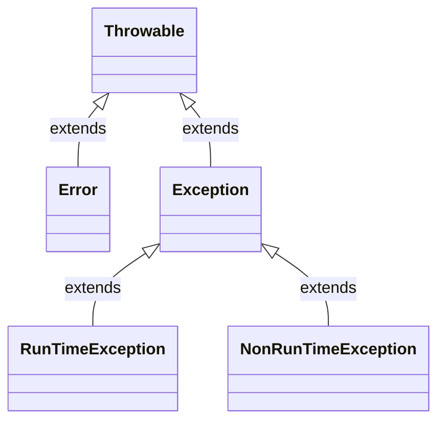

### `Exception` 

JDK8列出的直接子类

```
AclNotFoundException, ActivationException, AlreadyBoundException, ApplicationException, AWTException, BackingStoreException, BadAttributeValueExpException, BadBinaryOpValueExpException, BadLocationException, BadStringOperationException, BrokenBarrierException, CertificateException, CloneNotSupportedException, DataFormatException, DatatypeConfigurationException, DestroyFailedException, ExecutionException, ExpandVetoException, FontFormatException, GeneralSecurityException, GSSException, IllegalClassFormatException, InterruptedException, IntrospectionException, InvalidApplicationException, InvalidMidiDataException, InvalidPreferencesFormatException, InvalidTargetObjectTypeException, IOException, JAXBException, JMException, KeySelectorException, LambdaConversionException, LastOwnerException, LineUnavailableException, MarshalException, MidiUnavailableException, MimeTypeParseException, MimeTypeParseException, NamingException, NoninvertibleTransformException, NotBoundException, NotOwnerException, ParseException, ParserConfigurationException, PrinterException, PrintException, PrivilegedActionException, PropertyVetoException, ReflectiveOperationException, RefreshFailedException, RemarshalException, RuntimeException, SAXException, ScriptException, ServerNotActiveException, SOAPException, SQLException, TimeoutException, TooManyListenersException, TransformerException, TransformException, UnmodifiableClassException, UnsupportedAudioFileException, UnsupportedCallbackException, UnsupportedFlavorException, UnsupportedLookAndFeelException, URIReferenceException, URISyntaxException, UserException, XAException, XMLParseException, XMLSignatureException, XMLStreamException, XPathException
```

#### `RunTimeException` (运行时异常)

NullPointException(空指针异常), ClassCastException(类型转换异常),IndexOutOfBoundsException(越界异常),IllegalArgumentException(非法参数异常), ArrayStoreException(数组储存异常), ArithmeticException(算术异常), BuffereOverflowException(缓冲区溢出异常)等.

JDK8列出的直接子类

```
AnnotationTypeMismatchException, ArithmeticException, ArrayStoreException, BufferOverflowException, BufferUnderflowException, CannotRedoException, CannotUndoException, ClassCastException, CMMException, CompletionException, ConcurrentModificationException, DataBindingException, DateTimeException, DOMException, EmptyStackException, EnumConstantNotPresentException, EventException, FileSystemAlreadyExistsException, FileSystemNotFoundException, IllegalArgumentException, IllegalMonitorStateException, IllegalPathStateException, IllegalStateException, IllformedLocaleException, ImagingOpException, IncompleteAnnotationException, IndexOutOfBoundsException, JMRuntimeException, LSException, MalformedParameterizedTypeException, MalformedParametersException, MirroredTypesException, MissingResourceException, NegativeArraySizeException, NoSuchElementException, NoSuchMechanismException, NullPointerException, ProfileDataException, ProviderException, ProviderNotFoundException, RasterFormatException, RejectedExecutionException, SecurityException, SystemException, TypeConstraintException, TypeNotPresentException, UncheckedIOException, UndeclaredThrowableException, UnknownEntityException, UnmodifiableSetException, UnsupportedOperationException, WebServiceException, WrongMethodTypeException
```


按照编译器检查方式划分，异常又可以分为检查型异常（CheckedException）和非检查型异常 （UncheckedException）。Error和RuntimeException合起来称为UncheckedException，之所以这么 称呼，是因为编译器不检查方法是否处理或者抛出这两种类型的异常，因此编译期间出现这种类型的异常也不会报错，默认由虚拟机提供处理方式。除了Error 和RuntimeException这两种类型的异常外，其它的异常都称为Checked异常。


# Java 常见问题

## Java 中 == 和 equals 方法


对于基本数据类型：

`==`：由于基本数据类型储存的就是它的值，所以`==`是比较它的值

基本数据类型没有`equals`方法

对于引用变量类型：

`==` ：比较的是对象的地址是否相同。

`equals`：equals继承Object类，比较的是是否是同一个对象，如果没有对equals方法进行重写，则比较的是引用类型的变量所指向的对象的地址；诸如String、Date等类对equals方法进行了重写的话，比较的是所指向的对象的内容。


一个特殊的例子

```java
public class Test{
    public static void main(String[] args){
        Integer a = 20;
        Integer b = 20;
        Integer c = 200;
        Integer d = 200;
        System.out.println(a == b);
        System.out.println(c == d);
    }
}
```

结果：

```
true
false
```

原因：因为 int自动装箱为Integer对象的，使用了`Integer.valueOf`方法(源码如下)，它的值如果在`IntegerCache.low`和`IntegerCache.high`之间则使用使用缓存的对象，否者生成一个新的对象，`IntegerCache.low`的值默认为-128， `IntegerCache.high`值默认为127

```java
public static Integer valueOf(int i) {
    if (i >= IntegerCache.low && i <= IntegerCache.high)
        return IntegerCache.cache[i + (-IntegerCache.low)];
    return new Integer(i);
}
```


## hashCode()方法

默认hashCode方法继承自Object，其返回的是对象的内存地址。

对于String类型，其hashCode方法被复写，其是根据值的类型来返回hashCode值的。

如果想使用默认的hashCode 方法获取内存地址，可以使用`System.identityHashCode(obj)`方法


## 强制类型转换优先级问题

强制类型转换的优先级是 大于算术运算符的

```java
public class Test {
    int a = (int) Math.random() * (10 - 5);
    System.out.println(a);
}
```

```
// 结果
0
```

