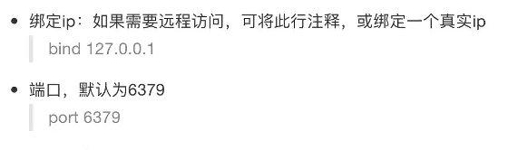
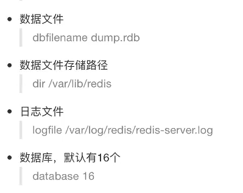
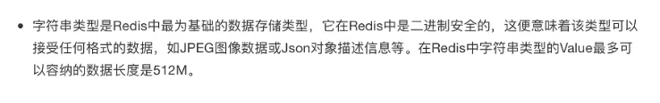
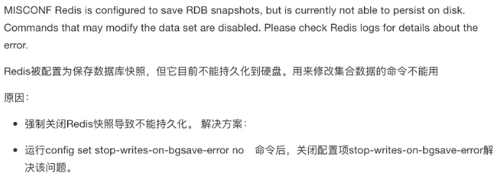

# Redis

## 1. 安装

## 2. 配置







## 3. 服务端和客户端命令

### 1. 服务端命令

启动

```shell
redis-server /path/to/conf
```


### 2. 客户端命令

#### 连接redis

```shell
redis-cli
```


#### 运行测试命令

```
ping
```

```
127.0.0.1:6379> ping
PONG
```


#### 切换数据库

数据库没有名称，默认有16个，通过0-15 来标识，连接redis默认悬着第一个数据库


切换数据库

```
select n
```

```
127.0.0.1:6379> select 4
OK
```


## 4. 数据操作

数据结构

- redis是key-value的数据结构， 每条数据都是一个键值对
- 键的类型是字符串
- 注意：键不能重复


- 值的类型分为五种：
  - 字符串string
  - 哈希hash
  - 列表list
  - 集合set
  - 有序集合zset


数据操作行为

- 保存
- 修改
- 获取
- 删除


### 1. string



#### 保存

- 设置键值

如果没有设置过期时间，则一直存在

```
set key value
```

```
127.0.0.1:6379> set name smilejack
OK
127.0.0.1:6379> get name
"smilejack"
```


- 设置键值以及过期时间

```
setex key seconds value
```

```
127.0.0.1:6379> setex name 10 test
OK
127.0.0.1:6379> get name
"test"
127.0.0.1:6379> get name
"test"
# 10s 后
127.0.0.1:6379> get name
(nil)
```


- 设置多个键值

```
mset key1 value1 key2 value2
```

```
127.0.0.1:6379> mset name1 smikejack name2 aky
OK
127.0.0.1:6379> get name1
"smikejack"
127.0.0.1:6379> get name2
"aky"
```


- 追加值

```
append key value
```

```
127.0.0.1:6379> get name1
"smikejack"
127.0.0.1:6379> append name1 test
(integer) 13
127.0.0.1:6379> get name1
"smikejacktest"
```


#### 获取

- 获取单个键值，如果不存在则返回nil

```
get key
```

```
127.0.0.1:6379> get name1
"smikejack"
```


- 获取多个键值

```
mget key1 key2
```

```
127.0.0.1:6379> mget name1 name2
1) "smikejacktest"
2) "aky"
```


### 2. 键命令

- 查找键， 参数支持正则表达式

```
keys pattern
```

查找所有键

```
127.0.0.1:6379> keys *
1) "name2"
2) "name1"
```

查看包含2的键

```
127.0.0.1:6379> keys '*2*'
1) "name2"
```


- 判断键是否存在(返回1表示存在，返回0表示不存在)

```
exists key
```

```
127.0.0.1:6379> exists name1
(integer) 1
127.0.0.1:6379> exists aky
(integer) 0
```


- 查看key对应的value类型

```
type key
```

```
127.0.0.1:6379> type name1
string
```


- 删除键以及对应的值（返回删除的键值对个数）

```
del key1 key2
```

```
127.0.0.1:6379> del name1 name2
(integer) 2
127.0.0.1:6379> mget name1 name2
1) (nil)
2) (nil)
```


- 设定过期时间

```
expire key seconds
```

```
127.0.0.1:6379> set name aky
OK
127.0.0.1:6379> get name
"aky"
127.0.0.1:6379> expire name 3
(integer) 1
127.0.0.1:6379> get name
(nil)
```


- 查看键的有效时间（返回有效时间，单位：秒）

```
ttl key
```

```
127.0.0.1:6379> setex name 10 aky
OK
127.0.0.1:6379> ttl name
(integer) 7
127.0.0.1:6379>
```


### 3. hash类型

- hash 用于存储对象，对象的结果为属性、值
- 值的类型为string


#### 1. 增加、修改

- 设置单个属性

```
hset key filed value
```

设置键user的属性name为aky

```
127.0.0.1:6379> hset user name aky
(integer) 1
```

可能遇到的问题




- 设置 多个属性

```
hmset key1 filed1 value1 key2 field2 value2
```

设置键user1的属性name为xiaoxiaoguai、属性age为11

```
127.0.0.1:6379> hmset user1 name xiaoxiaoguai age 11
OK
```


#### 2. 获取

- 获取指定键所有的属性

```
hkeys key
```

```
# 获取user1 的所有属性
127.0.0.1:6379> hkeys user1
1) "name"
2) "age"
```


- 获取一个属性的值

```
hget key filed
```

```
# 获取user1 name属性
127.0.0.1:6379> hget user1 name
"xiaoxiaoguai"
```


- 获取多个属性的值

```
hmget key field1 field2
```

```
127.0.0.1:6379> hmget user1 name age
1) "xiaoxiaoguai"
2) "11"
```


- 获取所有属性的值

```
hvals key
```

```
# 获取user1所有的属性值
127.0.0.1:6379> hvals user1
1) "xiaoxiaoguai"
2) "11"
```


#### 3. 删除

- 删除整个hash键及值，使用del命令
- 删除属性，属性对应的值会被一起删除

```
hdel key field1 field12
```

```
# 删除键user1的属性age
127.0.0.1:6379> hdel user1 age
(integer) 1
```


### 4. list

- 列表的元素类型为string
- 按照插入顺序排序


#### 1. 增加

- 在左侧插入数据

```
lpush key value1 value2
```

```
# 从键为 a1 的列表左侧添加数据 a,b,c
127.0.0.1:6379> lpush a1 a b c
(integer) 3
127.0.0.1:6379> lrange a1 0 3
1) "c"
2) "b"
3) "a"
127.0.0.1:6379> TYPE a1
list
```


- 在右侧插入数据

```
rpush key value1 value2
```

```
# 从键为 a1 的列表右侧插入数据 0, 1
127.0.0.1:6379> lrange a1 0 4
1) "c"
2) "b"
3) "a"
4) "0"
5) "1"
```


- 在指定元素的前或后插入数据

```
linsert key before 现有元素 新元素
linsert key after 现有元素 新元素
```

```
# 在键为 a1 的列表中元素 b 前插入 3
127.0.0.1:6379> linsert a1 before b 3
(integer) 6
127.0.0.1:6379> lrange a1 0 5
1) "c"
2) "3"
3) "b"
4) "a"
5) "0"
6) "1"
# 在键为 a1 的列表中元素 b 前插入 4
127.0.0.1:6379> linsert a1 after b 4
(integer) 7
127.0.0.1:6379> lrange a1 0 6
1) "c"
2) "3"
3) "b"
4) "4"
5) "a"
6) "0"
7) "1"
```


指定元素有重复值，都会插入

```
127.0.0.1:6379> lrange a1 0 -1
1) "d"
2) "3"
3) "b"
4) "4"
5) "a"
6) "0"
7) "1"
8) "a"
127.0.0.1:6379> linsert a1 after a 2
(integer) 9
127.0.0.1:6379> lrange a1 0 -1
1) "d"
2) "3"
3) "b"
4) "4"
5) "a"
6) "2"
7) "0"
8) "1"
9) "a"
```


#### 2. 获取

- 返回列表里指定范围的元素
  - start、stop 为元素的下标索引
  - 索引从左侧开始、第一个元素的索引为0
  - 索引可以是附属，表示从尾部开始计数，如-1表示最后一个元素

```
lrange key start stop
```

```
# 获取键为 a1 的列表所有元素
127.0.0.1:6379> lrange a1 0 -1
1) "c"
2) "3"
3) "b"
4) "4"
5) "a"
6) "0"
7) "1"
```


#### 3. 设置指定索引位置的元素值

- 索引从左侧开始， 第一个元素为0
- 索引可以为负数，表示从尾部计数，如-1表示最后一个元素

```
lset key index value
```

```
# 设置a1第一个元素的值为d
127.0.0.1:6379> lset a1 0 d
OK
127.0.0.1:6379> lrange a1 0 -1
1) "d"
2) "3"
3) "b"
4) "4"
5) "a"
6) "0"
7) "1"
```


#### 4. 删除

- 删除指定元素
  - 将列表中前count次出现的值为value的元素移除
  - count > 0: 从头往尾移除
  - count < 0: 从尾往头移除
  - count = 0: 移除所有

```
lrem key count value
```

```
# 从 a2 列表右侧开始往左删除2个 b
127.0.0.1:6379> lrange a2 0 -1
1) "b"
2) "a"
3) "b"
4) "a"
5) "b"
6) "a"
127.0.0.1:6379> lrem a2 -2 b
(integer) 2
127.0.0.1:6379> lrange a2 0 -1
1) "b"
2) "a"
3) "a"
4) "a"
```


### 5. set

- 无序集合
- 元素为string类型
- 元素具有唯一性, 不重复
- 说明: 对于集合没有修改操作


#### 1. 增加

- 添加元素

```
sadd key member1 member2
```

```
# 向键 a3 集合添加元素zhangsan, lisi wangwu
127.0.0.1:6379> sadd a3 zhangsan lisi wangwu
(integer) 3
```


#### 2. 获取

- 获取所有元素

```
smembers key
```

```
127.0.0.1:6379> smembers a3
1) "wangwu"
2) "lisi"
3) "zhangsan"
```


#### 3. 删除

- 删除指定元素

``````
srem key
```

```
# 删除键 a3 集合中元素 wangwu
127.0.0.1:6379> srem a3 wangwu
(integer) 1
127.0.0.1:6379> smembers a3
1) "lisi"
2) "zhangsan"
```


### 6. zset


- sorted set, 有序集合
- 元素为string类型
- 元素具有唯一性,不重复
- 每个元素都会关联一个double类型的score, 表示权重, 通过权重将元素从小到大排列
- 说明: 没有修改操作


#### 1. 增加

- 添加

```
zadd key score1 member1 score2 member2
```

```
# 向键 a4 的集合添加元素 lisi wangwu zhaoliu zhangsan, 权重分别为4, 5, 6, 3
127.0.0.1:6379> zadd a4 4 lisi 5 wangwu 6 zhaoliu 3 zhangsan
(integer) 4
127.0.0.1:6379> type a4
zset
```


#### 2. 获取

- 返回指定范围内的元素
  - start, stop 为元素的下标索引
  - 索引从左侧0开始
  - 索引可以为负数,表示从尾部开始计数, 如-1 表示最后一个元素

```
zrange key start stop
```

```
# 获取键 a4 的集合所有元素
127.0.0.1:6379> zrange a4 0 -1
1) "zhangsan"
2) "lisi"
3) "wangwu"
4) "zhaoliu"
```


-  获取score值在min和max之间的成员

```
zrangebyscore key min max
```

```
# 获取键 a4 的集合中权限值在5和6之间的成员
127.0.0.1:6379> zrangebyscore a4 5 6
1) "wangwu"
2) "zhaoliu"
```


- 返回成员member的score

```
zscore key member
```

```
# 获取 a4 集合中 zhangsan 的权重score
127.0.0.1:6379> zscore a4 zhangsan
"3"
```


#### 3. 删除

- 删除指定元素

```
zrem key member1 member2
```

```
# 删除集合 a4 中元素 zhangsan
127.0.0.1:6379> zrem a4 zhangsan
(integer) 1
127.0.0.1:6379> zrange a4 0 -1
1) "lisi"
2) "wangwu"
3) "zhaoliu"
```


- 删除权重在指定范围的元素

```
zremrangebyscore key min max
```

```
# 删除集合 a4 中权重在5, 6 之间的元素
127.0.0.1:6379> zremrangebyscore a4 5 6
(integer) 2
127.0.0.1:6379> zrange a4 0 -1
1) "lisi"
```


## 5. 与python交互


**安装包**

```
pip install redis
或者
easy_install redis
```


**调用模块**

- 引入模块

```
from redis import *
```

- 模块中提供 `StrictRedis`对象(Strict严格), 用于连接redis服务器,并按照不同类型提供不同方法,进行交互操作


### 1. 方法

#### `StrictRedis`对象方法

- 通过init创建对象,指定参数host, port与指定的服务器和端口连接,host默认为localhost,port默认为6379, db默认为0

```python
sr = redis.StrictRedis(host='localhost', port=6379, db=0)

简写

sr = StrictRedis()
```


### 2. string

#### string 

- set
- setex
- mset
- append
- get
- mget
- key


#### keys

- exists
- type
- delete
- expire
- getrange
- ttl


#### hash

- hset
- hmset
- hkeys
- hget
- hmget
- hvals
- hdel


#### list

- lpush
- rpush
- linsert
- lrange
- lset
- lrem


#### set 

- sadd
- semembers
- srem


#### zset

- zadd
- zrange
- zrangebyscore
- zscore
- zrem
- zremrangebyscore


```python
from redis import StrictRedis


def main():
    sr = StrictRedis()
    # 添加或修改一个键值对
    res = sr.set("name", "smile jack")
    print(res)

    # 获取指定key的值
    res = sr.get('name')
    print(res)

    # 删除指定键值对
    res = sr.delete('name')
    print(res)

    # 删除多个键值
    res = sr.delete('a1', 'a2')
    print(res)

    # 获取所有的键
    res = sr.keys()
    print(res)


if __name__ == '__main__':
    main()

```


