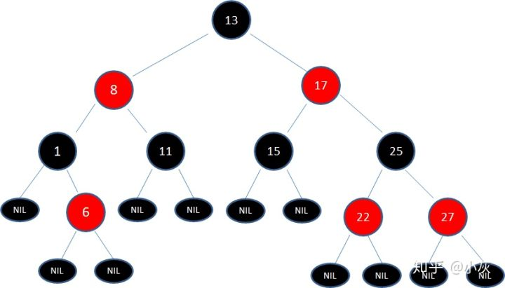

# 算法概述

## 1.空间复杂度

空间复杂度：描述算法占用内存空间的大小

1. 常量空间: O(1)
2. 线性空间: O(n)
3. 二维空间: O(n²)
4. 递归空间: O(n)

## 2. 时间复杂度

时间复杂度：若存在函数f(n), 使得当n趋近于无穷大时, T(n)/f(n)的极限值为不等于零的常数，则称f(n)是T(n)的同数量级的函数。记作T(n) = O(f(n)), 称为O(f(n)), O为算法的渐进时间复杂度，简称时间复杂度。

- 如果运行时间是常数量级，则用常数1表示。
- 只保留时间函数中的最高阶
- 如果最高阶存在，则省去最高阶项前面的系数

# 数据结构

## 1. 数组

数组是有限个相同类型的变量所组成的有序集合，数组中的每一个变量被称为元素。

## 2. 链表

链表是一种在物理上非连续、非顺序的数据结构，由若干个节点组成。

单向链表：只能往一个方向遍历。

双向链表：能够回溯到它的前置节点。

案例：链表逆转

```java
package linkedlist;


public class ReverseLinkedList {
	private static class Node {
		int data;
		Node next;
		Node(int data) {
			this.data = data;
		}
	}
	
	public static Node reverse(Node root) {
		if (root == null || root.next == null) {
			return root;
		}
		// 逆转其余的节点，得到逆转后的头节点，而root.next 为逆转后的尾节点
		Node rest = reverse(root.next);
		// 当前头节点root到逆转后的尾节点root.next
		root.next.next = root;
		// 取消之前的链接关系
		root.next = null;
		return rest;
	}
	
	
	public static Node createLinkedList(int length) {
		Node root = new Node(length);
		Node temp = root;
		while(length-- > 0) {
			Node newNode = new Node((int)(Math.random() * 50));
			temp.next = newNode;
			temp = newNode;
		}
		return root.next;
	}
	
	
	public static void output(Node root) {
		while (root != null) {
			System.out.print(root.data + "=>");
			root = root.next;
		}
		System.out.println("null");
	}
	
	public static void main(String[] args) {
		Node root = createLinkedList(10);
		output(root);
		Node reversedNode = reverse(root)；
		output(reversedNode);
		
	}
}

```


案例：链表k个一组逆转，不满k个不逆转

```java
package linkedlist;


public class ReverseKNode {
	private static class Node {
		int data;
		Node next;
		Node(int data) {
			this.data = data;
		}
	}
	
	public static Node reverse(Node root) {
		if (root == null || root.next == null) {
			return root;
		}
		// 逆转其余的节点，得到逆转后的头节点，而root.next 为逆转后的尾节点
		Node rest = reverse(root.next);
		// 当前头节点root到逆转后的尾节点root.next
		root.next.next = root;
		// 取消之前的链接关系
		root.next = null;
		return rest;
	}
	
	/**
	 * 逆转链表：每k个一组逆转，不满k个不逆转
	 * @param root
	 * @param k
	 * @return
	 */
	public static Node reverseKNode(Node root, int k) {
		Node temp = root;
		for(int i = 1; i < k && temp != null; i++) 
			temp = temp.next;
		if (temp == null) return root;
		Node rest = reverseKNode(temp.next, k);
		temp.next = null;
		Node reversedNode = reverse(root);
		root.next = rest;
		return reversedNode;
	}
	
	
	public static Node createLinkedList(int length) {
		Node root = new Node(length);
		Node temp = root;
		while(length-- > 0) {
			Node newNode = new Node((int)(Math.random() * 50));
			temp.next = newNode;
			temp = newNode;
		}
		return root.next;
	}
	
	
	
	public static void output(Node root) {
		while (root != null) {
			System.out.print(root.data + "=>");
			root = root.next;
		}
		System.out.println("null");
	}
	
	
	
	public static void main(String[] args) {
		Node root = createLinkedList(10);
		output(root);
		Node reversedNode = reverseKNode(root, 3);
		output(reversedNode);
	}
}

```


## 3. 栈

栈是一种线性数据结构，栈中的元素只能先入后出（FILO）。最早放入的元素叫作`栈底`，最后放入的元素叫作`栈顶`。

### 1. 入栈（push）

入栈是把新元素放入栈中，只允许从栈顶一侧放入元素，新元素的位置将会成为新的栈顶。

### 2. 出栈（pop）

出栈是把元素从栈中弹出，只有栈顶元素才允许出栈，出栈元素的前一个元素将会成为新的栈顶。

## 4. 队列

队列是一种线性数据结构，队列中的元素只能先入先出（FIFO），队列的出口叫作`队头`，队列的入口端叫作`队尾`。

> `(队尾下标+1) % 数组长度 = 队头下标`时，代表此队列已经满了。需要注意的是， 队尾指针指向的位置永远空出一位，所以队列的最大容量比数组长度小1。

### 5. 哈希表（散列表）

哈希表提供了`键`和`值`的对应关系。

解决哈希冲突的主要方法：

#### 1. 开放寻址法

当一个key通过哈希函数获得对用的数组下标已被占用时，寻找它的下一个空档位置。当然，在遇到哈希冲突时，寻址方法有很多种，并不一定只是简单的寻找当前元素的后一个元素。

Java `ThreadLocal`所使用的就是开放寻址法

#### 2. 链表法

数组的每一个元素是一个链表的头节点。

Java `HashMap`解决哈希冲突的方法就是使用链表法。

JDK中散列表实现类`HashMap`，影响扩容的因素：

- **Capacity**, 即`HashMap`的长度
- **LoadFactor**, 即HashMap的负载因子

扩容并不是简单的把散列表的长度扩大，而是先经历扩容，在重新进行hash。

# 树

`树`和`图`是典型的非线性数据结构。

`树`（tree）是n（n ≥ 0) 个节点的有限集。当 n = 0时， 称为空树。在任意一个非空树中，有如下特点：

1. 有且仅有一个特定的称为根的节点。
2.  当 n > 1 时，其余节点可分为m （m > 0）个互不相交的有限集，每一个集合本身又是一个树，并称为根的子树。

## 1. 二叉树

二叉树是树的一种特殊形式，树的每一个节点最多有2个孩子节点。

满二叉树：一个树的所有非叶子节点都存在左右孩子，并且所有叶子节点都在同一层级上，那么这个树就是满二叉树。

完全二叉树：对一个有n个节点的二叉树，按层级顺序编号，则所有节点的编号为从1到n，如果这个数的所有节点和同样深度的满二叉树的编号从1到n的几点位置相同，则这个二叉树为完全二叉树。

二叉树的主要应用

### 1. 查找

**二叉查找树**

- 如果左子树不为空，则左子树上所有的节点的值均小于根节点的值
- 如果右子树不为空，则右子树上所有的节点的值均大于根节点的值
- 左、右子树也都是二叉查找树

对于一个节点分布相对均衡的二叉查找树来说，如果节点总数是n，那么搜索节点的时间复杂度就是O(logn), 和树的深度是一样的。

这种依靠比较大小的逐步查找的方式，和二分查找算法相似。

### 2. 维持相对顺序

二叉查找树也叫二叉排序树

维持二叉树的相对顺序这就涉及二叉树的自平衡。

二叉树的自平衡方式：

#### 1. 红黑树

#### 2. AVL树

#### 3. 树堆


## 2. 二叉树的遍历

### 1. 深度优先遍历

#### 1. 前序遍历

父节点->左孩子->右孩子

方法一：递归

```java
class Test {
    private static class TreeNode {
        int data;
        TreeNode leftChild;
        TreeNode rightChild;
        TreeNode(int data) {
            this.data = data;
        }
    }
    public static void preOrderTraversal(TreeNode root) {
        if(root == null) {
            return;
        }
        System.out.println(root.data);
        preOrderTraversal(root.leftChild);
        preOrderTraversal(root.rightChild);
	}
}

```

方法二：栈

```java
import java.util.Stack;

class Test {
    private static class TreeNode {
        int data;
        TreeNode leftChild;
        TreeNode rightChild;
        TreeNode(int data) {
            this.data = data;
        }
    }
    
    public static void preOrderTravelWithStack(TreeNode root) {
        Stack<TreeNode> stack = new Stack<TreeNode>();
        TreeNode treeNode = root;
        while(treeNode != null || stack.isEmpty()) {
            while (treeNode != null) {
                System.out.println(treeNode.data);
                stack.push(treeNode);
                treeNode = treeNode.leftChild;
            }
            
            if (!stack.isEmpty()) {
                treeNode = stack.pop();
                treeNode = treeNode.rightChild();
            }
        }
    }
}
```


#### 2. 中序遍历

左孩子->父节点->右孩子

方法一：递归

```java
class Test {
    private static class TreeNode {
        int data;
        TreeNode leftChild;
        TreeNode rightChild;
        TreeNode(int data) {
            this.data = data;
        }
    }
    
    public static void inOrderTraversal(TreeNode root) {
        if (root == null) return;
       	inOrderTraversal(root.leftChild);
        System.out.println(root.data);
        inOrderTraversal(root.rightChild);
    }
}
```


方法二：栈

```java
class Test {
    private static class TreeNode {
        int data;
        TreeNode leftChild;
        TreeNode rightChild;
        TreeNode(int data) {
            this.data = data;
        }
    }
    
    public static void inOrderTravelWithStack(TreeNode root) {
        Stack<TreeNode> stack = new Stack<TreeNode>();
        TreeNode treeNode = root;
        while (treeNode != null || !stack.isEmpty()) {
            while (treeNode != null) {
                stack.push(treeNode);
                treeNode = treeNode.leftChild;
            }
            if (!stack.isEmpty()) {
                treeNode = stack.pop();
                System.out.println(treeNode.data);
                treeNode = treeNode.rightChild;
            }
        }
    }
}
```


#### 3. 后序遍历

左孩子->右孩子->父节点

方法一：递归

```java
class Test {
    private static class TreeNode {
        int data;
        TreeNode leftChild;
        TreeNode rightChild;
        TreeNode(int data) {
            this.data = data;
        }
    }
    public static void postOrderTraversal(TreeNode root) {
        if (root == null) return;
        postOrderTraversal(root.leftChild);
        postOrderTraversal(root.rightChild);
        System.out.println(root.data);
    }
}
```

方法二：栈

```java
import java.util.Map;
import java.util.HashMap;
import java.util.Stack;

class Test {
    private static class TreeNode {
        int data;
        TreeNode leftChild;
        TreeNode rightChild;
        TreeNode(int data) {
            this.data = data;
        }
    }
    
    public static void postOrderTravelWithStack(TreeNode root) {
        Map<TreeNode, Integer> status = new HashMap<TreeNode, Integer>();
        Stack<TreeNode> stack = new Stack<TreeNode>();
        TreeNode treeNode = root;
        while (treeNode != null || !stack.isEmpty()) {
            while (treeNode != null && !status.containsKey(treeNode)) {
                stack.push(treeNode);
                status.put(treeNode, new Integer(1));
                treeNode = treeNode.leftChild;
            }
            
            if (!stack.isEmpty()) {
                treeNode = stack.pop();
                if (status.get(treeNode) == 1) {
                    status.put(treeNode, new Integer(2));
                    stack.push(treeNode);
                    treeNode = treeNode.rightChild;
                }else if (status.get(treeNode) == 2) {
                    System.out.println(treeNode.data);
                    treeNode = null;
                }
            }
        }
    }
}
```


### 2. 广度优先遍历

#### 层序遍历

方法一：队列

```java
import java.util.Queue;
import java.util.LinkedList;

class Test {
    private static class TreeNode {
        int data;
        TreeNode leftChild;
        TreeNode rightChild;
        TreeNode(int data) {
            this.data = data;
        }
    }
    public static void levelOrderWithQueue(TreeNode treeNode) {
        Queue<TreeNode> queue = new LinkedList<TreeNode>();
        queue.offer(treeNode);
        while(!queue.isEmpty()) {
            treeNode = queue.poll();
            System.out.println(treeNode.data);
            if (treeNode.leftChild != null)
                queue.offer(treeNode.leftChild);
            if (treeNode.rightChild != null) {
                queue.offer(treeNode.rightChild);
            }
        }
    }
}
```

方法二：递归

```java
import java.util.List;
import java.util.ArrayList;

class Test {
    private static class TreeNode {
        int data;
        TreeNode leftChild;
        TreeNode rightChild;
        TreeNode(int data) {
            this.data = data;
        }
    }
    public static void levelOrderTravel(TreeNode root) {
        List<TreeNode> list = new ArrayList<TreeNode>();
        list.append(root);
        levelOrderTravelWithRecursion(list);
    }
    
     public static void levelOrderTravelRecursion(List<TreeNode> nodeList) {
    	if (nodeList == null || nodeList.size() == 0)
    		return;
    	List<TreeNode> list = new ArrayList<TreeNode>();
    	for(TreeNode treeNode : nodeList) {
    		System.out.println(treeNode.data);
    		if (treeNode.leftChild != null) {
    			list.add(treeNode.leftChild);
    		}
    		if (treeNode.rightChild != null) {
    			list.add(treeNode.rightChild);
    		}
    	}
    	levelOrderTravelRecursion(list);
    }
}
```


## 3. 二叉堆

二叉堆本质上是一种完全二叉树，它分为两个类型：

1. 最大堆：最大堆的任何一个父节点的值，都大于或等于它左、右孩子节点的值。
2. 最小堆：最小堆的任何一个父节点的值，都小于或等于它左、右孩子节点的值。

二叉堆的根节点叫作堆顶。

最大堆和最小堆的特点决定了：最大堆的堆顶是整个堆中的最大元素；最小堆的堆顶是整个堆中的最小元素。


### 1. 二叉堆的自我调整（以最小堆为例）

#### 1. 插入节点

当二叉堆插入节点时，插入位置是完全二叉树的最后一个位置。

二叉堆节点的插入实际就是节点的“上浮”操作

时间复杂度：O(logn)

```java
class Test {
    /**
     * array  二叉树的数组存储形式
     */
    public void upAdjust(int[] array) {
        int childIndex = array.length - 1;
        int parentIndex = (childIndex - 1) / 2;
        // 保存上浮的节点值
        int temp = array[childIndex];
        while (parentIndex > 0 && temp > array[parentIndex]) {
            array[childIndex] = array[parentIndex];
            childIndex = parentIndex;
            parentIndex = (childIndex - 1) / 2;
        }
        array[childIndex] = temp;
    }
}
```


#### 2. 删除节点

二叉堆的删除是删除处于堆顶的节点。

删除堆顶节点后，将二叉堆的最后的元素移动到堆顶，在进行二叉堆的自我调整。

二叉堆的删除实际是节点的“下沉”操作

时间复杂度:  O(logn)

```java
class Test {
    /**
     * 下沉调整
     * @param array 待调整的堆
     * @param parentIndex 要下沉的父节点
     * @param length 堆的有效大小
     */
    public static void downAdjust(int[] array, int parentIndex, int length) {
        int childIndex = childIndex * 2 + 1;
        // 保存待下沉的节点
        int temp = array[parentIndex];
        while (childIndex < length) {
            // 如果有右孩子且右孩子小于左孩子，则将childIndex指向右孩子
            if (childIndex + 1 < length && array[childIndex + 1] < array[childIndex])
                childIndex ++;
            // 如果父节点小于等于任何一个孩子节点的值，则跳出
            if (temp < array[childIndex]) 
                break;
            // 否则交换父子节点的值
            array[parentIndex] = array[childIndex];
            parentIndex = childIndex;
            childIndex = parentIndex* 2 + 1;
        }
        array[parentIndex] = temp;
    }
}
```


#### 3. 构建二叉堆

构建二叉堆，也就是把一个无序的二叉树调整为二叉堆，其本质是`让所有非叶节点依次“下沉”`。

时间复杂度：O(n)

> 构建堆的时间复杂度为 O(n)而不是O(nlogn), 由数学推到过程得出。

```java
class Test {
    public static void buildHeap(int[] array) {
        // 从最后一个非叶节点开始，依次进行下沉操作
        for (int i = (array.length - 2) / 2; i >= 0; i--){
            downAdjust(array, i, array.length);
        }
    }
    
    /**
     * 下沉调整
     * @param array 待调整的堆
     * @param parentIndex 要下沉的父节点
     * @param length 堆的有效大小
     */
    public static void downAdjust(int[] array, int parentIndex, int length) {
        int childIndex = childIndex * 2 + 1;
        // 保存待下沉的节点
        int temp = array[parentIndex];
        while (childIndex < length) {
            // 如果有右孩子且右孩子小于左孩子，则将childIndex指向右孩子
            if (childIndex + 1 < length && array[childIndex + 1] < array[childIndex])
                childIndex ++;
            // 如果父节点小于等于任何一个孩子节点的值，则跳出
            if (temp < array[childIndex]) 
                break;
            // 否则交换父子节点的值
            array[parentIndex] = array[childIndex];
            parentIndex = childIndex;
            childIndex = parentIndex* 2 + 1;
        }
        array[parentIndex] = temp;
    }
}
```


## 4.优先队列

优先队列：

最大优先队列，无论入队顺序如何，都是当前最大的元素优先出队

最小优先队列，无论入队顺序如何，都是当前最小的元素优先出队

优先队列的实现：

优先队列使用二叉堆来实现：

- 最大堆的堆顶是整个堆中的最大的元素

- 最小堆的堆顶是整个堆中的最小的元素

入队操作 => 二叉堆中节点的插入

出队操作 => 二叉堆中节点的删除

```java
import java.util.Arrays;

class PriorityQueue {
    private int[] array;
    private int size;
    public PriorityQueue() {
        // 队列初始长度32
        array = new int[32];
    }

    /**
     * 入队
     * @param key 入队元素
     */
    public void enQueue(int key) {
        // 队列超出长度，扩容
        if (size >= array.length)
            resize();
        
        array[size++] = key;
        upAdjust();
    }
    
    // 出队操作
    public int deQueue() throws Exception {
        if (size <= 0 ) {
            throw new Exception("this queue is empty!");
        }
        // 获取堆顶元素
        int head = array[0];
        array[0] = array[--size];
        downAdjust();
        return head;
    }
    
    // 上浮调整
    public void upAdjust() {
        int childIndex = this.size - 1;
        int parentIndex = (childIndex - 1) / 2;
        int temp = array[childIndex];
        while (childIndex > 0 && temp > array[parentIndex]) {
            array[childIndex] = array[parentIndex];
            childIndex = parentIndex;
            parentIndex = (childIndex - 1) / 2;
        }
        array[childIndex] = temp;
    }
    // 下沉调整
    public void downAdjust() {
        int parentIndex = 0;
        int childIndex = (parentIndex * 2) + 1;
        int temp = array[parentIndex];
        while (childIndex < size) {
            if (childIndex + 1 < size && array[childIndex + 1] > array[childIndex])
                childIndex ++;
            if (temp >= array[childIndex])
                break;
            array[parentIndex] = array[childIndex];
            parentIndex = childIndex;
            childIndex = parentIndex * 2 + 1;
        }
        array[parentIndex] = temp;
    }
    
    public void resize() {
        int newSize = this.size * 2;
        // 数组复制
        this.array = Arrays.copyOf(this.array, newSize);
    }
    
     
}
```


## 5.红黑树

1.结点是红色或黑色。

2.根结点是黑色。

3.每个叶子结点都是黑色的空结点（NIL结点）。

4 每个红色结点的两个子结点都是黑色。(从每个叶子到根的所有路径上不能有两个连续的红色结点)

5.从任一结点到其每个叶子的所有路径都包含相同数目的黑色结点。




# 排序算法

根据时间复杂度的不同，主流的排序算法可以分为3大类。

#### 1. 时间复杂度为O(*n*²)的排序算法

- 冒泡排序
- 选择排序
- 插入排序
- 希尔排序(希尔排序比较特殊，它的性能略优于O(*n*²)，但是有比不上O(*n*log*n*), 姑且归为此类)

#### 2. 时间复杂度为O(*n*log*n*)的排序算法

- 快速排序
- 归并排序
- 堆排序

#### 3. 时间复杂度为线性的排序算法

- 计数排序
- 桶排序
- 基数排序


排序算法的稳定性：即值相同的元素，排序后相对位置是否改变。

稳定排序：冒泡排序、鸡尾酒排序、插入排序、归并排序、计数排序、桶排序、基数排序

不稳定排序：选择排序、快速排序、堆排序、希尔排序

| 排序算法   | 平均时间复杂度 | 最坏时间复杂度 | 空间复杂度 | 是否稳定排序 |
| ---------- | -------------- | -------------- | ---------- | ------------ |
| 冒泡排序   | O(n²)          | O(n²)          | O(1)       | 稳定         |
| 鸡尾酒排序 | O(n²)          | O(n²)          | O(1)       | 稳定         |
| 快速排序   | O(nlogn)       | O(n²)          | O(logn)    | 不稳定       |
| 堆排序     | O(nlogn)       | O(nlogn)       | O(1)       | 不稳定       |
| 计数排序   | O(n+m)         | O(n+m)         | O(m)       | 稳定         |
| 桶排序     | O(n)           | O(nlogn)       | O(n)       | 稳定         |
|            |                |                |            |              |


## 1. 冒泡排序

把相邻的元素两两比较，当一个元素大于右侧相邻元素时，交换它们的位置；当一个元素小于或等于右侧相邻元素时，位置不变。

时间复杂度：O(n²)

```java
public void bubbleSort(int[] array) {
    for (int i = 1; i < array.length; i ++) {
        for (int j = 0; j < array.length - i; j ++) {
            if (array[j] > array[j+1]) {
                int temp = array[j];
                array[j] = array[j+1];
                array[j+1] = temp;
            }
        }
    }
}
```


冒泡排序的优化

优化一：

如果某一轮排序没有元素交换，则表示数已经有序，则剩下的几轮排序就没有必要执行了。

```java
public void bubbleSort(int[] array) {
    for (int i = 1; i < array.length; i++) {
        // 有序标记，每一轮初始值都是true
        boolean isSorted = true;
        for (int j = 0; j < array.length - i; j++) {
            if (array[j] > array[j+1]) {
                int temp = array[j];
                array[j] = array[j+1];
                array[j+1] = temp;
                isSorted = false;
            }
        }
        if (isSorted) break;
    }
}
```

优化二

默认的冒泡排序每一轮可以确定增加一位有序区的长度，即第n轮可以确定，数组后部分的有序区元素个数为n。

但当进行第n轮时，数组后半部分的有序区长度可能大于n，所以后面的多次元素比较是没有意义的。


```java
public static void bubbleSort(int[] array) {
    // 无序数列的边界，每次只需要比到这里为止
    int sortedBorder = array.length - 1;
    // 临时变量，储存交换中间值
	int tmp = 0;
    // 最后一次元素交换的索引
    int lastExchangeIndex = 0;
    for (int i = 1; i < array.length; i++) {
        // 有序标记，每一轮的初始值
        boolean isSorted = true;
        System.out.println("sortedBorder: " + sortedBorder);
        for (int j = 0; j < sortedBorder; j++) {
            if (array[j] > array[j + 1]) {
                tmp = array[j];
                array[j] = array[j + 1];
                array[j + 1] = tmp;
                isSorted = false;

                // 最后交换元素的位置为无序数列的边界
                lastExchangeIndex = j;
            }
        }
        if (isSorted) {
            break;
        }
        sortedBorder = lastExchangeIndex;
    }
}
```


完整代码

```java
package sortAlgorithme;

import java.util.Arrays;

public class BubbleSort {
	// 冒泡排序
	public static void bubbleSort(int[] array) {
        // 临时变量，储存交换中间值
        int tmp = 0;
		for (int i = 1; i < array.length; i++) {
			for (int j = 0; j < array.length - i; j++) {
				if (array[j] > array[j + 1]) {
					temp = array[j];
					array[j] = array[j + 1];
					array[j + 1] = temp;
				}
			}
		}
	}

	// 改进版冒泡排序
	public static void bubbleSortPlus(int[] array) {
        // 临时变量，储存交换中间值
        int tmp = 0;
		for (int i = 1; i < array.length; i++) {
			// 有序标记，每一轮的初始值都是true
			boolean isSorted = true;
			for (int j = 0; j < array.length - i; j++) {
				if (array[j] > array[j + 1]) {
					temp = array[j];
					array[j] = array[j + 1];
					array[j + 1] = temp;
					// 因为有元素交换，所以不是有序的，标记变为false
					isSorted = false;
				}
			}
			// 没有元素交换则退出
			if (isSorted) {
				break;
			}
		}
	}
	// 超级改进版
	public static void bubbleSortPlusPlus(int[] array) {
		// 无序数列的边界，每次只需要比到这里为止
		int sortedBorder = array.length - 1;
        // 临时变量，储存交换中间值
        int tmp = 0;
        // 最后一次元素交换的索引
        int lastExchangeIndex = 0;
		for (int i = 1; i < array.length; i++) {
			// 有序标记，每一轮的初始值
			boolean isSorted = true;
			System.out.println("sortedBorder: " + sortedBorder);
			for (int j = 0; j < sortedBorder; j++) {
				if (array[j] > array[j + 1]) {
					tmp = array[j];
					array[j] = array[j + 1];
					array[j + 1] = tmp;
					isSorted = false;
					// 最后交换元素的位置为无序数列的边界
					lastExchangeIndex = j;
				}
			}
			if (isSorted) {
				break;
			}
			sortedBorder = lastExchangeIndex;
		}
	}

	public static void main(String[] args) {
		int[] array = new int[] { 5, 8, 6, 3, 9, 2, 1, 7 };
		// int[] array = new int[] { 3, 4, 2, 1, 5, 6, 7, 8 };
		System.out.println("before sort:" + Arrays.toString(array));
		// bubbleSort(array);
		// bubbleSortPlus(array);
		bubbleSortPlusPlus(array);
		System.out.println("after sort:" + Arrays.toString(array));
	}
}

```

## 2. 鸡尾酒排序

鸡尾酒排序是基于冒泡排序的一种升级排序法。

冒泡排序的每一个元素都可以像小气泡一样，根据自身大小，一点一点的向着数组的一侧移动，算法的每一轮是从左到右比较元素，进行单向的位置交换的。

鸡尾酒排序的元素比较和交换过程是双向的。即先从左到右比较再从右到左比较循环此过程。

时间复杂度：O(n²)

```java
package sortAlgorithme;

import java.util.Arrays;

public class CocktailSort {
	/**
	 * 鸡尾酒排序
	 * 
	 * @param array 待排序的数组
	 */
	public static void cocktailSort(int[] array) {
		// 临时变量，用于元素交换
		int tmp = 0;
		int count = 0;
		for (int i = 1; i < array.length / 2; i++) {
			// 有序标记， 每一轮的初始值为true
			boolean isSorted = true;
			// 奇数轮，从左到右比较和交换
			for (int j = i - 1; j < array.length - i; j++) {
				if (array[j] > array[j + 1]) {
					tmp = array[j];
					array[j] = array[j + 1];
					array[j + 1] = tmp;
					isSorted = false;
				}
			}
			if (isSorted)
				break;

			// 偶数轮之前重新标记为true
			isSorted = true;
            // 偶数轮，从右到左比较和交换
			for (int j = array.length - i; j > i - 1; j--) {
				if (array[j] < array[j - 1]) {
					tmp = array[j];
					array[j] = array[j - 1];
					array[j - 1] = tmp;
					isSorted = false;
				}
			}

			if (isSorted)
				break;

		}

	}

	/**
	 * 鸡尾酒排序改进，使用无序区减少多余的元素比较，同冒泡排序的第二版改进
	 * 
	 * @param array 待排序的数组
	 */
	public static void cocktailSortPlus(int[] array) {
		// 临时变量，用于元素交换
		int tmp = 0;
        // 记录左侧最后一次交换的位置
		int leftSortedBorder = 0;
        // 记录右侧最后一次交换的位置
		int rightSortedBorder = array.length - 1;
        // 无序数列的左边界，每次比较只需要比到这里为止
		int lastLeftExchangeIndex = 0;
        // 无序数列的右边界，每次比较只需要比到这里为止
		int lastRightExchangeIndex = 0;
		for (int i = 1; i < array.length / 2; i++) {
			// 有序标记， 每一轮的初始值为true
			boolean isSorted = true;
			// 奇数轮，从左到右比较和交换
			for (int j = i - 1; j < rightSortedBorder; j++) {
				if (array[j] > array[j + 1]) {
					tmp = array[j];
					array[j] = array[j + 1];
					array[j + 1] = tmp;
					isSorted = false;
					lastRightExchangeIndex = j;
				}
			}
			if (isSorted)
				break;
			rightSortedBorder = lastRightExchangeIndex;
			
            // 偶数轮之前重新标记为true
			isSorted = true;
            // 偶数轮，从右到左比较和交换
			for (int j = array.length - i; j > leftSortedBorder; j--) {
				if (array[j] < array[j - 1]) {
					tmp = array[j];
					array[j] = array[j - 1];
					array[j - 1] = tmp;
					isSorted = false;
					lastLeftExchangeIndex = j;
				}
			}

			if (isSorted)
				break;
			leftSortedBorder = lastLeftExchangeIndex;
		}

	}

	public static void main(String[] args) {
		int[] array = new int[] { 2, 3, 4, 5, 6, 7, 8, 1 };
		System.out.println("before sort:" + Arrays.toString(array));
		// cocktailSort(array);
		cocktailSortPlus(array);
		System.out.println("after sort:" + Arrays.toString(array));
	}

}
```

## 3. 选择排序

冒泡排序的弊端是有着频繁的数组元素交换，这意味着更多的读写操作，严重影响代码的运行效率。

选择排序：同冒泡排序一样要进行n-1选出有序的元素，每一轮选出最小者直接交换到左侧。

时间复杂度：O(n²)

```java
package sortAlgorithme;

import java.util.Arrays;

public class SelectSort {
	public static void selectSort(int[] array) {
		for (int i = 0; i < array.length - 1; i++) {
			// 每一轮的最小值索引
			int minIndex = i;
			for (int j = i + 1; j < array.length; j++) {
				if (array[j] < array[minIndex]) {
					minIndex = j;
				}
			}
			int temp = array[i];
			array[i] = array[minIndex];
			array[minIndex] = temp;
		}
	}
	
	public static void main(String[] args) {
		int[] array = new int[] { 4, 7,5,1,9, 6, 2,3, 8};
		System.out.println("bofore sort:" + Arrays.toString(array));
		selectSort(array);
		System.out.println("after sort:" + Arrays.toString(array));
	}
}

```


## 4. 插入排序

插入排序的思想和玩牌一样：维护一个有序区，把元素一个一个插入到有序区的适当位置，直到所有元素有序为止。

时间复杂度：O(n²)

```java
package sortAlgorithme;

import java.util.Arrays;

public class InsertSort {
	public static void insertSort(int[] array) {
		
		for (int i = 1; i < array.length; i++) {
			int insertValue = array[i];
			int j = i - 1;
			for (; j >= 0 && insertValue < array[j]; j--) {
				array[j+1] = array[j];
			}
			array[j+1] = insertValue;
		}
	}
	
	public static void insertSort1(int[] array) {
		for (int i = 1; i < array.length; i++) {
			int insertValue = array[i];
			int j = i - 1;
			while (j >= 0 && insertValue < array[j]) {
				array[j+1] = array[j];
				j--;
			}
			array[j+1] = insertValue;
			
		}
	}
	
	public static void main(String[] args) {
		int[] array = new int[] { 4, 7, 5, 1, 9, 6, 2, 3, 8 };
		System.out.println("before sort: " + Arrays.toString(array));
		insertSort(array);
		// insertSort1(array);
		System.out.println("after sort:" + Arrays.toString(array));
	}
}

```


## 5. 快速排序

同冒泡排序一样，快速排序也属于**交换排序**, 通过元素之间的比较和交换位置来达到排序的目的。

思想：冒泡排序在每一轮中只把一个元素冒泡到数列的一端，而**快速排序则在每一轮挑选一个基准元素，让其他比他大的元素移动到数列的一边，比他小的元素移动到数列的另一边，从而把数列拆解成两个部分。**

平均时间复杂度：O(nlogn)

### 1. 基准元素的选择

快速排序运用了分治法。在分治过程中，以基准元素为中心，把其他元素移动到它的左右两边。

选择基准元素最简单的方式就是选择数列的第一个元素，但是对一个原本逆序的数组这种极端情况下，快速排序需要进行n轮，时间复杂度退化成了O(n²)。

**随机选择一个元素作为基准元素**，并且让基准元素和数列首元素交换位置，则可以避免上述情况。


### 2. 元素的交换

选定了基准元素后，我们要做的就是把其它元素中小于基准元素的都交换到元素的一边，大于基准元素的都交换到基准元素的另一边。有两种方法实现

#### 1. 双边循环法

```java
package sortAlgorithme;

import java.util.Arrays;

public class QuickSort {
	public static void quickSort(int[] array, int i, int j) {

		if (i >= j)
			return;
		
		// 得到基准元素的位置
		int pivotIndex = partition(array, i, j);
		// 根据基准元素，分成两部分进行递归排序
		quickSort(array, i, pivotIndex-1);
		quickSort(array, pivotIndex+1, j);
	}
	
	/**
	 * 双边循环法
	 * 选定一个基准元素，并设置两个指针left和right指向数列的最左端和最右端
	 * 		1. 从left指针开始，且left小于right，如果left指针指向的元素小于基准元素，则left指针右移一位，按此，直到碰到大于基准元素的元素。
	 * 		2. 从right指针开始，且left小于right，如果right指针指向的元素大于基准元素，则right指针左移一位，按此，直到碰到小于基准元素的元素。
	 * 		3. 交换left指针和right指针所指向的元素的位置
	 * 		4. 当left < right, 重复1~3
	 * 		5. 交换基准元素和（left或right指针所指向元素）的位置
	 * @param array
	 * @param i
	 * @param j
	 * @return
	 */
	public static int partition(int[] array, int i, int j) {
		int pivot = array[i];
		int left = i;
		int right = j;
		while(left < right) {
			while (left < right && pivot < array[right])
				right--;
			while (left < right && pivot >= array[left])
				left++;
			if (left < right) {
				int tmp = array[left];
				array[left] = array[right];
				array[right] = tmp;
			}
			
		}
		array[i] = array[left];
		array[left] = pivot;
		return left;
	}
	
	public static void main(String[] args) {
		int[] array = new int[] { 4, 7, 5, 1, 9, 6, 2, 3, 8 };
		System.out.println("before sort: " + Arrays.toString(array));
		quickSort(array, 0, array.length - 1);
		System.out.println("after sort:" + Arrays.toString(array));
	}
}

```


#### 2. 单边循环法

选定基准元素pivot， 同时设置一个mark指针指向数列起始位置，这个mark指针代表小于基准元素的区域边界


```java
package sortAlgorithme;

import java.util.Arrays;

public class QuickSort {
	public static void quickSort(int[] array, int i, int j) {

		if (i >= j)
			return;
		
		// 得到基准元素的位置
		int pivotIndex = partition(array, i, j);
		// 根据基准元素，分成两部分进行递归排序
		quickSort(array, i, pivotIndex-1);
		quickSort(array, pivotIndex+1, j);
	}
	
	/**
	 * 单边循环法:
	 * 设置两个变量：
	 * 		基准元素pivot：以此元素为基准，将元素分为比它大和比它小的两个区域，默认为开始下标i指向的元素
	 * 		mark指针：小于基准元素的区域边界，默认为开始下标i
	 * 遍历数组，如果遍历到的元素大于pivot，则继续遍历；如果遍历到的元素小于基准元素pivot，则将mark指针往后移
	 * 一位，并把最新遍历到的元素交换遍历mark指针所在位置的元素交换位置。依次，直至遍历结束。
	 * 最后交换基准元素和mark指针所在的位置的元素的位置。
	 * 返回mark指针
	 * @param array	待排序的元素
	 * @param i		起始下标位置
	 * @param j		结束下标位置
	 * @return mark指针
	 */
	public static int partition(int[] array, int i, int j) {
		int pivot = array[i];
		int mark = i;
		int tmp;
		for (int t = i; t <= j; t++) {
			if (array[t] < pivot) {
				mark ++;
				tmp = array[mark];
				array[mark] = array[t];
				array[t] = tmp;
			}
		}
		array[i] = array[mark];
		array[mark] = pivot;
		return mark;
		
		
	}
	public static void main(String[] args) {
		int[] array = new int[] { 4, 7, 5, 1, 9, 6, 2, 3, 8 };
		System.out.println("before sort: " + Arrays.toString(array));
		quickSort(array, 0, array.length - 1);
		System.out.println("after sort:" + Arrays.toString(array));
	}
}

```

## 6. 堆排序

堆排序的步骤：

1. 把无序数组构建成二叉堆。需要从小到大排序，则构建成最大堆；需要从大到小排序，则构建最小堆。
2. 循环删除堆顶元素，替换到二叉堆的末尾，调整堆产生新的堆顶。

算法复杂度：O(nlogn)


```java
package sortAlgorithme;

import java.util.Arrays;

public class HeapSort {
	public static void heapSort(int[] array) {
		// 临时交换空间
		int tmp = 0;
		// 1. 把无序数组构建成最大堆
		for (int i = (array.length - 2) / 2; i >= 0; i--)
			downAdjust(array, i, array.length - i);
		// 2. 循环删除堆顶元素，移到集合尾部，调整堆产生新的堆顶
		for (int i = array.length - 1; i > 0; i--) {
			// 交换最大堆最后一个元素和第一个元素
			tmp = array[i];
			array[i] = array[0];
			array[0] = tmp;
			// 下沉调整最大堆
			downAdjust(array, 0, i);
		}
	}

	/**
	 * 下沉调整
	 * 
	 * @param array
	 * @param parentIndex
	 * @param length
	 */
	public static void downAdjust(int[] array, int parentIndex, int length) {
		int childIndex = parentIndex * 2 + 1;
		int temp = array[parentIndex];
		while (childIndex < length) {
			if (childIndex + 1 < length && array[childIndex + 1] > array[childIndex])
				childIndex++;
			if (temp >= array[childIndex])
				break;
			array[parentIndex] = array[childIndex];
			parentIndex = childIndex;
			childIndex = parentIndex * 2 + 1;
		}

		array[parentIndex] = temp;
	}
	
	
	public static void main(String[] args) {
		int[] array = new int[] { 4, 7, 5, 1, 9, 6, 2, 3, 8 };
		System.out.println("before sort: " + Arrays.toString(array));
		heapSort(array);
		System.out.println("after sort:" + Arrays.toString(array));
	}

}
```


## 7. 希尔排序

希尔排序是插入排序的优化，对插入排序的优化，可以从这两个特点入手：

1. 在大多数元素已经有序的情况下，插入排序的工作量较小。
2. 在元素较少的情况下，插入排序的工作量较小。

希尔排序就是针对以上两个特点改进插入排序的。


```java
package sortAlgorithme;

import java.util.Arrays;

public class ShellSort {
	public static void shellSort(int[] array) {
		int d = array.length;
		while (d > 1) {
			d = d / 2;
			for (int x = 0; x < d; x++) {
				for (int i = x + d; i < array.length; i += d) {
					int temp = array[i];
					int j = i - d;
					for (; j >= 0 && temp < array[j]; j -= d) {
						array[j + d] = array[j];
					}
					array[j+d] = temp;
				}
			}
		}
	}

	public static void main(String[] args) {
		int[] array = new int[] { 4, 7, 5, 1, 9, 6, 2, 3, 8 };
		System.out.println("before sort: " + Arrays.toString(array));
		shellSort(array);
		System.out.println("after sort:" + Arrays.toString(array));
	}
}
```


## 8. 归并排序

归并排序采用了分治法。

归并排序的思想：将数组进行逐层的拆半分组，直到每组只有一个元素位置，分完组后再进行归并，归并过程中创建了一个两组合并后大小的新数组，用于储存归并后的数组，遍历待归并的两组，并按从小到大的顺序，插入到新数组。

算法复杂度：O(nlogn)


```java
package sortAlgorithme;

import java.util.Arrays;

public class MergeSort {
	public static void mergeSort(int[] array, int start, int end) {
		if (start < end) {
			int mid = (start + end) / 2;
            // 使用下面这种可以避免整数溢出
			// int mid = start + (end - start) >> 2;
			mergeSort(array, start, mid);
			mergeSort(array, mid + 1, end);
			merge(array, start, mid, end);
		}
	}

	public static void merge(int[] array, int start, int mid, int end) {
		int[] newArr = new int[end-start+1];
		int left = start;
		int right = mid+1;
		int index = 0;
		while (left <= mid || right <= end) {
			if (right > end || left <= mid && array[left] <= array[right]) {
				newArr[index++] = array[left++];
			}else {
				newArr[index++] = array[right++];
			}
			// else if (right <= end && array[left] > array[right] || left > mid){
			// 	newArr[index++] = array[right++];
			// }
			
		}
		System.arraycopy(newArr, 0, array, start, index);
	}
	
	public static void main(String[] args) {
		int[] array = new int[] { 4, 7, 5, 1, 9, 6, 2, 3, 8 };
		System.out.println("before sort: " + Arrays.toString(array));
		mergeSort(array, 0, array.length-1);
		System.out.println("after sort:" + Arrays.toString(array));
	}
}
```


## 9. 计数排序

时间复杂度：O(n)


## 10. 基数排序


## 11. 桶排序


# 比特位的应用

## n & (~n + 1) 或者 n & -n

获得二进制最低位为1的位置，其结果为除最低位为1，其余位为0的数

```
>>> f = lambda x: bin(x & (~x + 1))
>>> f(5)
'0b1'
>>> bin(5)
'0b101'
>>> f(64)
'0b1000000'
>>> bin(64)
'0b1000000'
>>> 
```

