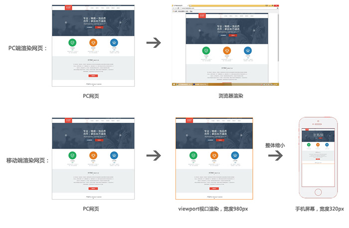
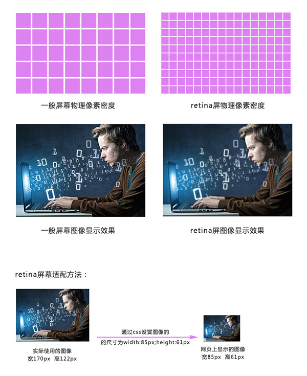
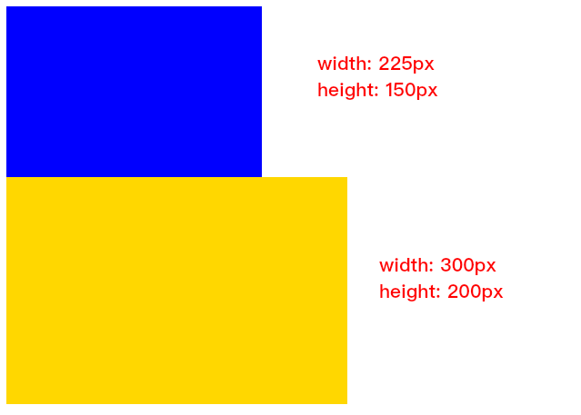
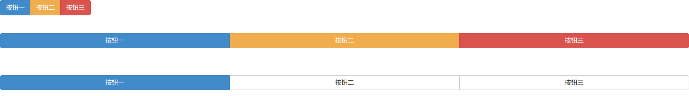
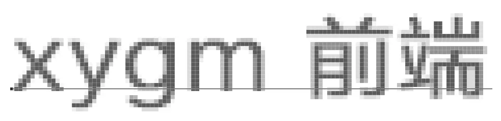
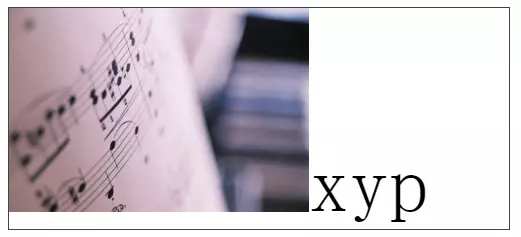

## CSS 背景属性

| Property                                                     | 描述                                                      |
| ------------------------------------------------------------ | --------------------------------------------------------- |
| [background](https://www.w3cschool.cn/cssref/css3-pr-background.html) | 简写属性，作用是将背景属性设置在一个声明中。              |
| [background-attachment](https://www.w3cschool.cn/cssref/pr-background-attachment.html) | 背景图像是否固定或者随着页面的其余部分滚动。              |
| [background-color](https://www.w3cschool.cn/cssref/pr-background-color.html) | 设置元素的背景颜色。                                      |
| [background-image](https://www.w3cschool.cn/cssref/pr-background-image.html) | 把图像设置为背景。 # background-image: url('imgpath.jpg') |
| [background-position](https://www.w3cschool.cn/cssref/pr-background-position.html) | 设置背景图像的起始位置。                                  |
| [background-repeat](https://www.w3cschool.cn/cssref/pr-background-repeat.html) | 设置背景图像是否及如何重复。                              |

### `backgound-attachment`

|   值    |            说明            |
| :-----: | :------------------------: |
| scroll  | 背景图片随页面其余部分滚动 |
|  fixed  |      背景图像固定不动      |
| inherit |     从父元素继承此属性     |

### `background-positioin`

| <span style="white-space:nowrap;">&emsp;&emsp;&emsp;&emsp;&emsp;&emsp;值&emsp;&emsp;&emsp;&emsp;&emsp;&emsp;</span> | 描述                                                         |
| :----------------------------------------------------------: | :----------------------------------------------------------- |
| `left top`<br> `left center`<br/> `left bottom`<br/> `right top`<br/>` right center`<br/>` right bottom`<br/> `center top `<br/>`center center` <br/>`center bottom` | 如果仅指定一个关键字，其他值将会是"center"                   |
|                           *x% y%*                            | 第一个值是水平位置，第二个值是垂直。左上角是0％0％。右下角是100％100％。如果仅指定了一个值，其他值将是50％。 。默认值为：0％0％ |
|                         *xpos ypos*                          | 第一个值是水平位置，第二个值是垂直。左上角是0。单位可以是像素（0px0px）或任何其他 [CSS单位](https://www.runoob.com/try/css-units.html)。如果仅指定了一个值，其他值将是50％。你可以混合使用％和positions |
|                           inherit                            | 指定background-position属性设置应该从父元素继承              |

### `background-repeat`

| 值        | 说明                                         |
| :-------- | :------------------------------------------- |
| repeat    | 背景图像将向垂直和水平方向重复。这是默认     |
| repeat-x  | 只有水平位置会重复背景图像                   |
| repeat-y  | 只有垂直位置会重复背景图像                   |
| no-repeat | background-image不会重复                     |
| inherit   | 指定background-repea属性设置应该从父元素继承 |

### `background-size`

| 值         | 描述                                                         |
| :--------- | :----------------------------------------------------------- |
| length     | 设置背景图片高度和宽度。第一个值设置宽度，第二个值设置的高度。如果只给出一个值，第二个是设置为 **auto**(自动) |
| percentage | 将计算相对于背景定位区域的百分比。第一个值设置宽度，第二个值设置的高度。如果只给出一个值，第二个是设置为"auto(自动)" |
| cover      | 此时会保持图像的纵横比并将图像缩放成将完全覆盖背景定位区域的最小大小。 |
| contain    | 此时会保持图像的纵横比并将图像缩放成将适合背景定位区域的最大大小。 |


## 文本的对齐方式

文本排列属性是用来设置文本的水平对齐方式。

文本可居中或对齐到左或右,两端对齐.

当text-align设置为"justify"，每一行被展开为宽度相等，左，右外边距是对齐（如杂志和报纸）。


## 文本修饰

text-decoration 属性用来设置或删除文本的装饰。

从设计的角度看 text-decoration属性主要是用来删除链接的下划线：

h1 {text-decoration:overline;} 
h2 {text-decoration:line-through;} 
h3 {text-decoration:underline;}


## 文本缩进

文本缩进属性是用来指定文本的第一行的缩进。

CSS 提供了 text-indent 属性，该属性可以方便地实现文本缩进。

通过使用 text-indent 属性，所有元素的第一行都可以缩进一个给定的长度。

p {text-indent:50px;}


## 文本间隔

word-spacing 属性可以改变字（单词）之间的标准间隔。其默认值 normal 与设置值为 0 是一样的。


## 所有CSS文本属性

| 属性                                                         | 描述                     |
| ------------------------------------------------------------ | ------------------------ |
| [color](https://www.w3cschool.cn/cssref/pr-text-color.html)  | 设置文本颜色             |
| [direction](https://www.w3cschool.cn/cssref/pr-text-direction.html) | 设置文本方向。           |
| [letter-spacing](https://www.w3cschool.cn/cssref/pr-text-letter-spacing.html) | 设置字符间距             |
| [line-height](https://www.w3cschool.cn/cssref/pr-dim-line-height.html) | 设置行高                 |
| [text-align](https://www.w3cschool.cn/cssref/pr-text-text-align.html) | 对齐元素中的文本         |
| [text-decoration](https://www.w3cschool.cn/cssref/pr-text-text-decoration.html) | 向文本添加修饰           |
| [text-indent](https://www.w3cschool.cn/cssref/pr-text-text-indent.html) | 缩进元素中文本的首行     |
| [text-shadow](https://www.w3cschool.cn/cssref/css3-pr-text-shadow.html) | 设置文本阴影             |
| [text-transform](https://www.w3cschool.cn/cssref/pr-text-text-transform.html) | 控制元素中的字母         |
| [unicode-bidi](https://www.w3cschool.cn/cssref/pr-text-unicode-bidi.html) | 设置或返回文本是否被重写 |
| [vertical-align](https://www.w3cschool.cn/cssref/pr-pos-vertical-align.html) | 设置元素的垂直对齐       |
| [white-space](https://www.w3cschool.cn/cssref/pr-text-white-space.html) | 设置元素中空白的处理方式 |
| [word-spacing](https://www.w3cschool.cn/cssref/pr-text-word-spacing.html) | 设置字间距               |


## CSS Display(显示) 与 Visibility（可见性）

CSS display 属性和 visibility属性都可以用来隐藏某个元素，但是这两个属性有不同的定义，请详细阅读以下内容。


## 隐藏元素 - display:none或visibility:hidden

隐藏一个元素可以通过把display属性设置为"none"，或把visibility属性设置为"hidden"。但是请注意，这两种方法会产生不同的结果。

visibility:hidden可以隐藏某个元素，但隐藏的元素仍需占用与未隐藏之前一样的空间。也就是说，该元素虽然被隐藏了，但仍然会影响布局。

display:none可以隐藏某个元素，且隐藏的元素不会占用任何空间。也就是说，该元素不但被隐藏了，而且该元素原本占用的空间也会从页面布局中消失。


## CSS Display - 块和内联元素

块元素是一个元素，占用了全部宽度，在前后都是换行符。

内联元素只需要必要的宽度，不强制换行。


## CSS Outline


- 取消按钮点击时的蓝色边框

  ```css
  button{
      outline: none;
  }
  ```


## CSS a

- a:link ：是未被访问的样式，可以在里面加很多东西，比如说去掉下划线，换颜色等功能都能在这里实现；
- a:visited ：是已被点击后的样式，也可以在里面加很多元素，可以去下划线，改颜色，放大等功能；
- a:hover ：这个是鼠标悬停的样式，这个等下有实例介绍，我们先来认识一下，是把鼠标停在超链接的位置的时候可以设置变颜色；
- a:active ：这个说是已被激活的样式，简单得说就是能把鼠标点上去的时候，瞬间出的样式，在很多网站上都有这种样式的；

>  提示：在  CSS 定义中，a:hover 必须被置于 a:link 和 a:visited 之后，才是有效的。
>
>  提示：在  CSS 定义中，a:active 必须被置于 a:hover 之后，才是有效的。


## CSS Position

### `static` 定位

HTML元素的默认值,即没有定位,遵循正常的文档流对象.

静态定位的元素不会受到`top`, `bottom`, `left`, `right`影响

### `fixed`定位

元素的位置相对于浏览器窗口是固定位置.

即使窗口是滚动的,它也不会移动.

> **注意：** Fixed 定位在 IE7 和 IE8 下需要描述 !DOCTYPE 才能支持。
>
> Fixed定位使元素的位置与文档流无关，因此不占据空间。
>
> Fixed定位的元素和其他元素重叠。
>

### `relative`定位

相对定位的元素的定位是相对于其正常定位.

移动相对定位元素,但他原本所占用的空间不会改变.

相对定位元素经常被用来作为绝地定位元素的容器块.

### `absolute`定位

绝对定位的元素位置相对于最近的已定位父元素,如果元素没有已定位的父元素,那么它的位置相对于`<html>`

### `sticky`定位

有点类似于Excel的固定表头

sticky 英文字面意思是粘，粘贴，所以可以把它称之为粘性定位。

**position: sticky;** 基于用户的滚动位置来定位。

粘性定位的元素是依赖于用户的滚动，在 **position:relative** 与 **position:fixed** 定位之间切换。

它的行为就像 **position:relative;** 而当页面滚动超出目标区域时，它的表现就像 **position:fixed;**，它会固定在目标位置。

元素定位表现为在跨越特定阈值前为相对定位，之后为固定定位。

这个特定阈值指的是 top, right, bottom 或 left 之一，换言之，指定 top, right, bottom 或 left 四个阈值其中之一，才可使粘性定位生效。否则其行为与相对定位相同。

**注意:** Internet Explorer, Edge 15 及更早 IE 版本不支持 sticky 定位。 Safari 需要使用 -webkit- prefix (查看以下实例)。

### 重叠的元素

元素的定位与文档流无关，所以它们可以覆盖页面上的其它元素

z-index属性指定了一个元素的堆叠顺序（哪个元素应该放在前面，或后面）

一个元素可以有正数或负数的堆叠顺序

### 所有的CSS定位属性

"CSS" 列中的数字表示哪个CSS(CSS1 或者CSS2)版本定义了该属性。 

| 属性                                                         | 说明                                                         | 值                                                           | CSS  |
| :----------------------------------------------------------- | :----------------------------------------------------------- | :----------------------------------------------------------- | :--- |
| [bottom](https://www.runoob.com/cssref/pr-pos-bottom.html)   | 定义了定位元素下外边距边界与其包含块下边界之间的偏移。       | auto *length%*inherit                                        | 2    |
| [clip](https://www.runoob.com/cssref/pr-pos-clip.html)       | 剪辑一个绝对定位的元素                                       | *shape*auto inherit                                          | 2    |
| [cursor](https://www.runoob.com/cssref/pr-class-cursor.html) | 显示光标移动到指定的类型                                     | *url* auto crosshair default pointer move e-resize ne-resize nw-resize n-resize se-resize sw-resize s-resize w-resize text wait help | 2    |
| [left](https://www.runoob.com/cssref/pr-pos-left.html)       | 定义了定位元素左外边距边界与其包含块左边界之间的偏移。       | auto *length%*inherit                                        | 2    |
| [overflow](https://www.runoob.com/cssref/pr-pos-overflow.html) | 设置当元素的内容溢出其区域时发生的事情。                     | auto hidden scroll visible inherit                           | 2    |
| [overflow-y](https://www.runoob.com/css/cssref/css3-pr-overflow-y.html) | 指定如何处理顶部/底部边缘的内容溢出元素的内容区域            | auto hidden scroll visible no-display no-content             | 2    |
| [overflow-x](https://www.runoob.com/css/cssref//cssref/css3-pr-overflow-x.html) | 指定如何处理右边/左边边缘的内容溢出元素的内容区域            | auto hidden scroll visible no-display no-content             | 2    |
| [position](https://www.runoob.com/cssref/pr-class-position.html) | 指定元素的定位类型                                           | absolute fixed relative static inherit                       | 2    |
| [right](https://www.runoob.com/cssref/pr-pos-right.html)     | 定义了定位元素右外边距边界与其包含块右边界之间的偏移。       | auto *length%*inherit                                        | 2    |
| [top](https://www.runoob.com/cssref/pr-pos-top.html)         | 定义了一个定位元素的上外边距边界与其包含块上边界之间的偏移。 | auto *length%*inherit                                        | 2    |
| [z-index](https://www.runoob.com/cssref/pr-pos-z-index.html) | 设置元素的堆叠顺序                                           | *number*auto inherit                                         | 2    |


## 鼠标属性设置

```html
<p>请把鼠标移动到单词上，可以看到鼠标指针发生变化：</p>
<span style="cursor:auto">auto</span><br>
<span style="cursor:crosshair">crosshair</span><br>
<span style="cursor:default">default</span><br>
<span style="cursor:e-resize">e-resize</span><br>
<span style="cursor:help">help</span><br>
<span style="cursor:move">move</span><br>
<span style="cursor:n-resize">n-resize</span><br>
<span style="cursor:ne-resize">ne-resize</span><br>
<span style="cursor:nw-resize">nw-resize</span><br>
<span style="cursor:pointer">pointer</span><br>
<span style="cursor:progress">progress</span><br>
<span style="cursor:s-resize">s-resize</span><br>
<span style="cursor:se-resize">se-resize</span><br>
<span style="cursor:sw-resize">sw-resize</span><br>
<span style="cursor:text">text</span><br>
<span style="cursor:w-resize">w-resize</span><br>
<span style="cursor:wait">wait</span><br>
```


## css 伪元素

伪元素选择器有before和after,它们可以通过样式在元素中插入内容。

```html
.box1:hover{color:red}
.box2:before{content:'行首文字';}
.box3:after{content:'行尾文字';}


<div class="box1">....</div>
<div class="box2">....</div>
<div class="box3">....</div>
```


## css margin

**外边距合并**

外边距合并指的是，当两个垂直外边距相遇时，它们将形成一个外边距。合并后的外边距的高度等于两个发生合并的外边距的高度中的较大者。解决方法如下：

1、使用这种特性
2、设置一边的外边距，一般设置margin-top
3、将元素浮动或者定位


**margin-top 塌陷**

在两个盒子嵌套时候，内部的盒子设置的margin-top会加到外边的盒子上，导致内部的盒子margin-top设置失败，解决方法如下：

1、外部盒子设置一个边框
2、外部盒子设置 overflow:hidden
3、使用伪元素类：

```css
.clearfix:before{
    content: '';
    display:table;
}
```


## css 权重

CSS权重指的是样式的优先级，有两条或多条样式作用于一个元素，权重高的那条样式对元素起作用,权重相同的，后写的样式会覆盖前面写的样式。

### 权重的等级

可以把样式的应用方式分为几个等级，按照等级来计算权重

1、!important，加在样式属性值后，权重值为 10000
2、内联样式，如：style=””，权重值为1000
3、ID选择器，如：#content，权重值为100
4、类，伪类和属性选择器，如： content、:hover 权重值为10
5、标签选择器和伪元素选择器，如：div、p、:before 权重值为1
6、通用选择器（*）、子选择器（>）、相邻选择器（+）、同胞选择器（~）、权重值为0

### 权重的计算实例

1、实例一：

```
<style type="text/css">
    div{
        color:red !important;
    }        
</style>
......
<div style="color:blue">这是一个div元素</div>
<!-- 
两条样式同时作用一个div，上面的样式权重值为10000+1，下面的行间样式的权重值为1000，
所以文字的最终颜色为red 
-->
```

2、实例二：

```
<style type="text/css">
    #content div.main_content h2{
        color:red;    
    }
    #content .main_content h2{
        color:blue;
    }
</style>
......
<div id="content">
    <div class="main_content">
        <h2>这是一个h2标题</h2>
    </div>
</div>
<!-- 
第一条样式的权重计算： 100+1+10+1，结果为112；
第二条样式的权重计算： 100+10+1，结果为111；
h2标题的最终颜色为red
-->
```


## CSS3新增选择器

1、E:nth-child(n)：匹配元素类型为E且是父元素的第n个子元素

```
<style type="text/css">            
    .list div:nth-child(2){
        background-color:red;
    }
</style>
......
<div class="list">
    <h2>1</h2>
    <div>2</div>
    <div>3</div>
    <div>4</div>
    <div>5</div>
</div>

<!-- 第2个子元素div匹配 -->
```

2、E:first-child：匹配元素类型为E且是父元素的第一个子元素
3、E:last-child：匹配元素类型为E且是父元素的最后一个子元素
4、E > F E元素下面第一层子集
5、E ~ F E元素后面的兄弟元素
6、E + F 紧挨着的后面的兄弟元素

属性选择器：
1、E[attr] 含有attr属性的元素

```
<style type="text/css">
    div[data-attr='ok']{
        color:red;
    }
</style>
......
<div data-attr="ok">这是一个div元素</div>
```

2、E[attr='ok'] 含有attr属性的元素且它的值为“ok”
3、E[attr^='ok'] 含有attr属性的元素且它的值的开头含有“ok”
4、E[attr$='ok'] 含有attr属性的元素且它的值的结尾含有“ok”
5、E[attr*='ok'] 含有attr属性的元素且它的值中含有“ok”


## CSS3圆角、rgba

### CSS3圆角

设置某一个角的圆角，比如设置左上角的圆角：
border-top-left-radius:30px 60px;

同时分别设置四个角： border-radius:30px 60px 120px 150px;

设置四个圆角相同：
border-radius:50%;

### rgba（新的颜色值表示法）

1、盒子透明度表示法：

```
    .box
    {
        opacity:0.1;
        /* 兼容IE */
        filter:alpha(opacity=10); 
    }
```

2、rgba(0,0,0,0.1) 前三个数值表示颜色，第四个数值表示颜色的透明度


## CSS3 transition动画

1、transition-property 设置过渡的属性，比如：width height background-color
2、transition-duration 设置过渡的时间，比如：1s 500ms
3、transition-timing-function 设置过渡的运动方式，常用有 linear(匀速)|ease(缓冲运动)
4、transition-delay 设置动画的延迟
5、transition: property duration timing-function delay 同时设置四个属性


## CSS3 transform变换

1、translate(x,y) 设置盒子位移
2、scale(x,y) 设置盒子缩放
3、rotate(deg) 设置盒子旋转
4、skew(x-angle,y-angle) 设置盒子斜切
5、perspective 设置透视距离（即相同的物体，距离不同视物大小不同，一般设置800px即可）
6、transform-style flat | preserve-3d 设置盒子是否按3d空间显示
7、translateX、translateY、translateZ 设置三维移动
8、rotateX、rotateY、rotateZ 设置三维旋转
9、scaleX、scaleY、scaleZ 设置三维缩放
10、tranform-origin 设置变形的中心点
11、backface-visibility 设置盒子背面是否可见(属性值为hidden时，盒子背面不可见)

### 举例：（翻面效果）

```html
<!DOCTYPE html>
<html lang="en">
<head>
    <meta charset="UTF-8">
    <title>翻面</title>
    <style type="text/css">
        .box{
            width:300px;
            height:272px;
            margin:50px auto 0;
            transform-style:preserve-3d;
            position:relative;            
        }
        .box .pic{
            width:300px;
            height:272px;
            position:absolute;
            background-color:cyan;
            left:0;
            top:0;
            transform:perspective(800px) rotateY(0deg);
            backface-visibility:hidden;
            transition:all 500ms ease;
        }
        .box .back_info{
            width:300px;
            height:272px;
            text-align:center;
            line-height:272px;
            background-color:gold;
            position:absolute;
            left:0;
            top:0;
            transform:rotateY(180deg);
            backface-visibility:hidden;
            transition:all 500ms ease;            
        }
        .box:hover .pic{
            transform:perspective(800px) rotateY(180deg);
        }
        .box:hover .back_info{
            transform:perspective(800px) rotateY(0deg);
        }
    </style>
</head>
<body>
    <div class="box">        
        <div class="pic"></div>
        <div class="back_info">背面文字说明</div>
    </div>
</body>
</html>
```

### **三维变换**

> 注意做变形运动要设置初始值， 不设置容易出bug

```html

<!DOCTYPE html>
<html lang="en">
<head>
	<meta charset="UTF-8">
	<title>三维旋转</title>
	<style type="text/css">

		/* 	 
			旋转的轴向：

			x轴：从左往右

			y轴：从上往下

			z轴：从屏幕内往外

			判断旋转的方向：让轴向对着自己，顺时针方向


		*/
		
		.box{
			width:300px;
			height:300px;
			background-color:gold;
			border:3px solid #000;
			margin:50px auto 0;
			transform-style:preserve-3d;

			/* 做变形动画需要设置初始值，不设置容易出现跳变的bug */
			transform:perspective(800px) rotateY(0deg);
			transition:all 500ms ease;
		}

		.box:hover{
			transform:perspective(800px) rotateY(45deg);
		}


		.box2{
			width:300px;
			height:300px;
			background-color:gold;
			border:3px solid #000;
			margin:50px auto 0;
			transform-style:preserve-3d;

			/* 做变形动画需要设置初始值，不设置容易出现跳变的bug */
			transform:perspective(800px) rotateX(0deg);
			transition:all 500ms ease;
		}

		.box2:hover{
			transform:perspective(800px) rotateX(45deg);
		}


	</style>
</head>
<body>
	<div class="box"></div>

	<div class="box2"></div>
</body>
</html>
```


## CSS3 animation动画

1、@keyframes 定义关键帧动画
2、animation-name 动画名称
3、animation-duration 动画时间
4、animation-timing-function 动画曲线 linear(匀速)|ease(缓冲)|steps(步数)
5、animation-delay 动画延迟
6、animation-iteration-count 动画播放次数 n|infinite（infinite 表示无穷次）
7、animation-direction 动画结束后是否反向还原 normal|alternate（normal表示不还原，alternate表示有方向还原；当为alternate时，一去一回算两次）
8、animation-play-state 动画状态 paused(停止)|running(运动)
9、animation-fill-mode 动画前后的状态 none(缺省)|forwards(结束时停留在最后一帧)|backwards(开始时停留在定义的开始帧)|both(前后都应用)
10、animation:name duration timing-function delay iteration-count direction;同时设置多个属性


## CSS3 浏览器前缀

### 浏览器样式前缀

为了让CSS3样式兼容，需要将某些样式加上浏览器前缀：

-ms- 兼容IE浏览器
-moz- 兼容firefox
-o- 兼容opera
-webkit- 兼容chrome 和 safari

比如：

```
div
{    
    -ms-transform: rotate(30deg);        
    -webkit-transform: rotate(30deg);    
    -o-transform: rotate(30deg);        
    -moz-transform: rotate(30deg);    
    transform: rotate(30deg);
}
```

### 自动添加浏览器前缀

目前的状况是，有些CSS3属性需要加前缀，有些不需要加，有些只需要加一部分，这些加前缀的工作可以交给插件来完成，比如安装： autoprefixer

可以在Sublime text中通过package control 安装 autoprefixer

#### Autoprefixer在Sublime text中的设置：

1、preferences/key Bindings-User

```
{ "keys": ["ctrl+alt+x"], "command": "autoprefixer" }
```

2、Preferences>package setting>AutoPrefixer>Setting-User

```
{
    "browsers": ["last 7 versions"],
    "cascade": true,
    "remove": true
}
```

last 7 versions：最新的浏览器的7个版本
cascade：缩进美化属性值
remove：是否去掉不必要的前缀


## HTML5新增标签

**新增语义标签**

1、<header> 页面头部、页眉
2、<nav> 页面导航
3、<article> 一篇文章
4、<section> 文章中的章节
5、<aside> 侧边栏
6、<footer> 页面底部、页脚

**音频视频**
1、<audio>
2、<video>

PC端兼容h5的新标签的方法，在页面中引入以下js文件:

```
<script type="text/javascript" src="//cdn.bootcss.com/html5shiv/r29/html5.js"></script>
```

> 一般不用， 用的话还要进行浏览器适配


## HTML5 新增表单控件

新增类型：网址 邮箱 日期 时间 星期 数量 范围 电话 颜色 搜索

```
<label>网址:</label><input type="url" name="" required><br><br> 
<label>邮箱:</label><input type="email" name="" required><br><br> 
<label>日期:</label><input type="date" name=""><br><br> 
<label>时间:</label><input type="time" name=""><br><br> 
<label>星期:</label><input type="week" name=""><br><br> 
<label>数量:</label><input type="number" name=""> <br><br>
<label>范围:</label><input type="range" name=""><br><br> 
<label>电话:</label><input type="tel" name=""><br><br> 
<label>颜色:</label><input type="color" name=""><br><br> 
<label>搜索:</label><input type="search" name=""><br><br>
```

> 一般不用， 各个浏览器的样式不统一

新增常用表单控件属性：
1、placeholder 设置文本框默认提示文字
2、autofocus 自动获得焦点
3、autocomplete 联想关键词（一般禁用， 使用 标签中添加`autocomplete="off"` 关闭）


## 移动端与PC端页面布局区别

### 视口

视口是移动设备上用来显示网页的区域，一般会比移动设备可视区域大，宽度可能是980px或者1024px，目的是为了显示下整个为PC端设计的网页，这样带来的后果是移动端会出现横向滚动条，为了避免这种情况，移动端会将视口缩放到移动端窗口的大小。这样会让网页不容易观看，可以用 meta 标签，name=“viewport ” 来设置视口的大小，将视口的大小设置为和移动设备可视区一样的大小。

设置方法如下( 快捷方式：meta:vp + tab )：

```
<head>
......
<meta name="viewport" content="width=device-width, user-scalable=no,
 initial-scale=1.0, maximum-scale=1.0, minimum-scale=1.0">
......
</head>
```

pc端与移动端渲染网页过程：


### 视网膜屏幕（retina屏幕）清晰度解决方案

视网膜屏幕指的是屏幕的物理像素密度更高的屏幕，物理像素可以理解为屏幕上的一个发光点，无数发光的点组成的屏幕，视网膜屏幕比一般屏幕的物理像素点更小，常见有2倍的视网膜屏幕和3倍的视网膜屏幕，2倍的视网膜屏幕，它的物理像素点大小是一般屏幕的1/4,3倍的视网膜屏幕，它的物理像素点大小是一般屏幕的1/9。

图像在视网膜屏幕上显示的大小和在一般屏幕上显示的大小一样，但是由于视网膜屏幕的物理像素点比一般的屏幕小，图像在上面好像是被放大了，图像会变得模糊，为了解决这个问题，可以使用比原来大一倍的图像，然后用css样式强制把图像的尺寸设为原来图像尺寸的大小，就可以解决模糊的问题。

清晰度解决过程示意图：


背景图强制改变大小，可以使用background新属性

**background新属性**
background-size:

- length：用长度值指定背景图像大小。不允许负值。
- percentage：用百分比指定背景图像大小。不允许负值。
- auto：背景图像的真实大小。
- cover：将背景图像等比缩放到完全覆盖容器，背景图像有可能超出容器。
- contain：将背景图像等比缩放到宽度或高度与容器的宽度或高度相等，背景图像始终被包含在容器内。


## 适配布局类型

### PC及移动端页面适配方法

设备屏幕有多种不同的分辨率，页面适配方案有如下几种：

1、全适配：响应式布局+流体布局
2、移动端适配：

- 流体布局+少量响应式
- 基于rem的布局

### 流体布局

流体布局，就是使用百分比来设置元素的宽度，元素的高度按实际高度写固定值，流体布局中，元素的边线无法用百分比，可以使用样式中的计算函数 calc() 来设置宽度，或者使用 box-sizing 属性将盒子设置为从边线计算盒子尺寸。

**calc()**
可以通过计算的方式给元素加尺寸，比如： width：calc(25% - 4px);

**box-sizing**
1、content-box 默认的盒子尺寸计算方式
2、border-box 置盒子的尺寸计算方式为从边框开始，盒子的尺寸，边框和内填充算在盒子尺寸内

### 响应式布局

响应式布局就是使用媒体查询的方式，通过查询浏览器宽度，不同的宽度应用不同的样式块，每个样式块对应的是该宽度下的布局方式，从而实现响应式布局。响应式布局的页面可以适配多种终端屏幕（pc、平板、手机）。

相应布局的伪代码如下：

```
@media (max-width:960px){
    .left_con{width:58%;}
    .right_con{width:38%;}
}
@media (max-width:768px){
    .left_con{width:100%;}
    .right_con{width:100%;}
}
```

### 基于rem的布局

首先了解em单位，em单位是参照元素自身的文字大小来设置尺寸，rem指的是参照根节点的文字大小，根节点指的是html标签，设置html标签的文字大小，其他的元素相关尺寸设置用rem，这样，所有元素都有了统一的参照标准，改变html文字的大小，就会改变所有元素用rem设置的尺寸大小。

**cssrem安装**

cssrem插件可以动态地将px尺寸换算成rem尺寸

下载本项目，比如：git clone https://github.com/flashlizi/cssrem 进入packages目录：Sublime Text -> Preferences -> Browse Packages... 复制下载的cssrem目录到刚才的packges目录里。 重启Sublime Text。

配置参数 参数配置文件：Sublime Text -> Preferences -> Package Settings -> cssrem px_to_rem - px转rem的单位比例，默认为40。 max_rem_fraction_length - px转rem的小数部分的最大长度。默认为6。 available_file_types - 启用此插件的文件类型。默认为：[".css", ".less", ".sass"]。


em 单位是根据字体的大小确定元素的大小的

假设font-size: 15px, 则width: 10em 的长度150px

> 注意某些浏览器有最小字体大小，当你设置的字体大小比这个最小字体还小时，可能不起作用，
>
> 这导致实际的参照是最小字体，而不是你的设置的字体大小

```html
<!DOCTYPE html>
<html>
<head>
	<title>em 单位</title>
	<style>
		.box01 {
			font-size: 15px;
			width: 15em;
			height:  10em;
			background-color: blue;
		}
		.box02 {
			font-size: 20px;
			width: 15em;
			height:  10em;
			background-color: gold;
		}
	</style>
</head>
<body>
	<div class="box01"></div>
	<div class="box02"></div>
</body>
</html>
```




## bootstrap

简单、直观、强悍的前端开发框架，让web开发更迅速、简单。 来自Twitter，是目前很受欢迎的前端框架之一。 Bootrstrap是基于HTML、CSS、JavaScript的，让书写代码更容易。 移动优先，响应式布局开发。

bootstrap中文网址：http://www.bootcss.com/

#### bootstrap 容器

- container-fluid 流体
- container
  - 1170
  - 970
  - 750
  - 100%

```
<div class="container-fluid">流体容器</div>
<div class="container">响应式固定容器</div>
```

#### bootstrap响应式查询区间：

1、大于等于768
2、大于等于992
3、大于等于1200

#### bootstrap 栅格系统

bootstrap将页面横向分为12等分，按照12等分定义了适应不同宽度等分的样式类，这些样式类组成了一套响应式、移动设备优先的流式栅格系统：

1、col-lg- *大于1200排成一行，小于1200分别占一行
2、col-md-* 大于992排成一行，小于992分别占一行
3、col-sm- *大于768排成一行，小于768分别占一行
4、col-xs-* 始终排列成一行

```
<style type="text/css">
    div[class*='col-']{

        background-color:cyan;
        border:1px solid #ddd;
        height:50px;
    }
</style>

......

<div class="container">
    <div class="row">
        <div class="col-lg-3">col-lg-3</div>
        <div class="col-lg-3">col-lg-3</div>
        <div class="col-lg-5">col-lg-5</div>
        <div class="col-lg-1">col-lg-1</div>
    </div>
    <br>
    <br>
    <div class="row">
        <div class="col-md-3">col-md-3</div>
        <div class="col-md-3">col-md-3</div>
        <div class="col-md-3">col-md-3</div>
        <div class="col-md-3">col-md-3</div>
    </div>
    <br>
    <br>
    <div class="row">
        <div class="col-sm-3">col-sm-3</div>
        <div class="col-sm-3">col-sm-3</div>
        <div class="col-sm-3">col-sm-3</div>
        <div class="col-sm-3">col-sm-3</div>
    </div>
    <br>
    <br>
    <div class="row">
        <div class="col-xs-3">col-xs-3</div>
        <div class="col-xs-3">col-xs-3</div>
        <div class="col-xs-3">col-xs-3</div>
        <div class="col-xs-3">col-xs-3</div>
    </div>
</div>
```

#### 列偏移

1、col-lg-offset-*
2、col-md-offset-*
3、col-sm-offset-*
4、col-xs-offset-*

#### bootstrap 按钮

1、btn 声明按钮
2、btn-default 默认按钮样式
3、btn-primay
4、btn-success
5、btn-info
6、btn-warning
7、btn-danger
8、btn-link
9、btn-lg
10、btn-md
11、btn-xs
12、btn-block 宽度是父级宽100%的按钮
13、active
14、disabled
15、btn-group 定义按钮组

```
<!-- 一般按钮组 -->
<div class="btn-group">
    <input type="button" name="" value="按钮一" class="btn btn-primary">
    <input type="button" name="" value="按钮二" class="btn btn-warning">
    <input type="button" name="" value="按钮三" class="btn btn-danger">
</div>

<!-- 通栏按钮组 
     如果用input标签做按钮，需要将它用 btn-group的容器包起来
-->
<div class="btn-group btn-group-justified">
    <div class="btn-group">
        <input type="button" name="" value="按钮一" class="btn btn-primary">
    </div>
    <div class="btn-group">
        <input type="button" name="" value="按钮二" class="btn btn-warning">
    </div>
    <div class="btn-group">
        <input type="button" name="" value="按钮三" class="btn btn-danger">
    </div>
</div>

<!-- 通栏按钮组，如果用a标签做按钮，就不用上面的结构，直接写
-->
<div class="btn-group btn-group-justified">
    <a href="#" class="btn btn-primary">按钮一</a>
    <a href="#" class="btn btn-default">按钮二</a>
    <a href="#" class="btn btn-default">按钮三</a>
</div>
```




#### bootstrap 表单

1、form 声明一个表单域
2、form-inline 内联表单域
3、form-horizontal 水平排列表单域
4、form-group 表单组、包括表单文字和表单控件
5、form-control 文本输入框、下拉列表控件样式
6、checkbox checkbox-inline 多选框样式
7、radio radio-inline 单选框样式
8、input-group 表单控件组
9、input-group-addon 表单控件组物件样式
10、input-group-btn 表单控件组物件为按钮的样式
11、form-group-lg 大尺寸表单
12、form-group-sm 小尺寸表单

```
<!--  表单  -->
<form role="form">
  <div class="form-group form-group-lg">
    <label for="exampleInputEmail1">Email address</label>
    <input type="email" class="form-control" id="exampleInputEmail1" placeholder="Enter email">
  </div>
  <div class="form-group">
    <label for="exampleInputPassword1">Password</label>
    <input type="password" class="form-control" id="exampleInputPassword1" placeholder="Password">
  </div>
  <div class="form-group">
    <label for="exampleInputFile">File input</label>
    <input type="file" id="exampleInputFile">
    <p class="help-block">Example block-level help text here.</p>
  </div>
  <div class="checkbox">
    <label>
      <input type="checkbox"> Check me out
    </label>
  </div>
  <button type="submit" class="btn btn-default">Submit</button>
</form>

<!--  表单控件组  -->
<div class="input-group">
  <input type="text" class="form-control">
  <span class="input-group-addon">@</span>
</div>

<!--  表单控件组  -->
<div class="input-group">
  <input type="text" class="form-control">
  <span class="input-group-btn">
    <button class="btn btn-default" type="button">Go!</button>
  </span>
</div>
```

#### bootstrap 图片

img-responsive 声明响应式图片（不同尺寸的屏幕，图片大小不同）

#### bootstrap 字体图标

通过字体代替图标，font文件夹需要和css文件夹在同一目录

#### bootstrap 导航条

1、navbar 声明导航条
2、navbar-default 声明默认的导航条样式
3、navbar-inverse 声明反白的导航条样式
4、navbar-static-top 去掉导航条的圆角
5、navbar-fixed-top 固定到顶部的导航条
6、navbar-fixed-bottom 固定到底部的导航条
7、navbar-header 申明logo的容器
8、navbar-brand 针对logo等固定内容的样式
11、nav navbar-nav 定义导航条中的菜单
12、navbar-form 定义导航条中的表单
13、navbar-btn 定义导航条中的按钮
14、navbar-text 定义导航条中的文本
15、navbar-left 菜单靠左
16、navbar-right 菜单靠右

```html
<!-- 可伸缩菜单 data-target="#.." 需要加#  -->
<div class="navbar navbar-inverse navbar-static-top ">
    <div class="container">
    <div class="navbar-header">
        <button class="navbar-toggle" data-toggle="collapse" data-target="#mymenu">
            <span class="icon-bar"></span>
            <span class="icon-bar"></span>
            <span class="icon-bar"></span>
         </button>
         <a href="#" class="navbar-brand">LOGO</a>
    </div>
    <div class="collapse navbar-collapse" id="mymenu">
        <ul class="nav navbar-nav">
            <li class="active"><a href="#">首页</a></li>
            <li><a href="#">公司新闻</a></li>
            <li><a href="#">行业动态</a></li>
        </ul>
        <form class="navbar-form navbar-right">
            <div class="form-group">
                <div class="input-group">
                  <input type="text" class="form-control">
                  <span class="input-group-btn">
                    <button class="btn btn-default" type="button">Go!</button>
                  </span>
                </div>    
            </div>
        </form>
    </div>
    </div>
</div>
```

**自适应的折叠列表按钮列表设置**（小屏幕下，导航菜单栏折叠显示， 大屏幕下不显示）

折叠列表需要包含在类`navbar-header`下

`data-toggle`为折叠特效类型

`data-target`为折叠列表内容的id定位

```html
<button class="navbar-toggle" data-toggle="collapse" data-target="#mymenu">
    <!-- 指定按钮显示几条杆 -->
    <span class="icon-bar"></span>
    <span class="icon-bar"></span>
    <span class="icon-bar"></span>
</button>
```

折叠元素实例

```html
<div class="collapse navbar-collapse" id="mymenu">
    <ul class="nav navbar-nav">
        <li class="active"><a href="#">首页</a></li>
        <li><a href="#">公司新闻</a></li>
        <li><a href="#">行业动态</a></li>
    </ul>
    <form class="navbar-form navbar-right">
        <div class="form-group">
            <div class="input-group">
                <input type="text" class="form-control">
                <span class="input-group-btn">
                    <button class="btn btn-default" type="button">Go!</button>
                </span>
            </div>    
        </div>
    </form>
</div>
```


#### 路径导航

```
<ol class="breadcrumb">
  <li><a href="#">Home</a></li>
  <li><a href="#">Library</a></li>
  <li class="active">Data</li>
</ol>
```

#### 巨幕

```
<div class="jumbotron">
  <div class="container">
    ...
  </div>
</div>
```

#### bootstrap 模态框

1、modal 声明一个模态框
2、modal-dialog 定义模态框尺寸
3、modal-lg 定义大尺寸模态框
4、modal-sm 定义小尺寸模态框
5、modal-header
6、modal-body
7、modal-footer

```html
<button class="btn btn-primary" data-toggle="modal" data-target="#mymodal">大弹出框按钮</button>
<!-- fade 为弹出弹框的特效，可以不写 -->
<div class="modal fade" id="mymodal">
        <div class="modal-dialog modal-lg">
            <div class="modal-content">
                <div class="modal-header">
                    大尺寸弹出框
                </div>
                <div class="modal-body">
                    模态框主体
                  </div>
                  <div class="modal-footer">
                    <button type="button" class="btn btn-default"  data-dismiss="modal">Close</button>
                    <button type="button" class="btn btn-primary">Save changes</button>
                  </div>
            </div>
        </div>
</div>
```

**js 控制弹窗弹出**

bootstrap 弹窗文档： https://v3.bootcss.com/javascript/#modals

```html

<!DOCTYPE html>
<html lang="en">
<head>
	<meta charset="UTF-8">
	<meta name="viewport" content="width=device-width, user-scalable=no, initial-scale=1.0, maximum-scale=1.0, minimum-scale=1.0">
	<title>Document</title>
	<link rel="stylesheet" type="text/css" href="css/bootstrap.min.css">
	<script type="text/javascript" src="js/jquery-1.12.4.min.js"></script>
	<script type="text/javascript" src="js/bootstrap.min.js"></script>
	<script type="text/javascript">
		$(function(){

			$('#btn01').click(function(){
				
				//$('#modal04').modal('show');
				$('#modal04').modal({
					show:true,
                    // 设置 点击谈窗外不能关闭弹窗
					backdrop:'static'

				});

			})
			// 关闭弹窗
			$('#shutoff').click(function(){
				$('#modal04').modal('hide');
			})

		})


	</script>
</head>
<body>
	<div class="container">
		<div class="row">
			<button class="btn btn-primary" id="btn01">js控制的弹框</button>
		</div>
	</div>
	
	<!-- .modal>.modal-dialog>.modal-content>.modal-header+.modal-body+.modal-footer -->

	<div class="modal fade" id="modal04">
		<div class="modal-dialog">
			<div class="modal-content">

				<div class="modal-header">
					提示弹框
				</div>

				<div class="modal-body">
					<p>js控制的弹框</p>
				</div>

				<div class="modal-footer">
					<button class="btn btn-primary">确定</button>
					<button class="btn btn-default" id="shutoff">取消</button>
				</div>

			</div>
		</div>
	</div>


</body>
</html>
```


#### bootstrap 下拉菜单

1、dropdown-toggle
2、dropdown-menu

```
<div class="row">            
    <div class="dropdown">
        <div class="btn btn-primary  dropdown-toggle" data-toggle="dropdown">
            下拉菜单
            <span class="caret"></span>
        </div>
        <ul class="dropdown-menu">
            <li><a href="#">菜单一</a></li>
            <li><a href="#">菜单二</a></li>
            <li><a href="#">菜单三</a></li>
        </ul>
    </div>
</div>
```

#### bootstrap 隐藏类

1、hidden-xs
2、hidden-sm
3、hidden-md
4、hidden-lg


## CSS 常见问题

### 1. CSS 解决img底部空白间隙

首先仔细看下图中的边框与img的间隙。


用过ps文字工具的同学头知道，在使用文本工具中会出现如下的现象，字母或者汉字会超出那条基线。



PS文字工具

而在CSS中也有那条线，而且inline默认的垂直对齐方式vertical-align默认值是baseline(基线对齐)，也是以**x字母**的下方为基准。（在平面设计中，字体设计也同样基于这样的一个原则，x的下方为基线）




 观察上方的代码，字体的大小直接影响着超出基线间隙，所以字体大小可以影响基线间隙。
 同时行内本身的`line-height`是会移动基线的（文字垂直居中可以通过line-height实现）。所以行高也是可以影响基线的位置。

### 解决方案

知道底部间隙的原因是因为行内元素默认的垂直对齐方式为baseline造成的字体下方会有间隙，所以解决起来就挺好办了。一切的原因都是inline行内属性在作怪，只要对症下药即可。

目前有4种非常简单的解决方案。

**第一种方法：**修改img行内元素的垂直居中方式，让它不在以基线对齐。


```css
img {
    vertical-align: bottom;
}
```


**第二种方法：**修改行高，使行高变小，这样基线下方的位置基本可以忽略。


```css
div {
    line-height: 0px;
}
```


**第三种方法：**修改img行内元素的字体大小，基线的下方间隙是部分字体超过基线下方而产生的，如果把父元素的`font-size`变的超小，基线的下方距离将忽略不计。


```css
div {
    font-size: 0px;
}
```


**第四种方法：**直接让img变成块级元素，不在受行内基线的影响。


```css
img {
    display: block;
}

/* 浮动也可以让元素变成块级 */
img {
    float：left;
}

/* 只要能变成块级的属性都可以 */
...
```