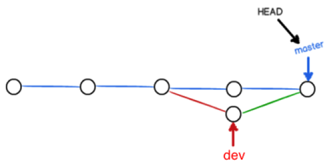

## 工作流程

``


## 基本概念

### 工作区

本地电脑能查看的目录

### 暂存区

英文叫stage, 或index。一般存放在 ".git目录下" 下的index文件（.git/index）中，所以我们把暂存区有时也叫作索引（index）。

### 版本库

工作区有一个隐藏目录.git，这个不算工作区，而是Git的版本库。

原图地址：`http://www.runoob.com/wp-content/uploads/2015/02/1352126739_7909.jpg`


图中左侧为工作区，右侧为版本库。在版本库中标记为 "index" 的区域是暂存区（stage, index），标记为 "master" 的是 master 分支所代表的目录树。

图中我们可以看出此时 "HEAD" 实际是指向 master 分支的一个"游标"。所以图示的命令中出现 HEAD 的地方可以用 master 来替换。

图中的 objects 标识的区域为 Git 的对象库，实际位于 ".git/objects" 目录下，里面包含了创建的各种对象及内容。

当对工作区修改（或新增）的文件执行 "git add" 命令时，暂存区的目录树被更新，同时工作区修改（或新增）的文件内容被写入到对象库中的一个新的对象中，而该对象的ID被记录在暂存区的文件索引中。

当执行提交操作（git commit）时，暂存区的目录树写到版本库（对象库）中，master 分支会做相应的更新。即 master 指向的目录树就是提交时暂存区的目录树。

当执行 "git reset HEAD" 命令时，暂存区的目录树会被重写，被 master 分支指向的目录树所替换，但是工作区不受影响。

当执行 "git rm --cached <file>" 命令时，会直接从暂存区删除文件，工作区则不做出改变。

当执行 "git checkout ." 或者 "git checkout -- <file>" 命令时，会用暂存区全部或指定的文件替换工作区的文件。这个操作很危险，会清除工作区中未添加到暂存区的改动。

当执行 "git checkout HEAD ." 或者 "git checkout HEAD <file>" 命令时，会用 HEAD 指向的 master 分支中的全部或者部分文件替换暂存区和以及工作区中的文件。这个命令也是极具危险性的，因为不但会清除工作区中未提交的改动，也会清除暂存区中未提交的改动。


## 基本操作

### 环境配置

#### 用户信息配置

##### 用户信息显示

`git config user.name`: 显示用户名

`git config user.email`: 显示用户邮箱
##### 用户信息设置

###### 全局信息配置

`git config --global user.name "YOUR_NAME"`： 设置用户名
`git config --global user.email "YOUT_EMAIL"`： 设置用户邮箱


### 代理设置

设置代理

```shell
git config —-global http.proxy [代理网址]
```

取消代理设置

```shell
git config --global --unset http.proxy
```


### 创建项目

`git init`

在文件所在目录中创建新的git 仓库或者重新初始化一个已存在的仓库。 你可以在任何时候、任何目录创建，完全本地化。

```shell
$ mkdir warehouse
$ cd warehouse
$ git init
Initialized empty Git repository in ~/warehouse/.git/
```

或者

```shell
git init warehouse
```


### 拷贝项目

使用`git clone`拷贝一个Git仓库到本地，让自己能够查看该项目，或者进行修改。

```shell
# 克隆仓库到当前目录
git clone <repo>
# 克隆仓库到指定目录
git clone <repo> <directory>
```


```shell
# 几种效果等价的git clone写法：
git clone http://github.com/CosmosHua/locate new
git clone http://github.com/CosmosHua/locate.git new
git clone git://github.com/CosmosHua/locate new
git clone git://github.com/CosmosHua/locate.git new
```

```shell
# git clone 时，可以所用不同的协议，包括 ssh, git, https 等，其中最常用的是 ssh，因为速度较快，还可以配置公钥免输入密码。各种写法如下：
git clone git@github.com:fsliurujie/test.git         --SSH协议
git clone git://github.com/fsliurujie/test.git          --GIT协议
git clone https://github.com/fsliurujie/test.git      --HTTPS协议
```


### 跟踪新文件（添加文件到缓存区）

`git add`

`git add` 命令将文件添加到缓存区

```SHELL
$ touch README
$ touch hello.php
$ git status -s
?? REDAME
?? hello.php
$ git add README hello.php
$ git status -s
A README
A hello.php
```


### 忽略文件

创建一个`.gitignore`文件，写入不需要跟踪的文件

文件位置： 仓库根目录下

example:

```
*.[oa]		# 忽略所有以 .o 或 .a 结尾的文件。
*~			#忽略所有以波浪符（~）结尾的文件
```

文件 `.gitignore` 的格式规范如下：

- 所有空行或者以 `＃` 开头的行都会被 Git 忽略。
- 可以使用标准的 glob 模式匹配。
- 匹配模式可以以（`/`）开头防止递归。
- 匹配模式可以以（`/`）结尾指定目录。
- 要忽略指定模式以外的文件或目录，可以在模式前加上惊叹号（`!`）取反。

所谓的 glob 模式是指 shell 所使用的简化了的正则表达式。 星号（`*`）匹配零个或多个任意字符；`[abc]`匹配任何一个列在方括号中的字符（这个例子要么匹配一个 a，要么匹配一个 b，要么匹配一个 c）；问号（`?`）只匹配一个任意字符；如果在方括号中使用短划线分隔两个字符，表示所有在这两个字符范围内的都可以匹配（比如 `[0-9]` 表示匹配所有 0 到 9 的数字）。 使用两个星号（`*`) 表示匹配任意中间目录，比如 `a/**/z` 可以匹配 `a/z` , `a/b/z` 或 `a/b/c/z` 等。


### 检查当前文件状态

`git status`

`-s`参数：获得简短的结果输出

新添加的未跟踪文件前面有 ?? 标记，新添加到暂存区中的文件前面有 A 标记，修改过的文件前面有 M 标记。 你可能注意到了 M 有两个可以出现的位置，出现在右边的 M 表示该文件被修改了但是还没放入暂存区，出现在靠左边的 M 表示该文件被修改了并放入了暂存区。


### 查看已写入缓存区与已修改但未写入缓存区的改动区别

`git diff`

执行`git diff`来查看执行`git status`的结果的详细信息

1. `git diff`

   `Changes in the working tree not yet staged for the next commit`

   尚未提交暂存的工作区的更改

2. `git diff --cached` or `git diff --staged`

   `Changes between the index and your last commit; what you would be committing if you run "git commit" without "-a" option.`

   上次`commit`后和下一次`commit`之前暂存区的区别

3. `git diff HEAD`

   `Changes in the working tree since your last commit; what you would be committing if you run "git commit -a"`

   自上次提交后，工作区和版本库的区别

   

- 尚未缓存的改动： `git diff`（缓存区和工作区比较）
- 查看已缓存的改动：`git diff --cached` （Git 1.6.1 及更高版本还允许使用 `git diff --staged`，效果是相同的，但更好记些。）
- 查看已缓存的与未缓存的所有改动：`git diff HEAD`
- 显示摘要而非整个`diff`： `git diff --stat`


### 将暂存区（缓存区）内容添加到仓库（对象库）

`git commit`：添加所有缓存区文件至仓库

`git commit <file>`: 添加指定文件至仓库

执行 git commit 将缓存区内容添加到仓库中

> 使用此命令之前需要完善用户信息（github用户名和邮箱）

参数：

`-m  <comment>`: 添加提交日志

`-a`: 跳过`git add` 提交流程(新添加文件，不受影响)


### 取消已缓存的内容

`git reset HEAD <file>`：取消所有或者指定的文件

`My understanding`：将版本库中所有或指定文件覆盖缓存区的指定或所有文件


### 上传到远程仓库

##### 在github创建仓库

自己创建，这里不介绍


##### 远程仓库和本地关联
```shell
git remote add orgin <address>
```
> address：为`.git`结尾的地址


##### 将内容推送到仓库
- 初次上传
```shell
git push -u origin master
```
- 以后上传：
```shell
git push origin master
```
>  如果你创建仓库的时候初始化了一个`README`文件， 会报错
>  这是由于你新建的仓库里面的`README`文件不在本地仓库中
>  我么可以通过以下命令来将内容合并：`git push --rebase origin master`
>  然后按上面的步骤，重新`push`就可以了


## Git 分支管理

#### 创建分支

```shell
git branch <branch_name>
```

#### 切换分支

```shell
git checkout <branch_name>
```

当你切换分支时，git会用该分支的最后提交的快照替换你的工作目录的内容，所以多个分支不需要多个目录

#### 合并分支

```shell
git merge
```

你可以多次合并到统一分支，也可以选择在合并之后直接删除被并入的分支。

首先创建一个测试项目：

```shell
[smilejack@smilejack-pc gitdemo]$ git init
已初始化空的 Git 仓库于 /tmp/gitdemo/.git/
[smilejack@smilejack-pc gitdemo]$ touch README
[smilejack@smilejack-pc gitdemo]$ git add README 
[smilejack@smilejack-pc gitdemo]$ git commit -m '初次提交'
[master（根提交） daa8756] 初次提交
 1 file changed, 0 insertions(+), 0 deletions(-)
 create mode 100644 README

```

#### Git 分支管理

##### 列出分支

基本命令：

```shell
git branch
```

没有参数时，`git branch`会列出你本地的分支

```shell
[smilejack@smilejack-pc gitdemo]$ git branch
* master
```

当你执行`git init`时，`git`就会为你创建`master`分支

先创建一个`testing`分支

```shell
[smilejack@smilejack-pc gitdemo]$ git branch testing
[smilejack@smilejack-pc gitdemo]$ git branch
* master
  testing
```

演示切换分支

```shell
[smilejack@smilejack-pc gitdemo]$ echo "test branch" > test.txt
[smilejack@smilejack-pc gitdemo]$ git add test.txt 
[smilejack@smilejack-pc gitdemo]$ git commit -m "test branch"
[master 1b9c0b5] test branch
 1 file changed, 1 insertion(+)
 create mode 100644 test.txt
[smilejack@smilejack-pc gitdemo]$ ls
README  test.txt
[smilejack@smilejack-pc gitdemo]$ git checkout testing
切换到分支 'testing'
[smilejack@smilejack-pc gitdemo]$ ls
README
```

切换到`master`分支后，`text.txt`文件有恢复了。

```shell
[smilejack@smilejack-pc gitdemo]$ git checkout master
切换到分支 'master'
[smilejack@smilejack-pc gitdemo]$ ls
README  test.txt
```

##### `git checkout -b <branch_name>`

创建新分支并立即切换到该分支下，从而在该分支下操作。

##### 删除分支

删除分支命令：

```shell
git branch -d <branch_name>
```

删除`testing`分支

```shell
[smilejack@smilejack-pc gitdemo]$ git branch
* master
  testing
[smilejack@smilejack-pc gitdemo]$ git branch -d testing
已删除分支 testing（曾为 daa8756）。
```

##### 分支合并

基本命令：

```shell
git merge
```

> 注：
> git merge：默认情况下，Git执行"快进式合并"（fast-farward merge），会直接将Master分支指向Develop分支。
> 使用--no-ff参数后，会执行正常合并，在Master分支上生成一个新节点。为了保证版本演进的清晰，建议采用这种方法。


##### 撤销合并

如果合并完成，没有冲突，可以使用如下语句

```shell
git reset --hard <HEAD>
```

其中`<head>`代表合并之前的版本号，你可以通过`git log	`或者`git log --graph`查看

## `git diff`

显示工作版本(Working tree)和HEAD的差别

```shell
$ git diff HEAD
```


直接将两个分支上最新的提交做diff

```shell
$ git diff topic master
$ #或 
$ git diff topic..master
```


输出自`topic`和`master`分别开发以来，`master`分支上的变更。

```shell
$ git diff topic...master
```


查看简单的diff结果，可以加上`--stat`参数

```shell
$ git diff --stat
```


查看当前目录和另外一个分支(`test`)的差别

```shell
$ git diff test
```


显示当前目录和另一个叫’`test`‘分支的差别

```shell
$ git diff HEAD -- ./lib
```


显示当前目录下的lib目录和上次提交之间的差别(更准确的说是在当前分支下)
比较上次提交和上上次提交

```shell
$ git diff HEAD^ HEAD
```


比较两个历史版本之间的差异

```shell
$ git diff SHA1 SHA2
```

> 提示：SHA1，SHA2是类似 COMMIT ID 的32位长度的值。


## `git reset`

`git reset`命令用于将当前`HEAD`复位到指定状态。一般用于撤消之前的一些操作(如：`git add`,`git commit`等)。

- git reset --soft HEAD~1 撤回最近一次的commit(撤销commit，不撤销git add)

- git reset --mixed HEAD~1 撤回最近一次的commit(撤销commit，撤销git add)

- git reset --hard HEAD~1 撤回最近一次的commit(撤销commit，撤销git add,还原改动的代码)

**简介**

```shell
git reset [-q] [<tree-ish>] [--] <paths>…
git reset (--patch | -p) [<tree-ish>] [--] [<paths>…]
git reset [--soft | --mixed [-N] | --hard | --merge | --keep] [-q] [<commit>]
```

**描述**

在第一和第二种形式中，将条目从`<tree-ish>`复制到索引。 在第三种形式中，将当前分支头(`HEAD`)设置为`<commit>`，可选择修改索引和工作树进行匹配。所有形式的`<tree-ish>/<commit>`默认为 `HEAD` 。

这里的 `HEAD` 关键字指的是当前分支最末梢最新的一个提交。也就是版本库中该分支上的最新版本。

**示例**

以下是一些示例 -

在git的一般使用中，如果发现错误的将不想暂存的文件被`git add`进入索引之后，想回退取消，则可以使用命令：`git reset HEAD <file>`，同时`git add`完毕之后，git也会做相应的提示，比如：

```shell
# Changes to be committed: 
#   (use "git reset HEAD <file>..." to unstage) 
# 
# new file:   test.py
```

`git reset [--hard|soft|mixed|merge|keep] [<commit>或HEAD]`：将当前的分支重设(`reset`)到指定的`<commit>`或者`HEAD`(默认，如果不显示指定`<commit>`，默认是`HEAD`，即最新的一次提交)，并且根据`[mode]`有可能更新索引和工作目录。`mode`的取值可以是`hard`、`soft`、`mixed`、`merged`、`keep`。下面来详细说明每种模式的意义和效果。

A). `--hard`：重设(reset) 索引和工作目录，自从`<commit>`以来在工作目录中的任何改变都被丢弃，并把HEAD指向`<commit>`。 

下面是具体一个例子，假设有三个commit， 执行 `git status`结果如下:

```shell
commit3: add test3.c
commit2: add test2.c
commit1: add test1.c
```

执行`git reset --hard HEAD~1`命令后，
显示：`HEAD is now at commit2`，运行`git log`，如下所示 - 

```shell
commit2: add test2.c
commit1: add test1.c
```

**应用场景**

下面列出一些git reset的典型的应用场景： 

**(A) 回滚添加操作** 

```shell
$ edit    file1.c file2.c           # (1) 
$ git add file1.c file1.c           # (1.1) 添加两个文件到暂存
$ mailx                             #  (2) 
$ git reset                           # (3) 
$ git pull git://info.example.com/ nitfol    # (4)
```

(1). 编辑文件 `file1.c`, `file2.c`，做了些更改，并把更改添加到了暂存区。
(2). 查看邮件，发现某人要您执行`git pull`，有一些改变需要合并下来。
(3). 然而，您已经把暂存区搞乱了，因为暂存区同HEAD commit不匹配了，但是即将`git pull`下来的东西不会影响已经修改的`file1.c` 和 `file2.c`，因此可以`revert`这两个文件的改变。在revert后，那些改变应该依旧在工作目录中，因此执行`git reset`。
(4). 然后，执行了`git pull`之后，自动合并，`file1.c` 和 `file2.c`这些改变依然在工作目录中。 

**(B)回滚最近一次提交**

```shell
$ git commit -a -m "这是提交的备注信息"
$ git reset --soft HEAD^      #(1) 
$ edit code                        #(2) 编辑代码操作
$ git commit -a -c ORIG_HEAD  #(3)
```

(1) 当提交了之后，又发现代码没有提交完整，或者想重新编辑一下提交的信息，可执行`git reset --soft HEAD^`，让工作目录还跟`reset`之前一样，不作任何改变。
`HEAD^`表示指向`HEAD`之前最近的一次提交。
(2) 对工作目录下的文件做修改，比如：修改文件中的代码等。
(3) 然后使用`reset`之前那次提交的注释、作者、日期等信息重新提交。注意，当执行`git reset`命令时，git会把老的HEAD拷贝到文件`.git/ORIG_HEAD`中，在命令中可以使用ORIG_HEAD引用这个提交。`git commit` 命令中 `-a`参数的意思是告诉git，自动把所有修改的和删除的文件都放进暂存区，未被git跟踪的新建的文件不受影响。`commit`命令中`-c <commit>` 或者 `-C <commit>`意思是拿已经提交的对象中的信息(作者，提交者，注释，时间戳等)提交，那么这条`git commit` 命令的意思就非常清晰了，把所有更改的文件加入暂存区，并使用上次的提交信息重新提交。 

**(C) 回滚最近几次提交，并把这几次提交放到指定分支中**

回滚最近几次提交，并把这几次提交放到叫做`topic/wip`的分支上去。

```shell
$ git branch topic/wip     (1) 
$ git reset --hard HEAD~3  (2) 
$ git checkout topic/wip   (3)
```

(1) 假设已经提交了一些代码，但是此时发现这些提交还不够成熟，不能进入`master`分支，希望在新的`branch`上暂存这些改动。因此执行了`git branch`命令在当前的HEAD上建立了新的叫做 `topic/wip` 的分支。
(2) 然后回滚`master`分支上的最近三次提交。`HEAD~3`指向当前`HEAD-3`个提交，`git reset --hard HEAD~3`，即删除最近的三个提交(删除`HEAD`, `HEAD^`, `HEAD~2`)，将HEAD指向`HEAD~3`。 

**(D) 永久删除最后几个提交**

```shell
$ git commit ## 执行一些提交
$ git reset --hard HEAD~3   (1)
```

(1) 最后三个提交(即`HEAD`, `HEAD^`和`HEAD~2`)提交有问题，想永久删除这三个提交。 

**(E) 回滚merge和pull操作** 

```shell
$ git pull                         (1) 
Auto-merging nitfol 
CONFLICT (content): Merge conflict in nitfol 
Automatic merge failed; fix conflicts and then commit the result. 
$ git reset --hard                 (2) 
$ git pull . topic/branch          (3) 
Updating from 41223... to 13134... 
Fast-forward 
$ git reset --hard ORIG_HEAD       (4)
```

(1) 从`origin`拉取下来一些更新，但是产生了很多冲突，但您暂时没有这么多时间去解决这些冲突，因此决定稍候有空的时候再重新执行`git pull`操作。
(2) 由于`git pull`操作产生了冲突，因此所有拉取下来的改变尚未提交，仍然再暂存区中，这种情况下`git reset --hard` 与 `git reset --hard HEAD`意思相同，即都是清除索引和工作区中被搞乱的东西。
(3) 将`topic/branch`分支合并到当前的分支，这次没有产生冲突，并且合并后的更改自动提交。
(4) 但是此时又发现将`topic/branch`合并过来为时尚早，因此决定退滚合并，执行`git reset --hard ORIG_HEAD`回滚刚才的`pull/merge`操作。说明：前面讲过，执行`git reset`时，git会把`reset`之前的HEAD放入`.git/ORIG_HEAD`文件中，命令行中使用ORIG_HEAD引用这个提交。同样的，执行`git pull`和`git merge`操作时，git都会把执行操作前的HEAD放入`ORIG_HEAD`中，以防回滚操作。 

**(F) 在污染的工作区中回滚合并或者拉取** 

```shell
$ git pull                         (1) 
Auto-merging nitfol 
Merge made by recursive. 
nitfol                |   20 +++++---- 
... 
$ git reset --merge ORIG_HEAD      (2)

```

(1) 即便你已经在本地更改了工作区中的一些东西，可安全的执行`git pull`操作，前提是要知道将要`git pull`下面的内容不会覆盖工作区中的内容。
(2) `git pull`完后，发现这次拉取下来的修改不满意，想要回滚到`git pull`之前的状态，从前面的介绍知道，我们可以执行`git reset --hard ORIG_HEAD`，但是这个命令有个副作用就是清空工作区，即丢弃本地未使用`git add`的那些改变。为了避免丢弃工作区中的内容，可以使用`git reset --merge ORIG_HEAD`，注意其中的`--hard` 换成了 `--merge`，这样就可以避免在回滚时清除工作区。 

**(G) 中断的工作流程处理** 

在实际开发中经常出现这样的情形：你正在开发一个大的新功能(工作在分支：`feature` 中)，此时来了一个紧急的bug需要修复，但是目前在工作区中的内容还没有成型，还不足以提交，但是又必须切换的另外的分支去修改bug。请看下面的例子 - 

```shell
$ git checkout feature ;# you were working in "feature" branch and 
$ work work work       ;# got interrupted 
$ git commit -a -m "snapshot WIP"                 (1) 
$ git checkout master 
$ fix fix fix 
$ git commit ;# commit with real log 
$ git checkout feature 
$ git reset --soft HEAD^ ;# go back to WIP state  (2) 
$ git reset                                       (3)

```

(1) 这次属于临时提交，因此随便添加一个临时注释即可。
(2) 这次`reset`删除了WIP commit，并且把工作区设置成提交WIP快照之前的状态。
(3) 此时，在索引中依然遗留着“*snapshot WIP*”提交时所做的未提交变化，`git reset`将会清理索引成为尚未提交”*snapshot WIP*“时的状态便于接下来继续工作。 

**(H) 重置单独的一个文件** 

假设你已经添加了一个文件进入索引，但是而后又不打算把这个文件提交，此时可以使用`git reset`把这个文件从索引中去除。

```shell
$ git reset -- frotz.c                      (1) 
$ git commit -m "Commit files in index"     (2) 
$ git add frotz.c                           (3)

```

(1) 把文件`frotz.c`从索引中去除，
(2) 把索引中的文件提交
(3) 再次把`frotz.c`加入索引

**(I) 保留工作区并丢弃一些之前的提交** 

假设你正在编辑一些文件，并且已经提交，接着继续工作，但是现在你发现当前在工作区中的内容应该属于另一个分支，与之前的提交没有什么关系。此时，可以开启一个新的分支，并且保留着工作区中的内容。 

```shell
$ git tag start 
$ git checkout -b branch1 
$ edit 
$ git commit ...                            (1) 
$ edit 
$ git checkout -b branch2                   (2) 
$ git reset --keep start                    (3)

```

(1) 这次是把在`branch1`中的改变提交了。
(2) 此时发现，之前的提交不属于这个分支，此时新建了`branch2`分支，并切换到了`branch2`上。
(3) 此时可以用`reset --keep`把在`start`之后的提交清除掉，但是保持工作区不变。


## `git restore`

取消工作区尚未提交至暂存区的更改

恢复工作区指定文件至缓存区的对应文件的状态

```
➜  git_test git:(master) ✗ git status
On branch master
Changes not staged for commit:
  (use "git add <file>..." to update what will be committed)
  (use "git restore <file>..." to discard changes in working directory)
	modified:   code.txt

no changes added to commit (use "git add" and/or "git commit -a")
➜  git_test git:(master) ✗ cat code.txt
this is the first line
this is the second line
this is the third line
this is the forth line
this is the sixth line
➜  git_test git:(master) ✗ git restore code.txt         
➜  git_test git:(master) git status          
On branch master
nothing to commit, working tree clean
➜  git_test git:(master) cat code.txt 
this is the first line
this is the second line
this is the third line
this is the forth line
```

**`git restore --staged`**

取消暂存区尚未提交到版本库的更改

取消暂存区的修改，恢复到版本库状态

```
➜  git_test git:(master) cat code.txt 
this is the first line
this is the second line
this is the third line
this is the forth line
➜  git_test git:(master) vim code.txt
➜  git_test git:(master) ✗ cat code.txt
this is the first line
this is the second line
this is the third line
this is the forth line
this is the fifth line
➜  git_test git:(master) ✗ git status  
On branch master
Changes not staged for commit:
  (use "git add <file>..." to update what will be committed)
  (use "git restore <file>..." to discard changes in working directory)
	modified:   code.txt

no changes added to commit (use "git add" and/or "git commit -a")
➜  git_test git:(master) ✗ git add code.txt
➜  git_test git:(master) ✗ git status      
On branch master
Changes to be committed:
  (use "git restore --staged <file>..." to unstage)
	modified:   code.txt

➜  git_test git:(master) ✗ git restore --staged code.txt
➜  git_test git:(master) ✗ git status                   
On branch master
Changes not staged for commit:
  (use "git add <file>..." to update what will be committed)
  (use "git restore <file>..." to discard changes in working directory)
	modified:   code.txt

no changes added to commit (use "git add" and/or "git commit -a")
```


## `git rm`

`git rm`命令用于从工作区和索引中删除文件。

**简介**

```shell
git rm [-f | --force] [-n] [-r] [--cached] [--ignore-unmatch] [--quiet] [--] <file>…

```

**描述**

从索引中删除文件，或从工作树和索引中删除文件。 `git rm`不会从您的工作目录中删除文件。 (没有任何选项只能从工作树中删除文件，并将其保留在索引中;)要删除的文件必须与分支的提示相同，并且在索引中不能对其内容进行更新，尽管可以使用`-f`选项覆盖(默认行为)。 当给出`--cached`时，暂存区内容必须与分支的提示或磁盘上的文件相匹配，从而仅将文件从索引中删除。

使用 `git rm` 来删除文件，同时还会将这个删除操作记录下来；而使用 `rm` 来删除文件，仅仅是删除了物理文件，没有将其从 `git` 的记录中剔除。

直观的来讲，`git rm` 删除过的文件，执行 `git commit -m "commit message or mark"` 提交时，会自动将删除该文件的操作提交上去。

而对于用 `rm` 命令直接删除的文件，执行 `git commit -m "commit message or mark"`提交时，则不会将删除该文件的操作提交上去。不过不要紧，即使你已经通过 `rm` 将某个文件删除掉了，也可以再通过 `git rm` 命令重新将该文件从 git 的记录中删除掉，
这样的话，在执行 `git commit -m "commit message or mark"` 以后，也能将这个删除操作提交上去。

如果之前不小心用 `rm` 命令删除了一大批文件呢？如此时用 `git rm` 逐个地再删除一次就显得相当卵痛了。可如下的方式做提交： `git commit -am "commit message or mark"`

**示例**

以下是一些示例 -

在git中我们可以通过`git rm`命令把一个文件删除，并把它从git的仓库管理系统中移除。但是注意最后要执行`git commit`才真正提交到git仓库。

**示例1**

删除`text1.txt`文件，并把它从git的仓库管理系统中移除。

```shell
git rm text1.txt

```

**示例2**

删除文件夹：`mydir`，并把它从git的仓库管理系统中移除。

```shell
git rm -r mydir

```

**示例3**

```shell
$ git add 10.txt
$ git add -i
           staged     unstaged path
  1:        +0/-0      nothing 10.txt
  2:        +0/-0      nothing branch/t.txt
  3:        +0/-0      nothing branch/t2.txt

*** Commands ***
  1: [s]tatus     2: [u]pdate     3: [r]evert     4: [a]dd untracked
  5: [p]atch      6: [d]iff       7: [q]uit       8: [h]elp
What now> 7
Bye.
$ git rm --cached 10.txt
rm '10.txt'
$ ls
10.txt  2  3.txt  5.txt  readme.txt
$ git add -i
           staged     unstaged path
  1:        +0/-0      nothing branch/t.txt
  2:        +0/-0      nothing branch/t2.txt
*** Commands ***
  1: [s]tatus     2: [u]pdate     3: [r]evert     4: [a]dd untracked
  5: [p]atch      6: [d]iff       7: [q]uit       8: [h]elp

```

在通过 `git add 10.txt` 命令把文件`10.txt`添加到索引库中后，又通过 `git rm --cached 10.txt` 把文件`10.txt`从git的索引库中移除,但是对文件`10.txt`本身并不进行任何操作。

另外对于已经被`git rm`删除掉(还没被提交)的文件或目录，如果想取消其操作的话，可以首先通过`git add -i`的子命令`revert`从索引库中把它们剔除，然后用`git checkout <文件>` 命令来达到取消的目。

**示例4**

```shell
$ git rm Documentation/\*.txt

```

从`Documentation`目录及其任何子目录下的索引中删除所有`.txt`文件。

**示例5**

```shell
git rm -f git-*.sh

```

因为这个例子让shell扩展星号(即显式列出文件)，它不会删除子目录中的文件，如：`subdir/git-foo.sh`文件不会被删除。

原文出自【易百教程】，商业转载请联系作者获得授权，非商业转载请保留原文链接：https://www.yiibai.com/git/git_rm.html  


## `git mv`

`git mv`命令用于移动或重命名文件，目录或符号链接。

**简介**

```shell
git mv <options>… <args>…


Shell
```

**描述**

移动或重命

原文出自【易百教程】，商业转载请联系作者获得授权，非商业转载请保留原文链接：https://www.yiibai.com/git/git_mv.html  名文件，目录或符号链接。

```shell
git mv [-v] [-f] [-n] [-k] <source> <destination>
git mv [-v] [-f] [-n] [-k] <source> ... <destination directory>
```

在第一种形式中，它将重命名`<source>`为`<destination>`，`<source>`必须存在，并且是文件，符号链接或目录。 在第二种形式中，最后一个参数必须是现有的目录; 给定的源(`<source>`)将被移动到这个目录中。

索引在成功完成后更新，但仍必须提交更改。

示例

以下是一些示例 -

把一个文件：*text.txt* 移动到 *mydir*，可以执行以下操作 - 

```
$ git mv text.txt mydir
```

运行上面的 `git mv` 其实就相当于运行了`3`条命令：

```
$ mv test.txt mydir/
$ git rm test.txt
$ git add mydir
```

原文出自【易百教程】，商业转载请联系作者获得授权，非商业转载请保留原文链接：https://www.yiibai.com/git/git_mv.html  

## `git branch`

查看分支

### `git branch <name>`

创建分支

`git branch -vv`: 查看本地分支和远程分支的跟踪关系

`git branch -r`: 查看远程分支名

`git branch --set-upstream branch-name origin/branch-name`: 将`branch-name`分支追踪远程分支`origin/branch-name`

`git branch -u origin/serverfix`: 设置当前分支跟踪远程分支origin/serverfix


## `git checkout`

### `git checkout <name>`

切换分支


### `git checkout -b <name>`

创建并切换分支


### `git checkout -- <file>`

取消尚未提交的更改， 同`git restore <file>`


### `git checkout -b <name> <origin_branch_name>`

基于`origin_branch_name`创建分支`name`,并设置`name`分支跟踪`origin_branch_name`分支


### `git checkout  --track <origin_branch_name>`

基于`origin_branch_name`创建同名分支,并设置该分支跟踪`origin_branch_name`分支


## `git merge`

### `git merge <name>`

合并某分支到当前分支，如果没有冲突，则默认为快速合并

#### 解决冲突

合并分支往往也不是一帆风顺的。

(1)再创建一个新分支dev。

 

(2)修改code.txt内容，并进行提交。

 

(3)切换回master分支。

 

(4)在master的code.txt添加一行内容并进行提交。

 

现在，master分支和dev分支各自都分别有新的提交，变成了这样：

 

这种情况下，git无法执行“快速合并”，只能试图把各自的修改合并起来，但这种合并就可能会有冲突。

(5)执行如下命令尝试将dev分支合并到master分支上来。

 

git告诉我们，code.txt文件存在冲突，必须手动解决冲突后再提交。

(6)git status也可以告诉我们冲突的文件：

 

(7)查看code.txt的内容。

 

(8)git用<<<<<<<，=======，>>>>>>>标记出不同分支的内容，我们修改如下后保存：

 

(9)再提交。


(10) 现在，master分支和dev分支变成了下图所示：

 

(11)用带参数的git log也可以看到分支的合并情况：

 

(12)最后工作完成，可以删除dev分支。

 


### `git merge --no-ff <branch_name>`

禁用快速合并分支来合并分支


## `git stash`

把当前工作现场保存起来（适用于当前工作区，不足以提交到版本库，当又不能丢弃），`git stash`不带任何参数的调用等效于`git stash push`


### `git stash push -m <message>`


### `git stash save <message>`

把当前工作现场保存起来,并添加消息记录


### `git stash list`

查看以保存的工作现场


### `git stash show `

显示做了哪些改动，默认show第一个存储,如果要显示其他存贮，后面加stash@{$num}，比如第二个 git stash show stash@{1}


### `git stash show -p`

显示第一个存储的改动，如果想显示其他存存储，命令：git stash show stash@{$num} -p ，比如第二个：git stash show stash@{1} -p


### `git stash apply`

应用某个存储,但不会把存储从存储列表中删除，默认使用第一个存储,即stash@{0}，如果要使用其他个，git stash apply stash@{$num} ， 比如第二个：git stash apply stash@{1} 


### `git stash pop`

恢复以保存的工作现场，并将缓存堆栈中的对应stash删除


### `git stash drop stash@{$num}`

丢弃stash@{$num}储存，从列表中删除这个储存, `$num`用对应的数字替代


### `git stash clear`

删除所有缓存的stash储存


## `git mergetool`


## `git push`

将本地代码推送到远程分支

```
git push <远程主机名> <本地分支名>[:<远程分支名>]
```

`git push origin master`

如果省略远程分支名,则表示将本地分支推送到与之存在追踪关系的远程分支(通常两者同名),如果对用分支不存在,则创建对应的远程分支.


`git push origin :refs/for/master`

如果省略本地分支名,则表示删除指定的远程分支,因为这等同于推送一个空的本地分支到远程分支,等同于`git push origin --delete master`


`git push origin`

如果当前分支与远程分支存在追踪关系,则本地分支和远程分支都可以省略,将当前分支推送到origin主机的对应分支.


`git push`

如果当前分支只存在一个对应的远程分支,那么主机名都可以省略, 可以使用`git branch -r`查看远程分支名.

不带任何参数的git push，默认只推送当前分支，这叫做simple方式，还有一种matching方式，会推送所有有对应的远程分支的本地分支， Git 2.0之前默认使用matching，现在改为simple方式

　如果想更改设置，可以使用`git config`命令。`git config --global push.default matching OR git config --global push.default simple`,可以使用`git config -l` 查看配置


`git push -u origin master`

如果当前分支与多个主机存在追踪关系，则可以使用` -u` 参数指定一个默认主机，这样后面就可以不加任何参数使用`git push`


`git push --all origin`

将本地的所有分支都推送到远程主机，不管是否存在对应的远程分支.


`git push --force origin`

`git push`的时候需要本地先`git pul`l更新到跟服务器版本一致，如果本地版本库比远程服务器上的低，那么一般会提示你`git pull`更新，如果要强制提交，那么可以使用这个命令


### git中refs/for ＆ refs/heads

`refs/for/[brach]` 需要经过code review之后才可以提交，而`refs/heads/[beanch]`不需要code review。


## 相对引用

你可以通过`~`字符来引用相对于另一个commit的commit。例如：下面的代码引用了HEAD的祖父级：

```shell
git show HEAD~2
```

但是，当用于合并提交时，事情变的有点复杂。因为合并提交存在一个以上的父级，意味着至少有两条路径可以选择。对于3路合并（两条分支合并为一体），第一父级在你执行合并命令时所在的分支，第二父级在你传入`git merge`命令的那个分支上。

`~`字符将在第一父级上追踪，如果你想要在别的父级上追踪，你需要使用`^`字符来指定对那一个父级进行追踪。例如，如果你合并提交，下面的命令会追踪第二父级：

```
git show HEAD^2
```

可以使用多个`^`来移动多代。例如，下面代码展示了追踪第二父级的HEAD的祖父级（假设其为一个合并）

```
git show HEAD^2^1
```

为了说明`~`和`^`是如何工作的，下图展示了基于A通过相对引用如何追踪的每个具体的引用。在一些情况下可以通过多种方式来得到同一个提交：


使用普通引用的命令也能使用相对引用。例如，以下的命令：

```
# 列出合并提交第二父级上的提交（commits）
git log HEAD^2

# 从当前分支上移除最近三次提交
git reset HEAD~3

# 在当前分支上动态rebase最近三次提交
git rebase -i HEAD~3
```


## Git 修改已提交 的注释

在git中,commit提供了一个`—amend`参数,可以修改最后一次提交的消息.

### 修改最后一次提交的注释信息

#### `git commit —amend`

然后编辑注释信息, 保存退出即可.

### 修改最后n次提交的信息

```shell
git rebase -i HEAD~<n>
```

其中`<n>`表示最后n次的信息,

之后会进入vim编辑界面,你只需要将你需要修改的注释的那行的`pick`修改成`edit`保存后退出即可.

然后使用

```shell
git commit --amend
```

修改注释,修改完后,保存退出,最后使用命令

```shell
git rebase --continue
```

合并注释.

使用`git log`查看提交日志 ,你会发现你的注释已经修改了.


## git 仓库克隆深度

`git clone <url>`

参数：

`--depth=<number>`: 用于指定克隆深度，为1表示只克隆最近一次的commit。


## `git fetch`和`git pull`区别

### `git fetch`相当于是从远程获取最新到本地,不会自动merge.

示例:

```shell
git fetch origin master # 程仓库的master分支下载到本地branch中
git log master..origin/master # 比较本地master分支和origin/master分支 的日志差别
git merge origin/master # 将本地仓库master和origin/master合并
```

也可以使用以下指令:

```shell
git fetch origin master:tmp # 从远程仓库获取最新master分支至本地tmp分支
git diff tmp # 查看当前分支和tmp分支的区别
```

### `git pull`相当于是从远程获取最新版本到本地并merge

```shell
git pull origin master
```

相当于从远程仓库获取最新的版本到本地并merge,

在实际使用中,`git fetch`更安全些.


## 其他问题

### 更改git提示语言

在`～/.bashrc`或者`～/.bash_profile`中添加如下语句：

```shell
alias git='LANG=en_US.UTF-8 git'
```

然后使用source激活：

```shell
source ～/.bashrc 或者 source ~/.bash_profile
```

> 你的电脑需要有相关语言的包，如果没有自行安装

如果不管用，试试将`LANG`替换成`LC_ALL`或者`LANGUAGE`

### 一个好的网上git教程

[易百教程](https://www.yiibai.com/githb) 


### 中文文件名不能正确显示出来，显示为八进制字符编码

将git配置文件`core.quotePath`设置为`false`。

`quotePath`表示引用路径

加上`--global`表示全局配置

```shell
git config --global core.quotePath false
```

