# 安装Django

pip 安装

```
pip install django
```


# 入门

## 项目创建

### 1. 创建Django项目

```
django-admin startproject <project_name>
```

> 如果使用虚拟环境，则需先进入虚拟环境

案例： 创建django项目`test1`

```
django-admin startproject test1
```

项目目录结构：

```
.
├── manage.py
└── test1
    ├── __init__.py
    ├── settings.py
    ├── urls.py
    └── wsgi.py

1 directory, 5 files
```

`__init__.py`: 说明test1是一个python包。

`settings.py`: 项目的配置文件。

`urls.py`: 进行url路由的配置。

`wsgi.py`: web服务器和Django交互的入口。

`manage.py`: 项目的管理文件。


### 2. 创建Django应用

一个项目由很多个应用组成的，每一个应用完成一个功能模块。
创建应用的命令如下：

```
python manage.py startapp <app_name>
```

> 注意：创建应用时需要先进入项目的目录

案例： 创建应用 `booktest`

```
python manage.py startapp booktest
```

应用结构：

```
.
├── admin.py
├── __init__.py
├── migrations
│   └── __init__.py
├── models.py
├── tests.py
└── views.py

1 directory, 6 files
```

`__init__.py`: 说明目录是一个Python模块。

`models.py`: 写和数据库项目的内容, 设计模型类。

`views.py`: ，接收请求，进行处理，与M和T进行交互，返回应答。定义处理函数，视图函数。

`tests.py`: 写测试代码的文件。

`admin.py`: 网站后台管理相关的文件。 


### 3. 应用注册

建立应用和项目之间的联系，需要对应用进行注册。

修改`settings.py`中的`INSTALLED_APPS`配置项。

案例： 注册`booktest`

```
INSTALLED_APPS = (
    'django.contrib.admin',
    'django.contrib.auth',
    'django.contrib.contenttypes',
    'django.contrib.sessions',
    'django.contrib.messages',
    'django.contrib.staticfiles',
    'booktest',  # 注册应用
)
```


如果应用不在项目的根目录下

方法一：添加相应的包路径


方法二：添加模块搜索路径


> 添加路由方法同上

### 4. 启动项目

运行开发web服务器命令：

```shell
python manage.py runserver
```

指定ip和端口

```shell
python manage.py runserver <ip>:<port>
```


## 模型类

### 1. ORM

django中内嵌了ORM框架，ORM框架可以将类和数据表进行对应起来，只需要通过类和对象就可以对数据表进行操作。

在Django中主要是设计类：模型类。

ORM另外一个作用：根据设计的类生成数据库中的表。

O(objects):类和对象。
R(Relation):关系，关系数据库中的表格。
M(Mapping):映射。
Django ORM框架的功能：

1. 建立模型类和表之间的对应关系，允许我们通过面向对象的方式来操作数据库。
2. 根据设计的模型类生成数据库中的表格。
3. 通过方便的配置就可以进行数据库的切换。


### 2. 模型类设计

在应用models.py中设计模型类。

必须继承与models.Model类。

1. 设计BookInfo类。

2. 设计HeroInfo类。

Models.ForeignKey可以建立两个模型类之间一对多的关系，django在生成表的时候，就会在多端的表中创建一列作为外键，建立两个表之间一对多的关系。


### 3. 模型类生成表

#### 1. 生成迁移文件（创建更新记录）

```
python manage.py makemigrations
```

 

迁移文件是根据模型类生成的，位于应用的`migrations`文件夹

> 如果修改模型类后想重新生成迁移文件，而不是在原有的迁移文件的基础上生成新的增量迁移文件，则需要
>
> 1. 将app下migrations文件夹下除了`__init__.py`的其他文件全部删除
> 2. 删除数据库中迁移记录
>
> ```
> delete from django_migrations where app = '<app_name>'
> ```
>
> 3. 项目下，重新执行
>
> ```shell
> python manage.py makemigrations
> python manage.py migrate
> ```
>
> 如果需要增量迁移文件，则直接执行第三步


#### 2. 执行迁移生成表（同步更新记录到到数据库）

```
python manage.py migrate
```

根据迁移文件生成表。

生成表名的默认格式：

```
应用名_模型类名小写
```


如果数据库存在则使用`--fake--initial`跳过已存在的数据库的创建

```python
python manage.py migrate --fake-initial
```

```
The --fake-initial option can be used to allow Django to skip an app’s initial migration if all database tables with the names of all models created by all CreateModel operations in that migration already exist. This option is intended for use when first running migrations against a database that preexisted the use of migrations. This option does not, however, check for matching database schema beyond matching table names and so is only safe to use if you are confident that your existing schema matches what is recorded in your initial migration.
```


### 4. 通过模型类操作数据表

进入项目shell命令：

```
python manage.py shell
```

以下为在相互shell终端中演示的例子：
首先导入模型类：

```
from booktest.models import BookInfo,HeroInfo
```


- 向booktest_bookinfo表中插入一条数据。

```python
b = BookInfo() #定义一个BookInfo类的对象
b.btitle ='天龙八部' #定义b对象的属性并赋值
b.bpub_date = date(1990,10,11) 
b.save() #才会将数据保存进数据库
```

- 查询出booktest_bookinfo表中id为1的数据。

```python
b = BookInfo.objects.get(id=1) 
```

- 在上一步的基础上改变b对应图书的出版日期。

```python
b.bpub_date = date(1989,10,21)
b.save() #才会更新表格中的数据
```

- 紧接上一步，删除b对应的图书的数据。

```python
b.delete() #才会删除
```

- 向booktest_heroInfo表中插入一条数据。

```python
h = HeroInfo()
h.hname = '郭靖'
h.hgender = False
h.hcomment = ‘降龙十八掌’
b2 = BookInfo.objects.get(id=2)
h.hbook = b2  #给关系属性赋值，英雄对象所属的图书对象
h.save() 
```

- 查询图书表里面的所有内容。

```python
BookInfo.objects.all()
HeroInfo.objects.all()
```


### 5 关联操作


关联

```python
# 关系属性,hbook，建立图书类和英雄人物类之间的一对多关系
# 关系属性对应的表的字段格式名： 关系属性名_id
hbook = models.ForeignKey('BookInfo')
```

> 关联属性对应表的字段名格式： `关系属性名_id`
>
> 数据库中表现为：`hbook`的值为`BookInfo`的主键`id`的值


关联关系中数据的保存

```python
>>> from booktest.models import BookInfo, HeroInfo
>>> b = BookInfo()
>>> b.btitle = '天龙八部'
>>> from datetime import date
>>> b.bpub_date = date(1990, 1, 1)
>>> b.save()
>>> h = HeroInfo()
>>> h.hname = '段誉'
>>> h.hgender = False
>>> h.hcomment = '六脉神剑'
# 关联属性的赋值
>>> h.hbook = b
>>> h.save()
```


查询出id为2的图书中所有英雄人物的信息。

```python
b = BookInfo.objects.get(id=2)
b.heroinfo_set.all() #查询出b图书中所有英雄人物的信息
```


## 后台管理

### 1. 本地化

语言和时区的本地化，修改settings.py文件

```
# LANGUAGE_CODE = 'en-us'
LANGUAGE_CODE = 'zh-hans'

# TIME_ZONE = 'UTC'
TIME_ZONE = 'Asia/Shanghai'  # 中国时间
```


### 2. 创建管理员

```
python manage.py createsuperuser
```

```
(venv) ➜  test1 python manage.py createsuperuser
Username (leave blank to use 'smilejack'): admin
Email address: admin@goodgoodstudy.gq
Password: 
Password (again): 
Superuser created successfully.
```

> 如果不输入用户名，则默认使用当前主机用户名

管理页面网址页面：`/admin`

#### 自定义管理员模型

如果想使用自定义的用户模型作为django的管理员模型

需要添加或修改`settings.py`中`AUTH_USER_MODEL`属性为自定义用户模型类所在的位置

```python
# Django 认证系统使用的模型类
AUTH_USER_MODEL = 'user.User'
```


### 3. 注册模型类

在应用的 `admin.py`中注册模型类，告诉djang框架根据注册的模型类来生成对应表管理页面。

```python
from django.contrib import admin
from booktest.models import BookInfo, HeroInfo

# 后台管理相关文件
# Register your models here.
# 注册模型类
admin.site.register(BookInfo)
admin.site.register(HeroInfo)
```


### 4. 自定义管理页面

自定义模型管理类。模型管理类就是告诉django在生成的管理页面上显示哪些内容。

```python
from django.contrib import admin
from booktest.models import BookInfo, HeroInfo


# 后台管理相关文件
# Register your models here.
# 自定义模型管理类
class BookInfoAdmin(admin.ModelAdmin):
    """图书模型管理类"""
    list_display = ['id', 'btitle', 'bpub_date']


class HeroInfoAdmin(admin.ModelAdmin):
    """英雄人物模型管理类"""
    list_display = ["id", "hname", "hcomment"]


# 注册模型类
admin.site.register(BookInfo, BookInfoAdmin)
admin.site.register(HeroInfo, HeroInfoAdmin)
```


## 视图

对于django的设计框架MVT，用户在URL中请求的是视图，视图接收请求后进行处理，并将处理的结果返回给请求者。

使用视图时需要进行两步操作：

```
* 1.定义视图函数
* 2.配置URLconf
```

#### 1.定义视图

视图就是一个Python函数，被定义在views.py中。

视图的必须有一个参数，一般叫request，视图必须返回HttpResponse对象，HttpResponse中的参数内容会显示在浏览器的页面上。

打开booktest/views.py文件，定义视图index如下

```
from django.http import HttpResponse

def index(request):
    return HttpResponse("index")
```

#### 2.配置URLconf

##### 查找视图的过程

请求者在浏览器地址栏中输入url，请求到网站后，获取url信息，然后与编写好的URLconf逐条匹配，如果匹配成功则调用对应的视图函数，如果所有的URLconf都没有匹配成功，则返回404错误。

一条URLconf包括url规则、视图两部分：

- url规则使用正则表达式定义。
- 视图就是在views.py中定义的视图函数。

需要两步完成URLconf配置：

- 1.在应用中定义URLconf
- 2.包含到项目的URLconf中

在booktest/应用下创建urls.py文件，定义代码如下：

```
from django.conf.urls import url
from booktest import views
urlpatterns = [
    url(r'^$', views.index),
]
```

> 注意问题

包含到项目中：打开test1/urls.py文件，为urlpatterns列表增加项如下：

```
url(r'^', include('booktest.urls')),
```

test1/urls.py文件完整代码如下：

```
from django.conf.urls import include, url
from django.contrib import admin

urlpatterns = [
    url(r'^admin/', include(admin.site.urls)),
    url(r'^', include('booktest.urls')),
]
```

#### 请求访问

视图和URLconf都定义好了，接下来在浏览器地址栏中输入网址：

```
http://127.0.0.1:8000/
```

网页显示效果如下图，视图被成功执行了。


## 模板

#### 问题

**如何向请求者返回一个漂亮的页面呢？**

肯定需要用到html、css，如果想要更炫的效果还要加入js，问题来了，这么一堆字段串全都写到视图中，作为HttpResponse()的参数吗？这样定义就太麻烦了吧，因为定义字符串是不会出任何效果和错误的，如果有一个专门定义前端页面的地方就好了。

解决问题的技术来了：**模板**。

在Django中，将前端的内容定义在模板中，然后再把模板交给视图调用，各种漂亮、炫酷的效果就出现了。

#### 创建模板

为应用booktest下的视图index创建模板index.html，目录结构如下图：


设置查找模板的路径：打开test1/settings.py文件，设置TEMPLATES的DIRS值

```
'DIRS': [os.path.join(BASE_DIR, 'templates')],
```


#### 定义模板

打开templtes/booktest/index.html文件，定义代码如下：

```
<html>
<head>
    <title>图书列表</title>
</head>
<body>
<h1>{{title}}</h1>

{{i}}<br>

</body>
</html>
```

在模板中输出变量语法如下，变量可能是从视图中传递过来的，也可能是在模板中定义的。

```
{{变量名}}
```

在模板中编写代码段语法如下：

```

```

#### 视图调用模板

调用模板分为三步骤：

- 1.找到模板
- 2.定义上下文
- 3.渲染模板

打开booktst/views.py文件，调用上面定义的模板文件

```
from django.http import HttpResponse
from django.template import loader,RequestContext

def index(request):
    # 1.获取模板
    template=loader.get_template('booktest/index.html')
    # 2.定义上下文
    context=RequestContext(request,{'title':'图书列表','list':range(10)})
    # 3.渲染模板
    return HttpResponse(template.render(context))
```

打开浏览器刷新页面，显示效果如下图：


#### 视图调用模板简写

视图调用模板都要执行以上三部分，于是Django提供了一个函数render封装了以上代码。 方法render包含3个参数：

- 第一个参数为request对象
- 第二个参数为模板文件路径
- 第三个参数为字典，表示向模板中传递的上下文数据

打开booktst/views.py文件，调用render的代码如下：

```
from django.shortcuts import render

def index(request):
    context={'title':'图书列表','list':range(10)}
    return render(request,'booktest/index.html',context)
```


模板for循环

```

	book不为空则执行

	books为空则执行

```

>  可以不写


# 模型

## 1. Django数据库配置

Django `DATABASES`默认需要配置一个`default`数据库，更多请参考：[Django settings](https://docs.djangoproject.com/en/3.0/ref/settings/#std:setting-DATABASES).

支持的数据库postgresql，mysql，sqlite3，oracle等数据库

### 多个数据库配置

Django可以配置多个数据库，但是必须有一个`default`配置的数据库（其配置可以为空，即一个空字典）。如果你想对不同应用或者模型类使用不同的数据库，可以使用数据库路由。（参考博客：https://www.cnblogs.com/DJRemix/p/11584563.html）

#### 同步你的数据库

[`migrate`](http://doc.codingdict.com/django/ref/django-admin.html#django-admin-migrate) 管理命令一次操作一个数据库。默认情况下，它在`default` 数据库上操作，但是通过提供一个[`--database`](http://doc.codingdict.com/django/ref/django-admin.html#django-admin-option---database) 参数，你可以告诉[`migrate`](http://doc.codingdict.com/django/ref/django-admin.html#django-admin-migrate) 同步一个不同的数据库。因此，为了同步所有模型到我们示例中的所有数据库，你将需要调用：

```shell
$ ./manage.py migrate
$ ./manage.py migrate --database=users
```

如果你不想每个应用都被同步到同一台数据库上，你可以定义一个[数据库路由](http://doc.codingdict.com/django/topics/db/multi-db.html?spm=a2c4e.10696291.0.0.324f19a4oYhfzQ#topics-db-multi-db-routing)，它实现一个策略来控制特定模型的访问性。


### 默认数据库sqlite3

#### 配置数据库

配置项目中`settings.py`文件

```python
DATABASES = {
    'default': {
        'ENGINE': 'django.db.backends.sqlite3',   # 使用sqlite3数据库
        'NAME': os.path.join(BASE_DIR, 'db.sqlite3'), # 数据库文件的位置
    }
}
```


### 使用MySQL数据库

**使用MySQL，要手动创建数据库，Django不会自动创建。**

#### 方式一

##### 安装python连接MySQL的包

需要安装操作mysql数据库的包，python2环境和python3环境有以下区别。 

- python2需要安装mysql-python:

```
pip install mysql-python
```

- python3需要安装pymysql:

```
pip install pymysql
```

python3中安装好pymysql，需要在`test2/__init__.py`中加如下内容：

```
import pymysql
pymysql.install_as_MySQLdb()
```

##### 配置数据库

配置项目中`settings.py`文件

```python
DATABASES = {
    'default': {
        'ENGINE': 'django.db.backends.mysql',  # 使用的数据库类型
        'NAME': 'bj18',  # 数据库的名字，数据库必须手动创建
        'USER': 'root',  # 数据库用户名
        'PASSWORD': 'facesmile',  # 数据库密码
        'HOST': 'localhost',  # 数据库所在主机
        'PORT': 3306,  # 数据库服务运行的端口

    }
}
```


#### 方式二(推荐)

##### 安装mysql python连接包, python2,3都可

```
pip instsll mysqlclient
```

> 安装错误可以去https://pypi.org/project/mysqlclient/查看系统需要的依赖

##### 配置数据库

```python
DATABASES = {
    'default': {
        'ENGINE': 'django.db.backends.mysql',
        'NAME': 'poem',
        'USER': 'admin',
        'PASSWORD': 'admin',
        'HOST': '127.0.0.1',
        'PORT': 3306,
    }
}
```


#### 方式三

##### 安装mysql python连接包

```
pip install mysql-connector-python
```


##### 配置数据库

配置项目中的`settings.py`文件

```python
DATABASES = {
    'default': {
        'NAME': 'user_data',
        'ENGINE': 'mysql.connector.django',
        'USER': 'mysql_user',
        'PASSWORD': 'password',
        'OPTIONS': {
          'autocommit': True,
        },
    }
}
```

> 参考：https://dev.mysql.com/doc/connector-python/en/connector-python-django-backend.html


## 2. 定义属性

Django根据属性的类型确定以下信息：

- 当前选择的数据库支持字段的类型
- 渲染管理表单时使用的默认html控件
- 在管理站点最低限度的验证

django会为表创建自动增长的主键列，每个模型只能有一个主键列，如果使用选项设置某属性为主键列后django不会再创建自动增长的主键列。

默认创建的主键列属性为id，可以使用pk代替，pk全拼为primary key。

> 注意：pk是主键的别名，若主键名为id2，那么pk是id2的别名。

属性命名限制：

- 不能是python的保留关键字。
- 不允许使用连续的下划线，这是由django的查询方式决定的，在第4节会详细讲解查询。
- 定义属性时需要指定字段类型，通过字段类型的参数指定选项，语法如下：

```
属性=models.字段类型(选项)
```

#### 字段类型

使用时需要引入django.db.models包，[字段类型](https://docs.djangoproject.com/en/2.2/ref/models/fields/#field-types)如下：

- AutoField：自动增长的IntegerField，通常不用指定，不指定时Django会自动创建属性名为id的自动增长属性。
- BigAutoFile: 64位整型。
- BooleanField：布尔字段，值为True或False。
- NullBooleanField：支持Null、True、False三种值。
- CharField(max_length=字符长度)：字符串。
  - 参数max_length表示最大字符个数。
- TextField：大文本字段，一般超过4000个字符时使用。
- IntegerField：整数。
- BigIntegerField：64位整数。
- DecimalField(max_digits=None, decimal_places=None)：十进制浮点数。
  - 参数max_digits表示总位数。
  - 参数decimal_places表示小数位数。
- FloatField：浮点数。参数同`DecimalField`
- DateField[auto_now=False, auto_now_add=False])：日期。
  - 参数auto_now表示每次保存对象时，自动设置该字段为当前时间，用于"最后一次修改"的时间戳，它总是使用当前日期，默认为false。
  - 参数auto_now_add表示当对象第一次被创建时自动设置当前时间，用于创建的时间戳，它总是使用当前日期，默认为false。
  - 参数auto_now_add和auto_now是相互排斥的，组合将会发生错误。
- TimeField：时间，参数同DateField。
- DateTimeField：日期时间，参数同DateField。
- BinaryField：储存二进制原始数据的字段，他可以声明[`bytes`](https://docs.python.org/3/library/stdtypes.html#bytes), [`bytearray`](https://docs.python.org/3/library/stdtypes.html#bytearray)或[`memoryview`](https://docs.python.org/3/library/stdtypes.html#memoryview).Django2.1之前，它不允许`editable=True`。
- FileField：上传文件字段。
- ImageField：继承于FileField，对上传的内容进行校验，确保是有效的图片。


##### 自定义字段

自定义字段需要继承`django.db.models.Field`或它的子类。

为自定义字段添加文档描述

```python
description = _("String (up to %(max_length)s)")
```

此例子使用了延迟加载，例如不同长度的`varchar`类型，它的描述不同，当然你可以使用纯字符串，如下：

```python
description = 'String of Text'
```


自定义字段常用方法：

###### `db_type(self, connection)`自定义字段数据库类型、`rel_db_type`自定义关联模型字段数据库类型。

Django会在创建数据库表的时候调用`db_type()`和`rel_db_type()`方法来构造`CREATE TABLE`语句，这些方法也在构造包含此字段的where SQL语句时调用，比如你在利用 QuerySet 方法(`get()`, `filter()`, 和 `exclude()`)检出数据时或将此模型字段作为参数时。

`db_type`用于自定义字段的数据类型，如果你需要自定义数据库中`char`、`int`等类型的长度，可以在此编写代码实现

```python
# This is a much more flexible example.
class BetterCharField(models.Field):
    def __init__(self, max_length, *args, **kwargs):
        self.max_length = max_length
        super().__init__(*args, **kwargs)

    def db_type(self, connection):
        return 'char(%s)' % self.max_length

# In the model:
class MyModel(models.Model):
    # ...
    my_field = BetterCharField(25)
```

或者根据不同的的数据库返回不同的值：

```python
class MyDateField(models.Field):
    def db_type(self, connection):
        if connection.settings_dict['ENGINE'] == 'django.db.backends.mysql':
            return 'datetime'
        else:
            return 'timestamp'
```

最后，如果你的列真的要求配置复杂的 SQL，从 [`db_type()`](https://docs.djangoproject.com/zh-hans/2.2/ref/models/fields/#django.db.models.Field.db_type) 返回 `None`。这会让 Django 创建 SQL 的代码跳过该字段。随后你需要负责为该字段在正确的表中以某种方式创建列，这种方式允许你告诉 Django 不处理此事。


###### to_python、`from_db_value` 数据库值与Python对象互相转换

如果自定义的字段类型数据结构比较字符串、日期、整型或浮点型复杂，你可以通过这两个方法实现数据库值与Python对象互相转换。

`to_python`在反序列化和表单的调用[`clean()`](https://docs.djangoproject.com/en/2.2/ref/models/instances/#django.db.models.Model.clean) 方法验证时调用。

作为通用规则， `to_python` 应该平滑地处理以下参数：

- 一个正确的模型实例对象（本业持续介绍的例子 `Hand` ）。
- 一个字符串
- `None` （若字段允许 `null=True`）

在 `HandField` 类中，我们在数据库中以 VARCHAR 字段的形式存储数据，所以我们要能在 `from_db_value()` 中处理字符串和 `None`。在 `to_python()` 中，我们也需要处理 `Hand` 实例:

```python
import re

from django.core.exceptions import ValidationError
from django.db import models
from django.utils.translation import gettext_lazy as _

def parse_hand(hand_string):
    """Takes a string of cards and splits into a full hand."""
    p1 = re.compile('.{26}')
    p2 = re.compile('..')
    args = [p2.findall(x) for x in p1.findall(hand_string)]
    if len(args) != 4:
        raise ValidationError(_("Invalid input for a Hand instance"))
    return Hand(*args)

class HandField(models.Field):
    # ...

    def from_db_value(self, value, expression, connection):
        if value is None:
            return value
        return parse_hand(value)

    def to_python(self, value):
        # 处理 Hand实例
        if isinstance(value, Hand):
            return value
        # 值为空
        if value is None:
            return value
		# 处理字符串
        return parse_hand(value)
```

> 对于`to_python`方法。如果出错，你应该触发`django.core.exceptions.ValidationError`异常.
>
> 如果你定义了`to_python`方法，你还需要定义`get_prep_value`方法


###### `get_prep_value`:将Python转换为查询值

当你使用数据库需要双向转换，如果你重写了`to_python`方法，你也必须重写`get_prep_value`方法。


##### Django 默认字段匹配数据库类型的方式

在`db_type`方法中使用`django.db.connection.data_types`中查找对应的值

```python
data = self.db_type_parameters(connection)
try:
    return connection.data_types[self.get_internal_type()] % data
except KeyError:
    return None
```

`get_internal_type`默认返回字段类名，通过该类名查找`django.db.backends`下对应数据库包中的`base.DatabaseWrapper`类中`data_types`属性来获取字段对应的数据库类型


##### 字段对应的MySQL数据类型

<table class="table table-bordered table-striped table-condensed" style="font-family:'-apple-system', 'SF UI Text', Arial, 'PingFang SC', 'Hiragino Sans GB', 'Microsoft YaHei', 'WenQuanYi Micro Hei', sans-serif, SimHei, SimSun;font-size:14px;width:852px;"><tbody><tr><th style="margin:0px;vertical-align:middle;">分类</th><th style="margin:0px;vertical-align:middle;">模型属性类型</th><th style="margin:0px;vertical-align:middle;">mysql数据库类型</th></tr><tr><td style="margin:0px;vertical-align:middle;">自增</td><td style="margin:0px;vertical-align:middle;">AutoField</td><td style="margin:0px;vertical-align:middle;">int</td></tr><tr><td rowspan="2" style="margin:0px;vertical-align:middle;">布尔</td><td style="margin:0px;vertical-align:middle;">BooleanField</td><td style="margin:0px;vertical-align:middle;">tinyint</td></tr><tr><td style="margin:0px;vertical-align:middle;">NullBooleanField</td><td style="margin:0px;vertical-align:middle;">tinyint</td></tr><tr><td rowspan="2" style="margin:0px;vertical-align:middle;">字符</td><td style="margin:0px;vertical-align:middle;">CharField</td><td style="margin:0px;vertical-align:middle;">varchar</td></tr><tr><td style="margin:0px;vertical-align:middle;">TextField</td><td style="margin:0px;vertical-align:middle;">longtext</td></tr><tr><td rowspan="3" style="margin:0px;vertical-align:middle;">数字</td><td style="margin:0px;vertical-align:middle;">IntegerField</td><td style="margin:0px;vertical-align:middle;">int</td></tr><tr><td style="margin:0px;vertical-align:middle;">DecimalField</td><td style="margin:0px;vertical-align:middle;">decimal</td></tr><tr><td style="margin:0px;vertical-align:middle;">FloatField</td><td style="margin:0px;vertical-align:middle;">double</td></tr><tr><td rowspan="3" style="margin:0px;vertical-align:middle;">日期和时间</td><td style="margin:0px;vertical-align:middle;">DateField</td><td style="margin:0px;vertical-align:middle;">date</td></tr><tr><td style="margin:0px;vertical-align:middle;">TimeField</td><td style="margin:0px;vertical-align:middle;">time</td></tr><tr><td style="margin:0px;vertical-align:middle;">DateTimeField</td><td style="margin:0px;vertical-align:middle;">datetime</td></tr><tr><td rowspan="2" style="margin:0px;vertical-align:middle;">文件</td><td style="margin:0px;vertical-align:middle;">FileField</td><td style="margin:0px;vertical-align:middle;">varchar</td></tr><tr><td style="margin:0px;vertical-align:middle;">ImageField</td><td style="margin:0px;vertical-align:middle;">varchar</td></tr></tbody></table>


#### 选项

通过选项实现对字段的约束，选项如下（官方文档：[Field Option](https://docs.djangoproject.com/en/2.2/ref/models/fields/#field-options)）：

- null：如果为True，表示允许为空，默认值是False。
- blank：如果为True，则该字段允许为空白，默认值是False。

**对比：null是数据库范畴的概念，blank是表单验证范畴的**。

- primary_key：若为True，则该字段会成为模型的主键字段，默认值是False，一般作为AutoField的选项使用。
- unique：如果为True, 这个字段在表中必须有唯一值，默认值是False。
- choices：值枚举，限制值的取值范围
- db_column: 该字段在数据库中的字段名，如果未指定，则使用属性的名称。
- db_index: 该字段是否使用索引。如果为True则创建数据库索引，默认值为False。
- db_tablespace: 数据索引所使用的表空间，如果没有设置则使用setting中的`DEFAULT_INDEX_TABLESPACE`。如果后端数据库不支持，则忽略该选项。(oracel 支持索引表空进)
- default : 默认值。可以是一个值或者是个可调用的对象，如果是个可调用对象，每次实例化模型时都会调用该对象。
- editable：如果为False，则该字段不会显示在管理员或其他任何[`ModelForm`](https://docs.djangoproject.com/en/2.2/topics/forms/modelforms/#django.forms.ModelForm)中.在[模型验证](https://docs.djangoproject.com/zh-hans/2.2/ref/models/instances/#validating-objects)期间也将跳过它们。默认值为`True`。
- error_messages: 该`error_messages`参数使您可以覆盖该字段将引发的默认消息。传递一个包含与您要覆盖的错误消息相匹配的键的字典。错误消息键包括`null`，`blank`，`invalid`，`invalid_choice`， `unique`，和`unique_for_date`。在下面的“ [字段类型”](https://docs.djangoproject.com/zh-hans/2.2/ref/models/fields/#field-types)部分中为每个字段指定了其他错误消息键。这些错误消息通常不会传播到表单。请参见 [有关模型的error_messages的注意事项](https://docs.djangoproject.com/zh-hans/2.2/topics/forms/modelforms/#considerations-regarding-model-errormessages)。
- help_text：额外的“帮助”文档，随表单控件一起显示。他对于生成文档时非常有用的，即使你没有在表单使用该字段。注意：他不会转义HTML所以，如果你可以在在里面使用html。
- primary_key: 如果设置为True，则初始设置为该模型的之间。如果您未在模型的任何字段中指定`primary_key`，则Django会指定一个`AutoField`字段来保留主键，因此，如果你不需要自定义主键，你可以不用设置它。`primary_key=True`继承了`null=False`和`unique=True`。
- `unique`：如果值为True，则表示该字段值在表中必须唯一。如果你保存一个具有`unique`字段且值重复的模型，`save()`方法将引发 [`django.db.IntegrityError`](https://docs.djangoproject.com/en/2.2/ref/exceptions/#django.db.IntegrityError) 错误。
- unique_for_date
- unique_for_month
- unique_for_year: 其值指向[`DateField`](https://docs.djangoproject.com/zh-hans/2.2/ref/models/fields/#django.db.models.DateField)或[`DateTimeField`](https://docs.djangoproject.com/zh-hans/2.2/ref/models/fields/#django.db.models.DateTimeField)字段的字段名，表示该字段对应其值的日期、月份或年份的值是唯一的。对于`DateTimeFeidl`它只比较日期，不会比较时间。例如：你有一个字段名且设置了`unique_for_date='pub_date'`,Django 将不允许设置相同的`title`和`pub_date`。
- verbose_name: 后台管理时显示该字段的显示名称，默认为字段的属性名，并将下划线转换为空格。
- validators: 要为此字段运行的验证器列表。有关更多信息，请参见[验证程序文档](https://docs.djangoproject.com/zh-hans/2.2/ref/validators/)。

> 对比：null是数据库范畴的概念，blank是后台管理页面表单验证范畴的。
> 经验:
> 当修改模型类之后，如果添加的选项不影响表的结构，则不需要重新做迁移，商品的选项中default和blank不影响表结构。


#### 综合演示

修改booktest/models.py中的模型类，代码如下：

```
from django.db import models

#定义图书模型类BookInfo
class BookInfo(models.Model):
    #btitle = models.CharField(max_length=20)#图书名称
    btitle = models.CharField（max_length=20, db_column='title')#通过db_column指定btitle对应表格中字段的名字为title
    bpub_date = models.DateField()#发布日期
    bread = models.IntegerField(default=0)#阅读量
    bcomment = models.IntegerField(default=0)#评论量
    isDelete = models.BooleanField(default=False)#逻辑删除

#定义英雄模型类HeroInfo
class HeroInfo(models.Model):
    hname = models.CharField(max_length=20)#英雄姓名
    hgender = models.BooleanField(default=True)#英雄性别
    isDelete = models.BooleanField(default=False)#逻辑删除
    #hcomment = models.CharField(max_length=200)#英雄描述信息
    hcomment = models.CharField(max_length=200, null=True, blank=False) #hcomment对应的数据库中的字段可以为空，但通过后台管理页面添加英雄信息时hcomment对应的输入框不能为空
    hbook = models.ForeignKey('BookInfo')#英雄与图书表的关系为一对多，所以属性定义在英雄模型类中
```

然后生成迁移文件并执行迁移命令，最后查看test2数据库中的内容。


## 字段查询

实现sql中where的功能，调用过滤器filter()、exclude()、get()，下面以filter()为例。

通过"属性名_id"表示外键对应对象的id值。

语法如下：

> 说明：属性名称和比较运算符间使用两个下划线，所以属性名不能包括多个下划线。

```
属性名称__比较运算符=值
```

#### 查看mysql数据库日志

查看mysql数据库日志可以查看对数据库的操作记录。 mysql日志文件默认没有产生，需要做如下配置：

```
sudo vi /etc/mysql/mysql.conf.d/mysqld.conf
```


把68，69行前面的#去除，然后保存并使用如下命令重启mysql服务。

```
sudo service mysql restart
```

使用如下命令打开mysql日志文件。

```
sudo tail -f /var/log/mysql/mysql.log #可以实时查看数据库的日志内容
```

#### 查询函数

| 函数名   | 功能                                     | 返回值                   | 说明                                                         |
| -------- | ---------------------------------------- | ------------------------ | ------------------------------------------------------------ |
| get      | 返回表中满足条件的一条且只能有一条数据。 | 返回值是一个模型类对象。 | 参数中写查询条件。1) 如果查到多条数据，则抛异常MultipleObjectsReturned。2)查询不到数据，则抛异常：DoesNotExist。 |
| all      | 返回模型类对应表格中的所有数据。         | 返回值是QuerySet类型     | 查询集                                                       |
| filter   | 返回满足条件的数据。                     | 返回值是QuerySet类型     | 参数写查询条件。                                             |
| exclude  | 返回不满足条件的数据。                   | 返回值是QuerySet类型     | 参数写查询条件。                                             |
| order_by | 对查询结果进行排序。                     | 返回值是QuerySet类型     | 参数中写根据哪些字段进行排序。                               |

##### get示例：

例：查询图书id为3的图书信息。

```python
BookInfo.objects.get(id=3)
```


##### all方法示例：

例：查询图书所有信息。

```python
BookInfo.objects.all()
```


##### filter方法示例：

###### 条件格式：

```
模型类属性名__条件名=值
```

查询图书评论量为34的图书的信息：

```python
BookInfo.objects.filter(bcomment__exact=34)
```


打开booktest/views.py文件，在index视图中编写如下查询代码：

#### 条件运算符

###### 1) 查询等

**exact：表示判等。**

例：查询编号为1的图书。

```
list=BookInfo.objects.filter(id__exact=1)
可简写为：
list=BookInfo.objects.filter(id=1)
```

###### 2) 模糊查询

**contains：是否包含。**

> 说明：如果要包含%无需转义，直接写即可。

例：查询书名包含'传'的图书。

```
list = BookInfo.objects.filter(btitle__contains='传')
```

**startswith、endswith：以指定值开头或结尾。**

例：查询书名以'部'结尾的图书

```
list = BookInfo.objects.filter(btitle__endswith='部')
```

> 以上运算符都区分大小写，在这些运算符前加上i表示不区分大小写，如iexact、icontains、istartswith、iendswith.

###### 3) 空查询

**isnull：是否为null。**

例：查询书名不为空的图书。

```
list = BookInfo.objects.filter(btitle__isnull=False)
```

###### 4) 范围查询

**in：是否包含在范围内。**

例：查询编号为1或3或5的图书

```
list = BookInfo.objects.filter(id__in=[1, 3, 5])
```

###### 5) 比较查询

**gt、gte、lt、lte：大于、大于等于、小于、小于等于。**

例：查询编号大于3的图书

```
list = BookInfo.objects.filter(id__gt=3)
```

**不等于的运算符，使用exclude()过滤器。**

例：查询编号不等于3的图书

```
list = BookInfo.objects.exclude(id=3)
```

###### 6) 日期查询

**year、month、day、week_day、hour、minute、second：对日期时间类型的属性进行运算。**

例：查询1980年发表的图书。

```
list = BookInfo.objects.filter(bpub_date__year=1980)
```

例：查询1980年1月1日后发表的图书。

```
list = BookInfo.objects.filter(bpub_date__gt=date(1990, 1, 1))
```

#### F对象

之前的查询都是对象的属性与常量值比较，两个属性怎么比较呢？ 答：使用F对象，被定义在django.db.models中。

语法如下：

```
F(属性名)
```

例：查询阅读量大于等于评论量的图书。

```
from django.db.models import F
...
list = BookInfo.objects.filter(bread__gte=F('bcomment'))
```

可以在F对象上使用算数运算。

例：查询阅读量大于2倍评论量的图书。

```
list = BookInfo.objects.filter(bread__gt=F('bcomment') * 2)
```

#### Q对象

多个过滤器逐个调用表示逻辑与关系，同sql语句中where部分的and关键字。

例：查询阅读量大于20，并且编号小于3的图书。

```
list=BookInfo.objects.filter(bread__gt=20,id__lt=3)
或
list=BookInfo.objects.filter(bread__gt=20).filter(id__lt=3)
```

如果需要实现逻辑或or的查询，需要使用Q()对象结合|运算符，Q对象被义在django.db.models中。

语法如下：

```
Q(属性名__运算符=值)
```

例：查询阅读量大于20的图书，改写为Q对象如下。

```
from django.db.models import Q
...
list = BookInfo.objects.filter(Q(bread__gt=20))
```

Q对象可以使用&、|连接，&表示逻辑与，|表示逻辑或。

例：查询阅读量大于20，或编号小于3的图书，只能使用Q对象实现

```
list = BookInfo.objects.filter(Q(bread__gt=20) | Q(pk__lt=3))
```

Q对象前可以使用~操作符，表示非not。

例：查询编号不等于3的图书。

```
list = BookInfo.objects.filter(~Q(pk=3))
```

#### 聚合函数

使用aggregate()过滤器调用聚合函数。聚合函数包括：Avg，Count，Max，Min，Sum，被定义在django.db.models中。

例：查询图书的总阅读量。

```
from django.db.models import Sum
...
list = BookInfo.objects.aggregate(Sum('bread'))
```

注意aggregate的返回值是一个字典类型，格式如下：

```
  {'聚合类小写__属性名':值}
  如:{'sum__bread':3}
```

使用count时一般不使用aggregate()过滤器。

例：查询图书总数。

```
list = BookInfo.objects.count()
```

注意count函数的返回值是一个数字。


## 查询集

#### 方法

查询集表示从数据库中获取的对象集合，在管理器上调用某些过滤器方法会返回查询集，查询集可以含有零个、一个或多个过滤器。过滤器基于所给的参数限制查询的结果，从Sql的角度，查询集和select语句等价，过滤器像where和limit子句。

**返回查询集的过滤器如下**：

- all()：返回所有数据。
- filter()：返回满足条件的数据。
- exclude()：返回满足条件之外的数据，相当于sql语句中where部分的not关键字。
- order_by()：对结果进行排序。

**返回单个值的过滤器如下**：

- get()：返回单个满足条件的对象
  - 如果未找到会引发"模型类.DoesNotExist"异常。
  - 如果多条被返回，会引发"模型类.MultipleObjectsReturned"异常。
- count()：返回当前查询结果的总条数。
- aggregate()：聚合，返回一个字典。

其他

- distinct()：对查询结果进行去重

- values()：获取查询集中的指定模型属性的值

**判断某一个查询集中是否有数据**：

- exists()：判断查询集中是否有数据，如果有则返回True，没有则返回False。

#### 两大特性

- 惰性执行：创建查询集不会访问数据库，直到调用数据时，才会访问数据库，调用数据的情况包括迭代、序列化、与if合用。
- 缓存：使用同一个查询集，第一次使用时会发生数据库的查询，然后把结果缓存下来，再次使用这个查询集时会使用缓存的数据。

示例：查询所有，编辑booktest/views.py的index视图，运行查看。

```
list=BookInfo.objects.all()
```


#### 查询集的缓存

每个查询集都包含一个缓存来最小化对数据库的访问。

在新建的查询集中，缓存为空，首次对查询集求值时，会发生数据库查询，django会将查询的结果存在查询集的缓存中，并返回请求的结果，接下来对查询集求值将重用缓存中的结果。

演示：运行项目shell。

```
python manage.py shell
```

**情况一**：如下是两个查询集，无法重用缓存，每次查询都会与数据库进行一次交互，增加了数据库的负载。

```
from booktest.models import BookInfo
[book.id for book in BookInfo.objects.all()]
[book.id for book in BookInfo.objects.all()]
```


**情况二**：经过存储后，可以重用查询集，第二次使用缓存中的数据。

```
list=BookInfo.objects.all()
[book.id for book in list]
[book.id for book in list]
```


#### 限制查询集

可以对查询集进行取下标或切片操作，等同于sql中的limit和offset子句。

> 注意：不支持负数索引。

对查询集进行切片后返回一个新的查询集，不会立即执行查询。

如果获取一个对象，直接使用[0]，等同于[0:1].get()，但是如果没有数据，[0]引发IndexError异常，[0:1].get()如果没有数据引发DoesNotExist异常。

示例：获取第1、2项，运行查看。

```
list=BookInfo.objects.all()[0:2]
```


## 模型类关系

#### 关系字段类型

关系型数据库的关系包括三种类型：

- ForeignKey：一对多，将字段定义在多的一端中。
- ManyToManyField：多对多，将字段定义在任意一端中。
- OneToOneField：一对一，将字段定义在任意一端中。
- 可以维护递归的关联关系，使用'self'指定，详见"自关联"。

##### 一对多关系

参见booktest应用中的BookInfo类和HeroInfo类。

```
#定义图书模型类BookInfo
class BookInfo(models.Model):
    btitle = models.CharField(max_length=20)#图书名称
    bpub_date = models.DateField()#发布日期
    bread = models.IntegerField(default=0)#阅读量
    bcomment = models.IntegerField(default=0)#评论量
    isDelete = models.BooleanField(default=False)#逻辑删除

#定义英雄模型类HeroInfo
class HeroInfo(models.Model):
    hname = models.CharField(max_length=20)#英雄姓名
    hgender = models.BooleanField(default=True)#英雄性别
    isDelete = models.BooleanField(default=False)#逻辑删除
    hcomment = models.CharField(max_length=200)#英雄描述信息
    hbook = models.ForeignKey('BookInfo')#英雄与图书表的关系为一对多，所以属性定义在英雄模型类中
```

> ForeignKey其第一个参数to可以为模型类、模型名、字符串，其中可以用`self`表示自关联
>
> ```python
> class BookInfo(models.Model):
>     pass
> class HeroInfo(models.Model):
>     hbook = models.ForeignKey('BookInfo', on_delete=models.CASCADE, related_name='hero_book')#英雄与图书表的关系为一对多，所以属性定义在英雄模型类中
> ```
>
> 参数`related_name`和`related_query_name`用于关联查询是的别名，例如以上实例中，查询图书所对用的英雄可以用除了`book.heroinfo_set.all()`的另外一种方式`book.hero_book.all()`。

###### SQL 外键约束`on_delete`参数

在最新的django框架中，models设置外键约束时，on_delete是必填项，所以创建外键时如何设置on_delete的属性就很重要。

- `CASCADE`:这就是默认的选项，级联删除。
- `PROTECT`: 保护模式，如果采用该选项，删除的时候，会抛出ProtectedError错误。

- `SET_NULL`: 置空模式，删除的时候，外键字段被设置为空，前提就是blank=True, null=True,定义该字段的时候，允许为空。
- `SET_DEFAULT`: 置默认值，删除的时候，外键字段设置为默认值，所以定义外键的时候注意加上一个默认值。
- `SET()`: 自定义一个值，该值当然只能是对应的实体了.

> 注意：如果多个字段关联同一字段关联同一外键，则需要定义不同的`related_name`或`related_query_name`。


##### 多对多关系

我们下面设计一个新闻类和新闻类型类，一个新闻类型下可以用很多条新闻，一条新闻也可能归属于多种新闻类型。

重新在项目test2下新建一个应用newstest,注册应用之后，编辑newstest/models.py文件设计模型类。

```
class TypeInfo(models.Model):
  tname = models.CharField(max_length=20) #新闻类别

class NewsInfo(models.Model):
  ntitle = models.CharField(max_length=60) #新闻标题
  ncontent = models.TextField() #新闻内容
  npub_date = models.DateTimeField(auto_now_add=True) #新闻发布时间
  ntype = models.ManyToManyField('TypeInfo') #通过ManyToManyField建立TypeInfo类和NewsInfo类之间多对多的关系
```

## 关联查询

Django中也能实现类似于join查询。

#### 通过对象执行关联查询

在定义模型类时，可以指定三种关联关系，最常用的是一对多关系，如本例中的"图书-英雄"就为一对多关系，接下来进入shell练习关系的查询。

由一到多的访问语法：

```
一对应的模型类对象.多对应的模型类名小写_set
例：
b = BookInfo.objects.get(id=1)
b.heroinfo_set.all()
```

由多到一的访问语法:

```
多对应的模型类对象.多对应的模型类中的关系类属性名
例：
h = HeroInfo.objects.get(id=1)
h.hbook
```

访问一对应的模型类关联对象的id语法:

```
多对应的模型类对象.关联类属性_id
例：
h = HeroInfo.objects.get(id=1)
h.book_id
python manage.py shell
```

例：查询编号为1的图书。

```
book=BookInfo.objects.get(pk=1)
```

例：获得book图书的所有英雄。

```
book.heroinfo_set.all()
```

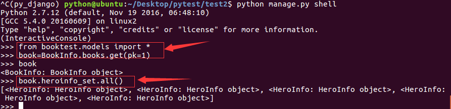

例：获得编号为1的英雄。

```
hero=HeroInfo.objects.get(pk=1)
```

例：获得hero英雄出自的图书。

```
hero.hbook
```


#### 通过模型类执行关联查询

**由多模型类条件查询一模型类数据**:

语法如下：

```
关联模型类名小写__属性名__条件运算符=值
```

> 如果没有"__运算符"部分，表示等于，结果和sql中的inner join相同。

例：查询图书，要求图书中英雄的描述包含'八'。

```
list = BookInfo.objects.filter(heroinfo__hcontent__contains='八')
```

**由一模型类条件查询多模型类数据**: 语法如下：

```
一模型类关联属性名__一模型类属性名__条件运算符=值
```

例：查询书名为“天龙八部”的所有英雄。

```
list = HeroInfo.objects.filter(hbook__btitle='天龙八部')
```

## 自关联

对于地区信息、分类信息等数据，表结构非常类似，每个表的数据量十分有限，为了充分利用数据表的大量数据存储功能，可以设计成一张表，内部的关系字段指向本表的主键，这就是自关联的表结构。

打开booktest/models.py文件，定义AreaInfo类。

> 说明：关系属性使用self指向本类，要求null和blank允许为空，因为一级数据是没有父级的。

```
#定义地区模型类，存储省、市、区县信息
class AreaInfo(models.Model):
    atitle=models.CharField(max_length=30)#名称
    aParent=models.ForeignKey('self',null=True,blank=True)#关系
```

迁移。

```
python manage.py makemigrations
python manage.py migrate
```


打开mysql命令行，导入数据。

```
source areas.sql
```

打开booktest/views.py文件，定义视图area。

```
from booktest.models import AreaInfo
...
#查询广州市的信息
def area(request):
    area = AreaInfo.objects.get(pk=440100)
    return render(request, 'booktest/area.html', {'area': area})
```

打开booktest/urls.py文件，新建一条url。

```
urlpatterns = [
    ...
    url(r'^area/$', views.area),
]
```

在templates/booktest目录下，新建area.html文件。

```
<html>
<head>
    <title>地区</title>
</head>
<body>
当前地区：{{area.atitle}}
<hr/>
上级地区：{{area.aParent.atitle}}
<hr/>
下级地区：
<ul>
    
    <li>{{a.atitle}}</li>
    
</ul>
</body>
</html>
```

运行服务器。

```
python manage.py runserver
```

在浏览器中输出效果如下图。


## 模型实例方法

- str()：在将对象转换成字符串时会被调用。
- save()：将模型对象保存到数据表中，ORM框架会转换成对应的insert或update语句。
- delete()：将模型对象从数据表中删除，ORM框架会转换成对应的delete语句。

### refresh_from_db(using=None, fields=None)

从数据库中重载Model，你可以使用using指定从那个数据库重载数据，你可以使用fields来强制重载某些字段值，默认只重新加载非延迟加载的字段的值。

## 模型类的属性

属性objects：管理器，是models.Manager类型的对象，用于与数据库进行交互。

> 当没有为模型类定义管理器时，Django会为每一个模型类生成一个名为objects的管理器，自定义管理器后，Django不再生成默认管理器objects。

为模型类BookInfo定义管理器books语法如下：

```
class BookInfo(models.Model):
    ...
    books = models.Manager()
```

#### 管理器Manager

管理器是Django的模型进行数据库操作的接口，Django应用的每个模型类都拥有至少一个管理器。Django支持自定义管理器类，继承自models.Manager。

自定义管理器类主要用于两种情况：

- 1.修改原始查询集，重写all()方法
- 2.向管理器类中添加额外的方法，如向数据库中插入数据。

1.修改原始查询集，重写all()方法。

a）打开booktest/models.py文件，定义类BookInfoManager

```
#图书管理器
class BookInfoManager(models.Manager):
    def all(self):
        #默认查询未删除的图书信息
        #调用父类的成员语法为：super().方法名
        return super().all().filter(isDelete=False)
```

b）在模型类BookInfo中定义管理器

```
class BookInfo(models.Model):
    ...
    books = BookInfoManager()
```

2.在管理器类中定义创建对象的方法

对模型类对应的数据表进行操作时，推荐将这些操作数据表的方法封装起来，放到模型管理器类中。

a）打开booktest/models.py文件，定义方法create。

```
class BookInfoManager(models.Manager):
    ...
    #创建模型类，接收参数为属性赋值
    def create_book(self, title, pub_date):
        #创建模型类对象self.model可以获得模型类
        book = self.model()
        book.btitle = title
        book.bpub_date = pub_date
        book.bread=0
        book.bcommet=0
        book.isDelete = False
        # 将数据插入进数据表
        book.save()
        return book
```

b）为模型类BookInfo定义管理器books语法如下

```
class BookInfo(models.Model):
    ...
    books = BookInfoManager()
```

c）调用语法如下：

```
调用：book=BookInfo.books.create_book("abc",date(1980,1,1))
```

#### 元选项

在模型类中定义类Meta，用于设置元信息，如使用db_table自定义表的名字。

数据表的默认名称为：

```
<app_name>_<model_name>
例：
booktest_bookinfo
```

**例：指定BookInfo模型类生成的数据表名为bookinfo。**

在BookInfo模型类中添加如下内容，代码如下：

```
#定义图书模型类BookInfo
class BookInfo(models.Model):
    ...

    #定义元选项
    class Meta:
      db_table='bookinfo' #指定BookInfo生成的数据表名为bookinfo
```


使用`verbose_name` 设置后台管理模型类的别名

使用`verbose_name_plural` 设置后台管理模型管理复数形式的别名

```
class GoodTest(models.Model):
    """测试模型类"""
    ....

    class Meta:
        db_table = 'df_goods_test'
        # 模型类的别名
        verbose_name = '商品'
        # 模型类复数形式的别名
        verbose_name_plural = verbose_name
```


# 视图

##### 视图的功能

视图负责接受Web请求HttpRequest，进行逻辑处理，返回Web响应HttpResponse给请求者。

##### 创建示例项目

1) 创建项目test3。

```
django-admin startproject test3
```


2) 进入项目目录，创建应用booktest。

```
cd test3
python manage.py startapp booktest
```

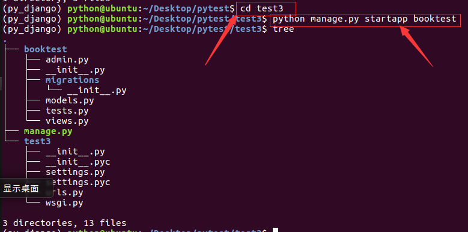

3) 在test3/settings.py中INSTALLED_APPS项安装应用


4) 在test3/settings.py中DATABASES项配置使用MySQL数据库test2，数据库在第二部分已经创建。


5) 在test3/settings.py中TEMPLATES项配置模板查找路径。

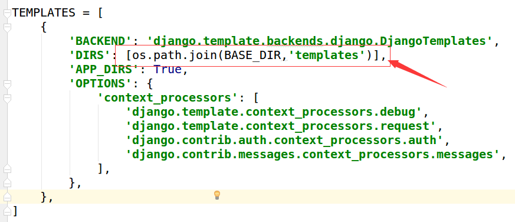

6）创建模板目录结构如下。


##### 使用视图的过程

视图就是一个python函数，被定义在"应用/views.py"文件中。 使用视图时需要进行两方面操作，两个操作不分先后。

1）**在"应用/views.py"中定义视图**。

在booktest/views.py中定义视图函数index：

```
  def index(request):
    return HttpResponse("视图函数index")
```

2）**配置URLconf，将视图函数和url对应起来**。

在test3/urls.py中编辑加入如下代码：

```
from django.conf.urls import include, url
from django.contrib import admin

urlpatterns = [
    url(r'^admin/', include(admin.site.urls)),
    url(r'^', include('booktest.urls')), #这句代码是新加入的，包含booktest应用中的urls文件
]
```

在booktest目录下创建urls.py文件并编辑其内容如下：

```
from django.conf.urls import url #导入url函数

from booktest import views #导入视图模块

urlpatterns = [
    url(r'^$', views.index), #建立url和views.index视图函数的关联
]
```

##### 启动服务器

启动服务器，并通过浏览器访问 http://127.0.0.1:8000， 页面显示如下：


## URLconf

用户通过在浏览器的地址栏中输入网址请求网站，对于Django开发的网站，由哪一个视图进行处理请求，是由url匹配找到的。

#### 配置

1）在test3/settings.py中通过ROOT_URLCONF指定url配置，默认已经有此配置。


2）打开test3/urls.py可以看到默认配置。


##### 注意点

- 在test3/urls.py中进行包含配置，在各自应用中创建具体配置。

- 定义urlpatterns列表，存储url()对象，这个名称是固定的。

  > urlpatterns中的每个正则表达式在第一次访问它们时被编译，这使得运行很快。

#### 语法

url()对象，被定义在django.conf.urls包中，有两种语法结构：

**语法一**：包含，一般在自定义应用中创建一个urls.py来定义url。

这种语法用于test3/urls.py中，目的是将应用的urls配置到应用内部，数据更清晰并且易于维护。

```
url(正则,include('应用.urls'))
```

1）如示例在test3/urls.py文件，包含booktest中的urls。

```
url(r'^',include('booktest.urls')),
```


2) 如示例在booktest目录下创建urls.py文件。


**语法二**：定义，指定URL和视图函数的对应关系。

在应用内部创建urls.py文件，指定请求地址与视图的对应关系。

```
url(正则,'视图函数名称')
```

1）如示例在booktest/urls.py中创建首页的url，代码如下

```
from django.conf.urls import url
from booktest import views
urlpatterns=[
    url(r'^$',views.index),
]
```

2）如示例在booktest/views.py中创建视图index

```
from django.shortcuts import render
from django.http import HttpResponse

def index(request):
  return HttpResponse("视图函数index")
```

> 说明1：正则部分推荐使用r，表示字符串不转义，这样在正则表达式中使用\只写一个就可以。 说明2：不能在开始加反斜杠，推荐在结束加反斜杠。

```
正确：index/
正确：index
错误：/index
错误：/index/
```

#### 获取值

请求的url被看做是一个普通的python字符串，进行匹配时不包括域名、get或post参数。 如请求地址如下：

```
http://127.0.0.1:8000/delete1/?a=10
```

1）去除掉域名和参数部分，并将最前面的/去除后，只剩下如下部分与正则匹配。

```
delete1/
```

2）打开booktest/urls.py文件，定义与这个地址匹配的url如下：

```
url(r'^delete\d+/$',views.show_arg),
```


3）在booktest/views.py中创建视图show_arg。

```
def show_arg(request):
    return HttpResponse('show_arg')
```

4）启动服务器，输入上面的网址，浏览器中效果如下图。


可以在匹配过程中从url中捕获参数，每个捕获的参数都作为一个普通的python字符串传递给视图。

获取值需要在正则表达式中使用小括号，分为两种方式：

- 位置参数
- 关键字参数

> 注意：两种参数的方式不要混合使用，在一个正则表达式中只能使用一种参数方式。

###### 方式一：位置参数

直接使用小括号，通过位置参数传递给视图。

1）为了提取参数，修改上面的正则表达式如下：

```
url(r'^delete(\d+)/$',views.show_arg),
```

2）修改视图show_arg如下：

> 注意：参数的名字是任意的如a1、b8，尽量做到见名知意。

```
def show_arg(request,id):
    return HttpResponse('show arg %s'%id)
```

3）刷新浏览器页面，效果如下图：


4）在地址栏输入如下地址：

```
http://127.0.0.1:8000/2/?a=10
```

5）浏览器页面效果如下图


###### 方式二：关键字参数

在正则表达式部分为组命名。

1）修改正则表达式如下：

> 其中?P部分表示为这个参数定义的名称为id，可以是其它名称，起名做到见名知意。

```
url(r'^delete(?P<id1>\d+)/$',views.show_arg),
```

2）修改视图show_arg如下：

> 注意：视图show_arg此时必须要有一个参数名为id1，否则报错。

```
def show_arg(request,id1):
    return HttpResponse('show %s'%id1)
```

3）刷新浏览器页面，效果如下图


## 视图

视图就是python中的函数，视图一般被定义在"应用/views.py"文件中，此例中为"booktest/views.py"文件。视图必须返回一个HttpResponse对象或子对象作为响应。响应可以是一张网页的HTML内容，一个重定向，一个404错误等。

视图的第一个参数必须为HttpRequest实例，还可能包含下参数如：

- 通过正则表达式组获得的关键字参数。
- 通过正则表达式组获取的位置参数。

#### 内置错误视图

Django内置处理HTTP错误的视图，主要错误及视图包括：

- 404错误：page not found视图
- 500错误：server error视图

如果想看到错误视图而不是调试信息，需要修改test3/setting.py文件的DEBUG项。

```
DEBUG = False
ALLOWED_HOSTS = ['*', ]
```

###### 404错误及视图

将请求地址进行url匹配后，没有找到匹配的正则表达式，则调用404视图，这个视图会调用404.html的模板进行渲染。视图传递变量request_path给模板，表示导致错误的URL。

1）在templates中创建404.html。


2）定义代码如下：

```
<html>
<head>
    <title></title>
</head>
<body>
找不到了
<hr/>
{{request_path}}
</body>
</html>
```

3）在浏览器中输入如下网址：

```
http://127.0.0.1:8000/test/
```

4）运行效果如下图：


#### 500错误及视图

在视图中代码运行报错会发生500错误，调用内置错误视图，使用templates/500.html模板渲染。

视图处理过程如下图：


## 类视图

类视图：同一个URL路径，可以处理不同类型的请求

类视图需继承`django.view.generic.View`类

视图代码：

```python
from django.view.generic import View
class RegisterView(View):
    def get(self, request):
        """处理get请求"""
        pass

    def post(self, request):
        """处理post请求"""
        pass
    
```

路由代码：

```python
urlpatterns = [
    # 使用类视图
    url(r'^register$', RegisterView.as_view()),  # 注册
]
```


## HttpReqeust对象

服务器接收到http协议的请求后，会根据报文创建HttpRequest对象，这个对象不需要我们创建，直接使用服务器构造好的对象就可以。**视图的第一个参数必须是HttpRequest对象**，在django.http模块中定义了HttpRequest对象的API。

#### 属性

> 下面除非特别说明，属性都是只读的。

- path：一个字符串，表示请求的页面的完整路径，不包含域名和参数部分。
- method：一个字符串，表示请求使用的HTTP方法，常用值包括：'GET'、'POST'。
  - 在浏览器中给出地址发出请求采用get方式，如超链接。
  - 在浏览器中点击表单的提交按钮发起请求，如果表单的method设置为post则为post请求。
- encoding：一个字符串，表示提交的数据的编码方式。
  - 如果为None则表示使用浏览器的默认设置，一般为utf-8。
  - 这个属性是可写的，可以通过修改它来修改访问表单数据使用的编码，接下来对属性的任何访问将使用新的encoding值。
- GET：QueryDict类型对象，类似于字典，包含get请求方式的所有参数。
- POST：QueryDict类型对象，类似于字典，包含post请求方式的所有参数。
- FILES：一个类似于字典的对象，包含所有的上传文件。
- COOKIES：一个标准的Python字典，包含所有的cookie，键和值都为字符串。
- session：一个既可读又可写的类似于字典的对象，表示当前的会话，只有当Django 启用会话的支持时才可用，详细内容见"状态保持"。
- 运行服务器，在浏览器中浏览首页，可以在浏览器“开发者工具”中看到请求信息如下图：

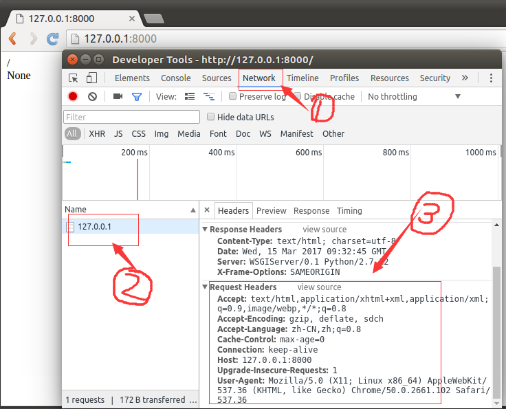

#### 示例

接下来演示属性path、method、encoding，对于GET、POST、FILES、COOKIES、session后面会有详细讲解。

##### path、encoding

1）打开booktest/views.py文件，代码如下：

```
def index(request):
    str='%s,%s'%(request.path,request.encoding)
    return render(request, 'booktest/index.html', {'str':str})
```

2）在templates/booktest/下创建index.html文件，代码如下：

```
<html>
<head>
    <title>首页</title>
</head>
<body>
1. request对象的path,encoding属性：<br/>
{{ str }}
<br/>
</body>
</html>
```

2）打开浏览器请求，运行效果如下图：


3）以chrome浏览器为例，设置编码如下图，默认为utf-8编码。


##### method

1）打开booktest/views.py文件，编写视图method_show，代码如下：

```
def method_show(request):
    return HttpResponse(request.method)
```

2）打开booktest/urls.py文件，新增配置如下：

```
    url(r'^method_show/$', views.method_show),
```

3）修改templates/booktest/下创建index.html文件，添加代码如下：

```
<html>
<head>
    <title>首页</title>
</head>
<body>
...
...
2.request对象的method属性：<br/>
<a href='/method_show/'>get方式</a><br/>
<form method="post" action="/method_show/">
    <input type="submit" value="post方式">
</form>
<br/>
</body>
</html>
```

4）打开浏览器，输入如下网址：

```
http://127.0.0.1:8000/
```

5）浏览效果如下图：


6）点击链接，转到method_show，浏览效果如下图:


7) 回到method_test页面，点击按钮，转到method_post，浏览效果如下图，报错了。


8）打开test3/settings.py文件，将MIDDLEWARE_CLASSES项的csrf注释。


9）回到浏览器中刷新，浏览效果如下图，点击“继续”按钮。


10）最终浏览效果如下图：


### QueryDict对象

- 定义在django.http.QueryDict
- HttpRequest对象的属性GET、POST都是QueryDict类型的对象
- 与python字典不同，QueryDict类型的对象用来处理同一个键带有多个值的情况
- 方法get()：根据键获取值
- 如果一个键同时拥有多个值将获取最后一个值
- 如果键不存在则返回None值，可以设置默认值进行后续处理

```
dict.get('键',默认值)
可简写为
dict['键']
```

- 方法getlist()：根据键获取值，值以列表返回，可以获取指定键的所有值
- 如果键不存在则返回空列表[]，可以设置默认值进行后续处理

```
dict.getlist('键',默认值)
```


### GET属性

请求格式：在请求地址结尾使用?，之后以"键=值"的格式拼接，多个键值对之间以&连接。

例：网址如下

```
http://www.itcast.cn/?a=10&b=20&c=python
```

其中的请求参数为：

```
a=10&b=20&c=python
```

- 分析请求参数，键为'a'、'b'、'c'，值为'10'、'20'、'python'。
- 在Django中可以使用HttpRequest对象的GET属性获得get方方式请求的参数。
- GET属性是一个QueryDict类型的对象，键和值都是字符串类型。
- 键是开发人员在编写代码时确定下来的。
- 值是根据数据生成的。

### POST属性

使用form表单请求时，method方式为post则会发起post方式的请求，需要使用HttpRequest对象的POST属性接收参数，POST属性是一个QueryDict类型的对象。

**问：表单form如何提交参数呢？**

答：表单控件name属性的值作为键，value属性的值为值，构成键值对提交。

- 如果表单控件没有name属性则不提交。
- 对于checkbox控件，name属性的值相同为一组，被选中的项会被提交，出现一键多值的情况。
- 键是表单控件name属性的值，是由开发人员编写的。
- 值是用户填写或选择的。

#### 示例

1）打开booktest/views.py文件，创建视图show_reqarg。

```
#接收请求参数
def show_reqarg(request):
    if request.method == 'GET':
        a = request.GET.get('a') #获取请求参数a
        b = request.GET.get('b') #获取请求参数b
        c = request.GET.get('c') #获取请求参数c
        return render(request, 'booktest/show_getarg.html', {'a':a, 'b':b, 'c':c})
    else:
        name = request.POST.get('uname') #获取name
        gender = request.POST.get('gender') #获取gender
        hobbys = request.POST.getlist('hobby') #获取hobby
        return render(request, 'booktest/show_postarg.html', {'name':name, 'gender':gender, 'hobbys':hobbys})
```

2）打开booktest/urls.py文件，配置url。

```
    url(r'^show_reqarg/$', views.show_reqarg),
```

3）修改templates/booktest目录下的index.html，添加代码如下：

```
<html>
<head>
    <title>首页</title>
</head>
<body>
...
...
3.提交数据的两种方式：
get方式:<br/>
<a href="/show_reqarg/?a=1&b=2&c=python">get方式提交数据</a><br/>
post方式:<br/>
<form method="post" action="/show_reqarg/">
    姓名：<input type="text" name="uname"><br/>
    性别：男<input type="radio" name="gender" value="男"/>
    女<input type="radio" name="gender" value="女"/><br/>
    爱好：
    吃饭<input type="checkbox" name="hobby" value="吃饭"/>
    睡觉<input type="checkbox" name="hobby" value="睡觉"/>
    打豆豆<input type="checkbox" name="hobby" value="打豆豆"/><br>
    <input type="submit" value="提交">
</form>
<br/>
</body>
</html>
```

4）运行服务器。

```
http://127.0.0.1:8000/
```

浏览效果如下图：


5）在templates/booktest目录下创建show_getarg.html，show_postarg.html，代码如下:

**show_getarg.html**:

```
<html>
<head>
    <title>GET方式提交数据</title>
</head>
<body>
a:{{ a }}<br/>
b:{{ b }}<br/>
c:{{ c }}<br/>
</body>
</html>
```

**show_postarg.html**:

```
<html>
<head>
    <title>POST方式提交数据</title>
</head>
<body>
name:{{ name }}<br/>
gender:{{ gender }}<br/>
hobbys:
<ul>
    
        <li>{{ hobby }}</li>
    
</ul>
</body>
</html>
```

6）点击链接GET方式提交数据，浏览效果如下图：


7）后退到index页面，输入数据如下，点击提交，浏览效果如下图：

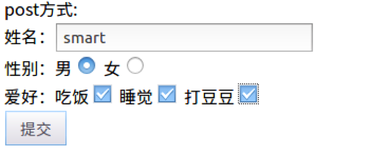


## HttpResponse对象

视图在接收请求并处理后，必须返回HttpResponse对象或子对象。在django.http模块中定义了HttpResponse对象的API。HttpRequest对象由Django创建，HttpResponse对象由开发人员创建。

运行服务器，在浏览器中浏览首页，可以在浏览器“开发者工具”中看到响应信息如下图：

> 标号3为响应头信息，点击标号4处可以查看响应体信息。

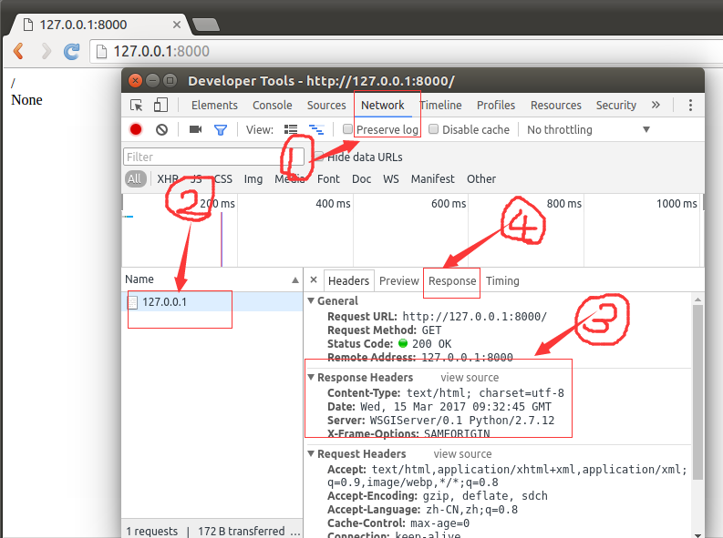

#### 属性

- content：表示返回的内容。
- charset：表示response采用的编码字符集，默认为utf-8。
- status_code：返回的HTTP响应状态码。
- content-type：指定返回数据的的MIME类型，默认为'text/html'。

#### 方法

- _*init_*：创建HttpResponse对象后完成返回内容的初始化。

- set_cookie：设置Cookie信息。

  ```
  set_cookie(key, value='', max_age=None, expires=None)
  ```

- cookie是网站以键值对格式存储在浏览器中的一段纯文本信息，用于实现用户跟踪。

  - max_age是一个整数，表示在指定秒数后过期。
  - expires是一个datetime或timedelta对象，会话将在这个指定的日期/时间过期。
  - max_age与expires二选一。
  - 如果不指定过期时间，在关闭浏览器时cookie会过期。

- delete_cookie(key)：删除指定的key的Cookie，如果key不存在则什么也不发生。

- write：向响应体中写数据。

### 示例

#### 直接返回数据

1）打开booktest/views.py文件，定义视图index2如下：

```
def index2(request):
    str='<h1>hello world</h1>'
    return HttpResponse(str)
```

2）打开booktest/urls.py文件，配置url。

```
    url(r'^index2/$',views.index2),
```

3）运行服务器，在浏览器中打开如下网址。

```
http://127.0.0.1:8000/index2/
```

运行效果如下图：


**如果使用这种方式构造一个漂亮丰富的页面，对于开发人员真是会发疯，于是就有了下面的方式：**

#### 调用模板

可以将html、css、js定义到一个html文件中，然后由视图来调用。

1）打开booktest/views.py文件，定义视图index3如下：

```
from django.template import RequestContext, loader
...
def index3(request):
    #加载模板
    t1=loader.get_template('booktest/index3.html')
    #构造上下文
    context=RequestContext(request,{'h1':'hello'})
    #使用上下文渲染模板，生成字符串后返回响应对象
    return HttpResponse(t1.render(context))
```

2）打开booktest/urls.py文件，配置url。

```
    url(r'^index3/$',views.index3),
```

3）在templates/booktest/目录下创建index3.html，代码如下：

```
<html>
<head>
    <title>使用模板</title>
</head>
<body>
<h1>{{h1}}</h1>
</body>
</html>
```

4）运行服务器，在浏览器中打开如下网址。

```
http://127.0.0.1:8000/index3/
```

运行效果如下图：


#### 调用模板简写函数render

每次调用模板时都要执行加载、上下文、渲染三个步骤，为了简化操作，Django定义了render()函数封装了以上三个步骤的代码，定义在django.shortcuts模块中。

1）打开booktest/views.py文件，定义视图index3如下：

```
from django.shortcuts import render
...
def index3(request):
    return render(request, 'booktest/index3.html', {'h1': 'hello'})
```

**是不是用render()函数调用模板比上面简单多了？**


### 子类JsonResponse

在浏览器中使用javascript发起ajax请求时，返回json格式的数据，此处以jquery的get()方法为例。类JsonResponse继承自HttpResponse对象，被定义在django.http模块中，创建对象时接收字典作为参数。

> JsonResponse对象的content-type为'application/json'。

#### 示例

1）在booktest/views.py文件中定义视图json1、json2，代码如下：

```
from django.http import JsonResponse
...
def json1(request):
    return render(request,'booktest/json1.html')
def json2(request):
    return JsonResponse({'h1':'hello','h2':'world'})
```

2）在booktest/urls.py文件中配置url。

```
    url(r'^json1/$', views.json1),
    url(r'^json2/$', views.json2),
```

3）创建目录static/js/，把jquery文件拷贝到这个目录下。


4）打开test3/settings.py文件，在文件最底部，配置静态文件查找路径，并且要求开启调试

```
DEBUG = True
...
STATICFILES_DIRS = [
    os.path.join(BASE_DIR, 'static'),
]
```

s 5）在templates/booktest/目录下创建json1.html，代码如下：

```
<html>
<head>
    <title>json</title>
    <script src="/static/js/jquery-1.12.4.min.js"></script>
    <script>
        $(function () {
            $('#btnJson').click(function () {
                $.get('/json2/',function (data) {
                    ul=$('#jsonList');
                    ul.append('<li>'+data['h1']+'</li>')
                    ul.append('<li>'+data['h2']+'</li>')
                })
            });
        });
    </script>
</head>
<body>
<input type="button" id="btnJson" value="获取json数据">
<ul id="jsonList"></ul>
</body>
</html>
```

6）运行服务器，在浏览器中输入如下地址。

```
http://127.0.0.1:8000/json1/
```

7）点击按钮"获取json数据"后浏览如下图。


ajax代码执行过程如下：

- 1.发起请求。
- 2.服务器端视图函数执行。
- 3.执行回调函数。

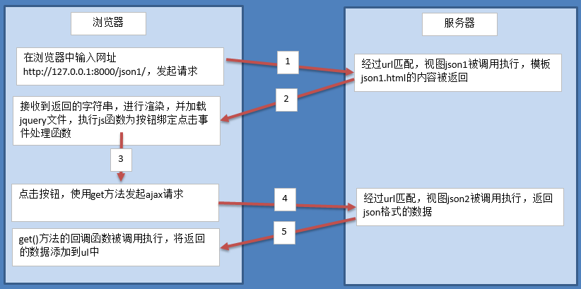


### 子类HttpResponseRedirect

当一个逻辑处理完成后，不需要向客户端呈现数据，而是转回到其它页面，如添加成功、修改成功、删除成功后显示数据列表，而数据的列表视图已经开发完成，此时不需要重新编写列表的代码，而是转到这个视图就可以，此时就需要模拟一个用户请求的效果，从一个视图转到另外一个视图，就称为重定向。

Django中提供了HttpResponseRedirect对象实现重定向功能，这个类继承自HttpResponse，被定义在django.http模块中，返回的状态码为302。

#### 示例

1）在booktest/views.py文件中定义视图red1，代码如下：

```
from django.http import HttpResponseRedirect
...
# 定义重定义向视图，转向首页
def red1(request):
    return HttpResponseRedirect('/')
```

2）在booktest/urls.py文件中配置url。

```
    url(r'^red1/$', views.red1),
```

3）在地址栏中输入网址如下：

```
http://127.0.0.1:8000/red1/
```

4）回车后，浏览器地址栏如下图。


#### 重定向简写函数redirect

在django.shortcuts模块中为重定向类提供了简写函数redirect。

1）修改booktest/views.py文件中red1视图，代码如下：

```
from django.shortcuts import redirect
...
def red1(request):
    return redirect('/')
```


## 状态保持

浏览器请求服务器是无状态的。无状态指一次用户请求时，浏览器、服务器无法知道之前这个用户做过什么，每次请求都是一次新的请求。无状态的应用层面的原因是：浏览器和服务器之间的通信都遵守HTTP协议。根本原因是：浏览器与服务器是使用Socket套接字进行通信的，服务器将请求结果返回给浏览器之后，会关闭当前的Socket连接，而且服务器也会在处理页面完毕之后销毁页面对象。

有时需要保存下来用户浏览的状态，比如用户是否登录过，浏览过哪些商品等。 实现状态保持主要有两种方式：

- 在客户端存储信息使用Cookie。
- 在服务器端存储信息使用Session。


### Cookie

Cookie，有时也用其复数形式Cookies，指某些网站为了辨别用户身份、进行session跟踪而储存在用户本地终端上的数据（通常经过加密）。Cookie最早是网景公司的前雇员Lou  Montulli在1993年3月的发明。Cookie是由服务器端生成，发送给User-Agent（一般是浏览器），浏览器会将Cookie的key/value保存到某个目录下的文本文件内，下次请求同一网站时就发送该Cookie给服务器（前提是浏览器设置为启用cookie）。Cookie名称和值可以由服务器端开发自己定义，这样服务器可以知道该用户是否是合法用户以及是否需要重新登录等。服务器可以利用Cookies包含信息的任意性来筛选并经常性维护这些信息，以判断在HTTP传输中的状态。Cookies最典型记住用户名。

Cookie是存储在浏览器中的一段纯文本信息，建议不要存储敏感信息如密码，因为电脑上的浏览器可能被其它人使用。

#### Cookie的特点

- Cookie以键值对的格式进行信息的存储。
- Cookie基于域名安全，不同域名的Cookie是不能互相访问的，如访问itcast.cn时向浏览器中写了Cookie信息，使用同一浏览器访问baidu.com时，无法访问到itcast.cn写的Cookie信息。
- 当浏览器请求某网站时，会将浏览器存储的跟网站相关的所有Cookie信息提交给网站服务器。

**典型应用：记住用户名，网站的广告推送。**

说明：[点击示例网址](http://news.ifeng.com/a/20170315/50781774_0.shtml)，这些广告推送的商品是基于你曾经在淘宝上点击的商品类别等条件筛选出来的，看上去这是在凤凰网上访问淘宝网的Cookie，但是事实不是这样的，一般是采用iframe标签嵌套一个淘宝的广告页面到凤凰网的页面上，所以淘宝的Cookie并没有被凤凰网读取到，而是依然交给淘宝网读取的，可以通过"开发者工具"查看元素，如下图：


接下来讲解如何在Django中实现Cookie的读写。

#### 设置Cookie

1）打开booktest/views.py文件，创建视图cookie_set。

```
def cookie_set(request):
    response = HttpResponse("<h1>设置Cookie，请查看响应报文头</h1>")
    response.set_cookie('h1', '你好')
    return response
```

2）打开booktest/urls.py文件，配置url。

```
    url(r'^cookie_set/$',views.cookie_set),
```

3）在浏览器输入如下网址。

```
http://127.0.0.1:8000/cookie_set/
```

在"开发者工具"中可以在响应头中查看到设置的Cookie信息。


#### 读取Cookie

Cookie信息被包含在请求头中，使用request对象的COOKIES属性访问。

1）打开booktest/views.py文件，创建视图cookie_get。

```
def cookie_get(request):
    response = HttpResponse("读取Cookie，数据如下：<br>")
    if 'h1' in request.COOKIES:
        response.write('<h1>' + request.COOKIES['h1'] + '</h1>')
    return response
```

2）打开booktest/urls.py文件，配置url。

```
    url(r'^cookie_get/$',views.cookie_get),
```

3）在浏览器输入如下网址。

```
http://127.0.0.1:8000/cookie_get/
```

4）打开“开发者工具”，在请求头中可以查看Cookie信息，浏览效果如下图：


### Session

对于敏感、重要的信息，建议要储在服务器端，不能存储在浏览器中，如用户名、余额、等级、验证码等信息。

> 在服务器端进行状态保持的方案就是Session。

#### 启用Session

Django项目默认启用Session。

打开test3/settings.py文件，在项MIDDLEWARE_CLASSES中启用Session中间件。

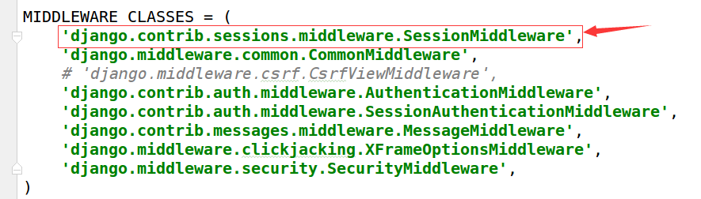

禁用Session：将Session中间件删除。

#### 存储方式

打开test3/settings.py文件，设置SESSION_ENGINE项指定Session数据存储的方式，可以存储在数据库、缓存、Redis等。

1）存储在数据库中，如下设置可以写，也可以不写，这是默认存储方式。

```
SESSION_ENGINE='django.contrib.sessions.backends.db'
```

2）存储在缓存中：存储在本机内存中，如果丢失则不能找回，比数据库的方式读写更快。

```
SESSION_ENGINE='django.contrib.sessions.backends.cache'
```

3）混合存储：优先从本机内存中存取，如果没有则从数据库中存取。

```
SESSION_ENGINE='django.contrib.sessions.backends.cached_db'
```

4）如果存储在数据库中，需要在项INSTALLED_APPS中安装Session应用。

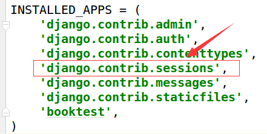

5）迁移后会在数据库中创建出存储Session的表。


6）表结构如下图。


> 由表结构可知，操作Session包括三个数据：键，值，过期时间。

#### 依赖于Cookie

所有请求者的Session都会存储在服务器中，服务器如何区分请求者和Session数据的对应关系呢？

答：在使用Session后，会在Cookie中存储一个sessionid的数据，每次请求时浏览器都会将这个数据发给服务器，服务器在接收到sessionid后，会根据这个值找出这个请求者的Session。

结果：如果想使用Session，浏览器必须支持Cookie，否则就无法使用Session了。

存储Session时，键与Cookie中的sessionid相同，值是开发人员设置的键值对信息，进行了base64编码，过期时间由开发人员设置。

#### 对象及方法

通过HttpRequest对象的session属性进行会话的读写操作。

1） 以键值对的格式写session。

```
request.session['键']=值
```

2）根据键读取值。

```
request.session.get('键',默认值)
```

3）清除所有session，在存储中删除值部分。

删除session中保存的字典键值对，但sessionid还会保存

```
request.session.clear()
```

4）清除session数据，在存储中删除session的整条数据。

sessionid 和 保存字典键值对都会被删除

```
request.session.flush()
```

5）删除session中的指定键及值，在存储中只删除某个键及对应的值。

```
del request.session['键']
```

6）设置会话的超时时间，如果没有指定过期时间则两个星期后过期。

```
request.session.set_expiry(value)
```

- 如果value是一个整数，会话将在value秒没有活动后过期。
- 如果value为0，那么用户会话的Cookie将在用户的浏览器关闭时过期。
- 如果value为None，那么会话永不过期。

#### 示例

###### 写session

1）打开booktest/views.py文件，创建视图session_test，代码如下：

```
def session_test(request):
    request.session['h1']='hello'
    return HttpResponse('写session')
```

2）打开booktest/urls.py文件，配置url。

```
    url(r'^session_test/$',views.session_test),
```

3）运行服务器，打开浏览器请求如下网址。

```
http://127.0.0.1:8000/session_test/
```

4）浏览效果如下图，在"开发者工具"中可以查看到响应头中创建了Cookie，里面有个键为sessionid。


5）打开MySQL数据库命令行，查询数据如下图。


查看Cookie中的sessionid值为"l48euizwnd0u1vrq401rwc9yqxkj4ip4"，数据表中session的键为“l48euizwnd0u1vrq401rwc9yqxkj4ip4”，是一样的，这样，服务器就可以在众多的请求者中找到对应的Session数据。

在MySQL数据库命令行中复制值，在[Base64解码](http://tool.oschina.net/encrypt?type=3)中进行解码查看如下图。

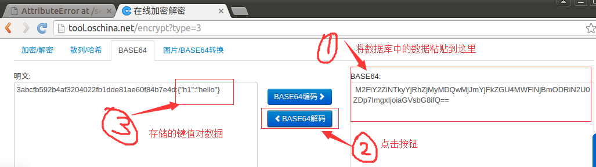

###### 读session

1）打开booktest/views.py文件，修改session_test视图如下：

```
def session_test(request):
    # request.session['h1']='hello'
    h1=request.session.get('h1')
    return HttpResponse(h1)
```

2）刷新浏览器效果如下图。


###### 删除

1）打开booktest/views.py文件，修改session_test视图如下：

```
def session_test(request):
    # request.session['h1']='hello'
    # h1=request.session.get('h1')
    del request.session['h1']
    return HttpResponse('ok')
```

2）刷新浏览器，在数据库命令行中查询，base64解码后如下图。


如果将所有的键及值都删除，逐个调用del太麻烦，可以使用clear()方法。

###### 删除session

1）打开booktest/views.py文件，修改session_test视图如下：

```
def session_test(request):
    # request.session['h1']='hello'
    # h1=request.session.get('h1')
    # del request.session['h1']
    request.session.flush()
    return HttpResponse('ok')
```

2）刷新浏览器，在数据库命令行中查询如下图。


#### 使用Redis存储Session

会话还支持文件、纯cookie、Memcached、Redis等方式存储，下面演示使用redis存储。

1）安装包。

```
pip install django-redis-sessions==0.5.6
```

2）修改test3/settings文件，增加如下项：

```
SESSION_ENGINE = 'redis_sessions.session'
SESSION_REDIS_HOST = 'localhost'
SESSION_REDIS_PORT = 6379
SESSION_REDIS_DB = 2
SESSION_REDIS_PASSWORD = ''
SESSION_REDIS_PREFIX = 'session'
```

3）打开booktest/views.py文件，修改session_test视图如下：

```
def session_test(request):
    request.session['h1']='hello'
    # h1=request.session.get('h1')
    # del request.session['h1']
    # request.session.flush()
    return HttpResponse('ok')
```

4）管理redis的命令，需要保证redis服务被开启。

```
查看：ps ajx|grep redis
启动：sudo service redis start
停止：sudo service redis stop
使用客户端连接服务器：redis-cli
切换数据库：select 2
查看所有的键：keys *
获取指定键的值：get name
```

5）刷新浏览器，在redis客户端中查看数据如下。


# 模板

作为Web框架，Django提供了模板，用于编写html代码，还可以嵌入模板代码更快更方便的完成页面开发，再通过在视图中渲染模板，将生成最终的html字符串返回给客户端浏览器。模版致力于表达外观，而不是程序逻辑。模板的设计实现了业务逻辑view与显示内容template的分离，一个视图可以使用任意一个模板，一个模板可以供多个视图使用。

模板包含两部分：

- 静态部分，包含html、css、js。
- 动态部分，就是模板语言。

Django模板语言，简写DTL，定义在django.template包中。 创建项目后，在"项目名称/settings.py"文件中定义了关于模板的配置。


DIRS定义一个目录列表，模板引擎按列表顺序搜索这些目录以查找模板文件，通常是在项目的根目录下创建templates目录。

Django处理模板分为两个阶段：

- 1.加载：根据给定的路径找到模板文件，编译后放在内存中。
- 2.渲染：使用上下文数据对模板插值并返回生成的字符串。

为了减少开发人员重复编写加载、渲染的代码，Django提供了简写函数render，用于调用模板。

#### 创建示例项目

1）创建项目test4。

```
django-admin startproject test4
```


2）进入项目目录test4，创建应用booktest。

```
cd test4
python manage.py startapp booktest
```


4）在test4/settings.py中INSTALLED_APPS项安装应用。


5）在test4/settings.py中DATABASES项配置使用MySQL数据库test2，数据库在第二部分已经创建。


6）在test4/settings.py中TEMPLATES项配置模板查找路径。


7）创建模板目录结构如下。


8）打开test4/urls.py文件，包含booktest的url配置。


9）在booktest/目录下创建urls.py，配置url。

```
from django.conf.urls import url
from booktest import views
urlpatterns=[
    url(r'^$',views.index),
]
```

10）打开booktest/views.py文件，定义视图index。

```
from django.shortcuts import render

def index(request):
    return render(request,'booktest/index.html')
```

11）在templates/booktest目录下创建文件index.html，代码如下：

```
<html>
<head>
    <title>首页</title>
</head>
<body>

</body>
</html>
```

12）打开booktest/models.py文件，定义模型类BookInfo，结构参照第二部分设计。

```
from django.db import models

class BookInfo(models.Model):
    btitle = models.CharField(max_length=20)
    bpub_date = models.DateField()
    bread = models.IntegerField(default=0)
    bcommet = models.IntegerField(default=0)
    isDelete = models.BooleanField(default=False)
```


## 模板语言

模板语言包括4种类型，分别是：

- 变量
- 标签
- 过滤器
- 注释

接下来逐个介绍4种类型。


### 模板变量

模板变量的作用是计算并输出，变量名必须由字母、数字、下划线（不能以下划线开头）和点组成。

> Django 默认会把 `request.user`穿给模板文件

语法如下：

```
{{变量}}
```

当模版引擎遇到点如book.title，会按照下列顺序解析：

- 1.字典book['title']

- 2.先属性后方法，将book当作对象，查找属性title，如果没有再查找方法title()

- 3.如果是格式为book.0则解析为列表book[0]

  > 如果变量不存在则插入空字符串''。

在模板中调用方法时不能传递参数。

#### 示例

1）打开booktest/views.py文件，创建视图temp_var。

```
def temp_var(request):
    dict={'title':'字典键值'}
    book=BookInfo()
    book.btitle='对象属性'
    context={'dict':dict,'book':book}
    return render(request,'booktest/temp_var.html',context)
```

2）打开booktest/urls.py文件，配置url。

```
url(r'^temp_var/$', views.temp_var),
```

3）修改在templates/booktest下创建temp_var.html。

```
<html>
<head>
    <title>模板变量</title>
</head>
<body>
模板变量：<br/>
{{dict.title}}<br/>
{{book.btitle}}<br/>
</body>
</html>
```

4）运行服务器，在浏览器中输入如下网址。

```
http://127.0.0.1:8000/temp_var/
```

5）浏览效果如下图。


### 标签

语法如下：

```

```

for标签语法如下：

```

循环逻辑
{{forloop.counter}}表示当前是第几次循环，从1开始

列表为空或不存在时执行此逻辑

```

if标签语法如下：

```

逻辑1

逻辑2

逻辑3

```

比较运算符如下：

> 注意：运算符左右两侧不能紧挨变量或常量，必须有空格。

```
==
!=
<
>
<=
>=
```

布尔运算符如下：

```
and
or
not
```

点击查看[内建标签](http://python.usyiyi.cn/translate/django_182/ref/templates/builtins.html)了解更多标签，还有一些常用的标签会在后续地章节中讲解。

#### 示例

1）打开booktest/views.py文件，创建视图temp_tag。

```
from booktest.models import BookInfo
def temp_tags(request):
    context={'list':BookInfo.objects.all()}
    return render(request,'booktest/temp_tag.html',context)
```

2）打开booktest/urls.py文件，配置url。

```
    url(r'^temp_tag/$', views.temp_tags),
```

3）在templates/booktest下创建temp_tag.html。

```
<html>
<head>
    <title>标签</title>
</head>
<body>
图书列表如下：
<ul>
    
        
            <li style="background-color: red;">{{book.btitle}}</li>
        
            <li style="background-color: blue;">{{book.btitle}}</li>
        
            <li style="background-color: green;">{{book.btitle}}</li>
        
    
        <li>对不起，没有图书</li>
    
</ul>
</body>
</html>
```

4）运行服务器，在浏览器中输入如下网址。

```
http://127.0.0.1:8000/temp_tag/
```

浏览效果如下图：


### 过滤器

语法如下:

- 使用管道符号|来应用过滤器，用于进行计算、转换操作，可以使用在变量、标签中。
- 如果过滤器需要参数，则使用冒号:传递参数。

```
变量|过滤器:参数
```

长度length，返回字符串包含字符的个数，或列表、元组、字典的元素个数。

默认值default，如果变量不存在时则返回默认值。

```
data|default:'默认值'
```

日期date，用于对日期类型的值进行字符串格式化，常用的格式化字符如下：

- Y表示年，格式为4位，y表示两位的年。
- m表示月，格式为01,02,12等。
- d表示日, 格式为01,02等。
- j表示日，格式为1,2等。
- H表示时，24进制，h表示12进制的时。
- i表示分，为0-59。
- s表示秒，为0-59。

```
value|date:"Y年m月j日  H时i分s秒"
```

点击查看[内建过滤器](http://python.usyiyi.cn/translate/django_182/ref/templates/builtins.html)了解更多过滤器。

#### 示例

1）打开booktest/views.py文件，创建视图temp_filter。

```
def temp_filter(request):
    context={'list':BookInfo.objects.all()}
    return render(request,'booktest/temp_filter.html',context)
```

2）打开booktest/urls.py文件，配置url。

```
    url(r'^temp_filter/$', views.temp_filter),
```

3）在templates/booktest下创建temp_filter.html。

```
<head>
    <title>过滤器</title>
</head>
<body>
图书列表如下：
<ul>
    
        
            <li style="background-color: red;">
                {{book.btitle}}
                ---默认时间格式为：
                {{book.bpub_date}}
            </li>
        
            <li style="background-color: green;">
                {{book.btitle}}
                ---格式化时间为：
                {{book.bpub_date|date:"Y-m-j"}}
            </li>
        
    
</ul>
</body>
</html>
```

4）运行服务器，在浏览器中输入如下网址。

```
http://127.0.0.1:8000/temp_filter/
```

浏览效果如下图：

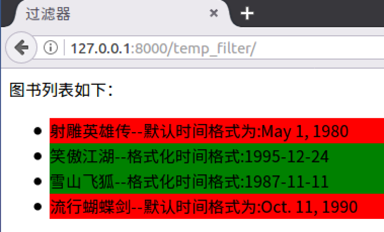


### 自定义过滤器

过滤器就是python中的函数，注册后就可以在模板中当作过滤器使用，下面以求余为例开发一个自定义过滤器mod。

#### 示例

1）在应用中创建templatetags目录，当前示例为"booktest/templatetags"，创建_*init_*文件，内容为空。


2）在"booktest/templatetags"目录下创建filters.py文件，代码如下：

```
#导入Library类
from django.template import Library

#创建一个Library类对象
register=Library()

#使用装饰器进行注册
@register.filter
#定义求余函数mod，将value对2求余
def mod(value):
    return value%2 == 0
```

3）在templates/booktest/temp_filter.html中，使用自定义过滤器。

- 首先使用load标签引入模块。load后面的值为过滤器所在的模块名

```

```


- 在遍历时根据编号判断奇偶，代码改为如下：


4）运行服务器，浏览效果如下：


过滤器可以接收参数，将booktest/templatetags/filters.py中增加mod_num函数。

```
#使用装饰器进行注册
@register.filter
#定义求余函数mod_num，将value对num求余
def mod_num(value,num):
    return value%num
```

5）在templates/booktest/temp_filter.html中修改遍历时判断代码。


6）运行服务器，浏览效果如下：


### 注释

在模板中使用如下模板注释，这段代码不会被编译，不会输出到客户端；html注释只能注释html内容，不能注释模板语言。

1）单行注释语法如下：

```
{#...#}
```

注释可以包含任何模版代码，有效的或者无效的都可以。

```
{# { % if foo % }bar{ % else % } #}
```

2）多行注释使用comment标签，语法如下：

```

...

```


## 模板继承

模板继承和类的继承含义是一样的，主要是为了提高代码重用，减轻开发人员的工作量。

**典型应用：网站的头部、尾部信息。**

#### 父模板

如果发现在多个模板中某些内容相同，那就应该把这段内容定义到父模板中。

标签block：用于在父模板中预留区域，留给子模板填充差异性的内容，名字不能相同。 为了更好的可读性，建议给endblock标签写上名字，这个名字与对应的block名字相同。父模板中也可以使用上下文中传递过来的数据。

```

预留区域，可以编写默认内容，也可以没有默认内容

```

#### 子模板

标签extends：继承，写在子模板文件的第一行。

```

```

子模版不用填充父模版中的所有预留区域，如果子模版没有填充，则使用父模版定义的默认值。

填充父模板中指定名称的预留区域。

```

实际填充内容
{{block.super}}用于获取父模板中block的内容

```

#### 示例

1）打开booktest/views.py文件，创建视图temp_inherit。

```
def temp_inherit(request):
    context={'title':'模板继承','list':BookInfo.objects.all()}
    return render(request,'booktest/temp_inherit.html',context)
```

2）打开booktest/urls.py文件，配置url。

```
    url(r'^temp_inherit/$', views.temp_inherit),
```

3）在templates下创建inherit_base.html。

```
<html>
<head>
    <title>{{title}}</title>
</head>
<body>
<h2>这是头</h2>
<hr>

这是区域一，有默认值

<hr>


<hr>
<h2>这是尾</h2>
</body>
</html>
```

4）在templates/booktest下创建temp_inherit.html。

```


<ul>
    
    <li>{{book.btitle}}</li>
    
</ul>

```

5）运行服务器，在浏览器中输入如下网址。

```
http://127.0.0.1:8000/temp_inherit/
```

6）浏览效果如下图。


## HTML转义

模板对上下文传递的字符串进行输出时，会对以下字符自动转义。

```
小于号< 转换为 &lt;

大于号> 转换为 &gt;

单引号' 转换为 &#39;

双引号" 转换为 &quot;

与符号& 转换为 &amp;
```

#### 示例

1）打开booktest/views.py文件，创建视图html_escape。

```
def html_escape(request):
    context={'content':'<h1>hello world</h1>'}
    return render(request,'booktest/html_escape.html',context)
```

2）打开booktest/urls.py文件，配置url。

```
    url(r'^html_escape/$', views.html_escape),
```

3）在templates/booktest/目录下创建html_escape.html。

```
<html>
<head>
    <title>转义</title>
</head>
<body>
自动转义：{{content}}
</body>
</html>
```

4）运行服务器，在浏览器中输入如下网址。

```
http://127.0.0.1:8000/html_escape/
```

> 转义后标记代码不会被直接解释执行，而是被直接呈现，防止客户端通过嵌入js代码攻击网站.

浏览效果如下图:


#### 关闭转义

过滤器escape可以实现对变量的html转义，默认模板就会转义，一般省略。

```
{{t1|escape}}
```

过滤器safe：禁用转义，告诉模板这个变量是安全的，可以解释执行。

```
{{data|safe}}
```

1）修改templates/booktest/html_escape.html代码如下。

```
<html>
<head>
    <title>转义</title>
</head>
<body>
自动转义：{{content}}
<hr>
过滤器safe关闭转义：{{content|safe}}
</body>
</html>
```

刷新浏览器后效果如下图：


标签autoescape：设置一段代码都禁用转义，接受on、off参数。

```

...

```

1）修改templates/booktest/html_escape.html代码如下。

```
<html>
<head>
    <title>转义</title>
</head>
<body>
自动转义：{{content}}
<hr>
过滤器safe关闭转义：{{content|safe}}
<hr>
标签autoescape关闭转义：

{{content}}

</body>
</html>
```

刷新浏览器后效果如下图：

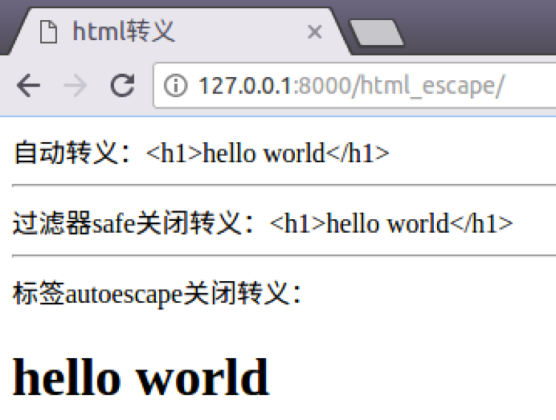

#### 字符串字面值

对于在模板中硬编码的html字符串，不会转义。

1）修改templates/booktest/html_escape.html代码如下：

```
<html>
<head>
    <title>转义</title>
</head>
<body>
自动转义：{{content}}
<hr>
过滤器safe关闭转义：{{content|safe}}
<hr>
标签autoescape关闭转义：

{{content}}

<hr>
模板硬编码不转义：{{data|default:'<b>hello</b>'}}
</body>
</html>
```

2）刷新浏览器后效果如下图：


如果希望出现转义的效果，则需要手动编码转义。

1）修改templates/booktest/html_escape.html代码如下：

```
<html>
<head>
    <title>转义</title>
</head>
<body>
自动转义：{{content}}
<hr>
过滤器safe关闭转义：{{content|safe}}
<hr>
标签autoescape关闭转义：

{{content}}

<hr>
模板硬编码不转义：{{data|default:'<b>hello</b>'}}
<hr>
模板硬编码手动转义：{{data|default:"&lt;b&gt;123&lt;/b&gt;"}}
</body>
</html>
```

2）刷新浏览器后效果如下图：


## CSRF

CSRF全拼为Cross Site Request  Forgery，译为跨站请求伪造。CSRF指攻击者盗用了你的身份，以你的名义发送恶意请求。CSRF能够做的事情包括：以你名义发送邮件，发消息，盗取你的账号，甚至于购买商品，虚拟货币转账......造成的问题包括：个人隐私泄露以及财产安全。

CSRF示意图如下：


如果想防止CSRF，首先是重要的信息传递都采用POST方式而不是GET方式，接下来就说POST请求的攻击方式以及在Django中的避免。

#### 示例

攻击过程的操作了解即可，不需要重现。

1）打开booktest/views.py文件，创建视图login，login_check, post和post_action。

```
def login(reqeust):
    return render(reqeust, 'booktest/login.html')

def login_check(request):
    username = request.POST.get('username') #获取用户名
    password = request.POST.get('password') #获取密码

    # 校验
    if username == 'smart' and password == '123':
        request.session['username']=name #记住登录用户名
        request.session['islogin']=True　#判断用户是否已登录
        return redirect('/post/')
    else:
        return redirect('／login/')

def post(request):
    return render(request, 'booktest/post.html')

def post_action(request):
    if request.session['islogin']:
        username = request.session['username']
        return HttpResponse('用户'+username+'发了一篇帖子')
    else:
        return HttpResponse('发帖失败')
```

2）打开booktest/urls.py文件，配置url。

```
url(r'^login/$', views.login),
url(r'^login_check/$', views.login_check),
url(r'^post/$', views.post),
url(r'^post_action/$',views.post_action),
```

3）在templates/booktest/目录下创建login.html和post.html。

```
<!DOCTYPE html>
<html lang="en">
<head>
    <meta charset="UTF-8">
    <title>登录案例</title>
</head>
<body>
<form method="post" action="/login_check/">
    用户名：<input type="text" name="username"/><br/>
    密码：<input type="password" name="password"/><br/>
    <input type="submit" value="提交"/>
</form>
</body>
</html>
<!DOCTYPE html>
<html lang="en">
<head>
    <meta charset="UTF-8">
    <title>发帖页</title>
</head>
<body>
<form method="post" action="/post_action/">
    标题:<input type="text" name="title"/><br/>
    内容:<textarea name="content"></textarea>
    <input type="submit" value="发帖"/>
</form>
</body>
</html>
```

4）启动运行服务器，采用IP的方式，因为要演示其它IP的请求。

```
python manage.py runserver 172.16.179.130:8000
```

5）回到windows中，在浏览器中输入如下网址，将这个标签称为网站A。

```
http://172.16.179.130:8000/login/
```

浏览效果如下图：


输入用户名和密码，点击登录，效果如下图：


6）下面使用windows中的IIS服务器模拟另外一个网站，创建post.html，复制templates/booktest/post.html内容，并修改action路径。

```
<html>
<head>
    <title>发帖页</title>
</head>
<body>
<form method="post" action="http://172.16.179.130:8000/post_action/">
  标题:<input type="text" name="title"/><br/>
  内容:<textarea name="content"></textarea>
  <input type="submit" value="发帖"/>
</form>
</body>
</html>
```

7）在windows中浏览器查看效果如下图，将这个标签称为网站B。


8）Django项目中默认启用了csrf保护，现在先禁用，打开test4/settings.py文件，注释掉csrf中间件。


9）点击游览器的第一个标签即网站A，点击"发帖"按钮后如下图：


10）点击游览器的第二个标签即IIS网站B，点击“发帖”按钮后如下图：


对比上面两张图，发现无论从网站A还是网站B都可以访问网站A的post_action视图，这就是不安全的。

#### 防止CSRF

1）Django提供了csrf中间件用于防止CSRF攻击，只需要在test4/settings.py中启用csrf中间件即可。


2）回到windows浏览器中，分别在网站A、网站B中点击“提交”按钮，效果一样，如下图：


3）这下麻烦了，因为网站A自己也不能访问了，接下来templates/booktest/post.html内容，在form表单中使用标签csrf_token。

```
<!DOCTYPE html>
<html lang="en">
<head>
    <meta charset="UTF-8">
    <title>发帖页</title>
</head>
<body>
<form method="post" action="/post_action/">
    
    标题:<input type="text" name="title"/><br/>
    内容:<textarea name="content"></textarea>
    <input type="submit" value="发帖"/>
</form>
</body>
</html>
```

4）回到windows浏览器中，在网站A中点击“提交”按钮，效果如下图：


5）回到windows浏览器中，在网站B中点击“提交”按钮，效果如下图：


好了，Django中成功完成CSRF防护。

#### 总结

- 以上的演示过程了解即可，不需要重现，以下的内容是重点，必须记住
- 重要信息如金额、积分等，采用POST方式传递
- 启用CSRF中间件，默认启用
- 在form表单中post提交时加入标签csrf_token

#### 保护原理

加入标签后，可以查看post.html的源代码，发现多了一个隐藏域。

> 了解原理即可。


在浏览器的“开发者工具”中查看cookie信息。


说明：当启用中间件并加入标签csrf_token后，会向客户端浏览器中写入一条Cookie信息，这条信息的值与隐藏域input元素的value属性是一致的，提交到服务器后会先由csrf中间件进行验证，如果对比失败则返回403页面，而不会进行后续的处理。


## 验证码

在用户注册、登录页面，为了防止暴力请求，可以加入验证码功能，如果验证码错误，则不需要继续处理，可以减轻业务服务器、数据库服务器的压力。

#### 手动实现验证码

接下来的代码不要求手动写出来，因为这种代码在网上可以搜到很多。

1）安装包Pillow3.4.1。

```
pip install Pillow==3.4.1
```

点击查看[PIL模块API](http://pillow.readthedocs.io/en/3.4.x/)，以下代码中用到了Image、ImageDraw、ImageFont对象及方法。

2）在booktest/views.py文件中，创建视图verify_code。

- 提示1：随机生成字符串后存入session中，用于后续判断。
- 提示2：视图返回mime-type为image/png。

```
from PIL import Image, ImageDraw, ImageFont
from django.utils.six import BytesIO
...
def verify_code(request):
    #引入随机函数模块
    import random
    #定义变量，用于画面的背景色、宽、高
    bgcolor = (random.randrange(20, 100), random.randrange(
        20, 100), 255)
    width = 100
    height = 25
    #创建画面对象
    im = Image.new('RGB', (width, height), bgcolor)
    #创建画笔对象
    draw = ImageDraw.Draw(im)
    #调用画笔的point()函数绘制噪点
    for i in range(0, 100):
        xy = (random.randrange(0, width), random.randrange(0, height))
        fill = (random.randrange(0, 255), 255, random.randrange(0, 255))
        draw.point(xy, fill=fill)
    #定义验证码的备选值
    str1 = 'ABCD123EFGHIJK456LMNOPQRS789TUVWXYZ0'
    #随机选取4个值作为验证码
    rand_str = ''
    for i in range(0, 4):
        rand_str += str1[random.randrange(0, len(str1))]
    #构造字体对象，ubuntu的字体路径为“/usr/share/fonts/truetype/freefont”
    font = ImageFont.truetype('FreeMono.ttf', 23)
    #构造字体颜色
    fontcolor = (255, random.randrange(0, 255), random.randrange(0, 255))
    #绘制4个字
    draw.text((5, 2), rand_str[0], font=font, fill=fontcolor)
    draw.text((25, 2), rand_str[1], font=font, fill=fontcolor)
    draw.text((50, 2), rand_str[2], font=font, fill=fontcolor)
    draw.text((75, 2), rand_str[3], font=font, fill=fontcolor)
    #释放画笔
    del draw
    #存入session，用于做进一步验证
    request.session['verifycode'] = rand_str
    #内存文件操作
    buf = BytesIO()
    #将图片保存在内存中，文件类型为png
    im.save(buf, 'png')
    #将内存中的图片数据返回给客户端，MIME类型为图片png
    return HttpResponse(buf.getvalue(), 'image/png')
```

3）打开booktest/urls.py文件，配置url。

```
    url(r'^verify_code/$', views.verify_code),
```

4）运行服务器，在浏览器中输入如下网址。

```
http://127.0.0.1:8000/verify_code/
```

5）浏览效果如下图：


可以多刷新几次看值会不会变。

#### 调用验证码

1）在booktest/views.py文件中，创建视图verify_show。

```
def verify_show(request):
    return render(request,'booktest/verify_show.html')
```

2）打开booktest/urls.py文件，配置url。

```
    url(r'^verify_show/$', views.verify_show),
```

3）在templates/booktest/目录下创建verify_show.html。

```
<html>
<head>
    <title>验证码</title>
</head>
<body>
<form method="post" action="/verify_yz/">
    
    <input type="text" name="yzm">
    
    <span id="change">看不清，换一个</span>
    <br>
    <input type="submit" value="提交">
</form>
</body>
</html>
```

4）运行服务器，在浏览器中输入如下网址。

```
http://127.0.0.1:8000/verify_show/
```

5）浏览效果如下图：

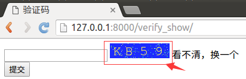

#### 验证

1）在booktest/views.py文件中，创建视图verify_yz。

```
def verify_yz(request):
    yzm=request.POST.get('yzm')
    verifycode=request.session['verifycode']
    response=HttpResponse('no')
    if yzm==verifycode:
        response=HttpResponse('ok')
    return response
```

2）打开booktest/urls.py文件，配置url。

```
    url(r'^verify_yz/$', views.verify_yz),
```

3）回到浏览器后刷新，在文本框中填写验证码，点击提交按钮。


4）浏览效果如下图：


## 反向解析

#### 先看看原来怎么做

1) 打开booktest/views.py文件，创建视图fan1、fan2。

```
def fan1(request):
    return render(request,'booktest/fan1.html')
def fan2(request):
    return HttpResponse('fan2')
```

2）打开booktest/urls.py文件，配置url。

```
    url(r'^fan1/$', views.fan1),
    url(r'^fan2/$', views.fan2),
```

3）在templates/booktest/目录下创建fan1.html。

```
<html>
<head>
    <title>反向解析</title>
</head>
<body>
普通链接：<a href="/fan2/">fan2</a>
</body>
</html>
```

4）运行服务器，在浏览器中输入如下网址：

```
http://127.0.0.1:8000/fan1/
```

浏览效果如下图：


5）点击链接后转向fan2，效果如下图：


6）打开booktest/urls.py文件，修改"fan2"的正则表达式为"fan_show"。

```
    url(r'^fan_show/$', views.fan2),
```

7）打开浏览器，后退一下，刷新后再次点击链接，浏览如下图：


问题就来了：随着功能的增加会出现更多的视图，可能之前配置的正则表达式不够准确，于是就要修改正则表达式，但是正则表达式一旦修改了，之前所有对应的超链接都要修改，真是一件麻烦的事情，而且可能还会漏掉一些超链接忘记修改，有办法让链接根据正则表达式动态生成吗？ 答：**反向解析**。

> 反向解析应用在两个地方：模板中的超链接，视图中的重定向。

#### 反向解析

要实现反向解析功能，需要如下步骤：

1）在test4/urls.py中为include定义namespace属性。

```
    url(r'^',include('booktest.urls',namespace='booktest')),
```

2）在booktest/urls.py中为url定义name属性，并修改为fan2。

```
    url(r'^fan2/$', views.fan2,name='fan2'),
```

3）在模板中使用url标签做超链接，此处为templates/booktest/fan1.html文件。

```
<html>
<head>
    <title>反向解析</title>
</head>
<body>
普通链接：<a href="/fan2/">fan2</a>
<hr>
反向解析：<a href="">fan2</a>
</body>
</html>
```

4）回到浏览器中，后退，刷新，查看源文件如下图，两个链接地址一样。


5）在booktest/urls.py中，将fan2修改为fan_show。

```
    url(r'^fan_show/$', views.fan2,name='fan2'),
```

6）回到浏览器中，刷新，查看源文件如下图，两个链接地址不一样。


7）反向解析也可以应用在视图的重定向中。

```
from django.shortcuts import redirect
from django.core.urlresolvers import reverse

return redirect(reverse('booktest:fan2'))
```

总结：在定义url时，需要为include定义namespace属性，为url定义name属性，使用时，在模板中使用url标签，在视图中使用reverse函数，根据正则表达式动态生成地址，减轻后期维护成本。

#### URL的参数

有些url配置项正则表达式中是有参数的，接下来讲解如何传递参数。

##### 情况一：位置参数

1）在booktest/urls.py中，修改fan2如下：

```
    url(r'^fan(\d+)_(\d+)/$', views.fan3,name='fan2'),
```

2）在booktest/views中，定义视图fan3如下:

```
def fan3(request, a, b):
    return HttpResponse(a+b)
```

3）修改templates/booktest/fan1.html文件如下：

```
<html>
<head>
    <title>反向解析</title>
</head>
<body>
普通链接：<a href="/fan2_3/">fan2</a>
<hr>
反向解析：<a href="">fan2</a>
</body>
</html>
```

4）回到浏览器中，刷新，查看源文件如下图：


使用重定向传递位置参数格式如下：

```
return redirect(reverse('booktest:fan2', args=(2,3)))
```

##### 情况二：关键字参数

1）在booktest/urls.py中，修改fan2如下：

```
    url(r'^fan(?P<id>\d+)_(?P<age>\d+)/$', views.fan4,name='fan2'),
```

2）在booktest/views中，定义视图fan4如下:

```
def fan4(request, id, age):
    return HttpResponse(id+age)
```

2）修改templates/booktest/fan1.html文件如下：

```
<html>
<head>
    <title>反向解析</title>
</head>
<body>
普通链接：<a href="/fan100_18/">fan2</a>
<hr>
反向解析：<a href="">fan2</a>
</body>
</html>
```

3）回到浏览器中，刷新，查看源文件如下图：

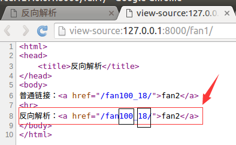

使用重定向传递关键字参数格式如下：

```
return redirect(reverse('booktest:fan2', kwargs={'id':100,'age':18}))
```


# 常用

## 静态文件

项目中的CSS、图片、js都是静态文件。一般会将静态文件放到一个单独的目录中，以方便管理。在html页面中调用时，也需要指定静态文件的路径，Django中提供了一种解析的方式配置静态文件路径。静态文件可以放在项目根目录下，也可以放在应用的目录下，由于有些静态文件在项目中是通用的，所以推荐放在项目的根目录下，方便管理。

#### 示例

1）在test5/settings.py文件中定义静态文件存放的物理目录。

```
STATIC_URL = '/static/'
STATICFILES_DIRS = [
    os.path.join(BASE_DIR, 'static'),
]
```

2）在项目根目录下创建static目录，再创建img、css、js目录。

3）在booktest/views.py中定义视图static_test。

```
def static_test(request):
    return render(request,'booktest/static_test.html')
```

4）在booktest/urls.py中配置url。

```
    url(r'^static_test/$',views.static_test),
```

5）在templates/booktest/下创建static_test.html文件。

```
<html>
<head>
    <title>静态文件</title>
</head>
<body>

</body>
</html>
```

6）保存图片到static/img/目录下，名称为sg.png。

7）运行服务器，浏览效果如下图：


#### 配置静态文件

Django提供了一种配置，可以在html页面中可以隐藏真实路径。

1）在test5/settings.py文件中修改STATIC_URL项。

```
# STATIC_URL = '/static/'
STATIC_URL = '/abc/'
```

2）刷新浏览器，图片找不到了，效果如下图：


3）修改templates/booktest/static_test.html如下：

```
<html>
<head>
    <title>静态文件</title>
</head>
<body>
修改前：
<hr>
修改后：
</body>
</html>
```

3）刷新浏览器，效果如下图：


4）查看网页源代码，发现可以网址和真实地址之间没有关系。


为了安全可以通过配置项隐藏真实图片路径，在模板中写成固定路径，后期维护太麻烦，可以使用static标签，根据配置项生成静态文件路径。

1）修改templates/booktest/static_test.html如下：

```
<html>
<head>
    <title>静态文件</title>
</head>
<body>
修改前：
<hr>
修改后：
<hr>
动态配置：


</body>
</html>
```

2）刷新浏览器，效果如下图：


查看网页源代码如下图：


说明：这种方案可以隐藏真实的静态文件路径，但是结合Nginx布署时，会将所有的静态文件都交给Nginx处理，而不用转到Django部分，所以这项配置就无效了。


## 中间件

Django中的中间件是一个轻量级、底层的插件系统，可以介入Django的请求和响应处理过程，修改Django的输入或输出。中间件的设计为开发者提供了一种无侵入式的开发方式，增强了Django框架的健壮性，其它的MVC框架也有这个功能，名称为IoC。


Django在中间件中预置了五个方法，这五个方法的区别在于不同的阶段执行，对输入或输出进行干预，方法如下：

1）初始化：无需任何参数，服务器响应第一个请求的时候调用一次，用于确定是否启用当前中间件。

```
def __init__(self):
    pass
```

2）处理请求前：在每个请求上，request对象产生之后，url匹配之前调用，返回None或HttpResponse对象。

```
def process_request(self, request):
    pass
```

3）处理视图前：在每个请求上，url匹配之后，视图函数调用之前调用，返回None或HttpResponse对象。

```
def process_view(self, request, view_func, *view_args, **view_kwargs):
    pass
```

4）处理响应后：视图函数调用之后，所有响应返回浏览器之前被调用，在每个请求上调用，返回HttpResponse对象。

```
def process_response(self, request, response):
    pass
```

5）异常处理：当视图抛出异常时调用，在每个请求上调用，返回一个HttpResponse对象。

```
def process_exception(self, request,exception):
    pass
```

#### 示例

中间件是一个独立的python类，，可以定义这五个方法中的一个或多个。

1）在booktest/目录下创建middleware.py文件，代码如下：

```
class my_mid:
    def __init__(self):
        print '--------------init'

    def process_request(self,request):
        print '--------------request'

    def process_view(self,request, view_func, *view_args, **view_kwargs):
        print '--------------view'

    def process_response(self,request, response):
        print '--------------response'
        return response
```

2）在test5/settings.py文件中，向MIDDLEWARE_CLASSES项中注册。


3）修改booktest/views.py中视图index。

```
def index(request):
    print '======index======'
    return render(request,'booktest/index.html')
```

4）运行服务器，命令行中效果如下图：


3）刷新页面，命令行中效果如下图：


#### 异常中间件

1）在booktest/middleware.py中定义两个异常类如下：

```
class exp1:
    def process_exception(self,request,exception):
        print '--------------exp1'
class exp2:
    def process_exception(self,request,exception):
        print '--------------exp2'
```

2）在test5/settings.py文件中，向MIDDLEWARE_CLASSES项中注册。


3）修改booktest/views.py中视图index。

```
def index(request):
    print '======index======'
    raise Exception('自定义异常')
    return render(request,'booktest/index.html')
```

总结：如果多个注册的中间件类中都有process_exception的方法，则先注册的后执行。


## Admin站点

### Admin站点

内容发布的部分由网站的管理员负责查看、添加、修改、删除数据，开发这些重复的功能是一件单调乏味、缺乏创造力的工作，为此，Django能够根据定义的模型类自动地生成管理模块。

在第一部分对管理站点做了简单介绍，现在做详细讲解。在Django项目中默认启用Admin管理站点。

1）准备工作：创建管理员的用户名和密码。

```
python manage.py createsuperuser
```

按提示填写用户名、邮箱、密码。


2）使用：在应用的admin.py中注册模型类

例：打开booktest/admin.py文件，注册地区模型。

```
from django.contrib import admin
from booktest.models import *

admin.site.register(AreaInfo)
```

3）输入如下网址：

```
http://127.0.0.1:8000/admin/
```

按提示填写用户名、密码，点击“Log in”按钮登录。


登录成功后，可以看到AreaInfos，可以进行增加、修改、删除、查询的管理。


列表页显示效果如下图：

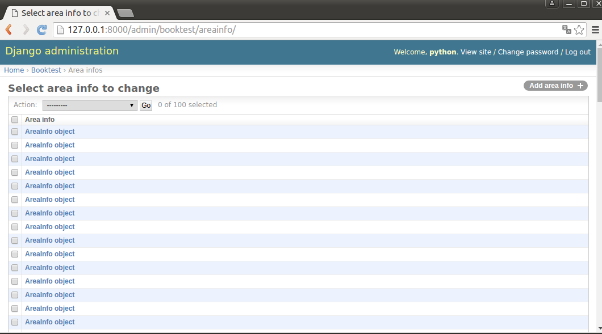

### 控制管理页展示

类ModelAdmin可以控制模型在Admin界面中的展示方式，主要包括在列表页的展示方式、添加修改页的展示方式。

1）在booktest/admin.py中，注册模型类前定义管理类AreaAdmin。

```
class AreaAdmin(admin.ModelAdmin):
    pass
```

管理类有两种使用方式：

- 注册参数
- 装饰器

注册参数：打开booktest/admin.py文件，注册模型类代码如下：

```
admin.site.register(AreaInfo,AreaAdmin)
```

装饰器：打开booktest/admin.py文件，在管理类上注册模型类，代码如下：

```
@admin.register(AreaInfo)
class AreaAdmin(admin.ModelAdmin):
    pass
```

接下来介绍如何控制列表页、增加修改页展示效果。

### 列表页选项

#### 页大小

每页中显示多少条数据，默认为每页显示100条数据，属性如下：

```
list_per_page=100
```

1）打开booktest/admin.py文件，修改AreaAdmin类如下：

```
class AreaAdmin(admin.ModelAdmin):
    list_per_page = 10
```

2）在浏览器中查看区域信息的列表页面，效果如下图：


#### "操作选项"的位置

顶部显示的属性，设置为True在顶部显示，设置为False不在顶部显示，默认为True。

```
actions_on_top=True
```

底部显示的属性，设置为True在底部显示，设置为False不在底部显示，默认为False。

```
actions_on_bottom=False
```

1）打开booktest/admin.py文件，修改AreaAdmin类如下：

```
class AreaAdmin(admin.ModelAdmin):
    ...
    actions_on_top = True
    actions_on_bottom = True
```

2）在浏览器中刷新效果如下图：


#### 列表中的列

属性如下：

```
list_display=[模型字段1,模型字段2,...]
```

1）打开booktest/admin.py文件，修改AreaAdmin类如下：

```
class AreaAdmin(admin.ModelAdmin):
    ...
    list_display = ['id','atitle']
```

2）在浏览器中刷新效果如下图：

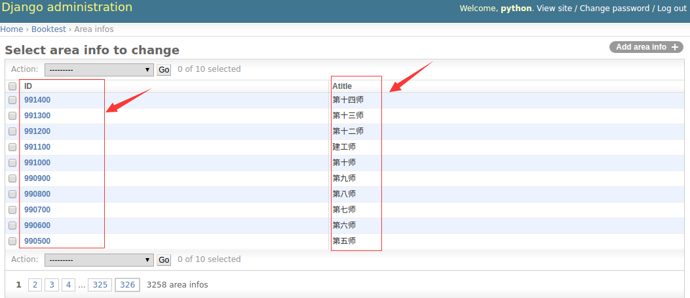

点击列头可以进行升序或降序排列。

###### 将方法作为列

列可以是模型字段，还可以是模型方法，要求方法有返回值。

1）打开booktest/models.py文件，修改AreaInfo类如下：

```
class AreaInfo(models.Model):
    ...
    def title(self):
        return self.atitle
```

2）打开booktest/admin.py文件，修改AreaAdmin类如下：

```
class AreaAdmin(admin.ModelAdmin):
    ...
    list_display = ['id','atitle','title']
```

3）在浏览器中刷新效果如下图：

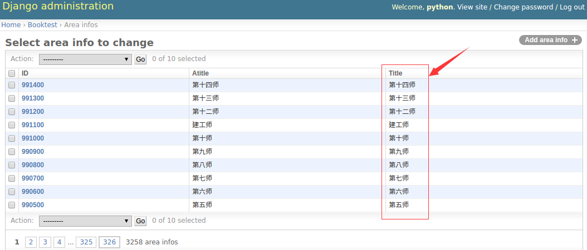

方法列是不能排序的，如果需要排序需要为方法指定排序依据。

```
admin_order_field=模型类字段
```

1）打开booktest/models.py文件，修改AreaInfo类如下：

```
class AreaInfo(models.Model):
    ...
    def title(self):
        return self.atitle
    title.admin_order_field='atitle'
```

2）在浏览器中刷新效果如下图：


###### 列标题

列标题默认为属性或方法的名称，可以通过属性设置。需要先将模型字段封装成方法，再对方法使用这个属性，模型字段不能直接使用这个属性。

```
short_description='列标题'
```

1）打开booktest/models.py文件，修改AreaInfo类如下：

```
class AreaInfo(models.Model):
    ...
    title.short_description='区域名称'
```

2）在浏览器中刷新效果如下图：

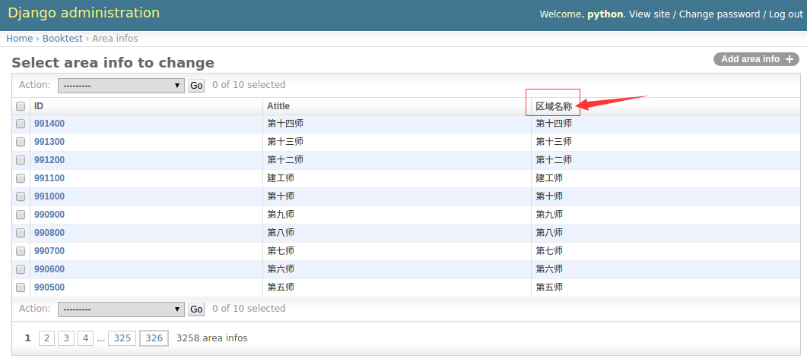

###### 关联对象

无法直接访问关联对象的属性或方法，可以在模型类中封装方法，访问关联对象的成员。

1）打开booktest/models.py文件，修改AreaInfo类如下：

```
class AreaInfo(models.Model):
    ...
    def parent(self):
        if self.aParent is None:
          return ''
        return self.aParent.atitle
    parent.short_description='父级区域名称'
```

2）打开booktest/admin.py文件，修改AreaAdmin类如下：

```
class AreaAdmin(admin.ModelAdmin):
    ...
    list_display = ['id','atitle','title','parent']
```

3）在浏览器中刷新效果如下图：


#### 右侧栏过滤器

属性如下，只能接收字段，会将对应字段的值列出来，用于快速过滤。一般用于有重复值的字段。

```
list_filter=[]
```

1）打开booktest/admin.py文件，修改AreaAdmin类如下：

```
class AreaAdmin(admin.ModelAdmin):
    ...
    list_filter=['atitle']
```

2）在浏览器中刷新效果如下图：


#### 搜索框

属性如下，用于对指定字段的值进行搜索，支持模糊查询。列表类型，表示在这些字段上进行搜索。

```
search_fields=[]
```

1）打开booktest/admin.py文件，修改AreaAdmin类如下：

```
class AreaAdmin(admin.ModelAdmin):
    ...
    search_fields=['atitle']
```

2）在浏览器中刷新效果如下图：


#### 中文标题

1）打开booktest/models.py文件，修改模型类，为属性指定verbose_name参数，即第一个参数。

```
class AreaInfo(models.Model):
    atitle=models.CharField('标题',max_length=30)#名称
    ...
```

2）在浏览器中刷新效果如下图：


### 编辑页选项

#### 显示字段顺序

属性如下：

```
fields=[]
```

1）点击某行ID的链接，可以转到修改页面，默认效果如下图：


2）打开booktest/admin.py文件，修改AreaAdmin类如下：

```
class AreaAdmin(admin.ModelAdmin):
    ...
    fields=['aParent','atitle']
```

3）刷新浏览器效果如下图：


在下拉列表中输出的是对象的名称，可以在模型类中定义str方法用于对象转换字符串。

1）打开booktest/models.py文件，修改AreaInfo类，添加str方法。

```
class AreaInfo(models.Model):
    ...
    def __str__(self):
        return self.atitle
```

2）刷新浏览器效果如下图：


#### 分组显示

属性如下：

```
fieldset=(
    ('组1标题',{'fields':('字段1','字段2')}),
    ('组2标题',{'fields':('字段3','字段4')}),
)
```

1）打开booktest/admin.py文件，修改AreaAdmin类如下：

```
class AreaAdmin(admin.ModelAdmin):
    ...
    # fields=['aParent','atitle']
    fieldsets = (
        ('基本', {'fields': ['atitle']}),
        ('高级', {'fields': ['aParent']})
    )
```

2）刷新浏览器效果如下图：

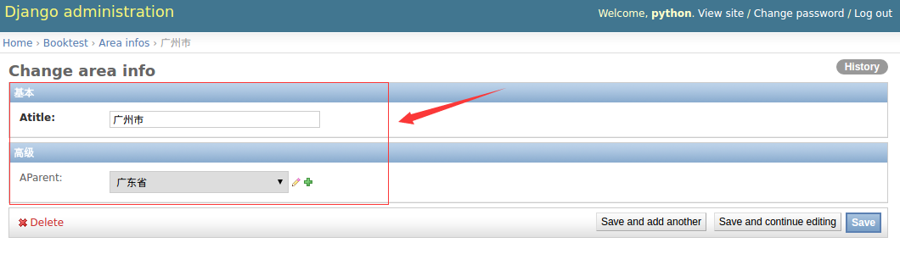

> 说明：fields与fieldsets两者选一使用。

#### 关联对象

在一对多的关系中，可以在一端的编辑页面中编辑多端的对象，嵌入多端对象的方式包括表格、块两种。 类型InlineModelAdmin：表示在模型的编辑页面嵌入关联模型的编辑。子类TabularInline：以表格的形式嵌入。子类StackedInline：以块的形式嵌入。

1）打开booktest/admin.py文件，创建AreaStackedInline类。

```
class AreaStackedInline(admin.StackedInline):
    model = AreaInfo#关联子对象
    extra = 2#额外编辑2个子对象
```

2）打开booktest/admin.py文件，修改AreaAdmin类如下：

```
class AreaAdmin(admin.ModelAdmin):
    ...
    inlines = [AreaStackedInline]
```

3）刷新浏览器效果如下图：


可以用表格的形式嵌入。

1）打开booktest/admin.py文件，创建AreaTabularInline类。

```
class AreaTabularInline(admin.TabularInline):
    model = AreaInfo#关联子对象
    extra = 2#额外编辑2个子对象
```

2）打开booktest/admin.py文件，修改AreaAdmin类如下：

```
class AreaAdmin(admin.ModelAdmin):
    ...
    inlines = [AreaTabularInline]
```

3）刷新浏览器效果如下图：

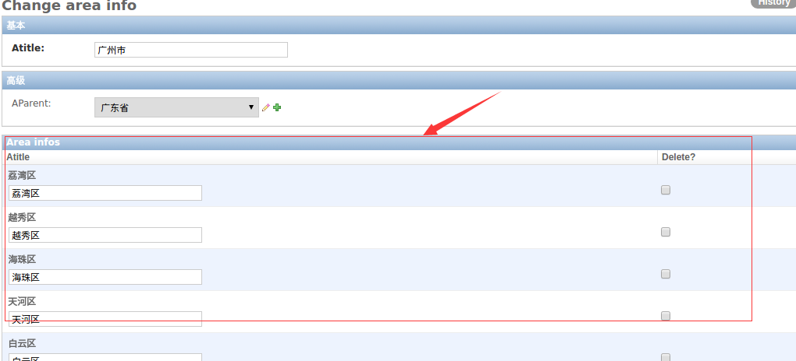


### 重写模板

1）在templates/目录下创建admin目录，结构如下图：


2）打开当前虚拟环境中Django的目录，再向下找到admin的模板，目录如下：

```
/home/python/.virtualenvs/py_django/lib/python3.5/site-packages/django/contrib/admin/templates/admin
```

3）将需要更改文件拷贝到第一步建好的目录里，此处以base_site.html为例。


编辑base_site.html文件：

```


{{ title }} | {{ site_title|default:_('Django site admin') }}


<h1 id="site-name"><a href="">{{ site_header|default:_('Django administration') }}</a></h1>
<hr>
<h1>自定义的管理页模板</h1>
<hr>



```

4）在浏览器中转到列表页面，刷新后如下图：

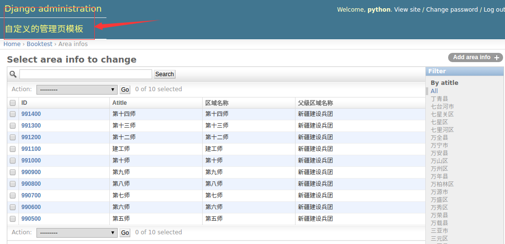

其它后台的模板可以按照相同的方式进行修改。


## 上传图片

在python中进行图片操作，需要安装包PIL。

```
pip install Pillow==3.4.1
```

在Django中上传图片包括两种方式：

- 在管理页面admin中上传图片
- 自定义form表单中上传图片

上传图片后，将图片存储在服务器上，然后将图片的路径存储在表中。

### 创建包含图片的模型类

将模型类的属性定义成models.ImageField类型。

1）打开booktest/models.py文件，定义模型类PicTest。

```
class PicTest(models.Model):
    pic = models.ImageField(upload_to='booktest/')
```

2）回到命令行中，生成迁移。

```
python manage.py makemigrations
```

3）打开booktest/migrations/0001_initial.py文件，删除AreaInfo部分，因为这个表已经存在。


4）回到命令行中，执行迁移。

```
python manage.py migrate
```

5）因为当前没有定义图书、英雄模型类，会提示“是否删除”，输入“no”后回车，表示不删除。

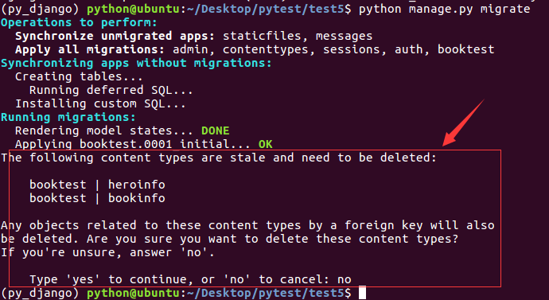

6）打开test5/settings.py文件，设置图片保存路径。

因为图片也属于静态文件，所以保存到static目录下。

```
MEDIA_ROOT=os.path.join(BASE_DIR,"static/media")
```

7）在static目录下创建media目录，再创建应用名称的目录，此例为booktest。


### 在管理页面admin中上传图片

1）打开booktest/admin.py文件，注册PicTest。

```
from django.contrib import admin
from booktest.models import *

admin.site.register(PicTest)
```

2）运行服务器，输入如下网址。

```
http://127.0.0.1:8000/admin/
```


3）点击“Add”添加数据，打开新页面。


4）选择图片，点击“save”按钮完成图片上传。 5）回到数据库命令行，查询表pictest中的数据如下图：


6）图片被保存到目录static/media/booktest/下，如下图：


### 自定义form表单中上传图片

1）打开booktest/views.py文件，创建视图pic_upload。

```
def pic_upload(request):
    return render(request,'booktest/pic_upload.html')
```

2）打开booktest/urls.py文件，配置url。

```
    url(r'^pic_upload/$', views.pic_upload),
```

3）在templates/booktest/目录下创建模板pic_upload.html。

在模板中定义上传表单，要求如下：

- form的属性enctype="multipart/form-data"
- form的method为post
- input的类型为file

```
<html>
<head>
    <title>自定义上传图片</title>
</head>
<body>
    <form method="post" action="/pic_handle/" enctype="multipart/form-data">
        
        <input type="file" name="pic"/><br>
        <input type="submit" value="上传">
    </form>
</body>
</html>
```

4）打开booktest/views.py文件，创建视图pic_handle，用于接收表单保存图片。

request对象的FILES属性用于接收请求的文件，包括图片。

```
from django.conf import settings
from django.http import HttpResponse
...
def pic_handle(request):
    f1=request.FILES.get('pic')
    fname='%s/booktest/%s'%(settings.MEDIA_ROOT,f1.name)
    with open(fname,'wb') as pic:
        for c in f1.chunks():
            pic.write(c)
    return HttpResponse('OK')
```

在django中，上传文件不大于2.5M,文件放在内存中。上传文件大于2.5M,文件内容写到一个临时文件中。

Django处理上传文件的两个类：

```
FILE_UPLOAD_HANDLERS= ("django.core.files.uploadhandler.MemoryFileUploadHandler",

 "django.core.files.uploadhandler.TemporaryFileUploadHandler")
```


5）打开booktest/urls.py文件，配置url。

```
    url(r'^pic_handle/$', views.pic_handle),
```

6）运行服务器，在浏览器中输入如下网址：

```
http://127.0.0.1:8000/pic_upload/
```


选择文件后点击按钮上传图片。

7）图片上传目录如下图：


这里只是完成图片上传的代码，如果需要保存数据到表中需要创建PicTest对象完成保存。


## 分页

Django提供了数据分页的类，这些类被定义在django/core/paginator.py中。 类Paginator用于对列进行一页n条数据的分页运算。类Page用于表示第m页的数据。

#### Paginator类实例对象

- 方法_*init_*(列表,int)：返回分页对象，第一个参数为列表数据，第二个参数为每页数据的条数。
- 属性count：返回对象总数。
- 属性num_pages：返回页面总数。
- 属性page_range：返回页码列表，从1开始，例如[1, 2, 3, 4]。
- 方法page(m)：返回Page类实例对象，表示第m页的数据，下标以1开始。
- 方法get_page(m): 放回Page实例，表示第m页的数据，下标以1开始。

```
Returns a Page object with the given 1-based index, while also handling out of range and invalid page numbers.

If the page isn't a number, it returns the first page. If the page number is negative or greater than the number of pages, it returns the last page.

It raises an exception (EmptyPage) only if you specify Paginator(..., allow_empty_first_page=False) and the object_list is empty.
```


#### Page类实例对象

- 调用Paginator对象的page()方法返回Page对象，不需要手动构造。
- 属性object_list：返回当前页对象的列表。
- 属性number：返回当前是第几页，从1开始。
- 属性paginator：当前页对应的Paginator对象。
- 方法has_next()：如果有下一页返回True。
- 方法has_previous()：如果有上一页返回True。
- 方法len()：返回当前页面对象的个数。

#### 示例

1）在booktest/views.py文件中创建视图page_test。

```
from django.core.paginator import Paginator
from booktest.models import AreaInfo
...
#参数pIndex表示：当前要显示的页码
def page_test(request,pIndex):
    #查询所有的地区信息
    list1 = AreaInfo.objects.filter(aParent__isnull=True)
    #将地区信息按一页10条进行分页
    p = Paginator(list1, 10)
    #如果当前没有传递页码信息，则认为是第一页，这样写是为了请求第一页时可以不写页码
    if pIndex == '':
        pIndex = '1'
    #通过url匹配的参数都是字符串类型，转换成int类型
    pIndex = int(pIndex)
    #获取第pIndex页的数据
    list2 = p.page(pIndex)
    #获取所有的页码信息
    plist = p.page_range
    #将当前页码、当前页的数据、页码信息传递到模板中
    return render(request, 'booktest/page_test.html', {'list': list2, 'plist': plist, 'pIndex': pIndex})
```

2）在booktest/urls.py文件中配置url。

```
    url(r'^page(?P<pIndex>[0-9]*)/$', views.page_test),
```

3）在templates/booktest/目录下创建page_test.html模板文件。

```
<html>
<head>
    <title>分页</title>
</head>
<body>
显示当前页的地区信息：<br>
<ul>

<li>{{area.id}}--{{area.atitle}}</li>

</ul>
<hr>
显示页码信息：当前页码没有链接，其它页码有链接<br>

    
        {{pindex}}&nbsp;&nbsp;
    
        <a href="/page{{pindex}}/">{{pindex}}</a>&nbsp;&nbsp;
    

</body>
</html>
```

4）运行服务器，在浏览器中输入如下网址：

```
http://127.0.0.1:8000/page/
```


5）点击页码数字，效果如下图：


## 登入判断装饰器

方法一：使用`login_required`装饰器


方法二：使用`loginRequireMixin`

创建LoginRequiredMixin 类：

```python
from django.contrib.auth.decorators import login_required

class LoginRequiredMixin(object):
    @classmethod
    def as_view(cls, **initkwargs):
		# 调用父类的as_view
        view = super(LoginRequiredMixin, cls).as_view(**initkwargs)
        return login_required(view)
```

视图中使用多继承，并将`LoginRequiredMixin`放在`View`之前

```python
# /user
class UserInfoView(LoginRequiredMixin, View):
    """用户中心-信息页"""

    def get(self, request):
        """显示"""
        return render(request, 'user_center_info.html', {'page': 'user'})
```


