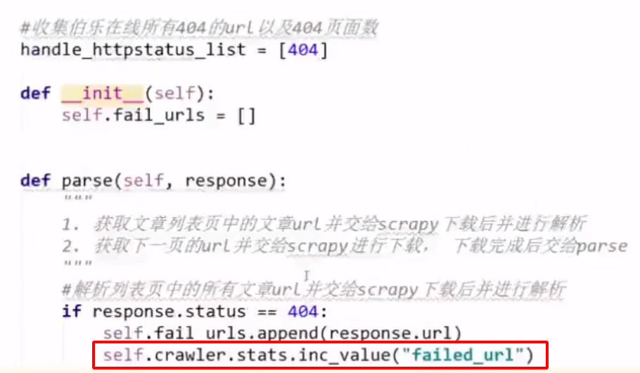
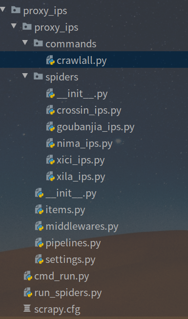
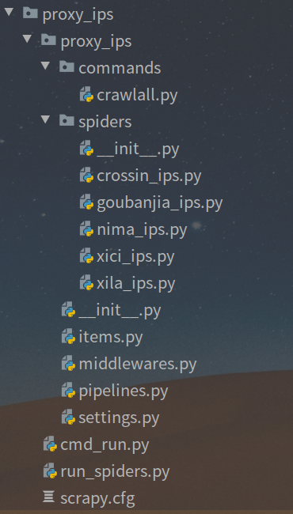

# 1. 命令行工具

#### 创建项目

​		**requires project**: no

​		**command line**: scrapy startproject *myproject_name* *[project_dir]*

项目目录结构

```
tutorial/
    scrapy.cfg            # deploy configuration file

    tutorial/             # project's Python module, you'll import your code from here
        __init__.py

        items.py          # project items definition file

        middlewares.py    # project middlewares file

        pipelines.py      # project pipelines file

        settings.py       # project settings file

        spiders/          # a directory where you'll later put your spiders
            __init__.py
```


#### scrapy.cfg项目配置文件

- /etc/scrapy.cfg
- ~/.config/scrapy.cfg
- scrapy.cfg

按照上述文件scrapy.py进行继承覆盖配置属性

##### genspider 创建爬虫

​		**syntax**: scrapy genspider [-t template <name> <domain>]

​		**requires project**: no		

> 在当前文件路径或者当前项目的spiders文件下创建一个新的spider(爬虫)，<name> 参数为spider's 名字，<domain> 用于生成 `allowed_domains` 和 `start_urls`爬虫属性。

```shell
$ scrapy genspider -l
Available templates:
  basic
  crawl
  csvfeed
  xmlfeed

$ scrapy genspider example example.com
Created spider 'example' using template 'basic'

$ scrapy genspider -t crawl scrapyorg scrapy.org
Created spider 'scrapyorg' using template 'crawl'
```

> 注意：这不是唯一创建爬虫的方式，你也可以自己创建爬虫源码在spiders目录下


#### crawl 开启爬虫抓取

​		**Syntax**: `scrapy crawl <spider>`

​		**requires project**: yes


#### 快速导出数据至文件

爬虫代码：

```python
import scrapy


class QuotesSpider(scrapy.Spider):
    name = "quotes"
    start_urls = [
        'http://quotes.toscrape.com/page/1/',
        'http://quotes.toscrape.com/page/2/',
    ]

    def parse(self, response):
        for quote in response.css('div.quote'):
            yield {
                'text': quote.css('span.text::text').get(),
                'author': quote.css('small.author::text').get(),
                'tags': quote.css('div.tags a.tag::text').getall(),
            }
```


##### 导出到json文件

```shell
scrapy crawl quotes -o quotes.json
```

> 注意：scrapy 默认是追加到文件末尾，所以执行多次导出到通一个文件会破坏Json文件格式；如果需要多次导出到同一个文件，建议使用Json Lines格式。

导出到Json Lines

```shell
scrapy crawl quotes -o quotes.jl
```


#### check 运行爬虫项目检查（run contract checks)

​		**Syntax**: `scrapy check [-l]  <spider>`

​		**requires project**: yes


# 2. spider.py

**spider可以使用命令行工具在项目目录创建(`scrapy genspider <spider_name> <domain>`), 也可以手动创建**


## 1. 定义初始化爬取 的 url

两种方式

### 1. 定义 start_urls 类参数, 类型为 list

```python
import scrapy


class QuotesSpider(scrapy.Spider):
    name = "quotes"
    start_urls = [
        'http://quotes.toscrape.com/page/1/',
        'http://quotes.toscrape.com/page/2/',
    ]

    def parse(self, response):
        page = response.url.split("/")[-2]
        filename = 'quotes-%s.html' % page
        with open(filename, 'wb') as f:
            f.write(response.body)
```


### 2. 定义 start_requests 方法

```python
import scrapy


class QuotesSpider(scrapy.Spider):
    name = "quotes"

    def start_requests(self):
        urls = [
            'http://quotes.toscrape.com/page/1/',
            'http://quotes.toscrape.com/page/2/',
        ]
        for url in urls:
            yield scrapy.Request(url=url, callback=self.parse)

    def parse(self, response):
        page = response.url.split("/")[-2]
        filename = 'quotes-%s.html' % page
        with open(filename, 'wb') as f:
            f.write(response.body)
        self.log('Saved file %s' % filename)
```


## 2. 解析

**如果使用 start_urls 来初始化爬虫 url, 则必须实现 parse 方法作为初始化url 的网页解析方法**

**默认含有一个response参数, 其为爬取的结果**

```python
import scrapy


class QuotesSpider(scrapy.Spider):
    name = "quotes"

    def start_requests(self):
        urls = [
            'http://quotes.toscrape.com/page/1/',
            'http://quotes.toscrape.com/page/2/',
        ]
        for url in urls:
            yield scrapy.Request(url=url, callback=self.parse)

    def parse(self, response):
        page = response.url.split("/")[-2]
        filename = 'quotes-%s.html' % page
        with open(filename, 'wb') as f:
            f.write(response.body)
        self.log('Saved file %s' % filename)
```

如果你使用 start_requests 初始化请求,则可以自定义其解析方法


### 1. 提取数据

#### 1. xpath 选择器

```
>>> response.css('title').getall()
['<title>Quotes to Scrape</title>']
```


#### 2. css选择器

```
>>> response.css('title')
[<Selector xpath='descendant-or-self::title' data='<title>Quotes to Scrape</title>'>]
```


#### 3. 文本提起

##### 1. get()

使用 `.get()` 直接在A上 `SelectorList` 实例避免了 `IndexError` 回报 `None` 当它找不到任何与所选内容匹配的元素时。

```
>>> response.css('title::text')[0].get()
'Quotes to Scrape'
```


##### 2. getall() 

``.getall（）``的结果是一个列表：选择器可能返回多个结果，所以我们将它们全部提取出来。


##### 3. re()

正则表达式提取

```
>>> response.css('title::text').re(r'Quotes.*')
['Quotes to Scrape']
>>> response.css('title::text').re(r'Q\w+')
['Quotes']
>>> response.css('title::text').re(r'(\w+) to (\w+)')
['Quotes', 'Scrape']
```


### 2. 数据返回

#### 1. Item -- 解析后的数据

##### 1. 字典数据

```python
import scrapy


class QuotesSpider(scrapy.Spider):
    name = "quotes"
    start_urls = [
        'http://quotes.toscrape.com/page/1/',
        'http://quotes.toscrape.com/page/2/',
    ]

    def parse(self, response):
        for quote in response.css('div.quote'):
            yield {
                'text': quote.css('span.text::text').get(),
                'author': quote.css('small.author::text').get(),
                'tags': quote.css('div.tags a.tag::text').getall(),
            }
```


#####  2. Scrapy.Item

继承了 scrapy.Item 的对象, 可以在items.py 创建自己的数据结构

```python
# -*- coding: utf-8 -*-
import scrapy
from ..items import IpItem


class XiciIpsSpider(scrapy.Spider):
    name = 'xici_ips'
    allowed_domains = ['www.xicidaili.com']
    start_urls = ['http://www.xicidaili.com/nn']

    def parse(self, response):
        ip_table = response.xpath("//table[@id='ip_list']/tr[@class]")
        for row in ip_table:
            #########
            item = IpItem()
            item['ip'] = row.xpath("//td[2]/text()")
            item['port'] = row.xpath("//td[3]/text()").get()
            item['ip_addr'] = row.xpath("//td[4]/a/text()").get()
            item['proxy_type'] = row.xpath("//td[6]/text()").get()
            item['survival_time'] = row.xpath("//td[9]/text()").get()
            item['check_time'] = row.xpath("//td[10]/text()").get()
            yield item
			#########
        next_page = ip_table.xpath("//div[@class='pagination']/a[@class='next_page']/@href").get()
        if next_page:
            yield response.follow(next_page, callback=self.parse)

```


#### 2. Request -- 新的请求

两种方式

##### 1. 直接生成

如果获取的url是完整的(域名,路径等都包含), 可以使用此方式

```python
# -*- coding: utf-8 -*-
import scrapy
from ..items import IpItem


class XiciIpsSpider(scrapy.Spider):
    name = 'xici_ips'
    allowed_domains = ['www.xicidaili.com']
    start_urls = ['http://www.xicidaili.com/nn']

    def parse(self, response):
        ip_table = response.xpath("//table[@id='ip_list']/tr[@class]")
        for row in ip_table:
            #########
            item = IpItem()
            item['ip'] = row.xpath("//td[2]/text()")
            item['port'] = row.xpath("//td[3]/text()").get()
            item['ip_addr'] = row.xpath("//td[4]/a/text()").get()
            item['proxy_type'] = row.xpath("//td[6]/text()").get()
            item['survival_time'] = row.xpath("//td[9]/text()").get()
            item['check_time'] = row.xpath("//td[10]/text()").get()
            yield item
			#########
        next_page = ip_table.xpath("//div[@class='pagination']/a[@class='next_page']/@href").get()
        if next_page:
            yield scrapy.Request(next_page, callback=self.parse)

```


##### 2.  通过 scrapy.Response 生成 (推荐)

这种方式如果新的request爬取的域名依然是当前的域名,可以省略域名,直接使用路径

当然,也可以使用完整的url

```python
# -*- coding: utf-8 -*-
import scrapy
from ..items import IpItem


class XiciIpsSpider(scrapy.Spider):
    name = 'xici_ips'
    allowed_domains = ['www.xicidaili.com']
    start_urls = ['http://www.xicidaili.com/nn']

    def parse(self, response):
        ip_table = response.xpath("//table[@id='ip_list']/tr[@class]")
        for row in ip_table:
            item = IpItem()
            item['ip'] = row.xpath("//td[2]/text()")
            item['port'] = row.xpath("//td[3]/text()").get()
            item['ip_addr'] = row.xpath("//td[4]/a/text()").get()
            item['proxy_type'] = row.xpath("//td[6]/text()").get()
            item['survival_time'] = row.xpath("//td[9]/text()").get()
            item['check_time'] = row.xpath("//td[10]/text()").get()
            yield item

        next_page = ip_table.xpath("//div[@class='pagination']/a[@class='next_page']/@href").get()
        if next_page:
            yield response.follow(next_page, callback=self.parse)

```


将选择器传递给 `response.follow` 而不是字符串；此选择器应提取必要的属性：

```
for href in response.css('li.next a::attr(href)'):
    yield response.follow(href, callback=self.parse)
```

> `response.follow(response.css('li.next a'))` 无效，因为 `response.css` 返回一个类似列表的对象，其中包含所有结果的选择器，而不是单个选择器。一 `for` 像上面例子中那样循环，或者 `response.follow(response.css('li.next a')[0])` 很好。


#### 3. None

不返回任何值


#### 4.  添加自定义数据到Request, 并在Response中使用

在Request中插入数据item

```
yield scrapy.Request(item['url'], callback=self.parse, headers=headers,meta={'item':item})
```

在callback方法response中调用item

```
response.meta['item']
```


# pipelines.py

在一个项目被蜘蛛抓取之后，它被发送到项目管道，该管道通过几个按顺序执行的组件来处理它。

每个项管道组件（有时称为“项管道”）都是一个实现简单方法的Python类。它们接收一个项目并对其执行操作，还决定该项目是否应继续通过管道，或者是否应删除并不再处理。

项目管道的典型用途有：

- 清理HTML数据
- 验证抓取的数据（检查项目是否包含某些字段）
- 检查重复项（并删除它们）
- 将爬取的项目存储在数据库中

### 编写自己的项目管道

每个item pipeline组件都是一个python类，必须实现以下方法：

-  `process_item`(*self*, *item*, *spider*)

  对每个项管道组件调用此方法。 [`process_item()`](https://www.osgeo.cn/scrapy/topics/item-pipeline.html#process_item) 必须：返回包含数据的dict，返回 [`Item`](https://www.osgeo.cn/scrapy/topics/items.html#scrapy.item.Item) （或任何后代类）对象，返回 [Twisted Deferred](https://twistedmatrix.com/documents/current/core/howto/defer.html) 或提高 [`DropItem`](https://www.osgeo.cn/scrapy/topics/exceptions.html#scrapy.exceptions.DropItem) 例外。删除的项不再由其他管道组件处理。   参数: **item** ([`Item`](https://www.osgeo.cn/scrapy/topics/items.html#scrapy.item.Item) object or a dict) -- 项目被爬取了 **spider** ([`Spider`](https://www.osgeo.cn/scrapy/topics/spiders.html#scrapy.spiders.Spider) object) -- 爬取项目的蜘蛛   

此外，它们还可以实现以下方法：

-  `open_spider`(*self*, *spider*)

  当spider打开时调用此方法。   参数:**spider** ([`Spider`](https://www.osgeo.cn/scrapy/topics/spiders.html#scrapy.spiders.Spider) object) -- 打开的蜘蛛  

-  `close_spider`(*self*, *spider*)

  当spider关闭时调用此方法。   参数:**spider** ([`Spider`](https://www.osgeo.cn/scrapy/topics/spiders.html#scrapy.spiders.Spider) object) -- 关闭的蜘蛛  

-  `from_crawler`(*cls*, *crawler*)

  如果存在，则调用此ClassMethod从 [`Crawler`](https://www.osgeo.cn/scrapy/topics/api.html#scrapy.crawler.Crawler) . 它必须返回管道的新实例。爬虫对象提供对所有零碎核心组件（如设置和信号）的访问；它是管道访问它们并将其功能连接到零碎的一种方式。   参数:**crawler** ([`Crawler`](https://www.osgeo.cn/scrapy/topics/api.html#scrapy.crawler.Crawler) object) -- 使用此管道的爬虫程序  

### 项目管道示例

#### 无价格的价格验证和删除项目

让我们看看下面的假设管道，它调整了 `price` 不包括增值税的项目的属性 (`price_excludes_vat` 属性），并删除不包含价格的项目：

```
from scrapy.exceptions import DropItem

class PricePipeline(object):

    vat_factor = 1.15

    def process_item(self, item, spider):
        if item.get('price'):
            if item.get('price_excludes_vat'):
                item['price'] = item['price'] * self.vat_factor
            return item
        else:
            raise DropItem("Missing price in %s" % item)
```

#### 将项目写入JSON文件

下面的管道将所有爬取的项目（从所有蜘蛛）存储到一个单独的管道中 `items.jl` 文件，每行包含一个以JSON格式序列化的项：

```
import json

class JsonWriterPipeline(object):

    def open_spider(self, spider):
        self.file = open('items.jl', 'w')

    def close_spider(self, spider):
        self.file.close()

    def process_item(self, item, spider):
        line = json.dumps(dict(item)) + "\n"
        self.file.write(line)
        return item
```

注解

jsonWriterPipeline的目的只是介绍如何编写项管道。如果您真的想将所有的爬取项存储到JSON文件中，那么应该使用 [Feed exports](https://www.osgeo.cn/scrapy/topics/feed-exports.html#topics-feed-exports) .

#### 将项目写入MongoDB

在这个示例中，我们将向 [MongoDB](https://www.mongodb.org/) 使用 [pymongo](https://api.mongodb.org/python/current/). 在Scrapy设置中指定MongoDB地址和数据库名称；MongoDB集合以item类命名。

这个例子的要点是演示如何使用 [`from_crawler()`](https://www.osgeo.cn/scrapy/topics/item-pipeline.html#from_crawler) 方法和如何正确清理资源。：：

```
import pymongo

class MongoPipeline(object):

    collection_name = 'scrapy_items'

    def __init__(self, mongo_uri, mongo_db):
        self.mongo_uri = mongo_uri
        self.mongo_db = mongo_db

    @classmethod
    def from_crawler(cls, crawler):
        return cls(
            mongo_uri=crawler.settings.get('MONGO_URI'),
            mongo_db=crawler.settings.get('MONGO_DATABASE', 'items')
        )

    def open_spider(self, spider):
        self.client = pymongo.MongoClient(self.mongo_uri)
        self.db = self.client[self.mongo_db]

    def close_spider(self, spider):
        self.client.close()

    def process_item(self, item, spider):
        self.db[self.collection_name].insert_one(dict(item))
        return item
```

#### 项目截图

这个例子演示了如何返回 [Deferred](https://twistedmatrix.com/documents/current/core/howto/defer.html) 从 [`process_item()`](https://www.osgeo.cn/scrapy/topics/item-pipeline.html#process_item) 方法。它使用 [Splash](https://splash.readthedocs.io/en/stable/) 呈现项目URL的屏幕截图。管道向本地运行的实例发出请求 [Splash](https://splash.readthedocs.io/en/stable/). 在下载请求并触发延迟回调之后，它将项目保存到文件中，并将文件名添加到项目中。

```
import scrapy
import hashlib
from urllib.parse import quote


class ScreenshotPipeline(object):
    """Pipeline that uses Splash to render screenshot of
    every Scrapy item."""

    SPLASH_URL = "http://localhost:8050/render.png?url={}"

    def process_item(self, item, spider):
        encoded_item_url = quote(item["url"])
        screenshot_url = self.SPLASH_URL.format(encoded_item_url)
        request = scrapy.Request(screenshot_url)
        dfd = spider.crawler.engine.download(request, spider)
        dfd.addBoth(self.return_item, item)
        return dfd

    def return_item(self, response, item):
        if response.status != 200:
            # Error happened, return item.
            return item

        # Save screenshot to file, filename will be hash of url.
        url = item["url"]
        url_hash = hashlib.md5(url.encode("utf8")).hexdigest()
        filename = "{}.png".format(url_hash)
        with open(filename, "wb") as f:
            f.write(response.body)

        # Store filename in item.
        item["screenshot_filename"] = filename
        return item
```

#### 重复筛选器

查找重复项并删除已处理的项的筛选器。假设我们的项目有一个唯一的ID，但是我们的spider返回具有相同ID的多个项目：

```
from scrapy.exceptions import DropItem

class DuplicatesPipeline(object):

    def __init__(self):
        self.ids_seen = set()

    def process_item(self, item, spider):
        if item['id'] in self.ids_seen:
            raise DropItem("Duplicate item found: %s" % item)
        else:
            self.ids_seen.add(item['id'])
            return item
```

### 激活项目管道组件

若要激活项管道组件，必须将其类添加到 [`ITEM_PIPELINES`](https://www.osgeo.cn/scrapy/topics/settings.html#std:setting-ITEM_PIPELINES) 设置，如以下示例中所示：

```
ITEM_PIPELINES = {
    'myproject.pipelines.PricePipeline': 300,
    'myproject.pipelines.JsonWriterPipeline': 800,
}
```

在此设置中分配给类的整数值决定了它们的运行顺序：项从低值类传递到高值类。习惯上把这些数字定义在0-1000范围内。


# middlewares.py

## 关于下载中间的返回值

`Request`: 返回的是一个request, 将会处理新的request,而原来的request将会丢弃

`Response`: 返回的是一个response, 该中间件后面的下载中间件和下载器将不会处理,而将response返回给引擎

`None`: 和往常一样,继续往后处理当前`Request`

`其他值`: 抛异常


### 下面将代理运用到scrapy框架中:

###### 在scrapy框架中有两种方法进行

1.直接编写在scrapy爬虫代码中
 2.利用中间件middlewares.py进行
 现在我将详细讲述下这两种分别如何进行

首先我们需要有一个可用的ip
 对于方法一:利用meta函数进行携带即可访问
 scrapy爬虫代码中:

```python
import scrapy

class ProxySpider(scrapy.Spider):
    name = 'proxy'
    allowed_domains = ["httpbin.org"]

    def start_requests(self):
        url = 'http://httpbin.org/get'
        proxy = '127.0.0.0:8000'

        proxies = ""
        if url.startswith("http://"):
            proxies = "http://"+str(proxy)
        elif url.startswith("https://"):
            proxies = "https://"+str(proxy)
        #注意这里面的meta={'proxy':proxies},一定要是proxy进行携带,其它的不行,后面的proxies一定 要是字符串,其它任何形式都不行
        yield scrapy.Request(url, callback=self.parse,meta={'proxy':proxies})

    def parse(self,response):
        print(response.text)
```

对于方法二:利用middlewares中间件进行
 1.在middlewares.py问件中添加如下代码即可:

```python
#配置代理
class ProxyMiddleware(object):
    def process_request(self,request,spider):
        if request.url.startswith("http://"):
            request.meta['proxy']="http://"+'127.0.0.0:8000'          # http代理
        elif request.url.startswith("https://"):
            request.meta['proxy']="https://"+'127.0.0.0:8000'         # https代理
```

2.在settings.py文件中添加配置

```bash
# Enable or disable downloader middlewares
# See https://doc.scrapy.org/en/latest/topics/downloader-middleware.html
DOWNLOADER_MIDDLEWARES = {
   #这个biquge为你项目的名字,我是爬笔趣阁的,2333~
   'biquge.middlewares.ProxyMiddleware': 100,  
}
```

3.scrapy爬虫代码中正常编写代码,不用做任何修改/添加

```python
import scrapy

class ProxySpider(scrapy.Spider):
    name = 'proxy'
    allowed_domains = ["httpbin.org"]
    # start_urls = ['http://httpbin.org/get']

    def start_requests(self):
        url = 'http://httpbin.org/get'
        yield scrapy.Request(url, callback=self.parse)

    def parse(self,response):
        print(response.text)
```


# scrapy 信号机制

案例:设置spider 关闭信号

```python
    def __init__(self):
        super(GoubanjiaIpsSpider, self).__init__()
        self.browser = webdriver.Chrome(executable_path='/home/smilejack/selenium_driver/chromedriver')
        # 设置一个spider关闭信号收到后,关闭selenium
        signalmanager.dispatcher.connect(self.spider_closed, signal=signals.spider_closed)

    def spider_closed(self, spider):
        """
        关闭selenium browser
        """
        self.browser.quit()
```


# scrapy 暂停与继续运行

### 作业目录

要启用持久性支持，您只需要通过该设置定义*作业目录*`JOBDIR`。该目录将用于存储所有必需的数据，以保持单个作业的状态（即蜘蛛运行）。重要的是要注意，此目录不得由不同的Spider共享，甚至不能由同一Spider的不同作业/运行共享，因为该目录用于存储*单个*作业的状态。

### 如何使用它

要启动启用了持久性支持的蜘蛛，请按以下方式运行它：

```
scrapy crawl somespider -s JOBDIR=crawls/somespider-1
```

然后，您可以随时安全地停止蜘蛛（通过按Ctrl-C或发送信号），并在以后通过发出相同的命令来恢复蜘蛛：

```
scrapy crawl somespider -s JOBDIR=crawls/somespider-1
```

### 持久性陷阱

如果您希望能够使用Scrapy持久性支持，请牢记以下几点：

#### Cookies过期

Cookies可能会过期。因此，如果您不快速恢复蜘蛛，计划的请求可能不再起作用。如果您的蜘蛛不依赖Cookie，这将不是问题。

#### 请求序列

`pickle`为了使持久性起作用，请求必须由模块可序列化，因此您应确保请求可序列化。

这里最常见的问题是`lambda`在无法保留的请求回调上使用函数。


# Scrapy 自定义命令行工具

您也可以使用该[`COMMANDS_MODULE`](https://docs.scrapy.org/en/latest/topics/commands.html#std:setting-COMMANDS_MODULE)设置添加自定义项目命令 。有关如何实现[命令](https://github.com/scrapy/scrapy/tree/master/scrapy/commands)的示例，请参见[scrapy /](https://github.com/scrapy/scrapy/tree/master/scrapy/commands) commands中的 [Scrapy](https://github.com/scrapy/scrapy/tree/master/scrapy/commands)命令。

```python
from scrapy.commands import ScrapyCommand


class Command(ScrapyCommand):
    # 是否需要项目
    requires_project = True
	
    # 语法
    def syntax(self):
        return '[options]'
	
    # 命令帮助描述
    def short_desc(self):
        return 'Runs all of the spiders'
	
    # 执行
    def run(self, args, opts):
        spider_list = self.crawler_process.spiders.list()
        for name in spider_list:
            self.crawler_process.crawl(name, **opts.__dict__)
        self.crawler_process.start()
```

**两种方法使自定义命令生效**

### 1. COMMANDS_MODULE 

默认值：（`''`空字符串）

用于查找自定义Scrapy命令的模块。这用于为Scrapy项目添加自定义命令。

例：

```
COMMANDS_MODULE = 'mybot.commands'
```

### 2. 通过setup.py入口点注册命令

>  注意: 这是一项实验性功能，请谨慎使用。

您还可以通过`scrapy.commands`在库`setup.py` 文件的入口点中添加一个部分来从外部库添加Scrapy命令 。

以下示例添加`my_command`命令：

```
from setuptools import setup, find_packages

setup(name='scrapy-mymodule',
  entry_points={
    'scrapy.commands': [
      'my_command=my_scrapy_module.commands:MyCommand',
    ],
  },
 )
```


# scrapy数据收集(StatsCollection)-- 统计功能

Scrapy提供了一种方便的工具来收集键/值形式的统计信息，其中值通常是计数器。该功能称为Stats Collector，可以通过[Crawler API](https://docs.scrapy.org/en/latest/topics/api.html#topics-api-crawler)的[`stats`](https://docs.scrapy.org/en/latest/topics/api.html#scrapy.crawler.Crawler.stats) 属性进行访问，如下面的“ [Common Stats Collector使用”](https://docs.scrapy.org/en/latest/topics/stats.html#topics-stats-usecases)部分中的示例所示。

但是，统计信息收集器始终可用，因此无论是否启用统计信息收集，您都可以始终将其导入模块并使用其API（以增加或设置新的统计信息键）。如果将其禁用，该API仍将起作用，但不会收集任何东西。这是为了简化统计信息收集器的使用：您应该花费不超过一行代码来收集蜘蛛，Scrapy扩展或使用统计信息收集器的任何代码中的统计信息。

Stats Collector的另一个功能是（禁用时）非常高效（启用时）和极其高效（几乎不明显）。

统计收集器为每个打开的蜘蛛保留一个统计表，该数据表在打开蜘蛛时自动打开，在关闭蜘蛛时关闭。




## 普通统计收集器的使用

通过[`stats`](https://docs.scrapy.org/en/latest/topics/api.html#scrapy.crawler.Crawler.stats) 属性访问统计信息收集器。这是访问统计信息的扩展示例：

```
class ExtensionThatAccessStats(object):

    def __init__(self, stats):
        self.stats = stats

    @classmethod
    def from_crawler(cls, crawler):
        return cls(crawler.stats)
```

设置统计值：

```
stats.set_value('hostname', socket.gethostname())
```

统计增量值：

```
stats.inc_value('custom_count')
```

仅在大于之前设置统计值：

```
stats.max_value('max_items_scraped', value)
```

仅在低于之前设置统计值：

```
stats.min_value('min_free_memory_percent', value)
```

获取统计值：

```
>>> stats.get_value('custom_count')
1
```

获取所有统计信息：

```
>>> stats.get_stats()
{'custom_count': 1, 'start_time': datetime.datetime(2009, 7, 14, 21, 47, 28, 977139)}
```

## 可用的统计收集器

除了基本的`StatsCollector`统计收集器外，Scrapy还提供了其他统计收集器。您可以通过[`STATS_CLASS`](https://docs.scrapy.org/en/latest/topics/settings.html#std:setting-STATS_CLASS)设置选择要使用的统计收集器。使用的默认统计信息收集器是`MemoryStatsCollector`。

### MemoryStatsCollector 

- *类*`scrapy.statscollectors.``MemoryStatsCollector`

  一个简单的统计信息收集器，在关闭它们后，将上一次抓取运行的统计信息（针对每个蜘蛛）保存在内存中。可以通过[`spider_stats`](https://docs.scrapy.org/en/latest/topics/stats.html#scrapy.statscollectors.MemoryStatsCollector.spider_stats)属性访问统计信息，该属性是由蜘蛛域名指定的dict。这是Scrapy中使用的默认统计收集器。`spider_stats`包含每个蜘蛛最后一次抓取的统计信息的dict字典（以Spider名称为键）。

### DummyStatsCollector 

- *类*`scrapy.statscollectors.``DummyStatsCollector`

  一个统计收集器，它什么也不做，但是非常高效（因为它什么都不做）。可以通过设置来[`STATS_CLASS`](https://docs.scrapy.org/en/latest/topics/settings.html#std:setting-STATS_CLASS) 设置此统计信息收集器，以禁用统计信息收集以提高性能。但是，与其他Scrapy工作负载（如解析页面）相比，统计信息收集的性能损失通常微不足道。


# python中启动scrapy爬虫

## 注意事项

`settings.py` 配置文件中中间件, 管道等等都需要根据包中的位置具体改变, 不然会出现数据无法保存(管道不生效)等意外情况

### scrapy项目单独作为一个包使用


### scrapy项目作为别的项目的子包使用


## 运行单个spider

可以利用scrapy提供的[核心API](http://doc.scrapy.org/en/1.0/topics/api.html#topics-api)通过编程方式启动scrapy，代替传统的`scrapy crawl`启动方式。

Scrapy构建于Twisted异步网络框架基础之上，因此你需要在Twisted reactor里面运行。

### 使用`scrapy.cmdline execute`(相当于命令行执行)

```python
# cmd_run.py
from scrapy.cmdline import execute

execute(['scrapy', 'crawlall'])
```

> 注意: 它的位置和scrapy和项目scrapy.cfg同级;当然你可以放在其它目录,但是得在代码中添加执行切换工作目录代码




### 使用`scrapy.crawler.CrawlerProcess`

首先你可以使用`scrapy.crawler.CrawlerProcess`这个类来运行你的spider，这个类会为你启动一个Twisted reactor，并能配置你的日志和shutdown处理器。所有的scrapy命令都使用这个类。

```
import scrapy
from scrapy.crawler import CrawlerProcess
from scrapy.utils.project import get_project_settings #获取项目配置方法

process = CrawlerProcess(get_project_settings())

process.crawl(MySpider)
process.start() # the script will block here until the crawling is finished
```

## 然后你就可以直接执行这个脚本

```
python run.py
```

### 使用`scrapy.crawler.CrawlerRunner`

另外一个功能更强大的类是`scrapy.crawler.CrawlerRunner`，推荐你使用这个

```
from twisted.internet import reactor
import scrapy
from scrapy.crawler import CrawlerRunner
from scrapy.utils.log import configure_logging

class MySpider(scrapy.Spider):
    # Your spider definition
    ...

configure_logging({'LOG_FORMAT': '%(levelname)s: %(message)s'})
runner = CrawlerRunner()

d = runner.crawl(MySpider)
d.addBoth(lambda _: reactor.stop())
reactor.run() # the script will block here until the crawling is finished
```


## 运行多个spider

### 使用`scrapy.cmdline execute`(相当于命令行执行)

#### 依次执行

```python
from scrapy.cmdline import execute
execute(['scrapy', 'crawl', 'crossin_ips'])
execute(['scrapy', 'crawl', 'goubanjia_ips'])
execute(['scrapy', 'crawl', 'nima_ips'])
execute(['scrapy', 'crawl', 'xici_ips'])
execute(['scrapy', 'crawl', 'xila_ips'])
```


### 使用`scrapy.crawler.CrawlerProcess`

```
import scrapy
from scrapy.crawler import CrawlerProcess

class MySpider1(scrapy.Spider):
    # Your first spider definition
    ...

class MySpider2(scrapy.Spider):
    # Your second spider definition
    ...

process = CrawlerProcess()
process.crawl(MySpider1)
process.crawl(MySpider2)
process.start() # the script will block here until all crawling jobs are finished
```

案例

`run_spiders.py`

```python
from scrapy.crawler import CrawlerProcess
from scrapy.utils.project import get_project_settings
from proxy_ips.spiders import XiciIpsSpider, XilaIpsSpider, CrossinIpsSpider, GoubanjiaIpsSpider, \
    NimaIpsSpider


def run_spiders():
    process = CrawlerProcess(get_project_settings())
    process.crawl(XiciIpsSpider)
    process.crawl(XilaIpsSpider)
    process.crawl(CrossinIpsSpider)
    process.crawl(NimaIpsSpider)
    process.crawl(GoubanjiaIpsSpider)
    process.start()


if __name__ == '__main__':
    run_spiders()

```





### 使用`scrapy.crawler.CrawlerRunner`

默认情况当你每次执行`scrapy crawl`命令时会创建一个新的进程。但我们可以使用核心API在同一个进程中同时运行多个spider

#### 同时运行spiders

```
import scrapy
from twisted.internet import reactor
from scrapy.crawler import CrawlerRunner
from scrapy.utils.log import configure_logging

class MySpider1(scrapy.Spider):
    # Your first spider definition
    ...

class MySpider2(scrapy.Spider):
    # Your second spider definition
    ...

configure_logging()
runner = CrawlerRunner()
runner.crawl(MySpider1)
runner.crawl(MySpider2)
d = runner.join()
d.addBoth(lambda _: reactor.stop())

reactor.run() # the script will block here until all crawling jobs are finished
```

#### 依次运行spiders

```
from twisted.internet import reactor, defer
from scrapy.crawler import CrawlerRunner
from scrapy.utils.log import configure_logging

class MySpider1(scrapy.Spider):
    # Your first spider definition
    ...

class MySpider2(scrapy.Spider):
    # Your second spider definition
    ...

configure_logging()
runner = CrawlerRunner()

@defer.inlineCallbacks
def crawl():
    yield runner.crawl(MySpider1)
    yield runner.crawl(MySpider2)
    reactor.stop()

crawl()
reactor.run() # the script will block here until the last crawl call is finished
```


# Scrapy Spider 对象

## `scrapy.spiders.Spider`

最简单的爬虫，其他所有的爬虫都需要继承它

`name`: 爬虫的名字

`allowed_domains`: 如果开启`OffsiteMiddleware`，则不会爬取域名不在这个列表的请求

`start_urls`: 种子url

`custom_settings`: 自定义设置

`crawler`：初始化类时 `from_crawler`设置它的值

`settings`： 运行的爬虫的设置

`logger`：python logger，名称为爬虫的名字

`from_crawler(crawler, *args, **kwargs)`：Scrapy创建爬虫的类方法

`start_requests()`:开始爬虫的方法，必须返回一个包含种子请求可迭代的对象。

`parse(reqponse)`: 默认回调方法

`log(message[, level, component])`: Spider的 `logger`记录日志信息的封装

`closed(reason)`: 爬虫关闭时调用。`signals.connect()`方法使用`spider_closed`信号的快捷方式


### Spider 参数

通过crawl 命令 -a 选项传递参数给爬虫。

```shell
scrapy crawl myspider -a category=electronics
```

爬虫 可以通过 `__init__`方法获取参数

```python
import scrapy

class MySpider(scrapy.Spider):
    name = 'myspider'

    def __init__(self, category=None, *args, **kwargs):
        super(MySpider, self).__init__(*args, **kwargs)
        self.start_urls = ['http://www.example.com/categories/%s' % category]
        # ...

```

默认`__init__`方法也可以传递 爬虫参数。上面的例子也可以这样写：

```python
import scrapy

class MySpider(scrapy.Spider):
    name = 'myspider'

    def start_requests(self):
        yield scrapy.Request('http://www.example.com/categories/%s' % self.category)
```


A valid use case is to set the http auth credentials used by `HttpAuthMiddleware` or the user agent used by `UserAgentMiddleware`:

```shell
scrapy crawl myspider -a http_user=myuser -a http_pass=mypassword -a user_agent=mybot
```


## scrapy.spiders.CrawlSpider

通常用于爬取有规律的网站，其通过自定义规则来提取要爬取的链接。

`rules`：规则

这个爬虫提供了一个可覆写的方法:

`parse_start_url(response)`:This method is called for the start_urls responses. It allows to parse the initial responses and must return either an [`Item`](https://docs.scrapy.org/en/latest/topics/items.html#scrapy.item.Item) object, a [`Request`](https://docs.scrapy.org/en/latest/topics/request-response.html#scrapy.http.Request) object, or an iterable containing any of them.

示例

```python
import scrapy
from scrapy.spiders import CrawlSpider, Rule
from scrapy.linkextractors import LinkExtractor

class MySpider(CrawlSpider):
    name = 'example.com'
    allowed_domains = ['example.com']
    start_urls = ['http://www.example.com']

    rules = (
        # Extract links matching 'category.php' (but not matching 'subsection.php')
        # and follow links from them (since no callback means follow=True by default).
        Rule(LinkExtractor(allow=('category\.php', ), deny=('subsection\.php', ))),

        # Extract links matching 'item.php' and parse them with the spider's method parse_item
        Rule(LinkExtractor(allow=('item\.php', )), callback='parse_item'),
    )

    def parse_item(self, response):
        self.logger.info('Hi, this is an item page! %s', response.url)
        item = scrapy.Item()
        item['id'] = response.xpath('//td[@id="item_id"]/text()').re(r'ID: (\d+)')
        item['name'] = response.xpath('//td[@id="item_name"]/text()').get()
        item['description'] = response.xpath('//td[@id="item_description"]/text()').get()
        item['link_text'] = response.meta['link_text']
        return item
```


## scrapy.spiders.XMLFeedSpider

XMLFeedSpider is designed for parsing XML feeds by iterating through them by a certain node name. The iterator can be chosen from: iternodes, xml, and html. It’s recommended to use the iternodes iterator for performance reasons, since the xml and html iterators generate the whole DOM at once in order to parse it. However, using html as the iterator may be useful when parsing XML with bad markup.

示例

```python
from scrapy.spiders import XMLFeedSpider
from myproject.items import TestItem

class MySpider(XMLFeedSpider):
    name = 'example.com'
    allowed_domains = ['example.com']
    start_urls = ['http://www.example.com/feed.xml']
    iterator = 'iternodes'  # This is actually unnecessary, since it's the default value
    itertag = 'item'

    def parse_node(self, response, node):
        self.logger.info('Hi, this is a <%s> node!: %s', self.itertag, ''.join(node.getall()))

        item = TestItem()
        item['id'] = node.xpath('@id').get()
        item['name'] = node.xpath('name').get()
        item['description'] = node.xpath('description').get()
        return item
```


## scrapy.spiders.CSVFeedSpider

This spider is very similar to the XMLFeedSpider, except that it iterates over rows, instead of nodes. The method that gets called in each iteration is parse_row().

`delimiter`：分隔符，默认为 `,`

`quotechar`： 引用符号，默认为`"`

`headers`：列表，csv文件的列名称。

`pase_row(response, row)`：Receives a response and a dict (representing each row) with a key for each provided (or detected) header of the CSV file. This spider also gives the opportunity to override adapt_response and process_results methods for pre- and post-processing purposes.


## scrapy.spiders.SitemapSpider

SitemapSpider allows you to crawl a site by discovering the URLs using Sitemaps.

It supports nested sitemaps and discovering sitemap urls from robots.txt.

`sitemap_urls`

    A list of urls pointing to the sitemaps whose urls you want to crawl.
    You can also point to a robots.txt and it will be parsed to extract sitemap urls from it.


`sitemap_rules`

A list of tuples `(regex, callback)` where:

- `regex` is a regular expression to match urls extracted from sitemaps. `regex` can be either a str or a compiled regex object.
- callback is the callback to use for processing the urls that match the regular expression. `callback` can be a string (indicating the name of a spider method) or a callable.

For example:

```
sitemap_rules = [('/product/', 'parse_product')]
```

Rules are applied in order, and only the first one that matches will be used.

If you omit this attribute, all urls found in sitemaps will be processed with the `parse` callback.


`sitemap_follow`

    A list of regexes of sitemap that should be followed. This is only for sites that use Sitemap index files that point to other sitemap files.
    
    By default, all sitemaps are followed.


`sitemap_alternate_links`

Specifies if alternate links for one `url` should be followed. These are links for the same website in another language passed within the same `url` block.

For example:

```
<url>
    <loc>http://example.com/</loc>
    <xhtml:link rel="alternate" hreflang="de" href="http://example.com/de"/>
</url>
```

With `sitemap_alternate_links` set, this would retrieve both URLs. With `sitemap_alternate_links` disabled, only `http://example.com/` would be retrieved.

Default is `sitemap_alternate_links` disabled.


`sitemap_filter(entries)`

This is a filter function that could be overridden to select sitemap entries based on their attributes.

For example:

```
<url>
    <loc>http://example.com/</loc>
    <lastmod>2005-01-01</lastmod>
</url>
```

We can define a `sitemap_filter` function to filter `entries` by date:

```python
from datetime import datetime
from scrapy.spiders import SitemapSpider

class FilteredSitemapSpider(SitemapSpider):
    name = 'filtered_sitemap_spider'
    allowed_domains = ['example.com']
    sitemap_urls = ['http://example.com/sitemap.xml']

    def sitemap_filter(self, entries):
        for entry in entries:
            date_time = datetime.strptime(entry['lastmod'], '%Y-%m-%d')
            if date_time.year >= 2005:
                yield entry
```

This would retrieve only `entries` modified on 2005 and the following years.

Entries are dict objects extracted from the sitemap document. Usually, the key is the tag name and the value is the text inside it.

It’s important to notice that:

- as the loc attribute is required, entries without this tag are discarded
- alternate links are stored in a list with the key `alternate` (see `sitemap_alternate_links`)
- namespaces are removed, so lxml tags named as `{namespace}tagname` become only `tagname`

If you omit this method, all entries found in sitemaps will be processed, observing other attributes and their settings.


# Scrapy Selector选择器

scrapy 支持 css、xpath、和正则选择器


## CSS 选择器(`selector.css()`)

>  css 选择器在底层转换成了xpath选择器

W3C CSS选择器默认不支持文本和属性的选择，scrapy 提供了使用伪元素来获取值

如提取 元素的文本：

`response.css('title::text').get()`


提取属性值：

`response.css('a::attr(href)').get()`

也可以使用 .attrib 来获取属性值：

`response.css('a').attrib['href']`


## XPath选择器(`selector.xpath()`)

## XPath使用

### 相对XPath路径

Keep in mind that if you are nesting selectors and use an XPath that starts with `/`, that XPath will be absolute to the document and not relative to the `Selector` you’re calling it from.

For example, suppose you want to extract all `` elements inside `` elements. First, you would get all `` elements:

```
>>> divs = response.xpath('//div')
```

At first, you may be tempted to use the following approach, which is wrong, as it actually extracts all `` elements from the document, not only those inside `` elements:

```
>>> for p in divs.xpath('//p'):  # this is wrong - gets all <p> from the whole document
...     print(p.get())
```

This is the proper way to do it (note the dot prefixing the `.//p` XPath):

```
>>> for p in divs.xpath('.//p'):  # extracts all <p> inside
...     print(p.get())
```

Another common case would be to extract all direct `` children:

```
>>> for p in divs.xpath('p'):
...     print(p.get())
```


### 通过class查询时，建议使用css

Because an element can contain multiple CSS classes, the XPath way to select elements by class is the rather verbose:

```
*[contains(concat(' ', normalize-space(@class), ' '), ' someclass ')]
```

If you use `@class='someclass'` you may end up missing elements that have other classes, and if you just use `contains(@class, 'someclass')` to make up for that you may end up with more elements that you want, if they have a different class name that shares the string `someclass`.

As it turns out, Scrapy selectors allow you to chain selectors, so most of the time you can just select by class using CSS and then switch to XPath when needed:

```
>>> from scrapy import Selector
>>> sel = Selector(text='<div class="hero shout"><time datetime="2014-07-23 19:00">Special date</time></div>')
>>> sel.css('.shout').xpath('./time/@datetime').getall()
['2014-07-23 19:00']
```

This is cleaner than using the verbose XPath trick shown above. Just remember to use the `.` in the XPath expressions that will follow.


### 注意`//node[1]`和`(//node)[1]`的区别

`//node[1]` selects all the nodes occurring first under their respective parents.

`(//node)[1]` selects all the nodes in the document, and then gets only the first of them.


### 在条件中使用文本节点

When you need to use the text content as argument to an [XPath string function](https://www.w3.org/TR/xpath/all/#section-String-Functions), avoid using `.//text()` and use just `.` instead.

This is because the expression `.//text()` yields a collection of text elements – a *node-set*. And when a node-set is converted to a string, which happens when it is passed as argument to a string function like `contains()` or `starts-with()`, it results in the text for the first element only.

Example:

```
>>> from scrapy import Selector
>>> sel = Selector(text='<a href="#">Click here to go to the <strong>Next Page</strong></a>')
```

Converting a *node-set* to string:

```
>>> sel.xpath('//a//text()').getall() # take a peek at the node-set
['Click here to go to the ', 'Next Page']
>>> sel.xpath("string(//a[1]//text())").getall() # convert it to string
['Click here to go to the ']
```

A *node* converted to a string, however, puts together the text of itself plus of all its descendants:

```
>>> sel.xpath("//a[1]").getall() # select the first node
['<a href="#">Click here to go to the <strong>Next Page</strong></a>']
>>> sel.xpath("string(//a[1])").getall() # convert it to string
['Click here to go to the Next Page']
```

So, using the `.//text()` node-set won’t select anything in this case:

```
>>> sel.xpath("//a[contains(.//text(), 'Next Page')]").getall()
[]
```

But using the `.` to mean the node, works:

```
>>> sel.xpath("//a[contains(., 'Next Page')]").getall()
['<a href="#">Click here to go to the <strong>Next Page</strong></a>']
```


### XPath 表达式变量

XPath allows you to reference variables in your XPath expressions, using the `$somevariable` syntax. This is somewhat similar to parameterized queries or prepared statements in the SQL world where you replace some arguments in your queries with placeholders like `?`, which are then substituted with values passed with the query.

Here’s an example to match an element based on its “id” attribute value, without hard-coding it (that was shown previously):

```
>>> # `$val` used in the expression, a `val` argument needs to be passed
>>> response.xpath('//div[@id=$val]/a/text()', val='images').get()
'Name: My image 1 '
```

Here’s another example, to find the “id” attribute of a `` tag containing five `` children (here we pass the value `5` as an integer):

```
>>> response.xpath('//div[count(a)=$cnt]/@id', cnt=5).get()
'images'
```

All variable references must have a binding value when calling `.xpath()` (otherwise you’ll get a `ValueError: XPath error:` exception). This is done by passing as many named arguments as necessary.


### 移除命名空间namespace

When dealing with scraping projects, it is often quite convenient to get rid of namespaces altogether and just work with element names, to write more simple/convenient XPaths. You can use the `Selector.remove_namespaces()` method for that.

Let’s show an example that illustrates this with the Python Insider blog atom feed.

First, we open the shell with the url we want to scrape:

```
$ scrapy shell https://feeds.feedburner.com/PythonInsider
```

This is how the file starts:

```
<?xml version="1.0" encoding="UTF-8"?>
<?xml-stylesheet ...
<feed xmlns="http://www.w3.org/2005/Atom"
      xmlns:openSearch="http://a9.com/-/spec/opensearchrss/1.0/"
      xmlns:blogger="http://schemas.google.com/blogger/2008"
      xmlns:georss="http://www.georss.org/georss"
      xmlns:gd="http://schemas.google.com/g/2005"
      xmlns:thr="http://purl.org/syndication/thread/1.0"
      xmlns:feedburner="http://rssnamespace.org/feedburner/ext/1.0">
  ...
```

You can see several namespace declarations including a default “http://www.w3.org/2005/Atom” and another one using the “gd:” prefix for “http://schemas.google.com/g/2005”.

Once in the shell we can try selecting all `` objects and see that it doesn’t work (because the Atom XML namespace is obfuscating those nodes):

```
>>> response.xpath("//link")
[]
```

But once we call the `Selector.remove_namespaces()` method, all nodes can be accessed directly by their names:

```
>>> response.selector.remove_namespaces()
>>> response.xpath("//link")
[<Selector xpath='//link' data='<link rel="alternate" type="text/html" h'>,
    <Selector xpath='//link' data='<link rel="next" type="application/atom+'>,
    ...
```

If you wonder why the namespace removal procedure isn’t always called by default instead of having to call it manually, this is because of two reasons, which, in order of relevance, are:

1. Removing namespaces requires to iterate and modify all nodes in the document, which is a reasonably expensive operation to perform by default for all documents crawled by Scrapy
2. There could be some cases where using namespaces is actually required, in case some element names clash between namespaces. These cases are very rare though


### 使用EXSTL扩展

Being built atop [lxml](https://lxml.de/), Scrapy selectors support some [EXSLT](http://exslt.org/) extensions and come with these pre-registered namespaces to use in XPath expressions:

| prefix | namespace                            | usage                                                     |
| ------ | ------------------------------------ | --------------------------------------------------------- |
| re     | http://exslt.org/regular-expressions | [regular expressions](http://exslt.org/regexp/index.html) |
| set    | http://exslt.org/sets                | [set manipulation](http://exslt.org/set/index.html)       |

#### Regular expressions

The `test()` function, for example, can prove quite useful when XPath’s `starts-with()` or `contains()` are not sufficient.

Example selecting links in list item with a “class” attribute ending with a digit:

```
>>> from scrapy import Selector
>>> doc = u"""
... <div>
...     <ul>
...         <li class="item-0"><a href="link1.html">first item</a></li>
...         <li class="item-1"><a href="link2.html">second item</a></li>
...         <li class="item-inactive"><a href="link3.html">third item</a></li>
...         <li class="item-1"><a href="link4.html">fourth item</a></li>
...         <li class="item-0"><a href="link5.html">fifth item</a></li>
...     </ul>
... </div>
... """
>>> sel = Selector(text=doc, type="html")
>>> sel.xpath('//li//@href').getall()
['link1.html', 'link2.html', 'link3.html', 'link4.html', 'link5.html']
>>> sel.xpath('//li[re:test(@class, "item-\d$")]//@href').getall()
['link1.html', 'link2.html', 'link4.html', 'link5.html']
```

> Warning
>
> C library `libxslt` doesn’t natively support EXSLT regular expressions so [lxml](https://lxml.de/)’s implementation uses hooks to Python’s `re` module. Thus, using regexp functions in your XPath expressions may add a small performance penalty.


#### Set operations

These can be handy for excluding parts of a document tree before extracting text elements for example.

Example extracting microdata (sample content taken from https://schema.org/Product) with groups of itemscopes and corresponding itemprops:

```python
>>> doc = u"""
... <div itemscope itemtype="http://schema.org/Product">
...   <span itemprop="name">Kenmore White 17" Microwave</span>
...   
...   <div itemprop="aggregateRating"
...     itemscope itemtype="http://schema.org/AggregateRating">
...    Rated <span itemprop="ratingValue">3.5</span>/5
...    based on <span itemprop="reviewCount">11</span> customer reviews
...   </div>
...
...   <div itemprop="offers" itemscope itemtype="http://schema.org/Offer">
...     <span itemprop="price">$55.00</span>
...     <link itemprop="availability" href="http://schema.org/InStock" />In stock
...   </div>
...
...   Product description:
...   <span itemprop="description">0.7 cubic feet countertop microwave.
...   Has six preset cooking categories and convenience features like
...   Add-A-Minute and Child Lock.</span>
...
...   Customer reviews:
...
...   <div itemprop="review" itemscope itemtype="http://schema.org/Review">
...     <span itemprop="name">Not a happy camper</span> -
...     by <span itemprop="author">Ellie</span>,
...     <meta itemprop="datePublished" content="2011-04-01">April 1, 2011
...     <div itemprop="reviewRating" itemscope itemtype="http://schema.org/Rating">
...       <meta itemprop="worstRating" content = "1">
...       <span itemprop="ratingValue">1</span>/
...       <span itemprop="bestRating">5</span>stars
...     </div>
...     <span itemprop="description">The lamp burned out and now I have to replace
...     it. </span>
...   </div>
...
...   <div itemprop="review" itemscope itemtype="http://schema.org/Review">
...     <span itemprop="name">Value purchase</span> -
...     by <span itemprop="author">Lucas</span>,
...     <meta itemprop="datePublished" content="2011-03-25">March 25, 2011
...     <div itemprop="reviewRating" itemscope itemtype="http://schema.org/Rating">
...       <meta itemprop="worstRating" content = "1"/>
...       <span itemprop="ratingValue">4</span>/
...       <span itemprop="bestRating">5</span>stars
...     </div>
...     <span itemprop="description">Great microwave for the price. It is small and
...     fits in my apartment.</span>
...   </div>
...   ...
... </div>
... """
>>> sel = Selector(text=doc, type="html")
>>> for scope in sel.xpath('//div[@itemscope]'):
...     print("current scope:", scope.xpath('@itemtype').getall())
...     props = scope.xpath('''
...                 set:difference(./descendant::*/@itemprop,
...                                .//*[@itemscope]/*/@itemprop)''')
...     print("    properties: %s" % (props.getall()))
...     print("")

current scope: ['http://schema.org/Product']
    properties: ['name', 'aggregateRating', 'offers', 'description', 'review', 'review']

current scope: ['http://schema.org/AggregateRating']
    properties: ['ratingValue', 'reviewCount']

current scope: ['http://schema.org/Offer']
    properties: ['price', 'availability']

current scope: ['http://schema.org/Review']
    properties: ['name', 'author', 'datePublished', 'reviewRating', 'description']

current scope: ['http://schema.org/Rating']
    properties: ['worstRating', 'ratingValue', 'bestRating']

current scope: ['http://schema.org/Review']
    properties: ['name', 'author', 'datePublished', 'reviewRating', 'description']

current scope: ['http://schema.org/Rating']
    properties: ['worstRating', 'ratingValue', 'bestRating']
```

Here we first iterate over `itemscope` elements, and for each one, we look for all `itemprops` elements and exclude those that are themselves inside another `itemscope`.


### 其他扩展

Scrapy selectors also provide a sorely missed XPath extension function `has-class` that returns `True` for nodes that have all of the specified HTML classes.

For the following HTML:

```
<p class="foo bar-baz">First</p>
<p class="foo">Second</p>
<p class="bar">Third</p>
<p>Fourth</p>
```

You can use it like this:

```
>>> response.xpath('//p[has-class("foo")]')
[<Selector xpath='//p[has-class("foo")]' data='<p class="foo bar-baz">First</p>'>,
 <Selector xpath='//p[has-class("foo")]' data='<p class="foo">Second</p>'>]
>>> response.xpath('//p[has-class("foo", "bar-baz")]')
[<Selector xpath='//p[has-class("foo", "bar-baz")]' data='<p class="foo bar-baz">First</p>'>]
>>> response.xpath('//p[has-class("foo", "bar")]')
[]
```

So XPath `//p[has-class("foo", "bar-baz")]` is roughly equivalent to CSS `p.foo.bar-baz`.  Please note, that it is slower in most of the cases, because it’s a pure-Python function that’s invoked for every node in question whereas the CSS lookup is translated into XPath and thus runs more efficiently, so performance-wise its uses are limited to situations that are not easily described with CSS selectors.

Parsel also simplifies adding your own XPath extensions.


####  parsel.xpathfuncs.set_xpathfunc(fname, func)

Register a custom extension function to use in XPath expressions.

The function `func` registered under `fname` identifier will be called for every matching node, being passed a `context` parameter as well as any parameters passed from the corresponding XPath expression.

If `func` is `None`, the extension function will be removed.


## scrapy.selector.Selector(*response=None*, *text=None*, *type=None*, *root=None*, ***kwargs*)

An instance of [`Selector`](https://docs.scrapy.org/en/latest/topics/selectors.html#scrapy.selector.Selector) is a wrapper over response to select certain parts of its content.

`response` is an [`HtmlResponse`](https://docs.scrapy.org/en/latest/topics/request-response.html#scrapy.http.HtmlResponse) or an [`XmlResponse`](https://docs.scrapy.org/en/latest/topics/request-response.html#scrapy.http.XmlResponse) object that will be used for selecting and extracting data.

`text` is a unicode string or utf-8 encoded text for cases when a `response` isn’t available. Using `text` and `response` together is undefined behavior.

`type` defines the selector type, it can be `"html"`, `"xml"` or `None` (default).

If `type` is `None`, the selector automatically chooses the best type based on `response` type (see below), or defaults to `"html"` in case it is used together with `text`.

If `type` is `None` and a `response` is passed, the selector type is inferred from the response type as follows:

- `"html"` for [`HtmlResponse`](https://docs.scrapy.org/en/latest/topics/request-response.html#scrapy.http.HtmlResponse) type
- `"xml"` for [`XmlResponse`](https://docs.scrapy.org/en/latest/topics/request-response.html#scrapy.http.XmlResponse) type
- `"html"` for anything else

Otherwise, if `type` is set, the selector type will be forced and no detection will occur.

`selector.xpath()`,`selector.css()`返回的是`scrapy.selector.SelectorList`对象


## scrapy.selector.SelectorList

The [`SelectorList`](https://docs.scrapy.org/en/latest/topics/selectors.html#scrapy.selector.SelectorList) class is a subclass of the builtin `list` class, which provides a few additional methods.


## Scrapy Item

scrapy.Field() 中参数无限制


> 如果Item 对应的Field 没有赋值，则item.keys() 不包含 此Field的名字


## Item 复制

### 浅复制

`item.copy()`

### 深复制

`item.deepcopy()`


# Scrapy ItemLoader


> Collected data is internally stored as lists, allowing to add several values to the same field. If an `item` argument is passed when creating a loader, each of the item’s values will be stored as-is if it’s already an iterable, or wrapped with a list if it’s a single value.

```python
from scrapy.loader import ItemLoader
from myproject.items import Product

def parse(self, response):
    l = ItemLoader(item=Product(), response=response)
    l.add_xpath('name', '//div[@class="product_name"]')
    l.add_xpath('name', '//div[@class="product_title"]')
    l.add_xpath('price', '//p[@id="price"]')
    l.add_css('stock', 'p#stock]')
    l.add_value('last_updated', 'today') # you can also use literal values
    return l.load_item()
```

可以使用三种方法注入数据：

- add_xpath()
- addd_css()
- add_value()


## 输入输出处理器

输入处理器：处于	