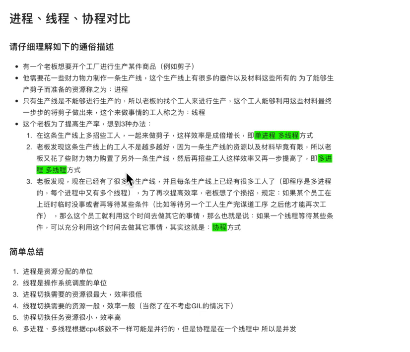

## Python 变量

### Python中对变量是否为None的判断

在Python中，None、空列表[]、空字典{}、空元组()、0等一系列代表空和无的对象会被转换成False。除此之外的其它对象都会被转化成True。

### python 全局变量

在一个函数中,对全局变量进行修改的时候, 是否需要要使用global进行说明取决于是否对全局变量的地址指向进行了修改.

如果修改了执行,即让变量指向了一个新的地方,那么必须使用gloabal进行申明;如果仅仅是修改李指向的空间中的数据,此时不用必须使用global进行申明.

使用`globals()`, 可以查看当前可用的全局属性

### python nonlocal

`nonlocal` 只支持python3

当要修改闭包外的变量时,需要使用`nonlocal` 申明该变量

```python
def test1():
    x = 200
    def test2():
        nonlocal x
        print('------')
        x = 100
        print('------')
    return test2
t1 = test1()
t1()
```


## 常用函数

#### `sys.getsizeof(object)`

查看对象占用的内存字节数

#### `all(iterable)`

检查可迭代对象中的元素是否为真

```
all(iterable, /)
    Return True if bool(x) is True for all values x in the iterable.
    
    If the iterable is empty, return True.
```

#### `enumerate(iterable)`

```
class enumerate(object)
 |  enumerate(iterable, start=0)
 |  
 |  Return an enumerate object.
 |  
 |    iterable
 |      an object supporting iteration
 |  
 |  The enumerate object yields pairs containing a count (from start, which
 |  defaults to zero) and a value yielded by the iterable argument.
 |  
 |  enumerate is useful for obtaining an indexed list:
 |      (0, seq[0]), (1, seq[1]), (2, seq[2]), ...
```

> 注意：使用enumerate 对可迭代对象进行遍历时，如果对可迭代对象中的值进行更改，在本次遍历中有效。

#### `map(func, iterable)`

对可迭代对象的每一个值调用func方法,返回一个包含执行结果的生成器

#### `filer(func or None, iterable)`

```
class filter(object)
 |  filter(function or None, iterable) --> filter object
 |  
 |  Return an iterator yielding those items of iterable for which function(ite
m)
 |  is true. If function is None, return the items that are true.
```


#### `reduce(function, sequence[, initial])`

```
reduce(...)
    reduce(function, sequence[, initial]) -> value
    
    Apply a function of two arguments cumulatively to the items of a sequence,
    from left to right, so as to reduce the sequence to a single value.
    For example, reduce(lambda x, y: x+y, [1, 2, 3, 4, 5]) calculates
    ((((1+2)+3)+4)+5).  If initial is present, it is placed before the items
    of the sequence in the calculation, and serves as a default when the
    sequence is empty.
```


## 字符串和常用数据结构

### 使用字符串

字符串可以使用`\`（反斜杠）来表示转义，也就是说`\`后面的字符不在是原来的意义，例如：`\n`表示换行.....


在`\`后面可以跟一个八进制或者十六进制来表示字符，例如`\141`和`\x61`都代表小写字母a,前者前者是八进制法，而后者是十六进制表示法。也可以后面跟Unicode字符编码来表示字符，例如`\u9762\u5bf9\u5fae\u7b11`代表的是中文字符串"面对微笑".使用字符串


在字符串的前面加上`r`可以禁止字符串中的`\`转义，例如： `"\n"`代表的是换行, 而`r"\n"`代表的是`"\n"`字符串


Python 3.6以后，格式化字符串还有更为简洁的书写方式，就是在字符串前加上字母`f`，我们可以使用下面的语法糖来简化上面的代码。

```
a, b = 5, 10
print(f'{a} * {b} = {a * b}')
```


### 字典

可以作为字典键的类型必须为`不可变类型`，需要注意的是tuple元组作为键时，其中不能以任何方式包含可变对象。


### 生成式和生成器

我们还可以使用列表的生成式语法来创建列表，代码如下所示。

```
f = [x for x in range(1, 10)]
print(f)
f = [x + y for x in 'ABCDE' for y in '1234567']
print(f)
# 用列表的生成表达式语法创建列表容器
# 用这种语法创建列表之后元素已经准备就绪所以需要耗费较多的内存空间
f = [x ** 2 for x in range(1, 1000)]
print(sys.getsizeof(f))  # 查看对象占用内存的字节数
print(f)
# 请注意下面的代码创建的不是一个列表而是一个生成器对象
# 通过生成器可以获取到数据但它不占用额外的空间存储数据
# 每次需要数据的时候就通过内部的运算得到数据(需要花费额外的时间)
f = (x ** 2 for x in range(1, 1000))
print(sys.getsizeof(f))  # 相比生成式生成器不占用存储数据的空间
print(f)
for val in f:
    print(val)
```

除了上面提到的生成器语法，Python中还有另外一种定义生成器的方式，就是通过`yield`关键字将一个普通函数改造成生成器函数。


## python 深拷贝、浅拷贝

浅拷贝、深拷贝对不可变数据类型不起作用

使用`copy`包实现浅拷贝、深拷贝

浅拷贝: 相当于只对第一层引用进行拷贝

深拷贝: 对所有层引用都进行拷贝

- `copy.copy`实现浅拷贝

拷贝元组时, 拷贝前后的值和引用不变,因为元组不可改变

- `copy.deepcopy`实现深拷贝

拷贝元组,视元组内部是否含有可变数据类型,如果有可变数据类型,则会拷贝,如果没有则不会拷贝

```python
>>> import copy
>>> a = (1, 2)
>>> b = copy.deepcopy(a)
>>> id(a)
140509842200448
>>> id(b)
140509842200448
>>>
>>> c = [1, 2]
>>> d = 4
>>> e = (c, d)
>>> f = copy.deepcopy(e)
>>> id(e)
140509840617136
>>> id(f)
140509840893184
>>>
```


## 字符编码

### unicode编码

`\u`开头的编码代表unicode 编码，是一个字符

`0x`开头的代表十六进制，实际是一个整数

`\x`对应的是UTF-8编码的数据，通过转化规则可以转换为unicode编码，就能得到对应的汉子，转换规则很简单，先将`\x`去掉，转换为数字

#### 十六进制数字字符串转unicode字符

```python
'''chr(int('十六进制字符串数字', 16))'''
def HexStr2Unicode(Hex_Str):
	Unicde_Str = ""
	for i in range(0,len(Hex_Str)//4):
	chr(int(Hex_Str[i*4:i*4+4], 16))
	Unicde_Str += chr(int(Hex_Str[i*4:i*4+4], 16) 
	return Unicde_Str

print(HexStr2Unicode(str_uhex))
```

#### unicode字符串转换成十六进制字符串

```python
def Unicode2HexStr(Unicde_Str):
    Hex_Str = ""
    for i in range(0, len(Unicde_Str)):
        Hex_Str += (hex(ord(Unicde_Str[i])).replace('0x','').zfill(4))
    return Hex_Str
print(Unicode2HexStr(U_Str))
```

#### 字符串转unicode

```
s = "高德路"
# 把字符串s编码成unicode
st = s.encode('unicode_escape')
>>> print(st)
b'\\u9ad8\\u5fb7\\u8def'
```


#### unicode 转 utf-8编码

```
s = '测试str'
st = s.encode('utf-8')
print(st)
```


#### unicode 转 gbk 编码

```
s = '测试str'
st = s.encode('gbk')
print(st)
```


## python 集合set

set的去重原理： 通过两个函数`__hash__` 和`__eq__`结合实现的

- 1. 当连个变量的哈希值不相同时，就认为这两个变量是不同的。
- 2. 当两个变量的哈希值一样时，调用`__eq__`方法，当返回值为True时，认为这两个变量是同一个，应该去除一个，返回False不去重。


## python 类class

### 新式类

python3 中的类都是新式类，不管他是否显示的继承object。所有的类都继承自object

python2 ，python3 任何从object或者其它内置类型派生的类都会自动视为新式类

- 类和类型合并

类就是类型，并且类型就是类，并且所有类（以及由此所有的类型）继承自object。类是类型，并且一个实例的类型是该实例的类

- 继承的搜索顺序

多继承的钻石模式有一种略微不同的搜索顺序，总体而言，他们可能先横向搜索再纵向搜索，并且先广度搜索优先搜索，再深度优先搜索。找到后不在继续搜索。

- 针对内置函数的属性获取

\_\_getattr__ 和 \_\_getattribute__ 方法不在针对内置运算的隐式属性获取而运行。这意味着，它们不在针对\_\_X__ 运算符重载方法名而调用，这样的名称搜索从类开始，而不是从实例开始。

- 新的高级工具

新式类有一组新的类工具，包括slot、特性、描述符和\_\_getattribute__ 方法


### 新式类的扩展

slots实例将字符串属性名称顺序赋值给特殊的\_\_slots__ 类属性，新式类就有可能限制类的实例将有的合法属性集，又能够优化内存和速度性能。

使用： 这个属性一般在class语句顶层内将字符串名称顺序赋值给变量\_\_slots__ 而设置： 只有\_\_ slots__ 列表内的这些变量名可赋值为实例属性。实例属性必须在引用前赋值，即使列在\_\_slots__ 中也是这样。

```python
>>> class limiter(object):
...		__slots__ = ['age', 'name', 'job']
>>> x = limiter()
>>> x.age = 40
>>> x.age
40
>>> x.ape = 10000
AttributeError: 'limiter' object has no attribute 'ape'
>>> x.__dict__
AttributeError: 'limiter' object has no attribute '__dict__'
>>> getattr(x, 'age')
40
>>> setattr(x, 'age', 20)
>>> x.age
20
>>> 'age' in dir(x)
True
```

```python
>>> class D:
...		__slot__ = ['a', 'b', '__dict__' ]
...		c = 3
...		def __init__(self): self.d = 4
...
>>> x = D()
>>> x.d
4
>>> x.__dict__
{'d': 4}
```

```python
>>> class D:
...		__slot__ = ['a', 'b']
...		c = 3
...		def __init__(self): self.d = 4
...
>>> x = D()
AttributeError: 'D' object has no attribute 'd'
```

### 运算符重载

#### `__call__`

当调用实例时，使用`__call__`方法

````python
>>> class Callee:
...		def __call__(self, *args, **krags):
...			print('Called:', args, kargs)
>>> C = Callee()
>>> C(1, 2, 3)
Called: (1, 2, 3) {}
>>> C(1, 2, 3, x=4, y =5)
Called: (1, 2, 3) {'y': 5, 'x': 4}
````


#### `__repr__` 和 `__str__` 的区别

`__repr__` 用于交互模式下的终端提示

`__str__` 用于对象的打印，相当于Java的toString 方法

当没有定义`__repr__` 但定义`__str__` 时，`__repr__` 调用`__str__`进行交互提示

### 类的伪私有属性

对于类中的 `__X`这样的变量名会自动变为 `_类名__X`, 必须调用后者才能访问到该属性。

这种方法叫`变量名压缩`，只发生在class语句内，可以防止和同一层次中其他类所创建的类似变量名相冲突。

### 元类

元类是子类化了`type`对象并且拦截类创建调用的类

- 元类能够创建类和元类
- 类能创建对象

```python
MyClass = type('MyClass', (), {})
```

这是因为函数type实际上是一个元类。type就是Python在背后用来创建所有类的元类。现在你想知道那为什么type会全部采用小写形式而不是Type呢？好吧，我猜这是为了和str保持一致性，str是用来创建字符串对象的类，而int是用来创建整数对象的类。type就是创建类对象的类。你可以通过检查__class__属性来看到这一点。Python中所有的东西，注意，我是指所有的东西——都是对象。这包括整数、字符串、函数以及类。它们全部都是对象，而且它们都是从一个类创建而来，这个类就是type

```python
class ObjectCreator(object): 
    pass 

In [6]: type(ObjectCreator)                                                     
Out[6]: type
```


1.类由`type`创建，创建类时，`type`的`__init__`方法自动执行，`类()` 执行`type`的` __call__`方法(类的`__new__`方法,类的`__init__`方法)
2.对象由类创建，创建对象时，类的`__init__`方法自动执行，`对象()`执行类的 `__call__` 方法

```python
class Foo:
    def __init__(self):
        pass

    def __call__(self, *args, **kwargs):
        pass

obj = Foo()
# 执行type的 __call__ 方法，调用 Foo类（是type的对象）的 __new__方法，用于创建对象，然后调用 Foo类（是type的对象）的 __init__方法，用于对对象初始化。

obj()    # 执行Foo的 __call__ 方法   
```


#### 使用type创建类

```python
In [1]: Test1 = type("Test1", (), {"num": 100, "num2": 200})                    
		变量名			类名	 继承的类 	类变量
In [2]: type(Test1)                                                             
Out[2]: type

In [3]: t = Test1()                                                             

In [4]: type(t)                                                                 
Out[4]: __main__.Test1

In [5]: class Test(object): 
   ...:     pass 
   ...:                                                                         

In [6]: type(Test)                                                              
Out[6]: type

In [7]: t = Test()                                                              

In [8]: type(t)                                                                 
Out[8]: __main__.Test
```

- 创建类,并继承其他类

```python
Test2 = type("Test2", (Test1,), {}) # 创建继承了Test1类名为Test2的类, 并赋值给变量Test2

help(Test2) 

Help on class Test2 in module __main__:

class Test2(Test1)
 |  Method resolution order:
 |      Test2
 |      Test1
 |      builtins.object
 |  
 |  Data descriptors inherited from Test1:
 |  
 |  __dict__
 |      dictionary for instance variables (if defined)
 |  
 |  __weakref__
 |      list of weak references to the object (if defined)
 |  
 |  ----------------------------------------------------------------------
 |  Data and other attributes inherited from Test1:
 |  
 |  num = 100
 |  
 |  num2 = 200
```

- 创建包含实例方法的类

```
In [14]: def test_method(self): 
    ...:     print("实例方法....") 
    ...:                                                          
In [15]: Test3 = type("Test3", (), {"test_method": test_method})                

In [16]: help(Test3)

Help on class Test3 in module __main__:

class Test3(builtins.object)
 |  Methods defined here:
 |  
 |  test_method(self)
 |  
 |  ----------------------------------------------------------------------
 |  Data descriptors defined here:
 |  
 |  __dict__
 |      dictionary for instance variables (if defined)
 |  
 |  __weakref__
 |      list of weak references to the object (if defined)
```


- 创建包含类方法的类

```
In [18]: @classmethod 
    ...: def test_class_method(cls): 
    ...:     print("----这是类方法----") 
    ...:                                                                        

In [19]: Test4 = type("Test4", (), {"test_method": test_method, "test_class_meth
    ...: od": test_class_method})                                               

In [20]: help(Test4) 
class Test4(builtins.object)
 |  Methods defined here:
 |  
 |  test_method(self)
 |  
 |  ----------------------------------------------------------------------
 |  Class methods defined here:
 |  
 |  test_class_method() from builtins.type
 |  
 |  ----------------------------------------------------------------------
 |  Data descriptors defined here:
 |  
 |  __dict__
 |      dictionary for instance variables (if defined)
 |  
 |  __weakref__
 |      list of weak references to the object (if defined)
```


- 创建包含静态方法的类

```
In [21]: @staticmethod 
    ...: def test_static_method(): 
    ...:     print("---这是一个静态方法---") 
    ...:                                                                        

In [22]: Test5 = type("Test5", (), {"test_method": test_method, "test_class_meth
    ...: od": test_class_method, "test_static_method": test_static_method})     

In [23]: help(Test5)


class Test5(builtins.object)
 |  Methods defined here:
 |  
 |  test_method(self)
 |  
 |  ----------------------------------------------------------------------
 |  Class methods defined here:
 |  
 |  test_class_method() from builtins.type
 |  
 |  ----------------------------------------------------------------------
 |  Static methods defined here:
 |  
 |  test_static_method()
 |  
 |  ----------------------------------------------------------------------
 |  Data descriptors defined here:
 |  
 |  __dict__
 |      dictionary for instance variables (if defined)
 |  
 |  __weakref__
 |      list of weak references to the object (if defined)
```


#### `__metaclass__`属性

你可以在定义一个类的时候为其添加__metaclass__属性。

```python
class Foo(object):
    __metaclass__ = something…
    ...省略...
```

如果你这么做了，Python就会用元类来创建类Foo。小心点，这里面有些技巧。你首先写下class Foo(object)，但是类Foo还没有在内存中创建。Python会在类的定义中寻找`__metaclass__`属性，如果找到了，Python就会用它来创建类Foo，如果没有找到，就会用内建的type来创建这个类。把下面这段话反复读几次。当你写如下代码时 :

```python
class Foo(Bar):
    pass
```

Python做了如下的操作：

1. Foo中有`__metaclass__`这个属性吗？如果是，Python会通过`__metaclass__`创建一个名字为Foo的类(对象)
2. 如果Python没有找到`__metaclass__`，它会继续在Bar（父类）中寻找`__metaclass__`属性，并尝试做和前面同样的操作。
3. 如果Python在任何父类中都找不到`__metaclass__`，它就会在模块层次中去寻找`__metaclass__`，并尝试做同样的操作。
4. 如果还是找不到`__metaclass__`,Python就会用内置的type来创建这个类对象。

现在的问题就是，你可以在`__metaclass__`中放置些什么代码呢？答案就是：可以创建一个类的东西。那么什么可以用来创建一个类呢？type，或者任何使用到type或者子类化type的东东都可以。


#### 自定义元类

元类的主要目的就是为了当创建类时能够自动地改变类。

假想一个很傻的例子，你决定在你的模块里所有的类的属性都应该是大写形式。有好几种方法可以办到，但其中一种就是通过在模块级别设定`__metaclass__`。采用这种方法，这个模块中的所有类都会通过这个元类来创建，我们只需要告诉元类把所有的属性都改成大写形式就万事大吉了。

幸运的是，`__metaclass__`实际上可以被任意调用，它并不需要是一个正式的类。所以，我们这里就先以一个简单的函数作为例子开始。

##### python2中

```python
#-*- coding:utf-8 -*-
def upper_attr(class_name, class_parents, class_attr):

    # class_name 会保存类的名字 Foo
    # class_parents 会保存类的父类 object
    # class_attr 会以字典的方式保存所有的类属性

    # 遍历属性字典，把不是__开头的属性名字变为大写
    new_attr = {}
    for name, value in class_attr.items():
        if not name.startswith("__"):
            new_attr[name.upper()] = value

    # 调用type来创建一个类
    return type(class_name, class_parents, new_attr)

class Foo(object):
    __metaclass__ = upper_attr # 设置Foo类的元类为upper_attr
    bar = 'bip'

print(hasattr(Foo, 'bar'))
print(hasattr(Foo, 'BAR'))

f = Foo()
print(f.BAR)
```

##### python3中

```python
#-*- coding:utf-8 -*-
def upper_attr(class_name, class_parents, class_attr):

    #遍历属性字典，把不是__开头的属性名字变为大写
    new_attr = {}
    for name,value in class_attr.items():
        if not name.startswith("__"):
            new_attr[name.upper()] = value

    #调用type来创建一个类
    return type(class_name, class_parents, new_attr)

class Foo(object, metaclass=upper_attr):
    bar = 'bip'

print(hasattr(Foo, 'bar'))
print(hasattr(Foo, 'BAR'))

f = Foo()
print(f.BAR)
```

现在让我们再做一次，这一次用一个真正的class来当做元类。

```python
#coding=utf-8

class UpperAttrMetaClass(type):
    # __new__ 是在__init__之前被调用的特殊方法
    # __new__是用来创建对象并返回之的方法
    # 而__init__只是用来将传入的参数初始化给对象
    # 你很少用到__new__，除非你希望能够控制对象的创建
    # 这里，创建的对象是类，我们希望能够自定义它，所以我们这里改写__new__
    # 如果你希望的话，你也可以在__init__中做些事情
    # 还有一些高级的用法会涉及到改写__call__特殊方法，但是我们这里不用
    def __new__(cls, class_name, class_parents, class_attr):
        # 遍历属性字典，把不是__开头的属性名字变为大写
        new_attr = {}
        for name, value in class_attr.items():
            if not name.startswith("__"):
                new_attr[name.upper()] = value

        # 方法1：通过'type'来做类对象的创建
        return type(class_name, class_parents, new_attr)

        # 方法2：复用type.__new__方法
        # 这就是基本的OOP编程，没什么魔法
        # return type.__new__(cls, class_name, class_parents, new_attr)

# python3的用法
class Foo(object, metaclass=UpperAttrMetaClass):
    bar = 'bip'

# python2的用法
# class Foo(object):
#     __metaclass__ = UpperAttrMetaClass
#     bar = 'bip'


print(hasattr(Foo, 'bar'))
# 输出: False
print(hasattr(Foo, 'BAR'))
# 输出:True

f = Foo()
print(f.BAR)
# 输出:'bip'
```

就是这样，除此之外，关于元类真的没有别的可说的了。但就元类本身而言，它们其实是很简单的：

1. 拦截类的创建
2. 修改类
3. 返回修改之后的类


### 静态方法和类方法

#### 静态方法

不用创建实例就可以调用的方法

python3 中类的简单方法（简单来说就是没有self参数）,这种方式虽说是静态方法，但是只能由类调用，而不能有实例调用。

要想在实例中也能调用，必须要一个staticmethod 声明,两种方法

- 在方法定义后（类中）添加语句 `method = staticmehod(method)`(假设方法名为`method`)
- 在方法前使用装饰器`@staticmethod`

#### 类方法

方法传入的第一个参数是`类`而不是`实例`


### 装饰器

#### 自定义装饰器

##### 方法装饰器

##### 类装饰器

#### 内置装饰器

##### `staticmethod`

`staticmethod`方法使类中的函数成为一个普通函数，方法不需要传入实例对象，staticmethod是一个类，属于类装饰器。

##### `classmethod`

`classmethod`装饰器使得函数的第一个参数不是实例对象，而是类对象；调用此方法不需要创建类的实例。classmethiod 是一个类，属于类装饰器。

##### `property`

对于一个类的属性，python是没有限制的，但有的时候需要对属性的访问加以限制，property装饰器就是干这的。

property是一个类，它由三个方法：deleter, setter, getter，有两种使用方式。

```python
class Person(Animal):
  _num_ear = 2
  def __inti__(self):
    self._name = 'xiaoming'
    self.arg = 20
  def get_name(self):
    print('get name')
    return self._name
  def set_name(self):
    print('set name')
    self._name = name
  def delete_name(self):
    print('del name')
    del self._name
  name = property(get_name, set_name, delete_name, doc='name of person')
  # 或者使用匿名函数
  name = property(lambda self:self._name, lambda self, name: setattr(self, '_name', name), lambda self:delattr(self, '_name'))
  
if __name__ = '__main__':
  p = Person()
  print(p.name)	# 会调用get_name
  p.name = 'xxx'	# 会调用set_name
  del p.name	# 会调用delete_name
```

property可以手动指定限制的函数，有四个参数，但这样显得比较麻烦，可以使用使用装饰器的形式。

```python
class Person(Amimal):
  _num_ear = 2
  
  @perporty
  def name(self):
    return self._name
  @name.setter
  def name(self, name):
    self._name = name
  @name.deleter
  def name(self):
    del self._name
   
if __nam__ == '__main__':
  p = Person()
  print(p.name)
  p.name = 'xxxx'
  del p.name
```


### python 重写

重写: python 子类对父类方法的实现

c++、java中对父类方法的实现叫重载


### python 对象实例化

#### 1. 对象实例化过程

1. 调用`__new__`方法创建对象 通俗点说: 申请一个内存空间
2. 调用`__init__`方法, 对刚刚申请的空间进行初始化


### python 类对象和实例对象

类对象: 类, 可以调用类方法和静态方法

实例对象: 类实例化的对象, 可以调用类方法, 静态方法和实例对象方法


### python 魔法属性

#### 1. `__doc__`属性

- 表示类的描述信息


#### 2. `__module__` 和 `__class__`属性

- `__module__` 表示当前操作的对象在那个模块
- `__class__` 表示当前操作的对象是什么


#### 3. `__init__`方法

- 初始化方法,通过类创建对象是,自动触发执行


#### 4. `__del__`方法

- 当对象在内存中被释放时,自定触发执行

注: 此方法一般无需定义,因为python是一门高级语言,程序员在使用时,无需关心内存的分配和释放,因为此工作是交给python解释器来执行,所以, `__del__`的调用是由解释器在进行垃圾回收时自动触发执行的.


#### 5. `__call__`方法

- 对象后面加括号,触发执行

注: `__init__`方法执行是由创建对象出发的, 即: `对象 = 类名()` ; 而对于 `__call__` 方法的执行是由对象后加括号触发的, 即 : `对象()` 或者 `类()()`


#### 6. `__dict__`属性

- 类或对象的所有属性

类的实例属性属于对象; 类中的类属性和方法等属于类.


#### 7. `__str__`方法

- 如果一个类中定义了`__str__`方法, 那么在打印对象是时 默认输出该方法的返回值


#### 8. `__getitem__`, `__setitem__`, `__delitem__`方法

- 用于索引操作, 如字典. 以上分别表示获取, 设置,  删除数据


#### 9. `__getslice__`, `__setslice__`, `__delslice__`方法

- 该方法用于分片操作, 如: 列表


#### 10. `__getattr__`, `__setattr__`, `__getattribute__`方法

- 当调用不存在的属性时，Python会试图调用`__getattr__(self,'key')`来获取属性值，并且返回
- `__getattribute__`: 当访问对象存在的属性或者是方法的时候触发
- `__setattr__`: 对象的属性的的赋值语句


#### 11 `__code__` 属性（此属性为方法的属性）

可用于判断子方法是否覆盖分类的方法

```python
class A():
    def print(self):
        cls = self.__class__
        print(cls)
        print(cls.__name__)


class B(A):
    pass

class C(A):
    def print(self):
        pass

print(B.print.__code__ == A.print.__code__)
print(C.print.__code__ == A.print.__code__)
```

```
True
False
```


#### python with 与 `上下文管理器`


##### 上下文管理器

任何实现了`__enter__()`和 `__exit__()`方法的对象都可以称之为上下文管理器, 上下文管理器对象可以使用with关键字. 显然, 文件(file) 对象也实现了上下文管理器


##### 实现上下文管理器的另外方式

python 还提供了一个 `contextmanager`的修饰器, 更近一步简化了上下文管理器的实现方式.通过 yield 将函数分割成两部分, yield 之前的语句在 `__enter__`方法中执行,yield 之后的语句在 `__exit__`方法中执行. 紧跟在yield后面的值是函数的返回值.


```python
from contextlib import contextmanager

@contextmanager
def my_open(path, mode):
    f = open(path, mode)
    yield f
    f.close()
```

调用

```python
with my_open('out.txt', 'w') as f:
    f.write("hello, the simplest context manager")
```


## python 多继承以及MRO顺序fangfa

### 1. `父类.__init__(self, args)` 方法

> 注意事项: 如果继承多个父类, 且其中一些父类还有公共父类, 这样使用时会导致在父类初始化时,父类的公共父类初始化多次, 可能导致不可预料的bug

```python
class Parent(object):
	"""父类方法"""
	def __init__(self, name):
		print('parent的init开始被调用')
		self.name = name
		print('parent的init结束被调用')


class Son1(Parent):
	def __init__(self, name, age):
		print('Son1的init开始被调用')
		self.age = age
		Parent.__init__(self, name)
		print('Son1的init结束被调用')


class Son2(Parent):
	def __init__(self, name, gender):
		print('Son2的init开始被调用')
		self.gender = gender
		Parent.__init__(self, name)
		print('Son2的init结束被调用')


class Grandson(Son1, Son2):
	def __init__(self, name, age, gender):
		print('Grandson的init开始被调用')
		Son1.__init__(self, name, age)
		Son2.__init__(self, name, gender)
		print('Grandson的init结束被调用')

gs = Grandson('gradson', 12, '男')
print('姓名:', gs.name)
print('年龄:', gs.age)
print('性别:', gs.gender)
```

```
Grandson的init开始被调用
Son1的init开始被调用
parent的init开始被调用
parent的init结束被调用
Son1的init结束被调用
Son2的init开始被调用
parent的init开始被调用
parent的init结束被调用
Son2的init结束被调用
Grandson的init结束被调用
姓名: gradson
年龄: 12
性别: 男
```


### 2. `super(类, self).__init__` 方法

python 多继承父类初始化初始化顺序是基于`C3`算法,  可以使用 `类.__mro__`属性查看该类父类的初始化顺序

`super(类, self).__init__`方法的实现原理:

从当前`类.__mro__`属性中查找到super()方法参数中的类, 查找到该类后, 调用该类后面的所有类的初始化方法


- 使用当前类`super(Grandson, self).__init__(name, age, gender)`

```python
class Parent(object):
	"""父类方法"""
	def __init__(self, name, *args, **kwargs): # 为避免多继承报错,使用不定长参数,接收参数
		print('parent的init开始被调用')
		self.name = name
		print('parent的init结束被调用')


class Son1(Parent):
	def __init__(self, name, age, *args, **kwargs): # 为避免多继承报错,使用不定长参数,接收参数
		print('Son1的init开始被调用')
		self.age = age
		super().__init__(name, *args, **kwargs) # 为避免多继承报错,使用不定长参数,接收参数
		print('Son1的init结束被调用')


class Son2(Parent):
	def __init__(self, name, gender, *args, **kwargs): # 为避免多继承报错,使用不定长参数,接收参数
		print('Son2的init开始被调用')
		self.gender = gender
		super().__init__(name, *args, **kwargs) # 为避免多继承报错,使用不定长参数,接收参数
		print('Son2的init结束被调用')


class Grandson(Son1, Son2):
	def __init__(self, name, age, gender):
		print('Grandson的init开始被调用')
		# 多继承时, 相对于使用 类名.__init__方法, 要把每个父类全部写一遍
		# 而super只用一句话,执行了全部父类的方法,这也是为何多继承需要全部传参的一个原因
		# super(Granson, self).__init__(name, age, gender)
		super(Grandson, self).__init__(name, age, gender)
		print('Grandson的init结束被调用')

# 打印使用super调用父类的顺序
print(Grandson.__mro__)
gs = Grandson('gradson', 12, '男')
print('姓名:', gs.name)
# print('年龄:', gs.age)
print('性别:', gs.gender)
```

```
Grandson的init开始被调用
Son1的init开始被调用
Son2的init开始被调用
parent的init开始被调用
parent的init结束被调用
Son2的init结束被调用
Son1的init结束被调用
Grandson的init结束被调用
姓名: gradson
年龄: 12
性别: 男
```

- 使用父类`super(Son1, self).__init__(name, age, gender)`

```python

class Parent(object):
	"""父类方法"""
	def __init__(self, name, *args, **kwargs): # 为避免多继承报错,使用不定长参数,接收参数
		print('parent的init开始被调用')
		self.name = name
		print('parent的init结束被调用')


class Son1(Parent):
	def __init__(self, name, age, *args, **kwargs): # 为避免多继承报错,使用不定长参数,接收参数
		print('Son1的init开始被调用')
		self.age = age
		super().__init__(name, *args, **kwargs) # 为避免多继承报错,使用不定长参数,接收参数
		print('Son1的init结束被调用')


class Son2(Parent):
	def __init__(self, name, gender, *args, **kwargs): # 为避免多继承报错,使用不定长参数,接收参数
		print('Son2的init开始被调用')
		self.gender = gender
		super().__init__(name, *args, **kwargs) # 为避免多继承报错,使用不定长参数,接收参数
		print('Son2的init结束被调用')


class Grandson(Son1, Son2):
	def __init__(self, name, age, gender):
		print('Grandson的init开始被调用')
		# 多继承时, 相对于使用 类名.__init__方法, 要把每个父类全部写一遍
		# 而super只用一句话,执行了全部父类的方法,这也是为何多继承需要全部传参的一个原因
		# super(Granson, self).__init__(name, age, gender)
		super(Son1, self).__init__(name, age, gender)
		print('Grandson的init结束被调用')

# 打印使用super调用父类的顺序
print(Grandson.__mro__)
gs = Grandson('gradson', 12, '男')
print('姓名:', gs.name)
print('性别:', gs.gender)
print('年龄:', gs.age)

```

```
(<class '__main__.Grandson'>, <class '__main__.Son1'>, <class '__main__.Son2'>, <class '__main__.Parent'>, <class 'object'>)
Grandson的init开始被调用
Son2的init开始被调用
parent的init开始被调用
parent的init结束被调用
Son2的init结束被调用
Grandson的init结束被调用
姓名: gradson
性别: 12
Traceback (most recent call last):
  File "/home/smilejack/Documents/python/vscode/AI_study/11-python 多继承以及调用父类方法的顺序-1.py", line 41, in <module>
    print('年龄:', gs.age)
AttributeError: 'Grandson' object has no attribute 'age'
```


### 3. `super().__init__`方法

相当于```super(当前类, self).__init__`方法

```python
print("****多继承使用super().__init__发生的状态****")
class Parent(object):
	"""父类方法"""
	def __init__(self, name, *args, **kwargs): # 为避免多继承报错,使用不定长参数,接收参数
		print('parent的init开始被调用')
		self.name = name
		print('parent的init结束被调用')


class Son1(Parent):
	def __init__(self, name, age, *args, **kwargs): # 为避免多继承报错,使用不定长参数,接收参数
		print('Son1的init开始被调用')
		self.age = age
		super().__init__(name, *args, **kwargs) # 为避免多继承报错,使用不定长参数,接收参数
		print('Son1的init结束被调用')


class Son2(Parent):
	def __init__(self, name, gender, *args, **kwargs): # 为避免多继承报错,使用不定长参数,接收参数
		print('Son2的init开始被调用')
		self.gender = gender
		super().__init__(name, *args, **kwargs) # 为避免多继承报错,使用不定长参数,接收参数
		print('Son2的init结束被调用')


class Grandson(Son1, Son2):
	def __init__(self, name, age, gender):
		print('Grandson的init开始被调用')
		# 多继承时, 相对于使用 类名.__init__方法, 要把每个父类全部写一遍
		# 而super只用一句话,执行了全部父类的方法,这也是为何多继承需要全部传参的一个原因
		# super(Granson, self).__init__(name, age, gender)
		super().__init__(name, age, gender)
		print('Grandson的init结束被调用')

# 打印使用super调用父类的顺序
print(Grandson.__mro__)
gs = Grandson('gradson', 12, '男')
print('姓名:', gs.name)
print('性别:', gs.gender)
print('年龄:', gs.age)

```

```
****多继承使用super().__init__发生的状态****
(<class '__main__.Grandson'>, <class '__main__.Son1'>, <class '__main__.Son2'>, <class '__main__.Parent'>, <class 'object'>)
Grandson的init开始被调用
Son1的init开始被调用
Son2的init开始被调用
parent的init开始被调用
parent的init结束被调用
Son2的init结束被调用
Son1的init结束被调用
Grandson的init结束被调用
姓名: gradson
性别: 男
年龄: 12
```


## python 私有化

- ` xx`: 公有变量
- `_x`: 单前置下划线, 私有化属性或方法, from somemodule import * 禁止导入, 类对象和子类可以访问
- `__xx`: 双前置下划线, 避免与子类中的属性命名冲突, 无法在外部直接访问(名字重整所以无法访问)
- `__xx__`: 双前后下划线, 用户名字空间的魔法对象或属性.例如`__init__`, 不要自己发明这样的名字
- `xx_`: 单后置下划线,用于避免与Python关键词的冲突 

通过name mangling(名字重整(目的是以防止子类意外重写父基类的方法或者属性) 如`_Class__object`就可以访问私有属性了)


## python import 和 from … import

使用import 导入包后,修改了包中的变量,会影响以后import和from…import该包的变量.


## python 小数

`decimal`模块中的一些工具可以用来设置小数数值的精确度

```python
>>> import decimal
>>> decimal.Decimal(1) / decimal.Decimal(7)
Decimal('0.1428571428571428571428571429')
>>> decimal.getcontext().prec = 4
>>> decimal.Decimal(1) / decimal.Decimal(7)
Decimal('0.1429')
```

### 小数上下文环境管理器

可以使用上下文管理器语句来重新设置临时进度。在语句退出后，精度重新设置为初始值。

```python
>>> import decimal
>>> with decimal.localcontext() as ctx:
...     ctx.prec = 2
...     decimal.Decimal(1) / decimal.Decimal(3)
...
Decimal('0.33')
```


## python 分数类型

```python
>>> from fractions import Fraction
>>> x = Fraction(1, 3)
>>> x
Fraction(1, 3)
>>> y = Fraction(1, 4)
>>> y
Fraction(1, 4)
>>> print(y)
1/4
>>> x + y
Fraction(7, 12)
>>> print(x + y)
7/12
>>> float(x)
0.3333333333333333
>>> float(y)
0.25
>>> Fraction.from_float(1.75)
Fraction(7, 4)
```

其表达式中允许某些类型的混合，尽管Fraction有事必须手动的进行传递一确保精度。

```python
>>> x
Fraction(1, 3)
>>> x + 2
Fraction(7, 3)
>>> x + 2.0
2.3333333333333335
>>> x + (1./3)
0.6666666666666666
>>> x + (4./3)
1.6666666666666665
>>> x + Fraction(4, 3)
Fraction(5, 3)
```

> 尽管可以把浮点数转换为分数，在某些情况下，这么做会有不可避免的精度损失，因为数字在其最初始的浮点形式不是最精确的。当需要的时候，我们可以限制最大化分母值来简化这样的结果：

```python
>>> 4.0 / 3
1.3333333333333333
>>> (4.3 /3).as_integer_ratio()
(6455159465897711, 4503599627370496)
>>> a = x + Fraction(*(4.0 /3).as_integer_ratio())
>>> a
Fraction(22517998136852479, 13510798882111488)
>>> 22517998136852479 / 13510798882111488.
1.6666666666666667
>>> a.limit_denominator(10)
Fraction(5, 3)
```


## python环境管理协议

### with/as 环境管理器

基本使用：

```python
with expression [as variable]:
  	with-block
```

### 如何编写环境管理器

使用运算符重载来实现环境管理器

with语句的实现方式：

1. 计算表达式，所得到的对象成为环境管理器，它必须有`__enter__` 和 `__exit__`方法。
2. 环境管理器的`__enter__`方法会被调用，如果as字句存在，其返回值会赋值给as字句中的变量，否者直接丢弃，
3. 代码中的嵌套代码会执行。
4. 如果with代码引发异常，`__exit__(type, value, traceback)`方法就会调用（带有异常细节）这些也是由sys.exec_info()返回的相同值。如果此方法返回值为假，则异常会重新引发，否则，异常会终止。正常情况下异常应该被重新引发，这样的花才能传递到with语句之外。
5. 如果with代码块没有异常m`__exit__`方法依然会被调用，其type、value以及traceback参数都会以None传递。

```python 
class TraceBlock:
    def message(self, arg):
        print('running', arg)
    def __enter__(self):
        print('starting with block')
        return self
    def __exit__(self, exc_type, exc_value, exc_tb):
        if exc_type is None:
            print('exited normally\n')
        else:
            print('raise an exeception!', exc_type)
            return False


with TraceBlock() as action:
    action.message('test 1')
    print('reached')

with TraceBlock() as action:
    action.message('test 2')
    raise TypeError
    print('not reached')
```

```python
starting with block
running test 1
reached
exited normally


starting with block
running test 2
raise an exeception! <class 'TypeError'>
Traceback (most recent call last):
  File "<stdin>", line 3, in <module>
TypeError
```


## Python 异常


### 类异常

```python
# mathlib.py

class NumErr(Exception): pass
class Divzero(NumErr): pass
class Oflow(NumErr): pass

def func():
  ...
  raise DivZero()
```

当你的库用户只需列出共同的超类，来捕捉库的所有异常，无论是现在还是以后。

```python
# client.py
import mathlib

...
try:
  mathlib.func(...)
except mathlib.NumErr:
  ... report and recover ...
```

当你修改异常类代码时，作为共同超类的新的子类来增加新的异常。


### try…except…else…finally

Python 中try和finally中都有return 时, 如果没有错误,最后返回的是finally块中的return,即无论如何finally块的与句都会执行.

```python
# test.py

def test():
  try:
    print(1)
    return 1
  finally:
		print(3)
    return 3
if __name__ == '__main__':
  print(test())
  

----------------
运行结果:
1
3
3
```

Python 中try, else和finally中都有return 时, 如果没有错误,最后返回的是finally块中的return,try语句块中的return会阻止else语句块的执行,但不会影响finally语句块的执行.(另外,else语句块前面必须由except语句块)

```python
# test.py

def test():
  try:
    print(1)
    return 1
  except:
    print(2)
    return 2
 	else:
    print(3)
    return 3
 	finally:
    print(4)
    return 4
if __name__ == '__main__':
  print(test())
  
---------
运行结果:
1
4
4
```


## python 装饰器

### 1. 无参数的装饰器

```python
def a_new_decorator(a_func): # 参数为被装饰的方法
 
    def wrapTheFunction():
        print("I am doing some boring work before executing a_func()")
 
        a_func()
 
        print("I am doing some boring work after executing a_func()")
 
    return wrapTheFunction

@a_new_decorator
def a_function_requiring_decoration():
    """Hey you! Decorate me!"""
    print("I am the function which needs some decoration to "
          "remove my foul smell")
 
a_function_requiring_decoration()
#outputs: I am doing some boring work before executing a_func()
#         I am the function which needs some decoration to remove my foul smell
#         I am doing some boring work after executing a_func()
 
#the @a_new_decorator is just a short way of saying:
a_function_requiring_decoration = a_new_decorator(a_function_requiring_decoration)
```


如果我们运行如下代码会存在一个问题：

```
print(a_function_requiring_decoration.__name__)
# Output: wrapTheFunction
```

这并不是我们想要的！Ouput输出应该是"a_function_requiring_decoration"。这里的函数被warpTheFunction替代了。它重写了我们函数的名字和注释文档(docstring)。幸运的是Python提供给我们一个简单的函数来解决这个问题，那就是functools.wraps。我们修改上一个例子来使用functools.wraps：

```python
from functools import wraps
 
def a_new_decorator(a_func):
    @wraps(a_func)
    def wrapTheFunction():
        print("I am doing some boring work before executing a_func()")
        a_func()
        print("I am doing some boring work after executing a_func()")
    return wrapTheFunction
 
@a_new_decorator
def a_function_requiring_decoration():
    """Hey yo! Decorate me!"""
    print("I am the function which needs some decoration to "
          "remove my foul smell")
 
print(a_function_requiring_decoration.__name__)
# Output: a_function_requiring_decoration
```

案例:

```Python

from functools import wraps
def decorator_name(f):
    @wraps(f)
    def decorated(*args, **kwargs):
        if not can_run:
            return "Function will not run"
        return f(*args, **kwargs)
    return decorated
 
@decorator_name
def func():
    return("Function is running")
 
can_run = True
print(func())
# Output: Function is running
 
can_run = False
print(func())
# Output: Function will not run
```


> 注意：**@wraps接受一个函数来进行装饰，并加入了复制函数名称、注释文档、参数列表等等的功能。这可以让我们在装饰器里面访问在装饰之前的函数的属性。


### 2. 有参数的装饰器

来想想这个问题，难道@wraps不也是个装饰器吗？但是，它接收一个参数，就像任何普通的函数能做的那样。那么，为什么我们不也那样做呢？ 这是因为，当你使用@my_decorator语法时，你是在应用一个以单个函数作为参数的一个包裹函数。记住，Python里每个东西都是一个对象，而且这包括函数！记住了这些，我们可以编写一下能返回一个包裹函数的函数。

#### 在函数中嵌入装饰器

我们回到日志的例子，并创建一个包裹函数，能让我们指定一个用于输出的日志文件。

```python
from functools import wraps
 
def logit(logfile='out.log'):
    def logging_decorator(func):
        @wraps(func)
        def wrapped_function(*args, **kwargs):
            log_string = func.__name__ + " was called"
            print(log_string)
            # 打开logfile，并写入内容
            with open(logfile, 'a') as opened_file:
                # 现在将日志打到指定的logfile
                opened_file.write(log_string + '\n')
            return func(*args, **kwargs)
        return wrapped_function
    return logging_decorator
 
@logit()
def myfunc1():
    pass
 
myfunc1()
# Output: myfunc1 was called
# 现在一个叫做 out.log 的文件出现了，里面的内容就是上面的字符串
 
@logit(logfile='func2.log')
def myfunc2():
    pass
 
myfunc2()
# Output: myfunc2 was called
# 现在一个叫做 func2.log 的文件出现了，里面的内容就是上面的字符串
```


### 3. 多个装饰器的装饰顺序和执行顺序

多个装饰器的装饰顺序: **从下到上**

多个装饰器的执行顺序: **从上到下**

```python
# -*- coding: utf-8 -*-

def add_qx(func):
	print("---开始进行装饰权限的功能---")
	def call_func(*args, **kwargs):
		print("---这是权限验证1---")
		return func(*args, **kwargs)
	return call_func

def add_xx(func):
	print("---开始进行装饰xxx的功能---")
	def call_func(*args, **kwargs):
		print("---这是xxx的功能---")
		return func(*args, **kwargs)
	return call_func

@add_qx
@add_xx
def test1():
	print("------------test1----------")

test1()
```

```
---开始进行装饰xxx的功能---
---开始进行装饰权限的功能---
---这是权限验证1---
---这是xxx的功能---
------------test1----------
```


### 4. 类装饰器

```python
class Test(object):
	def __init__(self, func):
		self.func = func

	def __call__(self):
		print("这是装饰器添加的功能....")
		return self.func()


@Test  # 相当于get_str = Test(get_str)
def get_str():
	return "haha"

print(get_str())
```

```
这是装饰器添加的功能....
haha
```


 


## python 包导入

### 模块导入

#### Python import 的搜索路径

- 在当前目录下搜索该模块
- 在环境变量 PYTHONPATH 中指定的路径列表中依次搜索
- 在 Python 安装路径的 lib 库中搜索

#### Python import 的步骤

python 所有加载的模块信息都存放在 sys.modules 结构中，当 import 一个模块时，会按如下步骤来进行

- 如果是 import A，检查 sys.modules 中是否已经有 A，如果有则不加载，如果没有则为 A 创建 module 对象，并加载 A
- 如果是 from A import B，先为 A 创建 module 对象，再解析A，从中寻找B并填充到 A 的 __dict__ 中

#### 相对导入与绝对导入

绝对导入的格式为 import A.B 或 from A import B，相对导入格式为 from . import B 或 from ..A import B，.代表当前模块，..代表上层模块，...代表上上层模块，依次类推。

相对导入可以避免硬编码带来的维护问题，例如我们改了某一顶层包的名，那么其子包所有的导入就都不能用了。但是存在相对导入语句的模块，不能直接运行，否则会有异常：

```kotlin
ValueError: Attempted relative import in non-package
```

- 如果是绝对导入，一个模块只能导入自身的子模块或和它的顶层模块同级别的模块及其子模块
- 如果是相对导入，一个**模块必须有包结构**且**只能导入它的顶层模块内部的模块**
   所以，**如果一个模块被直接运行，则它自己为顶层模块，不存在层次结构，所以找不到其他的相对路径，**所以如果直接运行python xx.py ，而xx.py有相对导入就会报错

看下面例子：

```css
package
├── __init__.py
├── sub_pkg1
│   ├── __init__.py
│   ├── moduleX.py
│   ├── moduleY.py
└── sub_pkg2
    ├── __init__.py
    └── moduleZ.py
```

moduleX.py

```python
# import moduleY
# from sub_pkg1 import moduleY
from . import moduleY

print  "X __name__", __name__
```

moduleY.py

```python
print  "Y __name__", __name__
```

当我们直接运行 `python sub_pkg1/moduleX.py`的时候，会报错

```kotlin
ValueError: Attempted relative import in non-package
```

当我们这样运行的时候 `python -m sub_pkg1.moduleX`， 才能正常运行

```css
Y __name__ sub_pkg1.moduleY
X __name__ __main__
```

为什么会这样？
 简单地说，直接运行 .py 文件和 import 这个文件有很大区别。Python 解释器判断一个 py 文件属于哪个 package 时并不完全由该文件所在的文件夹决定。它还取决于这个文件是如何 load 进来的（**直接运行 or import**）。

有两种方式加载一个 py 文件：

- 作为 top-level 脚本
   作为 top-level 脚本指的是直接运行脚本，比如 python myfile.py。有且只能有一个 top-level 脚本，就是最开始执行的那个（比如 python myfile.py 中的 myfile.py）。
- 作为 module
   作为 module 是指，执行 python -m myfile，或者在其它 py 文件中用 import 语句来加载，那么它就会被当作一个 module。

当一个 py 文件被加载之后，它会被赋予一个名字，保存在 __name__ 属性中。
 如果是 top-level 脚本，那么名字就是 __main__。
 如果是作为 module，名字就是把它所在的 packages/subpackages 和文件名用 . 连接起来。

例如，moduleX 被 import 进来，它的名字就是 package.subpackage1.moduleX。如果 import 了 moduleA，它的名字是 package.moduleA。如果直接运行 moduleX 或 moduleA，那么名字就都是__main__ 了。

所以上面的moduleX的__name__是`__main__`， 因为他是直接运行的， moduleY的__name__是`sub_pkg1.moduleY`，因为他是被import 来使用的。

#### from **future** import absolute_import

Python2.x 缺省为相对路径导入，Python3.x 缺省为绝对路径导入。绝对导入可以避免导入子包覆盖掉标准库模块（由于名字相同，发生冲突）。如果在 Python2.x 中要默认使用绝对导入，可以在文件开头加入如下语句：

```jsx
from __future__ import absolute_import
```

这句 import 并不是指将所有的导入视为绝对导入，而是指禁用 implicit relative import（隐式相对导入）, 但并不会禁掉 explicit relative import（显示相对导入）。

那么到底什么是隐式相对导入，什么又是显示的相对导入呢？
 上面的moduleX.py，三种的import moduleY都是可以的

```python
import moduleY # 隐式相对引入
from . import moduleY # 显式相对引入
from sub_pkg1 import moduleY # 绝对引入
```

隐式相对就是没有告诉解释器相对于谁，但默认相对与当前模块；而显示相对则明确告诉解释器相对于谁来导入。以上导入方式的第三种，才是官方推荐的，第一种是官方强烈不推荐的，Python3 中已经被废弃，这种方式只能用于导入 path 中的模块。

#### 相对与绝对仅针对包内导入而言

最后再次强调，相对导入与绝对导入仅针对于包内导入而言，要不然本文所讨论的内容就没有意义。**所谓的包，就是包含 __init__.py 文件的目录**，该文件在包导入时会被首先执行，该文件可以为空，也可以在其中加入任意合法的 Python 代码。

相对导入可以避免硬编码，对于包的维护是友好的。绝对导入可以避免与标准库命名的冲突，实际上也不推荐自定义模块与标准库命令相同。

前面提到含有相对导入的模块不能被直接运行，实际上含有绝对导入的模块也不能被直接运行，会出现 ImportError：

```ruby
ImportError: No module named XXX
```

这与绝对导入时是一样的原因。要运行包中包含绝对导入和相对导入的模块，可以用 python -m A.B.C 告诉解释器模块的层次结构。

有人可能会问：假如有两个模块 a.py 和 b.py 放在同一个目录下，为什么能在 b.py 中 import a 呢？

这是因为这两个文件所在的目录不是一个包，那么每一个 python 文件都是一个独立的、可以直接被其他模块导入的模块，就像你导入标准库一样，它们不存在相对导入和绝对导入的问题。**相对导入与绝对导入仅用于包内部**


### 重载模块

> 重载模块只对 import 导入的模块生效, from... import ... 不生效

```python
from imp import reload
reload(module)
```


## python 高级正则表达

### 1、match

`re.match(pattern, string[, flags])`
从首字母开始开始匹配，string如果包含pattern子串，则匹配成功，返回Match对象，失败则返回None，若要完全匹配，pattern要以$结尾。

### 2、search

`re.search(pattern, string[, flags])`
若string中包含pattern子串，则返回Match对象，否则返回None，注意，如果string中存在多个pattern子串，只返回第一个。

### 3、findall

`re.findall(pattern, string[, flags])`
返回string中所有与pattern相匹配的全部字串，返回形式为数组。

### 4、finditer

 `re.finditer(pattern, string[, flags])`
返回string中所有与pattern相匹配的全部字串，返回形式为迭代器。

### 5、关于group, groups, group(index)

```python
import re
h = 'hale3456'
match = re.match(r'(ha(le|tl))((34|12)56)', h)
match.groups()
Out[23]: ('hale', 'le', '3456', '34')
match.group()                                                          
Out[24]: 'hale3456'
    
match.group(1)                                                         
Out[26]: 'hale'

match.group(2)                                                         
Out[27]: 'le'

match.group(3)                                                         
Out[28]: '3456'

match.group(4)                                                         
Out[29]: '34'
```


### 使用匹配组


```python
import re

html = "<html><body><h1></h1></body></html>"
match = re.match(r'<(\w+)><(\w+)><(\w+)></\3></\2></\1>', html)
print(match.group())
```

```
<html><body><h1></h1></body></html>
```


```python

```


## python GIL(全局解释锁)


### 解决GIL问题

- 使用多进程
- 使用其他语言来实现

案例:使用C语言避免GIL问题

`loop.c`

```c
void DeadLoop()
{
    while(1)
    {
        ;
    }
}
```

将`loop.c`编译成动态库`libdead_loop.so`

```
gcc loop.c -shared -o libdead_loop.so
```

`main.py`

```python
from ctypes import *
from threading import Thread

# 加载动态库
lib = cdll.LoadLibrary("./libdead_loop.so")

# 创建一个子线程,让其执行C语言编写的函数,此函数是一个死循环
t = Thread(target=lib.DeadLoop)
t.start()

# 主线程
while True:
    pass
```

```
python main.py
可以发现2个cpu的占用率达到100%
```


## Python 多进程

多进程的使用基本和多线程使用差不多.

已知区别

使用多进程时,使用`multiprocessing.Process`传递的参数是主进程中对应参数的复制

案例: socket 使用多进程时,子进程和父进程都关闭这个客户端socket时,才能真正关闭客户端的socket套接字


### 进程池pool

```python
from multiprocessing import Pool
import os, time, random

def worker(msg):
    t_start = time.time()
    print('%s 开始执行,进程号为%d' %(msg, os.getpid()))
    time.sleep(random.random() * 2)
    t_stop = time.time()
    print(msg, '执行完毕,耗时%0.2f' %(t_stop-t_start))
po = Pool(3) # 定义一个进程池,最大进程数为3
for i in range(0, 10):
    # Pool().apply_async(要调用的目标, (传递给目标的参数元组,))
    # 每次循环将会用空闲的子进程去调用目标
    po.apply_async(worker, (i,))

print("-----start------")
po.close() # 关闭进程池,关闭后po不在接收新的请求
po.join() # 等待po中所有子进程执行完成,必须放在close语句之后
print('-----end--------')
```


### 多进程之间共享数据

多进程不能使用普通的queu.Queue实现进程间数据共享

#### 不使用进程池时

使用`multiprocessing.Queue`进行进程间数据共享

```python
import multiprocessing
import time
import random


def test(q):
    print('start', multiprocessing.current_process().name)
    for i in range(10):
        time.sleep(0.1)
        v = random.randint(1, 100)
        print(multiprocessing.current_process().name, ":", v)
        q.put(v)
    print('over', multiprocessing.current_process().name)


def main():
    ps = []
    q = multiprocessing.Queue()
    for i in range(4):
        p = multiprocessing.Process(target=test, args=(q,))
        p.start()
        ps.append(p)
    ls = []
    while len(multiprocessing.active_children()) > 0 or not q.empty():
        if not q.empty():
            v = q.get()
            print('data:', v)
            ls.append(v)
    print(ls)
    print(len(ls))


if __name__ == '__main__':
    main()

```


#### 使用进程池时

需要使用multiprocessing.Manager来实现数据共享

```python
from multiprocessing import Manager, Pool
import os, time, random

def reader(q):
    print("reader启动(%s), 父进程为(%s)" %(os.getpid(), os.getppid()))
    for i in range(q.qsize()):
        print("reader从Queue获取到消息: %s" %q.get(True))

def writer(q):
    print("writer启动(%s), 父进程为(%s)" %(os.getpid(), os.getppid()))
    for i in "itcast":
        q.put(i)

if __name__ == '__main__':
    print("(%s) start" %os.getpid())
    q = Manager().Queue() # 使用Manager中的Queue
    po = Pool()
    po.apply_async(writer, (q,))

    time.sleep(3) # 想让上面的任务向Queue存入数据, 然后再让下面的任务开始从中取数据

    po.apply_async(reader, (q,))
    po.close()
    po.join()
    print("(%s) End" %os.getpid())
```

```
(1256) start
writer启动(1262), 父进程为(1256)
reader启动(1263), 父进程为(1256)
reader从Queue获取到消息: i
reader从Queue获取到消息: t
reader从Queue获取到消息: c
reader从Queue获取到消息: a
reader从Queue获取到消息: s
reader从Queue获取到消息: t
(1256) End
```


## python 迭代器

判断对象是否可迭代(对象实现了`__iter__`方法即可迭代)

```python
from collections.abc import Iterable
isinstance(obj, Iterable) # 判断obj是否可迭代
```

判读对象是否是迭代器(对象实现`__iter__`和`__next__`方法)

```python
from collections.abc import  Iterator
isinstance(obj, Iterator) # 判断obj是否为迭代器
```


### 类迭代器

一个类迭代器需要实现`__iter__`和`__next__`方法


## python 生成器

### 元组生成器

```
(i for i in range(10))
```

### yield 函数生成器

见 [python yield 使用](#python yield的使用)


## python 数据库连接池

需要按安装的包:DBUtils

DBUtils提供两种外部接口:

- PersistentDB: 提供线程专用的数据库连接,并自动管理连接
- PooledDB : 提供线程间可共享的数据库连接,并自动管理.

实例(简单的数据库连接池:

```python
import MySQLdb
from DBUtils.PooledDB import PooledDB
pool = PooledDB(MySQLdb,5,host='localhost',user='root',\passwd='pwd',db='myDB',port=3306) #5为连接池里的最少连接数
conn = pool.connection()  #以后每次需要数据库连接就是用connection（）函数获取连接就好了
cur=conn.cursor()
SQL="select * from table1"
r=cur.execute(SQL)
r=cur.fetchall()
cur.close()
conn.close()
```

数据库连接工具包:

```python
import pymysql
import DBUtils
class OPMysql(object):

    __pool = None

    def __init__(self):
        # 构造函数，创建数据库连接、游标
        self.coon = OPMysql.getmysqlconn()
        self.cur = self.coon.cursor(cursor=pymysql.cursors.DictCursor)


    # 数据库连接池连接
    @staticmethod
    def getmysqlconn():
        if OPMysql.__pool is None:
            __pool = PooledDB(creator=pymysql, mincached=1, maxcached=20, host=mysqlInfo['host'], user=mysqlInfo['user'], passwd=mysqlInfo['passwd'], db=mysqlInfo['db'], port=mysqlInfo['port'], charset=mysqlInfo['charset'])
            print(__pool)
        return __pool.connection()

    # 插入\更新\删除sql
    def op_insert(self, sql):
        print('op_insert', sql)
        insert_num = self.cur.execute(sql)
        print('mysql sucess ', insert_num)
        self.coon.commit()
        return insert_num

    # 查询
    def op_select(self, sql):
        print('op_select', sql)
        self.cur.execute(sql)  # 执行sql
        select_res = self.cur.fetchone()  # 返回结果为字典
        print('op_select', select_res)
        return select_res

    #释放资源
    def dispose(self):
        self.coon.close()
        self.cur.close()
```

PooledDB 参数解释:

1. `mincached`:最少的空闲连接数,如果空闲连接数小于这个数,pool会创建一个新的连接.
2. `maxcached`:最大的空连接数吗,如果空闲连接数大于这个数, pool会关闭连接.
3. `maxconnections`: 最大的连接数,进程中最大可创建的线程数.
4. `blocking`: 当连接数达到最大的连接数.再次请求时,如果这个值时True,请求连接的程序会一直等待,直到当前连接数小于最大连接数;如果值为False,会报错.
5. `maxshared`: 当连接数达到这个数时,请求新的连接会分享已经分配出去的连接.

在uwsgi中，每个http请求都会有一个进程，连接池中配置的连接数都是一个进程为单位的（**即上面的最大连接数，都是在一个进程中创建的线程数**），如果业务中，一个http请求中需要的sql连接数不是很多的话（其实大多数都只需要创建一个连接），配置的连接数配置都不需要太大。

**连接池对性能的提升：**

- 在程序创建连接的时候，可以从一个空闲的连接中获取，不需要重新初始化连接，提升获取连接的速度。
- 关闭连接的时候，把连接放回连接池，而不是真正的关闭，所以可以减少频繁的打开和关闭连接。


# python yield的使用

作用: 带有yield的函数不再是一个普通函数,而是一个生成器generator,可用于迭代

如何获取迭代的值有两个方法

**方法一:**

使用`next(iterator)`, 或者`iterator.__next__()`

```python
>>> def test():
...     for i in range(5):
...             yield i
... 
>>> t = test()
>>> next(t)
0
>>> next(t)
1
>>> t.__next__()
2
>>> t.__next__()
3
>>> next(t)
4
>>> next(t)
Traceback (most recent call last):
  File "<stdin>", line 1, in <module>
StopIteration
>>> 
```

**方法二**

使用`iterator.send()`方法, 它除了有方法一的功能外,还有以下功能

> 注意: 第一次调用时必须先next()或send(None)，否则会报错，send后之所以为None是因为这时候没有上一个yield。可以认为，next()等同于send(None)

```python
>>> def test():
...     for i in range(5):
...             res = yield i
...             print('res:', res)
...
>>> t = test()
>>> t.send(None)
0
>>> t.send('hello world')
res: hello world
1
>>> t.send('hello world-1')
res: hello world-1
2
>>> t.send('hello world-2')
res: hello world-2
3
>>> t.send('hello world-3')
res: hello world-3
4
>>> t.send('hello world-4')
res: hello world-4
Traceback (most recent call last):
  File "<stdin>", line 1, in <module>
StopIteration
>>> 
```


send(msg)与next()的区别在于send可以传递参数给yield表达式，这时传递的参数会作为yield表达式的值，而yield的参数是返回给调用者的值。——换句话说，就是send可以强行修改上一个yield表达式值。比如函数中有一个yield赋值，a = yield 5，第一次迭代到这里会返回5，a还没有赋值。第二次迭代时，使用.send(10)，那么，就是强行修改yield 5表达式的值为10，本来是5的，那么a=10


# python 协程




由于GIL的存在，导致Python多线程性能甚至比单线程更糟。

> GIL: 全局解释器锁（英语：Global Interpreter Lock，缩写GIL），是计算机程序设计语言解释器用于同步线程的一种机制，它使得任何时刻仅有一个线程在执行。[1]即便在多核心处理器上，使用 GIL 的解释器也只允许同一时间执行一个线程。

于是出现了协程（Coroutine）这么个东西。

> 协程: 协程，又称微线程，纤程，英文名Coroutine。协程的作用，是在执行函数A时，可以随时中断，去执行函数B，然后中断继续执行函数A（可以自由切换）。但这一过程并不是函数调用（没有调用语句），这一整个过程看似像多线程，然而协程只有一个线程执行.

协程由于由程序主动控制切换，没有线程切换的开销，所以执行效率极高。对于IO密集型任务非常适用，如果是cpu密集型，推荐多进程+协程的方式。

在Python3.4之前，官方没有对协程的支持，存在一些三方库的实现，比如gevent和Tornado。3.4之后就内置了asyncio标准库，官方真正实现了协程这一特性。

而Python对协程的支持，是通过Generator实现的，协程是遵循某些规则的生成器。因此，我们在了解协程之前，我们先要学习生成器。

## 生成器(Generator)

我们这里主要讨论`yield`和`yield from`这两个表达式，这两个表达式和协程的实现息息相关。

- Python2.5中引入`yield`表达式，参见[PEP342](https://www.python.org/dev/peps/pep-0342/)
- Python3.3中增加`yield from`语法，参见[PEP380](https://www.python.org/dev/peps/pep-0380/)，

方法中包含`yield`表达式后，Python会将其视作generator对象，不再是普通的方法。

### `yield`表达式的使用

我们先来看该表达式的具体使用：

```
def test():
    print("generator start")
    n = 1
    while True:
        yield_expression_value = yield n
        print("yield_expression_value = %d" % yield_expression_value)
        n += 1


# ①创建generator对象
generator = test()
print(type(generator))

print("\n---------------\n")

# ②启动generator
next_result = generator.__next__()
print("next_result = %d" % next_result)

print("\n---------------\n")

# ③发送值给yield表达式
send_result = generator.send(666)
print("send_result = %d" % send_result)

```

执行结果：

```
<class 'generator'>

---------------

generator start
next_result = 1

---------------

yield_expression_value = 666
send_result = 2

```

方法说明：

- `__next__()`方法: 作用是启动或者恢复generator的执行，相当于send(None)
- `send(value)`方法：作用是发送值给yield表达式。启动generator则是调用send(None)

执行结果的说明：

- ①创建generator对象：包含yield表达式的函数将不再是一个函数，调用之后将会返回generator对象
- ②启动generator：使用生成器之前需要先调用`__next__`或者`send(None)`，否则将报错。启动generator后，代码将执行到`yield`出现的位置，也就是执行到`yield n`，然后将n传递到`generator.__next__()`这行的返回值。（注意，生成器执行到`yield n`后将暂停在这里，直到下一次生成器被启动）
- ③发送值给yield表达式：调用send方法可以发送值给yield表达式，同时恢复生成器的执行。生成器从上次中断的位置继续向下执行，然后遇到下一个`yield`，生成器再次暂停，切换到主函数打印出send_result。

理解这个demo的关键是：生成器启动或恢复执行一次，将会在`yield`处暂停。上面的第②步仅仅执行到了`yield n`，并没有执行到赋值语句，到了第③步，生成器恢复执行才给`yield_expression_value`赋值。

### 生产者和消费者模型

上面的例子中，代码中断-->切换执行，体现出了协程的部分特点。

我们再举一个生产者、消费者的例子，这个例子来自[廖雪峰的Python教程](https://www.liaoxuefeng.com/wiki/0014316089557264a6b348958f449949df42a6d3a2e542c000/001432090171191d05dae6e129940518d1d6cf6eeaaa969000)：

> 传统的生产者-消费者模型是一个线程写消息，一个线程取消息，通过锁机制控制队列和等待，但一不小心就可能死锁。

> 现在改用协程，生产者生产消息后，直接通过`yield`跳转到消费者开始执行，待消费者执行完毕后，切换回生产者继续生产，效率极高。

```
def consumer():
    print("[CONSUMER] start")
    r = 'start'
    while True:
        n = yield r
        if not n:
            print("n is empty")
            continue
        print("[CONSUMER] Consumer is consuming %s" % n)
        r = "200 ok"


def producer(c):
    # 启动generator
    start_value = c.send(None)
    print(start_value)
    n = 0
    while n < 3:
        n += 1
        print("[PRODUCER] Producer is producing %d" % n)
        r = c.send(n)
        print('[PRODUCER] Consumer return: %s' % r)
    # 关闭generator
    c.close()


# 创建生成器
c = consumer()
# 传入generator
producer(c)

```

执行结果：

```
[CONSUMER] start
start
[PRODUCER] producer is producing 1
[CONSUMER] consumer is consuming 1
[PRODUCER] Consumer return: 200 ok
[PRODUCER] producer is producing 2
[CONSUMER] consumer is consuming 2
[PRODUCER] Consumer return: 200 ok
[PRODUCER] producer is producing 3
[CONSUMER] consumer is consuming 3
[PRODUCER] Consumer return: 200 ok

```

> 注意到`consumer`函数是一个`generator`，把一个`consumer`传入`produce`后：

> 1. 首先调用`c.send(None)`启动生成器；

> 1. 然后，一旦生产了东西，通过`c.send(n)`切换到consumer执行；

> 1. `consumer`通过`yield`拿到消息，处理，又通过`yield`把结果传回；

> 1. `produce`拿到`consumer`处理的结果，继续生产下一条消息；

> 1. `produce`决定不生产了，通过`c.close()`关闭`consumer`，整个过程结束。

> 整个流程无锁，由一个线程执行，`produce`和`consumer`协作完成任务，所以称为“协程”，而非线程的抢占式多任务。

### `yield from`表达式

Python3.3版本新增`yield from`语法，新语法用于将一个生成器部分操作委托给另一个生成器。此外，允许子生成器（即yield from后的“参数”）返回一个值，该值可供委派生成器（即包含yield from的生成器）使用。并且在委派生成器中，可对子生成器进行优化。

我们先来看最简单的应用，例如：

```
# 子生成器
def test(n):
    i = 0
    while i < n:
        yield i
        i += 1

# 委派生成器
def test_yield_from(n):
    print("test_yield_from start")
    yield from test(n)
    print("test_yield_from end")


for i in test_yield_from(3):
    print(i)

```

输出：

```
test_yield_from start
0
1
2
test_yield_from end

```

这里我们仅仅给这个生成器添加了一些打印，如果是正式的代码中，你可以添加正常的执行逻辑。

如果上面的`test_yield_from`函数中有两个`yield from`语句，将串行执行。比如将上面的`test_yield_from`函数改写成这样：

```
def test_yield_from(n):
    print("test_yield_from start")
    yield from test(n)
    print("test_yield_from doing")
    yield from test(n)
    print("test_yield_from end")

```

将输出：

```
test_yield_from start
0
1
2
test_yield_from doing
0
1
2
test_yield_from end

```

在这里，`yield from`起到的作用相当于下面写法的简写形式

```
for item in test(n):
    yield item

```

看起来这个`yield from`也没做什么大不了的事，其实它还帮我们处理了异常之类的。具体可以看stackoverflow上的这个问题：[In practice, what are the main uses for the new “yield from” syntax in Python 3.3?](https://stackoverflow.com/questions/9708902/in-practice-what-are-the-main-uses-for-the-new-yield-from-syntax-in-python-3)

## 协程(Coroutine)

- Python3.4开始，新增了asyncio相关的API，语法使用`@asyncio.coroutine`和`yield from`实现协程
- Python3.5中引入`async`/`await`语法，参见[PEP492](https://www.python.org/dev/peps/pep-0492/)

我们先来看Python3.4的实现。

### `@asyncio.coroutine`

Python3.4中，使用`@asyncio.coroutine`装饰的函数称为协程。不过没有从语法层面进行严格约束。

> 对装饰器不了解的小伙伴可以看我的上一篇博客--[《理解Python装饰器》](https://www.jianshu.com/p/ee82b941772a)

对于Python原生支持的协程来说，Python对协程和生成器做了一些区分，便于消除这两个不同但相关的概念的歧义：

- 标记了`@asyncio.coroutine`装饰器的函数称为协程函数，`iscoroutinefunction()`方法返回True
- 调用协程函数返回的对象称为协程对象，`iscoroutine()`函数返回True

举个栗子，我们给上面`yield from`的demo中添加`@asyncio.coroutine`：

```
import asyncio

...

@asyncio.coroutine
def test_yield_from(n):
    ...

# 是否是协程函数
print(asyncio.iscoroutinefunction(test_yield_from))
# 是否是协程对象
print(asyncio.iscoroutine(test_yield_from(3)))
```

毫无疑问输出结果是True。

可以看下`@asyncio.coroutine`的源码中查看其做了什么，我将其源码简化下，大致如下：

```
import functools
import types
import inspect

def coroutine(func):
    # 判断是否是生成器
    if inspect.isgeneratorfunction(func):
        coro = func
    else:
        # 将普通函数变成generator
        @functools.wraps(func)
        def coro(*args, **kw):
            res = func(*args, **kw)
            res = yield from res
            return res
    # 将generator转换成coroutine
    wrapper = types.coroutine(coro)
    # For iscoroutinefunction().
    wrapper._is_coroutine = True
    return wrapper
```

将这个装饰器标记在一个生成器上，就会将其转换成coroutine。

然后，我们来实际使用下`@asyncio.coroutine`和`yield from`：

```
import asyncio

@asyncio.coroutine
def compute(x, y):
    print("Compute %s + %s ..." % (x, y))
    yield from asyncio.sleep(1.0)
    return x + y

@asyncio.coroutine
def print_sum(x, y):
    result = yield from compute(x, y)
    print("%s + %s = %s" % (x, y, result))

loop = asyncio.get_event_loop()
print("start")
# 中断调用，直到协程执行结束
loop.run_until_complete(print_sum(1, 2))
print("end")
loop.close()
```

执行结果：

```
start
Compute 1 + 2 ...
1 + 2 = 3
end

```

`print_sum`这个协程中调用了子协程`compute`，它将等待`compute`执行结束才返回结果。

这个demo点调用流程如下图：


EventLoop将会把`print_sum`封装成Task对象

流程图展示了这个demo的控制流程，不过没有展示其全部细节。比如其中“暂停”的1s，实际上创建了一个future对象, 然后通过`BaseEventLoop.call_later()`在1s后唤醒这个任务。

值得注意的是，`@asyncio.coroutine`将在Python3.10版本中移除。

### `async`/`await`

Python3.5开始引入`async`/`await`语法（[PEP 492](https://www.python.org/dev/peps/pep-0492)），用来简化协程的使用并且便于理解。

`async`/`await`实际上只是`@asyncio.coroutine`和`yield from`的语法糖：

- 把`@asyncio.coroutine`替换为`async`
- 把`yield from`替换为`await`

即可。

比如上面的例子：

```
import asyncio


async def compute(x, y):
    print("Compute %s + %s ..." % (x, y))
    await asyncio.sleep(1.0)
    return x + y


async def print_sum(x, y):
    result = await compute(x, y)
    print("%s + %s = %s" % (x, y, result))


loop = asyncio.get_event_loop()
print("start")
loop.run_until_complete(print_sum(1, 2))
print("end")
loop.close()
```

我们再来看一个asyncio中Future的例子：

```
import asyncio

future = asyncio.Future()


async def coro1():
    print("wait 1 second")
    await asyncio.sleep(1)
    print("set_result")
    future.set_result('data')


async def coro2():
    result = await future
    print(result)


loop = asyncio.get_event_loop()
loop.run_until_complete(asyncio.wait([
    coro1()
    coro2()
]))
loop.close()
```

输出结果：

```
wait 1 second
(大约等待1秒)
set_result
data
```

这里await后面跟随的future对象，协程中yield from或者await后面可以调用future对象，其作用是：暂停协程，直到future执行结束或者返回result或抛出异常。

而在我们的例子中，`await future`必须要等待`future.set_result('data')`后才能够结束。将`coro2()`作为第二个协程可能体现得不够明显，可以将协程的调用改成这样：

```
loop = asyncio.get_event_loop()
loop.run_until_complete(asyncio.wait([
    # coro1(),
    coro2(),
    coro1()
]))
loop.close()
```

输出的结果仍旧与上面相同。

其实，`async`这个关键字的用法不止能用在函数上，还有`async with`异步上下文管理器，`async for`异步迭代器. 


# python 进程, 线程, 协程

1、进程

进程是具有一定独立功能的程序关于某个数据集合上的一次运行活动,进程是系统进行资源分配和调度的一个独立单位。每个进程都有自己的独立内存空间，不同进程通过进程间通信来通信。由于进程比较重量，占据独立的内存，所以上下文进程间的切换开销（栈、寄存器、虚拟内存、文件句柄等）比较大，但相对比较稳定安全。

2、线程

线程是进程的一个实体,是CPU调度和分派的基本单位,它是比进程更小的能独立运行的基本单位.线程自己基本上不拥有系统资源,只拥有一点在运行中必不可少的资源(如程序计数器,一组寄存器和栈),但是它可与同属一个进程的其他的线程共享进程所拥有的全部资源。线程间通信主要通过共享内存，上下文切换很快，资源开销较少，但相比进程不够稳定容易丢失数据。

3、协程

**协程是一种用户态的轻量级线程，**协程的调度完全由用户控制。协程拥有自己的寄存器上下文和栈。协程调度切换时，将寄存器上下文和栈保存到其他地方，在切回来的时候，恢复先前保存的寄存器上下文和栈，直接操作栈则基本没有内核切换的开销，可以不加锁的访问全局变量，所以上下文的切换非常快。

 

二、区别：

1、进程多与线程比较

线程是指进程内的一个执行单元,也是进程内的可调度实体。线程与进程的区别:
1) 地址空间:线程是进程内的一个执行单元，进程内至少有一个线程，它们共享进程的地址空间，而进程有自己独立的地址空间
2) 资源拥有:进程是资源分配和拥有的单位,同一个进程内的线程共享进程的资源
3) 线程是处理器调度的基本单位,但进程不是
4) 二者均可并发执行

5) 每个独立的线程有一个程序运行的入口、顺序执行序列和程序的出口，但是线程不能够独立执行，必须依存在应用程序中，由应用程序提供多个线程执行控制

2、协程多与线程进行比较

1) 一个线程可以多个协程，一个进程也可以单独拥有多个协程，这样python中则能使用多核CPU。

2) 线程进程都是同步机制，而协程则是异步

3) 协程能保留上一次调用时的状态，每次过程重入时，就相当于进入上一次调用的状态

 

 三、进程和线程、协程在python中的使用

　　1、多进程一般使用multiprocessing库，来利用多核CPU，主要是用在CPU密集型的程序上，当然生产者消费者这种也可以使用。多进程的优势就是一个子进程崩溃并不会影响其他子进程和主进程的运行，但缺点就是不能一次性启动太多进程，会严重影响系统的资源调度，特别是CPU使用率和负载。使用多进程可以查看文章《[python 多进程使用总结](http://www.cnblogs.com/lxmhhy/p/6052167.html)》。注：python2的进程池在类中的使用会有问题，需要把类函数定义成全局函数。具体可参考 http://bbs.chinaunix.net/thread-4111379-1-1.html

　　2、多线程一般是使用threading库，完成一些IO密集型并发操作。多线程的优势是切换快，资源消耗低，但一个线程挂掉则会影响到所有线程，所以不够稳定。现实中使用线程池的场景会比较多，具体可参考《[python线程池实现](http://www.cnblogs.com/lxmhhy/p/6032924.html)》。

　　3、协程一般是使用gevent库，当然这个库用起来比较麻烦，所以使用的并不是很多。相反，协程在tornado的运用就多得多了，使用协程让tornado做到单线程异步，据说还能解决C10K的问题。所以协程使用的地方最多的是在web应用上。

总结一下就是IO密集型一般使用多线程或者多进程，CPU密集型一般使用多进程，强调非阻塞异步并发的一般都是使用协程，当然有时候也是需要多进程线程池结合的，或者是其他组合方式。


# python socket编程

**socket 套接字是全双工的(可以同时接收和发送数据)**

## 1. 不同电脑之间如何通信


## 2. 什么是socket


## 3. 创建socket


## 4. udp 套接字

### 1. 创建套接字

```python
udp_socket = socket.socket(socket.AF_INET, socket.SOCK_DGRAM)
```

### 2. 绑定ip端口

```python
local_addr = ('', 7788) # ip地址和端口号, ip一般不用写,表示本机的任何一个ip
udp_socket.bind(local_addr)
```

> 如果不绑定ip和端口,则发送数据时随机使用本机的一个ip和端口


### 3. 发送数据

```python
udp_socket.sendto(send_data.encode('utf-8'), dest_addr)
```

> 注意: `sendto()`方法中发送的数据类型必须为`byte`


### 4. 接收数据(没有接到数据之前会阻塞)

```python
udp_socket.recvfrom(1024) # 接受数据,参数为缓冲区大小,单位byte
```

接受的数据为一个元组,元组第一个为接收到的数据(byte类型), 第二个为ip和端口组成的元组


### 5. 关闭

```python\
udp_socket.close()
```

```python
import socket

# 1.创建udp套接字
udp_socket = socket.socket(socket.AF_INET, socket.SOCK_DGRAM)

# 2.准备接受的地址
dest_addr = ('192.168.1.101', 8080)  # 注意 是元组, ip 是字符串, 端口是数字


# 3. 从键盘获取数据
send_data = input('请输入要发送的数据:')


# 4. 发送数据到指定的电脑上的指定程序中
udp_socket.sendto(send_data.encode('utf-8'), dest_addr)


# 5. 关闭套接字
udp_socket.close()
```


## 5. tcp 套接字

### 1. 客户端

#### 1. 创建套接字

```python
tcp_client = socket.socket(socket.AF_INET, socket.SOCK_STREAM)
```


#### 2. 绑定ip端口

```python
local_addr = ('', 7788) # ip地址和端口号, ip一般不用写,表示本机的任何一个ip
tcp_client.bind(local_addr)
```

> 如果不绑定ip和端口,则发送数据时随机使用本机的一个ip和端口, tcp 客户端一般不绑定


#### 3. 连接目标服务器

```python
tcp_client.connect((server_ip, server_port))
```

> tcp 套接字需要先连接才能接收和发送


#### 4. 发送数据

```python
tcp_client.send(send_data.encode('utf-8'))
```

> 注意: `send()`方法中发送的数据类型必须为`byte`


#### 5. 接收数据(没有接到数据之前会阻塞)

```python
tcp_client.recv(1024) # 接受数据,参数为缓冲区大小,单位byte
```

接受的数据为一个元组,元组第一个为接收到的数据(byte类型), 第二个为ip和端口组成的元组


#### 6. 关闭套接字

```python
tcp_client.close()
```


```python
import socket

# 创建tcp套接字
tcp_client_socket = socket.socket(socket.AF_INET, socket.SOCK_STREAM)

# 目标信息
server_ip = input('请输入服务器ip:')
server_port = int(input('请输入服务器port:'))

# 连接服务器
tcp_client_socket.connect((server_ip, server_port))

# 输入数据
send_data = input('请输入要发送的数据:')

# 发送数据
tcp_client_socket.send(send_data.encode('utf-8'))

# 接收数据,缓冲区大小1024字节
recvData = tcp_client_socket.recv(1024)
print('接收到的数据为:', recvData.decode('utf-8'))

# 关闭套接字
tcp_client_socket.close()
```


### 2. 服务端

#### 1. 创建套接字

```python
tcp_server = socket.socket(socket.AF_INET, socket.SOCK_STREAM)
```


#### 2. 绑定ip和端口

```python
address = ('', 7788)
tcp_server.bind(address)
```


#### 3. 使套接字由主动变为被动

```python
tcp_server.listen(128)
```

`listen()` 方法有一个 `backlog` 参数。它指定在拒绝新的连接之前系统将允许使用的 *未接受的连接* 数量。从 Python 3.5 开始，这是可选参数。如果不指定，Python 将取一个默认值


#### 4. 等待接收客户端连接

```python\
client_socket, clientAddr = tcp_server.accept()
```


#### 5. 接收客户端消息

```python
recv_data = client_socket.recv(1024)
print(recv_data.encode('utf-8'))
```


#### 6. 发送消息到客户端

```python
client_socket.send("thank you!".encode('utf-8'))
```


#### 7. 关闭客户端套接字

```python
client_socket.close()
```


#### 8. 关闭服务端套接字

```python
tcp_server.close()
```


```python
import socket

# 创建socket
tcp_server_socket = socket.socket(socket.AF_INET, socket.SOCK_STREAM)

# 绑定ip和port
address = ('', 7788)
tcp_server_socket.bind(address)

# 使用socket创建的套接字默认的属性是主动的, 使用listen将其变为被动的,这样就可以收别人的连接了
tcp_server_socket.listen(128)


# 如果有新的客户端来连接服务器,那么就会产生一个新的套接字专门为这个客户端服务
# client_socket用来为这个用户服务
# tcp_server_socket就可以省下来等待其他新客户端的连接
client_socket, clientAddr = tcp_server_socket.accept()


# 接收对方发送来的数据
recv_data = cleintsocket.recv(1024) # 接收1024 个字节
print('接收到的数据:', recv_data.decode('utf-8'))

# 发送数据到客户端
client_socket.send("thank you!".encode('utf-8'))

# 关闭为这个客户端的套接字,只要关闭了,就意味着不能再为这个客户端服务了
client_socket.close()

# 关闭服务器套接字
tcp_server_socket.close()
```

## 6. socket的一些配置

### 1.tcp socket 主动关闭出现端口被占用的情况

```python
tcp_server_socket.setsockopt(socket.SOL_SOCKET,socket.SO_REUSEADDR,1)
```

### 2. 设置socket非阻塞

```python
tcp_server_socket.setblocking(False)
```


## 7. 使用socket 模拟HTTP服务器

### 1. 直接使用socket 实现http服务器

```python
import socket

def service_client(new_socket):
    """为这个客户端返回数据"""
    # 接收浏览器发送过来的请求
    # GET / HTTP/1.1
    # ....
    request = new_socket.recv(10240)
    print(request)
    
    # 返回http格式的数据 ,给浏览器
    # 准备发送给浏览器的数据 -- header
    response = '''HTTP/1.1 200 OK\r\nServer: Nginx/1.1\r\nContent-Type: text/html\r\n'''
    response += "\r\n" # 以一个空行来分隔header和body
    # 准备发送给浏览器的数据 -- body
    response += "<h1>hahaha</h1>"
    print(response.encode('utf-8'))
    new_socket.send(response.encode("utf-8"))
    
    # 关闭套接字
    new_socket.close()

def main():
    """用来完成整体的控制"""
    # 创建套接字
    tcp_server_socket = socket.socket(socket.AF_INET, socket.SOCK_STREAM)

    # 防止关闭后一段时间内占用端口
    # 设置当前服务器xianclose 即服务端4次挥手之后资源能够立即释放,
    # 这样就保证了,下次运行程序时,端口可以立即使用
    tcp_server_socket.setsockopt(socket.SOL_SOCKET,socket.SO_REUSEADDR,1)

    
    # 绑定
    tcp_server_socket.bind(("", 7890))

    # 变为监听套接字
    tcp_server_socket.listen(128)

    while True:
        # 等待新客户端的连接
        new_socket, client_addr = tcp_server_socket.accept()

        # 为这个客户端服务
        service_client(new_socket)

    # 关闭监听套接字
    tcp_server_socket.close()

if __name__ == '__main__':
    main()
```

> 由于tcp断开的四次握手机制,如果手动结束程序,会导致端口被占用的情况,因为tcp发起断开连接的一端需要等待2 msl确认关闭,才能关闭. 但可以加`tcp_server_socket.setsockopt(socket.SOL_SOCKET,socket.SO_REUSEADDR,1)`这句代码防止上述情况.


### 2. 使用socket + gevent 实现协程http服务器

```python
import socket
import re
import gevent
from gevent import monkey

monkey.patch_all()

def service_client(new_socket):
    """为这个客户端返回数据"""
    # 接收浏览器发送过来的请求
    # GET / HTTP/1.1
    # ....
    request = new_socket.recv(10240).decode('utf-8')
    
    request_lines = request.splitlines()
    print()
    print(">" * 20)
    print(request_lines)

    # 获取请求的路径
    req_path = re.match(r"[^/]+(/[^ ]*)", request_lines[0])
    if req_path:
        file_name = req_path.group(1)
        print("*"*15, file_name)
    else:
        file_name = ""

    if file_name.endswith('/'):
        file_name += 'index.html'

    try:
        f = open('./html' + file_name, 'rb')
    except:
        response = '''HTTP/1.1 404 NOT FOUND\r\nServer: Nginx/1.1\r\n'''
        response += "\r\n"
        new_socket.send(response.encode("utf-8"))
    else:
        # 返回http格式的数据 ,给浏览器
        # 准备发送给浏览器的数据 -- header
        response = '''HTTP/1.1 200 OK\r\nServer: Nginx/1.1\r\n'''
        response += "\r\n" # 以一个空行来分隔header和body
        # 准备发送给浏览器的数据 -- body
        new_socket.send(response.encode("utf-8"))
        new_socket.send(f.read())
        f.close()
    
    # 关闭套接字
    new_socket.close()

def main():
    """用来完成整体的控制"""
    # 创建套接字
    tcp_server_socket = socket.socket(socket.AF_INET, socket.SOCK_STREAM)

    # 防止关闭后一段时间内占用端口
    tcp_server_socket.setsockopt(socket.SOL_SOCKET,socket.SO_REUSEADDR,1)

    
    # 绑定
    tcp_server_socket.bind(("", 7890))

    # 变为监听套接字
    tcp_server_socket.listen(128)

    while True:
        # 等待新客户端的连接
        new_socket, client_addr = tcp_server_socket.accept()
        
        # 为这个客户端服务
        gevent.spawn(service_client, new_socket)
        

    # 关闭监听套接字
    tcp_server_socket.close()

if __name__ == '__main__':
    main()
```


### 3. 使用socket 实现http长连接

```python
import socket
import re
import time


def service_client(new_socket, request):
    """为这个客户端返回数据"""
    # 接收浏览器发送过来的请求
    # GET / HTTP/1.1
    # ....
    # request = new_socket.recv(10240).decode('utf-8')

    request_lines = request.splitlines()
    print()
    print(">" * 20)
    print(request_lines)

    # 获取请求的路径
    req_path = re.match(r"[^/]+(/[^ ]*)", request_lines[0])
    if req_path:
        file_name = req_path.group(1)
        print("*" * 15, file_name)
    else:
        file_name = ""
    if file_name.endswith('/'):
        file_name += 'index.html'

    try:
        f = open('./html' + file_name, 'rb')
    except:
        response = '''HTTP/1.1 404 NOT FOUND\r\nServer: Nginx/1.1\r\n'''
        response += "Connection: keep-alive\r\nContent-Length: 0\r\n"
        response += "\r\n"
        new_socket.send(response.encode("utf-8"))
    else:
        # 返回http格式的数据 ,给浏览器
        response_body = f.read()
        f.close()
        response_header = '''HTTP/1.1 200 OK\r\nServer: Nginx/1.1\r\n'''
        response_header += "Connection: keep-alive\r\nContent-Length: %d\r\n" % len(response_body)
        response_header += "\r\n"
        response = response_header.encode('utf-8') + response_body
        # 准备发送给浏览器的数据 -- body
        new_socket.send(response)
    finally:
        print('***************send over************')


def main():
    """用来完成整体的控制"""
    # 创建套接字
    tcp_server_socket = socket.socket(socket.AF_INET, socket.SOCK_STREAM)

    # 防止关闭后一段时间内占用端口
    tcp_server_socket.setsockopt(socket.SOL_SOCKET, socket.SO_REUSEADDR, 1)

    # 绑定
    tcp_server_socket.bind(("", 7890))

    # 变为监听套接字
    tcp_server_socket.listen(128)

    # 设置socket 非阻塞
    tcp_server_socket.setblocking(False)

    # 储存所以客户端socket
    client_sockets = list()
    while True:
        time.sleep(0.01)
        try:
            # 等待新客户端的连接
            new_socket, client_addr = tcp_server_socket.accept()
        except Exception as e:
            # print(e)
            pass
        else:
            new_socket.setblocking(False)
            client_sockets.append(new_socket)

        for client_socket in client_sockets:
            try:
                recv_data = client_socket.recv(10240).decode('utf-8')
            except BlockingIOError:
                pass
            except Exception as e:
                print(e)
            else:
                if recv_data:
                    service_client(client_socket, recv_data)
                else:
                    client_socket.close()
                    client_sockets.remove(client_socket)

    # 关闭监听套接字
    tcp_server_socket.close()


if __name__ == '__main__':
    main()

```


### 4. 使用socket + epoll 实现http 长连接服务器

```python
import socket
import re
import select
from email.utils import formatdate


def service_client(new_socket, request):
    """为这个客户端返回数据"""
    # 接收浏览器发送过来的请求
    # GET / HTTP/1.1
    # ....
    # request = new_socket.recv(10240).decode('utf-8')

    request_lines = request.splitlines()
    print()
    print(">" * 20)
    print(request_lines)

    # 获取请求的路径
    req_path = re.match(r"[^/]+(/[^ ]*)", request_lines[0])
    if req_path:
        file_name = req_path.group(1)
        print("*" * 15, file_name)
    else:
        file_name = ""
    if file_name.endswith('/'):
        file_name += 'index.html'

    try:
        with open('./html' + file_name, 'rb') as f:
            response_body = f.read()
    except:
        response = '''HTTP/1.1 404 Not Found\r\n'''
        response += 'Date: ' + formatdate(None, usegmt=True) + '\r\n'
        response += "Server: BWS/1.1\r\n"
        response += "Content-Length: 0\r\n"
        response += "\r\n"
        print('>' * 20)
        print(response)
        new_socket.send(response.encode("utf-8"))
    else:
        # 返回http格式的数据 ,给浏览器
        response_header = '''HTTP/1.1 200 OK\r\n'''
        response_header += 'Date: ' + formatdate(None, usegmt=True) + '\r\n'
        response_header += "Server: BWS/1.1\r\n"
        response_header += "Content-Length: %d\r\n" % len(response_body)
        response_header += "\r\n"
        print('>' * 20)
        print(response_header)
        response = response_header.encode('utf-8') + response_body
        # 准备发送给浏览器的数据 -- body
        new_socket.send(response)
    finally:
        print('***************send over************')


def main():
    """用来完成整体的控制"""
    # 创建套接字
    tcp_server_socket = socket.socket(socket.AF_INET, socket.SOCK_STREAM)

    # 防止关闭后一段时间内占用端口
    tcp_server_socket.setsockopt(socket.SOL_SOCKET, socket.SO_REUSEADDR, 1)

    # 绑定
    tcp_server_socket.bind(("", 7890))

    # 变为监听套接字
    tcp_server_socket.listen(128)

    # 设置socket 非阻塞
    tcp_server_socket.setblocking(False)

    # 创建一个epoll对象
    epl = select.epoll()

    # 将监听套接字对应的fd注册到epoll中
    # 使用tcp_server_socket.fileno() 获取文件描述符fd
    epl.register(tcp_server_socket.fileno(), select.EPOLLIN)

    fd_event_dict = dict()

    while True:
        # 获取套接字和对应的事件元组组成的列表
        fd_event_list = epl.poll()  # 默认会阻塞, 直到os 检测到数据到来,通过事件通知方式 告诉这个程序, 此时才会解阻塞

        # [(fd, event), (套接字对用的文件描述符,这个文件描述符到底是什么事件, 例如 可以调用的recv事件)]
        for fd, event in fd_event_list:
            if fd == tcp_server_socket.fileno():
                # 判断是否是新的客户端到来
                new_socket, client_addr = tcp_server_socket.accept()
                epl.register(new_socket.fileno(), select.EPOLLIN)
                fd_event_dict[new_socket.fileno()] = new_socket
            elif event == select.EPOLLIN:
                # 判断已经链接的客户端是否有数据发送过来
                recv_data = fd_event_dict[fd].recv(10240)
                if recv_data:
                    service_client(fd_event_dict[fd], recv_data.decode('utf-8'))
                else:
                    print()
                    print('^' * 20)
                    fd_event_dict[fd].close()
                    # 取消epoll socket注册
                    epl.unregister(fd)
                    del fd_event_dict[fd]
                    print('关闭socket链接')
                    print('^' * 20)
                    print()

    # 关闭监听套接字
    tcp_server_socket.close()


if __name__ == '__main__':
    main()

```


###  


# python greenlet模块


`greenlet` 是对`yield` 的封装

### 使用greenlet实现生产者与消费者类似的功能

```python
from greenlet import greenlet
import time

def test1():
    while True:
        print("----A----")
        gr2.switch()
        time.sleep(0.5)

def test2():
    while True:
        print("----B----")
        gr1.switch()
        time.sleep(0.5)

gr1 = greenlet(test1)
gr2 = greenlet(test2)

# 切换到gr1运行
gr1.switch()
```

```
----A----
----B----
----A----
----B----
----A----
----B----
----A----
----B----
----A----
----B----
----A----
----B----
.....
```


# python gevent模块


`gevent`是对`greenlet`的封装

## 使用gevent中的延时切换协程

`gevent` 遇到延时(gevent中定义的延时操作)时会自动切换到其他任务, 而不会卡在这

```python
import gevent

def f1(n):
    for i in range(n):
        print(gevent.getcurrent(), i)
        gevent.sleep(0.5)

def f2(n):
    for i in range(n):
        print(gevent.getcurrent(), i)
        gevent.sleep(0.5)

def f3(n):
    for i in range(n):
        print(gevent.getcurrent(), i)
        gevent.sleep(0.5)

print("----1----")
g1 = gevent.spawn(f1, 5)
print("----2----")
g2 = gevent.spawn(f1, 5)
print("----3----")
g3 = gevent.spawn(f1, 5)
print("----4----")
g1.join()
g2.join()
g3.join()
```

```
----1----
----2----
----3----
----4----
<Greenlet at 0x7ffa78010b90: f1(5)> 0
<Greenlet at 0x7ffa78010cb0: f1(5)> 0
<Greenlet at 0x7ffa78010dd0: f1(5)> 0
<Greenlet at 0x7ffa78010b90: f1(5)> 1
<Greenlet at 0x7ffa78010cb0: f1(5)> 1
<Greenlet at 0x7ffa78010dd0: f1(5)> 1
<Greenlet at 0x7ffa78010b90: f1(5)> 2
<Greenlet at 0x7ffa78010cb0: f1(5)> 2
<Greenlet at 0x7ffa78010dd0: f1(5)> 2
<Greenlet at 0x7ffa78010b90: f1(5)> 3
<Greenlet at 0x7ffa78010cb0: f1(5)> 3
<Greenlet at 0x7ffa78010dd0: f1(5)> 3
<Greenlet at 0x7ffa78010b90: f1(5)> 4
<Greenlet at 0x7ffa78010cb0: f1(5)> 4
<Greenlet at 0x7ffa78010dd0: f1(5)> 4
```

## 常规延时如何使用gevent切换协程

使用`gevent`中的`monkey`来实现

`monkey.patch_all()` 原理: 检查程序中遇到的延时操作,并替换为gevent中的对应的延时操作

>  注意: 此操作需要在携程执行前执行, 否则不会生效

```python
import gevent
import time
from gevent import monkey

monkey.patch_all()

def f1(n):
    for i in range(n):
        print(gevent.getcurrent(), i)
        time.sleep(0.5)

def f2(n):
    for i in range(n):
        print(gevent.getcurrent(), i)
        time.sleep(0.5)

def f3(n):
    for i in range(n):
        print(gevent.getcurrent(), i)
        time.sleep(0.5)

print("----1----")
g1 = gevent.spawn(f1, 5)
print("----2----")
g2 = gevent.spawn(f1, 5)
print("----3----")
g3 = gevent.spawn(f1, 5)
print("----4----")
g1.join()
g2.join()
g3.join()
```

```
----1----
----2----
----3----
----4----
<Greenlet at 0x7f924bd7e710: f1(5)> 0
<Greenlet at 0x7f924bd7e5f0: f1(5)> 0
<Greenlet at 0x7f924bd7e950: f1(5)> 0
<Greenlet at 0x7f924bd7e710: f1(5)> 1
<Greenlet at 0x7f924bd7e5f0: f1(5)> 1
<Greenlet at 0x7f924bd7e950: f1(5)> 1
<Greenlet at 0x7f924bd7e710: f1(5)> 2
<Greenlet at 0x7f924bd7e5f0: f1(5)> 2
<Greenlet at 0x7f924bd7e950: f1(5)> 2
<Greenlet at 0x7f924bd7e710: f1(5)> 3
<Greenlet at 0x7f924bd7e5f0: f1(5)> 3
<Greenlet at 0x7f924bd7e950: f1(5)> 3
<Greenlet at 0x7f924bd7e710: f1(5)> 4
<Greenlet at 0x7f924bd7e5f0: f1(5)> 4
<Greenlet at 0x7f924bd7e950: f1(5)> 4
```


## `gevent.joinall()`简化多个协程的join操作

当有多个gevent协程需要`join`操作时,可以使用`gevent.joinall()`来实现,只需要将所有gevent协程放入列表传入即可

```python
import gevent
import time
from gevent import monkey

monkey.patch_all()

def f1(n):
    for i in range(n):
        print(gevent.getcurrent(), i)
        time.sleep(0.5)

def f2(n):
    for i in range(n):
        print(gevent.getcurrent(), i)
        time.sleep(0.5)

def f3(n):
    for i in range(n):
        print(gevent.getcurrent(), i)
        time.sleep(0.5)

gevent.joinall([gevent.spawn(f1, 5),
               gevent.spawn(f1, 5),
               gevent.spawn(f1, 5)])
```


# python与MySQL交互

## 安装模块

```
pip install PyMySQL
```


## 引入模块

```python
import pymysql
或
from pymsql import *
```


## Connection 对象


## Cursor对象


##  增删改查

### 查询

#### 查询一行数据

`fetchone()`


#### 查询多行数据

`fetchmany()` : 查询指定条, 如果不指定条数,则查询一条

`fetchall()`: 查询所有行数据


### 增加

#### 提交和回滚

执行数据操作之后并没有真正插入数据库

如果想真正提交数据库,则使用`connection.commit()`方法进行提交

如果不想提交到数据库,则使用`connection.rollback()`方法进行回滚


# python 日志记录

python中有个logging模块可以完成相关信息的记录.

## 1. 日志级别

日志一共分5个等级, 从低到高分别是:

1. DEBUG
2. INFO
3. WARNING
4. ERROR
5. CRITICAL

说明:

- DEBUG: 详细的信息, 通常只会在诊断问题上
- INFO: 确认一切按照预期执行
- WARNING: 一个迹象表明, 一些意想不到的事情发生了, 或表明一些问题在不久的将来发生,这个软件还能按预期工作.
- ERROR: 更严重的问题,软件没能执行一些功能
- CRITICAL: 一个更严重的错误,这表明程序本身可能无法继续运行

这5个等级,也分别对应5种打日志的方法: debug, info, warning, error, critical. 默认的是WARNING,当在WARNING或之上时才被跟踪.


## 2. 日志输出

有两种方式记录跟踪, 一种输出控制台, 另一种是记录到文件中,如: 日志文件.

### 2.1 将日志输出到控制台

log1.py 如下：

```python
import logging  

logging.basicConfig(level=logging.WARNING,  
                    format='%(asctime)s - %(filename)s[line:%(lineno)d] - %(levelname)s: %(message)s')  

# 开始使用log功能
logging.info('这是 loggging info message')  
logging.debug('这是 loggging debug message')  
logging.warning('这是 loggging a warning message')  
logging.error('这是 an loggging error message')  
logging.critical('这是 loggging critical message')
```

```
2017-11-06 23:07:35,725 - log1.py[line:9] - WARNING: 这是 loggging a warning message
2017-11-06 23:07:35,725 - log1.py[line:10] - ERROR: 这是 an loggging error message
2017-11-06 23:07:35,725 - log1.py[line:11] - CRITICAL: 这是 loggging critical message
```

**说明**

> 通过logging.basicConfig函数对日志的输出格式及方式做相关配置，上面代码设置日志的输出等级是WARNING级别，意思是WARNING级别以上的日志才会输出。另外还制定了日志输出的格式。
>
> 注意，只要用过一次log功能再次设置格式时将失效，实际开发中格式肯定不会经常变化，所以刚开始时需要设定好格式


### 2.2 将日志输出到文件

我们还可以将日志输出到文件，只需要在logging.basicConfig函数中设置好输出文件的文件名和写文件的模式。

log2.py 如下：

```python
import logging  

logging.basicConfig(level=logging.WARNING,  
                    filename='./log.txt',  
                    filemode='w',  
                    format='%(asctime)s - %(filename)s[line:%(lineno)d] - %(levelname)s: %(message)s')  
# use logging  
logging.info('这是 loggging info message')  
logging.debug('这是 loggging debug message')  
logging.warning('这是 loggging a warning message')  
logging.error('这是 an loggging error message')  
logging.critical('这是 loggging critical message')
```


### 2.3 既要把日志输出到控制台， 还要写入日志文件

需要一个叫作Logger 的对象来帮忙

```python
import logging  

# 第一步，创建一个logger  
logger = logging.getLogger()  
logger.setLevel(logging.INFO)  # Log等级总开关  

# 第二步，创建一个handler，用于写入日志文件  
logfile = './log.txt'  
fh = logging.FileHandler(logfile, mode='a')  # open的打开模式这里可以进行参考
fh.setLevel(logging.DEBUG)  # 输出到file的log等级的开关  

# 第三步，再创建一个handler，用于输出到控制台  
ch = logging.StreamHandler()  
ch.setLevel(logging.WARNING)   # 输出到console的log等级的开关  

# 第四步，定义handler的输出格式  
formatter = logging.Formatter("%(asctime)s - %(filename)s[line:%(lineno)d] - %(levelname)s: %(message)s")  
fh.setFormatter(formatter)  
ch.setFormatter(formatter)  

# 第五步，将logger添加到handler里面  
logger.addHandler(fh)  
logger.addHandler(ch)  

# 日志  
logger.debug('这是 logger debug message')  
logger.info('这是 logger info message')  
logger.warning('这是 logger warning message')  
logger.error('这是 logger error message')  
logger.critical('这是 logger critical message')
```

运行时终端的输出结果:

```
2017-11-06 23:14:04,731 - log3.py[line:28] - WARNING: 这是 logger warning message
2017-11-06 23:14:04,731 - log3.py[line:29] - ERROR: 这是 logger error message
2017-11-06 23:14:04,731 - log3.py[line:30] - CRITICAL: 这是 logger critical message
```

在log.txt中，有如下数据：

```
2017-11-06 23:14:04,731 - log3.py[line:27] - INFO: 这是 logger info message
2017-11-06 23:14:04,731 - log3.py[line:28] - WARNING: 这是 logger warning message
2017-11-06 23:14:04,731 - log3.py[line:29] - ERROR: 这是 logger error message
2017-11-06 23:14:04,731 - log3.py[line:30] - CRITICAL: 这是 logger critical message
```


## 3. 日志格式说明

logging.basicConfig函数中，可以指定日志的输出格式format，这个参数可以输出很多有用的信息，如下:

- %(levelno)s: 打印日志级别的数值
- %(levelname)s: 打印日志级别名称
- %(pathname)s: 打印当前执行程序的路径，其实就是sys.argv[0]
- %(filename)s: 打印当前执行程序名
- %(funcName)s: 打印日志的当前函数
- %(lineno)d: 打印日志的当前行号
- %(asctime)s: 打印日志的时间
- %(thread)d: 打印线程ID
- %(threadName)s: 打印线程名称
- %(process)d: 打印进程ID
- %(message)s: 打印日志信息

在工作中给的常用格式如下:

```python
format='%(asctime)s - %(filename)s[line:%(lineno)d] - %(levelname)s: %(message)s'
```

这个格式可以输出日志的打印时间，是哪个模块输出的，输出的日志级别是什么，以及输入的日志内容。


# Linux 多版本python安装（使用pyenv）

## 安装pyenv

### Install:

```
$ curl https://pyenv.run | bash
```

`pyenv.run` redirects to the install script in this repository and the invocation above is equivalent to:

```
$ curl -L https://github.com/pyenv/pyenv-installer/raw/master/bin/pyenv-installer | bash
```

Restart your shell so the path changes take effect:

```
$ exec $SHELL
```

You can now begin using pyenv.

If you need, `export USE_GIT_URI` to use `git://` instead of `https://` for git clone.

### Update:

```
$ pyenv update
```

### Uninstall:

`pyenv` is installed within `$PYENV_ROOT` (default: `~/.pyenv`). To uninstall, just remove it:

```
$ rm -fr ~/.pyenv
```

then remove these three lines from `.bashrc`:

```
export PATH="$HOME/.pyenv/bin:$PATH"
eval "$(pyenv init -)"
eval "$(pyenv virtualenv-init -)"
```

and finally, restart your shell:

```
$ exec $SHELL
```


## 使用pyenv

### 列出可安装的python版本

```shell
pyenv install -l
```


### 设置全局python版本

Sets the global version of Python to be used in all shells by writing the version name to the `~/.pyenv/version` file. This version can be overridden by an application-specific `.python-version` file, or by setting the `PYENV_VERSION` environment variable.

```shell
pyenv global <version>
```

可以同时设置多个，`python`命令默认使用第第一个版本

```shell
$ pyenv global 2.7.6 3.3.3
$ pyenv versions
  system
* 2.7.6 (set by /Users/yyuu/.pyenv/version)
* 3.3.3 (set by /Users/yyuu/.pyenv/version)
$ python --version
Python 2.7.6
$ python2.7 --version
Python 2.7.6
$ python3.3 --version
Python 3.3.3
```


### 设置当前项目（文件）下的python版本

其配置文件在当前文件夹的`.pyenv-version`文件中

```shell
pyenv local <version>
```

可以同时设置多个，`python`命令默认使用第第一个版本

```shell
$ pyenv local 2.7.6 3.3.3
$ pyenv versions
  system
* 2.7.6 (set by /Users/yyuu/path/to/project/.python-version)
* 3.3.3 (set by /Users/yyuu/path/to/project/.python-version)
$ python --version
Python 2.7.6
$ python2.7 --version
Python 2.7.6
$ python3.3 --version
Python 3.3.3
```

取消设置当前项目或文件夹下python版本

```shell
pyenv local --unset
```


### 设置当前shell使用的python版本

Sets a shell-specific Python version by setting the `PYENV_VERSION` environment variable in your shell. This version overrides application-specific versions and the global version.

```
$ pyenv shell pypy-2.2.1
```

When run without a version number, `pyenv shell` reports the current value of `PYENV_VERSION`. You can also unset the shell version:

```
$ pyenv shell --unset
```

Note that you'll need pyenv's shell integration enabled (step 3 of the installation instructions) in order to use this command. If you prefer not to use shell integration, you may simply set the `PYENV_VERSION` variable yourself:

```shell
$ export PYENV_VERSION=pypy-2.2.1
```

#### `pyenv shell` (advanced)

You can specify multiple versions via `PYENV_VERSION` at once.

Let's say if you have two versions of 2.7.6 and 3.3.3. If you prefer 2.7.6 over 3.3.3,

```
$ pyenv shell 2.7.6 3.3.3
$ pyenv versions
  system
* 2.7.6 (set by PYENV_VERSION environment variable)
* 3.3.3 (set by PYENV_VERSION environment variable)
$ python --version
Python 2.7.6
$ python2.7 --version
Python 2.7.6
$ python3.3 --version
Python 3.3.3
```

### `pyenv rehash`

Installs shims for all Python binaries known to pyenv (i.e., `~/.pyenv/versions/*/bin/*`). Run this command after you install a new version of Python, or install a package that provides binaries.

```
$ pyenv rehash
```


### 安装指定版本的python

```
Usage: pyenv install [-f] [-kvp] <version>
       pyenv install [-f] [-kvp] <definition-file>
       pyenv install -l|--list

  -l/--list             List all available versions
  -f/--force            Install even if the version appears to be installed already
  -s/--skip-existing    Skip the installation if the version appears to be installed already

  python-build options:

  -k/--keep        Keep source tree in $PYENV_BUILD_ROOT after installation
                   (defaults to $PYENV_ROOT/sources)
  -v/--verbose     Verbose mode: print compilation status to stdout
  -p/--patch       Apply a patch from stdin before building
  -g/--debug       Build a debug version
```

```shell
pyenv install <version>
```

#### 可能遇到的问题

##### 1. 动态库问题

```
python: error while loading shared libraries: libpython3.7m.so.1.0: cannot open shared object file: No such file or directory
```

解决办法：**指定参数**

```
CONFIGURE_OPTS=--enable-shared pyenv install 3.7.5
```


# Python 包

## `treq`

基于`twisted`的http测试客户端，请求方法默认返回`Deferred`

