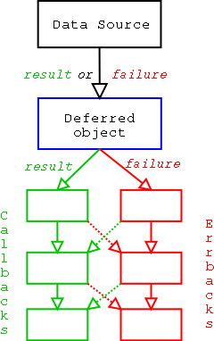

# 编写TCP服务端

此章节解释如何使用Twisted在TCP服务上实现网络协议解析和处理（同样可以在SSL和Unix socket servers上复用此代码），对于UDP有单独的文档 -- [UDP](https://twistedmatrix.com/documents/current/core/howto/udp.html) 

编写协议处理类通常继承 `twisted.internet.protocol.Protocol`，大部分协议继承自此类或它的子类。协议类的实例按需为每个连接实例化，并在连接完成后消失。这意味着持久配置不会保存在中`Protocol`。

持久配置保存在一个`Factory`类中，该类通常从`Twisted.internet.Protocol.Factory`继承。`Factory`的`buildProtocol`方法用于为每一个新连接创建一个协议`Protocol`

它能够在多个端口或网络地址提供同样的服务。这是为什么`Factory`不监听连接，并且实际上也不需要知道任何有关网络的东西。

## Protocol(协议)

Twisted 协议以异步的方式处理数据，当事件(events)从网路到达，协议(protocol)对事件进行响应,事件到达并调用协议(protocol)上的方法(methods)


### 使用

#### `dataReceived()`

参数：

`data`: 从客户端接受的数据


```
接受客户端发来的数据
```


```python
from twisted.internet.protocol import Protocol
class Echo(Procotol):
    def dataReceived(self, data):
        self.transport.write(data)
```

这是一个最简单的协议。它简单的会写发给它的数据，不响应所有事件。


#### `connectionMade()`

```
连接建立时执行此方法
```


#### `transport.loseConnection()`


关闭连接仅当所有数据被Twisted写入操作系统，所有可以安全的使用此方法来关闭连接而不必担心已写入`transport`的数据丢失。如果传输使用了[生产者](https://twistedmatrix.com/documents/current/core/howto/producers.html)，`loseConnection`则只有在该生产者未注册时才关闭连接。


#### `transport.abortConnection()`

在某些情况下，等待直到所有数据都被写出并不是我们想要的。由于网络故障，连接另一端的错误或恶意，写入传输的数据可能无法传递，因此即使`loseConnection`被称为连接也不会丢失。在这些情况下，`abortConnection`可以使用：无论传输中仍未写入的缓冲数据还是仍在注册的生产者，它都会立即关闭连接。请注意，`abortConnection`仅在Twisted 11.1和更高版本中可用。


```python
from twisted.internet.protocol import Protocol
class QOTD(Protocol):
    def connectionMade(self):
        self.transport.write("An apple a day keeps the doctor away\r\n")
        self.transport.loseConnection()
```

上面的协议以一句名言响应初始连接，然后中断连接。

telnet 测试结果：

```
Trying 127.0.0.1...
Connected to localhost.
Escape character is '^]'.
An apple a day keeps the doctor away
Connection closed by foreign host.
```


#### `connectionLost()`

当连接丢失时，twisted调用此方法

```python
from twisted.internet.protocol import Protocol

class Echo(Protocol):

    def __init__(self, factory):
        self.factory = factory

    def connectionMade(self):
        self.factory.numProtocols = self.factory.numProtocols + 1
        self.transport.write(
            "Welcome! There are currently %d open connections.\n" %
            (self.factory.numProtocols,))

    def connectionLost(self, reason):
        self.factory.numProtocols = self.factory.numProtocols - 1

    def dataReceived(self, data):
        self.transport.write(data)
```

使用`connectionMade`  和 `connectionLost` 方法来记录当前的连接数


```python
from twisted.internet.protocol import Factory
from twisted.internet.endpoints import TCP4ServerEndpoint
from twisted.internet import reactor

class QOTDFactory(Factory):
    def buildProtocol(self, addr):
        return QOTD()

# 8007 is the port you want to run under. Choose something >1024
endpoint = TCP4ServerEndpoint(reactor, 8007)
endpoint.listen(QOTDFactory())
reactor.run()
```

你可以在终端使用`Ctrl + C`或在代码中使用`reactor.stop()` 来停止`reactor`


### Helper Protocol(辅助协议)

许多协议都建立在类似的低层级的抽象之上

例如，许多流行的Internet协议都是基于行的，包含以换行符终止的文本数据（通常为CR-LF），而不是包含直接的原始数据。但是，相当多的协议是混合这两种-它们有基于行的部分，也有原始数据部分。


[LineReceiver](https://twistedmatrix.com/documents/20.3.0/api/twisted.protocols.basic.LineReceiver.html)协议。该协议调度到两个不同的事件处理程序 `lineReceived`和`rawDataReceived`。默认情况下，`lineReceived`每行只调用一次。但是，如果`setRawMode`被调用，则协议将`rawDataReceived`一直调用直到`setLineMode`被调用，这会将其返回给using `lineReceived`。它还提供`sendLine`方法将数据以及该类用于分隔行的定界符（默认为`\r\n`）写入传输。


```python
from twisted.protocols.basic import LineReceiver

class Answer(LineReceiver):

    answers = {'How are you?': 'Fine', None: "I don't know what you mean"}

    def lineReceived(self, line):
        if line in self.answers:
            self.sendLine(self.answers[line])
        else:
            self.sendLine(self.answers[None])
```

请注意，定界符不是该行的一部分。


其他辅助协议如：[基于网串的协议](https://twistedmatrix.com/documents/20.3.0/api/twisted.protocols.basic.NetstringReceiver.html)和[前缀消息长度协议](https://twistedmatrix.com/documents/20.3.0/api/twisted.protocols.basic.IntNStringReceiver.html)。


### State Machines(状态机)

许多Twisted协议处理程序都需要编写状态机来记录其所处的状态。以下是一些有助于编写状态机的建议：

- 不要编写大型状态机。最好编写一个状态机，一次处理一个抽象级别。
- 不要将应用程序专用代码与协议处理代码混合使用。当协议处理程序必须进行特定于应用程序的调用时，请将其保留为方法调用。


## Factories(工厂)

### 更简单的协议创建

对于只实例化特定协议类实例的工厂，有一种更简单的方法来实现工厂。`buildProtocol`方法的默认实现是调用`Factory`(工厂)的`protocol`属性来创建协议实例，并在协议实例对象上设置一个`factory`属性指向`Factory`自己。这可。以让每一个协议实例类访问，修改持久化的配置

```python
from twisted.internet.protocol import Factory, Protocol
from twisted.internet.endpoints import TCP4ServerEndpoint
from twisted.internet import reactor

class QOTD(Protocol):

    def connectionMade(self):
        # self.factory was set by the factory's default buildProtocol:
        self.transport.write(self.factory.quote + '\r\n')
        self.transport.loseConnection()


class QOTDFactory(Factory):

    # This will be used by the default buildProtocol to create new protocols:
    protocol = QOTD

    def __init__(self, quote=None):
        self.quote = quote or 'An apple a day keeps the doctor away'

endpoint = TCP4ServerEndpoint(reactor, 8007)
endpoint.listen(QOTDFactory("configurable quote"))
reactor.run()
```

如果您只需要一个简单的工厂即可构建协议而没有任何其他行为，则Twisted 13.1添加了[Factory.forProtocol](https://twistedmatrix.com/documents/20.3.0/api/twisted.internet.protocol.Factory.forProtocol.html)，这是一种更为简单的方法。

### 工厂启动和关闭

工厂有两种方法来执行特定于应用程序的构建和拆除（由于工厂经常存在，因此通常不宜在`__init__`或中进行操作`__del__`，并且通常为时过早或为时太晚）。

这是一个工厂的示例，该工厂允许其协议写入一个特殊的日志文件：

```python
from twisted.internet.protocol import Factory
from twisted.protocols.basic import LineReceiver


class LoggingProtocol(LineReceiver):

    def lineReceived(self, line):
        self.factory.fp.write(line + '\n')


class LogfileFactory(Factory):

    protocol = LoggingProtocol

    def __init__(self, fileName):
        self.file = fileName

    def startFactory(self):
        self.fp = open(self.file, 'a')

    def stopFactory(self):
        self.fp.close()
```


### 案例：聊天服务器(chat.py)

```python
# coding: utf-8

from twisted.internet.protocol import Factory
from twisted.protocols.basic import LineReceiver
from twisted.internet import reactor

class Chat(LineReceiver):
    def __init__(self, users):
        self.users = users
        self.name = None
        self.state = "GETNAME"

    def connectionMade(self):
        self.sendLine(b"What's your name?")

    def connectionLost(self, reason):
        if self.name in self.users:
            del self.users[self.name]

    def lineReceived(self, line):
        print(line)
        if self.state == "GETNAME":
            self.handle_GETNAME(line.decode())
        else:
            self.handle_CHAT(line.decode())

    def handle_GETNAME(self, name):
        if name in self.users:
            self.sendLine(b"Name taken, please choose another.")
            return
        self.sendLine(("Welcome, %s!" %(name,)).encode())
        self.name = name
        self.users[name] = self
        self.state = "CHAT"

    def handle_CHAT(self, message):
        message = ("<%s> %s" %(self.name, message)).encode()
        for name, protocol in self.users.items():
            if protocol != self:
                protocol.sendLine(message)

class ChatFactory(Factory):

    def __init__(self):
        self.users = {}

    def buildProtocol(self, addr):
        return Chat(self.users)

reactor.listenTCP(8123, ChatFactory())
reactor.run()
```

您可能不熟悉的唯一API是`listenTCP`。 [listenTCP](https://twistedmatrix.com/documents/20.3.0/api/twisted.internet.interfaces.IReactorTCP.listenTCP.html)是将a连接`Factory`到网络的方法。这是[endpoints](https://twistedmatrix.com/documents/current/core/howto/endpoints.html)为您包装的较低级别的API 。


# 编写TCP客户端

## 概述

Twisted是一个设计得非常灵活的框架，可让您编写功能强大的客户端。这种灵活性的代价是编写客户端的方式中的几层。本文档介绍如何创建可用于TCP，SSL和Unix套接字的客户端。UDP [在另一个文档中介绍](https://twistedmatrix.com/documents/current/core/howto/udp.html)。

在基础上，实际实现协议解析和处理的地方是`Protocol`类。该类通常从[twisted.internet.protocol.Protocol](https://twistedmatrix.com/documents/20.3.0/api/twisted.internet.protocol.Protocol.html)派生。大多数协议处理程序都继承自此类或其便利子级之一。连接到服务器时，将实例化协议类的实例，并在连接完成时消失。这意味着持久配置不会保存在中 `Protocol`。

持久配置保存在一个`Factory`类中，[该类](https://twistedmatrix.com/documents/20.3.0/api/twisted.internet.protocol.Factory.html)通常继承自[twisted.internet.protocol.Factory](https://twistedmatrix.com/documents/20.3.0/api/twisted.internet.protocol.Factory.html) （或[twisted.internet.protocol.ClientFactory](https://twistedmatrix.com/documents/20.3.0/api/twisted.internet.protocol.ClientFactory.html)：请参见下文）。默认工厂类仅实例化`Protocol`，然后将协议的`factory`属性设置为指向自身（工厂）。这样就可以`Protocol`访问持久性配置，并可以对其进行修改。

## 协议（Protocol）

如上所述，此类与辅助类和函数的大多数代码位于此。Twisted协议以异步方式处理数据。这意味着协议从不等待事件，而是在事件从网络到达时对其进行响应。

协议示例：

```python
from twisted.internet.protocol import Protocol
from sys import stdout

class Echo(Protocol):
    def dataReceived(self, data):
        stdout.write(data)
```

这是只是一个最简单的协议，它仅仅回写收到的数据。协议有许多事件响应，下面是一个响应另一个事件的协议。

```python
from twisted.internet.protocol import Protocol

class WelcomeMessage(Protocol):
    def connectionMade(self):
        self.transport.write("Hello server, I am the client!\r\n")
        self.transport.loseConnection()
```

该协议连接服务器，发送一个欢迎信息，然后终止连接。

`connectionMade`事件发生在协议建立时也用于任何初始的问候（比如上面的`WelcomeMessage`协议）。任何特定协议对象的拆卸都在`connectionLost`事件中完成。、


## 简单的单连接客户端

在许多情况下，协议只需要连接一次，并且代码只需要获取连接的协议实例。这种情况[`twisted.internet.endpoints`](https://twistedmatrix.com/documents/20.3.0/api/twisted.internet.endpoints.html) api非常有用，特别是  [`connectProtocol`](https://twistedmatrix.com/documents/20.3.0/api/twisted.internet.endpoints.connectProtocol.html)只需要传递协议实例对象而不需要工厂对象就能实现连接。

```python
from twisted.internet import reactor
from twisted.internet.protocol import Protocol
from twisted.internet.endpoints import TCP4ClientEndpoint, connectProtocol

class Greeter(Protocol):
    def sendMessage(self, msg):
        self.transport.write(("MESSAGE %s\n" % msg).encode())

def gotProtocol(p):
    p.sendMessage(b"Hello")
    reactor.callLater(1, p.sendMessage, b"This is sent in a second")
    reactor.callLater(2, p.transport.loseConnection)

point = TCP4ClientEndpoint(reactor, "localhost", 1234)
d = connectProtocol(point, Greeter())
d.addCallback(gotProtocol)
reactor.run()
```

无论客户端endpoint的类型如何，建立新连接的方法就是将`endpoint`和`protocol`实例对象一起传递给`connectProtocol`。这意味着你很容易改变连接的机制，而不需要改变程序的余下部分。例如，你想在`SSL`上运行以上案例，只需要将`endpoint`的实例对象由[`SSL4ClientEndpoint`](https://twistedmatrix.com/documents/20.3.0/api/twisted.internet.endpoints.SSL4ClientEndpoint.html)替换为 `TCP4ClientEndpoint` .为了利用这一点，建立新连接的函数或方法需要接受一个端点`endpoint`作为参数并让调用者构造它，而不是传递`host`和`port`参数，并让它自己构造。

更多构造不同连接的`endpoint`，参考[the documentation for the endpoints API](https://twistedmatrix.com/documents/current/core/howto/endpoints.html) .

你可能会遇到代码中使用[`ClientCreator`](https://twistedmatrix.com/documents/20.3.0/api/twisted.internet.protocol.ClientCreator.html) 它是一个旧的api而且不如`endpoint`API灵活。

```python
from twisted.internet.protocol import ClientCreator

...

creator = ClientCreator(reactor, Greeter)
d = creator.connectTCP("localhost", 1234)
d.addCallback(gotProtocol)
reactor.run()
```

总而言之，编写新代码最好使用`endpoint`API，因为它可以让调用者选择连接方式。


## 客户端工厂(ClientFactory)

当然，仍有大量使用较低级别API的代码。并且在`endpoint`有许多特性（比如自动重连）没有重新实现。所以低级别的API还是有用武之地的。

要使用较低级别的连接API，您将需要直接调用 `Reactor.connect*`方法。对于下面的案例，您需要一个[`ClientFactory`](https://translate.googleusercontent.com/translate_c?depth=1&pto=aue&rurl=translate.google.com.hk&sl=auto&sp=nmt4&tl=zh-CN&u=https://twistedmatrix.com/documents/20.3.0/api/twisted.internet.protocol.ClientFactory.html&usg=ALkJrhg5gxs8amF4Vr3QIuGwm5aqeSVfag)。该`ClientFactory`负责创建的`Protocol`，并且还接收与连接状态的事件。这样，它就可以在发生连接错误时执行诸如重新连接之类的操作。这是一个`ClientFactory`使用`Echo`协议的简单示例，还显示了连接所处的状态。

```python
from twisted.internet.protocol import Protocol, ClientFactory
from sys import stdout

class Echo(Protocol):
    def dataReceived(self, data):
        stdout.write(data)

class EchoClientFactory(ClientFactory):
    def startedConnecting(self, connector):
        print('Started to connect.')

    def buildProtocol(self, addr):
        print('Connected.')
        return Echo()

    def clientConnectionLost(self, connector, reason):
        print('Lost connection.  Reason:', reason)

    def clientConnectionFailed(self, connector, reason):
        print('Connection failed. Reason:', reason)

from twisted.internet import reactor
reactor.connectTCP(host, port, EchoClientFactory())
reactor.run()

```

当连接不能建立时`clientConnectionFailed`被调用，当连接已经建立并且即将关闭时`clientConnectionLost`被调用


## Reactor Client API

### connectTCP

[`IReactorTCP.connectTCP`](https://twistedmatrix.com/documents/20.3.0/api/twisted.internet.interfaces.IReactorTCP.connectTCP.html) 为客户端提供IPv4和IPv6的支持。 `host`参数既接受主机名也接受IP地址。对于主机名，`reactor`会在连接之前自动解析为ip地址。这对于具有多个地址记录的主机名，尝试重新连接时可能不能解析到同一ip地址。这意味着每次连接尝试都有域名解析的时间开销。如果要许多短期连接（通常为每秒约数百或数千次连接），则可能需要先将主机名解析为一个地址，然后将地址传给`connectTCP`。


### Reconnection(重新连接)

通常，由于网络问题，客户端连接可能会无意间丢失，断开连接后重新连接的方法时调用`connector.connect()`:

```python
from twisted.internet.protocol import ClientFactory

class EchoClientFactory(ClientFactory):
    def clientConnectionLost(self, connector, reason):
        connector.connect()
```

作为第一个参数传递的`connector`是`connection`和`protocol`之间的接口。当连接失败`factory`会收到`clientConnectionLost`事件，`factory`可以调用`connector.connect()`来重新建立连接。

但是，大多数实现此功能的程序都应该继承[`ReconnectingClientFactory`](https://twistedmatrix.com/documents/20.3.0/api/twisted.internet.protocol.ReconnectingClientFactory.html)，它在连接丢失或失败时，会在指数级的延迟后重新连接。

```python
from twisted.internet.protocol import Protocol, ReconnectingClientFactory
from sys import stdout

class Echo(Protocol):
    def dataReceived(self, data):
        stdout.write(data)

class EchoClientFactory(ReconnectingClientFactory):
    def startedConnecting(self, connector):
        print('Started to connect.')

    def buildProtocol(self, addr):
        print('Connected.')
        print('Resetting reconnection delay')
        self.resetDelay()
        return Echo()

    def clientConnectionLost(self, connector, reason):
        print('Lost connection.  Reason:', reason)
        ReconnectingClientFactory.clientConnectionLost(self, connector, reason)

    def clientConnectionFailed(self, connector, reason):
        print('Connection failed. Reason:', reason)
        ReconnectingClientFactory.clientConnectionFailed(self, connector,reason)

```


## 进一步阅读

这一章节的`Protocol`类都是基于`IProtocol`的实现。API文档：[IProtocol](https://twistedmatrix.com/documents/20.3.0/api/twisted.internet.interfaces.IProtocol.html) .

`transport`属性是给基于`ITCPTransport`接口的实现。API文档： [ITCPTransport](https://twistedmatrix.com/documents/20.3.0/api/twisted.internet.interfaces.ITCPTransport.html) .

接口类指定具体对象拥有的方法和行为。参考 [Components: Interfaces and Adapters](https://twistedmatrix.com/documents/current/core/howto/components.html) 了解twisted中接口的信息。


# UDP网络

## 概述

与TCP不同，UDP没有连接概念。UDP套接字可以从网络上的任何服务器接收数据报，并将数据报发送到网络上的任何主机。另外，数据报可以以任何顺序到达，也可能根本不会到达，或者在传输中被复制而收到相同的。

由于没有连接，因此对于每个UDP套接字，我们只使用一个对象，一个协议。然后，我们使用[`twisted.internet.interfaces.IReactorUDP`](https://zqdtsvhrzxjtvwos62tp4kzjia-ac4c6men2g7xr2a-twistedmatrix-com.translate.goog/documents/21.2.0/api/twisted.internet.interfaces.IReactorUDP.html)反应堆API ，通过反应堆将该协议连接到UDP传输。


## 数据报文协议

实际实现协议解析和处理的类通常为[`twisted.internet.protocol.DatagramProtocol`](https://zqdtsvhrzxjtvwos62tp4kzjia-ac4c6men2g7xr2a-twistedmatrix-com.translate.goog/documents/21.2.0/api/twisted.internet.protocol.DatagramProtocol.html)


# 测试

参考 https://twistedmatrix.com/documents/current/core/howto/trial.html


# 核心

## `twisted.internet.defer`

### Deferreds (延迟调用)

Twisted 使用 [Deferred](https://twistedmatrix.com/documents/20.3.0/api/twisted.internet.defer.Deferred.html) 对象来管理回调序列。客户端应用程序将一系列函数添加到延迟调用，以便异步请求的结果可用时按顺序调用（这一系列函数称为 `callbacks`或`callback chain`，同样存在一系列函数（称为`errbacks` 或 `errback chain`）添加到延迟调用，以便异步请求出现错误时调用。异步库代码在结果可用时调用调用首个`callback`，在发生错误时调用第一个`errback`，`Deferred`对象将每个`callback`或`errback`函数的结果传递给链中的下一个函数。


### Callback(回调)

一个[twisted.internet.defer.Deferred](https://translate.googleusercontent.com/translate_c?depth=1&pto=aue&rurl=translate.google.com.hk&sl=auto&sp=nmt4&tl=zh-CN&u=https://twistedmatrix.com/documents/20.3.0/api/twisted.internet.defer.Deferred.html&usg=ALkJrhgth89opEI_-7P-EviV5YHhMxn-Ng)是一个承诺(promise)，一个函数会在某个时刻有一个结果。我们可以将回调函数附加到Deferred，一旦得到结果，这些回调将被调用。另外，Deferreds允许开发人员注册错误的回调，并具有记录错误的默认行为。延迟机制通过各种阻塞或延迟的操作来标准化应用程序程序员的界面。

```python
from twisted.internet import reactor, defer

def getDummyData(inputData):
    """
    This function is a dummy which simulates a delayed result and
    returns a Deferred which will fire with that result. Don't try too
    hard to understand this.
    """
    print('getDummyData called')
    deferred = defer.Deferred()
    # simulate a delayed result by asking the reactor to fire the
    # Deferred in 2 seconds time with the result inputData * 3
    reactor.callLater(2, deferred.callback, inputData * 3)
    return deferred

def cbPrintData(result):
    """
    Data handling function to be added as a callback: handles the
    data by printing the result
    """
    print('Result received: {}'.format(result))

deferred = getDummyData(3)
deferred.addCallback(cbPrintData)

# manually set up the end of the process by asking the reactor to
# stop itself in 4 seconds time
reactor.callLater(4, reactor.stop)
# start up the Twisted reactor (event loop handler) manually
print('Starting the reactor')
reactor.run()
```

结果：注意看结果的输出顺序`Starting the reactor`并没有先打印

```
getDummyData called
Starting the reactor
Result received: 9
```


#### 多个回调

可以将多个回调添加到Deferred。Deferred的回调链中的第一个回调将以结果调用，第二个以第一个回调的结果调用，依此类推。我们为什么需要这个？好吧，考虑一下[twisted.enterprise.adbapi](https://translate.googleusercontent.com/translate_c?depth=1&pto=aue&rurl=translate.google.com.hk&sl=auto&sp=nmt4&tl=zh-CN&u=https://twistedmatrix.com/documents/20.3.0/api/twisted.enterprise.adbapi.html&usg=ALkJrhhVRIxYkmKMKk_ET9nDeSqncXkTxw)返回的Deferred -SQL查询的结果。一个Web小部件可能会添加一个回调函数，将该结果转换为HTML，并传递Deferred向前传递，其中，该回调函数将被`twisted`使用，以将结果返回给HTTP客户端。如果发生错误或异常，将绕过回调链。

某一层回调函数发生错误，不会退出，而是调用下一层回调函数中的`errback`并将错误结果传给它。

```python
from twisted.internet import reactor, defer

class Getter:
    def gotResults(self, x):
        """
        The Deferred mechanism provides a mechanism to signal error
        conditions.  In this case, odd numbers are bad.

        This function demonstrates a more complex way of starting
        the callback chain by checking for expected results and
        choosing whether to fire the callback or errback chain
        """
        if self.d is None:
            print("Nowhere to put results")
            return

        d = self.d
        self.d = None
        if x % 2 == 0:
            d.callback(x*3)
        else:
            d.errback(ValueError("You used an odd number!"))

    def _toHTML(self, r):
        """
        This function converts r to HTML.

        It is added to the callback chain by getDummyData in
        order to demonstrate how a callback passes its own result
        to the next callback
        """
        return "Result: %s" % r

    def getDummyData(self, x):
        """
        The Deferred mechanism allows for chained callbacks.
        In this example, the output of gotResults is first
        passed through _toHTML on its way to printData.

        Again this function is a dummy, simulating a delayed result
        using callLater, rather than using a real asynchronous
        setup.
        """
        self.d = defer.Deferred()
        # simulate a delayed result by asking the reactor to schedule
        # gotResults in 2 seconds time
        reactor.callLater(2, self.gotResults, x)
        self.d.addCallback(self._toHTML)
        return self.d

def cbPrintData(result):
    print(result)

def ebPrintError(failure):
    import sys
    sys.stderr.write(str(failure))

# this series of callbacks and errbacks will print an error message
g = Getter()
d = g.getDummyData(3)
d.addCallback(cbPrintData)
d.addErrback(ebPrintError)

# this series of callbacks and errbacks will print "Result: 12"
g = Getter()
d = g.getDummyData(4)
d.addCallback(cbPrintData)
d.addErrback(ebPrintError)

reactor.callLater(4, reactor.stop)
reactor.run()
```


1. Requesting method (data sink) requests data, gets Deferred object.
2. Requesting method attaches callbacks to Deferred object.



1. When the result is ready, give it to the Deferred object. `.callback(result)` if the operation succeeded, `.errback(failure)` if it failed. Note that `failure` is typically an instance of a [twisted.python.failure.Failure](https://twistedmatrix.com/documents/20.3.0/api/twisted.python.failure.Failure.html) instance.
2. Deferred object triggers previously-added (call/err)back with the `result` or `failure`. Execution then follows the following rules, going down the chain of callbacks to be processed.
   - Result of the callback is always passed as the first argument to the next callback, creating a chain of processors.
   - If a callback raises an exception, switch to errback.
   - An unhandled failure gets passed down the line of errbacks, this creating an asynchronous analog to a series to a series of `except:` statements.
   - If an errback doesn’t raise an exception or return a [twisted.python.failure.Failure](https://twistedmatrix.com/documents/20.3.0/api/twisted.python.failure.Failure.html) instance, switch to callback.


### Errbacks

Deferred的错误处理以Python的异常处理为模型。在没有错误发生的情况下，如上所述，所有回调都一个接一个地运行。

如果调用了errback而不是回调（例如，由于数据库查询引发了错误），则会将[twisted.python.failure.Failure](https://translate.googleusercontent.com/translate_c?depth=1&pto=aue&rurl=translate.google.com.hk&sl=auto&sp=nmt4&tl=zh-CN&u=https://twistedmatrix.com/documents/20.3.0/api/twisted.python.failure.Failure.html&usg=ALkJrhhpvk24Z68sPDlc3KZZyo9EXbHBcg)传递给第一个errback（您可以添加多个errback，就像回调一样）。您可以将自己的错误视为`except`普通的Python代码块。

除非您`raise`在except块中明确指出错误，否则将`Exception`捕获并停止传播，然后继续正常执行。同样的事情发生与errbacks：除非您明确`return`一个`Failure`或（重新）抛出一个异常，停止错误传播，和正常的回调继续从该点执行（使用从errback可返回的值）。如果errback确实返回了a `Failure`或引发了异常，则该异常将传递给下一个errback，依此类推。

*注意：*如果errback不返回任何内容，则它有效地返回`None`，这意味着在此errback之后`callbacks`将继续执行。这可能不是您期望的那样，所以要小心。确保您的错误返回一个`Failure`（可能是传递给它的），或下一个回调的有意义的返回值。

另外，[twisted.python.failure.Failure](https://translate.googleusercontent.com/translate_c?depth=1&pto=aue&rurl=translate.google.com.hk&sl=auto&sp=nmt4&tl=zh-CN&u=https://twistedmatrix.com/documents/20.3.0/api/twisted.python.failure.Failure.html&usg=ALkJrhhpvk24Z68sPDlc3KZZyo9EXbHBcg)实例具有一个有用的方法，称为trap，可让您有效地执行以下操作：

```python
try:
    # code that may throw an exception
    cookSpamAndEggs()
except (SpamException, EggException):
    # Handle SpamExceptions and EggExceptions
    ...
```

您可以这样操作：

```python
def errorHandler(failure):
    failure.trap(SpamException, EggException)
    # Handle SpamExceptions and EggExceptions

d.addCallback(cookSpamAndEggs)
d.addErrback(errorHandler)
```

如果传递给`failure.trap`的参数不匹配当前的异常（错误），将重新引发该异常（错误）


#### 回调陷阱

```python
# Case 1
d = getDeferredFromSomewhere()
d.addCallback(callback1)       # A
d.addErrback(errback1)         # B
d.addCallback(callback2)
d.addErrback(errback2)

# Case 2
d = getDeferredFromSomewhere()
d.addCallbacks(callback1, errback1)  # C
d.addCallbacks(callback2, errback2)
```

案例1 中如果 `callback1`发生异常，将会调用`errback1`处理错误`failure`

案例2 中如果`callback1`发生异常，不会调用`errback1`处理错误`failure`，而是调用`errback2`处理异常`failure`。只有`getDeferredFromSomewhere`发生错误才会调用`errback1`处理异常`failure`。


#### Unhandled Errors(未处理的错误)

如果`Deferred`被垃圾回收并且带有未处理的错误（即有一个错误等待下一个`errback`调用，而当前没有可用的`errback`），`Twisted`将会将错误的回溯`traceback`写入日志文件，这样就可以在不添加`errback`的情况下仍能记录错误日志。如果在周围保留对`Deferred`的引用，以防止被垃圾回收，则您可能永远看不到错误（而且您的回调似乎也从未被调用过）。如果不确定，您应该在回调之后显式添加一个errback，即:

```python
# Make sure errors get logged
from twisted.python import log
d.addErrback(log.err)
```


### 处理同步或异常结果

我们最初的实现`authenticateUser`期望   `isValidUser`是同步的，但是现在我们需要更改它以处理的同步和异步实现`isValidUser`。为此，我们使用[maybeDeferred](https://translate.googleusercontent.com/translate_c?depth=1&pto=aue&rurl=translate.google.com.hk&sl=auto&sp=nmt4&tl=zh-CN&u=https://twistedmatrix.com/documents/20.3.0/api/twisted.internet.defer.maybeDeferred.html&usg=ALkJrhhYPGlKUGSUNbE7AUfDYYm5FMiqFQ)来调用`isValidUser`，以确保`isValidUser`即使`isValidUser`是同步函数，其结果也是`Deferred` ：

```python
# coding: utf-8
from twisted.internet import defer, reactor

def printResult(result):
    if result:
        print("User is authenticated")
    else:
        print("User is not authenticated")


def aysnchronousIsValidUser(user):
    d = defer.Deferred()
    reactor.callLater(2, d.callback, user in ["Alice", "Angus", "Agnes"])
    return d

def synchronousIsValidUser(user):
    return user in ["Alice", "Angus", "Agnes"]


def authenticateUser(isValidUser, user):
    d = defer.maybeDeferred(isValidUser, user)
    d.addCallback(printResult)
    reactor.callLater(3, d.addCallback, lambda _: reactor.stop())


# 异步
# authenticateUser(aysnchronousIsValidUser ,'Alice')
# reactor.run()

# 同步
authenticateUser(synchronousIsValidUser, 'user')
reactor.run()

```

现在`isValidUser`可以是`synchronousIsValidUser`或`asynchronousIsValidUser`。

还可以修改`synchronousIsValidUser`以返回Deferred，有关更多信息，请参见[生成Deferreds](https://translate.googleusercontent.com/translate_c?depth=1&pto=aue&rurl=translate.google.com.hk&sl=auto&sp=nmt4&tl=zh-CN&u=https://twistedmatrix.com/documents/current/core/howto/gendefer.html&usg=ALkJrhgd_U_jJZH0_uy0aMQJ-UsNL7GYYw)。

### Cancellation(取消)

#### 动机

延期可能要花费任何时间才能被收回；实际上，它可能永远不会被回调。您的用户可能没有那么耐心。由于延迟完成时采取的所有操作都在您的应用程序或库的回调代码中，因此如果时间太长，您始终可以选择不理会结果。但是，尽管您忽略了它，但由Deferred表示的底层操作仍在后台运行，可能会消耗CPU时间，内存，网络带宽甚至磁盘空间等资源。因此，当用户关闭窗口时、点击“取消”按钮、与服务器断开连接或发送“停止”网络消息时，您可能想不在处理操作结果，以便Deferred的发起者可以清理所有内容并释放这些资源以更好地使用。


#### Cancellation for Applications which Consume Deferreds(取消使用延期的应用程序)

下面是一个网络程序实例，有时候连接外部的某个主机可能非常慢，你在应用程序设置了一个”取消“按钮来终止连接，用户可以点击此按钮来停止当前连接而切换到另一个主机。下面是一个此类的一个简单草图。

```python
def startConnecting(someEndpoint):
    def connected(it):
        "Do something useful when connected."
    return someEndpoint.connect(myFactory).addCallback(connected)
# ...
connectionAttempt = startConnecting(endpoint)
def cancelClicked():
    connectionAttempt.cancel()
```

显然（我希望），startConnecting是由某个UI元素调用的，该UI元素使用户可以选择要连接到的主机，然后构造一个合适的端点（也许使用`twisted.internet.endpoints.clientFromString`）。然后，将取消按钮或类似按钮连接到`cancelClicked`。

当`connectionAttempt.cancel`被调用时，它将：

1. 导致低层操作终止，如果低层操作正在进行
2. 使`connectionAttemp Deferred`以一种或另一种方式及时完成
3. 可能导致 `connection Deferred`以`CanceledError`调用`errback`

您可能会注意到，这组结果非常严格。尽管取消表明调用API *希望*停止基础操作，但是基础操作不一定会立即做出反应。即使在这个非常简单的示例中，也已经存在不可中断的一件事：本地平台名称解析阻塞，因此需要在线程中执行；如果连接操作卡在等待名称解析这种方式，则无法取消该连接操作。因此，您要取消的Deferred可能不会立即`callback`或`errback`。


一个`Deferred`可以在其回调链中的任何一点上等待另一个Deferred（请参见上面的“处理...异步结果”）。回调链中的特定点无法知道一切是否完成。由于回调链的多个层可能希望取消相同的Deferred，因此任何层都可以`.cancel()`随时调用。`.cancel()`方法从不引发任何异常或返回任何值；您可能会反复调用它，即使在已经触发或没有剩余`callback`s的`Deferred`上也是如此。除特定示例外，所有这些限定的主要原因是，实例化Deferred的任何人都可以为其提供取消功能；该功能绝对可以做它想要做的任何事情。理想情况下，它所做的一切都将停止您请求的操作，但是无法保证所有有关Deferred的确切行为都取消。取消`Deferred`是最大的努力。可能由于多种原因导致以下情况：

1. `Deferred`不知道如何取消低层操作
2. 低层操作可能达到了不可取消的状态，因为已经完成了一些不可逆的操作
3. `Deferred`已经产生结果，所以没什么可取消。

无论是否可以取消，调用`cancel()`都会成功，上面的案例可能会产生一个`twisted.internet.defer.CancelledError`的`errback`，而低层操作仍在进行。在某些无法取消的情况下，支持取消的`Deferred`应该记录取消的操作。

如果被取消的`Deferred`正在等待另一个`Deferred`，则取消将被转发给另一个`Deferred`

#### 默认的取消行为

所有的`Deferred`都支持取消，但默认情况下只支持最基本的取消形式，这种形式不会释放任何资源。

没有指定取消方式的默认Deferred案例

```python
operation = Deferred()
def x(result):
    print("Hooray, a result:" + repr(x))
operation.addCallback(x)
# ...
def operationDone():
    operation.callback("completed")
```

1. 接收到的API的调用者`operation`可以对其进行调用`cancel`。由于`operation`没有指定取消函数，因此会发生以下两种情况之一。

   1. 如果`operationDone`已经调用，并且操作已完成，则不会有太大变化。 `operation`仍然会有结果，并且没有更多的回调，因此行为上没有明显的变化。

   2. 如果`operationDone`尚未被调用，则`operation`将会立即产生一个`CancelledError`的`errback` 。

      但是，一旦取消，就无法阻止`operationDone`运行。它将最终会调用`operation.callback`。在正常操作中，调用已经调用`callback`的`Deferred`会引发`AlreadyCalledError`错误，这将导致无法捕获的丑陋的回溯(`traceback`)。因此，`.callback`可以在已经调用取消但没有指定取消函数的`Deferred`上调用一次，造成无操作(no-op) 。如果多次调用它，您仍然会遇到`AlreadyCalledError`异常。

> `Deferred`调用取消后，加入新的`callback`仍会执行。


#### 创建可取消的`Deferred`：自定义取消函数

假设您正在实现一个HTTP客户端，该客户端将使用服务器的响应返回Deferred触发。最好通过关闭连接来实现取消。为了使取消做到这一点，您要做的就是将一个函数传递给Deferred的构造函数（它将被取消的Deferred调用）：

```python
class HTTPClient(Protocol):
    def request(self, method, path):
        self.resultDeferred = Deferred(
            lambda ignore: self.transport.abortConnection())
        request = b"%s %s HTTP/1.0\r\n\r\n" % (method, path)
        self.transport.write(request)
        return self.resultDeferred

    def dataReceived(self, data):
        # ... parse HTTP response ...
        # ... eventually call self.resultDeferred.callback() ...
```

现在，如果有人呼吁`cancel()`在`Deferred`从返回`HTTPClient.request()`的HTTP请求将被取消（假设它不是太晚了这样做）。请注意不要在已被取消的Deferred上调用`callback()`。


#### 超时

超时是一种特殊的取消。一个方便的API可以使用[Deferred.addTimeout](https://twistedmatrix.com/documents/20.3.0/api/twisted.internet.defer.Deferred.addTimeout.html&usg=ALkJrhhjMEeXAqdr_nJYs6OjQv3XwWwjlA)。默认情况下，如果[Deferred](https://translate.googleusercontent.com/translate_c?depth=1&pto=aue&rurl=translate.google.com.hk&sl=auto&sp=nmt4&tl=zh-CN&u=https://twistedmatrix.com/documents/20.3.0/api/twisted.internet.defer.Deferred.html&usg=ALkJrhgth89opEI_-7P-EviV5YHhMxn-Ng)在`timeout`秒时间内未触发（使用errback或callback），它将失败并显示[TimeoutError](https://translate.googleusercontent.com/translate_c?depth=1&pto=aue&rurl=translate.google.com.hk&sl=auto&sp=nmt4&tl=zh-CN&u=https://twistedmatrix.com/documents/20.3.0/api/twisted.internet.defer.TimeoutError.html&usg=ALkJrhjso-HSIK5Gj__8AvBoJRxoAmsdbw)。

```python
import random
from twisted.internet import task

def f():
    return "Hopefully this will be called in 3 seconds or less"

def main(reactor):
    delay = random.uniform(1, 5)

    def called(result):
        print("{0} seconds later:".format(delay), result)

    d = task.deferLater(reactor, delay, f)
    d.addTimeout(3, reactor).addBoth(called)

    return d

# f() will be timed out if the random delay is greater than 3 seconds
task.react(main)
```

[Deferred.addTimeout](https://translate.googleusercontent.com/translate_c?depth=1&pto=aue&rurl=translate.google.com.hk&sl=auto&sp=nmt4&tl=zh-CN&u=https://twistedmatrix.com/documents/20.3.0/api/twisted.internet.defer.Deferred.addTimeout.html&usg=ALkJrhhjMEeXAqdr_nJYs6OjQv3XwWwjlA)在后台使用[Deferred.cancel](https://translate.googleusercontent.com/translate_c?depth=1&pto=aue&rurl=translate.google.com.hk&sl=auto&sp=nmt4&tl=zh-CN&u=https://twistedmatrix.com/documents/20.3.0/api/twisted.internet.defer.Deferred.cancel.html&usg=ALkJrhiZQMUNn4Zbn5DrMr2Oy5MGJbL3cw)函数，但是可以区分用户对[Deferred.cancel](https://translate.googleusercontent.com/translate_c?depth=1&pto=aue&rurl=translate.google.com.hk&sl=auto&sp=nmt4&tl=zh-CN&u=https://twistedmatrix.com/documents/20.3.0/api/twisted.internet.defer.Deferred.cancel.html&usg=ALkJrhiZQMUNn4Zbn5DrMr2Oy5MGJbL3cw)和由于超时而导致的取消。默认情况下，[Deferred.addTimeout](https://translate.googleusercontent.com/translate_c?depth=1&pto=aue&rurl=translate.google.com.hk&sl=auto&sp=nmt4&tl=zh-CN&u=https://twistedmatrix.com/documents/20.3.0/api/twisted.internet.defer.Deferred.addTimeout.html&usg=ALkJrhhjMEeXAqdr_nJYs6OjQv3XwWwjlA)将超时产生的[CancelledError](https://translate.googleusercontent.com/translate_c?depth=1&pto=aue&rurl=translate.google.com.hk&sl=auto&sp=nmt4&tl=zh-CN&u=https://twistedmatrix.com/documents/20.3.0/api/twisted.internet.defer.CancelledError.html&usg=ALkJrhi8RECfVAGwz7Tcy3_j0sxKcOC_Zg)转换为[TimeoutError](https://translate.googleusercontent.com/translate_c?depth=1&pto=aue&rurl=translate.google.com.hk&sl=auto&sp=nmt4&tl=zh-CN&u=https://twistedmatrix.com/documents/20.3.0/api/twisted.internet.error.TimeoutError.html&usg=ALkJrhgPb_fJ4LkbXCtQjsCjmI_iV-oK2A)。

但是，如果你自定以的`Deferred`提供了自定义取消函数，那么取消它不会产生`CancelledError`。在这种情况下，`Deferred.addTimeout`保留自定义取消函数产生的`callback`或`errback`值，这可以用于在出错的情况下返回一个默认值。

`Deferred.addTimeout`有一个可选的参数`onTimeoutCancel`用于`Deferred`超时时调用，如果超时前`Deferred`被取消`onTimeoutCancel`不会被调用。传递给`onTimeoutCancel`的有两个参数`result`(结果，可能是`CancelledError Failure`)和`timeout`(超时时间)。如果取消或超时没有导致错误，但是您仍然想记录超时，则此功能很有用。它也可以用来改变返回值。

```python
from twisted.internet import task, defer

def logTimeout(result, timeout):
    print("Got {0!r} but actually timed out after {1} seconds".format(
        result, timeout))
    return result + " (timed out)"

def main(reactor):
    # generate a deferred with a custom canceller function, and never
    # never callback or errback it to guarantee it gets timed out
    d = defer.Deferred(lambda c: c.callback("Everything's ok!"))
    d.addTimeout(2, reactor, onTimeoutCancel=logTimeout)
    d.addBoth(print)
    return d

task.react(main)
```

> 注意：`Deferred.addTimeout`添加到回调链的位置决定回调链中的多少会回调收到超时影响。超时影响所有调用`addTimeout`之前添加到`Deferred`的`callback`和`errback`，之后的不受影响，一旦它开始执行，超时就开始计数。


### DeferredList

有时候你想所有时间执行完成后通知你，而不是等其中的一个。例如，你需要所有的连接关闭后通知你。使用[twisted.internet.defer.DeferredList](https://twistedmatrix.com/documents/20.3.0/api/twisted.internet.defer.DeferredList.html) 是最好的方式。

为多个Deferred创建一个DeferredList，你只需简单的用列表传递所有的`Deferred`

```python
# Creates a DeferredList
dl = defer.DeferredList([deferred1, deferred2, deferred3])
```

你可以将`DeferredList`视为一个普通的`Deferred`，你可以添加`callback`和`errback`，`DeferredList`会在所有`Deferred`完成后调动它们。它会将所有`Deferred`的结果用列表传递给回调函数。

```python
# A callback that unpacks and prints the results of a DeferredList
def printResult(result):
    for (success, value) in result:
        if success:
            print('Success:', value)
        else:
            print('Failure:', value.getErrorMessage())

# Create three deferreds.
deferred1 = defer.Deferred()
deferred2 = defer.Deferred()
deferred3 = defer.Deferred()

# Pack them into a DeferredList
dl = defer.DeferredList([deferred1, deferred2, deferred3], consumeErrors=True)

# Add our callback
dl.addCallback(printResult)

# Fire our three deferreds with various values.
deferred1.callback('one')
deferred2.errback(Exception('bang!'))
deferred3.callback('three')

# At this point, dl will fire its callback, printing:
#    Success: one
#    Failure: bang!
#    Success: three
# (note that defer.SUCCESS == True, and defer.FAILURE == False)
```

> 标准的`DeferredList`调用回调链不会调用`errback`，因为`DeferredList`的初始结果永远是一个list。


> 注意：如果在添加`Deferred`到`DeferredList`之后再添加`callback`或`errback`，其对结果的修改不会给`DeferredList`，因为在初始化`DeferredList`时会每个`Deferred`添加一组`(callback，errback)`来触发`DeferredList`记录结果。

#### 其他行为

`DeferredList`构造函数关键字参数：

`fireOnOneCallback=False`: 为True表示只要有一个`Deferred`触发一个非错误的结果，`DeferredList`就会触发

`fireOnOneErrback=False`:  为True表示只要有一个`Deferred`触发一个错误结果，`DeferredList`就会触发。

`consumeError=False`: 为True会将所有触发一个错误结果的`Deferred`转换为一个结果为`None`的正确回调`callback`，注意：这个不会阻止`fireOnOneErrback`的行为

> 注意：当`DeferredList`已经触发回调，`DeferredList`中的`Deferred`默认不会取消，即即使`DeferredList`已经返回结果，未执行完的`Deferred`仍会继续执行，除非手动调用取消。

#### `defer.gatherResults`

DeferredList的常见用法是“加入”多个并行异步操作，所有操作均成功完成，则成功完成，或者其中任何一个操作失败，则失败。在这种情况下，[twisted.internet.defer.gatherResults](https://twistedmatrix.com/documents/20.3.0/api/twisted.internet.defer.gatherResults.html) 是一个很方便的方法:


```python
from twisted.internet import defer

d1 = defer.Deferred()
d2 = defer.Deferred()
d = defer.gatherResults([d1, d2], consumeErrors=True)

def cbPrintResult(result):
    print(result)

d.addCallback(cbPrintResult)

d1.callback("one")
# nothing is printed yet; d is still awaiting completion of d2
d2.callback("two")
# printResult prints ["one", "two"]

```

`consumeErrors`参数和`DeferredList`中的这个参数含义相同，建议使用时总是设置其为True，除非你继续添加回调（callbacks 或者 errbacks)或者你知道它们不会执行失败。

否者将导致一个`unhandled error`被twisted记录。


### `Chaining Deferreds`(链接延迟)

- 回调链返回`Deferred`

如果回调链返回`Deferred`，当前回调链将会暂停，直到返回的`Deferred`触发执行

```python
from twisted.internet.defer import Deferred

d1 = Deferred()
d2 = Deferred()

d1.addCallback(lambda x: print("d1:", x) or d2)
d1.addCallback(lambda x: print("d1-1:", x))
d2.addCallback(lambda x: print("d2:", x) or x)

d1.callback('d1 result')
d2.callback('d2 result')
```

```
d1: d1 result
d2: d2 result
d1-1: d2 result
```


- `chainDeferred(otherDeferred)`

将`otherDeferred`添加到当前`Deferred`处理链的末尾。当调用`self.callback`,当前`Deferred`的处理链的结果会传给`otherDeferred.callback`，不影响当前`Deferred`继续添加回调。

其与`self.addCallbacks(otherDeferred.callback, otherDeferred.errback)`作用相同

```python
from twisted.internet.defer import Deferred

d3 = Deferred()
d4 = Deferred()

d3.addCallback(lambda x: print("d3:", x) or x)
d4.addCallback(lambda x: print("d4:", x))

d3.chainDeferred(d4)
d3.callback('result')
```

```
d3: result
d4: result
```


## `twisted.internet.task`

#### `deferLater(clock, delay, callable=None, *args, **kw)`

```
@type clock: L{IReactorTime} provider
@param clock: The object which will be used to schedule the delayed
call.

@type delay: C{float} or C{int}
@param delay: The number of seconds to wait before calling the function.

@param callable: The object to call after the delay.

@param *args: The positional arguments to pass to C{callable}.

@param **kw: The keyword arguments to pass to C{callable}.

@rtype: L{defer.Deferred}

@return: A deferred that fires with the result of the callable when the
specified time has elapsed.
```

> 延迟调用方法。需要在`reactor.run()`调用启动`reactor`后才会执行`callback`,`delay`是基于声明时开始计算的而不是基于`reactor.run()`调用时开始的。


### `LoopingCall类`


重复调用方法

```python
from twisted.internet import reactor, task


loopCall = task.LoopingCall(lambda: print('hello'))
loopCall.start(1)

def test():
    loopCall.interval = 5

reactor.callLater(5, test)
reactor.run()
```


# `Generating Deferreds`(生成`Deferred`)

`Deferred`对象是一种信号，表明您调用的函数还没有想要的数据。当函数返回Deferred对象时，您的调用函数将向其附加回调以在可用时处理数据。

本文档解决了问题的另一半：编写返回`Deferreds`的函数，即构造`Deferred`对象，使它们立即返回而不会阻塞直到数据可用，并在数据可用时触发回调。


## 基本回调方法

- `callback(result)`

用给定的结果运行成功的回调。只能执行一次。多次调用会触发 [twisted.internet.defer.AlreadyCalledError](https://twistedmatrix.com/documents/20.3.0/api/twisted.internet.defer.AlreadyCalledError.html) 错误。

- `errback(failure)`

用给定的错误运行错误回调。只能执行一次。多次调用会触发 [twisted.internet.defer.AlreadyCalledError](https://twistedmatrix.com/documents/20.3.0/api/twisted.internet.defer.AlreadyCalledError.html) 错误。


## 使用

`Deferreds`并不会使你的代码变得异步或非阻塞

实例（同步运行）：

```python
from twisted.internet import defer

TARGET = 10000

def largeFibonnaciNumber():
    # create a Deferred object to return:
    d = defer.Deferred()

    # calculate the ten thousandth Fibonnaci number

    first = 0
    second = 1

    for i in range(TARGET - 1):
        new = first + second
        first = second
        second = new
        if i % 100 == 0:
            print("Progress: calculating the %dth Fibonnaci number" % i)

    # give the Deferred the answer to pass to the callbacks:
    d.callback(second)

    # return the Deferred with the answer:
    return d

import time

timeBefore = time.time()

# call the function and get our Deferred
d = largeFibonnaciNumber()

timeAfter = time.time()

print("Total time taken for largeFibonnaciNumber call: %0.3f seconds" % \
      (timeAfter - timeBefore))

# add a callback to it to print the number

def printNumber(number):
    print("The %dth Fibonacci number is %d" % (TARGET, number))

print("Adding the callback now.")

d.addCallback(printNumber)
```

您会注意到，尽管在`largeFibonnaciNumber`函数中创建了Deferred，但还是   发生了这些事情：

- 输出“ largeFibonnaciNumber调用所花费的总时间”显示该函数没有立即返回，因为预期异步函数会这样做
- 而不是在结果可用之前添加回调并在结果可用之后调用回调，它甚至在计算完成后才添加。

该函数在返回之前完成了计算，阻塞了该过程直到完成为止，而这恰恰是异步函数不应该做的。Deferreds不是一个无阻塞护符：他们是一个信号异步函数*使用*传递到结果的回调，但使用起来并不能保证你有一个异步函数。


## 高级处理链控制

- `pause()`

不会调用任何添加的回调，而且不会响应`callback`直到`self.unpaused`被调用

- `unpause()`

如果`callback`已经被调用，其会调用所有调用`pause`方法后添加的`callbacks`。

无论是否调用，它都会使`Deferred`处于一个正常调用`addCallback`或`callback`的状态。


## 同步方法返回`Deferreds`

有时您可能希望从同步函数返回Deferred。有几个原因，其中主要的两个原因是与返回延迟的功能的另一个版本保持API兼容性，或者考虑到将来您的功能可能需要异步的可能性。虽然我们可以要求函数的调用者使用[maybeDeferred](https://translate.googleusercontent.com/translate_c?depth=1&pto=aue&rurl=translate.google.com.hk&sl=auto&sp=nmt4&tl=zh-CN&u=https://twistedmatrix.com/documents/20.3.0/api/twisted.internet.defer.maybeDeferred.html&usg=ALkJrhhYPGlKUGSUNbE7AUfDYYm5FMiqFQ)将同步结果包装在Deferred中，但是为了实现API兼容性，最好使用[defer.succeed](https://translate.googleusercontent.com/translate_c?depth=1&pto=aue&rurl=translate.google.com.hk&sl=auto&sp=nmt4&tl=zh-CN&u=https://twistedmatrix.com/documents/20.3.0/api/twisted.internet.defer.succeed.html&usg=ALkJrhjzlEX6bLJ4Hm260z25u1-TUxby1Q)返回自己的   [Deferred](https://translate.googleusercontent.com/translate_c?depth=1&pto=aue&rurl=translate.google.com.hk&sl=auto&sp=nmt4&tl=zh-CN&u=https://twistedmatrix.com/documents/20.3.0/api/twisted.internet.defer.succeed.html&usg=ALkJrhjzlEX6bLJ4Hm260z25u1-TUxby1Q)：

在使用递延参考中，我们给出了同步函数的以下示例：

```python
def synchronousIsValidUser(user):
    '''
    Return true if user is a valid user, false otherwise
    '''
    return user in ["Alice", "Angus", "Agnes"]
```

虽然我们可以要求函数的调用者使用`maybeDeferred`将同步结果包装在`Deferred`中，但是为了实现API兼容性，最好使用`defer.succeed`返回自己的 `Deferred`：

```python
from twisted.internet import defer

def immediateIsValidUser(user):
    '''
    Returns a Deferred resulting in true if user is a valid user, false
    otherwise
    '''

    result = user in ["Alice", "Angus", "Agnes"]

    # return a Deferred object already called back with the value of result
    return defer.succeed(result)
```

有一个等效的`defer.fail`方法返回已触发的`errback`链的`Deferred`。


## 使用twisted集成阻塞代码

在某些时候，您可能需要调用阻塞函数：第三方库中的许多函数将具有长期运行的阻塞函数。没有办法“强制”一个函数异步：除非重写它。使用Twisted时，您自己的代码应该是异步的，但是除了重写它们之外，没有其他方法可以使第三方函数异步。

在这种情况下，Twisted提供了在单独的线程中运行阻止代码的功能，而不是让它阻止您的应用程序。`twisted.internet.threads.deferToThread`函数将建立一个线程来运行你的闭锁功能，返回`Deferred`并在线程完成后触发`Deferred`。

让我们假设`largeFibonnaciNumber`上面的函数在第三方库中（返回计算结果，而不是Deferred），并且不容易修改以离散块的形式完成。此示例显示了它是在线程中被调用的，与前面的部分不同，我们将看到该操作不会阻塞整个程序：

```python
def largeFibonnaciNumber():
    """
    Represent a long running blocking function by calculating
    the TARGETth Fibonnaci number
    """
    TARGET = 10000

    first = 0
    second = 1

    for i in range(TARGET - 1):
        new = first + second
        first = second
        second = new

    return second

from twisted.internet import threads, reactor

def fibonacciCallback(result):
    """
    Callback which manages the largeFibonnaciNumber result by
    printing it out
    """
    print("largeFibonnaciNumber result =", result)
    # make sure the reactor stops after the callback chain finishes,
    # just so that this example terminates
    reactor.stop()

def run():
    """
    Run a series of operations, deferring the largeFibonnaciNumber
    operation to a thread and performing some other operations after
    adding the callback
    """
    # get our Deferred which will be called with the largeFibonnaciNumber result
    d = threads.deferToThread(largeFibonnaciNumber)
    # add our callback to print it out
    d.addCallback(fibonacciCallback)
    print("1st line after the addition of the callback")
    print("2nd line after the addition of the callback")

if __name__ == '__main__':
    run()
    reactor.run()
```


## 只能触发一次`Deferred`

`Deferred`是一次性的，你只能调用`Deferred.callback`或`Deferred.errback`一次。在已经触发的`Deferred`上每次添加新的`callback`处理链都会继续执行。


## 同步执行回调

如果一个`Deferred`已经产生可用的结果，`addCallback`可能会同步调用`callback`，一旦它添加到`Deferred`。有时候你希望所有的回调函数添加之后在执行回调，你可以使用`pause`和`unpause`来中断和恢复回调链的执行。


# Scheduling tasks for future(调度任务)

假如你有一个任务需要在几秒后开始。可以使用reactor接口[twisted.internet.interfaces.IReactorTime](https://twistedmatrix.com/documents/20.3.0/api/twisted.internet.interfaces.IReactorTime.html) 来实现。

```python
from twisted.internet import reactor

def f(s):
    print("this will run 3.5 seconds after it was scheduled: %s" % s)

reactor.callLater(3.5, f, "hello, world")

# f() will only be called if the event loop is started.
reactor.run()
```

```
this will run 3.5 seconds after it was scheduled: hello, world
```

如果你需要获取结果或者处理他可能引起的异常，[twisted.internet.task.deferLater](https://twistedmatrix.com/documents/20.3.0/api/twisted.internet.task.deferLater.html)工具可以很方便的创建一个`Deferred`并设置延迟调用。

```python
from twisted.internet import task
from twisted.internet import reactor

def f(s):
    return "This will run 3.5 seconds after it was scheduled: %s" % s

d = task.deferLater(reactor, 3.5, f, "hello, world")
def called(result):
    print(result)
d.addCallback(called)

# f() will only be called if the event loop is started.
reactor.run()
```

如果创建一个每隔几秒运行的任务，我们可以使用[twisted.internet.task.LoopingCall](https://twistedmatrix.com/documents/20.3.0/api/twisted.internet.task.LoopingCall.html)。

```python
from twisted.internet import task
from twisted.internet import reactor

loopTimes = 3
failInTheEnd = False
_loopCounter = 0

def runEverySecond():
    """
    Called at ever loop interval.
    """
    global _loopCounter

    if _loopCounter < loopTimes:
        _loopCounter += 1
        print('A new second has passed.')
        return

    if failInTheEnd:
        raise Exception('Failure during loop execution.')

    # We looped enough times.
    loop.stop()
    return


def cbLoopDone(result):
    """
    Called when loop was stopped with success.
    """
    print("Loop done.")
    reactor.stop()


def ebLoopFailed(failure):
    """
    Called when loop execution failed.
    """
    print(failure.getBriefTraceback())
    reactor.stop()


loop = task.LoopingCall(runEverySecond)

# Start looping every 1 second.
loopDeferred = loop.start(1.0)

# Add callbacks for stop and failure.
loopDeferred.addCallback(cbLoopDone)
loopDeferred.addErrback(ebLoopFailed)

reactor.run()
```

如果你想取消一个计划任务。

```python
from twisted.internet import reactor

def f():
    print("I'll never run.")

callID = reactor.callLater(5, f)
callID.cancel()
reactor.run()
```

对于所有以`reactor`为基础的代码，为使计划运行`reactor`必须使用`reactor.run()`才能开始。


# Twisted Application Framework(twisted应用程序框架)

## 概述

目标：

- 介绍Twisted应用程序架构
- 解释如何通过`.tac`文件和`twistd`部署Twisted应用
- 概述存在的Twisted 服务

Twisted应用程序基础结构负责运行和停止应用程序。使用此基础架构，可以将应用程序连接到管理守护程序，日志记录，[选择reactor](https://twistedmatrix.com/documents/current/core/howto/choosing-reactor.html)等的现有工具中，从而使您不必编写大量的样板代码。

管理Twisted应用程序的主要工具是名为的命令行实用程序`twistd`。 `twistd`是跨平台的，并且是运行Twisted应用程序的推荐工具。

Twisted应用程序基础结构的核心组件是[twisted.application.service.Application](https://twistedmatrix.com/documents/20.3.0/api/twisted.application.service.Application.html)对象–代表您的应用程序的对象。但是，Application不提供您想要直接操作的任何内容。相反，应用程序充当应用程序提供的任何“服务”（实现[IService的](https://twistedmatrix.com/documents/20.3.0/api/twisted.application.service.IService.html)对象）的容器。您与应用程序基础结构的大部分交互将通过服务完成。

“服务”是指您的应用程序中可以启动和停止的任何内容。典型的服务包括Web服务器，FTP服务器和SSH客户端。您的Application对象可以包含许多服务，甚至可以包含使用结构化层次的[MultiService](https://twistedmatrix.com/documents/20.3.0/api/twisted.application.service.MultiService.html)服务或您自己的自定义[IServiceCollection](https://twistedmatrix.com/documents/20.3.0/api/twisted.application.service.IServiceCollection.html)的实现。您很可能希望使用它们来管理依赖于其他服务的服务。例如，代理Twisted应用程序可能希望其服务器服务仅在关联的客户端服务之后启动。

一个[IService](https://twistedmatrix.com/documents/20.3.0/api/twisted.application.service.IService.html)有两种基本方法，`startService()`它是用来启动服务，并且`stopService()`它是用来停止服务。后者可以返回[Deferred](https://twistedmatrix.com/documents/20.3.0/api/twisted.internet.defer.Deferred.html)，指示服务触发直到结果触发才结束。例如：


一个[IService](https://twistedmatrix.com/documents/20.3.0/api/twisted.application.service.IService.html)有两种基本方法，`startService()`它是用来启动服务，并且`stopService()`它是用来停止服务。后者可以返回[Deferred](https://twistedmatrix.com/documents/20.3.0/api/twisted.internet.defer.Deferred.html)，指示服务触发直到结果触发才结束。例如：

```python
from twisted.internet import reactor
from twisted.application import service
from somemodule import EchoFactory

class EchoService(service.Service):
    def __init__(self, portNum):
        self.portNum = portNum

    def startService(self):
        self._port = reactor.listenTCP(self.portNum, EchoFactory())

    def stopService(self):
        return self._port.stopListening()
```


## Using Services and Application

### twistd and tac

为了处理Twisted应用程序的启动和配置，Twisted Application基础结构使用`.tac`文件。 `.tac`是配置一个[Application](https://twistedmatrix.com/documents/20.3.0/api/twisted.application.service.Application.html&usg=ALkJrhhiJWv6KwvKrfuT7DIH-caDPGeIkQ)对象并将该对象分配给顶级变量“ `application`”的Python文件。

以下是`.tac`文件的简单示例：

[`service.tac`](https://twistedmatrix.com/documents/current/_downloads/8c02c1127125269c7a9998cc8b089307/service.tac)

```
# You can run this .tac file directly with:
#    twistd -ny service.tac

"""
This is an example .tac file which starts a webserver on port 8080 and
serves files from the current working directory.

The important part of this, the part that makes it a .tac file, is
the final root-level section, which sets up the object called 'application'
which twistd will look for
"""

import os
from twisted.application import service, internet
from twisted.web import static, server

def getWebService():
    """
    Return a service suitable for creating an application object.

    This service is a simple web server that serves files on port 8080 from
    underneath the current working directory.
    """
    # create a resource to serve static files
    fileServer = server.Site(static.File(os.getcwd()))
    return internet.TCPServer(8080, fileServer)

# this is the core part of any tac file, the creation of the root-level
# application object
application = service.Application("Demo application")

# attach the service to its parent application
service = getWebService()
service.setServiceParent(application)
twistd`是一个使用`.tac`文件运行Twisted应用程序的程序。以最简单的形式，它需要一个参数`-y`和一个tac文件名。例如，您可以使用命令运行以上服务器。`twistd -y service.tac
```

默认情况下，`twistd`守护进程并登录到名为的文件`twistd.log`。通常，在调试时，您希望您的应用程序在前台运行并登录到命令行。要这样运行上面的文件，请使用命令。`twistd -noy service.tac`

有关更多信息，请参见`twistd`手册页。

`twistd`是一个使用`.tac`文件运行Twisted应用程序的程序。以最简单的形式，它需要一个参数`-y`和一个tac文件名。例如，您可以使用命令运行以上服务器。`twistd -y service.tac`


默认情况下，`twistd`守护进程并记录日志到名为`twistd.log`的文件。通常，在调试时，您希望您的应用程序在前台运行并在命令行显示日志。要这样运行上面的文件，请使用命令`twistd -noy service.tac`

更多信息请参考`twistd`帮助手册


### Customizing `twistd` logging

`twistd`可以通过命令行来自定义日志记录。这需要导入一个log observer factory。实例：

`my.py`

```python
from twisted.logger import textFileLogObserver

def logger():
    return textFileLogObserver(open("/tmp/my.log", "w"))
```

执行`twistd --logger my.logger ...`命令，将日志记录到文件`/tmp/my.log`(该示例可以使用`twistd`的`--logfile`参数替代)

或者也可以通过`.tac`文件访问的API来定制日志记录行为。可以在应用程序（Application）中设置`ILogObserver`部件来自定义`twistd`默认使用的`log observer`

实例：使用[DailyLogFile](https://twistedmatrix.com/documents/20.3.0/api/twisted.python.logfile.DailyLogFile.html)，日志文件每天归档一次。

```python
from twisted.application.service import Application
from twisted.logger import ILogObserver, textFileLogObserver
from twisted.python.logfile import DailyLogFile

application = Application("myapp")
logfile = DailyLogFile("my.log", "/tmp")
application.setComponent(ILogObserver, textFileLogObserver(logfile))
```

执行`twistd -y my.tac`将闯将一个日志文件`/tmp/my.log`.


### Services provided by Twisted

Twistd为常用案例（例如监听一个TCP端口）提供预先写好的 [`IService`](https://twistedmatrix.com/documents/20.3.0/api/twisted.application.service.IService.html) 实现在[`twisted.application.internet`](https://twistedmatrix.com/documents/20.3.0/api/twisted.application.internet.html) 模块。

案例(在7001端口实现echo服务)：

```python
from twisted.application import internet, service
from twisted.internet.protocol import Protocol, Factory

class Echo(Protocol):
    def __init__(self, factory):
        self.factory = factory

    def connectionMade(self):
        self.factory.numProtocols = self.factory.numProtocols + 1
        self.transport.write(b"Welcome! There are currently %d open connection.\n" %(self.factory.numProtocols,))

    def connectionLost(self, reason):
        self.factory.numProtocols = self.factory.numProtocols - 1

    def dataReceived(self, data):
        print('received:', data.decode())
        self.transport.write(data)

class EchoFactory(Factory):
    numProtocols = 0
    def buildProtocol(self, addr):
        return Echo(self)

port = 7001
factory = EchoFactory()

echoService = internet.TCPServer(port, factory) # create the service
```


`TCPServer`

`TCPClient`

Services which allow you to make connections and listen for connections on TCP ports.

- [listenTCP](https://twistedmatrix.com/documents/20.3.0/api/twisted.internet.interfaces.IReactorTCP.listenTCP.html)
- [connectTCP](https://twistedmatrix.com/documents/20.3.0/api/twisted.internet.interfaces.IReactorTCP.connectTCP.html)


`UNIXServer`

`UNIXClient`

Services which listen and make connections over UNIX sockets.

- [listenUNIX](https://twistedmatrix.com/documents/20.3.0/api/twisted.internet.interfaces.IReactorUNIX.listenUNIX.html)
- [connectUNIX](https://twistedmatrix.com/documents/20.3.0/api/twisted.internet.interfaces.IReactorUNIX.connectUNIX.html)


`SSLServer`

`SSLClient`

Services which allow you to make SSL connections and run SSL servers.

- [listenSSL](https://twistedmatrix.com/documents/20.3.0/api/twisted.internet.interfaces.IReactorSSL.listenSSL.html)
- [connectSSL](https://twistedmatrix.com/documents/20.3.0/api/twisted.internet.interfaces.IReactorSSL.connectSSL.html)


`UDPServer`

A service which allows you to send and receive data over UDP.

- [listenUDP](https://twistedmatrix.com/documents/20.3.0/api/twisted.internet.interfaces.IReactorUDP.listenUDP.html)

另请参考[`UDP documentation`](https://twistedmatrix.com/documents/current/core/howto/udp.html).


`UNIXDatagramServer`

`UNIXDatagramClient`

Services which send and receive data over UNIX datagram sockets.

- [listenUNIXDatagram](https://twistedmatrix.com/documents/20.3.0/api/twisted.internet.interfaces.IReactorUNIXDatagram.listenUNIXDatagram.html)
- [connectUNIXDatagram](https://twistedmatrix.com/documents/20.3.0/api/twisted.internet.interfaces.IReactorUNIXDatagram.connectUNIXDatagram.html)


`MulticastServer`

A server for UDP socket methods that support multicast.

[listenMulticast](https://twistedmatrix.com/documents/20.3.0/api/twisted.internet.interfaces.IReactorMulticast.listenMulticast.html)


`TimerService`

A service to periodically call a function.

- [TimerService](https://twistedmatrix.com/documents/20.3.0/api/twisted.application.internet.TimerService.html)


### Service Collection

[IServiceCollection](https://twistedmatrix.com/documents/20.3.0/api/twisted.application.service.IServiceCollection.html) 对象包含 [IService](https://twistedmatrix.com/documents/20.3.0/api/twisted.application.service.IService.html) 对象. `IService` 对象可以通过调用 [setServiceParent](https://twistedmatrix.com/documents/20.3.0/api/twisted.application.service.IService.setServiceParent.html) 方法添加到`IServiceCollection`使用 [disownServiceParent](https://twistedmatrix.com/documents/20.3.0/api/twisted.application.service.IService.disownServiceParent.html) 方法将其分离。

`IServiceCollection`的标准实现是[`MultiService`](https://twistedmatrix.com/documents/20.3.0/api/twisted.application.service.MultiService.html),`MultiService`也实现了`IService`。`MultiService`用于合并两个或多个已存在的服务。例如：创建一个`MultiService`类型的DNS Service，它拥有TCP和UDP子服务。

```python
from twisted.application import internet, service
from twisted.names import server, dns, hosts

port = 53

# Create a MultiService, and hook up a TCPServer and a UDPServer to it as
# children.
dnsService = service.MultiService()
hostsResolver = hosts.Resolver('/etc/hosts')
tcpFactory = server.DNSServerFactory([hostsResolver])
internet.TCPServer(port, tcpFactory).setServiceParent(dnsService)
udpFactory = dns.DNSDatagramProtocol(tcpFactory)
internet.UDPServer(port, udpFactory).setServiceParent(dnsService)

# Create an application as normal
application = service.Application("DNSExample")

# Connect our MultiService to the application, just like a normal service.
dnsService.setServiceParent(application)
```


# Twisted Reactor