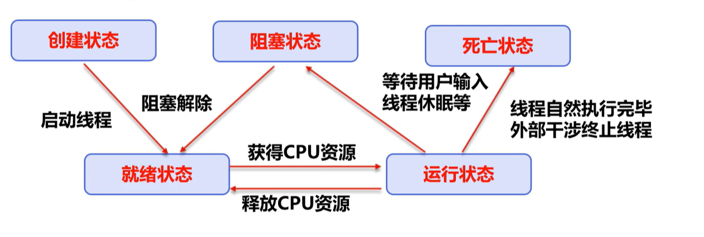
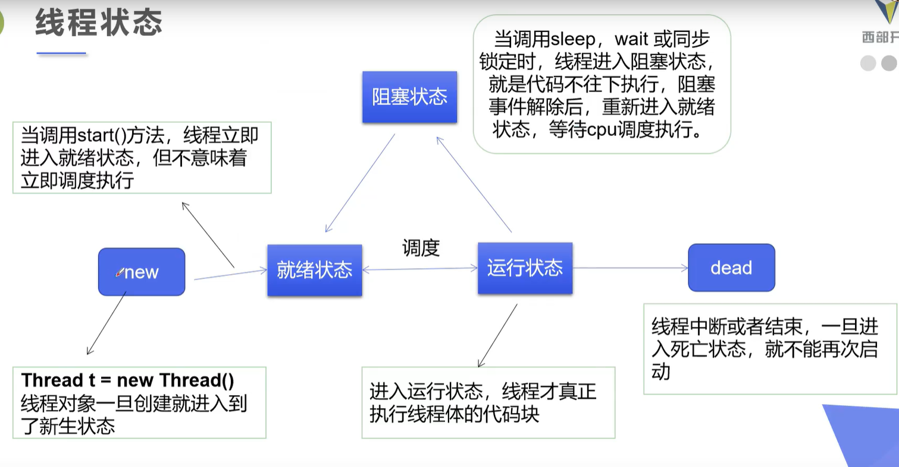
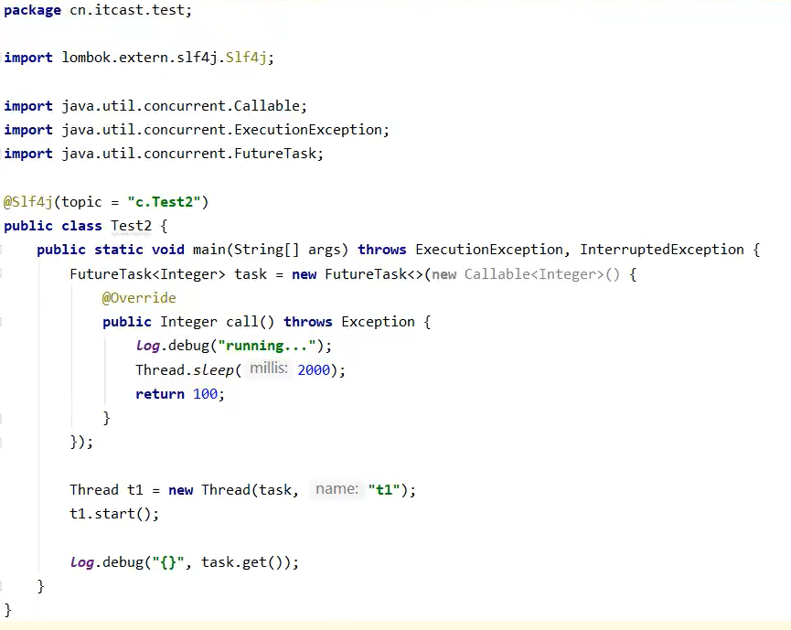
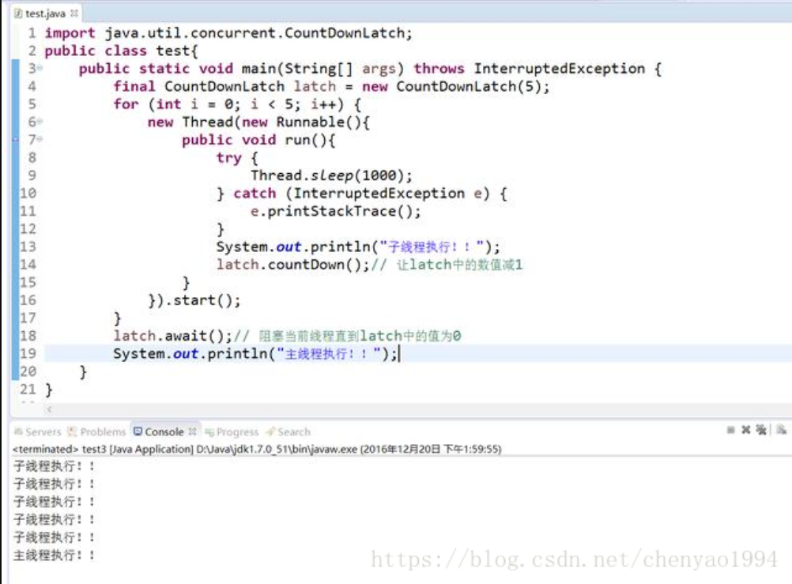

## 线程状态





### Thread.State

线程状态。线程可以处于一下状态之之一：

- NEW

  尚未启动的线程处于此状态。

- RUNNABLE

  在Java虚拟机中执行的线程处于此状态。

- BLOCKED

  被阻塞等待监视器锁定的线程处于此状态。

- WAITING

  正在等待另一个线程执行特定动作的线程处于此状态。

- TIMED_WAITING

  正在等待另一个线程执行动作到达指定等待时间的线程。

- TERMINATED

  已退出的线程处于此状态。

一个线程可以在给定时间点处于一个状态。这些状态是不反映如何操作系统线程状态的虚拟状态。


## 守护线程和用户线程

Java中有两类线程：User Thread(用户线程)、Daemon Thread(守护线程)

Daemon的作用是为其他线程的运行提供服务，比如说GC线程。其实User Thread线程和Daemon Thread守护线程本质上来说去没啥区别的，唯一的区别之处就在虚拟机的离开：如果User Thread全部撤离，那么Daemon Thread也就没啥线程好服务的了，所以守护线程也就退出了。

守护线程并非虚拟机内部可以提供，用户也可以自行的设定守护线程，方法：public final void setDaemon(boolean on) ；但是有几点需要注意：

1. thread.setDaemon(true)必须在thread.start()之前设置，否则会跑出一个IllegalThreadStateException异常。你不能把正在运行的常规线程设置为守护线程。 （备注：这点与守护进程有着明显的区别，守护进程是创建后，让进程摆脱原会话的控制+让进程摆脱原进程组的控制+让进程摆脱原控制终端的控制；所以说寄托于虚拟机的语言机制跟系统级语言有着本质上面的区别）
2. 在Daemon线程中产生的新线程也是Daemon的。 （这一点又是有着本质的区别了：守护进程fork()出来的子进程不再是守护进程，尽管它把父进程的进程相关信息复制过去了，但是子进程的进程的父进程不是init进程，所谓的守护进程本质上说就是“父进程挂掉，init收养，然后文件0,1,2都是/dev/null，当前目录到/”）
3. 不是所有的应用都可以分配给Daemon线程来进行服务，比如读写操作或者计算逻辑。因为在Daemon Thread还没来的及进行操作时，虚拟机可能已经退出了

```java
//完成文件输出的守护线程任务

import java.io.*;  

 

class TestRunnable implements Runnable{  

    public void run(){  

               try{  

                  Thread.sleep(1000);//守护线程阻塞1秒后运行  

                  File f=new File("daemon.txt");  

                  FileOutputStream os=new FileOutputStream(f,true);  

                  os.write("daemon".getBytes());  

           }  

               catch(IOException e1){  

          e1.printStackTrace();  

               }  

               catch(InterruptedException e2){  

                  e2.printStackTrace();  

           }  

    }  

}  

public class TestDemo2{  

    public static void main(String[] args) throws InterruptedException  

    {  

        Runnable tr=new TestRunnable();  

        Thread thread=new Thread(tr);  

                thread.setDaemon(true); //设置守护线程  

        thread.start(); //开始执行分进程  

    }  

}  
```

运行结果：文件daemon.txt中没有"daemon"字符串。

但是如果把thread.setDaemon(true); //设置守护线程注释掉，文件daemon.txt是可以被写入daemon字符串的


JRE判断程序是否执行结束的标准是所有的前台执线程行完毕了，而不管后台线程的状态，因此，在使用后台线程候一定要注意这个问题。 


### java主线程结束和子线程结束之间的关系

#### 1.Main线程是个非守护线程，不能设置成守护线程。

这是因为，main线程是由java虚拟机在启动的时候创建的。main方法开始执行的时候，主线程已经创建好并在运行了。对于运行中的线程，调用Thread.setDaemon()会抛出异常Exception in thread "main"   java.lang.IllegalThreadStateException


#### 2.Main线程结束，其他线程一样可以正常运行。 

主线程，只是个普通的非守护线程，用来启动应用程序，不能设置成守护线程；除此之外，它跟其他非守护线程没有什么不同。主线程执行结束，其他线程一样可以正常执行。

```java
public class ParentTest  
{  
  
    public static void main(String[] args)  
    {  
        System.out.println("parent thread begin ");  
          
        ChildThread t1 = new ChildThread("thread1");  
        ChildThread t2 = new ChildThread("thread2");  
        t1.start();  
        t2.start();  
  
        System.out.println("parent thread over ");  
    }  
}  
  
class ChildThread extends Thread  
{  
    private String name = null;  
  
    public ChildThread(String name)  
    {  
        this.name = name;  
    }  
  
    @Override  
    public void run()  
    {  
        System.out.println(this.name + "--child thead begin");  
  
        try  
        {  
            Thread.sleep(500);  
        }  
        catch (InterruptedException e)  
        {  
            System.out.println(e);  
        }  
  
        System.out.println(this.name + "--child thead over");  
    }  
}  
```

```
parent thread begin   
parent thread over   
thread2--child thead begin  
thread1--child thead begin  
thread2--child thead over  
thread1--child thead over  
```


这样其实是很合理的，按照操作系统的理论，进程是资源分配的基本单位，线程是CPU调度的基本单位。对于CPU来说，其实并不存在java的主线程和子线程之分，都只是个普通的线程。进程的资源是线程共享的，只要进程还在，线程就可以正常执行，换句话说线程是强依赖于进程的。也就是说，线程其实并不存在互相依赖的关系，一个线程的死亡从理论上来说，不会对其他线程有什么影响。


#### 3.Main线程结束，其他线程也可以立刻结束，当且仅当这些子线程都是守护线程。

 java虚拟机(相当于进程)退出的时机是：虚拟机中所有存活的线程都是守护线程。只要还有存活的非守护线程虚拟机就不会退出，而是等待非守护线程执行完毕；反之，如果虚拟机中的线程都是守护线程，那么不管这些线程的死活java虚拟机都会退出。

```java
public class ParentTest  
{  
  
    public static void main(String[] args)  
    {  
        System.out.println("parent thread begin ");  
          
        ChildThread t1 = new ChildThread("thread1");  
        ChildThread t2 = new ChildThread("thread2");  
        t1.setDaemon(true);  
        t2.setDaemon(true);  
          
        t1.start();  
        t2.start();  
  
        System.out.println("parent thread over ");  
    }  
}  
class ChildThread extends Thread  
{  
    private String name = null;  
    public ChildThread(String name)  
    {  
        this.name = name;  
    }  
    @Override  
    public void run()  
    {  
        System.out.println(this.name + "--child thead begin");  
        try  
        {  
            Thread.sleep(500);  
        }  
        catch (InterruptedException e)  
        {  
            System.out.println(e);  
        }  
        System.out.println(this.name + "--child thead over");  
    }  
}  
   
 执行结果如下：  
parent thread begin  
parent thread over  
thread1--child thead begin  
thread2--child thead begin  
```

在这种情况下，的确主线程退出，子线程就立刻结束了，但是这是属于JVM的底层实现机制，并不是说主线程和子线程之间存在依赖关系


## 线程的创建方法

### 实现Runnable接口

### 继承Thread类

### 实现Callable接口




## 线程礼让

- 礼让线程，让当前正在执行的线程暂停，但不阻塞
- 将线程从运行状态转为就绪状态
- 让CPU重新调度，礼让不一定成功，看CPU心情


## 死锁

多个线程各自占用一些共享资源，并且互相等待其他线程占有的资源才能运行，而导致两个或多个线程都在等待对方释放资源，都停止执行的情形。某一个同步块同时拥有“两个以上对象的锁时”，就可能发生“死锁”的问题。


### 死锁的避免方法

产生的死锁的四个必要条件：

1. 互斥条件：一个资源每次只能被一个进程下使用。
2. 请求与保持条件：一个进程因请求资源而阻塞时，对以获取的资源保持不放。
3. 不剥夺条件：进程已获得的资源，在未使用完之前，不能强行剥夺
4. 循环等待条件：若干进程之间形成一种头尾相接的循环等待资源关系。

上面列出的死锁的四个必要条件，只要破坏其中的任意一个或多个条件就可以避免死锁的发生。


synchronized 与 Lock 的对比

- Lock是显式锁（手动开启和关闭锁，别忘记关闭锁），synchronized是隐式锁，出了作用域自动释放
- Lock只有代码块锁，synchronized有代码锁和方法锁
- 使用Lock锁，JVM将花费较少的时间来调度线程，性能更好。并且具有更好的扩展性（提供更多的子类）
- 优先使用顺序：
  - Lock > 同步代码块（已经进入了方法体，分配了相应的资源） > 同步方法（在方法体之外）


## 线程通信

### 生产者消费者模型

#### 管程法：利用缓冲区解决

```java
package com.smilejack.test;

/**
 * 生产者消费者模型：缓冲区法
 * @author smilejack
 *
 */

//生产者
class Producer extends Thread{
	private SyncContainer container;
	public Producer(SyncContainer container) {
		this.container = container;
	}
	
	@Override
	public void run() {
		for(int i = 0; i < 100; i ++) {
			try {
				Thread.sleep(100);
			} catch (InterruptedException e) {
				// TODO Auto-generated catch block
				e.printStackTrace();
			}
			this.container.push(new Chicken(i));
			System.out.println("生产了第" + i + "只鸡");
		}
	}
	
}


//消费者
class Consumer extends Thread{
	private SyncContainer container;
	public Consumer(SyncContainer container) {
		this.container = container;
	}
	
	@Override
	public void run() {
		for(int i = 0; i < 100; i ++) {
			try {
				Thread.sleep(400);
			} catch (InterruptedException e) {
				// TODO Auto-generated catch block
				e.printStackTrace();
			}
			System.out.println("消费了第" + this.container.pop().getId() + "只鸡");
		}
	}
	
}

class Chicken {
	private int id;
	
	public Chicken(int id) {
		this.id = id;
	}

	public int getId() {
		return id;
	}

	public void setId(int id) {
		this.id = id;
	}
	
	
}

class SyncContainer {
	private Chicken[] container;
	private int count;
	private int size;
	
	public SyncContainer(int size) {
		this.size = size;
		this.count = 0;
		this.container = new Chicken[size];
	}
	
	
	public synchronized void push(Chicken chicken){
		if(count==size) {
			try {
				this.wait();
			} catch (InterruptedException e) {
				// TODO Auto-generated catch block
				e.printStackTrace();
			}
		}
		container[count++] = chicken;
		// 通知消费者消费
		this.notify();
	}
	
	public synchronized Chicken pop(){
		if(count==0) {
			try {
				this.wait();
			} catch (InterruptedException e) {
				// TODO Auto-generated catch block
				e.printStackTrace();
			}
		}
		
		Chicken c = container[--count];
		// 通知生产者生产
		this.notify();
		return c;
	}
}

public class ProducerAndConsumerTestDemo1 {
	public static void main(String[] args) {
		SyncContainer container = new SyncContainer(10);
		new Producer(container).start();
		new Consumer(container).start();
		
	}
}

```

#### 信号灯法 

使用标志位来确保生产者和消费者的协同工作

```java
package com.smilejack.test;

/**
 * 生产者消费者模型：信号灯
 * 
 * @author smilejack
 *
 */

class Player extends Thread{
	private TV tv;
	public Player(TV tv) {
		this.tv = tv;
	}
	
	@Override
	public void run() {
		String action;
		for(int i = 0; i < 100; i++) {
			if(i % 2 == 0) {
				action = "快乐大本营";
			}else
				action = "天天向上";
			tv.play(action);
			System.out.println("演员录制节目上传:" + action);
		}
		
	}
}

class Watcher extends Thread{
	private TV tv;
	public Watcher(TV tv) {
		this.tv = tv;
	}
	
	@Override
	public void run() {
		for(int i = 0; i < 100; i++) {
			tv.watch();
		}
	}
}


class TV {
	
	// 标志位，true：演员录制好节目上传等待观众观看
	private boolean flag = true;
	private String action;
	
	public synchronized void play(String action) {
		if(!flag) {
			try {
				this.wait();
			} catch (InterruptedException e) {
				// TODO Auto-generated catch block
				e.printStackTrace();
			}
		}
		try {
			Thread.sleep(1000);
		} catch (InterruptedException e) {
			// TODO Auto-generated catch block
			e.printStackTrace();
		}
		this.action = action;
		
		// 修改标志位，表示可以消费
		this.flag = !this.flag;
		this.notify();
		
	}
	
	public synchronized void watch() {
		if(flag) {
			try {
				this.wait();
			} catch (InterruptedException e) {
				// TODO Auto-generated catch block
				e.printStackTrace();
			}
		}
		try {
			Thread.sleep(1000);
		} catch (InterruptedException e) {
			// TODO Auto-generated catch block
			e.printStackTrace();
		}
		
		System.out.println("观众观看电视：" + this.action);
		// 修改标志位表示可以生产
		this.flag = !this.flag;
		this.notify();
		
	}
	
}


public class ProducerAndConsumerTestDemo2 {
	

	public static void main(String[] args) {
		TV tv = new TV();
		new Player(tv).start();
		new Watcher(tv).start();

	}
}

```


## 线程池

JDK 5.0 起提供了池相关API：ExecutorService 和 Exectors

### ExecutorService

真正的线程池接口，常见子类：ThreadPoolExecutor

- void execute(Runnable command):执行任务/命令，没有返回值，一般用来执行Runnable
- <T> Future<T> submit(Callable<T> task): 执行任务，有返回值，一般用来执行Callable
- void shutdown() ：关闭连接池

### Executors

工具类、线程池的工厂类，用于创建并返回不同类型的线程池。


## CountDownLatch



> 在这里说明一点，countDownLatch不可能重新初始化或者修改CountDownLatch对象内部计数器的值，一个线程调用countdown方法，另外一个线程调用await方法


## 