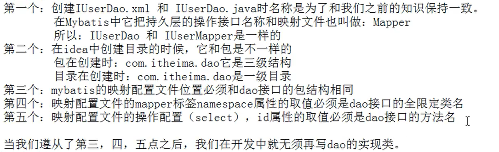
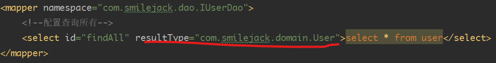

## 搭建开发MyBatis环境

### 创建maven工程并导入坐标

```xml
<?xml version="1.0" encoding="UTF-8"?>
<project xmlns="http://maven.apache.org/POM/4.0.0"
         xmlns:xsi="http://www.w3.org/2001/XMLSchema-instance"
         xsi:schemaLocation="http://maven.apache.org/POM/4.0.0 http://maven.apache.org/xsd/maven-4.0.0.xsd">
    <modelVersion>4.0.0</modelVersion>

    <groupId>org.example</groupId>
    <artifactId>test</artifactId>
    <version>1.0-SNAPSHOT</version>
    <packaging>jar</packaging>
    <dependencies>
        <dependency>
            <groupId>org.mybatis</groupId>
            <artifactId>mybatis</artifactId>
            <version>3.5.5</version>
        </dependency>
        <dependency>
            <groupId>mysql</groupId>
            <artifactId>mysql-connector-java</artifactId>
            <version>8.0.20</version>
        </dependency>
        <dependency>
            <groupId>log4j</groupId>
            <artifactId>log4j</artifactId>
            <version>1.2.12</version>
        </dependency>
        <dependency>
            <groupId>junit</groupId>
            <artifactId>junit</artifactId>
            <version>4.12</version>
            <scope>test</scope>
        </dependency>
    </dependencies>

</project>
```


### 创建实体类和dao的接口

```java
// User.java
package com.smilejack.domain;

import java.io.Serializable;
import java.util.Date;

public class User implements Serializable {
    private Integer id;
    private String username;
    private Date birthday;
    private  String  sex;
    private String address;

    @Override
    public String toString() {
        return "User{" +
                "id=" + id +
                ", username='" + username + '\'' +
                ", birthday=" + birthday +
                ", sex='" + sex + '\'' +
                ", address='" + address + '\'' +
                '}';
    }

    public Integer getId() {
        return id;
    }

    public void setId(Integer id) {
        this.id = id;
    }

    public String getUsername() {
        return username;
    }

    public void setUsername(String username) {
        this.username = username;
    }

    public Date getBirthday() {
        return birthday;
    }

    public void setBirthday(Date birthday) {
        this.birthday = birthday;
    }

    public String getSex() {
        return sex;
    }

    public void setSex(String sex) {
        this.sex = sex;
    }

    public String getAddress() {
        return address;
    }

    public void setAddress(String address) {
        this.address = address;
    }
}

```

```java
// IUser.java
package com.smilejack.dao;

import com.smilejack.domain.User;

import java.util.List;

/**
 * 用户持久层接口
 */
public interface IUserDao {
    /**
     * 查询所有操作
     * @return
     */
    List<User> findAll();
}

```


### 创建MyBatis的主配置文件

SqlMapConfig.xml

```xml
<?xml version="1.0" encoding="UTF-8"?>
<!DOCTYPE configuration
        PUBLIC "-//mybatis.org//DTD Config 3.0//EN"
        "http://mybatis.org/dtd/mybatis-3-config.dtd">
<configuration>
    <!--配置环境-->
    <environments default="mysql">
        <!--配置MySQL的环境-->
        <environment id="mysql">
            <!--配置事务的类型-->
            <transactionManager type="JDBC"></transactionManager>
            <!--配置连接池-->
            <dataSource type="POOLED">
                <!--配置连接数据库的4个基本信息-->
                <property name="driver" value="com.mysql.cj.jdbc.Driver"/>
                <property name="url" value="jdbc:mysql://localhost:3306/test"/>
                <property name="username" value="root"/>
                <property name="password" value="admin"/>
            </dataSource>
        </environment>
    </environments>
    <!--指定映射配置文件的位置，映射配置文件指的是每个dao独立的配置文件-->
    <mappers>
        <mapper resource="com/smilejack/dao/IUserDao.xml"/>
    </mappers>

</configuration>
```

### 创建映射配置文件（可使用注解代替）

IUserDao.xml

```xml
<?xml version="1.0" encoding="UTF-8"?>
<!DOCTYPE mapper
        PUBLIC "-//mybatis.org//DTD Mapper 3.0//EN"
        "http://mybatis.org/dtd/mybatis-3-mapper.dtd">
<mapper namespace="com.smilejack.dao.IUserDao">
    <!--配置查询所有-->
    <select id="findAll" resultType="com.smilejack.domain.User">select * from user</select>
</mapper>
```


### 注意事项




## Mybatis入门案例

```java
package com.smilejack.test;

import com.smilejack.dao.IUserDao;
import com.smilejack.domain.User;
import org.apache.ibatis.io.Resources;
import org.apache.ibatis.session.SqlSession;
import org.apache.ibatis.session.SqlSessionFactory;
import org.apache.ibatis.session.SqlSessionFactoryBuilder;

import java.io.IOException;
import java.io.InputStream;
import java.util.List;

/**
 * mybatis的入门案例
 */
public class MybatisTest {
    public static void main(String[] args) throws IOException {
        //1.配置文件
        InputStream in = Resources.getResourceAsStream("SqlMapConfig.xml");
        //2.创建SqlSessionFactory工厂
        SqlSessionFactoryBuilder builder = new SqlSessionFactoryBuilder();
        SqlSessionFactory factory = builder.build(in);
        //3.使用工厂生产SqlSession对象
        SqlSession session = factory.openSession();
        // 4.使用SqlSession创建Dao接口的代理对象
        IUserDao userDao = session.getMapper(IUserDao.class);
        // 5.使用代理对象执行方法
        List<User> users = userDao.findAll();
        for(User user: users){
            System.out.println(user);
        }
        // 6.释放资源
        session.close();
        in.close();
    }

}
```


> 不要忘记在映射配置类中告知Mybatis要封装到那个实体类中
>
> 配置方式：指定实体类权限定类名
>
> 


### 使用注解替换映射配置文件

> 此时不需要IUserDao.xml文件

- 修改`IUserDao.java`文件

```java
package com.smilejack.dao;

import com.smilejack.domain.User;
import org.apache.ibatis.annotations.Select;

import java.util.List;

/**
 * 用户持久层接口
 */
public interface IUserDao {
    /**
     * 查询所有操作
     * @return
     */
    @Select("select * from user")
    List<User> findAll();
}
```

- 修改`SqlMapConfig.xml`为`<mapper class="com.smilejack.dao.IUserDao"/>`

```xml
<?xml version="1.0" encoding="UTF-8"?>
<!DOCTYPE configuration
        PUBLIC "-//mybatis.org//DTD Config 3.0//EN"
        "http://mybatis.org/dtd/mybatis-3-config.dtd">
<configuration>
    <!--配置环境-->
    <environments default="mysql">
        <!--配置MySQL的环境-->
        <environment id="mysql">
            <!--配置事务的类型-->
            <transactionManager type="JDBC"></transactionManager>
            <!--配置连接池-->
            <dataSource type="POOLED">
                <!--配置连接数据库的4个基本信息-->
                <property name="driver" value="com.mysql.cj.jdbc.Driver"/>
                <property name="url" value="jdbc:mysql://localhost:3306/test"/>
                <property name="username" value="root"/>
                <property name="password" value="admin"/>
            </dataSource>
        </environment>
    </environments>
    <!--指定映射配置文件的位置，映射配置文件指的是每个dao独立的配置文件-->
    <mappers>
        <mapper class="com.smilejack.dao.IUserDao"/>
    </mappers>

</configuration>
```

> 总结：把IUserDao.xml移除，在dao接口上使用@Selector注解，并指定SQL语句
>
> 同时需要在SqlMapConfig.xml的mapper配置时，使用class属性指定到接口的权限定类名


实际开发中，都是越简单越好，所以都是采用不写dao实现类的方式。

但是MyBatis它是支持写dao实现类的。


# 基于代理Dao实现CRUD操作

## 1. 在持久层接口添加 findById 方法

```java
/**
* 根据 id 查询
* @param userId
* @return
*/
User findById(Integer userId);
```

## 2. 在用户的映射配置文件中配置

```xml
<!-- 根据 id 查询 -->
<select id="findById" resultType="com.itheima.domain.User" parameterType="int">
	select * from user where id = #{uid}
</select>
细节：
    resultType 属性：
    	用于指定结果集的类型。
    parameterType 属性：
		用于指定传入参数的类型。
	sql 语句中使用#{}字符：
		它代表占位符，相当于原来 jdbc 部分所学的?，都是用于执行语句时替换实际的数据。
		具体的数据是由#{}里面的内容决定的。
	#{}中内容的写法：
        由于数据类型是基本类型，所以此处可以随意写
```


# 二级缓存

### 1. mybatis配置文件开启缓存

```xml
<settings>
	<setting name="cacheEnabled" value="true"/>
</settings>
```


### 2. 在mapper文件开启缓存

```xml
<cache
  eviction="LRU"
  flushInterval="60000"
  size="512"
  readOnly="true"/>
```

`eviction`: 缓存清除策略,默认的清除策略是 LRU。

- `LRU` – 最近最少使用：移除最长时间不被使用的对象。
- `FIFO` – 先进先出：按对象进入缓存的顺序来移除它们。
- `SOFT` – 软引用：基于垃圾回收器状态和软引用规则移除对象。
- `WEAK` – 弱引用：更积极地基于垃圾收集器状态和弱引用规则移除对象。

`flushInterval`:（刷新间隔）属性可以被设置为任意的正整数，设置的值应该是一个以毫秒为单位的合理时间量。 默认情况是不设置，也就是没有刷新间隔，缓存仅仅会在调用语句时刷新。

`size`:（引用数目）属性可以被设置为任意正整数，要注意欲缓存对象的大小和运行环境中可用的内存资源。默认值是 1024。

`readOnly`:（只读）属性可以被设置为 true 或 false。只读的缓存会给所有调用者返回缓存对象的相同实例。 因此这些对象不能被修改。这就提供了可观的性能提升。而可读写的缓存会（通过序列化）返回缓存对象的拷贝。 速度上会慢一些，但是更安全，因此默认值是 false。

> 二级缓存是事务性的。这意味着，当 SqlSession 完成并提交时，或是完成并回滚，但没有执行 flushCache=true 的 insert/delete/update 语句时，缓存会获得更新。


### 指定某条语句不使用二级缓存

mapper 文件开启缓存后，对该mapper中的所有语句生效，如果想某个语句不使用缓存，可以在该语句添加`userCache="false"`


# 懒加载

### 1. Mybatis配置文件设置

```xml
<!--全局参数设置-->
<settings>
    <!--延迟加载总开关-->
    <setting name="lazyLoadingEnabled" value="true"/>
    <!--将aggressiveLazyLoading设置为false表示按需加载，默认为true-->
    <setting name="aggressiveLazyLoading" value="false"/>
</settings>
```


案例

```xml
<resultMap id="VideoOrderResultMapLazy" type="VideoOrder">
        <id column="id" property="id"/>

        <result column="user_id" property="userId"/>
        <result column="out_trade_no" property="outTradeNo"/>
        <result column="create_time" property="createTime"/>
        <result column="state" property="state"/>
        <result column="total_fee" property="totalFee"/>
        <result column="video_id" property="videoId"/>
        <result column="video_title" property="videoTitle"/>
        <result column="video_img" property="videoImg"/>

<!-- 
select： 指定延迟加载需要执行的statement id 
column： 和select查询关联的字段
-->
        <association property="user" javaType="User" column="user_id" select="findUserByUserId"/>


</resultMap>

    <!--一对一管理查询订单， 订单内部包含用户属性  懒加载-->
<select id="queryVideoOrderListLazy" resultMap="VideoOrderResultMapLazy">

        select
         o.id id,
         o.user_id ,
         o.out_trade_no,
         o.create_time,
         o.state,
         o.total_fee,
         o.video_id,
         o.video_title,
         o.video_img
         from video_order o

</select>


<select id="findUserByUserId" resultType="User">

       select  * from user where id=#{id}

</select>
```

> dubug模式测试懒加载不准确，可以直接run


```java
// resultmap association关联查询(测试懒加载)
VideoOrderMapper videoOrderMapper = sqlSession.getMapper(VideoOrderMapper.class);
List<VideoOrder> videoOrderList = videoOrderMapper.queryVideoOrderListLazy();
System.out.println(videoOrderList.size());

//课程里面演示是6条订单记录，但是只查询3次用户信息，是因为部分用户信息走了一级缓存sqlsession
for(VideoOrder videoOrder : videoOrderList){

    System.out.println(videoOrder.getVideoTitle());
    System.out.println(videoOrder.getUser().getName());
}
```


# Mybatis事务管理

- 使用**JDBC**的事务管理
  - 使用 java.sql.Connection对象完成对事务的提交（commit()）、回滚（rollback()）、关闭（close()）

- 使用**MANAGED**的事务管理
  - MyBatis自身不会去实现事务管理，而让程序的容器如（Spring, JBOSS）来实现对事务的管理

```xml
<environment id="development">
            <!-- mybatis使用jdbc事务管理方式 -->
            <transactionManager type="JDBC"/>
            <dataSource type="POOLED">
                <property name="driver" value="com.mysql.cj.jdbc.Driver"/>
                <property name="url" value="jdbc:mysql://127.0.0.1:3306/xdclass?useUnicode=true&amp;characterEncoding=utf-8&amp;useSSL=false"/>
                <property name="username" value="root"/>
                <property name="password" value="xdclass.net"/>
            </dataSource>
</environment>
```

事务工厂TransactionFactory 的两个实现类

- JdbcTransactionFactory->JdbcTransaction
- ManagedTransactionFactory->ManagedTransaction

> 注意：如果不是web程序，然后使用的事务管理形式是MANAGED, 那么将没有事务管理功能