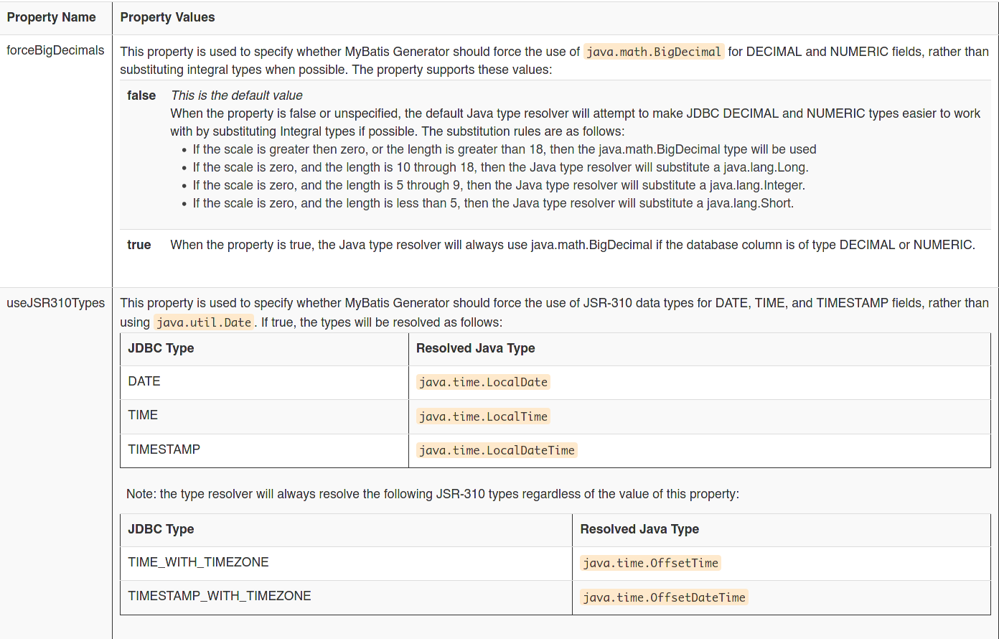
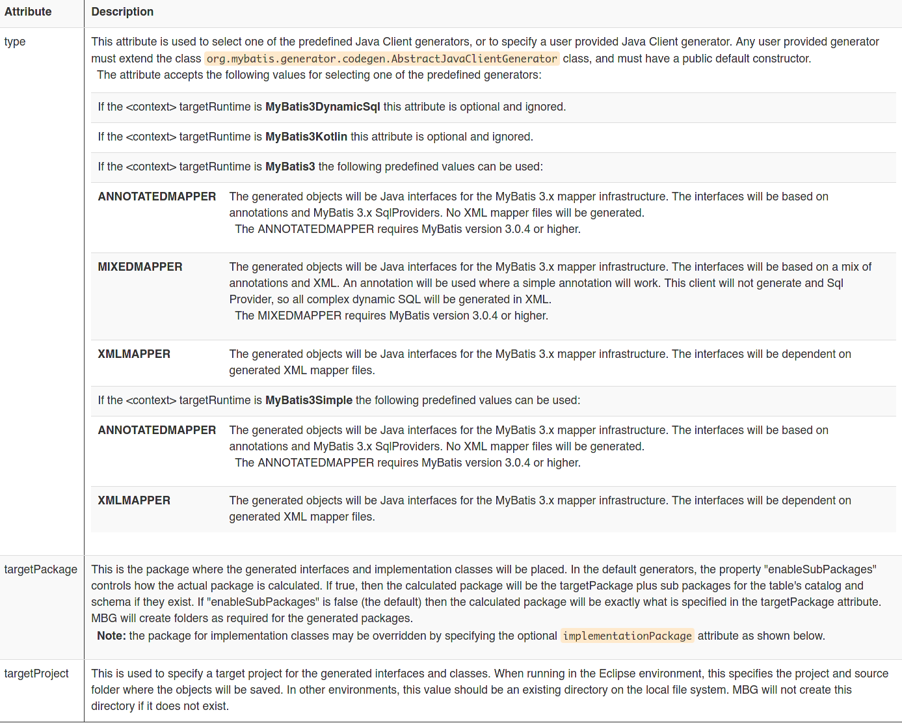
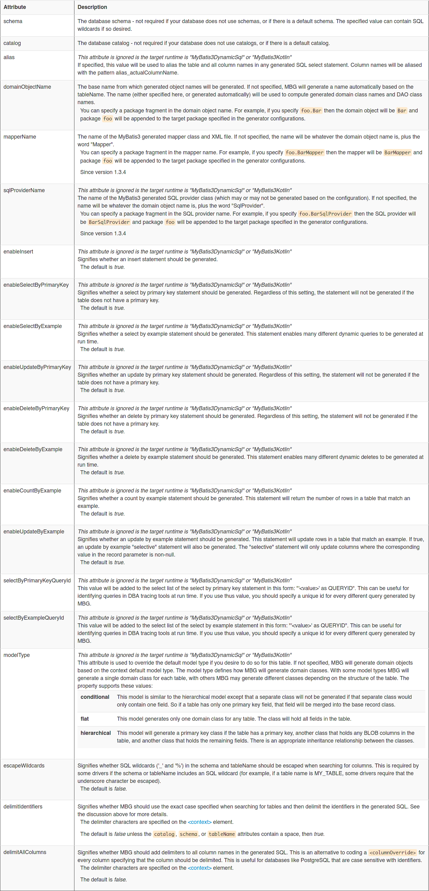
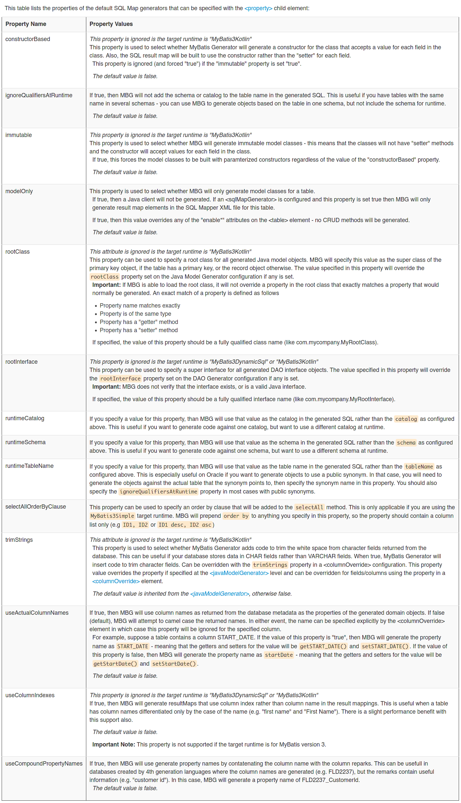

## 搭建开发MyBatis环境

### 创建maven工程并导入坐标

```xml
<?xml version="1.0" encoding="UTF-8"?>
<project xmlns="http://maven.apache.org/POM/4.0.0"
         xmlns:xsi="http://www.w3.org/2001/XMLSchema-instance"
         xsi:schemaLocation="http://maven.apache.org/POM/4.0.0 http://maven.apache.org/xsd/maven-4.0.0.xsd">
    <modelVersion>4.0.0</modelVersion>

    <groupId>org.example</groupId>
    <artifactId>test</artifactId>
    <version>1.0-SNAPSHOT</version>
    <packaging>jar</packaging>
    <dependencies>
        <dependency>
            <groupId>org.mybatis</groupId>
            <artifactId>mybatis</artifactId>
            <version>3.5.5</version>
        </dependency>
        <dependency>
            <groupId>mysql</groupId>
            <artifactId>mysql-connector-java</artifactId>
            <version>8.0.20</version>
        </dependency>
        <dependency>
            <groupId>log4j</groupId>
            <artifactId>log4j</artifactId>
            <version>1.2.12</version>
        </dependency>
        <dependency>
            <groupId>junit</groupId>
            <artifactId>junit</artifactId>
            <version>4.12</version>
            <scope>test</scope>
        </dependency>
    </dependencies>

</project>
```


### 创建实体类和dao的接口

```java
// User.java
package com.smilejack.domain;

import java.io.Serializable;
import java.util.Date;

public class User implements Serializable {
    private Integer id;
    private String username;
    private Date birthday;
    private  String  sex;
    private String address;

    @Override
    public String toString() {
        return "User{" +
                "id=" + id +
                ", username='" + username + '\'' +
                ", birthday=" + birthday +
                ", sex='" + sex + '\'' +
                ", address='" + address + '\'' +
                '}';
    }

    public Integer getId() {
        return id;
    }

    public void setId(Integer id) {
        this.id = id;
    }

    public String getUsername() {
        return username;
    }

    public void setUsername(String username) {
        this.username = username;
    }

    public Date getBirthday() {
        return birthday;
    }

    public void setBirthday(Date birthday) {
        this.birthday = birthday;
    }

    public String getSex() {
        return sex;
    }

    public void setSex(String sex) {
        this.sex = sex;
    }

    public String getAddress() {
        return address;
    }

    public void setAddress(String address) {
        this.address = address;
    }
}

```

```java
// IUser.java
package com.smilejack.dao;

import com.smilejack.domain.User;

import java.util.List;

/**
 * 用户持久层接口
 */
public interface IUserDao {
    /**
     * 查询所有操作
     * @return
     */
    List<User> findAll();
}

```


### 创建MyBatis的主配置文件

SqlMapConfig.xml

```xml
<?xml version="1.0" encoding="UTF-8"?>
<!DOCTYPE configuration
        PUBLIC "-//mybatis.org//DTD Config 3.0//EN"
        "http://mybatis.org/dtd/mybatis-3-config.dtd">
<configuration>
    <!--配置环境-->
    <environments default="mysql">
        <!--配置MySQL的环境-->
        <environment id="mysql">
            <!--配置事务的类型-->
            <transactionManager type="JDBC"></transactionManager>
            <!--配置连接池-->
            <dataSource type="POOLED">
                <!--配置连接数据库的4个基本信息-->
                <property name="driver" value="com.mysql.cj.jdbc.Driver"/>
                <property name="url" value="jdbc:mysql://localhost:3306/test"/>
                <property name="username" value="root"/>
                <property name="password" value="admin"/>
            </dataSource>
        </environment>
    </environments>
    <!--指定映射配置文件的位置，映射配置文件指的是每个dao独立的配置文件-->
    <mappers>
        <mapper resource="com/smilejack/dao/IUserDao.xml"/>
    </mappers>

</configuration>
```

### 创建映射配置文件（可使用注解代替）

IUserDao.xml

```xml
<?xml version="1.0" encoding="UTF-8"?>
<!DOCTYPE mapper
        PUBLIC "-//mybatis.org//DTD Mapper 3.0//EN"
        "http://mybatis.org/dtd/mybatis-3-mapper.dtd">
<mapper namespace="com.smilejack.dao.IUserDao">
    <!--配置查询所有-->
    <select id="findAll" resultType="com.smilejack.domain.User">select * from user</select>
</mapper>
```


### 注意事项


## Mybatis入门案例

```java
package com.smilejack.test;

import com.smilejack.dao.IUserDao;
import com.smilejack.domain.User;
import org.apache.ibatis.io.Resources;
import org.apache.ibatis.session.SqlSession;
import org.apache.ibatis.session.SqlSessionFactory;
import org.apache.ibatis.session.SqlSessionFactoryBuilder;

import java.io.IOException;
import java.io.InputStream;
import java.util.List;

/**
 * mybatis的入门案例
 */
public class MybatisTest {
    public static void main(String[] args) throws IOException {
        //1.配置文件
        InputStream in = Resources.getResourceAsStream("SqlMapConfig.xml");
        //2.创建SqlSessionFactory工厂
        SqlSessionFactoryBuilder builder = new SqlSessionFactoryBuilder();
        SqlSessionFactory factory = builder.build(in);
        //3.使用工厂生产SqlSession对象
        SqlSession session = factory.openSession();
        // 4.使用SqlSession创建Dao接口的代理对象
        IUserDao userDao = session.getMapper(IUserDao.class);
        // 5.使用代理对象执行方法
        List<User> users = userDao.findAll();
        for(User user: users){
            System.out.println(user);
        }
        // 6.释放资源
        session.close();
        in.close();
    }

}
```


> 不要忘记在映射配置类中告知Mybatis要封装到那个实体类中
>
> 配置方式：指定实体类权限定类名
>
> 


### 使用注解替换映射配置文件

> 此时不需要IUserDao.xml文件

- 修改`IUserDao.java`文件

```java
package com.smilejack.dao;

import com.smilejack.domain.User;
import org.apache.ibatis.annotations.Select;

import java.util.List;

/**
 * 用户持久层接口
 */
public interface IUserDao {
    /**
     * 查询所有操作
     * @return
     */
    @Select("select * from user")
    List<User> findAll();
}
```

- 修改`SqlMapConfig.xml`为`<mapper class="com.smilejack.dao.IUserDao"/>`

```xml
<?xml version="1.0" encoding="UTF-8"?>
<!DOCTYPE configuration
        PUBLIC "-//mybatis.org//DTD Config 3.0//EN"
        "http://mybatis.org/dtd/mybatis-3-config.dtd">
<configuration>
    <!--配置环境-->
    <environments default="mysql">
        <!--配置MySQL的环境-->
        <environment id="mysql">
            <!--配置事务的类型-->
            <transactionManager type="JDBC"></transactionManager>
            <!--配置连接池-->
            <dataSource type="POOLED">
                <!--配置连接数据库的4个基本信息-->
                <property name="driver" value="com.mysql.cj.jdbc.Driver"/>
                <property name="url" value="jdbc:mysql://localhost:3306/test"/>
                <property name="username" value="root"/>
                <property name="password" value="admin"/>
            </dataSource>
        </environment>
    </environments>
    <!--指定映射配置文件的位置，映射配置文件指的是每个dao独立的配置文件-->
    <mappers>
        <mapper class="com.smilejack.dao.IUserDao"/>
    </mappers>

</configuration>
```

> 总结：把IUserDao.xml移除，在dao接口上使用@Selector注解，并指定SQL语句
>
> 同时需要在SqlMapConfig.xml的mapper配置时，使用class属性指定到接口的权限定类名


实际开发中，都是越简单越好，所以都是采用不写dao实现类的方式。

但是MyBatis它是支持写dao实现类的。


# 基于代理Dao实现CRUD操作

## 1. 在持久层接口添加 findById 方法

```java
/**
* 根据 id 查询
* @param userId
* @return
*/
User findById(Integer userId);
```

## 2. 在用户的映射配置文件中配置

```xml
<!-- 根据 id 查询 -->
<select id="findById" resultType="com.itheima.domain.User" parameterType="int">
	select * from user where id = #{uid}
</select>
细节：
    resultType 属性：
    	用于指定结果集的类型。
    parameterType 属性：
		用于指定传入参数的类型。
	sql 语句中使用#{}字符：
		它代表占位符，相当于原来 jdbc 部分所学的?，都是用于执行语句时替换实际的数据。
		具体的数据是由#{}里面的内容决定的。
	#{}中内容的写法：
        由于数据类型是基本类型，所以此处可以随意写
```


# 二级缓存

### 1. mybatis配置文件开启缓存

```xml
<settings>
	<setting name="cacheEnabled" value="true"/>
</settings>
```


### 2. 在mapper文件开启缓存

```xml
<cache
  eviction="LRU"
  flushInterval="60000"
  size="512"
  readOnly="true"/>
```

`eviction`: 缓存清除策略,默认的清除策略是 LRU。

- `LRU` – 最近最少使用：移除最长时间不被使用的对象。
- `FIFO` – 先进先出：按对象进入缓存的顺序来移除它们。
- `SOFT` – 软引用：基于垃圾回收器状态和软引用规则移除对象。
- `WEAK` – 弱引用：更积极地基于垃圾收集器状态和弱引用规则移除对象。

`flushInterval`:（刷新间隔）属性可以被设置为任意的正整数，设置的值应该是一个以毫秒为单位的合理时间量。 默认情况是不设置，也就是没有刷新间隔，缓存仅仅会在调用语句时刷新。

`size`:（引用数目）属性可以被设置为任意正整数，要注意欲缓存对象的大小和运行环境中可用的内存资源。默认值是 1024。

`readOnly`:（只读）属性可以被设置为 true 或 false。只读的缓存会给所有调用者返回缓存对象的相同实例。 因此这些对象不能被修改。这就提供了可观的性能提升。而可读写的缓存会（通过序列化）返回缓存对象的拷贝。 速度上会慢一些，但是更安全，因此默认值是 false。

> 二级缓存是事务性的。这意味着，当 SqlSession 完成并提交时，或是完成并回滚，但没有执行 flushCache=true 的 insert/delete/update 语句时，缓存会获得更新。


### 指定某条语句不使用二级缓存

mapper 文件开启缓存后，对该mapper中的所有语句生效，如果想某个语句不使用缓存，可以在该语句添加`userCache="false"`


# 懒加载

### 1. Mybatis配置文件设置

```xml
<!--全局参数设置-->
<settings>
    <!--延迟加载总开关-->
    <setting name="lazyLoadingEnabled" value="true"/>
    <!--将aggressiveLazyLoading设置为false表示按需加载，默认为true-->
    <setting name="aggressiveLazyLoading" value="false"/>
</settings>
```


案例

```xml
<resultMap id="VideoOrderResultMapLazy" type="VideoOrder">
        <id column="id" property="id"/>

        <result column="user_id" property="userId"/>
        <result column="out_trade_no" property="outTradeNo"/>
        <result column="create_time" property="createTime"/>
        <result column="state" property="state"/>
        <result column="total_fee" property="totalFee"/>
        <result column="video_id" property="videoId"/>
        <result column="video_title" property="videoTitle"/>
        <result column="video_img" property="videoImg"/>

<!-- 
select： 指定延迟加载需要执行的statement id 
column： 和select查询关联的字段
-->
        <association property="user" javaType="User" column="user_id" select="findUserByUserId"/>


</resultMap>

    <!--一对一管理查询订单， 订单内部包含用户属性  懒加载-->
<select id="queryVideoOrderListLazy" resultMap="VideoOrderResultMapLazy">

        select
         o.id id,
         o.user_id ,
         o.out_trade_no,
         o.create_time,
         o.state,
         o.total_fee,
         o.video_id,
         o.video_title,
         o.video_img
         from video_order o

</select>


<select id="findUserByUserId" resultType="User">

       select  * from user where id=#{id}

</select>
```

> dubug模式测试懒加载不准确，可以直接run


```java
// resultmap association关联查询(测试懒加载)
VideoOrderMapper videoOrderMapper = sqlSession.getMapper(VideoOrderMapper.class);
List<VideoOrder> videoOrderList = videoOrderMapper.queryVideoOrderListLazy();
System.out.println(videoOrderList.size());

//课程里面演示是6条订单记录，但是只查询3次用户信息，是因为部分用户信息走了一级缓存sqlsession
for(VideoOrder videoOrder : videoOrderList){

    System.out.println(videoOrder.getVideoTitle());
    System.out.println(videoOrder.getUser().getName());
}
```


# Mybatis事务管理

- 使用**JDBC**的事务管理
  - 使用 java.sql.Connection对象完成对事务的提交（commit()）、回滚（rollback()）、关闭（close()）

- 使用**MANAGED**的事务管理
  - MyBatis自身不会去实现事务管理，而让程序的容器如（Spring, JBOSS）来实现对事务的管理

```xml
<environment id="development">
            <!-- mybatis使用jdbc事务管理方式 -->
            <transactionManager type="JDBC"/>
            <dataSource type="POOLED">
                <property name="driver" value="com.mysql.cj.jdbc.Driver"/>
                <property name="url" value="jdbc:mysql://127.0.0.1:3306/xdclass?useUnicode=true&amp;characterEncoding=utf-8&amp;useSSL=false"/>
                <property name="username" value="root"/>
                <property name="password" value="xdclass.net"/>
            </dataSource>
</environment>
```

事务工厂TransactionFactory 的两个实现类

- JdbcTransactionFactory->JdbcTransaction
- ManagedTransactionFactory->ManagedTransaction

> 注意：如果不是web程序，然后使用的事务管理形式是MANAGED, 那么将没有事务管理功能


# MyBatis生成器

## Maven依赖包

mybatis 生成器核心包

```xml
<dependency>
    <groupId>org.mybatis.generator</groupId>
    <artifactId>mybatis-generator-core</artifactId>
    <version>1.4.0</version>
</dependency>
```


## MyBatis Generator 配置

### XML配置

#### 配置模板

```xml
<?xml version="1.0" encoding="UTF-8"?>
<!DOCTYPE generatorConfiguration
  PUBLIC "-//mybatis.org//DTD MyBatis Generator Configuration 1.0//EN"
  "http://mybatis.org/dtd/mybatis-generator-config_1_0.dtd">

<generatorConfiguration>
  <!-- 指定数据驱动包位置 -->
  <classPathEntry location="/Program Files/IBM/SQLLIB/java/db2java.zip" />
  
  <context id="DB2Tables" targetRuntime="MyBatis3">
    <jdbcConnection driverClass="COM.ibm.db2.jdbc.app.DB2Driver"
        connectionURL="jdbc:db2:TEST"
        userId="db2admin"
        password="db2admin">
    </jdbcConnection>

    <javaTypeResolver >
      <property name="forceBigDecimals" value="false" />
    </javaTypeResolver>

    <javaModelGenerator targetPackage="test.model" targetProject="\MBGTestProject\src">
      <property name="enableSubPackages" value="true" />
      <property name="trimStrings" value="true" />
    </javaModelGenerator>

    <sqlMapGenerator targetPackage="test.xml"  targetProject="\MBGTestProject\src">
      <property name="enableSubPackages" value="true" />
    </sqlMapGenerator>

    <javaClientGenerator type="XMLMAPPER" targetPackage="test.dao"  targetProject="\MBGTestProject\src">
      <property name="enableSubPackages" value="true" />
    </javaClientGenerator>

    <table schema="DB2ADMIN" tableName="ALLTYPES" domainObjectName="Customer" >
      <property name="useActualColumnNames" value="true"/>
      <generatedKey column="ID" sqlStatement="DB2" identity="true" />
      <columnOverride column="DATE_FIELD" property="startDate" />
      <ignoreColumn column="FRED" />
      <columnOverride column="LONG_VARCHAR_FIELD" jdbcType="VARCHAR" />
    </table>

  </context>
</generatorConfiguration>
```


#### 元素

##### `generatorConfiguration`

Mybatis Generator配置文件的根元素，配置文件头部需要此`DOCTYPE`

```xml
<!DOCTYPE generatorConfiguration PUBLIC
  "-//mybatis.org//DTD MyBatis Generator Configuration 1.0//EN"
  "http://mybatis.org/dtd/mybatis-generator-config_1_0.dtd">
```

###### 子元素

- `properties` (0 or 1)

- `classPathEntry`(0..N)
- `context`(1..N)


##### `properties`

此元素用于指定外部属性解析配置文件，可以通过`${property}`来引用值。

###### 属性

- `resource`: 属性文件的限定名，如果指定此属性，则会在`classpath`中搜索。例如`com/myproject/generatorConfig.properties` must exist in the `com.myproject` package.

- `url`: 属性文件的URL值。  例如文件系统上的属性文件    `file:///C:/myfolder/generatorConfig.properties`.


##### `classPathEntry`

```xml
<classPathEntry location="/Program Files/IBM/SQLLIB/java/db2java.zip" />
```

可选参数(0个或多个），指定数据库JDBC驱动包位置。

- When loading the JDBC driver for database introspection
- When loading root classes in the JavaModelGenerator to check for overridden methods


##### `context`

生成配置文件的环境

###### 属性

必选属性

- `id`：唯一键标识，用于某些错误信息输出。

可选属性

- `defaultModelType`

当`targetRuntime`属性为`MyBatis3Simple`,`MyBatis3DynamicSql`,`MyBatis3Kotlin`时忽略该属性。

该属性用于设置默认生成的模型类型。

| 属性         | 描述                                                         |
| ------------ | ------------------------------------------------------------ |
| conditional  | 默认值。This model is similar to the hierarchical model except that a separate class will not be generated if that separate class would only contain one field. So if a table has only one primary key field, that field will be merged into the base record class. |
| flat         | This model generates only one domain class for any table. The class will hold all fields in the table. |
| hierarchical | This model will generate a primary key class if the table has a primary key, another class that holds any BLOB columns in the table, and another class that holds the remaining fields. There is an appropriate inheritance relationship between the classes. |

- `targetRuntime`

指定生成的代码类型。

| 属性                 | 描述                                                         |
| -------------------- | ------------------------------------------------------------ |
| MyBatis3DynamicSql   | 生成java代码，没有xml，`flat`式的`defaultModelType`          |
| MyBatis3Kotlin       | 生成kotlin代码，没有xml，`flat`式的`defaultModelType`        |
| MyBatis3             | 生成Java代码和xml文件。                                      |
| MyBatis3Simple       | 生成Java代码和xml文件，但只有基本CRUD操作，没有by example方法，有少量的动态SQL。 |
| MyBatis3DynamicSqlV1 | 此属性将来会被移除。                                         |

- `introspectedColumnImpl`

如果你需要完成自定义生成代码，可以使用此属性指定一个继承`org.mybatis.generator.api.IntrospectedColumn`的类的全限定名。

###### 子元素

- `property`  (0..N)
- `plugin`  (0..N)
- `commentGenerator`  (0 or 1)
- `connectionFactory`  (either connectionFactory or jdbcConnection is Required)
- `jdbcConnection`  (either connectionFactory or jdbcConnection is Required)
- `javaTypeResolver`  (0 or 1)
- `javaModelGenerator`  (1 Required)
- `sqlMapGenerator`  (0 or 1)
- `javaClientGenerator`  (0 or 1)

- `table` (1..N)


###### 支持的`property`属性

| Property Name       | Property Values                                              |
| ------------------- | ------------------------------------------------------------ |
| autoDelimitKeywords | 值为boolean类型。 是否自动对表中的使用SQL关键字作为列名的字段使用界定符进行区分，默认值为`false`。MyBatis生成器维护了一个关键字列表，如果某个关键字不在其中，你可以使用`<columnOverride>`强制进行界定。参考 `org.mybatis.generator.internal.db.SqlReservedWords` 类查看MyBatis维护的关键字列表。 |
| beginningDelimiter  | The value to use as the beginning identifier delimiter for SQL identifiers that        require delimiters.  MBG will automatically delimit SQL identifiers if the        identifier contains a space.  MBG will also delimit SQL identifiers if        specifically requested in a <table> or  <columnOverride> configuration.        *The default value is double quotes (").* |
| endingDelimiter     | The value to use as the ending identifier delimiter for SQL identifiers that        require delimiters.  MBG will automatically delimit SQL identifiers if the        identifier contains a space.  MBG will also delimit SQL identifiers if        specifically requested in a <table> or  <columnOverride> configuration.        *The default value is double quotes (").* |
| javaFileEncoding    | Use this property to specify an encoding to use when working with Java files.        Newly generated Java files will be written to the file system in this encoding,        and existing Java files will be read with this encoding when performing a merge.        If not specified, then the platform default encoding will be used.                  See `java.nio.charset.Charset` for information on valid encodings. |
| javaFormatter       | Use this property to specify the full class name of a user provided formatter for generated        Java files.  The class must implement `org.mybatis.generator.api.JavaFormatter`        and must have a default (no argument) constructor.  Each context holds a single instance        of the Java formatter.  The default Java formatter is        `org.mybatis.generator.api.dom.DefaultJavaFormatter`. |
| targetJava8         | Use this property to specify that the generated code can use Java 8+ features. For example,        the diamond operator for collection instantiation.                  Valid values are `true` or `false`. The default value is `true`. |
| kotlinFileEncoding  | Use this property to specify an encoding to use when working with Kotlin files.        Newly generated Kotlin files will be written to the file system in this encoding.        If not specified, then the platform default encoding will be used.                  See `java.nio.charset.Charset` for information on valid encodings. |
| kotlinFormatter     | Use this property to specify the full class name of a user provided formatter for generated        Kotlin files.  The class must implement `org.mybatis.generator.api.KotlinFormatter`        and must have a default (no argument) constructor.  Each context holds a single instance        of the Kotlin formatter.  The default Kotlin formatter is        `org.mybatis.generator.api.dom.DefaultKotlinFormatter`. |
| xmlFormatter        | Use this property to specify the full class name of a user provided formatter for generated        XML files.  The class must implement `org.mybatis.generator.api.XmlFormatter`        and must have a default (no argument) constructor.  Each context holds a single instance        of the XML formatter.  The default XML formatter is        `org.mybatis.generator.api.dom.DefaultXmlFormatter`.  The default formatter        uses the formatting built into the XML DOM classes. |


##### plugin

定义插件

###### 属性

|      |                                                              |
| ---- | ------------------------------------------------------------ |
| type | 类的全限定名。类必须继承`org.mybatis.generator.api.Plugin`接口，且必须包含一个默认的公共构造方法。你也可以继承`org.mybatis.generator.api.PluginAdapter`适配器而不用实现所有接口方法。 |

###### 子元素

- `property`(0 or 1)


##### `commentGenerator`

###### 可选属性

| Attribute | Description                                                  |
| --------- | ------------------------------------------------------------ |
| type      | This may be used to specify the type of the user provided Comment Generator. The class must implement the interface `org.mybatis.generator.api.CommentGenerator`        and must have a public default constructor.  The attribute also accepts the special value DEFAULT in which case the default implementation will be used (this has the same effect as not specifying the type). |


###### 子元素

- `property` (0..N)

| Property Name       | Property Values                                              |
| ------------------- | ------------------------------------------------------------ |
| suppressAllComments | This property is used to specify whether MBG will include any coments in the      generated code.      The property supports these values:                           false           *This is the default value*             When the property is false or unspecified, all generated elelments            will include comments indicating that the element is a generated element.                                      true           When the property is true, no comments will be added to any              generated element.                              **Warning:**  if you set this value to true, then all code merging will be disabled.      If you disable all comments, you might find the `UnmergeableXmlMappersPlugin` useful. It        will cause the generator to respect the overwrite flag for XML files. |
| suppressDate        | This property is used to specify whether MBG will include the generation      timestamp in the generated comments.      The property supports these values:                           false           *This is the default value*             When the property is false or unspecified, all generated comments            will include the timestamp when the element was generated.                                      true           When the property is true, no timestamp will be added to the              generated comments. |
| addRemarkComments   | This property is used to specify whether MBG will include table and column      remarks from db table in the generated comments.      The property supports these values:                           false           *This is the default value*             When the property is false or unspecified, all generated comments            will **not** include table and column remarks from db table            when the element was generated.                                      true           When the property is true, table and columns remarks from db table            will be added to the generated comments.                               **Warning:**  If suppressAllComments option is true, this option will be ignored. |
| dateFormat          | A date format string to use when writing the date into the generated comment.  This string        will be used to construct a `java.text.SimpleDateFormat` object.  Any         valid format string for that object can be specified here.  By default, the date string        will be from the `toString()` method on `java.util.Date`.       Since 1.3.4       **Warning:**  If the suppressAllComments option is true, this option will be ignored.       **Warning:**  If the suppressDate option is true, this option will be ignored. |

例子：

```xml
<commentGenerator>
  <property name="suppressDate" value="true" />
</commentGenerator>
```


##### connectionFactory

###### 可选属性

| Attribute | Description                                                  |
| --------- | ------------------------------------------------------------ |
| type      | This may be used to specify the type of the user provided connection factory.        The class must implement the interface `org.mybatis.generator.api.ConnectionFactory`        and must have a public default constructor.  The attribute also accepts        the special value DEFAULT in which case the default implementation will        be used (this has the same effect as not specifying the type). |

###### 子元素

- `property`(0..N)

| Property Name | Property Values                                              |
| ------------- | ------------------------------------------------------------ |
| driverClass   | This property is used to specify the fully qualified class name of the JDBC driver.  This      property is required for the default connection factory. |
| connectionURL | This property is used to specify the JDBC connection URL for the database.  This      property is required for the default connection factory. |
| userId        | This property is used to specify the User ID for the connection. |
| password      | This property is used to specify the password for the connection. |

###### 例子

```xml
<connectionFactory>
  <property name="driverClass" value="org.hsqldb.jdbcDriver"/>
  <property name="connectionURL" value="jdbc:hsqldb:mem:aname"/>
  <property name="userId" value="sa"/>
</connectionFactory>
```


##### jdbcConnection

###### 必须属性

| Attribute     | Description                                                  |
| ------------- | ------------------------------------------------------------ |
| driverClass   | The fully qualified class name for the JDBC driver used to access the        database. |
| connectionURL | The JDBC connection URL used to access the database.         |

###### 可选属性

| Attribute | Description                                   |
| --------- | --------------------------------------------- |
| userId    | The user ID used to connect to the database.  |
| password  | The password used to connect to the database. |

######  子元素

- `<property>` (0..N) Note: any properties specified here will be added to the properties of the JDBC driver.

###### 例子

```xml
<jdbcConnection driverClass="COM.ibm.db2.jdbc.app.DB2Driver"
    connectionURL="jdbc:db2:MBGTEST"
    userId="db2admin"
    password="db2admin">
</jdbcConnection>
```


##### javaTypeResolver

The <javaTypeResolver> element is used to define properties of the Java Type Resolver. The Java Type Resolver is used to calculate Java types from database column information. The default Java Type Resolver attempts to make JDBC DECIMAL and NUMERIC types easier to use by substituting Integral types if possible (Long, Integer, Short, etc.) If this behavior is undesirable, set the property "forceBigDecimals" to "true". You can also substitute your own implementation if you want different behavior than the default. This element is an optional child element of the <context> element.

Note: if you use the MyBatis3Kotlin runtime, then the generator will automatically convert Java types to their appropriate Kotlin equivalents when applicable.

###### 可选属性

| Attribute | Description                                                  |
| --------- | ------------------------------------------------------------ |
| type      | This can be used to specify a user provided Java Type Resolver.        The class must implement the interface        `org.mybatis.generator.api.JavaTypeResolver`,        and must have a public default constructor.  The attribute also accepts        the special value DEFAULT in which case the default implementation will        be used (this has the same effect as not specifying the type). |

###### 子元素

- <property> (0..N)



###### 例子

```xml
<javaTypeResolver>
  <property name="forceBigDecimals" value="true" />
</javaTypeResolver>
```


##### javaModelGenerator

The <javaModelGenerator> element is used to define properties of the Java model generator. The Java Model Generator builds primary key classes, record classes, and Query by Example classes that match the introspected table. This element is a required child element of the <context> element.

###### 必选属性

| Attribute     | Description                                                  |
| ------------- | ------------------------------------------------------------ |
| targetPackage | This is the package where the generated classes will be placed.  In        the default generator, the property "enableSubPackages"        controls how the actual package is calculated.  If true,        then the calculated package will be the targetPackage plus        sub packages for the table's catalog and schema if they exist.        If false (the default) then the calculated package will be        exactly what is specified in the targetPackage attribute.        MyBatis Generator will create folders as required for the generated        packages. |
| targetProject | This is used to specify a target project for the        generated objects.  When running in the Eclipse        environment, this specifies the project and source folder where        the objects will be saved.        In other environments, this value should be an existing directory        on the local file system.  MyBatis Generator will not create this directory if        it does not exist. |

###### 子元素

- <property> (0..N)

| Property Name        | Property Values                                              |
| -------------------- | ------------------------------------------------------------ |
| constructorBased     | This property is used to select whether MyBatis Generator will generate a constructor      for the class that accepts a value for each field in the class.  Also, the SQL result map      will be built to use the constructor rather than the "setter" for each field.       This property is ignored (and forced "true") if the "immutable" property         is set "true".       This property can be overridden by the corresponding property in a      [<table>](https://mybatis.org/generator/configreference/table.html) element.       *The default value is false.*       *This property is ignored if the target runtime is "MyBatis3Kotlin"* |
| enableSubPackages    | This property is used to select whether MyBatis Generator will generate different        Java packages for the objects based on the catalog and schema of the        introspected table.         For example, suppose a table MYTABLE in schema MYSCHMA.        Also suppose that the targetPackage attribute is set to "com.mycompany".        If this property is true, the generated objects for the table will be placed in        the package "com.mycompany.myschema".  If the property is false, the generated        objects will be placed in the "com.mycompany" schema.         *The default value is false.* |
| exampleTargetPackage | This property is used to specify a different package for the generated example objects. If not specified,      the example objects will be generated in the same package as other model objects.       Note: this property is ignored in the MyBatis Dynamic SQL based runtimes. |
| exampleTargetProject | This property is used to specify a different project for the generated example objects. If not specified,      the example objects will be generated in the same project as other model objects.       Note: this property is ignored in the MyBatis Dynamic SQL based runtimes. |
| immutable            | This property is used to select whether MyBatis Generator will generate immutable      model classes - this means that the classes will not have "setter" methods and      the constructor will accept values for each field in the class.       If true, this forces the model classes to be built with parameterized constructors         regardless of the value of the "constructorBased" property.       This property can be overridden by the corresponding property in a      [<table>](https://mybatis.org/generator/configreference/table.html) element.       *The default value is false.*       *This property is ignored if the target runtime is "MyBatis3Kotlin"* |
| rootClass            | This property can be used to specify a root class for all generated      Java model objects.  MyBatis Generator will specify this value as the super class      of the primary key object, if the table has a primary key, or the      record object otherwise.  This value may be overridden by specifying      the `rootClass` property on a Table configuration.       **Important:** If MyBatis Generator is able to load the root class, then it       will not override a property in the root class that exactly matches a       property that would normally be generated.       An exact match of a property is defined as follows                  Property name matches exactly          Property is of the same type          Property has a "getter" method          Property has a "setter" method              If specified, the value of this property should be a fully qualified       class name (like com.mycompany.MyRootClass).        *This property is ignored if the target runtime is "MyBatis3Kotlin"* |
| trimStrings          | This property is used to select whether MyBatis Generator adds code to trim      the white space from character fields returned from the database.      This can be useful if your database stores data in CHAR fields rather than      VARCHAR fields.  When true, MyBatis Generator will insert code to trim character fields.      Can be overridden with the `trimStrings` property in a       [<table>](https://mybatis.org/generator/configreference/table.html) or [<columnOverride>](https://mybatis.org/generator/configreference/columnOverride.html) element.       *The default value is false.*       *This property is ignored if the target runtime is "MyBatis3Kotlin"* |

###### 例子

```xml
<javaModelGenerator targetPackage="test.model"
     targetProject="\MyProject\src">
  <property name="enableSubPackages" value="true" />
  <property name="trimStrings" value="true" />
</javaModelGenerator>
```


##### sqlMapGenerator

The <sqlMapGenerator> element is used to define properties of the SQL map generator.  The SQL Map Generator builds a MyBatis formatted SQL map XML file for each introspected table.

This element is a required child element of the [<context>](https://mybatis.org/generator/configreference/context.html) element only if your chosen javaClientGenerator requires XML. The runtimes based on MyBatis Dynamic SQL do not generate XML and will ignore this element if it is specified.

If you do not specify a javaClientGenerator, then the following rules apply:

- If you specify an sqlMapGenerator, then MBG will generate SQL map XML      files and model classes only.
- If you do not specify an sqlMapGenerator, then MBG will generate      model classes only.

###### 必选属性

| Attribute     | Description                                                  |
| ------------- | ------------------------------------------------------------ |
| targetPackage | This is the package where the generated SQL Maps will be placed.  In        the default generators, the property "enableSubPackages"        controls how the actual package is calculated.  If true,        then the calculated package will be the targetPackage plus        sub packages for the table's catalog and schema if they exist.        If false (the default) then the calculated package will be        exactly what is specified in the targetPackage attribute.        MyBatis Generator (MBG) will create folders as required for the generated        packages. |
| targetProject | This is used to specify a target project for the        generated SQL maps.  When running in the Eclipse        environment, this specifies the project and source folder where        the objects will be saved.        In other environments, this value should be an existing directory        on the local file system.  MBG will not create this directory if        it does not exist. |

###### 子元素

- <property> (0..N)

| Property Name     | Property Values                                              |
| ----------------- | ------------------------------------------------------------ |
| enableSubPackages | This property is used to select whether MBG will generate different        Java packages for the objects based on the catalog and schema of the        introspected table.         For example, suppose a table MYTABLE in schema MYSCHMA.        Also suppose that the targetPackage attribute is set to "com.mycompany".        If this property is true, the generated SQL Map for the table will be placed in        the package "com.mycompany.myschema".  If the property is false, the generated        SQL Map will be placed in the "com.mycompany" schema.         *The default value is false.* |


###### 例子

```xml
<sqlMapGenerator targetPackage="test.model"
     targetProject="\MyProject\src">
  <property name="enableSubPackages" value="true" />
</sqlMapGenerator>
```


##### javaClientGenerator

The <javaClientGenerator> element is used to define properties of the Java client generator. The Java client Generator builds Java interfaces and classes that allow easy use of the generated Java model and XML map files. For MyBatis, the generated objects take the form of mapper interfaces. This element is a optional child element of the <context> element. If you do not specify this element, then MyBatis Generator (MBG) will not generate Java client interfaces and classes.

###### 必须属性



###### 子元素

- <property> (0..N)

| Property Name     | Property Values                                              |
| ----------------- | ------------------------------------------------------------ |
| enableSubPackages | This property is used to select whether MBG will generate different        Java packages for the objects based on the catalog and schema of the        introspected table.         For example, suppose a table MYTABLE in schema MYSCHMA.        Also suppose that the targetPackage attribute is set to "com.mycompany".        If this property is true, the generated DAO interface and class for the table        will be placed in        the package "com.mycompany.myschema".  If the property is false, the generated        SQL Map will be placed in the "com.mycompany" schema.         *The default value is false.* |
| rootInterface     | This property can be used to specify a super interface for all generated      interface objects.  This value may be overridden by specifying      the `rootInterface` property on a Table configuration.       **Important:** MBG does not verify that the interface exists, or is a       valid Java interface.       If specified, the value of this property should be a fully qualified       interface name (like com.mycompany.MyRootInterface). |
| useLegacyBuilder  | If true, then annotated clients will use the SqlBuilder from MyBatis to generate        dynamic SQL.  With MyBatis 3.2 and later, that builder was deprecated in favor of        the new SQL class.  If false, MBG will generate clients that use the new SQL builder.         *The default value is false.* |

###### 例子

```xml
<javaClientGenerator targetPackage="test.model"
     targetProject="\MyProject\src" type="XMLMAPPER">
  <property name="enableSubPackages" value="true" />
</javaClientGenerator>
```


##### table

The <table> element is used to select a table in the database for introspection.  Selected tables will cause the following objects to be generated for each table:

- A MyBatis formatted SQL Map file
- A set of classes that form the "model" of the table including:    
  - A class to match the primary key of the table (if the table          has a primary key).
  - A class to match the fields in the table that are not in the          primary key, and non BLOB fields.  This class will extend the          primary key if there is one.
  - A class to hold any BLOB fields in the table, if there are any.          This class will extend one of the two previous classes depending on the          configuration of the table.
  - A class that is used to generate dynamic where clauses in the          different "by example" methods (selectByExample, deleteByExample).
- (Optionally) A MyBatis mapper interface

At least one <table> element must be specified as a required child element of the [<context>](https://mybatis.org/generator/configreference/context.html) element. You can specify unlimited table elements.

###### 数据库标识

MyBatis Generator (MBG) tries to deal with the case sensitivity of database identifiers automatically. In most cases, MBG is able to find tables regardless of what you specify for `catalog`, `schema`, and `tableName` attributes.  MBG's process follows these steps:

1. If either of the `catalog`, `schema`, or      `tableName` attributes contain a space, then MBG will      look for tables based on the exact case specified.  In this case, MBG      will automatically delimit the table identifiers in the generated SQL.
2. Else if the database reports that identifiers are stored in upper case,      MBG will automatically convert any table identifier to upper case.
3. Else if the database reports that identifiers are stored in lower case,      MBG will automatically convert any table identifier to lower case.
4. Else MBG will look for tables based on the exact case specified.

In most cases, this process works perfectly.  However, there are cases where it will fail.  For example, suppose you create a table like this:

```
  create table "myTable" (
     ...some columns
  )
```

Because the table name is delimited, most databases will create the table with the exact case specified - even if the database normally stores identifiers in upper case.  In this instance, you should specify the attribute `delimitIdentifiers="true"` in the table configuration.


###### 必须属性

| Attribute | Description                                                  |
| --------- | ------------------------------------------------------------ |
| tableName | The name of the database table (not including the schema or catalog).      The specified value can contain SQL wildcards if so desired. |

###### 可选属性




###### 子元素

- <property> (0..N)
- <generatedKey> (0 or 1)
- <domainObjectRenamingRule> (0 or 1)
- <columnRenamingRule> (0 or 1)
- <columnOverride> (0..N)
- <ignoreColumn> (0..N)

支持的属性




