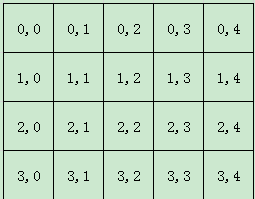
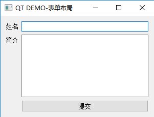
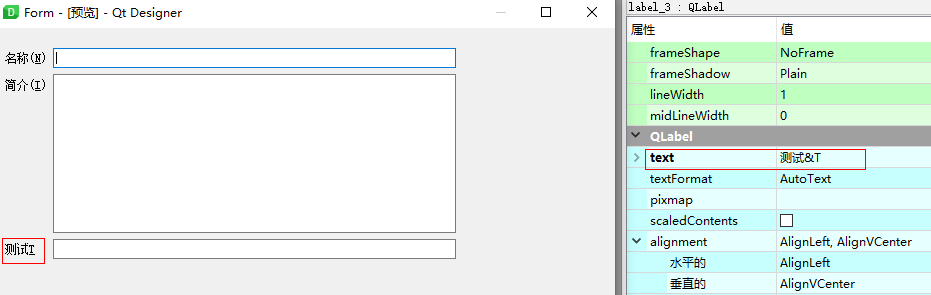

## PyQt5 布局
### 箱式布局
QHBoxLayout和QVBoxLayout是基本的布局类，它们在水平和垂直方向上排列小部件。

```python
#coding = 'utf-8'

import sys
from PyQt5.QtWidgets import (QWidget, QPushButton, QApplication, QHBoxLayout, QVBoxLayout)

class Example(QWidget):
    def __init__(self):
        super().__init__()
        self.Init_UI()
    def Init_UI(self):
        self.setGeometry(300,300,400,300)
        self.setWindowTitle('学点编程吧')

        bt1 = QPushButton('剪刀', self)
        bt2 = QPushButton('石头', self)
        bt3 = QPushButton('布', self)

        hbox = QHBoxLayout()
        hbox.addStretch(1) # 创建拉伸因子, 挤占剩余空间
        hbox.addWidget(bt1)
        hbox.addWidget(bt2)
        hbox.addWidget(bt3)
        hbox.addStretch(1) #增加伸缩量

        vbox = QVBoxLayout()
        vbox.addStretch(1)
        vbox.addLayout(hbox)

        self.setLayout(vbox)

        self.show()
if __name__ == '__main__':
    app = QApplication(sys.argv)
    ex = Example()
    app.exit(app.exec_())
```


### 栅格布局

栅格布局将位于其中的窗口部件放入一个网状的栅格之中。QGridLayout需要将提供给它的空间划分成的行和列，并把每个窗口部件插入并管理到正确的单元格。
栅格布局是这样工作的：它计算了位于其中的空间，然后将它们合理的划分成若干个行（row）和列（column），并把每个由它管理的窗口部件放置在合适的单元之中，这里所指的单元（cell）即是指由行和列交叉所划分出来的空间。

坐标分布:




```python
import sys
from PyQt5.QtWidgets import (
    QSizePolicy, QWidget, QPushButton, QApplication, QGridLayout, QLCDNumber)


class Example(QWidget):
    def __init__(self):
        super().__init__()
        self.Init_UI()

    def Init_UI(self):
        grid = QGridLayout()
        self.setLayout(grid) # 设置窗口布局

        self.setGeometry(300, 300, 400, 300)
        self.setWindowTitle('QT DEMO-计算器')

        self.lcd = QLCDNumber()
        # self.lcd.setSizePolicy(QSizePolicy.Policy.Expanding, QSizePolicy.Policy.Expanding)
        grid.addWidget(self.lcd, 0, 0, 3, 0)  # 表示从位置(0, 0) 开始, 占用3行整列
        grid.setSpacing(10) # This function sets both the vertical and horizontal spacing to `spacing`.

        names = ['Cls', 'Bc', '', 'Close',
                 '7', '8', '9', '/',
                 '4', '5', '6', '*',
                 '1', '2', '3', '-',
                 '0', '.', '=', '+']

        positions = [(i, j) for i in range(4, 9) for j in range(4, 8)]
        for position, name in zip(positions, names):
            if name == '':
                continue
            button = QPushButton(name)

            # 设置水平和垂直拉升调整大小的类型策略
            # 有些策略会导致箱式布局中setRowStretch, setColumnStretch失效
            button.setSizePolicy(QSizePolicy.Policy.Minimum, QSizePolicy.Policy.Minimum) 
            # print(button.sizePolicy().horizontalPolicy(), button.sizePolicy().verticalPolicy())
            grid.addWidget(button, *position)
            button.clicked.connect(self.Cli)

        # grid.setRowStretch(0, 100)
        # grid.setRowStretch(1, 100)
        # grid.setRowStretch(2, 100)

        # 设置某一行的拉伸因子
        grid.setRowStretch(4, 100)
        grid.setRowStretch(5, 500)
        grid.setRowStretch(6, 300)
        grid.setRowStretch(7, 200)
        grid.setRowStretch(8, 600)


        self.show()

    def Cli(self):
        sender = self.sender().text()
        ls = ['/', '*', '-', '=', '+']
        if sender in ls:
            self.lcd.display('A')
        else:
            self.lcd.display(sender)


if __name__ == '__main__':
    app = QApplication(sys.argv)
    ex = Example()
    app.exit(app.exec_())
```


### 表单布局

QFormLayout管理输入型控件和关联的标签组成的那些Form表单。


QFormLayout是一个方便的布局类，其中的控件以两列的形式被布局在表单中。左列包括标签，右列包含输入控件，例如：QLineEdit、QSpinBox、QTextEdit等。


```python
# coding: utf-8

import sys
from PyQt5.QtWidgets import (
    QWidget, QPushButton, QApplication, QFormLayout, QLabel, QLineEdit, QTextEdit)


class Example(QWidget):
    def __init__(self) -> None:
        super().__init__()
        self.init_UI()
    
    def init_UI(self) -> None:
        self.setGeometry(300, 300, 300, 200)
        self.setWindowTitle("QT DEMO-表单布局")
        
        formLayout: QFormLayout = QFormLayout()
        nameLabel: QLabel = QLabel("姓名")
        nameLineEdit: QLineEdit = QLineEdit("")
        introduceLabel: QLabel = QLabel("简介")
        introduceTextEdit: QTextEdit = QTextEdit("")

        submitButton: QPushButton = QPushButton("提交")

        formLayout.addRow(nameLabel, nameLineEdit) # 添加一行表单控件
        formLayout.addRow(introduceLabel, introduceTextEdit)
        formLayout.addWidget(submitButton) # 添加一个小部件
        

        self.setLayout(formLayout) # 设置窗口布局
        self.show()

if __name__ == "__main__":
    app = QApplication(sys.argv)
    example: Example = Example()
    sys.exit(app.exec_())
```



#### 伙伴编辑(快捷键选中标签绑定的输入框)

意思就是设定label和lineEdit为伙伴关系后，在`QLabel`的`text`中加入`&T`，那么程序运行后，按住Alt+t就相当于单击lineEdit。




