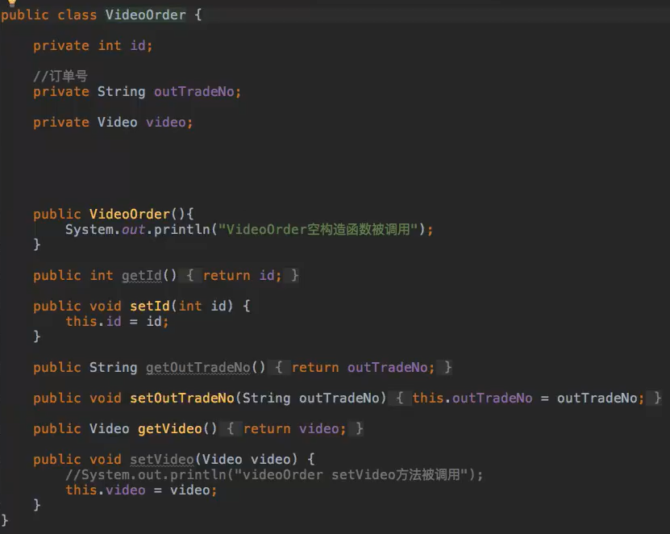
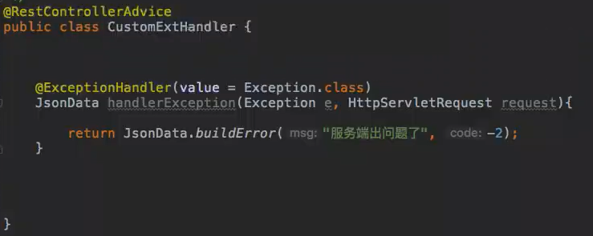

# Spring

## Spring 5.x 子bean父bean

> 注：好多人将parent指向的类说是子类继承了父类，其实说法不正确，正确的说法应该是子bean父bean而不是子类父类，因为如果子bean指定的类已经继承了其他的类，那么在这里一样可以有一个父bean

> 默认情况下，
> ApplicationContext（不是BeanFactory）会预实例化所有singleton的bean。因此很重要的一点是：如果你只想把一个（父）bean定义当作模板使用，而它又指定了class属性，那么你就得将'abstract'属性设置为'true'，否则应用上下文将会（试着）预实例化
> 抽象bean

> 注：由于设置bean定义中设置了abstract="true",因此它不能被容器实例化，只是在此起了模板的作用，供其他bean继承，所以在它的属性在类体中可以不定义，直接在bean的声明中以<proerty/>声明即可。子bean继承他后需要在提供对应的属性和set方法即可，在子bean中就可获取从父bean继承来的值
>
> 如果子bean定义没有指定class属性，它将使用父bean定义的class属性，当然也可以覆盖它。在后面一种情况中，子bean的class属性值必须同父bean兼容，也就是说它必须接受父bean的属性值。
>
> 一个子bean定义可以从父bean继承构造器参数值、属性值以及覆盖父bean的方法，并且可以有选择地增加新的值。如果指定了init-method，destroy-method和/或静态factory-method，它们就会覆盖父bean相应的设置。
>
> 剩余的设置将总是从子bean定义处得到：依赖、自动装配模式、依赖检查、singleton、作用域和延迟初始化

Parent 类

```java
package com.timo.domain;

public class Parent {
    private String name;

    public String getName() {
        return name;
    }

    public void setName(String name) {
        this.name = name;
    }
}
```

Child类

```java
package com.timo.domain;

public class Child {
    private String name;
    private String age;

    public String getName() {
        return name;
    }

    public void setName(String name) {
        this.name = name;
    }

    public String getAge() {
        return age;
    }

    public void setAge(String age) {
        this.age = age;
    }
}
```

配置

```xml
<?xml version="1.0" encoding="UTF-8"?>
<beans xmlns="http://www.springframework.org/schema/beans"
       xmlns:xsi="http://www.w3.org/2001/XMLSchema-instance"
       xmlns:p="http://www.springframework.org/schema/p"
       xmlns:c="http://www.springframework.org/schema/c"
       xmlns:aop="http://www.springframework.org/schema/aop"
       xsi:schemaLocation="http://www.springframework.org/schema/beans
                http://www.springframework.org/schema/beans/spring-beans.xsd
http://www.springframework.org/schema/aop
http://www.springframework.org/schema/aop/spring-aop.xsd">

    <bean id="parent" class="com.timo.domain.Parent">
        <property name="name" value="ouyangfeng"/>
     </bean>
    <!--下面的parent表示这个child的bean的父亲是id=parent的这个类-->
    <bean id="child" class="com.timo.domain.Child" parent="parent">
        <property name="age" value="18"/>
     </bean>
</beans>
```


## Spring 5.x bean自动装配autowire属性

Spring自动注入

- 使用元素的 autowire 属性为一个 bean 定义指定自动装配模式
- **autowire**设置值
  - no：没开启, 默认值
  - byName: 根据bean的id名称，注入到对应的属性里面
  - byType：根据bean需要注入的类型，注入到对应的属性里面
    - 如果按照类型注入，存在2个以上bean的话会抛异常
    - expected single matching bean but found 2
  - constructor: 通过构造函数注入，需要这个类型的构造函数



```xml

<!--<bean id="videoOrder" class="net.xdclass.sp.domain.VideoOrder" autowire="byName">-->
<!--<bean id="videoOrder" class="net.xdclass.sp.domain.VideoOrder" autowire="byType">-->
<bean id="videoOrder" class="net.xdclass.sp.domain.VideoOrder" autowire="constructor">
    <property name="id" value="8" />
    <property name="outTradeNo" value="23432fnfwedwefqwef2"/>
</bean>
```


## CGLIB动态代理和JDK动态代理的区别

- 动态代理与静态代理相比较，最大的好处是接口中声明的所有方法都被转移到调用处理器一个集中的方法中处理，解耦和易维护

 

- 两种动态代理的区别：

  - JDK动态代理：要求目标对象*实现一个接口*，但是有时候目标对象只是一个单独的对象,并没有实现任何的接口,这个时候就可以用CGLib动态代理
  - CGLib动态代理,它是在内存中构建一个子类对象从而实现对目标对象功能的扩展
  - JDK动态代理是自带的，CGlib需要引入第三方包
  - CGLib动态代理基于继承来实现代理，所以无法对final类、private方法和static方法实现代理

   

- Spring AOP中的代理使用的默认策略：

  - 如果目标对象实现了接口，则默认采用JDK动态代理
  - 如果目标对象没有实现接口，则采用CgLib进行动态代理
  - 如果目标对象实现了接扣，程序里面依旧可以指定使用CGlib动态代理


# Spring Boot 配置文件参数

参考[Spring Boot 文档](https://docs.spring.io/spring-boot/docs/current/reference/html/appendix-application-properties.html)


# SpringBoot 快速入门

## 1. SpringBoot 和 SpringCloud的关系

### 1. SpringCloud微服务

传统的单体应用：开发速度慢，启动时间长，依赖庞大

微服务：

- 易开发、了解和维护
- 独立的部署和启动
- 问题：
  - 分布式系统：分布式事务问题
  - 需要管理多个服务：服务治理


SpringCloud 和 SpringBoot的关系：SpringCloud基于SpringBoot


## 2. SpringBoot 2.x 介绍和环境依赖

### 1. 新版SpringBoot2.X介绍

- 官网：https://spring.io/projects/spring-boot
- GitHub地址：https://github.com/spring-projects/spring-boot

- 官方文档：https://spring.io/guides/gs/spring-boot/

## 2. 相关软件环境和作用

- JDK1.8+以上
- Maven3.5+
- 编辑器IDEA(旗舰版)
- PostMan


## 3. 创建SpringBoot项目

使用maven本地创建

```xml
<parent>
    <groupId>org.springframework.boot</groupId>
    <artifactId>spring-boot-starter-parent</artifactId>
    <version>2.3.1.RELEASE</version>
    <relativePath/> <!-- lookup parent from repository -->
</parent>
<dependencies>
    <dependency>
        <groupId>org.springframework.boot</groupId>
        <artifactId>spring-boot-starter</artifactId>
    </dependency>
    <dependency>
        <groupId>org.springframework.boot</groupId>
        <artifactId>spring-boot-starter-test</artifactId>
        <scope>test</scope>
        <exclusions>
            <exclusion>
                <groupId>org.junit.vintage</groupId>
                <artifactId>junit-vintage-engine</artifactId>
            </exclusion>
        </exclusions>
    </dependency>
</dependencies>

<build>
    <plugins>
        <plugin>
            <groupId>org.springframework.boot</groupId>
            <artifactId>spring-boot-maven-plugin</artifactId>
        </plugin>
    </plugins>
</build>
```


## SpringBoot2.x常用注解

- @Controller 作用：用于标记这个类是一个控制器，返回页面的时候使用；如果要返回JSON,则需要在接口上使用@ResponseBody才可以
- @RestController 作用：用于标记这个类是一个控制器，返回JSON数据的时候使用，如果使用这个注解，则接口返回数据会被序列化为JSON
- 所以：@RestController = @Controller+@ResponseBody
- @RequestMapping 作用：路由映射，用于类上做1级路径；用于某个方法上做子路径
- @SpringBootApplication 作用: 用于标记是SringBoot应用，里面包含多个子注解,即

```
@SpringBootApplication = @Configuration+@EnableAutoConfiguration+@ComponentScan

(下面的目前只需简单理解即可，想深入的同学，后续可以看专门的Spring原理课程深入)

@Configuration: 主要标注在某个类上，用于spring扫描注入,一般结合@Bean使用

@EnableAutoConfiguration: 启用Spring的自动加载配置,自动载入应用程序所需的所有Bean

@ComponentScan：告诉spring扫描包的范围，默认是Applocation类所在的全部子包，可以指定其他包

@ComponentScan({"net.xdclass.package1","net.xdclass.package2"})
```


# SpringBoot2.x 开发规范

## 1. SpringBoot2.x 目录结构和静态资源访问

### 1. 目录讲解

- src/main/java：存放代码
- src/main/resources
- static: 存放静态文件，比如 css、js、image, （访问方式 http://localhost:8080/js/main.js）
- templates:存放静态页面jsp,html,tpl
- config:存放配置文件,application.properties
- resources:


**同个文件的加载顺序,静态资源文件 Spring Boot 默认会挨个从**

- META/resources >
- resources >
- static >
- public

里面找是否存在相应的资源，如果有则直接返回，不在默认加载的目录，则找不到

**默认配置**

- spring.resources.static-locations = classpath:/META-INF/resources/,classpath:/resources/,classpath:/static/,classpath:/public/


**其它**

- 基本互联网企业 静态资源文件存储在CDN ，HTML、CSS、图片等
- CDN ： 内容分发网络
- 文件服务器： 阿里云OSS


## 2. 新版SpringBoot2.x启动类位置常见形式

**简介：讲解SpringBoot目录文件结构和官方推荐的目录规范**

三种方式（注意：应用启动的位置，Application启动类位置）

- 三种方式

  - 当启动类和controller在同一类中时，在该类上添加注解@Controller即可；

  - 当启动类和controller分开时，启动类要放在根目录下，启动类上只需要注解@SpringBootApplication；

  - 当启动类和controller分开时，如果启动类在非根目录下，需要在启动类中增加注解@ComponentScan，并配置需要扫描的包名，如(basePackages = )

    @ComponentScan(basePackages ={"net.xdclass.controller","net.xdclass.service"})

> 强烈推荐第二种方式，不然漏配置扫描包，项目庞大，出现问题则难排查


## 3. SpringBoot2.X启动方式讲解和部署

### 启动方式

- IDEA开发中启动
  - 本地开发中常用
- 外置Tomcat中启动
  - 接近淘汰
  - tomcat版本兼容问题复杂
  - 微服务容器化部署复杂
- Jar方式打包启动
  - 官方推荐，工作中最常用
  - 步骤：pom文件新增maven插件

```xml
<build>
    <plugins>
        <plugin>
            <groupId>org.springframework.boot</groupId>
            <artifactId>spring-boot-maven-plugin</artifactId>
        </plugin>
    </plugins>
</build>
如果没有加，则执行jar包 ，报错如下
java -jar spring-boot-demo-0.0.1-SNAPSHOT.jar
no main manifest attribute, in spring-boot-demo-0.0.1-SNAPSHOT.jar
```


## 必备打包、启动命令

```
构建：mvn install
构建跳过测试类 mvn install -Dmaven.test.skip=true 

target目录下有对应的jar包就是打包后项目

进到对应的target目录启动 java -jar xxxxx.jar  即可
想后台运行，就用守护进程 nohup java -jar xxx.jar &
```


#### 打包后Jar包的目录结构

```
example.jar
 |
 +-META-INF
 |  +-MANIFEST.MF
 +-org
 |  +-springframework
 |     +-boot
 |        +-loader
 |           +-<spring boot loader classes>
 +-BOOT-INF
    +-classes
    |  +-mycompany
    |     +-project
    |        +-YourClasses.class
    +-lib
       +-dependency1.jar
       +-dependency2.jar
```


# 实战笔记


#### SpringBoot2.X统一接口返回协议-掌握开发规范

- 存在的问题：协议未统一，缺少业务状态码
- JSONData工具类开发

```java
/**
 * 小滴课堂 接口返回工具类
 */
public class JsonData {

    private int code;

    private Object data;

    private String msg;

    public int getCode() {
        return code;
    }

    public void setCode(int code) {
        this.code = code;
    }

    public Object getData() {
        return data;
    }

    public void setData(Object data) {
        this.data = data;
    }

    public String getMsg() {
        return msg;
    }

    public void setMsg(String msg) {
        this.msg = msg;
    }

    public JsonData(){}

    public JsonData(int code, Object data){
        this.code = code;
        this.data = data;

    }

    public JsonData(int code, Object data, String msg){
        this.code = code;
        this.data =data;
        this.msg = msg;

    }

    public static JsonData buildSuccess(Object data){
        return new JsonData(0,data);
    }

    public static JsonData buildError(String msg){
        return new JsonData(-1,"",msg);
    }


    public static JsonData buildError(String msg,int code){
        return new JsonData(code,"",msg);
    }

}
```

经过转换器转换为Json格式：


#### SpringBoot2.X开发HTTP接口POST请求实战

POST请求-form表单

- 场景：表单提交，如果不用细分PUT/DELETE方法，则都可以用POST
- 注解：@PostMapping = @RequestMapping(method = RequestMethod.POST)


#### 实战RequestBody对象数组提交接口开发

POST请求-RequestBody方式

- 场景：json对象映射，数组对象提交接口开发，（将客户端的Json数据映射为对象）
- 注解：@PostMapping = @RequestMapping(method = RequestMethod.POST)


#### SpringBoot2.X里面定制JSON字段


- 常用框架 阿里 fastjson,谷歌gson等
- JavaBean序列化为Json，
  - 性能：Jackson > FastJson > Gson > Json-lib 同个结构
  - Jackson、FastJson、Gson类库各有优点，各有自己的专长
  - 空间换时间，时间换空间
- jackson处理相关自动（在字段上使用）
  - 指定字段不返回：@JsonIgnore(注意：使用后无法接收前端的密码)
  - 指定日期格式：@JsonFormat(pattern="yyyy-MM-dd hh:mm:ss",locale="zh",timezone="GMT+8")
  - 空字段不返回：@JsonInclude(Include.NON_NULL)
  - 指定别名：@JsonProperty

- 序列化和反序列化操作

```java
//序列化操作
ObjectMapper objectMapper = new ObjectMapper();
String jsonStr = objectMapper.writeValueAsString(list);
System.out.println(jsonStr);
//反序列化操作
List<Video> temp = objectMapper.readValue(jsonStr,List.class);
```


### IDEA中SpringBoot2.X热部署Dev-tool和常见问题

#### 1. 热部署定义

**什么是热部署**

- 应用正在运行的时候升级功能, 不需要重新启动应用
- 对于Java应用程序来说, 热部署就是在运行时更新Java类文件

> 好处：不需要重新手工启动应用，提高本地开发效率


**常见实现热部署的方式**

- Jrebel
- Spring Loaded
- spring-boot-devtools


#### 2. SpringBoot2.X结合dev-tool 实现IDEA项目热部署

步骤：

- pom文件添加依赖包

```xml
<dependency>  
    <groupId>org.springframework.boot</groupId>  
    <artifactId>spring-boot-devtools</artifactId>  
    <optional>true</optional>  
</dependency>
  
  
<build>
    <plugins>
        <plugin>
            <groupId>org.springframework.boot</groupId>
            <artifactId>spring-boot-maven-plugin</artifactId>
            <configuration>
                <fork>true</fork><!--必须添加这个配置-->
            </configuration>
        </plugin>
    </plugins>
</build>
```

- IDEA配置
  
  - idea里面要设置，window和mac一样
  
  
  
  - 使用快捷键打开，选择Registry
  
  ```
  注意默认快捷键：
  	window快捷键 Shift+Ctrl+Alt+/
  	mac快捷键 Shift+Command+Alt+/
  	
  如果自行修改了默认快捷键，则百度搜索相关博文，或者还原快捷键设置
  ```
  
  
  
  - 选择compiler.automake.allow.when.app.running ，重启idea就行！！！
  
  
  
  


### SpringBoot2.x 配置文件

#### SpringBoot2.x常见配置文件形式

#### 常见的配置文件格式

- xml
- propertites
- json
- yaml（`*.yml`、`*.yaml`)

##### SpringBoot xx.yml配置文件

- YAML（Yet Another Markup Language）
- 写 YAML 要比写 XML 快得多(无需关注标签或引号) 使用空格 Space 缩进表示分层，不同层次之间的缩进可以使用不同的空格数目
- 注意：key后面的冒号，后面一定要跟一个空格,树状结构

```yaml
server:
  port: 8080  //设置启动端口号为8080
  
house:
  family:
    name: Doe
    parents:
      - John
      - Jane
    children:
      - Paul
      - Mark
      - Simone
  address:
    number: 34
    street: Main Street
    city: Nowheretown
    zipcode: 12345
```

##### Springboot里面常用 xx.properties（推荐）

```properties
server.port=8082

#session失效时间，30m表示30分钟
server.servlet.session.timeout=30m

# Maximum number of connections that the server accepts and processes at any given time.
server.tomcat.max-connections=10000 

# Maximum size of the HTTP post content.
server.tomcat.max-http-post-size=2MB 
server.tomcat.max-http-form-post-size=2MB


# Maximum amount of worker threads
server.tomcat.max-threads=200
```


**官方文档配置**

https://docs.spring.io/spring-boot/docs/2.3.0.BUILD-SNAPSHOT/reference/htmlsingle/#core-properties

如果需要修改，直接复制对应的配置文件加到application.properties里面，一般不需要调整


### 新版SpringBoot注解配置文件映射属性和实体类实战

#### 配置文件加载方式

##### 方式一

- 1、Controller上面配置 @PropertySource({"classpath:resource.properties"})
- 2、增加属性 @Value("${test.name}") private String name;

##### 方式二：实体类配置文件

- 1、添加 @Component注解；

- 2、使用 @PropertySource 注解指定配置文件位置；

- 3、使用 @ConfigurationProperties 注解，自动设置相关属性；

- 4、必须 通过注入IOC对象Resource 进来 ， 才能在类中使用获取的配置文件值。

  @Autowired private ServerSettings serverSettings;

```
例子：
@Configuration
@ConfigurationProperties(prefix="test")
@PropertySource(value="classpath:resource.properties")
public class ServerConstant {

}

常见问题：

1、配置文件注入失败，Could not resolve placeholder
解决：根据springboot启动流程，会有自动扫描包没有扫描到相关注解, 
默认Spring框架实现会从声明@ComponentScan所在的类的package进行扫描，来自动注入，
因此启动类最好放在根路径下面，或者指定扫描包范围
spring-boot扫描启动类对应的目录和子目录


2、注入bean的方式，属性名称和配置文件里面的key一一对应，就用加@Value 这个注解
如果不一样，就要加@value("${XXX}")
```


```properties
jdbc.url=jdbc:mysql://localhost:3306/test
jdbc.user=root
jdbc.password=1234
```

> 对于list，set数据
>
> ```properties
> my.servers[0]=dev.example.com
> my.servers[1]=another.example.com
> ```


```java
package com.smilejack.config;


import org.springframework.boot.context.properties.ConfigurationProperties;
import org.springframework.context.annotation.Configuration;
import org.springframework.context.annotation.PropertySource;

@Configuration
@ConfigurationProperties(prefix = "jdbc")
@PropertySource(value = "classpath:jdbcConfig.properties")
public class JdbcConfig {

    private String user;
    private  String password;
    private String url;

    public JdbcConfig() {}
    

    public String getUser() {
        return user;
    }

    public void setUser(String user) {
        this.user = user;
    }

    public String getPassword() {
        return password;
    }

    public void setPassword(String password) {
        this.password = password;
    }

    public String getUrl() {
        return url;
    }

    public void setUrl(String url) {
        this.url = url;
    }

    @Override
    public String toString() {
        return "JdbcConfig{" +
                "user='" + user + '\'' +
                ", password='" + password + '\'' +
                ", url='" + url + '\'' +
                '}';
    }
}
```


### 项目实战中的Springboot2.X单元测试应用

### 测试基础

测试流程

- 需求分析->设计->开发->测试->上线


测试里面的种类

- 单元测试
  - 完成最小的软件设计单元的验证工作，目标是确保模块被正确的编码
- 黑盒测试
  - 不考虑内部结构，主要测试功能十分满足需求
- 白盒测试
  - 针对代码级别，测试开发工程师一般具备白盒测试能力，针对程序内部的逻辑结构进行代码级别的测试
- 回归测试
  - 对原先提出的缺陷进行二次验证，开发人员修复后进行二次的验证
- 集成测试
  - 测试模块和模块之间的整合，且测试主要的业务功能
- 系统测试
  - 针对整个产品系统进行的测试，验证系统是否满足产品业务需求

### SpringBoot2.x单元测试

引入相关依赖

```xml
<!--springboot程序测试依赖，如果是自动创建项目默认添加-->
 <dependency>
<groupId>org.springframework.boot</groupId>
<artifactId>spring-boot-starter-test</artifactId>
<scope>test</scope>
</dependency>


<dependency>
			<groupId>junit</groupId>
			<artifactId>junit</artifactId>
			<version>4.12</version>
			<scope>test</scope>
</dependency>
```

配置相关注解

```xml
@RunWith(SpringRunner.class)  //底层用junit  SpringJUnit4ClassRunner
@SpringBootTest(classes={XdclassApplication.class})//启动整个springboot工程；如果启动类是在三层包所在的目录时可以不设置classes属性
public class SpringBootTests { }
```


常用单元测试的注解

- @before：测试方法执行之前执行的方法
- @Test：测试方法
- @After：测试方法执行之后执行的方法


断言

- 判断程序结果是否符合预期 TestCase.assertXXX


#### 单元测试调用Controller-Service层接口

案例实战 Controller层登录方法测试

```java
 	@Autowired
    private UserController userController;

    @Test
    public void loginTest(){

        User user = new User();
        user.setUsername("jack");
        user.setPwd("1234");

        JsonData jsonData  = userController.login(user);

        System.out.println(jsonData.toString());

        TestCase.assertEquals(0,jsonData.getCode());

    }
```

案例实战 视频列表Service层单元测试

```java
	@Autowired
    private VideoService videoService;


    @Test
    public void testVideoList(){

        List<Video> videoList = videoService.listVideo();

        TestCase.assertTrue(videoList.size()>0);

    }
```

 

#### MockMvc案例实战调用Controller层API接口

- 如何测试Controller对外提供的接口
  - 增加类注解 @AutoConfigureMockMvc
  - 注入一个MockMvc类
  - 相关API ：
    - perform执行一个RequestBuilder请求
    - andExpect：添加ResultMatcher->MockMvcResultMatchers验证规则
    - andReturn：最后返回相应的MvcResult->Response
- 案例：在线教育VideoController 视频列表接口 单元测试

```java
@Autowired
    private MockMvc mockMvc;

    @Test
    public void testVideoListApi()throws Exception{

       MvcResult mvcResult =  mockMvc.perform(MockMvcRequestBuilders.get("/api/v1/pub/video/list"))
                .andExpect(MockMvcResultMatchers.status().isOk()).andReturn();

       int status = mvcResult.getResponse().getStatus();

       System.out.println(status);

        //会乱码
        //String result = mvcResult.getResponse().getContentAsString();

        // 使用下面这个，增加 编码 说明，就不会乱码打印
        String result = mvcResult.getResponse().getContentAsString(Charset.forName("utf-8"));

       System.out.println(result);

    }
```


### Springboot2.X全局异常处理

#### SpringBoot2.x全局异常处理

- 为什么要配置全局异常？
  - 不配全局服务端报错场景 1/0、空指针等
- 配置好处
  - 统一的错误页面或者错误码
  - 对用户更友好
- Springboot2.X怎么在项目中配置全局异常
  - 类添加注解
    - @ControllerAdvice，如果需要返回json数据，则方法需要加@ResponseBody
    - @RestControllerAdvice, 默认返回json数据，方法不需要加@ResponseBody
  - 方法添加处理器
    - 捕获全局异常,处理所有不可知的异常
    - @ExceptionHandler(value=Exception.class)




#### SpringBoot2.x自定义全局异常返回页面

- 返回自定义异常界面，需要引入thymeleaf依赖(非必须，如果是简单的html界面则不用)

```xml
<dependency>
	   <groupId>org.springframework.boot</groupId>
	   <artifactId>spring-boot-starter-thymeleaf</artifactId>
</dependency>
```

- resource目录下新建templates,并新建error.html

```java
ModelAndView modelAndView = new ModelAndView();
modelAndView.setViewName("error.html");
modelAndView.addObject("msg", e.getMessage());
return modelAndView;
```


### 新版Servlet3.0和SpringBoot2.X过滤器-拦截器实战

#### SpringBoot2.X过滤器讲解

**SpringBoot2.X过滤器讲解**

- 什么是过滤器

  - filter简单理解：人--->检票员（filter）---> 景点

- SpringBoot2.X里面的过滤器

  ```
  ApplicationContextHeaderFilter
  OrderedCharacterEncodingFilter
  OrderedFormContentFilter
  OrderedRequestContextFilter
  ```

   

- 那么多过滤器，哪个优先级高呢？

  - Ordered.HIGHEST_PRECEDENCE Ordered.LOWEST_PRECEDENCE

    低位值意味着更高的优先级 Higher values are interpreted as lower priority

- 自定义Filter，避免和默认的Filter优先级一样，不然会冲突

- 注册Filter配置两种方式

  - bean FilterRegistrationBean
  - Servlet3.0 webFileter

#### 新版Servlet3.0的注解开发自定义Filter

- 使用Servlet3.0的注解进行配置步骤
  - 启动类里面增加 @ServletComponentScan，进行扫描
  - 新建一个Filter类，implements Filter，并实现对应的接口
  - @WebFilter 标记一个类为filter，被spring进行扫描
  - urlPatterns：拦截规则，支持正则
  - 控制chain.doFilter的方法的调用，来实现是否通过放行
  - 不放行，web应用resp.sendRedirect("/index.html") 或者 返回json字符串


注解方式扫描过滤器

```java
@SpringBootApplication
@ServletComponentScan
public class SpringBootFiFilterApplication {

    public static void main(String[] args) {
        SpringApplication.run(SpringBootFiFilterApplication.class, args);
    }

}
```

Java类注册过滤器

```java
public class LogCostFilter implements Filter {
    @Override
    public void init(FilterConfig filterConfig) throws ServletException {
 
    }
 
    @Override
    public void doFilter(ServletRequest servletRequest, ServletResponse servletResponse, FilterChain filterChain) throws IOException, ServletException {
        long start = System.currentTimeMillis();
        filterChain.doFilter(servletRequest,servletResponse);
        System.out.println("Execute cost="+(System.currentTimeMillis()-start));
    }
 
    @Override
    public void destroy() {
 
    }
}
```


```java
@Configuration
public class FilterConfig {
 
    @Bean
    public FilterRegistrationBean registFilter() {
        FilterRegistrationBean registration = new FilterRegistrationBean();
        registration.setFilter(new LogCostFilter());
        registration.addUrlPatterns("/*");
        registration.setName("LogCostFilter");
        registration.setOrder(1);
        return registration;
    }
 
}
```


@Order(1)：表示过滤器的顺序，假设我们有多个过滤器，你如何确定过滤器的执行顺序？这个注解就是规定过滤器的顺序。
 @WebFilter：表示这个class是过滤器。
 里面的参数，filterName 为过滤器名字，urlPatterns 为过滤器的范围，initParams 为过滤器初始化参数。
 过滤器里面的三个方法
 init ： filter对象只会创建一次，init方法也只会执行一次。
 doFilter ： 主要的业务代码编写方法，可以多次重复调用
 destroy ： 在销毁Filter时自动调用（程序关闭或者主动销毁Filter）。

```java
@Order(1)
@WebFilter(filterName = "piceaFilter", urlPatterns = "/*" , initParams = {
        @WebInitParam(name = "URL", value = "http://localhost:8080")})
public class PiceaFilter implements Filter {

    private String url;
    /**
     * 可以初始化Filter在web.xml里面配置的初始化参数
     * filter对象只会创建一次，init方法也只会执行一次。
     * @param filterConfig
     * @throws ServletException
     */
    @Override
    public void init(FilterConfig filterConfig) throws ServletException {
        this.url = filterConfig.getInitParameter("URL");
        System.out.println("我是过滤器的初始化方法！URL=" + this.url +  "，生活开始.........");
    }

    /**
     * 主要的业务代码编写方法
     * @param servletRequest
     * @param servletResponse
     * @param filterChain
     * @throws IOException
     * @throws ServletException
     */
    @Override
    public void doFilter(ServletRequest servletRequest, ServletResponse servletResponse, FilterChain filterChain) throws IOException, ServletException {
        System.out.println("我是过滤器的执行方法，客户端向Servlet发送的请求被我拦截到了");
        filterChain.doFilter(servletRequest, servletResponse);
        System.out.println("我是过滤器的执行方法，Servlet向客户端发送的响应被我拦截到了");
    }

    /**
     * 在销毁Filter时自动调用。
     */
    @Override
    public void destroy() {
        System.out.println("我是过滤器的被销毁时调用的方法！，活不下去了................" );
    }
}
```


- 场景：权限控制、用户登录状态控制，也可以交给拦截器处理等


#### 前后端分离-自定义Filter 未登录json错误码提示开发

```java
private void renderJson(HttpServletResponse response,String json){

        response.setCharacterEncoding("UTF-8");
        response.setContentType("application/json");

        try(PrintWriter writer = response.getWriter()){
            writer.print(json);
        }catch (Exception e){
            e.printStackTrace();
        }

}
```


#### **使用 Servlet3.0的注解自定义原生Servlet**

- javaweb的使用doPost和doGet方法使用Servlet3.0替代更轻量级

```java
@WebServlet(name = "userServlet", urlPatterns = "/api/v1/test/customs" )
class UserServlet extends HttpServlet {

    @Override
    protected void doGet(HttpServletRequest req, HttpServletResponse resp) throws ServletException, IOException {

        PrintWriter writer = resp.getWriter();
        writer.write("this is my custom servlet");
        writer.flush();
        writer.close();

    }

    @Override
    protected void doPost(HttpServletRequest req, HttpServletResponse resp) throws ServletException, IOException {
        this.doGet(req,resp);
    }

}
```


#### Servlet3.0+SpringBoot2.X 注解Listener常用监听器

- 监听器：应用启动监听器，会话监听器，请求监听器
- 作用
  - ServletContextListener 应用启动监听
  - HttpSessionLisener 会话监听
  - ServletRequestListener 请求监听
- 常用的监听器 ServletContextListener、HttpSessionListener、ServletRequestListener)

```java
@WebListener
public class RequestListener implements ServletRequestListener {

    @Override
    public void contextDestroyed(ServletContextEvent sce) {
            System.out.println("======contextDestroyed========");
    }

    @Override
    public void contextInitialized(ServletContextEvent sce) {
            System.out.println("======contextInitialized========");

    }
}
```


#### 新版SpringBoot2.X拦截器配置实战

- 拦截器： 和过滤器用途基本类似

- SpringBoot2.x使用步骤

  - SpringBoot2.X 新版本配置拦截器 implements WebMvcConfigurer

    - 自定义拦截器 HandlerInterceptor
      - preHandle：调用Controller某个方法之前
      - postHandle：Controller之后调用，视图渲染之前，如果控制器Controller出现了异常，则不会执行此方法
      - afterCompletion：不管有没有异常，这个afterCompletion都会被调用，用于资源清理

     

  - 按照注册顺序进行拦截，先注册，先被拦截

拦截器类

```java
public class LogCostInterceptor implements HandlerInterceptor {
    long start = System.currentTimeMillis();
    @Override
    public boolean preHandle(HttpServletRequest httpServletRequest, HttpServletResponse httpServletResponse, Object o) throws Exception {
        start = System.currentTimeMillis();
        return true;
    }
 
    @Override
    public void postHandle(HttpServletRequest httpServletRequest, HttpServletResponse httpServletResponse, Object o, ModelAndView modelAndView) throws Exception {
        System.out.println("Interceptor cost="+(System.currentTimeMillis()-start));
    }
 
    @Override
    public void afterCompletion(HttpServletRequest httpServletRequest, HttpServletResponse httpServletResponse, Object o, Exception e) throws Exception {
    }
}
```

配置类

```java
@Configuration
public class InterceptorConfig extends WebMvcConfigurerAdapter {
 
    @Override
    public void addInterceptors(InterceptorRegistry registry) {
        registry.addInterceptor(new LogCostInterceptor()).addPathPatterns("/**");
        super.addInterceptors(registry);
    }
}
```


拦截器不生效常见问题：

```
- 是否有加@Configuration
- 拦截路径是否有问题 **  和 * 
- 拦截器最后路径一定要 /**  如果是目录的话则是 /*/
```


**和Filter过滤器的区别**

```
Filter和Interceptor二者都是AOP编程思想的体现，功能基本都可以实现

拦截器功能更强大些，Filter能做的事情它都能做

Filter在只在Servlet前后起作用，而Interceptor够深入到方法前后、异常抛出前后等

filter依赖于Servlet容器即web应用中，而Interceptor不依赖于Servlet容器所以可以运行在多种环境。

在接口调用的生命周期里，Interceptor可以被多次调用，而Filter只能在容器初始化时调用一次。
	
Filter和Interceptor的执行顺序
 	
过滤前->拦截前->action执行->拦截后->过滤后
```


补充知识点

```
如何配置不拦截某些路径？
registry.addInterceptor(new LoginIntercepter()).addPathPatterns("/api/v1/pri/**")
//配置不拦截某些路径，比如静态资源
.excludePathPatterns("/**/*.html","/**/*.js"); 
```


### SpringBoot2.X整合定时任务和异步任务

#### SpringBoot2.X定时任务schedule讲解

- 什么是定时任务，使用场景
  - 某个时间定时处理某个任务
  - 发邮件、短信等
  - 消息提醒
  - 订单通知
  - 统计报表系统
  - ...
- 常见定时任务
  - Java自带的java.util.Timer类配置比较麻烦，时间延后问题
  - Quartz框架: 配置更简单,xml或者注解适合分布式或者大型调度作业
  - SpringBoot框架自带

 

- SpringBoot使用注解方式开启定时任务
  - 启动类里面 @EnableScheduling开启定时任务，自动扫描
  - 定时任务业务类 加注解 @Component被容器扫描
  - 定时执行的方法加上注解 @Scheduled(fixedRate=2000)  每两秒定期执行一次


#### SpringBoot2.X多种定时任务配置实战

- cron 定时任务表达式 @Scheduled(cron="*/1 * * * * *") 表示每秒
  - crontab 工具 https://tool.lu/crontab/
- fixedRate: 定时多久执行一次（上一次开始执行时间点后xx秒再次执行；）
- fixedDelay: 上一次执行结束时间点后xx秒再次执行


#### SpringBoot2.x异步任务EnableAsync

- 什么是异步任务和使用场景：适用于处理log、发送邮件、短信……等
  - 下单接口->查库存 1000
  - 余额校验 1500
  - 风控用户1000
- 启动类里面使用@EnableAsync注解开启功能，自动扫描
- 定义异步任务类并使用@Component标记组件被容器扫描,异步方法加上@Async

```java
package com.smilejack.task;

import org.springframework.scheduling.annotation.Async;
import org.springframework.stereotype.Component;

@Component
@Async
public class AsyncTask {

    public void task1() {
        try {
            Thread.sleep(1000);
        } catch (InterruptedException e) {
            e.printStackTrace();
        }
        System.out.println("task 1");
    }

    public void task2() {
        try {
            Thread.sleep(1000);
        } catch (InterruptedException e) {
            e.printStackTrace();
        }
        System.out.println("task 2");
    }


    public void task3() {
        try {
            Thread.sleep(1000);
        } catch (InterruptedException e) {
            e.printStackTrace();
        }
        System.out.println("task 3");
    }
}

```

```java
@GetMapping("/testAsync")
public JsonData testAsync() {
    long begin = System.currentTimeMillis();

    asyncTask.task1();
    asyncTask.task2();
    asyncTask.task3();

    long end = System.currentTimeMillis();
    return JsonData.buildSuccess(end - begin);
}
```


#### SpringBoot2.x异步任务Future

定义异步任务类需要获取结果

- 注意点：
  - 要把异步任务封装到类里面，不能直接写到Controller
  - 增加Future 返回结果 AsyncResult("task执行完成");
  - 如果需要拿到结果 需要判断全部的 task.isDone()


```java
package com.smilejack.task;

import org.springframework.scheduling.annotation.Async;
import org.springframework.scheduling.annotation.AsyncResult;
import org.springframework.stereotype.Component;

import java.util.concurrent.Future;

@Component
@Async
public class AsyncTask {

    public Future<String> task4(){
        try {
            Thread.sleep(1000);
        } catch (InterruptedException e) {
            e.printStackTrace();
        }

        System.out.println("task 4");

        return new AsyncResult<>("task4");
    }

    public Future<String> task5(){
        try {
            Thread.sleep(2000);
        } catch (InterruptedException e) {
            e.printStackTrace();
        }

        System.out.println("task 5");

        return new AsyncResult<>("task5");
    }

}

```


```java
@GetMapping("/testAsyncWithResult")
public JsonData testAsyncWithResult() {
    long begin = System.currentTimeMillis();

    Future<String> future4 = asyncTask.task4();
    Future<String> future5 = asyncTask.task5();

    for (; ; ) {
        if (future4.isDone() && future5.isDone()) {
            try {
                String task4Result = future4.get();
                System.out.println(task4Result);

                String task5Result = future5.get();
                System.out.println(task5Result);
            } catch (InterruptedException | ExecutionException e) {
                e.printStackTrace();
            } finally {
                break;
            }
        }
    }

    long end = System.currentTimeMillis();
    return JsonData.buildSuccess(end - begin);
}
```


## SpringBoot自定义异常开发和配置

自定义异常 继承 RuntimeException

```java
/**
 * 小滴课堂
 * 自定义异常类
 */
public class XDException extends RuntimeException{

    private Integer code;

    private String msg;

    public XDException(Integer code, String msg){
        this.code = code;
        this.msg = msg;
    }

    public Integer getCode() {
        return code;
    }

    public void setCode(Integer code) {
        this.code = code;
    }

    public String getMsg() {
        return msg;
    }

    public void setMsg(String msg) {
        this.msg = msg;
    }
}
```

开发异常处理器ExceptionHandle

> **因为某些业务需要进行业务回滚。但spring的事务只针对RuntimeException的进行回滚操作。所以需要回滚就要继承RuntimeException**

```java
/**
 * 异常处理类
 */
@ControllerAdvice
public class CustomExceptionHandler {

    private final static Logger logger = LoggerFactory.getLogger(CustomExceptionHandler.class);

    @ExceptionHandler(value = Exception.class)
    @ResponseBody
    public JsonData handle(Exception e){

        logger.error("[ 系统异常 ]{}",e);

        if( e instanceof XDException ){

            XDException xdException = (XDException) e;

            return JsonData.buildError(xdException.getCode(),xdException.getMsg());

        }else {

            return JsonData.buildError("全局异常，未知错误");

        }


    }

}
```


# Maven Pugin

## 打包时包含依赖

```xml
<build>
    <plugins>
        <plugin>
            <groupId>org.springframework.boot</groupId>
            <artifactId>spring-boot-maven-plugin</artifactId>
            <configuration>
                <classifier>exec</classifier>
            </configuration>
        </plugin>
    </plugins>
</build>
```

打包后会生成两个jar文件，其中一个含有`exec`为包含依赖的可执行文件，可以直接`java -jar 包名` 运行