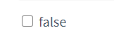
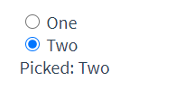
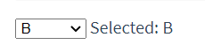
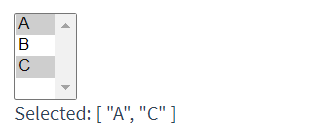
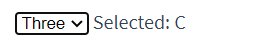

# 基础

## 事件处理

可以用`v-on`指令监听DOM事件，并在触发是运行一些JavaScript代码。

示例：

```html
<div id="example-1">
  <button v-on:click="counter += 1">Add 1</button>
  <p>The button above has been clicked {{ counter }} times.</p>
</div>
```

```js
var example1 = new Vue({
  el: '#example-1',
  data: {
    counter: 0
  }
})
```

### 事件处理

然而许多事件处理逻辑会更为复杂，所以直接把 JavaScript 代码写在 `v-on` 指令中是不可行的。因此 `v-on` 还可以接收一个需要调用的方法名称。

示例：

```html
<div id="example-2">
  <!-- `greet` 是在下面定义的方法名 -->
  <button v-on:click="greet">Greet</button>
</div>
```

```js
var example2 = new Vue({
  el: '#example-2',
  data: {
    name: 'Vue.js'
  },
  // 在 `methods` 对象中定义方法
  methods: {
    greet: function (event) {
      // `this` 在方法里指向当前 Vue 实例
      alert('Hello ' + this.name + '!')
      // `event` 是原生 DOM 事件
      if (event) {
        alert(event.target.tagName)
      }
    }
  }
})

// 也可以用 JavaScript 直接调用方法
example2.greet() // => 'Hello Vue.js!'
```


### 内联处理器中的方法

除了直接绑定到一个方法，也可以在内联 JavaScript 语句中调用方法：

```html
<div id="example-3">
  <button v-on:click="say('hi')">Say hi</button>
  <button v-on:click="say('what')">Say what</button>
</div>
```

```js
new Vue({
  el: '#example-3',
  methods: {
    say: function (message) {
      alert(message)
    }
  }
})
```


有时也需要在内联语句处理器中访问原始的 DOM 事件。可以用特殊变量 `$event` 把它传入方法：

```html
<button v-on:click="warn('Form cannot be submitted yet.', $event)">
  Submit
</button>
```

```js
// ...
methods: {
  warn: function (message, event) {
    // 现在我们可以访问原生事件对象
    if (event) {
      event.preventDefault()
    }
    alert(message)
  }
}
```


### 事件修饰符

在事件处理程序中调用 `event.preventDefault()` 或 `event.stopPropagation()` 是非常常见的需求。尽管我们可以在方法中轻松实现这点，但更好的方式是：方法只有纯粹的数据逻辑，而不是去处理 DOM 事件细节。

为了解决这个问题，Vue.js 为 `v-on` 提供了**事件修饰符**。之前提过，修饰符是由点开头的指令后缀来表示的。

> 事件侦听有两种模式:事件冒泡模式和事件捕获模式.默认为事件冒泡模式.事件冒泡模式中事件的传递方式是从下至上的,即当前元素先处理事件,然后往上然父元素处理事件直到html元素.捕获模式与冒泡模式相反,事件的传递方式是从上至下的,即事件从html元素开始直到当前元素.

- `.stop`: 阻止事件的冒泡
- `.prevent`: 阻止默认事件
- `.capture`: 添加事件侦听器时使用事件捕获的方式
- `.self`:  只当事件在该元素本身(比如不是子元素)触发是触发毁掉
- `.once`: 事件只触发一次
- `.passive`: 与`.prevent`相反,不阻止事件的默认行为

```html
<!-- 阻止单击事件冒泡继续传播 -->
<a v-on:click.stop="doThis"></a>

<!-- 提交事件不再重载页面 -->
<form v-on:submit.prevent="onSubmit"></form>

<!-- 修饰符可以串联 -->
<a v-on:click.stop.prevent="doThat"></a>

<!-- 只有修饰符 -->
<form v-on:submit.prevent></form>

<!-- 添加事件监听器时使用事件捕获模式 -->
<!-- 即内部元素触发的事件先在此处理，然后才交由内部元素进行处理 -->
<div v-on:click.capture="doThis">...</div>

<!-- 只当在 event.target 是当前元素自身时触发处理函数 -->
<!-- 即事件不是从内部元素触发的 -->
<div v-on:click.self="doThat">...</div>
```

> 使用修饰符时，顺序很重要；相应的代码会以同样的顺序产生。因此，用 `v-on:click.prevent.self` 会阻止**所有的点击**，而 `v-on:click.self.prevent` 只会阻止对元素自身的点击。


- 2.1.4 新增

```
<!-- 点击事件将只会触发一次 -->
<a v-on:click.once="doThis"></a>
```

不像其它只能对原生的 DOM 事件起作用的修饰符，`.once` 修饰符还能被用到自定义的[组件事件](https://cn.vuejs.org/v2/guide/components-custom-events.html)上。如果你还没有阅读关于组件的文档，现在大可不必担心。

- 2.3.0 新增

Vue 还对应 [`addEventListener` 中的 `passive` 选项](https://developer.mozilla.org/en-US/docs/Web/API/EventTarget/addEventListener#Parameters)提供了 `.passive` 修饰符。

```
<!-- 滚动事件的默认行为 (即滚动行为) 将会立即触发 -->
<!-- 而不会等待 `onScroll` 完成  -->
<!-- 这其中包含 `event.preventDefault()` 的情况 -->
<div v-on:scroll.passive="onScroll">...</div>
```

这个 `.passive` 修饰符尤其能够提升移动端的性能。

> 不要把 `.passive` 和 `.prevent` 一起使用，因为 `.prevent` 将会被忽略，同时浏览器可能会向你展示一个警告。请记住，`.passive` 会告诉浏览器你*不*想阻止事件的默认行为。


### 按键修饰符

在监听键盘事件时，我们经常需要检查详细的按键。Vue 允许为 `v-on` 在监听键盘事件时添加按键修饰符：

```html
<!-- 只有在 `key` 是 `Enter` 时调用 `vm.submit()` -->
<input v-on:keyup.enter="submit">
```

你可以直接将 [`KeyboardEvent.key`](https://developer.mozilla.org/en-US/docs/Web/API/KeyboardEvent/key/Key_Values) 暴露的任意有效按键名转换为 kebab-case 来作为修饰符。

```html
<input v-on:keyup.page-down="onPageDown">
```

在上述示例中,处理函数只会在`$event.key`等于`PageDown`时被调用.


#### 按键码

> `keyCode` 的事件用法[已经被废弃了](https://developer.mozilla.org/en-US/docs/Web/API/KeyboardEvent/keyCode)并可能不会被最新的浏览器支持。

使用`keyCode`attribute也是允许的:

```html
<input v-on:keyup.13="submit">
```

为了在必要的情况下支持就浏览器,VUe提供了绝大多数常用的按键键码的别名.

- `.enter`
- `.tab`
- `.delete`: 捕获删除和退格键
- `.esc`
- `.space`
- `.up`
- `.down`
- `.left`
- `.right`


> 有一些按键(`.esc`以及所有的方向键)在IE9中有不同的`key`值,如果你想支持IE9,这些内置的别名应该是首选.

你可以通过全局`config.KeyCodes`对象[自定义按键修饰符别名](https://cn.vuejs.org/v2/api/#keyCodes)：

```javascript
// 可以使用 `v-on:keyup.f1`
Vue.config.keyCodes.f1 = 112
```


### 系统修饰键

> 2.1.0 新增

可以用如下修饰符来实现仅在按下相应按键时才触发鼠标或键盘事件的监听器。

- `.ctrl`
- `.alt`
- `.shift`
- `.meta`

> 注意：在 Mac 系统键盘上，meta 对应 command 键 (⌘)。在 Windows 系统键盘 meta 对应 Windows 徽标键 (⊞)。在 Sun 操作系统键盘上，meta 对应实心宝石键 (◆)。在其他特定键盘上，尤其在 MIT 和 Lisp 机器的键盘、以及其后继产品，比如 Knight 键盘、space-cadet 键盘，meta 被标记为“META”。在 Symbolics 键盘上，meta 被标记为“META”或者“Meta”。

例如：

```html
<!-- Alt + C -->
<input v-on:keyup.alt.67="clear">

<!-- Ctrl + Click -->
<div v-on:click.ctrl="doSomething">Do something</div>
```


> 请注意修饰键与常规按键不同，在和 `keyup` 事件一起用时，事件触发时修饰键必须处于按下状态。换句话说，只有在按住 `ctrl` 的情况下释放其它按键，才能触发 `keyup.ctrl`。而单单释放 `ctrl` 也不会触发事件。如果你想要这样的行为，请为 `ctrl` 换用 `keyCode`：`keyup.17`。


#### `.exact`修饰符

> 2.5.0 新增

`.exact`修饰符允许你控制有精确的系统修饰符组合触发的事件.

```html
<!-- 即使 Alt 或 Shift 被一同按下时也会触发 -->
<button v-on:click.ctrl="onClick">A</button>

<!-- 有且只有 Ctrl 被按下的时候才触发 -->
<button v-on:click.ctrl.exact="onCtrlClick">A</button>

<!-- 没有任何系统修饰符被按下的时候才触发 -->
<button v-on:click.exact="onClick">A</button>
```


#### 鼠标按钮修饰符

> 2.2.0 新增

- `.left`
- `.right`
- `.middle`

这些修饰符会限制处理函数仅响应特定的鼠标按钮.


### 为什么在HTML中监听事件?

你可能注意到这种事件监听的方式违背了关注点分离 (separation of concern) 这个长期以来的优良传统。但不必担心，因为所有的 Vue.js 事件处理方法和表达式都严格绑定在当前视图的 ViewModel 上，它不会导致任何维护上的困难。实际上，使用 `v-on` 有几个好处：

1. 扫一眼 HTML 模板便能轻松定位在 JavaScript 代码里对应的方法。
2. 因为你无须在 JavaScript 里手动绑定事件，你的 ViewModel 代码可以是非常纯粹的逻辑，和 DOM 完全解耦，更易于测试。
3. 当一个 ViewModel 被销毁时，所有的事件处理器都会自动被删除。你无须担心如何清理它们。


## 表单输入绑定

### 基础语法

你可以用 `v-model` 指令在表单 `<input>`、`<textarea>` 及 `<select>` 元素上创建双向数据绑定。它会根据控件类型自动选取正确的方法来更新元素。尽管有些神奇，但 `v-model` 本质上不过是语法糖。它负责监听用户的输入事件以更新数据，并对一些极端场景进行一些特殊处理。

> `v-model` 会忽略所有表单元素的 `value`、`checked`、`selected` attribute 的初始值而总是将 Vue 实例的数据作为数据来源。你应该通过 JavaScript 在组件的 `data` 选项中声明初始值。


`v-model` 在内部为不同的输入元素使用不同的 property 并抛出不同的事件：

- text 和 textarea 元素使用 `value` property 和 `input` 事件；
- checkbox 和 radio 使用 `checked` property 和 `change` 事件；
- select 字段将 `value` 作为 prop 并将 `change` 作为事件。

> 对于需要使用[输入法](https://zh.wikipedia.org/wiki/输入法) (如中文、日文、韩文等) 的语言，你会发现 `v-model` 不会在输入法组合文字过程中得到更新。如果你也想处理这个过程，请使用 `input` 事件。


#### 文本

```html
<input v-model="message" placeholder="edit me">
<p>Message is: {{ message }}</p>
```

message的值会随输入的值动态改变


#### 多行文本

```html
<span>Multiline message is:</span>
<p style="white-space: pre-line;">{{ message }}</p>
<br>
<textarea v-model="message" placeholder="add multiple lines"></textarea>
```

> 在文本区域插值 (`<textarea>{{text}}</textarea>`) 并不会生效，应用 `v-model` 来代替。


#### 复选框

单个复选框，绑定到布尔值：

```html
<input type="checkbox" id="checkbox" v-model="checked">
<label for="checkbox">{{ checked }}</label>
```




多个复选框，绑定到同一个数组：

```html
<div id='example-3'>
  <input type="checkbox" id="jack" value="Jack" v-model="checkedNames">
  <label for="jack">Jack</label>
  <input type="checkbox" id="john" value="John" v-model="checkedNames">
  <label for="john">John</label>
  <input type="checkbox" id="mike" value="Mike" v-model="checkedNames">
  <label for="mike">Mike</label>
  <br>
  <span>Checked names: {{ checkedNames }}</span>
</div>
```

```js
new Vue({
  el: '#example-3',
  data: {
    checkedNames: []
  }
})
```


#### 单选按钮

```html
<div id="example-4">
  <input type="radio" id="one" value="One" v-model="picked">
  <label for="one">One</label>
  <br>
  <input type="radio" id="two" value="Two" v-model="picked">
  <label for="two">Two</label>
  <br>
  <span>Picked: {{ picked }}</span>
</div>
```

```js
new Vue({
  el: '#example-4',
  data: {
    picked: ''
  }
})
```



#### 选择框

单选时：

```html
<div id="example-5">
  <select v-model="selected">
    <option disabled value="">请选择</option>
    <option>A</option>
    <option>B</option>
    <option>C</option>
  </select>
  <span>Selected: {{ selected }}</span>
</div>
```

```js
new Vue({
  el: '...',
  data: {
    selected: ''
  }
})
```

> 获取的值为option标签`value`的值,如果没有`value`值则使用option标签的文本值



> 如果 `v-model` 表达式的初始值未能匹配任何选项，`<select>` 元素将被渲染为“未选中”状态。在 iOS 中，这会使用户无法选择第一个选项。因为这样的情况下，iOS 不会触发 change 事件。因此，更推荐像上面这样提供一个值为空的禁用选项。


多选时 (绑定到一个数组)：

```html
<div id="example-6">
  <select v-model="selected" multiple style="width: 50px;">
    <option>A</option>
    <option>B</option>
    <option>C</option>
  </select>
  <br>
  <span>Selected: {{ selected }}</span>
</div>
```

```js
new Vue({
  el: '#example-6',
  data: {
    selected: []
  }
})
```



用 `v-for` 渲染的动态选项：

```html
<select v-model="selected">
  <option v-for="option in options" v-bind:value="option.value">
    {{ option.text }}
  </option>
</select>
<span>Selected: {{ selected }}</span>
```

```js
new Vue({
  el: '...',
  data: {
    selected: 'A',
    options: [
      { text: 'One', value: 'A' },
      { text: 'Two', value: 'B' },
      { text: 'Three', value: 'C' }
    ]
  }
})
```



### 值绑定

对于单选按钮，复选框及选择框的选项，`v-model` 绑定的值通常是静态字符串 (对于复选框也可以是布尔值)：

```html
<!-- 当选中时，`picked` 为字符串 "a" -->
<input type="radio" v-model="picked" value="a">

<!-- `toggle` 为 true 或 false -->
<input type="checkbox" v-model="toggle">

<!-- 当选中第一个选项时，`selected` 为字符串 "abc" -->
<select v-model="selected">
  <option value="abc">ABC</option>
</select>
```

但是有时我们可能想把值绑定到 Vue 实例的一个动态 property 上，这时可以用 `v-bind` 实现，并且这个 property 的值可以不是字符串。


#### 复选框

```html
<input
  type="checkbox"
  v-model="toggle"
  true-value="yes"
  false-value="no"
>
```

```js
// 当选中时
vm.toggle === 'yes'
// 当没有选中时
vm.toggle === 'no'
```

> 这里的 `true-value` 和 `false-value` attribute 并不会影响输入控件的 `value` attribute，因为浏览器在提交表单时并不会包含未被选中的复选框。如果要确保表单中这两个值中的一个能够被提交，(即“yes”或“no”)，请换用单选按钮。


#### 单选按钮

```html
<input type="radio" v-model="pick" v-bind:value="a">
```

```js
// 当选中时
vm.pick === vm.a
```

#### 选择框的选项

```html
<select v-model="selected">
    <!-- 内联对象字面量 -->
  <option v-bind:value="{ number: 123 }">123</option>
</select>
```

```js
// 当选中时
typeof vm.selected // => 'object'
vm.selected.number // => 123
```


### 修饰符

#### `.lazy`

在默认情况下，`v-model` 在每次 `input` 事件触发后将输入框的值与数据进行同步 (除了[上述](https://cn.vuejs.org/v2/guide/forms.html#vmodel-ime-tip)输入法组合文字时)。你可以添加 `lazy` 修饰符，从而转为在 `change` 事件_之后_进行同步：

```html
<!-- 在“change”时而非“input”时更新 -->
<input v-model.lazy="msg">
```


#### `.number`

如果想自动将用户的输入值转为数值类型，可以给 `v-model` 添加 `number` 修饰符：

```html
<input v-model.number="age" type="number">
```

这通常很有用，因为即使在 `type="number"` 时，HTML 输入元素的值也总会返回字符串。如果这个值无法被 `parseFloat()` 解析，则会返回原始的值。


#### `.trim`

如果要自动过滤用户输入的首尾空白字符，可以给 `v-model` 添加 `trim` 修饰符：

```html
<input v-model.trim="msg">
```


### 在组件使用v-model

HTML 原生的输入元素类型并不总能满足需求。幸好，Vue 的组件系统允许你创建具有完全自定义行为且可复用的输入组件。这些输入组件甚至可以和 `v-model` 一起使用！

要了解更多，请参阅组件指南中的[自定义输入组件](https://cn.vuejs.org/v2/guide/components-custom-events.html#自定义组件的-v-model)。


## 组件基础

### 基本示例

这是一个Vue组件的示例:

```js
// 定义一个名为 button-counter 的新组件
Vue.component('button-counter', {
  data: function () {
    return {
      count: 0
    }
  },
  template: '<button v-on:click="count++">You clicked me {{ count }} times.</button>'
})
```

组件是可复用的 Vue 实例，且带有一个名字：在这个例子中是 `<button-counter>`。我们可以在一个通过 `new Vue` 创建的 Vue 根实例中，把这个组件作为自定义元素来使用：

```html
<div id="components-demo">
  <button-counter></button-counter>
</div>
```

```js
new Vue({ el: '#components-demo' })
```

因为组件是可复用的 Vue 实例，所以它们与 `new Vue` 接收相同的选项，例如 `data`、`computed`、`watch`、`methods` 以及生命周期钩子等。仅有的例外是像 `el` 这样根实例特有的选项。


### 组件的复用

你可以将组件进行任意次数的复用：

```
<div id="components-demo">
  <button-counter></button-counter>
  <button-counter></button-counter>
  <button-counter></button-counter>
</div>
```

注意当点击按钮时，每个组件都会各自独立维护它的 `count`。因为你每用一次组件，就会有一个它的新**实例**被创建。


#### `data`必须是一个函数

当我们定义这个`<button-counter>`组件是,你可能会发现它的`data`并不是像这样直接提供一个对象:

```js
data: {
  count: 0
}
```

取而代之的是，**一个组件的 `data` 选项必须是一个函数**，因此每个实例可以维护一份被返回对象的独立的拷贝：

```js
data: function () {
  return {
    count: 0
  }
}
```

如果 Vue 没有这条规则，点击一个按钮就可能会像如下代码一样影响到*其它所有实例*：


### 组件的组织

通常一个应用会以一棵嵌套的组件树的形式来组织：


例如，你可能会有页头、侧边栏、内容区等组件，每个组件又包含了其它的像导航链接、博文之类的组件。

为了能在模板中使用，这些组件必须先注册以便 Vue 能够识别。这里有两种组件的注册类型：**全局注册**和**局部注册**。至此，我们的组件都只是通过 `Vue.component` 全局注册的：

```js
Vue.component('my-component-name', {
  // ... options ...
})
```

全局注册的组件可以用在其被注册之后的任何 (通过 `new Vue`) 新创建的 Vue 根实例，也包括其组件树中的所有子组件的模板中。

到目前为止，关于组件注册你需要了解的就这些了，如果你阅读完本页内容并掌握了它的内容，我们会推荐你再回来把[组件注册](https://cn.vuejs.org/v2/guide/components-registration.html)读完。


### 通过 Prop 向子组件传递数据

早些时候，我们提到了创建一个博文组件的事情。问题是如果你不能向这个组件传递某一篇博文的标题或内容之类的我们想展示的数据的话，它是没有办法使用的。这也正是 prop 的由来。

Prop 是你可以在组件上注册的一些自定义 attribute。当一个值传递给一个 prop attribute 的时候，它就变成了那个组件实例的一个 property。为了给博文组件传递一个标题，我们可以用一个 `props` 选项将其包含在该组件可接受的 prop 列表中：

```js
Vue.component('blog-post', {
  props: ['title'],
  template: '<h3>{{ title }}</h3>'
})
```

一个组件默认可以拥有任意数量的 prop，任何值都可以传递给任何 prop。在上述模板中，你会发现我们能够在组件实例中访问这个值，就像访问 `data` 中的值一样。

一个 prop 被注册之后，你就可以像这样把数据作为一个自定义 attribute 传递进来：

```
<blog-post title="My journey with Vue"></blog-post>
<blog-post title="Blogging with Vue"></blog-post>
<blog-post title="Why Vue is so fun"></blog-post>
```


# 深入了解组件

## 组件注册

### 组件名

在注册一个组件的时候，我们始终需要给它一个名字。比如在全局注册的时候我们已经看到了：

```
Vue.component('my-component-name', { /* ... */ })
```

该组件名就是 `Vue.component` 的第一个参数。

你给予组件的名字可能依赖于你打算拿它来做什么。当直接在 DOM 中使用一个组件 (而不是在字符串模板或[单文件组件](https://cn.vuejs.org/v2/guide/single-file-components.html)) 的时候，我们强烈推荐遵循 [W3C 规范](https://html.spec.whatwg.org/multipage/custom-elements.html#valid-custom-element-name)中的自定义组件名 (字母全小写且必须包含一个连字符)。这会帮助你避免和当前以及未来的 HTML 元素相冲突。

你可以在[风格指南](https://cn.vuejs.org/v2/style-guide/#基础组件名-强烈推荐)中查阅到关于组件名的其它建议。

#### 组件名大小写

定义组件名的方式有两种:

##### 使用kebab-case

```js
Vue.component('my-component-name', { /* ... */ })
```

当使用 kebab-case (短横线分隔命名) 定义一个组件时，你也必须在引用这个自定义元素时使用 kebab-case，例如 `<my-component-name>`。

##### 使用PascalCase

```js
Vue.component('MyComponentName', { /* ... */ })
```

当使用 PascalCase (首字母大写命名) 定义一个组件时，你在引用这个自定义元素时两种命名法都可以使用。也就是说 `<my-component-name>` 和 `<MyComponentName>` 都是可接受的。注意，尽管如此，直接在 DOM (即非字符串的模板) 中使用时只有 kebab-case 是有效的。


### 全局注册

到目前为止,我们只用过`Vue.component`来创建组件:

```js
Vue.component('my-component-name', {
  // ... 选项 ...
})
```

这些组件是**全局注册的**。也就是说它们在注册之后可以用在任何新创建的 Vue 根实例 (`new Vue`) 的模板中。比如：

```js
Vue.component('component-a', { /* ... */ })
Vue.component('component-b', { /* ... */ })
Vue.component('component-c', { /* ... */ })

new Vue({ el: '#app' })
```

```html
<div id="app">
  <component-a></component-a>
  <component-b></component-b>
  <component-c></component-c>
</div>
```

在所有子组件中也是如此，也就是说这三个组件*在各自内部*也都可以相互使用。


### 局部注册

全局注册往往不够理想的.比如,如果你要使用一个想webpack这样的构建系统,全局注册所有的组件意味着即便你已经不再使用一个组件了,它仍然会包含在你最终的构建结果中.这造成了用户下载的JavaScript的无谓的增加.

在这些情况下,你可以通过一个普通的JavaScript对象来定义组件:

```js
var ComponentA = { /* ... */ }
var ComponentB = { /* ... */ }
var ComponentC = { /* ... */ }
```

然后在 `components` 选项中定义你想要使用的组件：

```js
new Vue({
  el: '#app',
  components: {
    'component-a': ComponentA,
    'component-b': ComponentB
  }
})
```

对于 `components` 对象中的每个 property 来说，其 property 名就是自定义元素的名字，其 property 值就是这个组件的选项对象。

注意**局部注册的组件在其子组件中*不可用***。例如，如果你希望 `ComponentA` 在 `ComponentB` 中可用，则你需要这样写：

```js
var ComponentA = { /* ... */ }

var ComponentB = {
  components: {
    'component-a': ComponentA
  },
  // ...
}
```

或者如果你通过 Babel 和 webpack 使用 ES2015 模块，那么代码看起来更像：

```js
import ComponentA from './ComponentA.vue'

export default {
  components: {
    ComponentA
  },
  // ...
}
```

注意在 ES2015+ 中，在对象中放一个类似 `ComponentA` 的变量名其实是 `ComponentA: ComponentA` 的缩写，即这个变量名同时是：

- 用在模板中的自定义元素的名称
- 包含了这个组件选项的变量名


### 模块系统

通过 `import`/`require` 使用一个模块系统.

#### 在模块系统中局部注册